# P25：Talk - Bianca Rosa_ Observability driven development - VikingDen7 - BV1f8411Y7cP

 Good afternoon everyone。

 Today we are in room 355 for the 230 talk all the way from Rio Brazil， Software Developer， Bia。

 with her presentation observability driven development。 Hi， just testing。 Hello。

 I'm super trillate to be here， Picon， and I'm going to talk about observability。

 different development， or more like invite you a little bit to think about observability。

 before things start to crash in production。 I hope you've all been there。

 It's a fun ride when things start crashing production。 So first， just like I've been presented。

 I'm Bianca。 I'm also known as Bia， and from Brazil， Rio more specifically， which is like amazing。

 city， beautiful if you ever want to meet Rio。 It's going to be amazing。

 And we have an amazing Python community in Rio too。

 We use to have meetings every last Saturday of the month before the pandemic。

 So at some point we're going to resume all the meetings and hopefully get back to a more。

 active community。 And right now I'm building something new at a startup called Lumos。

 My focus is engineering， but we are like this super tiny startup， it's still in stealth， mode。

 We work around the field of productivity， identity， and compliance。

 You're going to hear from us soon hopefully。 And previously I worked at Head Hat。

 building a platform for the Ralph Red Systems， and at， Stone， which is like a Brazilian FinTech。

 And most of the time I was working as a backend developer， DevOps engineer， sometimes leading。

 small teams， sometimes doing a little bit of management， but that wasn't for me， so I。

 came back to an IC role。 So before I dive to Jib， I want to talk about how things develop， CI/CD。

 Cloud Infrastructure， Observability。 I also go a lot。

 I'm a Go developer just like I am a Python developer。 I'm still a Waterforce Crash player。

 I grew up playing Pokemon and Ragnarok during countless nights。

 I'm passionate about Coffee and Beer。 When I used to listen， I threw a lot of rock 'n' roll。

 but nowadays I go and I listen to， pop and rag it on so I don't know what happened。

 I think it's the 30s catching up with me。 And I like Wabs， your beauty systems。

 systems architecture， and Python obviously。 Otherwise I wouldn't be here at Python。

 First question is like why do we develop software？ Like why are we software developers？

 I know that some of us think this is going to be just a job， but even if it is， why do。

 we have that job？ Like why is there a need in the market for that？ Why is it such in high demand？

 There are many possible answers to that， but one that I particularly like is that people。

 need it or people want it。 People are the users of first softwares， the end users。

 We can have a lot of discussion of whether this software is going to benefit our society， or not。

 but even if it's something super silly， like gamers or not， people are going to use。

 it and you want people to use it。 So someone's needs have to be met。

 And software is to meet someone's expectations。 Even in machine learning。

 when you don't interact with it directly， you do want something， out of it。

 You want your software to learn something and give you a particular output。

 When you're just studying， you want to get something out of it。

 And what happens when that expectation is a math？ It's a bit hard to manage。

 Sometimes a user wants to load a webpage and it can't。

 A user expects to do something and they just can't。

 They just couldn't do it because software crashes sometimes。

 And not meeting expectations generates a lot of frustration。 And business， that means money。

 We lose money because we're not meeting our users' expectations。 So normally。

 there's frustration and we enter the problem solving mode and start putting， out fires。

 And normally， there's a bug in production。 The developer goes crazy。

 goes insane and tries to fix it right away， especially when， it's a P0 or one bug。

 And we often realize that we don't have enough data。

 We think of observability way too late when there is a problem that is already happening。

 and it's already hard to figure out what's going on。

 So this is sort of an open invitation to live in fight or flight mode， the anxious moment。

 where you have to fix everything super fast because it's broken。 And think about this beforehand。

 What can we do when we're just starting， when we are just creating our POC or MVP or studying。

 our app， what can we do so that when it reaches production， it is easier for us to figure out。

 what's going on。 So I'm going to go through APM logging tools and setting up your application。

 A small problem。 I'm going to talk about good logging practices and a slight more complex performance issue。

 I have to fix that slide and find the root cause of that problem。 First。

 when I talk about observability， I think one of the first things that come to。

 my mind when I'm my background is mostly around back-end development focused to web。

 is that we need an APM logging tool and set up an app。 Most of those apps。

 most of those solutions come with both。 So it's fine to choose one tool or a combination of two。

 There are some famous ones over there。 We have LASX， with LASX search。 We have New Relic。

 We have Datadog。 We have Honecom。 We have LASX tab。 We have Splunk。 I use the couple over my， my。

 my jobs， my， my career。 I don't have like a preference and I don't work for any of these companies。

 So I also like， I'm going to， I actually chose New Relic because it's the one that I have。

 more experience but I like a particular preference。

 It really depends on your use case and you have to go through the functionalities。

 And if you want something to think about and consider like there's open telemetry which。

 I highly consider if you like open source， if you want to like something that is not going。

 to lock you in particular vendor。 Telemetry is going to be like a collection of two export telemetry data and that telemetry。

 data is going to go from your app to a solution。 So New Relic can consume data from open telemetry。

 Datadog can probably do the same。 LASX can probably do the same。

 So you can just learn how to have that data exported in a format that is famous and known， by tools。

 Like I said， New Relic for Datadog。 The reasoning like more。

 more experience and I didn't want to learn something you just， represent here。 It's anxious。

 I'm anxious enough just without learning something new。 So let's not do that。

 And I came up with the most boring example app that I'm learning。 You can come up with this。

 So I am going to open that app and I want to go through it and show how New Relic set。

 up on it。 So let me do that here。 This is our example app。 And New Relic set up here through。

 I have a main。py over there。 And you just import New Relic agent to your app。

 And you initialize it and register。 When you do that in your application。

 New Relic is going to be plug it and going to， look at all of the function calls that you have in your app。

 It's going to inspect your application when it's running in production mode。

 One thing that I've seen is that there's no reason to not do that when you're just starting。

 an app like with New Relic or another tool。 Because it's like four lines of code sometimes。

 So we don't do that because no， we want to do it faster。 But we end up with less data in production。

 So here we have a flashcap， very simple one。 Non-production ready code。 Don't copy that。

 And I also created a database here。 Populated schema。 There are a couple of things here。

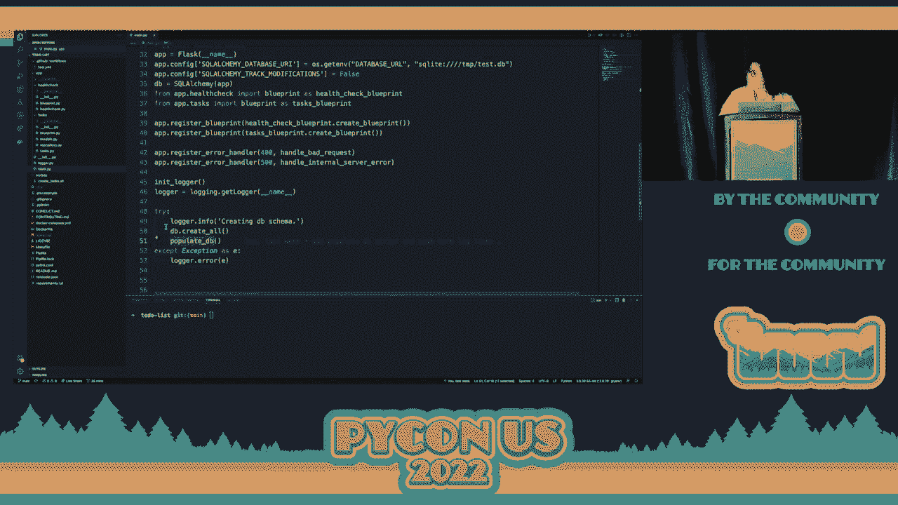

 And when I run like Docker and Compose here， like right here， that Compose app， this application。

 is going to be up and running。 Your key is like about other things that I have here。

 It's going to be on GitHub so you can go to later。

 And I'm going to just make a request to make sure it's working。 We'll bring that here。

 You just have to figure out the whole monitor setup because options。

 So here we have a different kind of postman which is in Sonya。 I really like to。

 So if you ever want to try it out。 You can do a hell check in our app。 We can create a new task。

 I have a cat。 His name is Marcellinum。 I bought a leash for him and I go out with him。 It's funny。

 He has a check talk。 So I can create a task to go out with Marcellinum。

 And there are a couple of things that my app can do。 It's just a to-do list。 It's a very simple one。

 And like I said， we have a new relic setup。 So I'm going to move that to a new window。

 And I will also move that。

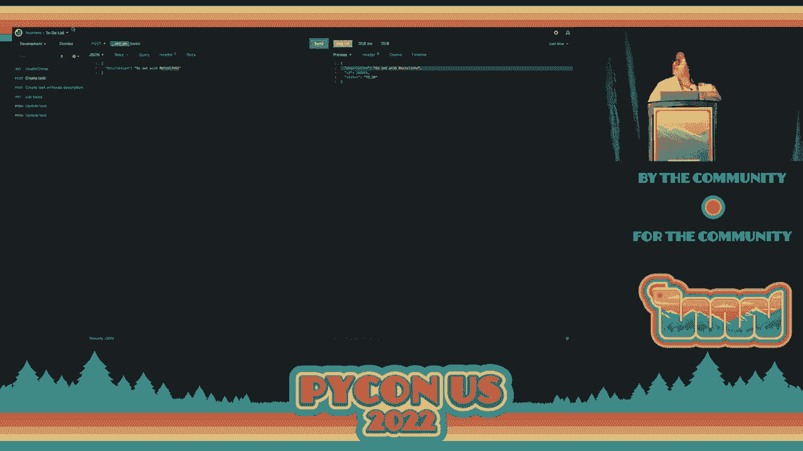

 So whenever there's a new request， I just sent one。

 A new relic is just going to look through my app。 And it's a experimentation platform。

 You can see all the requests that happen。 The transaction is like， OK， there was a patch。

 There was a list task。 There was a create task here。 A hundred rate success。 Slowest trace。

 which is amazing。 One thing that I really like is service maps。 So if it makes external calls。

 like to a service or a post， queries database， it has everything here。

 But I don't work for new relics。 So hope they give me swag after this。 And it also shows logs。

 like something， that is really cool to you。 You can have like infinite point hit。

 And have your log here。 We did a couple of cool things。 And let's go back to the presentation now。

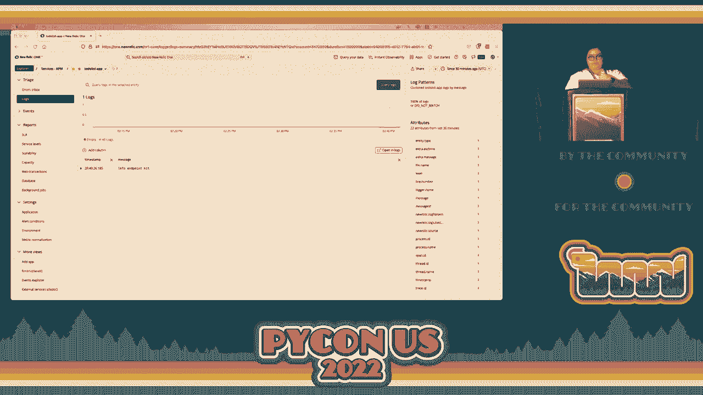

 So probably， what happens if a user tries to add a task， without a description， something like that？

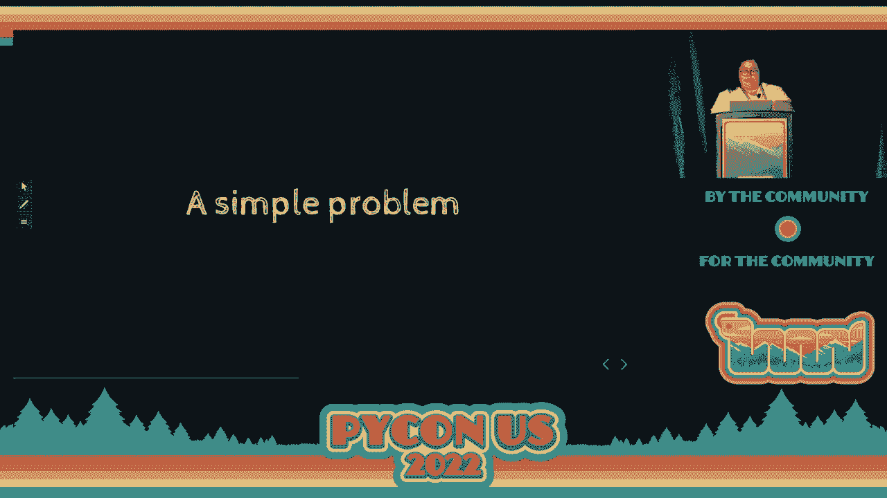

 Let's try that。 I'm going to try to create a task here without a description， like just empty body。

 I know that normally you want to check for that。 The user is going to get feedback。

 But what if you forgot what something happened？ Yours are got internal server error。

 It's complaining。 I cannot create my task。 You talk， you're a bad developer。

 I'm not going to sign up for you to do listening work。 And when you look at the logs。

 you just say like， exception。 OK， exception。 Could not create。 What happened？ Like。

 how can I make that user happy again？ How can I let them know that， oh， OK， what happened is。

 I had to try to create a task without description。 I had a problem。

 I didn't create my API in a way that you would have a good， feedback about it。

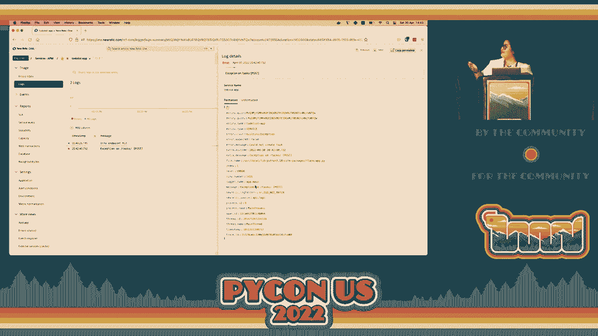

 So how can I make this better to actually give a good， feedback to my user？ We can add logs。

 That's what's missing， like logging。 When we talk about good logging practices， this is like a。

 thing that I really like and I'm very passionate about。 So if you ever want to talk about it。

 DM me on Twitter， let's talk。 I have my very own definition of what's good logging。

 But I didn't dream about it。 And like， OK， it's a personal opinionated， but I was very。

 backed up with researches and open to discussions。

 So you think that I'm talking about something that is not， really--， you don't really agree。

 Let's chat about it。 Let's fight about it。 I'm happy to do so。 When I talk about logging。

 I like plaintext messages， without variables。 So when you look at the logging message that has a。

 variable， it's very nice for you to see， like， OK， a， task was created with an ID X。 Awesome。

 But if you want to group these log messages in a tool like， Splunk or New Relic or Elasticsearch。

 you should write， those logs for a computer to process it， not for a human， to read。

 But I also make it so that a human can read and understand。

 So your log messages should be like plaintext messages， you， should be able to group it。

 and you should be able to actually， like give me all log messages with that message。

 I'm going to have like some of operations of test creators。

 that are having my app if I just did that。 But also， you should have enough information for him to。

 read。 So how can we， like， with plaintext messages without， putting the task ID？

 How can I get that information？ Well， you use extra fields。 So you take Kafka variables or messages。

 You take something called extra fields that Python， standard logging library has。

 And you can use those。 You can add like a big dictionary of variables that are。

 important for that log message。 You put as much info as you can。

 Don't abuse it in the sense that you're going to send， like this huge payload。

 But this user is normally hidden by the full view。 And they are extremely useful。 So you're like。

 put as much info as you can。 Like what customer， what is the request ID， all of that。

 And speaking of request ID， traceability。 We should have like for every web request， we should have。

 unique identifier for it。 And this unique identifier should be present in all of our。

 log messages that are related to that request in order to be。

 able to trace exactly what happened in a particular， request。

 So I've found myself a couple of times with a JSON payload and。

 going through my code to understand where the heck this。

 code broke because I have absolutely no idea。 And I had to like go through read all of the ifs and else。

 and everything to see what would happen。 So if I had a request ID identifier， I would be able to。

 like in good logging， I would be able to see every single， thing that happened。

 I just get the same identifier and get all the messages with， that one。

 I can see every single thing that happened。 So it's amazing。 And also business traceability。

 What happened with that customer？ What's going on with that customer？

 What's the kind of thing that they use in our app？ So something that is really nice to have to。

 like， customer identifiers， to exist in all of the requests in order。

 to measure the experience of a particular customer。

 You can also like create a particular SLA for a sub， set of customers that you have。

 So how do you figure out like， OK， what is the time that a。

 particular request took for a particular customer？ You can do that through logging。

 Keeping track of IDs is something that I really like to。 Like every time that I save an object。

 I write a log line， about it。 And I also keep the ideas and extra。

 field like this allows like using inspection。 Like if I have to ever go through like my database and see。

 like， OK， was that really added？ What's going on with that data and everything？ OK。

 So it gives me like a really good overview of things。

 And the last thing is that we normally go like writing a， log line， just whatever。

 Just going to go log info， log info， everything。 We should be more intentional about logging levels。

 Like， you should know what kind of information you want to。

 see while developing what kind of information is only useful， for production。

 My rule of thumb is that AR is something to pay attention。 Like I should worry。 Info， exact string。

 info in production environment and the， bugs just made for my local development。

 That is like my rule of thumb。 But you can also have like different rules across your， teams。

 Like it's very particular。 But I think that you should be very， very intentional。 And like。

 how can we apply this to like our problem？ Like， how can we literally like get these things that I just。

 said and make our customer happy with the tasks that was， created without the description？

 So there's a cool thing about using a log handler or a， library that is already established。

 That most of the things like request ID traceability are。

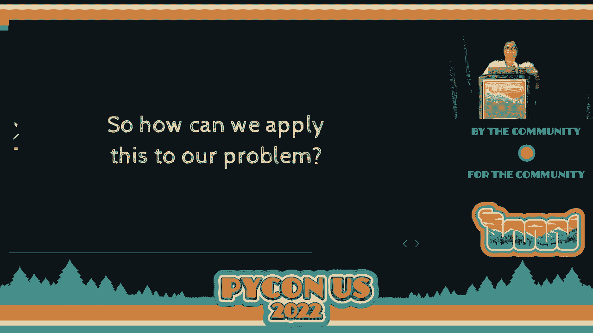

 already set up for us。 So if you look at that log line here that I showed before。

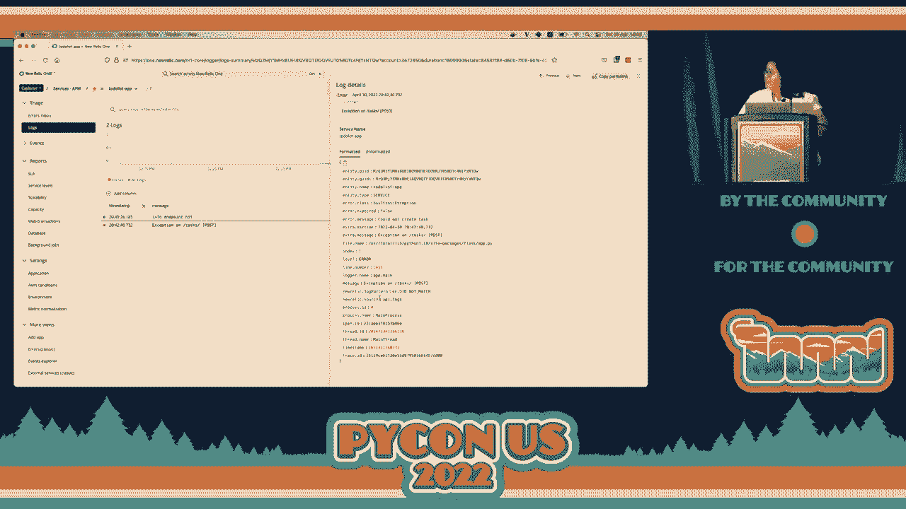

 like there is like a trace ID here， I'm going to make it， bigger so you don't suffer too much。

 There's a trace ID here。 So new runics already， there's a little log handler that is。

 kind of an adapter of Python's log handler that does that。

 So there are a couple of things that are already hit like， file name where the exception happened。

 A couple of things that are already like free for us。 That is happening because of--。

 let me open my to do is that。 That is happening because you don't know， raw error API bigger。

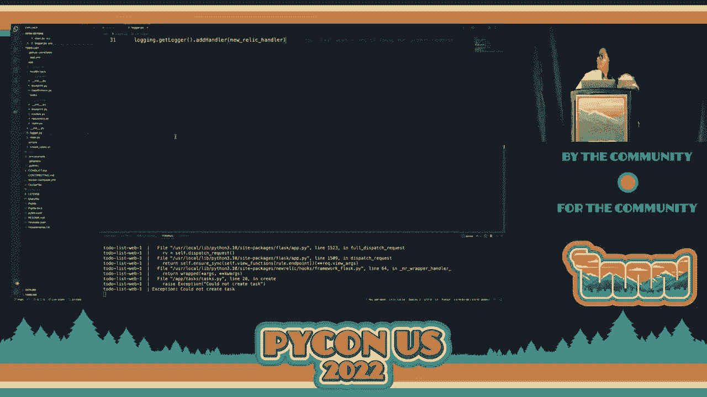

 We're using a new relic log handler that is actually， imported from the already libraries。

 So this is something that I don't have to worry about when。

 using Flask in your relic because it's already like for， free set up for me。

 But we talked about late。 OK， we lost some information。

 So how can we add that here and have more info？ We can add some logs。 So when I create a task--。

 that's the small--， but bye。 We're creating， right？ So we can just come over here。

 We have a logger here。 And I just--， I can just say like， logger， info， creating task。 And we said。

 like， let's use extra fields instead of， putting variables here。

 I'm going to make sure that when creating a task， I'm logging， my body。 OK， we can have that here。

 And other than that， like， when I save a task， it also， like doing the task created。

 Instead of doing like， task created with ID， I just， did task created。 And then I come here。

 I would task ID。 And I can do that。 And， wait， in the case of an exception， you can do， like logger。

 exception， but your message。 And we're tempted to do this， aren't we？ Could not create that。

 And your exception can be an extra field。 I really feel like this makes the lot easier。

 for us to understand where the exception came from。 Because you can see， like， OK。

 that was what happened when， that error in particular happened。 Otherwise。

 you would have to have like very specific， exceptions for every single thing that happened。

 So you could see good errors over there。 I think this has auto-reload unicorn。 So I can probably。

 if the demo gods are with me today， they're not。 Yeah， I don't think they are。 Oh， OK， yeah。

 because I don't know what I'm doing。 I don't know how to write， but I don't anymore。 You see， like。

 name is not defining。 I have to wait。 Do that。 OK。 Let's see if it's you， no。 Wow。

 Just taking a while。 It did take a 10 or so long。 Maybe I do want to lock that as a new or instead。

 an exception。 Oh， no。 I think that's good。 That is OK。 Let's see the log lines there。

 Let's see if we have something new。 We should。 Yes。 So I'll do a little bit。

 So we do have the same exception that we had before。

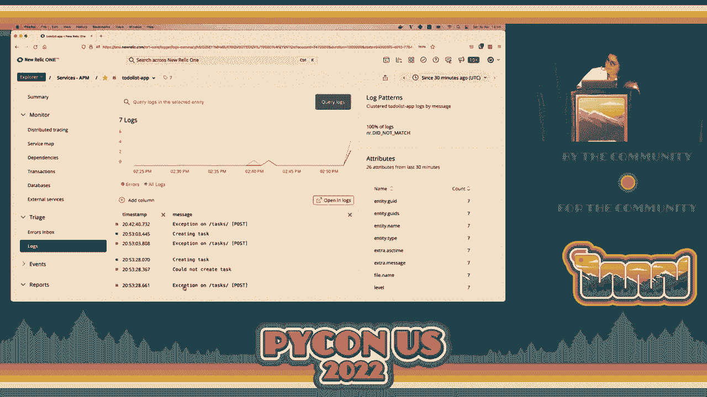

 because it still raises an exception over there。 But we have a message before。

 And these two messages， also， might have my message。 And I can say， oh， OK。 Description。

 violate is not no constraint， because the customer didn't give me the description。

 So I can create a bug。 I can fix that now， and I can actually understand what happened。

 And the trace ID here is also equal to the trace， ID over there。 So， oops。 That's a good laugh。

 It's supposed to be equal to this trace， ID is supposed to be equal to that one。

 So you can actually look through all log messages， with that trace ID， and that should。

 give you a good idea of what happened， with that particular customer， which is super cool。 So， OK。

 First thing， we solved。 And did I forget something？ Yeah。 We did plain tags。 We added extra fields。

 New Relic log_h。 Gave us a little bit more traceability。 We kept track of the IDs。

 We used roughly the right log levels， because those are logs that I care about。

 in a production environment。 I could add even more logs， if I wanted more information。

 in development mode。 So when we get to a slightly more complex performance， issue， like， OK。

 I update a task， and it's going to be fine。

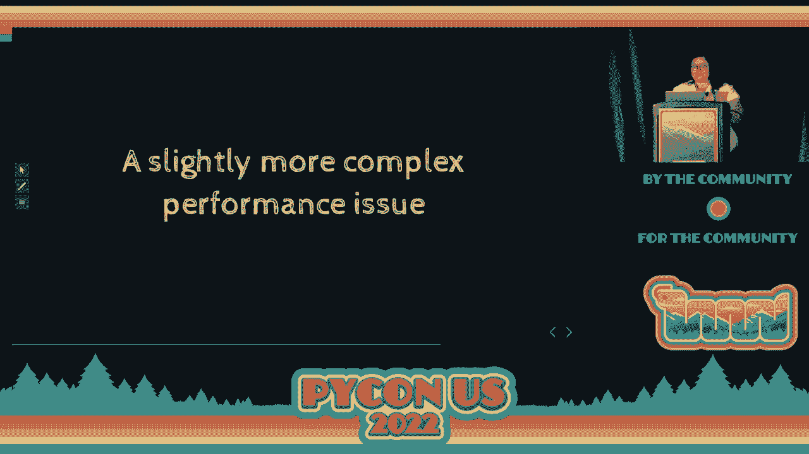

 You're going to see that。 And here， OK。 Update a task。 That task。 And it's fine。 But if I update。

 like， a bunch of tasks， it's going to be extra， extra， extra slow。 So。

 New Relic is going to give us， like， tracing data， for that extra， extra， extra slow。

 I'm doing something very， very wrong。 Very wrong。 So if you look at traces， here you're。

 going to have a couple of trace transactions， slow transactions。 Didn't show yet。

 but I do have one that is already--， I have a backup link here。 OK。 And it really shows， like。

 by segment， like， the direct， [INAUDIBLE]， that I did。 And I really did something very。

 very common when we do， patches that I did one at a time。 So I do 100 select some postgres。

 I do 50 updates， a couple of rowbacks。 And I call the logger API for 50 times for every log line。

 that I did， like， update and task。 So I really did that。 And New Relic is giving me， like， the time。

 the duration， all of that， which is something that 8PMs really do。

 And once you learn how to read that， performance issues， get， like， super easy to fix on your app。

 I am not going to have time to call the actual thing that， is going to fix that。

 But there is a branch here。 Like， I'm going to share that。 Ojuna window。

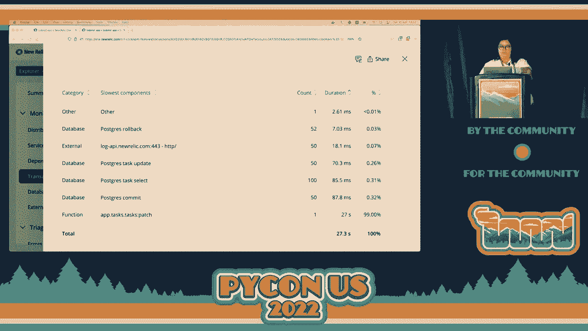

 There are a couple of problems here。 One of them， like we said， like， postgres， was actually--。

 we're adding a select and an update for each task。

 So actually updating your patch to do a bulk save would be， like， the thing to fix here。

 So we get many instead of getting just one。 We do a bulk save here。 That also fixed the 50 updates。

 And we do just one update on postgres， which is awesome。 And for the log--， for the calling the log。

 New Relic log， a couple of times， we're still going to call the API 50 times。

 But we could make it a sync。 So I actually made the log handler asynchronous。

 by creating a sync New Relic log handler。 So the response is going to come back to the user。

 The response time is going to be lower。 And the log is going to be sent to New Relic。

 in a different sync。y。y。 So I'm going to open that PR and leave it right there。

 if you want to check in a little bit。 And let me go back to the presentation。

 We found the root calls。 It was nice。 I once had this problem and I had to process like a roughly。

 8 million messages a day and write for Firestore database。 We had a couple of transactions。

 like 132 per second。 And that was a performance issue because it， was supposed to be real time。

 New Relic showed really easily to me， that my issue， my bottleneck， was a commit on Firestore。

 So that was like a re-okay or Firestore。 I was doing a bunch of updates on Firestore。

 and doing like too many commits。 And that took a lot of time。 When I saw that on New Relic， I。

 was able to do a book update on Firestore。 And that brought it up my performance。

 to like eight times faster。 And it was like great。 It was one of the best feelings in my life。

 I think that's because I'm an nerd。 So in this particular problem， it。

 took us like two months to solve this。 Because we just didn't have the data。

 So I always develop a few of these good login practice， APM monitoring， if you turn down by a flag。

 They often grow too fast。 And observability becomes an issue。 Faster than we are able to foresee。

 So thank you。 Follow me on Twitter for random things in English， Portuguese， sometimes Spanish。

 I own super dams very， very slow， but I was dry。 Slides are here， colds are here。 Thank you so much。

 It was a great talk in here。 [APPLAUSE]。

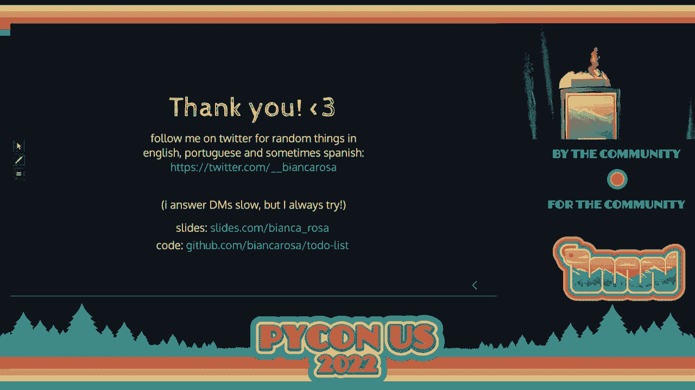

 (applause)。