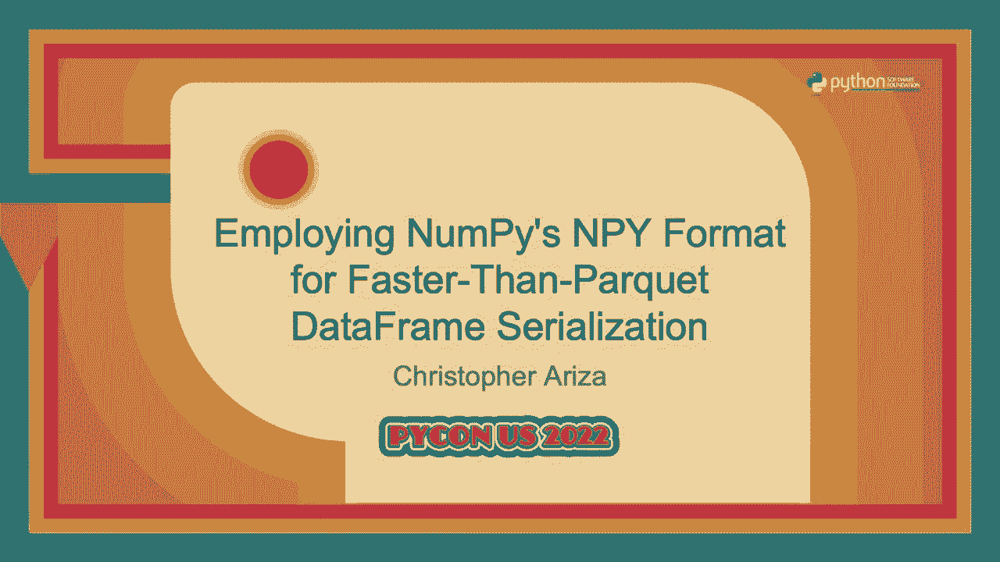
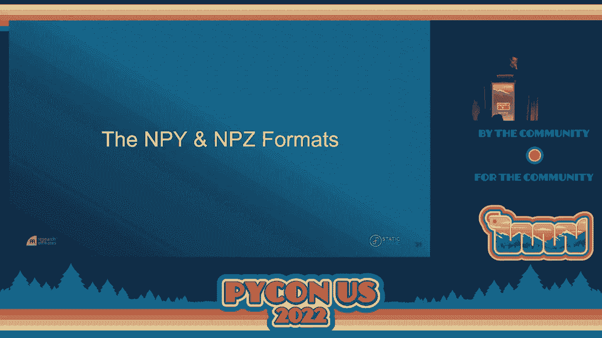
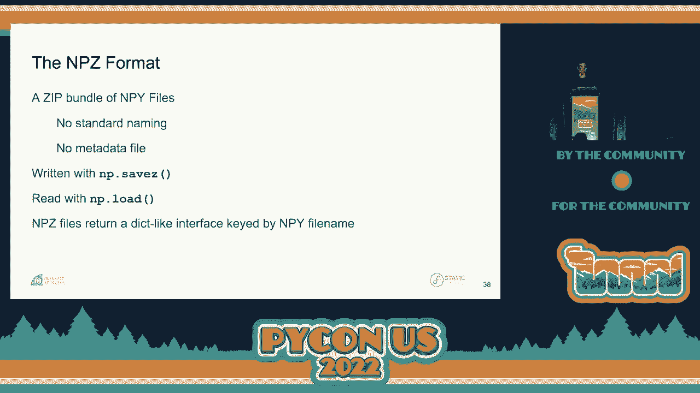
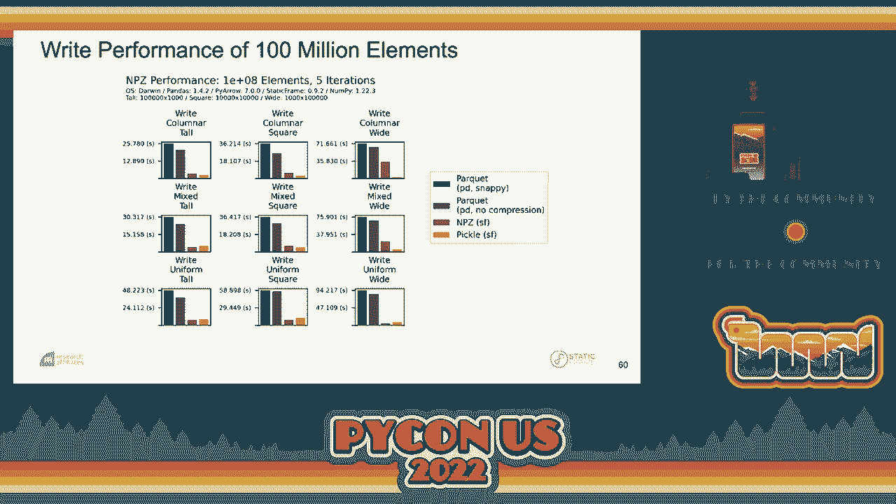

# P31：Talk - Christopher Ariza_ Employing NumPy's NPY Format for Faster Than Parquet D - VikingDen7 - BV1f8411Y7cP

 \>\> Good morning， everyone。 I welcome all of you to this second day of PyConUS 2022。

 Let's welcome Chris to deliver a talk on employing NMPI's NPOF format for faster than。

 parkway data frame civilization。 Thank you。 Good morning and thank you all for coming。

 A little bit about me to begin。 I am CTO at research affiliates。 This is a finance firm。

 located in Newport Beach， California。 I've been a Python programmer since the year 2000。

 My earliest work was in music。 I have a PhD in music and I was a former professor of music。

 technology。 I found ways to use Python and algorithmic composition and computational music， ecology。

 In the last 10 years I have been working on financial systems in Python and。

 that has led me to create an alternative data frame library called static frame。 Static。

 frame is based on an immutable data model， a more consistent interface than pandas and。

 support for all NMPI d types， including Unicode strings， daytime 64 units as well。

 As over those 10 years building financial systems， many of you might be able to relate to a sort。

 of quest to find a complete data frame serialization format。 We have tried many things from CSV。

 XLS， HDF5。 Most recently， parquet has offered the best performance and type retention。 But。

 it's not perfect。 No format supports all components of a data frame and none support。

 all NMPI d types。 If a data frame in Python can be thought of as a collection of NMPI arrays。

 this is the best way to serialize a NMPI array。 Well for that we can go way back to 2007 to。

 NMPI enhancement proposal number one。 Now similar to PEPs， NEPs are proposals to enhance。

 NMPI and this one was proposed by Robert Kern in 2007。 It defines two things。 It defines。

 the NPY file which is a binary file format that can encode all NMPI arrays and the NPs。

 which is simply a zip bundle of NPY files。 Now this format is still supported in NMPI。

 you can use it right now with NP。save， NP。load。 What's really interesting about these NMPI。

 files is we can memory map array data with them and that's something we're going to explore。

 with data frames later on。 So can a data frame then be serialized as a collection of， NMPI files？

 That was sort of my first question。 And so I set off to do this。 The way I first。

 approach it was simply taking all the arrays that are included within the data frame， package。

 them up with an NPZ and my first implementation was using NP save and NP。load。 In addition。

 I created a special metadata file in JSON that I packed into that NPZ to help me fully。

 reconstruct the data frame。 And this worked but it was slower than parquet which was a。

 little disappointing。 Looking into the performance of the NMPI routines。

 I found that if I re-implemented， the NPY and NPZ authoring routines。

 I was able to get massive performance improvements， and end up with something faster than parquet。

 So I'll give you a little taste of that performance。

 If we use pandas here to create a very simple frame of 10，000 square floats and we created。

 data frame with that， we're going to write this out as parquet but because parquet doesn't。

 require that all column labels be strings， we're going to have to convert those column。

 labels to strings。 And then we can go ahead and use pandas to write this data frame out。

 as a parquet file。 And that takes about 10 and a half seconds。 Now if we do build a corresponding。

 frame， an static frame， and we export it， we write it out as an NPZ， that takes 1。42 seconds。

 nearly an order of magnitude better performance for writing out this very， very simple frame。

 What about reading？ Well we can read in that same parquet again using pandas， reading in。

 that parquet file， we can read it into a pandas data frame in about five seconds。 If we do the。

 same thing from an NPZ using static frame， we can do it in about one second。 Not an order。

 of magnitude but a very significant improvement。 Alright， so what we're going to do today is。

 we're going to look at the components of a data frame in detail。 We're going to look。

 at the NPY and NPZ format to get a sense of how we can use these。 We're going to talk。

 about how we encode a data frame in an NPZ。 We'll talk about a few of the things I did。

 to improve NPY performance。 We'll look at some very thorough performance comparisons。

 And finally we'll close by talking about how we can use the NPY now to actually memory。

 map a complete data frame。 After this presentation I hope you gain a clear understanding of data。

 frames and how they're built。 You'll also understand NPY encoding and you'll leave here。

 with more options for serializing and memory mapping data frames。 So let's look at the components。

 of a data frame in depth。 Now the first data frame was introduced back in 1991 as part。

 of the S language。 They've been around for a long time and many libraries and many languages。

 have implemented data frames。 There is really no standard for a data frame but what I'm。

 going to provide for you is how static frame defines a frame。 And you can think of this。

 as a slight superset over the pandas data frame。 So many of you probably worked with。

 data frames but it's important to remember what they are。 They are not a two dimensional， array。

 A two dimensional array has uniform type and access to rows and columns only by， integer。

 With the data frame we get the opportunity to have a table of columnar data where columns。

 have heterogeneous types。 And we can label our rows and columns and access them with things。

 other than integers。 Our labels can be any type， our labels can be hierarchical and those。

 hierarchical depths themselves can have different types。

 In addition data frames have name attributes， attached to the rows。

 the columns and the frame itself。 And these name attributes give us a。

 really convenient way to either have an additional label or rich metadata attached to those components。

 Now I created this schematic diagram of data frame to help us talk through how we are going。

 to encode this entire data frame。 And what I'm showing here are the array components。

 in gray rectangles， the array types in the gray diamonds， the black diamonds are the component。

 types for the index and the columns and the black circles are the component names for columns。

 index and the frame itself。 Now we're going to see this a lot so I'll help you understand。

 it as we go。 But before we do that I want to compare that representation to the representation。

 of static frames standard wrapper of a data frame。 You'll notice this is a richer representation。

 than Panda's representation of a data frame because in static frame we're very concerned。

 about our types。 We want to always show our users what types we have at hand。 And I'm。

 going to relate this representation to what we were looking at previously。 So here I've。

 highlighted in orange and yellow the values of the data frame。 So we can think of this。

 as four or actually two arrays of first integers and then bullions。 This is the data。

 in our data frame and we can see it in both representations here。 In blue gray here I'm。

 showing the arrays of the columns and we can see that we have two arrays that represent。

 the columns in this case， hierarchical columns。 I have two arrays also representing the index， here。

 And then finally in purple I have the additional stuff， the types of the index and。

 the columns and the name attributes。 And if we bring that all together you can see the。

 correspondence between these two representations。 We're going to see this frame diagram come。

 back so you'll get used to it as we go forward。 Now an important part of how data frames work。

 is that they manage internal array stores called blocks。 Block structure might deviate。

 from the actual column presentation。 So what you see when you're working with the data。

 frame is not how the data is actually stored。 And that's important because in consolidating。

 same type data into fewer blocks we get better performance。 In essence we can do more in。

 NumPy and that will give us better performance。 So there's maybe three block consolidation。

 strategies。 We could have unconsolidated blocks where each column is a one dimensional， array。

 Or we could have order dependent block consolidation where adjacent same typed columns。

 can be consolidated into two dimensional blocks。 Finally we could have order independent blocks。

 where all columns are consolidated into a 2D block per type。 So I know that's a lot。

 So this diagram here should help you understand what we're talking about。 So on the left。

 hand side we have the represented values。 Here you see a data frame that has a couple of columns。

 of integers， bullions and floats。 You just see one type per column。 But the blocks might。

 be constructed differently。 On the right hand side we see these three options where we have。

 unconsolidated blocks。 Maybe one one dimensional array for each column。 Order dependent block。

 consolidation combines adjacent columns into larger two dimensional arrays。 Order independent。

 blocks， disregards order and simply consolidates column data by type。 So this block consolidation。

 has trade-offs in terms of performance and complexity。 So order independent consolidation。

 as used by pandas gives the opportunity for optimal type consolidation but requires more。

 complexity because we have to translate from those blocks to the representation that the， user sees。

 Order dependent consolidation as used by static frame is sub-optimal in some， cases。

 We can't consolidate everything but this gives us less complexity and as we'll。

 see later on improves our serialization performance because we don't have to do that translation。

 from the consolidated blocks。 Alright， I'm talking about complete data frame serialization。

 So we'll talk a little bit about what that is。 Now no legacy format except pickle supports。

 all data frame characteristics and I really mean all characteristics。 So generally there's。

 some sort of limits on the array data types。 There may not be a perfect mapping of your。

 array types into your serialization format。 There's often limits as we've already seen。

 in parquet on what the types of the columns and index can be。 And there's often very limited。

 support for those name attributes which while not that important can be really annoying。

 to not have come back and forth from your serialization。 Now pickle in many cases is。

 the fastest at reading and writing data frames。 We can always pickle a data frame in pandas。

 or static frame but pickle is not really safe as a long term store as I hope all of。

 you know untrusted code can be executed in a pickle。 And pickle is not suitable for long。

 term storage。 A pickle can hold on to references of objects that are no longer available and。

 you can end up pretty easily with broken pickles。 So complete data frame serialization needs。

 to encode all the values and types and encode all index and columns labels。 We need to support。

 hierarchical labels。 We need to support heterogeneous types per label depth and we need to get those。

 name attributes。 So I want to make clear that parquet is not a data frame。 Parquet came。

 out of the Apache Hadoop system and was designed for cross-platform cross-language support。

 It is really a table implemented as unconsolidated columnar data and it's great for that purpose。

 It has very sophisticated mechanisms for handling large data sets and rich metadata but importantly。

 it's not a data frame so we shouldn't be surprised that we lose information in translating。

 back and forth to parquet。 So let's take a deep dive into NPY and the NPZ format。 So。

 the NPY format is a binary file format。 What we have here is a header followed by a payload。

 of contiguous bytes。 Now in order to translate contiguous bytes into an array we need three。

 things for NumPy。 We need the D type which is going to tell us the bytes per element。

 We need the order。 Is it Fortran， Call of Major or C， Row Major style， two dimensional。

 or larger array。 And we need some specification of the shape of that data frame。 So here's。

 a little example。 You can do this on your own of going back and forth between bytes。 Here。

 I have a simple three element array of Boolean and I can call the two bytes method which from。

 any NumPy array will give me the contiguous byte representation behind that array。 And。

 I can translate that back into array by using here the from buffer constructor。 I need to。

 specify the D type。 We need to tell NumPy how to interpret those bytes but as you can。

 see we get back the array that we started with。 So back to NPY。 So an NPY file consists。

 of a header and a series of contiguous bytes。 In the header we have a number of things。

 We have what's called the magic prefix which is a binary string that has a special binary。

 character and NumPy right there。 So you know what you're looking at。 It has two bytes。

 to provide the version number。 And then it has the byte count of the remaining header。

 So that a consumer of this file knows how many bytes to read before we get to the contiguous。

 byte data。 The remaining header has a binary encoding of three of a three element Python。

 dictionary。 And that dictionary is the D type description string whether it's Fortran。

 order or C order and the shape of the array。 We're going to have a little bit of padding。

 there so we can align it 64 byte divisions。 So this diagram makes clear the structure， of the NPY。

 We have the magic prefix in purple。 We have the version number in green。

 And we have the padded header length again telling us how far we need to read to get。

 the rest of the header。 The header here of the array is given in orange and we see that's。

 an encoding of a Python dictionary to tell us how to interpret that contiguous byte， data。

 We have a little bit of padding and then we have the contiguous byte data which you。

 should recognize now as that same Boolean array we started with consisting of false true and， true。

 Now the original NPY implementation supports object arrays through pickling。 But。

 for our purposes we're going to reject supporting object arrays and pickles in our data frames。

 Even if we just have only one array that's an object any pickle compromises the safety。

 and long term storage of this format。 So we're just not going to use it。 And if you need to。

 encode object arrays you're better off just using pickle， just pickle your data frame。

 and you'll be fine。 Now I mentioned that NPY supports many versions。 These versions aren't。

 deprecated。 They're a different kind of versioning system。 So all versions are currently supported。

 And if you use NP。save right now it writes at the minimum version necessary。 So very likely。

 you'll get a version one NPY if you use this。 These versions are differentiated by the available。

 header size and the encoding and versions two and three are really only there for structure。

 to raise。 We don't need structure to raise for what we're doing so we can just stick with。

 version one。 Now I mentioned that this NEP one defined NPY and NPZ。 So what is the NPZ？

 Well the NPZ is very simple。 It's just a zip bundle of the NPY files。 The original。

 specification provides no standard naming or no metadata file。 In my work here that is。

 what we have added。 You can write these with NP。save Z and we can read them with NP。load。

 And if you do this you get back a dict like interface that allows you to get at your NPY。

 files。 Okay so how do we encode a data frame as an NPZ？ So what we're going to do is we're。

 going to create an uncompressed zip。 We're going to store all of our arrays as NPY files。

 We're going to store our values blocks as NPY files。 We're going to store our index and。

 columns labels as NPY files per depth。 And we're going to use a common naming convention。

 so we can find those NPY files。 And we're going to define a custom JSON metadata file。

 to give us all the additional information we need。 So returning to the schematic that。

 we started with we can see how the components of the data frame are translated into the， NPZ。

 We'll start with the orange and yellow values arrays。 We see each of those becomes。

 one NPY file to represent those arrays by type。 We have two blue NPY files to represent。

 the column data to green NPYs to implement to represent the index data。 And finally all。

 the other stuff the purple is wrapped up in our JSON。 If we were to look into some of。

 those NPY files this is what we would see。 And hopefully this is familiar by now。 We。

 see a block zero and blocks one represented and we see that same header followed by a。

 bunch of contiguous bytes。 Now the JSON metadata file is there so that we can define the component。

 types and additional metadata we need to recreate our data frame。 We're going to define。

 the component types of strings。 We're going to define the depth as integers which will。

 allow us to discover our NPY files。 And we're going to store the name attributes as a simple。

 JSON array。 So now we have the same diagram but I'm showing you where we pull information。

 into the metadata file。 So in purple you see that we have the name information gathered。

 into a JSON array。 We have type information stored in the green， yellow and orange components。

 of this little JSON object。 And then finally we have a depth JSON array that stores the。

 depths of each of these components so we can unpack them later。 So if you want to use。

 this instead of frame all you need to do is use our simple constructor and exporter。 If。

 you're bringing in an NPZ file you can just say from NPZ and if you're writing it out。

 you can just say to NPZ。 As I mentioned we spent a decent amount of time improving NPY， performance。

 So and the reason is because NP。save and NP。load are not designed for writing。

 thousands or hundreds of thousands of NPY files which is what we end up doing when we。

 serialize a data frame this way。 And NumPy's implementation priority is on compatibility。

 and what we found is a more narrow implementation can offer massive performance gains。 So a。

 couple things that we did to improve performance。 We removed support for structured arrays。 We。

 don't need them and this allows us to write version one NPY files in a very straightforward， way。

 We also emit support for object arrays。 A really important performance game was achieved。

 by removing backwards compatibility for NPY's authored in Python 2。 NumPy does some tricky。

 stuff in order to handle that situation and we're just not going to support that。 We also。

 employ some header caching to improve the speed of translating that header into Python， objects。

 In the context of encoding NPY's in a data frame you're going to have a lot。

 of headers that are the same and so this cache header decoding really helps us improve our。

 performance。 Okay so I've claimed that this format is faster than per K。 We've seen a。

 little bit of example but let's dive into some greater details of this。 So we're going。

 to look at a number of benchmarks reading and writing data frames and we're going to use。

 pandas to serial ought to read and write a data frame to par K。 We're going to do it。

 both with the snappy compression which is the default in pandas as well as no compression。

 and then we're going to use static frame to read and write in both NPY and pickle files。

 Pickle gives us another benchmark on the other end there。 Now of course ORS and hardware affect。

 performance of file system operations like these but I've tried this on a few OS's and。

 it seems to be pretty robust。 Most importantly shape and D type headerogeneity matter。 Too。

 often I see performance benchmarks of data frames where they just have done something。

 with one data frame but the shape of the data frame and the underlying D type headerogeneity。

 really matter。 So we're going to look at performance across a million elements and a hundred million。

 elements in various shapes and D type configurations and I generated those values using a package。

 called frame fixtures which allows me to easily generate a variety of frames。 So we're going。

 to explore three shape ratios so the shape matters and how a data frame can perform。 We're。

 going to look at tall shapes， square shapes and wide shapes and we're going to look at。

 three types of D type headerogeneity。 We're going to look at column where we have one。

 D type per column with no block consolidation， mixed D type headerogeneity。 We have two pairs。

 out of five that are consolidated and uniform D type headerogeneity where we have one block。

 that can represent all of the data。 So when I present these nine benchmarks we're going。

 to see them in this presentation so I just want you to get a sense of it before you see。

 all these graphs。 We're going to have the shape variations across the columns tall， square。

 and wide and we're going to have the D type headerogeneity along the rows column or mixed。

 and uniform。 Okay so let's look at read performance。 I know there's a lot of information here so。

 I'll try to help you out with it。 In dark blue we have parquet with compression in purple。

 we have parquet without compression in magenta we have NPZ and in orange we have pickle。

 So we see right away that pickles very fast okay that's our first observation。 Notice。

 that NPZ in magenta is faster than parquet with and without compression in all cases here。

 and as the data gets more uniform as we go down we see that NPZ performance increases。

 Notice also that with the compression sometimes reduces parquet performance that's going to。

 be relevant when we look at the trade-off in sizes and file size on disk。 Now if I scale。

 this to a hundred million elements and we do the same examination we see the outperformance。

 of NPZ continues and we see now that the compressed parquet always underperforms the uncompressed。

 parquet and I want you to keep that in mind when we look at file sizes。 There's one case。

 where that's not true。 But notice again here lower is better in all these graphs that NPZ。

 in magenta is significantly outperforming reading parquet。 Now what about writing？ Well。

 here NPZ does really well we see again in magenta NPZ that bar is always lower than parquet and。

 again lower is better here and we see NPZ writing in a few cases even outperform pickle。 Those。

 tiny little lines there at the bottom。 So this is a really exciting observation and this。

 similarly scales to a hundred million elements where again NPZ again in magenta lower is better。

 continuously outperforms parquet in writing out complete data frames。 So what about file。

 size？ Well we have to consider compression when we consider file size。 Parquet supports。

 many types of compressions and that's a really fantastic feature of parquet。 At this point。

 we're not doing any compression on our NPYs and we're not even using compressed zips because。

 that degrades our performance。 Even without any compression NPZ size compares favorably。

 which is very interesting。 NPZ is always smaller than parquet without compression but when NPZ。

 is larger it's generally not more than 25% larger than parquet with compression。 Okay so。

 here's a similar chart of the resultant file size on disk of NPZ parquet and pickle。 Again。

 parquet is in dark blue with compression purple without compression and right away we see that。

 the compression works。 Compression is always smaller。 Notice also the NPZ in magenta is sometimes。

 always smaller than uncompressed sometimes even smaller than the compressed parquet and。

 that's a really interesting observation。 Now as we scale this to a hundred million elements。

 we see the benefit of parquet compression。 Now compressed parquet files are always smaller。

 than the corresponding NPZ file but the NPZ file is still always smaller than the uncompressed。

 parquet。 Now we do get a smaller file size with parquet but if you remember our performance。

 numbers the compressed parquet read/write performance performed very poorly at this scale so there's。

 trade-offs in compression as I'm sure you're aware。 Now what about memory mapping these data。

 frames？ So a memory map is a segment of virtual memory assigned a byte-for-byte correlation。

 to the bytes in a file and for large files this can increase read performance significantly。

 and can permit an incremental lazy loading of data into RAM。 So how do we memory map an。

 array just so we have an array what can we do？ Well we can use the standard libraries。

 mmap to create an instance from the bytes in the body of the NPY file and then we can。

 simply hand that mmap to an ND array constructor as the data buffer for the array。 So let's。

 do that we're going to create a simple binary file and we're going to put the three bytes。

 that hopefully you know by now into that file。 We're going to open that file back up as binary。

 we're going to give it to our memory map and that's all we need to do we can create an。

 ND array with that memory map as the buffer and we have a memory mapped array。 So we can。

 do that with our NPYs but we can't use a zip anymore what we need to do is write all。

 of our NPYs to the file system and static frame offers an exporter to do that you simply。

 say to NPY we're going to give it a directory and we're going to fill that directory with。

 NPY files。 To get the memory map file back into memory we're going to use a specialized。

 constructor that's going to give us back two things it's going to give us back a frame and。

 a special function we need to close the memory maps after we're done with them。 So this gives。

 us some overhead and working with memory map data frames we have to lay out everything。

 on the file system but and we must remember to close those memory maps but even so we can。

 get even better performance so NPY at the scale of 100 million elements always outperforms。

 NPZ and we see well it just drops off the chart here outperforming pickle itself in。

 reading in a data frame which is a very exciting result。 So memory mapping a data frame provides。

 significant benefits in read performance often being faster than NPZ maybe always and offering。

 better memory performance and this is really enabled by static frame in part because the。

 NPY structure is identical to the blocks and those blocks are adjacently consolidated meaning。

 we don't have to do any translation to get at that underlying data。 Furthermore unlike。

 pandas static frame has an immutable data model and because it's a mutable data model we can。

 memory map all of that array data into our frame and we can take views of that memory。

 map data without forcing premature copies which means we can keep our memory map data。

 and use it for quite a long time before having to make any copies。

 Alright current state and future work。 These NPY NPZ read write routines are fully implemented。

 in static frame we're already widely using them in production and have observed very。

 significant performance benefits converting from using parquet to using NPY and NPZ。 As。

 mentioned you can export and import these NPZs with constructors and exporters with names。

 that should be familiar to you if you want to go to an NPY a directory of all of this data。

 there's similar exporters and constructors and finally we saw the special NPY M map constructor。

 that allows you to memory map a complete NPY from NPY's on your file system。 If you're。

 using pandas you can use this right away you can simply convert from pandas to static frame。

 write out your NPZ or do the same in reverse use static frame to read your NPZ and then。

 convert it to pandas。 Now pandas has drifted away from NumPy a little bit so if you're。

 using data frame pandas data frame features that aren't part of NumPy you're not going。

 to be able to do this but if for very common NumPy d types this will work perfectly well。

 In the future there's a few more optimizations we have to explore to further increase the。

 performance of reading and writing these NPY and NPZ files and we might explore NPY compression。

 as we saw the benefits of compression for very large data frames is potentially valuable。

 Alright so I hope you've gained a good understanding of data frames and how they are built。 I hope。

 now you have a clear understanding of how this 14 year old encoding mechanism works and how。

 we can redeploy it now to produce something that's actually materially faster than the。

 so-called gold standard of data encoding and I hope you leave here with more options for。

 serializing and in fact memory mapping data frames than you had when you started。 Thank。

 you very much if you'd like to learn more about static frame you can visit us here。 Thank， you。

 [Applause]。

