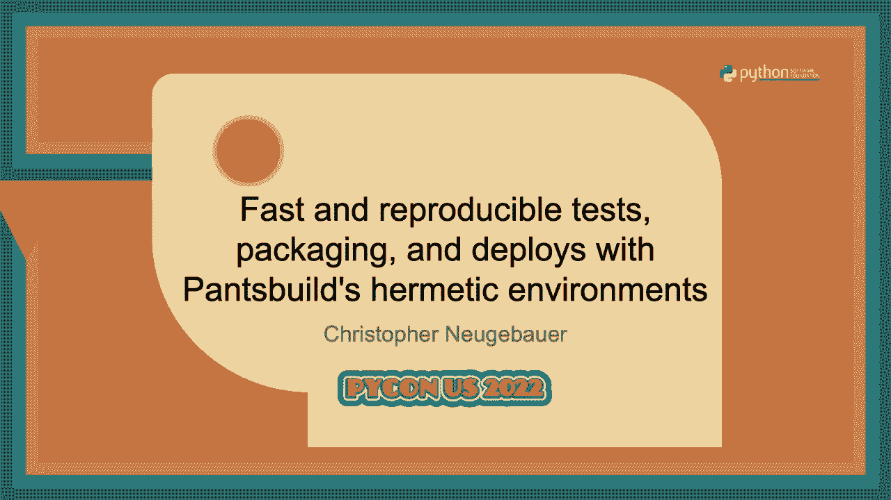
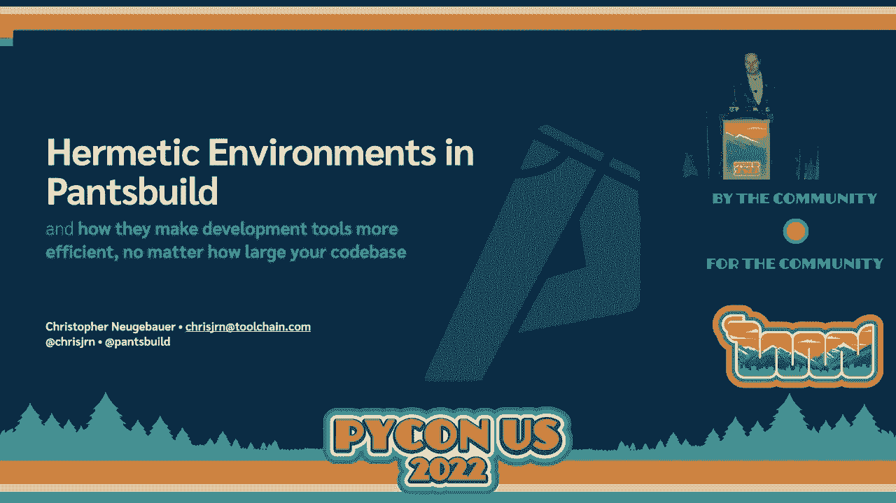
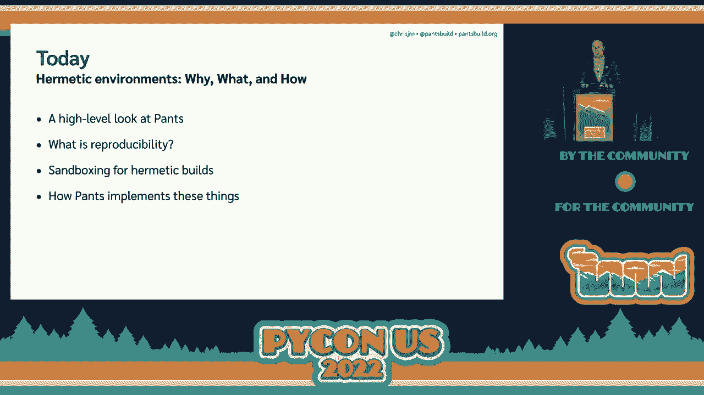
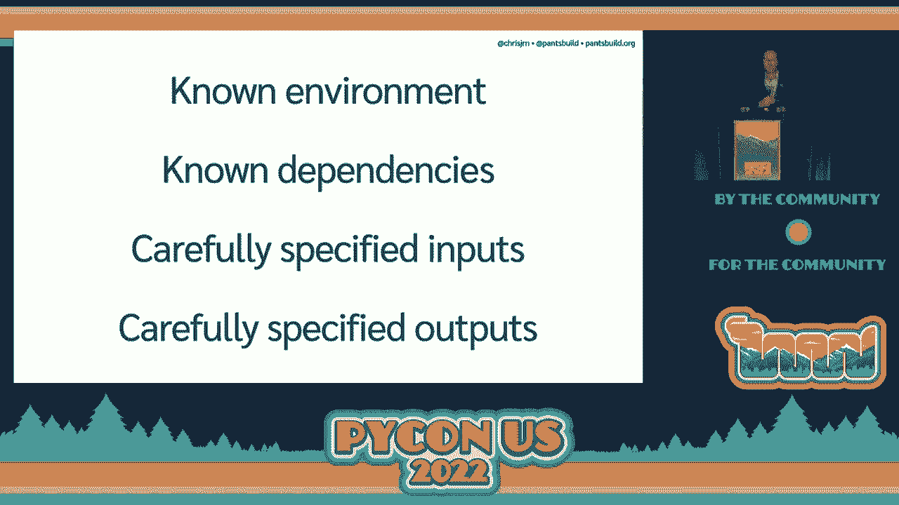
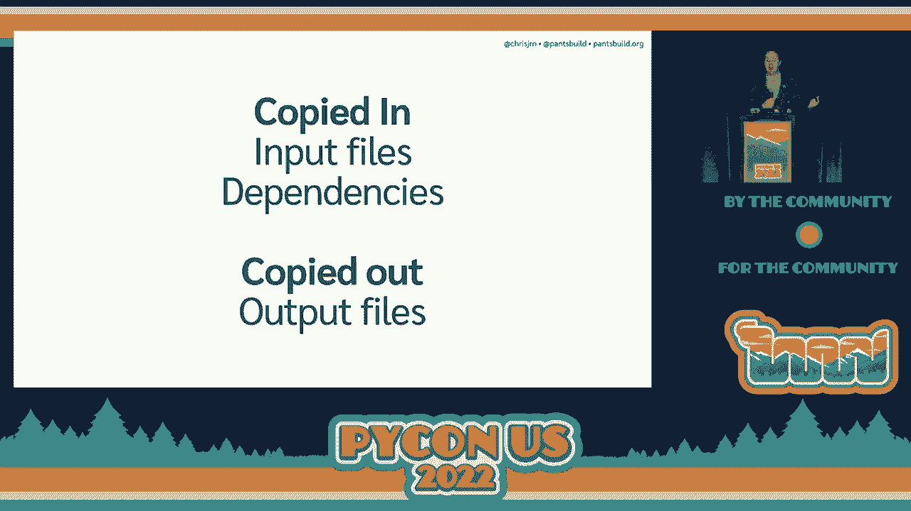
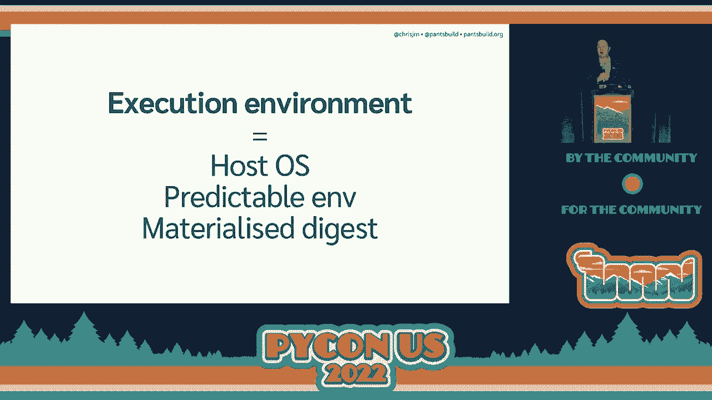
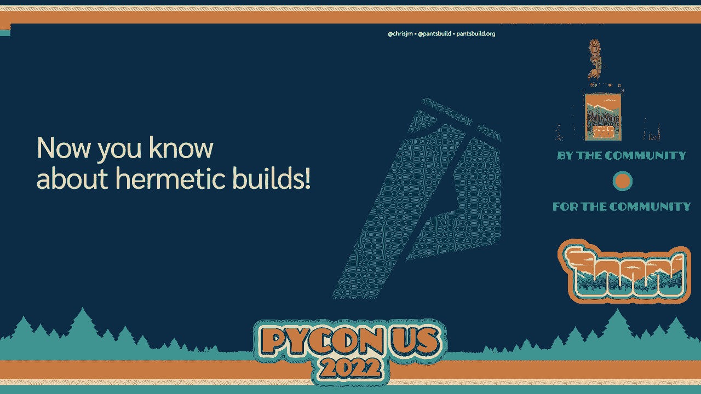
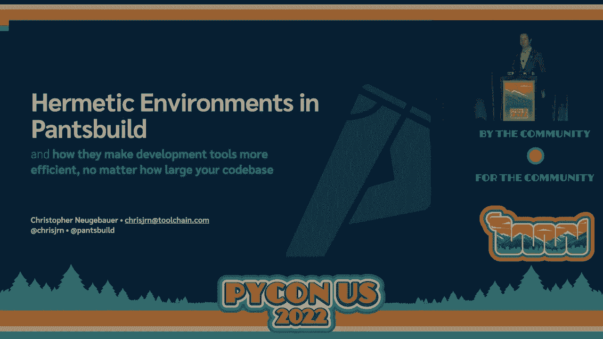

# P32：Talk - Christopher Neugebauer_ Fast and reproducible tests, packaging, and deplo - VikingDen7 - BV1f8411Y7cP

 Welcome to the last block of PyCon 2022。

 Our next talk， first talk of this block is fast and reproducible tests， packaging and。

 deploys with pants builds， hermetic environments by Christopher Noygabauer and go ahead and。

 take it away。 Thank you very much Mason。 All right。 Hello。 My name is Christopher Noygabauer。

 I work as an engineer at Toolchain。 I'm also a maintainer on the PantsBuild open source project。

 Feel free to tweet me at the handle on the bottom of this slide。 If you can't see it just yet。

 it will be at the top in just a moment。 If you want to loudly disagree with me during the talk。

 I don't mind。 If you have legitimate questions， you can send them to me by email。

 Today's talk is about hermetic environments， which is an approach that pants users to make。

 sure that we can predictably model the tasks that run while writing and testing your code。

 First up， I want to point out that this is not a security talk。

 A lot of the approaches that we're going to be talking about today have trade-offs between。

 guaranteeing absolute correctness on one hand and security on the other hand and delivering。

 speedy performance。 If you have different goals， you would probably make different choices here。

 So the focus of today's talk is on how reproducibility can make your build tools perform better and。

 what sandboxing techniques can deliver that reproducibility without sacrificing performance。

 That theoretical material is going to be sandwiched in between an introduction to pants and how。

 pants actually implements these things so you can see how all this works in practice。

 We're going to start the talk with a quick introduction to pants and some of the problems。

 that motivate the techniques we're talking about in this talk。

 So pants build is a build system， which is a bit of a holdover from compiled languages。

 where you need to run a lot of different programs in a very specific order in order to get your。

 code to run at all。 In our case， we orchestrate all the tools that interact with your code。

 That's everything from lending and testing all the way through to building a package for。

 deployment or for distribution。 So even in Python where you don't have a compilation step necessarily。

 we can still help， orchestrate tools， correctness tools like PyTest or MyPy or formatters and lintors like Flake。

 8 and Black so that you can run them more efficiently and only have to interact with one。

 tool to run all of them。 There's a small amount of jargon I'm going to have to get out of the way first。

 which will， hopefully make the rest of this talk go just a bit more smoothly for you。

 In the build systems community and pants in particular， there are terms for the units。

 of work that get run in your development workflows。 The ones that I'm going to refer to are goals。

 rules and processes。 Goals are things that an end user will ask pants to do for them。

 That might be something like run this test or type check the source files in this directory。

 or package this library。 Most CI workflows， most pre-commit workflows are made up of multiple goals。

 Goals are the individual steps that pants needs to perform in order to accomplish a goal。

 A rule might be something like figure out which files to give to MyPy in order to run。

 a type checking run or figure out which source file is the entry point to a Python executable。

 Goals are made out of rules and rules can themselves run more rules。

 And processes are when we run the actual underlying tools that pants is orchestrating。

 Pluses might be something like run pytest with these specific source files。

 Now today we're talking about pants too。 You may have heard of pants before。

 That was the old version。 This is a new tool that's inspired by the original version of pants that was developed。

 at Twitter 10 or so years ago。 It's a complete rebuild from the ground up by a community of open source developers including。

 a bunch of us who work at Toolchain。 The first releases were made very much with Python in mind。

 We're trying to be good members of the Python community and we want pants to be a great。

 experience for Python focused code bases of any size。

 If you use pants on a small Python only code base we sort of fit into the same category。

 of tools as talks。 But the goal of pants is to be able to grow with your code base。

 This means both supporting multiple languages and also being as efficient within a large。

 base as it is within a small code base。 So the ideal world for us is for a developer to be able to work on Scala or Go or Python。

 code and interact with exactly the same tool commands no matter what language they use。

 And we want it to be pleasant enough for you to want to do that。

 And finally we aim to make it easier to use a mono repo development workflow so you get。

 the configuration management and code reuse benefits that come with that but still being。

 as efficient and easy to reason about as a multi repo setup might be。

 The goal for us is to complete your goals faster while making them underline tools。

 And pants can do things like identifying which rules can be run in parallel or it can eliminate。

 duplicated or unnecessary work。 The other is that as your code base scales the work that pants does to configure and。

 orchestrate your tools will be more efficient and effective than just running those tools。

 in their default configurations。 As an example let's say you have a test suite with two test files in it。

 Pants will run your test suite that is not surprising。

 If you edit one of these two test files pants will only actually rerun the test file that。

 you've edited。 You can see that the reading is reused that's what this MIMO-ized thing means。

 It's still not all that surprising。 Most tools can do something like this。

 What is surprising though？ Well first we can revert the test again and note that both tests are MIMO-ized this time。

 Rather than just saving the most recent data to the tests pants has cached to our previous， runs。

 Since we're running tests that we've run in the past in exactly the same configuration。

 pants will use those results。 Now what happens if instead of changing a test file I change the implementation file。

 that is under test。 Again rerun the tests run against the implementations that changed。

 Everything else is cached。 That is because pants automatically understands the dependencies in your code base through。

 static analysis and it can use that information to figure out what tests need to be run again。

 When you start dealing with code bases with hundreds or thousands of tests and implementation。

 files automatic decisions like this mean you don't have to remember which test relevant。

 to the parts of the code base that you've changed。

 When you have a huge and slow test suite which most probably are this can make it quite pleasant。

 to regularly run your entire test suite as you develop iteratively。

 We can run tools more efficiently locally but to scale properly we're working to properly。

 support remote caching and remote execution。 Remote caching means that if one person on your team runs a given rule and another person。

 needs an identical rule completed we can fetch that result from a cache instead of running。

 it again。 It is surprising how often a team can run exactly the same rule over and over and over again。

 It's a huge waste of time and money。 So solving remote caching means thinking about a lot of problems around how we run the underlying。

 tools that pants orchestrates。 Questions like what rules actually need to be run in order to finish a user's goal？

 Do we split our goals into one process or several？

 And then once we split up the rules can we test with accuracy to see if a given rule。

 is already run。 And if a rule has already been run can we actually reuse its output instead of running。

 it again？ All these boil down to one question how do we make sure that the end result of a rule。

 is reliably reproducible？ Can we be confident that if we reuse a result from a previous run the combined end result。

 is actually going to be valid？ If we can run rules and be confident that running the same rule again will yield exactly。

 the same result then we don't need to run those rules again。 Which leads us to our first concept。

 reproducibility。 Reproducibility is the idea that if you run the same rule you will end up with the same。

 result。 It seems like a simple enough concept but there's enough of a sticking point that I'm。

 going to need to talk a bit about what we mean by the same。

 The elephant in the room here is this thing called reproducible builds which you may have。

 heard of if you work in open source。 Reproducible builds are a process in open source that provides you with an absolute guarantee。

 that a binary package corresponds to a given set of source files。

 The idea behind reproducible builds is that if you start with a given snapshot of your。

 code base and run it in a very well specified environment and guarantee that the dependencies。

 are the same you will end up with exactly the same package as the published binary。

 Grants can be used as part of a reproducible builds workflow but most development teams。

 especially ones internal to a company don't actually need this level of guarantee。

 The ops people in your company who are installing internal software should have high levels of。

 trust of the developers who work for the same company as them。

 So that's our use case we don't go out of our way to be cryptographically reproducible。

 That's not what we're going to talk about today。 Our primary goal here is ensuring a useful level of correctness。

 We really care about the completion time of your goals so you spend less time at your。

 desk waiting for your test to pass and you spend less time waiting for your CI to go green。

 For us reproducibility beings being able to be certain that you'll get the same results。

 running rules sequentially or in parallel and reproducibility means being confident that。

 you're not going to be able to get the same results。 Okay。

 mathematically we model each rule as a pure function of inputs that produce given， outputs。

 A rule with the same inputs should yield the same outputs。

 For rules that are implemented entirely within pants in Python code Python actually gives。

 us all the tools that we need。 We make heavy use of frozen data classes and those are easy to cache they're easy to check。

 for quality。 The problem for us is that processes are rules as well。

 Indeed they end up being the rules underpin basically every other rule that gets run。

 The rules that run entirely inside pants are usually just setting up inputs and configuration。

 for the rules that run processes。 But processes are really really difficult to model。

 They're impacted by dependency versions by operating system characteristics and more。

 Being able to parallelize or cache any rule means being able to make sure that we can。

 make the results of processes as predictable as the pure function codes that we write in。

 Python ourselves。 Being predictable means modeling processes so that there is cacheable as any other rule。

 that we run。 So if we want to be predictable we can't rely on works on my machine because that is in。

 no way reproducible at all。 And full cryptographic reproducibility is more of a guarantee than most internal development。

 teams actually need。 What we actually care about is making sure that we don't get the wrong results as long。

 as we start with a similar environment。 And annoyingly this brings about the question what does it mean for an environment to be。

 similar。 This discussion is going to center on Python tooling so I'm going to focus on that。

 The same general concepts actually apply to other language ecosystems such as the JVM。

 or Go which we also support in pants。 So in Python the environment that we care about consists of four aspects。

 The first is your operating system and if you use Mac OS that also includes the architecture， of it。

 Then there is the actual Python version that you're running。

 Then there's the version of your dependencies which pants captures using lock files so we。

 do that right down to the specific artifact of PIPI。

 And then there is the configuration of the tools that you run inside each rule。

 Now even without pants most of these things you tend to fix in your day to day life。

 Your operating system very rarely changes from underneath you。

 It's very easy to stay on a specific Python version。 It's very easy to forget to upgrade。

 And it's easy enough to keep your tools configured in exactly the same way。

 By far the most complicated of these in Python land is how to handle dependency versions which。

 is particularly if you're the sort of developer who incrementally adds dependencies as you， go。

 If you spend a lot of time working in a given virtual AM for example it can be really easy。

 for your dependencies to drift away from what your code base actually specifies which is。

 what your collaborators are going to be working with。

 This is because standard Python tools sort of encourage you to build up your environment。

 one package at a time and then freeze your requirements once you're ready to release。

 And this really runs contrary to this idea of environments being predictable。

 A much better approach is to make sure that every process gets run in a configuration。

 that fully corresponds to your requirements or your lock file if you have one。

 The best way to provide a predictable environment is actually to create a completely new environment。

 for every process that needs to be run。 One advantage of this is that you can manage the versions and dependencies of your tools。

 separately to your code base so the version of black that you run doesn't need to be tied。

 to the version of play test that you run just because they share a common dependency。

 The other reason why we care about starting from clean environments for every process is。

 that often processes produce outputs that we don't care about or they modify the environment。

 in ways that might impact subsequent runs of the same tool or the behavior of other tools。

 So in terms of modeling a reproducible process for us is one where we specify the input files。

 in the environment and we only collect the output artifacts that we actually care about。

 Let's make this a bit clearer。 If we retain the side effects of any given process。

 modeling the behavior of the process， becomes dependent on the order in which they get run。

 You need to run a given process in order to collect its side effects from that run and。

 you need to make sure those side effects are tracked。

 So rather than having a predictable model of the process executions， you actually have。

 a model just of one step in a chain of processes which really isn't worth modeling at all。

 Because what happens if we change some of the inputs in one step of the chain？

 Well you break that chain and you need to rerun every subsequent step。

 What's worse is that if you keep the side effects around somewhere， if you want to achieve the。

 same goal and do it in a way that's correct， you have to run everything again from the start。

 because the environment has changed。 Now you might be thinking。

 I can now run make of as often as I like and it's instant， every second time。

 That's because doing it correctly is tedious。 Those tools reuse the environment。

 they assume that the side effects don't actually matter。

 But this actually leads to subtle contamination which can break things and this is why most。

 tools that you use have a clean command。 That's to deal with garbage that gets left behind if your tool doesn't do the right thing。

 in a reused environment。 On the other hand， if you don't reuse the environment then you actually break this dependency。

 on ordering。 And this means that you can reorder processes so that they're more efficient。

 This could be as simple as running formatters before you run linters through to dividing。

 up a test suite to run multiple cores in separate processes through to skipping rules that have。

 been run earlier or even by someone else。 And it can do this without an explicit clean goal because by not reusing the environment。

 pants actually cleans as it goes。 So that's what a hermetic environment is。

 Taught me half the talk to get here。 It's an environment that isolates the side effects of a process from other processes in。

 the same workflow。 It means that if one process does something unfortunate that would invalidate the behavior。

 of other processes， that effect doesn't get captured。

 Indeed it means only capturing the effects of a process that we actually intend to capture。

 and discarding everything else。 And the way that we achieve a hermetic build is by preparing a knowable environment containing。

 dependencies that we can model into which we place known input files。

 The only things that we preserve from this environment are specific output files。

 So I've said that that's a good thing。 I've explained some theory about what constitutes a hermetic environment。

 Now we need to look at how we actually go about preparing these environments。

 So we're going to talk a bit about sandboxing techniques。

 The goal of a sandbox is to isolate processes from one another so that their execution does。

 not interfere with each other。 Everyone can come in many forms but generally speaking the things that we tend to care about。

 are making sure that processes are isolated from each other。

 Most operating systems these days do that automatically。

 But also making sure that processes don't write over files that are produced by other。

 processes or making sure that OS resources are allocated fairly。

 These days like 90% of the processes that need isolation can be adequately handled by， Docker。

 everyone uses containers all the time these days。 And honestly you can do this hermetic environment thing with Docker as well。

 Another mono repo build system called Bazel does in fact do this。

 But it is amongst several sandboxing options that you can choose from inside Bazel。

 And that's because Docker even though it's much lighter than a virtual machine still。

 has significant performance overheads。 If you want to replicate a containerized environment multiple times that means you need。

 to materialize a containerized OS multiple times。 And there's a lot of underlying files that just don't change very often。

 So that ends up being a lot of repeated and often unnecessary work just to run tests in， isolation。

 Building up truly isolated environments be it through Docker or through other means is， really。

 really slow。 So all sandboxing approaches need to trade between the level of isolation and the level。

 of speed in which your sandboxes can be built。 And so this raises the following question。

 How much isolation do we actually need in order to build up a predictable process execution， model？

 And the answer is actually it's not a lot。 Again our needs are not really built around ensuring security。

 This is because most tools that pants orchestrates are trustworthy。

 This is a bit of a hand wave but generally you're already using these tools to build your， software。

 That means that you've already audited your functionality as much as your organization， needs。

 I presume you audit your tools。 Yeah， okay I see a lot of nodding here。

 Pants doesn't make these tools do anything that they don't do on their own。

 Beyond that build tools tend to do a predictable amount of work。

 They tend to do a good job of only reading the files that you tell them to and only outputting。

 in files in places that you tell them to。 So unlike in cases where processes might run away like on a server facing the internet。

 the processes that pants runs doesn't really need enforcement of isolation。

 They just need to stay in their lane。 So enforcement approaches to isolation these are things like running processes on dedicated。

 machines or in containers or even just running in a file system， Sherout jail。

 All these require some amount of operating system primitives to be put in place before。

 you can even run a process。 But they give you some level of actual resource isolation in return。

 Guidance tools are a bit less frequent but in the Python world we tend to use them all。

 the time in the form of virtual M。 And all virtual M does is it modifies your path environment。

 variable so that when you ask to run Python， the first thing that your shell finds is the。

 version that you specified with the pip dependencies that you've installed there。

 The key observation is that VM doesn't actually stop you from being able to run other versions。

 of Python that are on your system。 It just makes it easier to run one specific version of Python and a lot harder to run the。

 rest。 So pants does more or less exactly the same thing。

 Rather than putting you in a predictable place inside a completely isolated environment。

 pants will run the processes inside the host operating system。

 But the working directory is a temporary directory in a completely unpredictable part of your。

 file system and we set environment variables from scratch。

 The tools that pants runs are usually fairly well behaved。

 They'll only access the files that you tell them to。

 And if you configure a Python tool to load dependencies from a specific place， it will。

 do that rather than looking to where the OS stores them。 That's how virtual M works。

 We just do it a bit more aggressively。 So because the tools that pants runs tends to be trustworthy and they're configurable。

 in a way that makes them not interfere with files that they aren't told to， we're able。

 to run these tasks inside the host operating system。

 We can run them in a temporary directory that is created especially for a given process。

 and we never run another process in the same directory。 So to create environments。

 all we need to do is copy in the input files and the dependencies。

 that don't exist in the host environment。

 And we copy the build artifacts out when the process is done。

 So there's still one more thing that we need to discuss here which is how pants actually。

 does this stuff in practice。 Caching the results of rules is only really useful if it's faster to compute a cache key。

 than it is to run the rule itself。 Copying files around can be really， really slow and wasteful。

 And if we're preparing environments and it's substantially slower to do that when we need。

 to run the processes， then users just aren't going to tolerate that because people don't。

 like slow build tools。 So once you decide you might want to cache the results of rules。

 the execution steps look， something like this。 We create some sort of process request and we send that request into the internals of。

 pants， something happens。 We wait a while and then eventually pants will send back a process result object。

 To a Python developer， this is an async IO call and as a Python developer you don't really。

 care what goes on underneath the hood。 Underneath the hood though。

 our pants makes the decision to either run the process or fetch， it out of the cache。

 The point where we can end up saving some time comes from answering the question of whether。

 we've already run a given task。 So with hermetic environments。

 we can answer one question which is if we have the same files， and the same configuration。

 the same dependencies， will we get the same result？

 So it doesn't answer the question of is whether a set of files is the same。

 And that's a problem because with build processes， especially on big code bases， you can end up。

 having hundreds or thousands of files and files on file systems are annoyingly mutable。

 And that makes reasoning about files on a file system themselves quite slow and unreliable。

 So pants solves this by using content addressable storage。 In our case， we use LNDB under the hood。

 Using our own system to reason about the files that we're modeling means that we get to decide。

 what operations are cheap and what operations aren't。

 And we get to do that without the constraints that file systems normally put on us。

 It's also useful because as people writing orchestration code， we very rarely care about。

 addressing individual files， but we do care about sets of files。

 We want to work with a set of source files or we want to work with the resolve collection。

 of dependencies that an application has or perhaps we want to deal with a combination， of both。

 If you're a rule author writing pants rule code， your window into this content addressable。

 storage is a thing called a digest， which is a reference to a set of files。 When we run a process。

 what we end up with is a digest which represents the files that。

 we asked to copy out of the process execution environment and nothing else。 Similarly。

 when we talk about copying input files into the execution environment， what。

 we're actually doing is materializing the content that is specified by the digest into。

 the execution environment。 Now digests are lightweight。

 which makes them cheap to use in a cache key。 And importantly for us， unlike files on a file system。

 items in the content addressable， storage for us are immutable。

 And that means that we can deal with them in the same way that we attempt to reason about。

 everything else that we reason about in pants。 So digests are immutable。

 They refer to immutable content。 And most importantly。

 the operations that we perform in our rule code in pants are very。

 very cheap compared with doing the same sorts of operations on a file system。

 This includes things like renaming files that they have a common prefix， moving a batch。

 of files into a different directory， merging multiple digests。

 And also under the hood we can only store relative paths， which is important。

 It means we can materialize files into a temporary directory just the same as the rest of this。

 execution model requires。 And speaking of materializing files。

 the key thing is that we don't actually materialize。

 files into the host file system until we actually have a process that needs our actual files。

 And this approach means that we don't waste our time doing piles of I/O in order to maintain。

 these hemetic environments。 We only do the bare minimum amount of copying files around to ensure that we end up with。

 the files that we actually want。 And so now that we have digests that can reliably represent an input or output file set。

 we can， model a process entirely in Python。 In pants， when we request to run a process。

 we supply the command that we want to run， a series of environment variables。

 and the files and the environment are specified as， a digest。 Under the hood。

 it's a data class which is efficient to cache in Python。 So now that we have that。

 we have a lightweight reference to a lot of immutable files， which。

 is a thing that's accurate enough for us to use in a cache key。

 And the result of that is itself cheap enough to store into a cache。

 So now the question of have we run this rule becomes easy and lightweight to answer。

 If we've got a process with the same arguments， the same input digest， the same environment。

 et cetera， et cetera， then we can be confident that we have already run it。 What's more。

 this question can be answered equally effectively by a local cache or by， a remote cache。

 And that's it。 Four pants， a process execution consists of the host operating system。

 an environment， that we can predictably model， and the contents of a digest that we can reliably store inside。

 a cache。 So that's basically the end of this talk。

 We've done our high level look into hermetic environments and how they unlock some of。

 pants more interesting time saving features。

 We saw that we're able to make existing Python tools run faster or not at all if we can make。

 good choices about how tools get run and when。 We saw that we need to be able to predictably model processes。

 which is quite difficult， to do unless you have a predictable environment。

 Then we did some hand waving that build processes don't actually need a whole lot of process。

 in isolation， or at least we don't need a whole lot to be able to predictably model their， behavior。

 And we saw that using a content addressable database makes it cheaper to do orchestration。

 tasks like merging these set of dependencies and the set of source files and also makes， it much。

 much easier to reason about file sets in a cache。 So if you're interested in all this stuff。

 we are going to be around at the rest of the， conference。 Myself， John and Benji。

 we're going to be sprinting tomorrow both on pants build and， pecs。

 which is a project that the pants build project stewards。

 One thing that we will be doing in particular rather than working on features in pants will。

 be helping you onboard pants into your open source repos。

 So if this all this seems interesting to you will help you take advantage of it。

 You can come find myself， Benji or John in the hallway track after this talk。

 We're happy to answer any questions that you had about this talk。

 There are docs and demonstrations available at pantsbuild。org。

 There's also a link to our community Slack where you can ask us or other maintainers questions。

 There are notes on this talk。 There are bits sparse at the moment available on the pants build blog right now if I got。

 the scheduling functionality correct。 That is the end of my talk。 Thank you for paying attention。

 I look forward to seeing you in the hallway track。 [APPLAUSE]。

