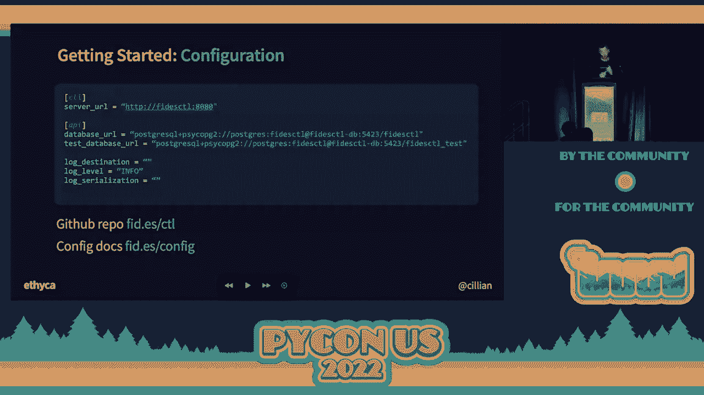
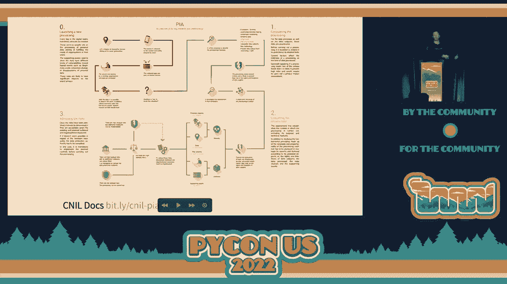
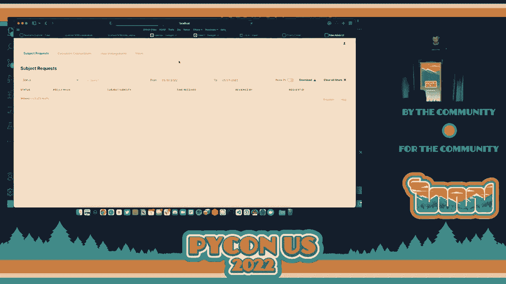
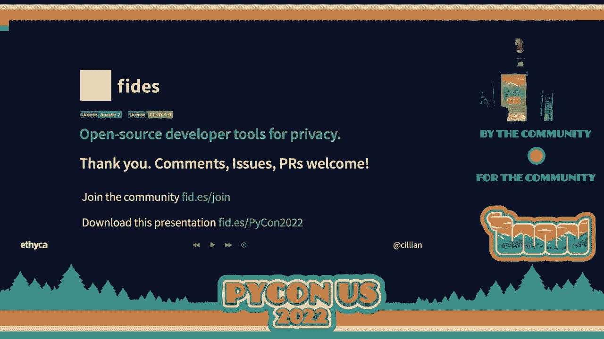

# P33：Talk - Cillian Kieran_ Open Source, Python Based Tools For Data Privacy - VikingDen7 - BV1f8411Y7cP

 But now we're going to hear about open source Python based tools for data privacy by Killian。

 Kieran。 Thank you so much， Mason。 Thank you all for having me。

 I'm going to try and get through a huge amount in 30 minutes。 So I apologize if I speak very。

 very quickly。 All of the documentation， all of the repos I'm going to use for this are publicly available。

 and there are links to everything。 So if you're trying to furiously keep up。

 please don't try and just listen， I guess。 So very quickly， I'm Killian Kieran。

 I'm the founder and CEO of Efica。 We're a data privacy engineering company。

 I'll explain what that is in a moment more substantively。

 I'm here specifically to talk to you about a handful of things that we do。 So very quickly。

 we have this sort of thesis about privacy we call privacy as code。

 I'm going to explain what that is very quickly。 Then an overview of feeders， so what that is。

 And then show you examples of privacy as code using feeders， which is an open source。

 privacy engineering platform。 So it really is information dense。 I apologize in advance。

 I wanted to squeeze as much in for you guys as possible。 So this might seem obvious， but at Efica。

 we're about 35 or 40 people and we believe privacy， is a fundamental human right。

 Everybody in this audience is probably going to agree to that。 Privacy is a fundamental human right。

 But it turns out it's really， really complicated， particularly for engineers。

 It's a difficult thing to do well。 So we care about it， but it's difficult。

 You see today in most businesses， not everyone， but most businesses， it happens after you ship。

 software， right？ So you ship an application and then you have to address privacy problems because you've。

 collected some data， right， in production。 You've got human beings information in it。

 Now you've got a privacy risk。 And it becomes a pain for developers and for lawyers。

 Often it's a pain for developers from lawyers， right？ Like that's the reality of it。

 And it's things like you might have heard of like data discovery， data annotation， data， mapping。

 privacy reviews， risk reviews， consent， rights propagation。 Et cetera。

 All of these are the complicated legal concepts。 Now。

 the cause of a lot of this are reasonably new or relatively new legal regulations like。

 the GDPR in Europe， the CCPR in California， the LGPD in Brazil， the People Act in China。

 There are many， many privacy regulations， right？ You're not expected to know the acronyms。

 You're engineers。 That's the point。 The idea behind a lot of these though is privacy by design。

 Now if you're not familiar with privacy by design， that's an entirely different topic。

 that we won't have time to cover today。 There are seven principles in privacy by design。

 But the TLDR is essentially how do you make privacy a design consideration in technical。

 implementation？ Like so how do you do it sooner？ How do you make sure that you don't ship a product having not thought about privacy？

 These are some of the acronyms and definitions that exist in the world of privacy， right？

 They're pretty complicated。 Anyone here know what a DPIA is？ You don't have to answer。

 But like they're examples， right？ That's a data protection impact assessment。

 What it really means in plain English is a privacy review。

 We create the risk of the code that we're writing to make sure that we don't compromise。

 the human rights of the individual's data in the system。

 So lots of these complex concepts for engineers。 And what we think at Ethica essentially is that tools should be built to add privacy。

 into software development。 Bit like shift left for security， right？ Like not so different。

 And we call that privacy as code。 So this idea that we can provide tools to developers to make it easier to build safer。

 more respectful systems。 And the benefit of this is really obvious。 If you could accomplish this。

 like future state panacea， right？ You essentially not have to think so much about privacy。

 not because you as developers， don't care about it， but you're busy doing other things， right？

 Like you're trying to ship applications， solve problems。 Privacy is sort of a means to an end。

 It's an unfunctional requirement almost， right？ And so we think of it as a layer of our tech stack。

 right？ We've got front end， back end data infrastructure， infrastructure is code。

 our source control， environments。 We should have a layer that deals with privacy。

 So that brings us to the project that we've been working on at Ethica for over three years。

 So the company's about three years old。 And we've been working on this project we call FEDES。

 FEDES is named after the Roman Goddess of Trust。 We think that's apt given all things。

 And it does what it says， right？ It's an open source developer tool for privacy by design， right？

 In any tech stack。 Now it happens to be built in Python and that's why we're here。

 Everything we do is built in Python。 And the intention of this is to help developers and engineers of all kinds。

 right？ So we're going to have to take a look at the software product， data engineers， to more。

 easily comply with regulations。 So sort of remove the cognitive load so you don't have to think about these issues and。

 ensure that you're building safe systems for everybody。 So this is a very， very dense slide。

 We'll try and explain it very simply。 The left side you've got code management environments， right？

 The sort of software development lifecycle where we design， implement， test and eventually。

 ship stuff。 On the right side you've got your runtime environments， right？

 So production infrastructure。 The types of questions that the laws ask us to answer are things like on the left。

 Well， how can we prevent risk when we're building our products， right？

 Like how do we prevent ourselves from accidentally using phone numbers that were collected for。

 security and exposing them in APIs for developers， for games？ That's a real example， right？

 That's why Facebook got fined $5 billion for doing that。 Meta， I guess。 Runtime。

 production environment。 Questions like how do we dynamically define and enforce a user's rights？

 And what do we mean here， right？ The GDPR and the CPRA and the LGPD。

 they provide human beings all of us in the room and everybody， with rights。

 Like I can be deleted from a system and developers need to be able to assure that we can guarantee。

 that we can consistently delete someone from an entire distributed data infrastructure。

 And that could be petabytes， right？ So code management environment is how do we prevent risk？

 Runtime is how do we ensure we afford a user or a human their rights？

 So we have tools in Fidez that solve these problems。

 Fidez control is on the left and we'll talk about that in a moment。

 Fidez ops is on the right for the runtime。 So the way to think about Fidez and I know I'm going fast when I'm trying to cover a。

 lot of grand， I haven't even got to the live demo where I fall flat in my face。

 So the core of Fidez is the language。 Fidez Lang， and I'll show you that in a moment。

 Think of it as a lightweight description language for privacy and I'll sort of elaborate what。

 that means in a second。 And again， we've got two applications or tools that sit on top of the language。

 Fidez control， which I mentioned is a server that runs in the software development lifecycle。

 effectively。 It does a few other nifty things， but think of it that way。

 Fidez ops is a containerized application that allows you to execute and manage tasks。

 on behalf of users' rights。 Okay。 So a little bit more about the language。

 This is very hard to see on screen。 So if you are sitting at a computer， I'd encourage you to。

 let me get rid of that。 I'd encourage you to go to FID。

ES/taxonomy and you can explore the taxonomy in the open， source docs directly。

 But so it's a description language。 When we say like a description。

 we mean lightweight in the way the Terraform is， right？ So Terraform describes infrastructure。

 Fidez describes privacy characteristics。 So its intention is to ensure that engineer developers doesn't need to know a whole lot。

 about privacy。 You can describe the personal data or behaviors of your systems data such that you can then。

 enforce policy or mitigate risk。 So we don't need to know about privacy。

 We just need to be able to describe what our system is doing and Fidez takes care of， the rest。

 So let's talk about the sort of four components of the core taxonomy in a little bit more detail。

 They're what we call data categories， right？ So they're the what。

 like the what type of data am I processing？ So as an email addresses， behavioral information。

 what kind of information am I dealing with？ Then you have a data subject， right？ That's the who。

 So who owns the information？ Now ownership is a sort of tricky concept in privacy， right？

 Because an owner in this context is from whom the data came， right？ So an individual like Mason。

 for example， right？ As an owner could also be somebody that has collected it as a legal right of ownership。

 Here we're talking about the human being behind the information， right？ Then you get data uses。

 So think of that like what we're using the information for。 Are we personalizing our system？ Are we。

 you know， doing advertising？ What are we doing with that data？ And finally data qualifiers。

 So think of a qualifier in Fidez as a way of declaring how identifiable an individual is。

 in a given data set。 So someone might be fully identified， right？

 That is to say you've got fully identifiable data。

 You might have partially setonomized or setonomized and unlinked data。

 You might have aggregated and partially anonymized data。

 And all of these create a different risk of reidentification in a data set。

 Now what's important to understand is with these four very simple concepts， data categories。

 data subjects， data uses and data qualifiers， you can essentially model most of the， let's。

 call it data and privacy characteristics of a system。 And that's the purpose of this， right？

 Do it very， very simply。 So again， if you want to explore the taxonomy more， you can do that online。

 The one thing I would notice it ships with the taxonomy that we've built over the last。

 three years working with standards for the GDPR， the CPRA， LGPD， also ISO-19944， which。

 is the ISO standard related to cloud service provider data flows essentially。

 So it models against all of the complex regulations that you'd need to consider if you think。

 about privacy。 You can extend it。 So most of the business users that use our open source tools have extended it for their。

 specific uses。 And we can talk about that afterwards。 So then we get into how you actually declare。

 like how you write this stuff。 It's pretty simple。 Like I mentioned。

 it's intentionally lightweight and declarative in style， right？ It's dot notation， mostly。

 You'll see there's some snake case in there in some places， which is not ideal。 We're working on it。

 You declared as yannels in your projects。 We're currently working on a version that allows you to declare it in line in whatever。

 language you're working。 Obviously， first-forces Python， then Java and Scala。

 But so effectively today you declare it in distinct yannel files that you check into your， projects。

 So if I wanted to describe two types of data I was handling just as examples， if I wanted。

 to say I was dealing with data that's non-personal， right？ It's data related to systems operations。

 like a timestamp。 I would simply declare it in that way， system dot operations， right？

 If I wanted to declare that I was dealing with an email address， I would say it's user， provided。

 identifiable， contact email。 Now it can be very specific， it's a very fine-grained。

 specific sort of label， like an email address。 Or it can be very abstract。 If I， as a developer。

 don't really know what I'm dealing with， it might be just I know it's， user data。

 I could just declare it as user data。 So just very conceptually， it's very simple。

 Then we get into feed as primitives， right？ So there are sort of four primitive resources that exist in VDES。

 There are organizations that are pretty obvious， right？

 So it represents all or part or any of an organization， right？

 So it could be a company like Acme Inc， or it could be a department in a company。

 It establishes the root of the resource hierarchy。 So what we mean by that is they've limited scope。

 So if you had two resources within one project or two organizations within one project， for。

 example， one organization cannot seek out the scope of another， right？ They are completely distinct。

 There's no way around that by design。 Then you got systems。

 So systems represent the privacy properties of a single project or a service or some code。

 base or an application。 So think of that as describing the behavior of my system。 Again。

 think of that。 That could be a single service。 It could be an entire monolithic application。

 It depends on how coarsely or how narrowly you want to describe a system's behaviors or， properties。

 So we see a lot of use of this with larger enterprise customer users of the open source。

 tools and they're describing individual services， right？ Like right to enter single microservice。

 And so it describes the category of data you're using and the purpose for which you're， using it。

 And then you get data sets。 Now， in most cases， data sets you can think of them as re-describing a sort of data source。

 Like a database or a data warehouse or some other storage system。

 More practically data sets in FIDES are designed to represent or model anything that might contain。

 data。 So a list， a collection， an interface， et cetera。 And finally， the policies。

 So think of policies exactly as they sound。 The ability to describe a set of rules about your system in code。

 So it's like taking the privacy policy of a business and converting it into an enforceable。

 rule on that system。 And I'll show you an example of that in a minute。

 We do that by evaluating policies against systems and organizational data sets。 Okay？

 So what can you do with FIDES？ You do a whole bunch of things。

 but the ones that we're going to focus on today， you can。

 effectively declare what type of data you're handling in your application。

 You can describe how your system is using that data。

 And then you can declare what kind of policies you want to enforce， right？

 So I don't want to be able to do these things or I permit these things， for example。

 There's a bunch of other nifty things。 So again， just a reminder， FIDES control。

 which is the developer tools for shifting privacy， left。

 so making it easier for developers to do this。 And then this FIDES ops。

 which is that runtime application that allows us to execute tasks， on our systems。

 I'm going to try and show you an example of both。 How are we doing for time？ We're good？ Okay。

 awesome。 So we've got two use cases。 So the first is policy enforcement in development。 Okay？ Now。

 here's a really frightening， well， I'll get to that very frightening slide in a minute。

 Just to explain FIDES controls configuration and components for a moment。 It's very simple。

 You could deploy it in about 10 minutes。 If you grab the FIDES demo repo and just run make demo。

 it'll be up and running and， you can play with it。

 But there's essentially a FIDES control server backed to， in this case， a Postgres database。

 And there are integrations to your CI pipelines。 And there's also a CLI tool so you can query it directly。

 So at the moment， the web server is essentially headless。 There's some basic UIs for reporting。

 which I'll show you in a moment。 But the server essentially maintains the metadata that's checked in and out through the CI pipeline。

 and evaluates policies。 Right？ So it's a very simple architectural model。 To get started。

 super simple。 You can declare it in a tunnel file or a bunch of environment variables straightforward。

 You can see here there's a URL for the database， server， et cetera。 If you want to get it set up。

 as I mentioned， you can go to FIDES。ES/CTRL and the configuration。

 documents that are like quick start is just slash config。

 So there's a bunch of commands and we won't have time to get through them all here。

 But I just want to draw your attention to four that are particularly interesting。

 They're listed here alphabetically， but I'm going to reorganize them to explain them。

 So the first thing that you can do is actually scan data infrastructure。

 So you can actually point FIDES control， for example， in AWS environment。

 And it will return a list of systems that may contain data and generate data set and。

 system files for them。 So you don't have to do that manually。

 You're not manually declaring everything。 It will generate a scanned view of your systems。

 From there， you can generate a data set。 So you can point it directly at a data source。

 You can credential it against a Postgres or Redshift。

 And it will generate a FIDES data set declaration file。 You can then manually annotate it， right？

 So you can describe the types of information that are in that data set。

 I'm going to show you these in a moment。 And then you can evaluate the risk。 So you can say， hey。

 check this against policies for the organization。 If you want to see a full list of the commands。

 it's just FIDES/command。 Now， onto the scary thing。

 I mentioned we're going to do a policy evaluation。

 Some of you may be familiar with this because you're in larger organizations。 Some of you less so。

 This is what privacy laws are all about。 This is NARS。 This is the Keneel。

 So the Keneel is the French regulator， right？ So if your software is deployed and being used by consumers in France。

 the French regulator is looking at it to make sure that you're doing these types of things。

 This thing I'm referring to is a protection impact assessment or。

 a privacy review if you're not familiar with these particular regulations。

 Privacy review basically seeks to create like a giant Rube Goldberg machine， right？

 Tell us what type of data you're handling。 What are you doing with that data for what purpose。

 with who， like by who the user is data？ What kind of risk does it create？

 Is there a risk of compromising the user's rights or security risk？ Evaluate that risk， mitigate it。

 and generate an audit trail。 Show us that you thoughtfully consider the risks to your users， right？

 Sort of like what you would do in threat modeling for security， right？

 Like the same thing but for privacy。 It's pretty complex。

 It usually involves legal specialists because they understand the privacy stuff。

 And engineers because they understand the engineering stuff， right？

 So what we wanted to do was make this easy， right？

 We wanted to provide tools that allow us to describe or。

 declare a policy like a thing we want to support in a business or a team。

 And then to enforce that so we don't have to check it constantly manually。

 So in this example we're going to declare the type of data we're processing and， storing。

 We're going to talk about the type of system that we're doing that in。

 And we're going to check it against a fictional policy and enforce it， okay？

 And then we're going to maintain an audit trail so we'll be able to see reports about that。

 So I'm just going to jump out of this document for a second and。

 I'm now going to attempt to do this live and of course it'll probably break but， we'll have it go。

 So the first thing we're going to do is just to show you an example of the scan command running。

 Basically this is our demo environment。 You can spin these tools up yourself very quickly。

 I've declared some environment variables just to hide URLs that were pointed at。

 And basically what I'm going to do here is I'm going to first of all， let's see。

 run the scanner first， yeah。 So the first thing we're going to do here is we're just going to scan AWS infrastructure。

 that I've credentialed this to， right？ So it's basically using the fetus control server to connect to an AWS environment and。

 scan it for resources。 And by this we mean sort of anything that may contain data and。

 I put that to a yaml file。 Ignore that。 That's actually not an error， that's a known issue。

 Let me see if I can make this a little bit clearer。 Okay。

 it's a bit information dense but you'll see what it's returned here is a list of systems。

 with keys essentially。 If I expand one of these out。

 you can see here it describes it with a little bit of metadata。

 what kind of resource it is and then some of the， you know。

 ARNS and addresses for this particular retchif cluster in AWS。 So it's generated this metadata view。

 right？ Essentially metadata map at the very abstract level。

 each of the systems in our distributed infrastructure。 So that's the first step。

 We've just identified systems that need to be understood， okay？

 The next thing we want to do is actually connect to one of those and。

 generate a data set that we actually label， okay？ So we want to say what kind of information are we handling in these systems？

 So let me， so we'll just do generate。 So here we've got。

 you'll see at the top half we've just got a yaml file that's empty。

 that I'm just using as a destination for this essentially。

 And here you'll see I'm basically using the generate data set command against a database。

 There's a database URL declared， I'm just writing out to this yaml file。

 And this will take a few seconds to run。 It's actually going to query the ddl and like return a data model for it。

 Hopefully。 Uncomfortable silence， I know。 There we go， okay， phew。

 So you'll see here there are four simple databases here。 And if I look at one of these。

 I've got a set of metadata that describes， the database itself and then each of the tables that exist here。

 And if I expand those out， I can see there's a description about what it is。

 There's a data qualifier and there's empty data categories。

 So I don't know what type of data is in here today， right？ Like that's not declared。

 it's not modeled。 I need to label this manually。 So all we've done so far just to be clear is scanned for data systems。

 generated data sets。 And the next thing we're going to do is talk about how we label these。

 Now to make this a little bit more real， I'm running from that demo project that I， mentioned。

 the feed is demo repo。 And I'm running this fictional e-commerce system that I'll show you very quickly。

 And it's a thing of beauty。 It has three products， a Postgres database， no images。

 But it's a very simple application。 It's a flask application。

 It allows us to test the sort of concepts of feeders。 So in this case。

 we've got a couple of products， we've got some users。

 So it means that we have a very simple data model， right？

 If I go to the Postgres database for this system， you can see here it's got a products table。

 a purchases table， and a user's table。 And if I expand out the user's table for a moment。

 you can see it essentially has six columns or six fields of information。

 I created that timestamp email first name ID， last name and password。

 Now we look at how these are annotated or declared in feeders， right？

 So if I look at the created field， you can see it carries a data categories label。

 a systems operations data。 It's the type of information it's in here。

 It's data related to system operations。 If I compare this to email address， I've got user provided。

 so user provided， identifiable contact email。 As a developer， if I don't know the structure of this。

 I can bless you。 I can simply declare it maybe as user data， I might just say it's user information。

 I could say it's user provided， I know that it's actually been provided by the user。

 It could have been derived about the user through observation。 Is it then identifiable？

 Is it contact information？ I could just leave it there。 Or I could specify that it's email。

 Now these are coming from the feeders taxonomy， right？ So these are specifically from this taxonomy。

 OK。 So I'm declaring the type of information I'm handling in my data set。

 Now the other side of this is the system。 So it's the actual application that's processing information。

 So let's take a quick look at that。 So we've got our data set declaration。

 got our system declaration。 And we can see here that it describes a little bit about it。

 It's a sample e-commerce application。 It's used for the purpose of simulating an e-commerce system。

 Now if we expand our privacy declaration， we'll see that it says we provide e-commerce capabilities。

 It declares the types of data we're handling。 So in this case。

 we're handling user provided identifiable data， user derived identifiable data。

 and system operations， data。 And it's for the purpose， the data uses e-commerce。

 We're not advertising。 We're not selling the data。 We're not doing any behavioral analysis。

 any machine learning， classification。 We're just providing e-commerce capability。

 And we've got a custom subject type or user type， called a flask customer。 That's all it is。

 So this declares the purpose of the system。 The other declares the type of data we're handling。

 Now let's run an evaluation。 So I'm not running a CI pipeline here。

 so I'm basically forcing an evaluation with the feeders， control server on my CLI。

 So we'll just run that very quickly。 That feeders control evaluate。 Now if you look carefully here。

 this is maybe a little hard， to see。 You'll see that what it's done is it's。

 grabbed the system resources files， all of the data， uses and declarations。

 And it basically checks it against a policy。 And it says that it's passed。 We get all greens。

 Everything's good to go。 So code's checked in。 Now let's imagine for a moment that I--。

 working with a developer on this e-commerce application。

 I actually decide actually what we're handling here， is not going to be an email address。

 It's actually users provided identifiable health， and medical data。

 So this email address is actually some kind of health， and medical data。

 And now I attempt to check it in again。 So it's checking against our policy。

 Big red failure message。 If we look carefully here， the failure。

 is caused by a rule about rejecting， the use of sensitive data。 So it's basically said， hey。

 we have a policy in this business， that says we reject the use of sensitive data。

 for any of these purposes。 And you're attempting to do that。 That's a big risk for us。

 We can't do that。 So how has that actually been generated？ Well， let's look at the policy file。

 So this policy file written in FEDA， is very， very primitive。 There's two rules。

 One is minimizing the use of identifiable data。 And the other is rejecting the use of sensitive data。

 So let's look at the rejection one first。 We can see here that it's a simple rejection policy。

 If any of these categories of data， any of these categories， or any of these types。

 biometric children's genetic， political， race， religion， is being， used for any of these purposes。

 for personalizing， or system， for advertising， for third party sharing， for training and AI system。

 we don't permit that。 We reject that。 That code cannot be committed in this organization。

 Now that sounds very harsh， but the effort here， is to prevent us from failing and then finding。

 a risk in production， in addition to which it prevents， the RUGOBER machine I mentioned。

 hours of paperwork with legal teams to review risk。 So we check it in。

 We find that there's a failure。 We update something in our code base。 We redoclare our YAML file。

 and we're good to go。 It gets checked in。 And each of these policies is evaluated into an audit trail。

 So if I look here， we can see the audit trail。 I've been running some fails and passes。

 throughout the day just to test it。 The most recent one here is this violation that。

 relates to the use of helping medical data in our e-commerce， system。

 So we generate an audit trail for these things。 So let's go back to our document very quickly。

 So what we've done there is essentially， to clear the type of data we're handling。

 what our system is doing， and evaluate the risk related， to policies we have in the business。

 and generate a report on it。 Very， very quick。 I'm running out of time， so I'm going， to go really。

 really fast through the last one， I promise。 So the last use case is programmatic data rights。

 So sometimes called subject rights， DSRs， data subject rights requests， et cetera。

 This is an idea that we can say， hey， Google， delete me from your distributed systems。

 and in Europe， they've got 30 days， to completely new queue from those systems。 No soft deletes。

 You've got to be gone。 And we can all imagine the engineering difficulty， in achieving this。

 The first issue is you don't know where the data is。 So this is what data subject access requests。

 look like in practice。 They can be submitted by paper， email， a phone call。

 This is a real one that's been anonymized a little bit。 So this is how they arrive in a company。

 And then usually what happens is they， go into some kind of ticketing system。

 someone in the legal team may be reviews the risk， or customer support teams have been trained。

 then they open up a ticket in JIRA， and then that ticket is distributed to a bunch of engineers。

 to try and go spelunking to find a user's data。 The average time here in the US to complete a data subject。

 request is 19 days and it involves 10 people。 So it's like a huge amount of effort。

 So what we've attempted to do with that metadata layer。

 that you've just seen being generated by the control server。

 is leverage that to build a map of where， categories of information exist in the organization。

 and then process them。 So we can create a policy for enforcement。

 and we can retrieve or erase data from those systems， without having to keep updating it。

 So we have consistency between our CI pipeline， and our production data model。 So in this example。

 what we're going， to do is we're going to retrieve some fictional data。

 but our fictional user in this e-commerce system。 We're going to look at what that looks like。

 And then we're going to run it again， when we've made some changes to the data model。

 So that to be us code。 Actually， not by to be us code。 Let's go to our browser for a minute。

 So if you recall， we had our fictional e-commerce system。

 We've got a test user in here called example user。 I think it is。 Let me double check。 Yeah。

 example user。 OK， so we've already got a test user in this system。

 So what I'm going to do is go to the privacy center。 These are all part of the open source tools。

 So there's a web application that sits on top of the feeders。

 ops tools that you can style whatever you want。 And it allows you to receive and process privacy requests。

 So in this one， it's simply configured to take an email， address。

 So I'm going to submit my email address。 There's no validations。 It's very simple。

 You can modify it whatever you want。 And that's submitted to the feeders ops server。

 And there's a UI that sits on top of that from managing， those requests。

 So we don't have to do this manually。 And it's all API driven。

 You could ignore the UIs if you wanted to。 We built these to make it easier for non-technical users。

 So in this case， we'll see that hopefully when it reloads。

 we've got a new privacy request has been submitted。 When we reveal a PII。

 we can see it's for our example user。 And we're going to approve this request。

 And what's going to happen is it's， going to go and retrieve from any of the connected systems。

 that users data based on the data categories in that policy。

 It's going to write it to a JSON file and dump it in this， directory。 There it is。

 So what I'm going to do is just open it very quickly。 We'll just try and predify it a bit。 OK。

 there we go。 So if you look carefully at what it's returned， just a blob， of JSON。

 there's the purchase address used by the user。 There's actually a mail chimp we found not only is that the。

 user's email address， it's also storing the user's physical， address in the mail chimp。

 I'm not sure why， but it does。 And some basic information about the user in that way。 Now。

 from here， what would normally happen is we continue。

 to add through agile development in our software development， lifecycle。 We make changes。

 The data model adjusts。 And then we've got to rewrite all of the scripts and tasks。

 that are run to retrieve user data。 Now this is where feed is control and feed is ops played。

 together。 So for example， if I go back to that Postgres data set I had， and let's make this-- well。

 we'll return this to contact email。 And let's say that systems operations data。 We'll say， well。

 actually， this isn't systems operations， data。 We're going to say it's user data。 Now。

 by doing that， we're declaring this personal， information。 So if a privacy request is run。

 now we would return that， timestamp。 So I've got a watch engine running in the background here。

 that's monitoring these。 It's a cheat， so I can do this more quickly for you。

 So I'm going to resubmit that privacy request for this， user。 [INAUDIBLE]。

 We should have a new one come up now。

 There we go。 There's a new one。 I'm just going to approve this。

 And we'll see another JSON object it generated。 And if I open this。

 we just compare it to our first one。 What we'll see is now it's returning some additional data。

 about the user。 And that is identified as the timestamp information。

 because that was identified as user information as metadata， in the data model。 So effectively。

 changes in our CI pipeline are now reflected， directly in the metadata layer that's。

 enforceable for our policies。 So engineers don't have to rewrite anything that's。

 bulimping in post-grace or redshift， et cetera， to retrieve， data。 So what we've done there is。

 consider very simple policy， retrieve a user data， change the data model， and then。

 reflect that in that production system。 Some of the other things that we're working on。

 I'll jump forward， are basically about simplifying， privacy。

 So we'll be releasing our machine learning classifier。 I don't have time， but I was going。

 to give you a sneak preview when we've， been working on it for a year。

 And it automatically labels data sets， with the feeders taxonomy。

 We're adding a UI for better visualization， for non-technical users。

 And then a bunch of features that we're building over the next。

 three years to help alleviate issues like access controls， in production systems。 So that's it。

 right？ What is privacy as code？ We've covered that。

 It's an easy way to manage privacy in the development， lifecycle。 You can do this with feeders。

 which is free。 And I've shown you a couple of examples。

 of how you can check a policy in CI and automated data rights， request。 It's free and open source。

 so all Python based。 You can get up and running in 15 minutes。

 I'd urge you to go and grab the project。 Or you can join the Slack community and learn more about it。

 Thank you very much for your time。 I really， really appreciate it。

 [APPLAUSE]， (applause)。

