# P34：Talk - Daniel Pope_ Why I reimplemented Trio in a game engine - VikingDen7 - BV1f8411Y7cP

 We have an event loop， so it's going to call update and it's going to call draw at maybe。

 60 times a second。 Update has the responsibility of updating all of the game logic and draw has the responsibility。

 of drawing it to the screen。 So the first thing that many game engines do。

 and this includes other games and games， like Piglet， Pi Game Zero。

 which is my educational game framework， and wasabi2d， which is what。

 I'm going to be talking about today， they will absorb the event loop and they will just give， you。

 you have a hard coded event loop and we just have a function called run that is。

 the somewhere passing update and draw into it， whatever。

 And then the next optimization or the next advancement in structure here is to have an。

 object called a scene graph。 And a scene graph is going to be a data structure that represents what is drawn and the engine。

 can handle drawing that。 So it can build in considerations like make it pretty or don't draw what isn't visible。

 in order to go as fast as possible。 An update of course is still going to run 60 times a second but it's responsibility is。

 now to make those changes into the scene graph to be drawn when a draw happens。

 So from this point forward we're not going to talk about graphics in a game， we're just。

 going to assume a scene graph exists。

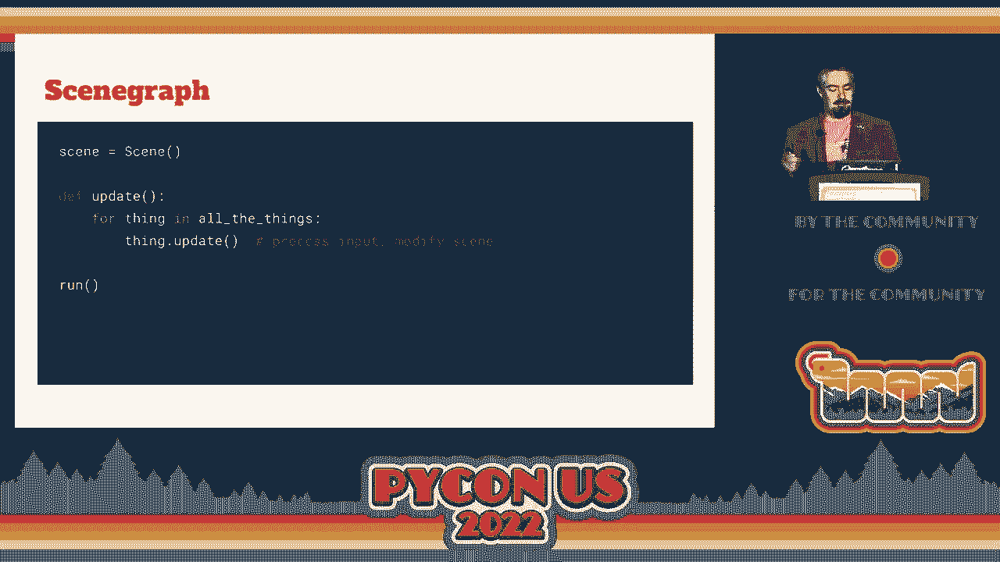

 So now I want to take a little look at the state of the art for concurrency in games。

 I've got a bit of video here。

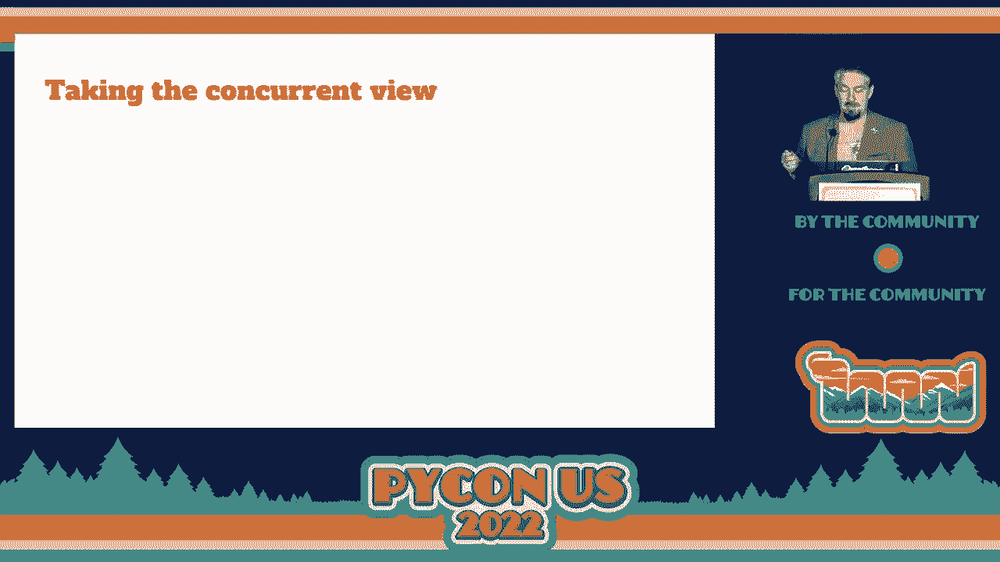

 So in this game I'm moving lots of objects， they are all moving it in at the same time。

 You could easily see how this could be written as one function and maybe vectorized。

 And that view is always going to be useful， that's possibly a faster way of animating。

 many objects at the same time。 But if you look at a different example where you have two actors in the game that are doing。

 completely independent behaviors， this is much more easy to see as two tasks， two sets。

 of behaviors that just happen to exist within the same game engine and the same game loop。

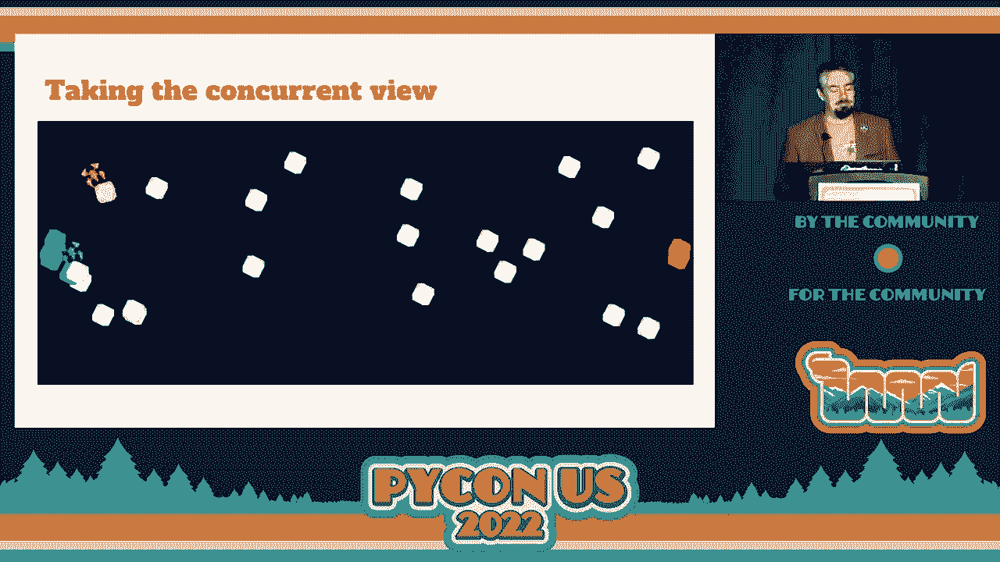

 If we look at the logic for the update function world， there are lots of problems with this。

 So it's messy， there are lots of state variables。 This function even gets cool when there's no work to do so there's an early return at。

 the top。 And this is， it's hard to refactor because it's all woven together。

 We look at a coroutine based version， things get a lot simpler。

 So the coroutine syntax in Python is if you have an await， you are pausing， suspending。

 the execution and you'll be resumed later。 So we're delegating back to the event loop。

 the game loop。 But lots of things drop out of this。

 So the current state of a task is captured by local variables and the position in the。

 coroutine function。 And a coroutine function now has a much bigger slice of an object's behavior。

 So you can see a behavior end to end within a function。

 This is a full example from Wissabi 2D。 So I'm going to walk you through this briefly。

 The scene object is the scene graph， then random position is a function that just returns a。

 random position within the screen。 That's obviously a sync function。

 And then drive ship is an async function。 It's going to create a ship sprite at a random position and then forever it will pick a new。

 random position and then over time it will turn the ship to face that and then over time。

 it will move it to the next position。 And then we pass that coroutine into the run function in order to run that as our game。

 That coroutine becomes our game。

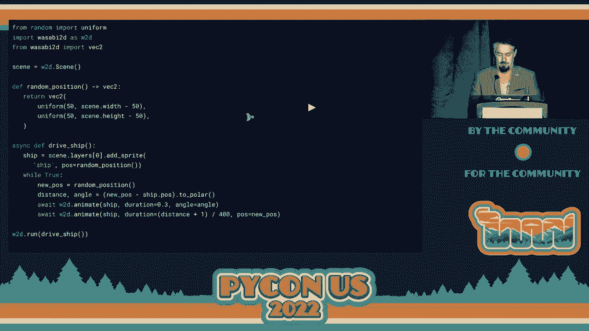

 Taking a look around the world of game engines， Unity has port for coroutines。

 And this is what it looks like in Unity。 But this is quite limited。

 it has a limited capability and the syntax is quite clumsy。

 This is apparently C# state of the art for generators。

 They're still at the phase of using generators as coroutines。 Another example from the world of UI。

 In fact， like JavaScript you would expect it's doing a lot of UI。

 So there would be lots of these frameworks。 And actually this is the only one that I could find that is using coroutines in order。

 to do animations on screen。 So Python has superb coroutine support and let's go use it。

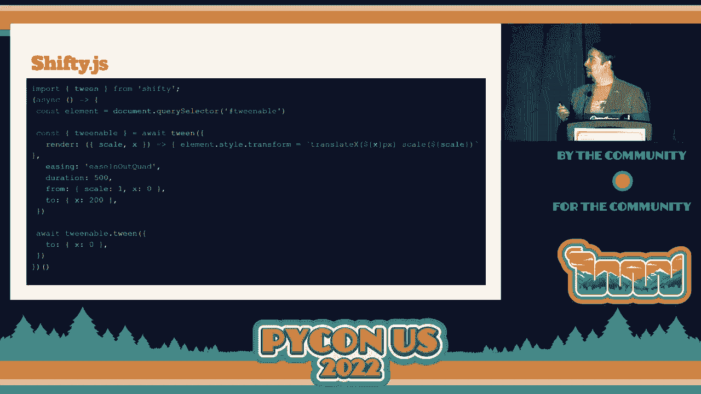

 Another example if you have children perhaps or you are a child this is code from a programming。

 language called scratch， a graphical programming language。

 And it has forever loops and it doesn't have a break。 So naively this would run forever。

 this would just hang。 But this is where you do animation in scratch。

 You do a forever loop so there is an implicit yield somewhere in there。 In fact， in a few places。

 So now we come onto the meat of this talk which is structured concurrency。

 So we've seen concurrency， we've seen the ability to run tasks that delegate to the event， loop。

 What is structured concurrency？ I'm going to steal a quote from Nathaniel Smith who is the author of trio。

 Here's the core idea。 Every time our control path splits into multiple concurrent paths we want to make sure they。

 join up again。 And I'm also going to steal Nathaniel's slide。 The green task is。

 so it's a task that's running。 It starts doing something concurrently。

 And then all of those tasks must finish before the green task can continue running。

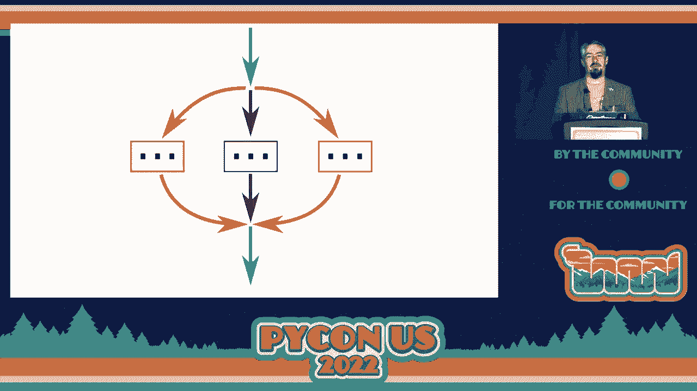

 But we can look at that in code。 This is the code from trio。

 And so imagine you have a fetch function that's fetching a remote URL or something。

 We have an async with block that is opening a nursery。

 And the nursery is the scope in which we can start more tasks。

 And the exit of the async with block is the point at which we wait for those tasks to， complete。

 So unfortunately in Python it's a really important point， a really important await point。

 And unfortunately it's just indicated by that D DENT。

 So keep your eyes peeled for that because it's going to be crucially important。

 So we await both tasks at the D DENT of that block and then we can compare。

 You can contrast this to what we can do with asyncio today。 It looks superficially quite similar。

 But there are a few differences。 So first you can， with asyncio。

 you can still create tasks for the outside of a gather。

 So you could at any point create a disown task that survives a function。 And in fact。

 the way that I've written this， those， the tasks that are created， if you moved。

 one of those outside of the gather， it would still be a task that is running。

 You can also pass code reaching functions in to gather and then the task is， you don't。

 have the task object。 But you can't pass the gather object around and you can't add more things to it。

 But more deeply， there's no concept of ownership here。 So if one of the tasks raise an exception。

 then the， that， the exception will be raised， here immediately。

 But the other tasks will continue running。 This isn't bound together。 In Wissabi 2D。

 you'll see code that is super similar to trio。 Some things are spelled differently。

 We embrace koroutine objects。 But the behavior is exactly the same。 And coming in Python 3。11。

 there's task group。 And it looks super similar to Wissabi 2D。 So in Async。

io and task groups in Python 3 and 11， if you are only using task groups， then yeah。

 you're doing structure concurrency。 It's not going to enforce that you are only using task groups。

 And I still think like Trio has more power。 It's further along in its adoption of this model。

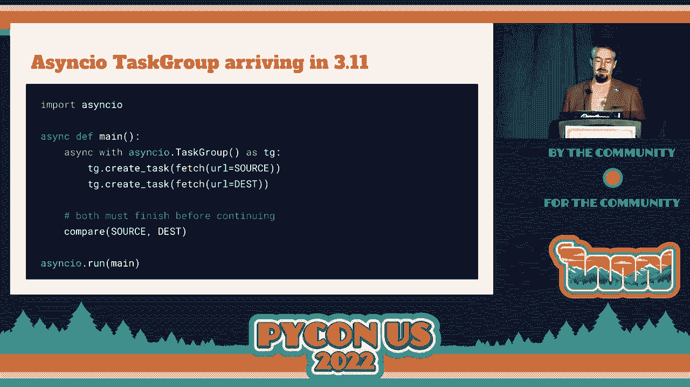

 So the fact that we can only start tasks through a nursery。

 and we have had to enter that nursery before we could do it。

 means that we can construct a tree of the tasks。 There is logically a tree by which tasks are connected。

 to one another。 And this tree could go deeper than this。

 So we don't need to know what drive ship is doing， but if that was running tasks。

 then this tree would be deep。 So we have to bear in mind that there。

 is a tree structured behind this because that's， going to come in--。

 that's going to be important later。 So let's look at a few examples of why structured concurrency。

 is useful in games。

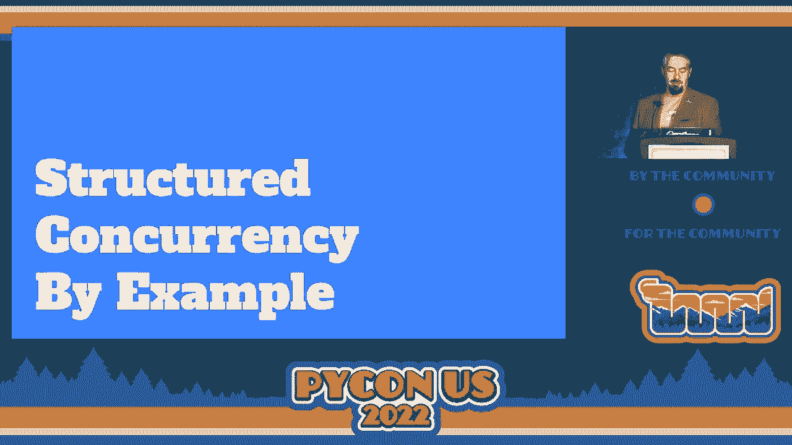

 And to do this， I am using a game， that I wrote for Pi Week in September last year， Pi Week 32。

 The theme was never ending。 So it's going to have a never ending succession of waves。

 of enemy ships approaching。 And I'm flying around and shooting at them。

 And there's a little bit sped up。 So how do we do an infinite progression of waves？ In this code。

 it's tools。count will loop forever。 And it's just going to count up。 And at the start of each wave。

 let's， pause for a moment in order to let the player get into position。 I say pause。 I mean， sleep。

 this coroutine。 The player will still be moving。 And then we start a nursery， and we。

 can spawn enemy ships into it。 The enemy ships were called frex。

 So that's why it's the odd naming of that function。 And the nursery isn't going to exit。

 until all of those ships are dead， which， is why we can write it like this。 [VIDEO PLAYBACK]。

 - But something that surprised me as I was adopting this。

 in writing games is that it was really natural to use。

 nurseries to decompose the behaviors of a ship， or any game object into a bundle of tasks。

 So most of them are defined as closures in this function。 That was in PyWiki， right code quickly。

 But your style preferences may vary。 But there's a benefit here， which。

 is that we can really easily share， behaviors between game objects and not by inheritance。

 but by running their behaviors as part of our nursery， on our game object。

 But the behaviors individually become easy to write。

 This is a compelling thing that in the top example here， we're waiting for input。 Oh， yeah。

 you can wait for input。 So we're waiting for the controller button to be pressed。

 And at the moment that the button is pressed， we create a bullet object。 And then we sleep。

 which puts a limit on the maximum speed， at which the player compressed the button to shoot。

 And something else to note is that we're spawning the bullet， into an outer nursery。

 So it's lifetime isn't coupled to the lifetime of the ship。 In the bottom example。

 I'm just sort of illustrating， how this could be refactored。 So this is the kind of model where。

 you can only have one bullet on screen at the same time， which would give the game a retro feel。

 I think。 But it just requires a little bit of pivoting in the code。

 And the behavior is really obvious in both cases。 But the thing that underpins being able to split apart。

 behaviors as different tasks is cancellation。 So any nursery-- in fact， the primitive that could be。

 cancelled is called a cancellation scope。 And a nursery contains a cancellation scope。 So here。

 we're creating a ship object with a nursery。 And when a-- the code at the bottom is a separate task that is。

 running collision detection。 And when the enemy ship collides with the bullet。

 we just cancel that nursery。 And cancellation means that an exception is thrown inside， every task。

 And when all of the tasks have finished， the exceptions have propagated such that they've all finished。

 Then the flow continues outside of the nursery block。

 And that means that the explosion effects here that will， play。

 that's a graphical explosion effect and a sound， effect。

 So the collision causes the death of the ship， and the ship's， code can react to its death。

 But also， outer cancellation implies an cancellation。 If you had a nursery。

 the nursery that is running your， task would imply， if that's， cancelled。

 then it cancels the task within your nursery and， your nursery。

 So going back to the model of tasks as a tree， you can。

 cancel at any point and flow returns at that point。

 And all of that tree is collapsed and thrown away。 So here。

 the bottom koroutine is running the entire player's， existence。 It's giving the player three lives。

 And then after those three lives are up， it's going to， cancel the nursery。

 And that's going to cancel the level as well。 So game over。 We go back to wave one。

 So returning to the ship， then， there are two ways out of， this function。 Remember。

 we were awaiting at the exit of the nursery。 And we either are cancelled in this scope。

 in which case， the flow continues afterwards， and we'll play the， explosion effects。

 Or the entire level is thrown away。 At which point an exception is raised at that point。

 And flow doesn't continue。 That means that we can start using things like context， managers。

 So here， there are a couple of context managers to show the。

 ships bright on the screen and delete it afterwards and to， turn on collision detection。

 And both of those are turned off regardless of how this， koroutine exits。

 So that's going to seem more of sync with my slides on here。 So this is really important。

 This became really compelling。 In games that I've written without structured concurrency。

 or concurrency as a paradigm， cleanup was really， really， hard， and buggy。

 and because the state is everywhere。 So we can cancel by throwing things away， and we can use。

 context managers when we're doing it。

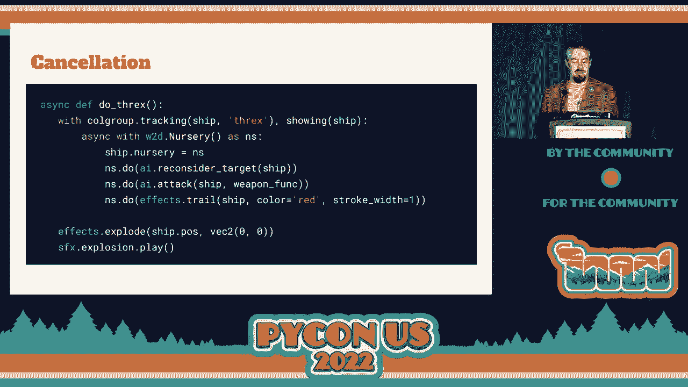

 So I'm going to talk a little bit about some of the。

 synchronization problems or the parallels between。

 synchronization in games and synchronization in I/O。

 So there's another example video here from Axiom。 Oh， what's that？ Can you take that away， please？

 Who's at the desk？ The speaker notes are popped up on there。 OK。

 I'll just talk through it a little bit。 What you're going to see is an example of a play in which。

 there is a repair drone， and there is an iris door which， will open to let out the repair drones。

 And also I'm also going to be picking up powerups。 We're back from there backwards。 OK， cool。

 So I'm picking up powerups。 The powerup building factory things are going to start。

 building another powerup。 Keep your eye on the iris opening and closing to let， drones in and out。

 You can move on from there。 So this is achieved through event objects， which are a。

 thing in Trio as well as with RBCB2D。 And they allow tasks to communicate， not by--。

 so cancellation just seems to be a concurrency primitive， as well。

 But if you don't have anything that you actually want to， cancel。

 here we want generate powerups to continue running。 And it's an infinite loop。

 It's going to do the build up to create a new powerup。

 It will create one and set an event that it hasn't been， collected yet。

 And then it's going to wait for that event， so wait for that， powerup to be collected。

 Then turn off the lights when it is collected， and do it， all again。

 And we use set in the collision handling to initiate that， event。

 And the iris turned out to be really satisfying when I， actually implemented this code。

 because I thought this was， going to be really hard to write。 And it turned out to be really easy。

 I needed two coreroutine， two event objects。 And I had to make the iris control its own coreroutine。

 So you can imagine there's a program running on that， spaceship。

 And it is waiting for a request to open the iris。 And when the iris is open。

 it signals everything that's， waiting to go through it， that it is open。

 And then it waits for a second and times out and closes the， iris again。

 And the function open iris there， request the iris open， and， waits for it to be opened。

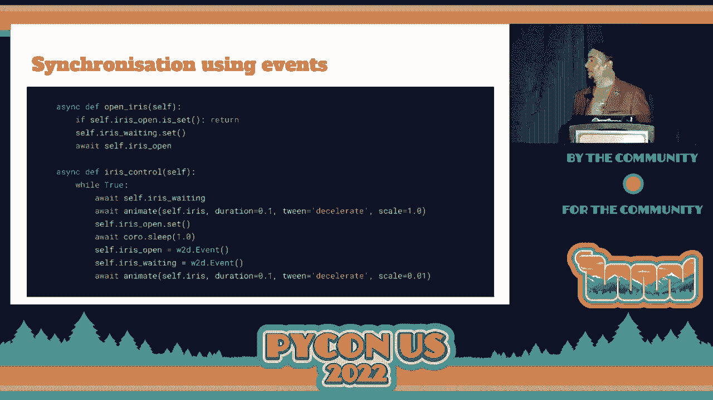

 And that dropped out very nicely。 So why would I write trio in my game engine when trio is a， thing？

 So that slide has moved。 Maybe come back to that。 One reason is that we're waiting at different points。

 So in trio， we're waiting on I/O。 So we're waiting for a， file description to be ready。

 And the call to do that is a select like thing or a， selector。 And in PiGame。

 we're waiting for input events or a time out。 So both cases we maintain a clock。

 which is the next thing， that we need to wake up for anyway。

 But we're using different functions to drive the point， that we blocked the entire thread。

 And we could combine those two， maybe。 We could run two threads。

 And we could pass events between one and the other。 And it would be a little bit clumsy。

 But there was a deeper issue， which is that when multiple， tasks are ready to run。

 we have to have some opinion on， which order they run in。 You can't just not have an opinion。

 You have to pick one and run it。 So which would we run？

 The one that's waiting longest or the highest priority task， if， you had priorities。

 And there's no right answer。 It just depends what you're trying to optimize for。 So here。

 Trio and Walsabi 2D diverge。 Trio currently just picks a task at random， which doesn't。

 necessarily optimize for anything。 But Nathaniel justifies that as avoiding users having any。

 expectations of what it's optimizing for so that he can， change it later。

 Walsabi 2D always runs the earliest created task first。

 So it's a deterministic ordering that prioritizes， determinism。

 And that's because if you picked at random， a task could be。

 scheduled at the end of one frame and the start of another， frame。

 And then it's not seen a whole frame's worth of changes in， the rest of the world。

 So we want it to see approximately one frame's worth， of changes every time。

 The order then might be relevant， but at least we don't， have the jitter to deal with。

 But our ideas of time diverge as well。 So in Trio， we have an idea of continuous time。 So--。

 or the normal time。 I'm calling it continuous here。

 Every time you ask the clock for what time it is， it， will tell you a different time。

 Time will move on。 And we could schedule frames every six-tenth of a second。

 But I would be worried about a task being suspended into， the next frame。

 when it absolutely had to happen in the， first frame。

 So we have a model of time where it's a discrete model， where。

 time doesn't move forward within a frame。 We have a bundle of stuff that has to run， and all of it。

 has to be run before we can say， OK， we're done。 We can draw a frame。

 And the clock will just return the same time within that， unit of time。 So summing up。

 In games programming， structured concurrency lets a， split behaviors into multiple code routines。

 And cancellation seems to be the important thing for， implementing this。

 And code seems easier to write， because as we saw， behaviors are more simply stated。

 We can have more of them。 They can do independent things， even though they're。

 acting on the same objects。 There is a slight shift in focus， which is that。

 exceptions are pretty unimportant for Wissabi 2D。 Exceptions cause cancellation。

 but exceptions in a game are， probably less expected than if you're dealing with I/O。

 It's more likely to indicate a bug in your game logic。

 So Wissabi 2D doesn't bother with handling multiple， exceptions or exception groups。

 So all of this led to a model that practically eliminated， state-keeping bugs in a game。

 And it was very easy to add more animations。 And animations are good in games， because they add。

 graphical richness。 And every time that the world changes， you want to have。

 the player see that as juicy as this model of games， programming。

 where you're trying to keep the player， engaged。 And avoiding a global nursery。

 using structural concurrency， helps make code refactorable， because you can always call a。

 co-routine function from another， or you can pivot your， entire program。

 because they're guaranteed to be self-contained， tasks。 So thank you。 This is all on GitHub。

 The co-routine stuff is on the master branch， and it's， documented。

 But I'm still working my way up to a release。 I've got kids now。

 so it's less time to play with stuff。 Axiom is on the Pi Week website。 And Pi Week is at piweek。org。

 So maybe you could join us for the next competition， which， will be in September。 Thanks very much。

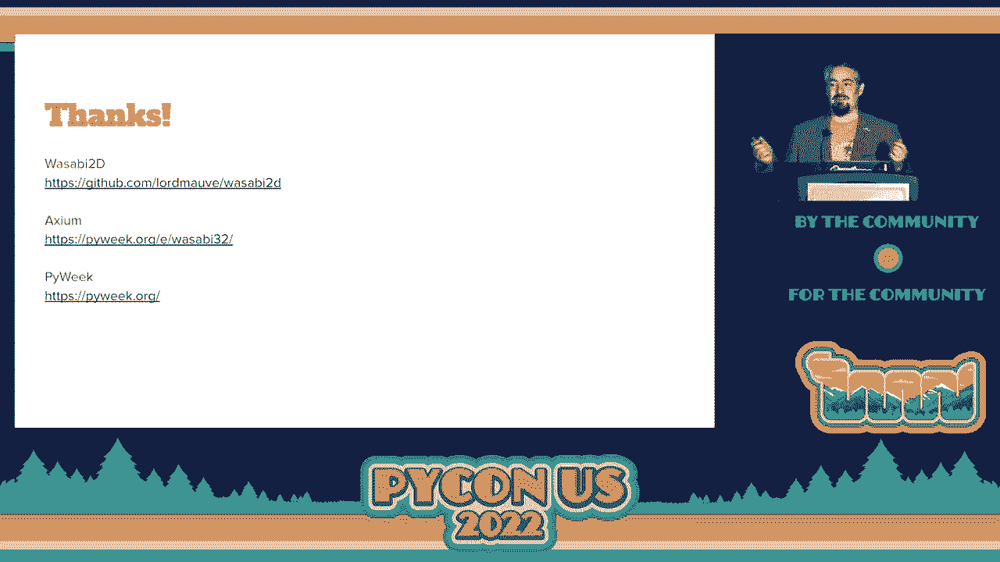

 [APPLAUSE]。