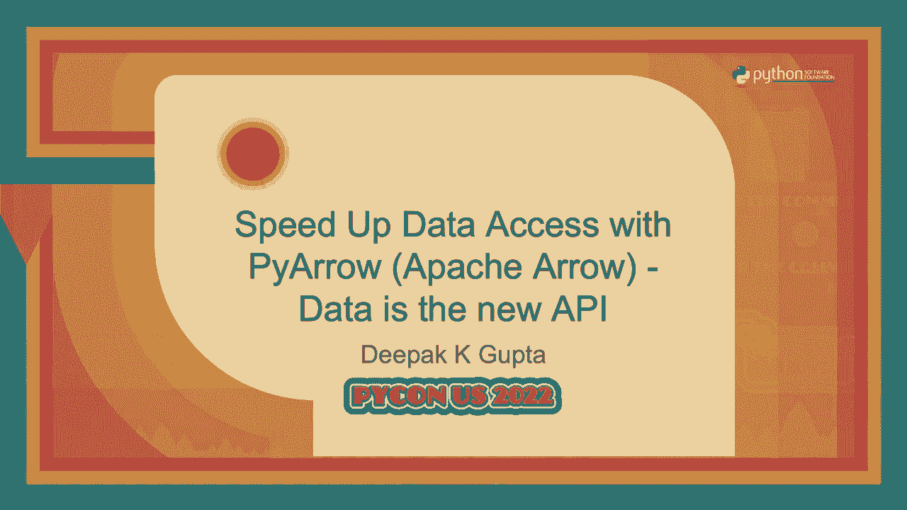

# P35：Talk - Deepak K Gupta_  Speed Up Data Access with PyArrow Apache Arrow   Data is - VikingDen7 - BV1f8411Y7cP

 Good afternoon everyone。 Now the next talk is about speeding up data access with PyArrow。

 The speaker is Deepakutta。 As a reminder， we're not taking questions at the end of the talk。

 You can reach out to the speaker after the talk。 Thank you。 1， 2， 3， ABC。 Hello everyone。

 Good afternoon。 Thank you for joining this talk。 Where we are going to talk about speeding up data access with Apache arrow。

 the Python library， PyArrow。 And what is the meaning of data is the new API？ So the golden question。

 all of you can see my screen。 Right？ Okay。 So this is the third time I am presenting in， PyCon US。

 I thank PyCon staff and members for this opportunity。 Before I go ahead some， introduction about me。

 my name is Deepakkigupta。 I'm also known by the name of Dutch。 I am a tech。

 consultant and CTO to a company called Hotel Hub， which looks after business travel logistics and。

 based out of India， UK and France。 Since we are not going to take any question。

 I have come up with a， trick。 My Twitter DM will be open for today。 If you have any question。

 you can just， you know， write the question without following。 Okay。 So let's start。

 I believe all of you have heard， about this term called data is new oil。 Right？ Yes， it is。

 Data is the new oil， but if you cannot， access the data when it needed。

 you cannot extract the information from the data。 This oil will not， be as valuable as it is there。

 Okay。 So since we are talking about data， we need to talk about。

 some of the very basic aspects of software development， which is what is a software program made of？

 Irrespective whether you are writing programming， irrespective of whether you are writing coding。

 any programming language， whether you are creating front end or back end， any program you write。

 each and every software program consists of only two things。 These two things are data and。

 functions which acts on that data。 There is nothing else in a software program。 Unfortunately。

 in last four to five decades， whenever we are learning programming， we are focusing。

 more on functions， not data。 Remember， main， print， hello world。 This is a function and whenever we。

 are talking about data， we just create one class， few variables and we learn complete programming。

 language without understanding how to take care of large amount of data within the program。

 Remember， within the program and this is what we do in our software today。 Fortunately。

 things have changed， and we are focusing more on data today and to all the programmers out there and the next generation。

 programmers out there， think about data as much as you are thinking about functions。 With this。

 I am going to talk about Apache Arrow。 Apache Arrow is not a framework or library。 It's。

 a specification。 It's a specification for representing data in memory in a particular format which is。

 called columnar format。 And it is language independent but since it is a specification， it。

 doesn't mean that we need to implement that specification。 It has libraries in 12 language。

 either direct implementation or binding which we can use to use this particular Apache Arrow。

 specification。 Pi Arrow is a binding which we can use and we are going to see some of the。

 examples of that。 So， anyway， we are talking about data and all of you must have seen these。

 kind of pictures where you are querying things with REST APIs or even with GraphQL。 So， when you。

 say that REST API give me employee information or PyCon attendees information， how do you know。

 that the information which is coming is actually the same？ It's actually the， you know， attend。

 the information or employee information what you are asking。 There is no way to know but we trust。

 that since I have called this particular API， this API will give me what I have asked for。 Okay。 So。

 this is the way data communication happens but the problem is that if there are。

 two different entities talking to each other at the different ends， you are seeing couple of codes。

 snippets over here。 One is in Java， one is in Python。 Both are binary compatible but still if。

 we need to talk to each other， they need to go ahead with something called serialization and。

 deserialization。 Okay。 So， that is one cost that needs to be paid even if the data is， you know。

 binary compatible。 And this problem is not only between two different programming language systems。

 This is also between your program and databases。 When you fetch data from a database or you send。

 data to a database， this problem of serialization and deserialization is there and it's real。 Okay。

 So， I stumbled across one of a very nice paper online written by Marx and Hens。 It says that。

 don't hold my data hostage。 And this is the picture in second picture in that particular paper。

 You can， just Google it online。 I do not believe that anyone here can dispute this picture。

 There might be， some disagreement with， you know， what is the exact time that it will take。

 you know， serialization， will be less or deserialization will be more but there can't be any dispute on the output of this。

 particular picture。 So， how to solve this problem？ One way of solving this problem is to do what we。

 call it as data is the new API。 So， what is the meaning of data is the new API？ The meaning of data。

 is the new API is that， you know， when I am getting some data， if it is possible for data。

 for itself to tell me that， okay， what am I？ So， I am not sure I am expecting a data but I am not。

 sure which data it is coming， whether it is implied data， identity data or some other data。

 But if data can itself tell me that， okay， I am employed data and these are the places where I am。

 and you can directly use mean， that is the idea behind data is the new API。 And this is one of the。

 ways to remove what we call it as the cost associated with serialization and deserialization。

 And this is where the concept of the in-memory columnar representation of Apache arrow comes into。

 picture。 So， I have created this picture to make you understand that if things are speaking same。

 language， it is very similar to， you know， I am speaking English， you are listening in English。

 But if this is not the case， there will be some interpreter in between and the communication will。

 slow because of that interpreter， okay。 The same thing happens with serialization and deserialization。

 So， if you are using Apache arrow compliant entities on both side， they do not need to serialize。

 and deserialize because both understand the format of memory data that is coming。 Now。

 if you are interested in Apache arrow or Pi arrow and if you want to try it out。

 this is a homework for all of you。 If you want to try it out， this is the first thing you should do。

 Take up Apache Spark and Pandas right now without Apache arrow， if you want to take。

 Spark data frame to a Pandas data frame， you need to go through complete conversion of a Spark。

 data frame to Pandas data frame from JVM to Python memory。 You can enable Apache arrow in。

 Spark with simple parameter and just try it out。 This will give you good enough indication of what。

 Apache arrow or Pi arrow can do for you or whether it is worth for you to invest some time in it。

 You can get some open source code for this but this is something I would like you to try it out。

 first if you are interested in this。 That is why I have shown Apache Spark and Pandas。 So。

 in general what Apache arrow is all about。 So， it says that no matter whether your data is。

 in some blob storage or in some database， when you want to access that data， you put that data in。

 memory using the in memory columnal format of Apache arrow using Pi arrow or for other programming。

 language using their respective libraries。 And you can do lots of things what you could do with。

 Pandas or R in Apache arrow in memory itself。 But still if you cannot do that， you can take。

 the Apache arrow in memory directly to Pandas， NumPy， R or in case of other languages in their。

 respective data structures。 You can take this directly and the biggest thing is that it is。

 possible to have a zero copy access to the memory that is there with Apache arrow to Pandas。

 NumPy or， R。 I have written it limited because there are some limitations that it can happen。

 Zero copy， happen only for purely numeric values and the values which are not null but it is possible to。

 do a zero copy。 So， you can have a Pandas data frame without occupying even a byte in memory。

 As well as you can create memory mapped files for the format that is there in the Apache arrow。

 And you can save that file and use it across processes in a memory mapped way。 So。

 this is the complete idea。 The idea is that we should get rid of serialization and。

 deserialization as much as possible。 And to do that we need to make sure that data itself is。

 capable of telling that what this data is all about。 And Apache arrow is a specification。

 Pi arrow is a Python library and these are the things you can do with it。

 There is a similar picture that is there in Apache arrow website which talks about things in a similar。

 way that you don't do copy and convert because it's a very costly operation。 And in case if you。

 are worried about that dark blue color and light blue color it is all about whatever is in the。

 disk and whatever you want to do in memory。 So， it is all about whenever you are taking your data。

 in memory to do something to do some computation to get some data。

 If you can do it in the arrow format， you don't need to copy and convert。 That's one part。

 Let's talk about this Apache arrow， columnar in memory format。 So。

 in a table we have rows of data even for Python attendees we will have， rows of data。

 Traditionally this is being stored as row wise like one row is stored in memory。

 the next row is stored in memory and third and fourth row is stored in memory。 But the Apache arrow。

 columnar representation said that we have to store data in a column format。 Why？ Because during。

 in-memory computations vectorization can happen easily。 The SIMD of the CPU architecture can help。

 fetching lots of data in the easiest possible way and faster way。 That's one of the reason why this。

 is fast。 So， this is the columnar format， columnar way of representing data in memory。

 Now you might， be having a question stating that you know what？

 I understand it but it looks very similar to you， know optimized row column or parquet files。 Yes。

 you are right but the difference is Apache arrow is。

 in memory and directly computable which means that you can compute on Apache arrow in memory data。

 directly which you cannot do in parquet file or as your for that matter any other database。

 You need to extract data to compute something and when we are talking about computation I would。

 like to show you one example of how the you know py arrow computation looks like but before that。

 let me tell you the kind of computation functions that are available with Apache arrow which you。

 can use with py arrow。 There are vector functions where you can take lots of data and do some。

 calculation。 There are scalar function where you can you know take a single value and do some。

 calculation as well as aggregate functions which are similar to reduce where you can take lots of。

 vectorized data and come up with a result for example sum of elements。 So， here is one example。

 which I want to show you about using compute。 In line number one I have created a numpy array。

 In the line number two I have created a py arrow array from the numpy array and I am using py。

 arrow compute function to get min and max of the array。 In the line number two since it is purely。

 numeric data it is zero copy。 It can be zero copy in the reverse way also just like I have shown in。

 the pictures a few minutes back。 If you are having a apache you want to take a numpy it could be zero。

 copy you want to take a pandas it could be zero copy provided some conditions are met。 So。

 let us talk about the main aspect of this talk is speeding up data access because I said。

 data is new oil but unless until you can access the data when you need it the oil is not as valuable。

 as it should be。 So， I am going to show you three examples and how you can speed up data access and。

 how py arrow comes into picture。 The first example is trivial of reading a CSV file。 So。

 the file which I am reading seems to be a very famous file it is a yellow taxi trip data。

 file January 2021 file which is approximately 126 MB of size。 So， in line number one I am reading。

 the CSV file using pandas。 Line number two I am reading the same CSV file using py arrow。

 Line number three I am converting py arrow to pandas remember that picture we can do that。

 and line number four is all about making sure that both data frames are same。

 Look at the wall timings。 Of course these timings are from my system but there is no reason for these timings not to。

 proportionate in any system you run。 So， in line number one you get read CSV which is wall time 1。7。

 seconds huge。 The same CSV file you can read using py arrow in 129 millisecond and you can convert。

 that py arrow to pandas in 65 millisecond。 So， if you sum up second and third it is around 200。

 millisecond few numbers here and there which is still faster than 1。7 seconds it takes。

 But again I want to remind you that you can convert arrows to pandas but you still have to。

 make sure that there are numerical values and there are some values like date and time which is。

 having a different way of representing in arrow tables。 So。

 this is what you can do in approximately， 200 second and again the output of fourth is true both data frames are same。

 So， this is about reading a CSV file you can read CSV file fast even if you consider converting it。

 to data frame at later point of time。 Second thing is reading a parquet file。 So。

 for parquet files and this apache arrow this is you know kind of match made in heaven both are。

 columnar representation but there are some compression thing that happens with parquet file。

 and when arrow loads it needs to decompress that。 So， here is the wall time between these two。 So。

 if you read it through pandas it is 600 millisecond approximately and if you read it through。

 py arrow it is approximately 100 millisecond。 And the most important example which I am going to。

 show you now is using memory mapped file。 So， in pandas write what happens that if you have a。

 16 gigs of RAM you will make sure that your pandas memory does not go beyond 8 or something 10 good。

 will be 5。 But with this particular memory mapped file which you can create for apache arrow you。

 can read you know 50 gigs of data frame using pandas。 Now there are some limitation with a memory。

 mapped file what I would like to do to get the best possible performance is that the。

 I write a memory mapped file or apache arrow file directly onto the this and then I do a memory mapping。

 So， I have converted the same yellow taxi trip data into a arrow file。 So， I have taken that。

 into a memory and just written that raw file。 So， line number one I have created a memory mapped。

 file which means no memory is allocated。 Line number two I am reading the complete 50 gigs。

 of data if it is 50 gigs read all columns no memory is allocated。 Okay。

 Line number three I am reading， just one column of this 50 gig data it may be 5 gig data。 So。

 no memory is allocated and I can， run some computations on that。

 The interesting thing is line number four。 Okay。 We can convert。

 table to pandas all 50 gigs if it is compatible with arrow format which means it is numerical data。

 there is no null data we can create a pandas data frame without allocating any memory for you know。

 50 gigs of data。 But if that is not the case and you want to do some calculations on some of the。

 columns of the data set you can take only those columns and put that into the data frame。 What will。

 happen is that even if the memory is allocated with pandas data frame the memory will be limited。

 in nature。 So， for a 50 gig file if you want to calculate only for column trip distance and that。

 column is just you know five gigs of size then you know even if the pandas data frame allocates。

 memory it will be five gig it will never overrun your RAM。 So， this is the benefit of memory mapped。

 file reading memory mapped file using pi arrow。 Now this is all about you know reading data within。

 your program within your process but what about reading data across network。 So， when Apache arrow。

 came into picture this was not the case but later something got added and which is called Apache arrow。

 flight。 This flight is mainly for transferring arrow buffer pi arrow buffer or Apache arrow buffers。

 over grpc。 Okay， given you can transfer anything over grpc but in this particular case if you want to。

 you know take care of the performance what Apache arrow has to offer you can transmit only arrow。

 buffers over grpc in case of arrow flight。 So， it is the on the via representation of the arrow data。

 Now in case of inter-process communication some kind of serialization and deserialization is。

 mandatory。 We can't avoid that some kind of serialization and deserialization。 So。

 what Apache arrow does is that is not deserialization they call it rehydration of data which is much。

 cheaper than deserialization which means that rehydration means that I know which memory buffer。

 corresponds to which data and I can just do a memcopy on that。 As far as serialization goes。

 there is no data serialization but there is a meta data that is created using Google flat。

 buffer and that is serialized but that is a small part of the data。 So， that is the additional cost。

 you give if you use Apache arrow flight using pi arrow or any other respective language libraries。

 So， this is a purely client server architecture where you can create a flight server and everything。

 is touched by client。 Client gets the flight info it is very similar to your flight， your whatever。

 airport flight info you get。 It puts the data it gets back the data and this can also be distributed。

 People are you know tending too much to use it as a in-memory cache but the creators of Apache。

 arrow said that this is not meant for that but you know something works for you works for you。 So。

 let's talk about some of the statistics of flight。 Again， I am reading the same New York。

 trip data 126 MB file 1。83 seconds this time fine。

 Now with Apache arrow flight we can only transfer， arrow buffers not any other buffers。 So。

 I worry about wall time so I have converted that data。

 frame into arrow table and it took me approximately 194 to 100 milliseconds and when I transfer that。

 particular 126 MB data to a server it took me approximately you know again within the range of。

 200 millisecond。 That's a huge I mean that's fast considering that much data transfer over， network。

 Of course these these were you know fastest land possible and in the ideal condition。

 but again if this is going to be proportionate with all the other loads your other things is also。

 going to be proportionate and when we talk about fetching the data back same 126 MB odd data fetching。

 back again it's approximately 158 or in that range only within 200 millisecond。

 Now why I am talking about this particular thing you know we have managed to transfer 126 MB data。

 and get back 126 MB data within you know 400 odd millisecond that's fast。 In contrast if you are。

 trying to store a data frame somewhere and you want to serialize that data frame one of the most。

 often used technique is pickling。 Pickling takes time so does unpickling that will also take time。

 Here you can use the data as soon as you get it so the table which you are getting it over here。

 in the top of the screen you can use that table then in there itself you don't need to unpickle it。

 So arrow flight in my opinion has interesting possibilities it is very fast and for the purpose。

 you want to use it it's up to you。 So the opportunities with this particular new format new way of。

 representing columnar in memory data is limitless but always evaluate the cost even if something is。

 very fast performant there is a cost associated with it so nothing is free in this world and I。

 guess I forget to give a disclaimer in the beginning that I am not related to Apache arrow I am just a。

 user and maybe a potential future contributor but at this moment of time I am a user。

 So with this I complete my talk I thank you all of you I hope that I knew spent here was worth it。

 Thank you very much。 Thank you。

