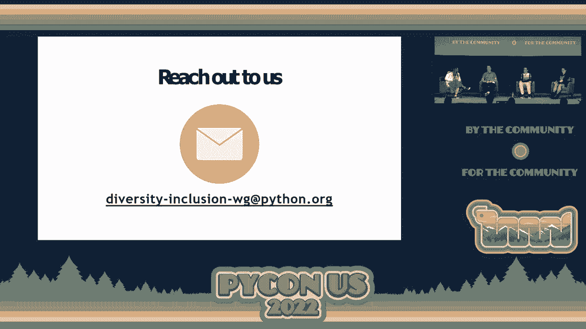

# P4：Diversity & Inclusion Workgroup - VikingDen7 - BV1f8411Y7cP

 I would like to introduce Georgie Kerr， Lorena Mesa， Anthony Shaw， and Reuben Lerner for our。

 Diversity and Inclusion Work Grip Panel。 Dangerous chairs。

 I want to say hi to all those people watching on live too because I would not have been。

 saying much to them， but we see you。 So today we are having a panel chat here with a group of us。

 so we are going to talk to， you a little bit about what PSI， PSF。

 Diversity and Inclusion Work Group is about， why we're， here today and how you can help us。

 So let's do a quick self-introduction。 Hey， I feel like I live on the stage this morning。

 My name is Lorena Mesa， pronouns she/they。 Oh， and I'm the current chairperson at the Python Software Foundation。

 do things with， the piloties， etc。 I'm Fonnyshore， PSF fellow over on nuisance。 I'm Reuben Lerner。

 I'm a Python trainer。 I'm Georgie， I'm a woman。 Okay。

 so the Diversity and Inclusion Work Group was set up in November 2020 and there's a。

 total of 20 members led by Marlin。 So here's a little map that you can see of the members around the world。

 You might have met a couple of them in person like Deborah， Christian， who is there too。

 Deborah should be somewhere around。 So why do we create Diversity and Inclusion Work Group in PSF？

 In 2020， there were four seats available in the PSF World of Directors and we received， 26 nominees。

 nine from North America， four from South America， two from Europe， six from。

 Africa and five from Asia。 That's part of APAC。 So by the end of the election。

 all four elected parties were from the USA。 We also realized that out of 1，151 members， only 40。

1% of us voted。 Now let's look at the changes and achievements in 2021。 Now in 2021。

 we have actually three board seats available and 19 nominees。

 So you can see that most of the members didn't， mainly from Asia and South America。

 Now this time we have elected parties from South America， one from Africa and one from， Europe。

 Still， no elected parties from Asia despite seven nominations。

 We do have more members signed up last year that was like 1，538 members who were eligible。

 to vote but only 39% of them vote。 In 2021， we have more languages in our documentation。

 We translated into 10 different languages thanks to all our volunteers。

 With the help of over 200 Pythonistas， the Spanish translation was completed in January， 2021， 2022。

 We also see that the Python technical leadership mostly co-developers in North America。

 If we look at the growth of Python developers worldwide， the developers grew from 8。2 million。

 to 10。1 million in 2021。 That is like 1。9 million within a year。 That's amazing Pythonistas。

 So let's look at the geographic distribution around the market。 Based on the GitHub repo in 2021。

 although this data does not filter any languages but。

 since Python is one of the main languages around the world， it's pretty accurate。

 There is no doubt that Asia is the dominant market。

 Now let's discuss a little bit about the slides and based on the facts that we have here。

 What do you think was a problem during the 2020 PSF election？

 I always get asked what in the world is the Python software foundation and as a director。

 for six years， I've been saying the same thing over and over which is we are here to help。

 build an inclusive and diverse community that is as inclusive and diverse as our users。

 I think one of the things that started some of this conversation that led to the creation。

 of the diversity and inclusion work group was us thinking a little bit about the mandate。

 of the Python software foundation。 Again， the Python software foundation。

 we helped put this event on。 We helped think about fundraising。

 We helped thinking about what are the issues around the world that Pythonistas are facing。

 We own the trademark， et cetera， et cetera。 Considering that the board of directors unfortunately has historically had a bias towards people。

 in the United States or North America and Europe， what I think we're seeing is as we。

 continue to grow and have a more global population of Pythonistas， we're not maybe reaching the。

 plethora of issues that we could otherwise be if we were having directors or having more。

 inclusion with voting members， et cetera， of Pythonistas around the world。

 One of the things I think was really great with the end of the lightning talks is we see。

 the growth of the regional conferences but again， we're continuing to kind of have a little。

 bit of a stagnant issue with outreach and not to say that directors who come from the。

 United States or directors who come from Europe don't understand these issues but we。

 all know that the people that are in these given communities are best able to speak to。

 things that are the unique challenges in their neck of the woods。

 So I think that was one of the main things that led to this discussion。 Again。

 all of us are volunteers， we're all very passionate about this community but literally。

 our mandate says we are building a diverse and inclusive environment and community that。

 reflects our user population。 So I think that was like a really big thing that kind of jumped in and that was something。

 very glaring to us in the election was just seeing that we weren't maybe reaching people。

 in a way that we could otherwise be reaching them。 Right。 That's true。 Anthony。

 what do you think in 2021 we see it some changes there？

 We do have more members but what do you think the changes actually cause in 2021？ Yeah。

 so things have changed quite a lot over the last couple of years。

 The membership has expanded and there's been a lot more people sign up from Asia in particular。

 So I guess the membership of the PSF has expanded and also geographically and in other aspects。

 it's a lot more diverse。 In terms of the board nominees at least。

 I think there's a lot more diversity in the， nominees。

 I think what we need to look at going forward is how do we make sure that we advertise that。

 more and continue to try and recruit members into the PSF。

 We do see also that there's actually more still mainly the core developers from the US。

 Does that mean that the experts are actually in the US only？

 So I mean there's definitely a lot of skills in the US and that's kind of obvious。

 But it's not exclusive to the US and there are definitely people with talents and skills， elsewhere。

 I think before we look at addressing this and trying to make it more diverse， we need to。

 appreciate a couple of things。 One， the healthy discussion and community of core developers is critical to the success。

 of Python。 And we need to protect that。 That doesn't mean that bringing new people in is going to make that worse。

 And I think we just need to kind of plan things a bit further ahead。

 So if you look at the core requests to see Python， they are diverse。

 So there's people from all over the world making their first changes to see Python， submitting。

 core requests and things like that。 But at the moment。

 it's still a bit of who you know and it's easier to get a core request。

 merged if you know some of the core developers or you're already a part of the community。

 or you're a known person。 But I think if we want to get more core developers from diverse geographically。

 then we need to， look at how can we spot or at least identify people who are trying to contribute and actually。

 bring them in and have a discussion with them。 Because I don't know if anyone else remembers the feeling when they get their PR merged。

 the first time is just--， Yes。 --it's just nice。 --yes。 Especially see Python。

 It's a pretty high bar to get something into see Python。

 And there are people doing this every day from all over the world。

 So I think we definitely need to look at how we can bring more of them on board。

 I do-- I do feel that living in Asia previously that a lot of people or developers in Asia。

 feel that they're not capable and they're not good enough。

 Is there a way to actually make them reassure that they can actually contribute and they。

 are actually good enough？ I think mentoring has been demonstrated to be really effective with bringing on core developers。

 So existing core developers mentoring people。 And there have definitely been cases of that with new core developers from Africa and also。

 from Asia。 And people existing core developers mentoring them。 I think that's been really effective。

 And in terms of the resources as well， it's really important。 Right。 So， Rover。

 what do you think how we can actually reach out to these people there？ So look。

 I think a big problem is just sort of the perception of software in general and。

 Python and open source software in particular that for many people they're like， okay， I。

 have software。 And when they see open source， they don't think， oh， community support and written。

 they think， free。 Right？ I could download it。 I don't need to pay for this thing。

 Certainly a lot of companies say that and think that。 And the notion of， oh。

 there's a problem with this or there's something that could be better， I can change it。

 I can be part of that improvement that doesn't occur to most people。

 And then take it even a step further。 The notion that there's an organization that's charter is to help people improve the language。

 based on their needs。 That's like the furthest thing from their minds。

 So the first thing I think we have to do is do a better job of telling these people， the PSF exists。

 the community exists。 It's not just a word。 All of the Python community， it's all the people use it。

 There is an actual community and you can join it and you can be active and you can influence。

 its direction。 And once people have that sense of， oh， we can influence it。

 then we can start to talk， them about the different ways to do it。 Code， documentation， translation。

 teaching， the works。 So one question here to the public。 How many of you are PSF members？ Oh， wow。

 How many of you actually voted last year？ Very good。 You people all that can use you online。

 So let's see how you can help。 There are four ways you can help。 First， you can actually。

 if you feel that you would like to share with all of the discussion， you can。

 for bias with your feedback， scan the little QR code over there and answer the。

 questionnaire and tell us what you would like， how you would think that we can actually。

 make a better global representation and help the community to grow。

 Or if you are not a PSF member yet， sign up。 Sign up on PSF-o-r-g and there's membership。

 And if you are already a PSF member， vote。 Another interesting thing that we。

 people that doesn't know about it is the Community， Service Award。 Lorena。

 can you actually explain a bit？ Sure。 And actually， later today with the PSF community update。

 you'll get to see some of these amazing， fine folks。

 We actually have some CSA recipients here on stage like Georgia。

 And something that I think is really important to think about is we're all doing amazing。

 work in our own communities。 And it can be that you are contributing to a project。

 You are running your meetup。 You might be doing something really novel and interesting with Python。

 All that being said， we'd like to support our community and you can do that by writing。

 in to the Python Software Foundation。 Just write a small blurb of who or whom it could be a group。

 an organization， a few people。 Telling us why you think these people ought to。

 or this organization ought to receive the， Community Service Award。

 We do them quarterly and we are always looking for more people to lift up， particularly from。

 spaces where maybe we don't have as much insight。 Again。

 one of the things we're always trying to think about is how do we support one another。

 and how do we acknowledge all of the great work that we do。

 And a small way you can do that is with the CSA。 Yeah， exactly。

 You can also look at the picture that's on the slide。

 It's also one of the community as a whole that has been received award from Python， Japan。

 They have donated I think 25，000 US dollars amazing amount of money to the donation。

 And apart from that， they have been always active in whatever all the Python related community。

 service as a whole。 So if you see anyone in your community around the world anywhere， do sign up。

 tell us， tell， us that they exist and tell us what kind of job they have done。

 what kind of amazing job， they have done and let us know because we need to know。

 Everyone needs to know that there are somewhere， a Python is to this， doing the work， helping。

 the community that's spreading out the word and when you have that kind of assurance。

 that your work has been recognized， that actually makes a difference。 I mean。

 I'm sure every one of you felt it when someone come to you and say， "Hey， thank， you。

 especially for example， Anthony， do you actually see people coming to you and say， "Oh， Anthony。

 I love your contribution。"， That's actually happened quite a lot this weekend and I didn't really wait here。

 Yeah， it feels amazing and very， very humbling as well。

 And I really appreciate it to anyone who has had any positive comments and stuff like that。

 And also getting to meet people who I really respect in the cup too at the conference and。

 share that feedback with them as well。 And meet loads of new people and people who want to get involved and they're keen and they're。

 enthusiastic and just trying to keep encouraging that is really important。 So how about you？

 Do you feel anything during this conference， Ruben， did anyone come to you？ Yeah， definitely。

 And first of all， I'm going to echo what Anthony said， which is meeting people in person who。

 you've interacted with online， what is my mailing list or Twitter or elsewhere。

 That is of course great。 And look， there's so many people doing so many things for Python。

 some big and some small。 If you see them， tell them， right？ If you see them here。

 if you see them online， let them know， encourage them to do this。

 It's because people are doing these things big and small that Python exists as a language。

 as an ecosystem。 And I've been in technology for a while now and I continue to be impressed by the generosity。

 and the kindness in the Python community。 And that just is going to encourage more people to join us。

 more people to come in， more people， to contribute， which is good for everyone。

 I've heard diversity and inclusion described as this。 Diversity is being invited to the party。

 Inclusion is being asked to dance。 I heard that at， I think it was， Python， Columbia in 2018。

 And I thought that was a really great way of thinking about it。

 When you hear like diversity inclusion work group， you might be thinking， oh， we have。

 some data figures that we're trying to hit or we have some explicit programming。 But really。

 the programming comes as a result of what we， as a community care about。

 I have quoted Brett Cannon more times than I care， which is I came for the language， I。

 stayed for the community。 Let me give you one example of the way I think about that。 Marlene。

 who is one of， who is a director from Zimbabwe， was doing this amazing work， educating。

 young women in Zimbabwe。 And I was reading the grant proposal and some of the impact of the work that she had done。

 And I was completely fangirling。 I believe it was Python in Portland in 2016。

 I was doing my recruitment looking for directors to contact。

 And I just started talking to her on Twitter。 I was like， you're amazing。 You're amazing。

 Have you ever thought about running for the board？ You have such a great perspective。

 You're doing all this really great work。 And I think over the span of like spamming her on Twitter over the entire Python weekend。

 I finally got her to sign up。 And now she's doing a phenomenal， not that she wasn't before。

 but she's continued to， be doing phenomenal things。 And she's a community service recipient。

 has helped start Python Africa。 The Python African communities have been so instrumental， I think。

 in showing again a different， perspective that we may not have otherwise seen。 I know Kojo。

 who I see here in the audience。 We were at Python Africa the inaugural year and just seeing that explosion of growth。

 And again， it starts with such a small thing， acknowledging the work that other people do。

 and just supporting them can be a step in the direction again to continue to build that。

 inclusive and diverse community that we all as Python each does care about。

 So that's my example when I think about it。 So if you have any other questions。

 do reach out to any one of us when we are somewhere。

 hanging out or Christian or Deborah or online on this web email。 And do vote。

 sign up as a PSF member if you are not， and help to let us know everyone around。

 the world that's contributing to this community。 That's how it can be sustainable。 Thank you。

 [APPLAUSE]， (applause)， (applause)。