# P48：Talk - Juan Gonzalez_ Improving App Performance with Snapshots - VikingDen7 - BV1f8411Y7cP

 And thank you very much for coming to the last set of sessions， actually it's the last。

 session for the day。 Our presenter today will be Juan Gonzalez I think， right Juan Gonzalez。

 And the title of his talk is Improving App Performance with Snapshots。 All your fun。 Hey everyone。

 thank you so much for being here， my name is Juan and I'm here to talk。

 to you about improving your app performance with Snapshots。

 I am a staff engineer at CDER and CDER is a digital health startup。

 Our mission is to make the patient and billing experience a lot better， a lot smoother and。

 a lot more transparent。 And a big part of that is making sure that we have a very reliable app。

 And if you want to have a reliable app， a big part of that is having an app that performs。

 pretty well。 So this is a very important topic for us。 Now I'll be honest with you。

 every application is unique and because every application is。

 unique I cannot give to you today one perfect， golden bullet to solve all of your performance。

 issues。 Every application's performance issues are going to have a different unique solution to， it。

 So at best what I can try to do to you is give you some advice from my own anecdotal experience。

 and from what I've experienced for a lot of applications that have been started up in。

 a very fast way and are starting to experience scale for the first time， they'll often realize。

 that their database is actually their bottleneck。 And if they're not seeing that then it's a good chance that in a few days or a few weeks。

 or a few months that they will actually realize that their database is actually now their bottleneck。

 And the reason for that is pretty simple。 A lot of applications start off with a single server database model。

 meaning your database， becomes a single point of failure。

 And it's just so easy to set up a database that way and it's just also a really good。

 idea to start your database that way and not overcomplicate it。

 But another reason why is because databases themselves they have tons of I/O that they。

 have to go through。 And I/O is just a notoriously slow set of operations to deal with。

 So it's not uncommon to realize for the first time， hey my application is slow and you realize。

 oh wait， it's actually my database。 So today I want to kind of get us to focus on improving your databases performance。

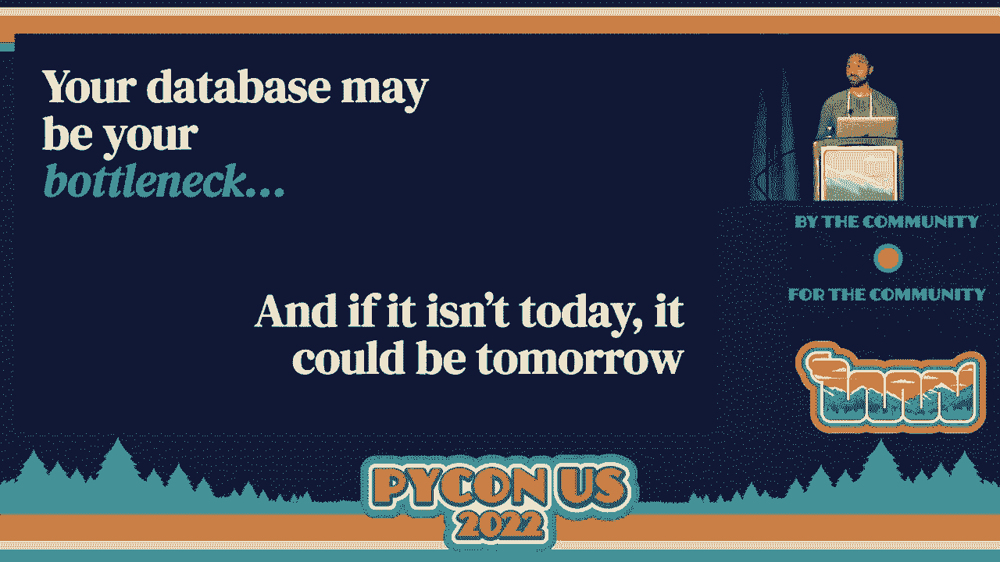

 And that's what I kind of want to focus this talk about。

 And there's really kind of two different categories for improving your databases performance。

 One of them is database scaling。 And there's kind of two different ways you can do that。

 One way is vertically scaling your database。 And that's the approach of taking your single database and basically beefing it up。

 That could be improving at CPU， increasing at RAM， increasing your databases' disk speed。

 That all falls into the category of vertical scaling。

 Another way you can do it is horizontal scaling。 Horizontal scaling is the approach of taking your database and basically splitting it up。

 You can do that in a few ways。 You can add other databases to handle all the reads in your database or you can split your。

 database up in ways such that different reads go to different databases， aka database shorting。

 But they all fall under the same category of horizontal scaling。

 And that's basically infrastructure scaling。 But there's another way to do this and it's actually query turning。

 So for some of you， you may not know what I mean when I say query turning。

 And what I'm basically talking about here is the process of taking your SQL and basically。

 cleaning it up。 So what that means is you're taking your queries and you're finding ways to rewrite them so。

 that they are doing the same jobs but doing them in a much more efficient way so that。

 you don't have to actually improve your infrastructure of your database and you can actually just。

 improve your application code itself。 And query turning is great but unfortunately it's actually really hard to do。

 Surprisingly horizontal scaling and vertical scaling， two complicated tasks themselves have。

 many step-by-step instruction guides for how to accomplish them。

 And actually nowadays there's tons of tools built into cloud infrastructure or your databases。

 themselves to help you out with this process of vertically scaling or horizontally scaling。

 But query tuning on the other hand is not easy。 There's no step-by-step guide for query tuning because every application like I said is unique。

 So the issues with an application is the queries are going to be different for every application。

 and it's going to require tons of research to figure out what is the issue。

 So it's not an easy task。 But with that said， it's actually quite worth it。

 Horizontal scaling and vertical scaling that requires you to actually spend more money to。

 accomplish the same tasks of improving your database performance whereas query tuning is。

 actually a process that actually reduces that infrastructure cost because you're actually。

 putting less load on your database。 And hopefully also reducing complexity because it could end up with queries themselves that。

 are easier to understand but also less of them in general。

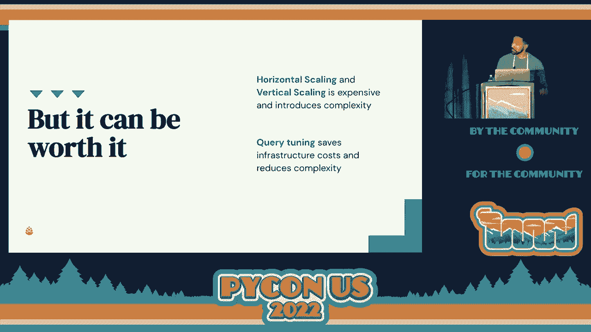

 So query tuning is hard。 We understand that but there's another complex。

 there's another complications of this all。 We are at a Python conference so it's easy to guess that applications we're talking about。

 here are Python applications。 And because they're Python applications if they are dealing with a database they're probably。

 using an ORM and in case you don't know what an ORM is or what it does， an ORM is basically。

 a tool to help you deal with your databases operations in a way that is object oriented。

 And that allows you to do things such as define all your tables as classes， fetch all the rows。

 of table data as objects in memory and also just offer some tactics for joining together。

 data that are related to each other。

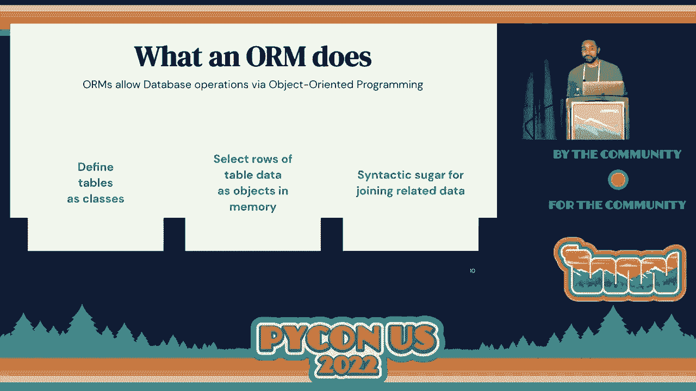

 And ORMs are great。 They are very popular for a reason。

 We use a mess leader but they also make query tuning harder。

 And it's kind of hard to explain without giving an example of why。 Sorry， catching a rough here。

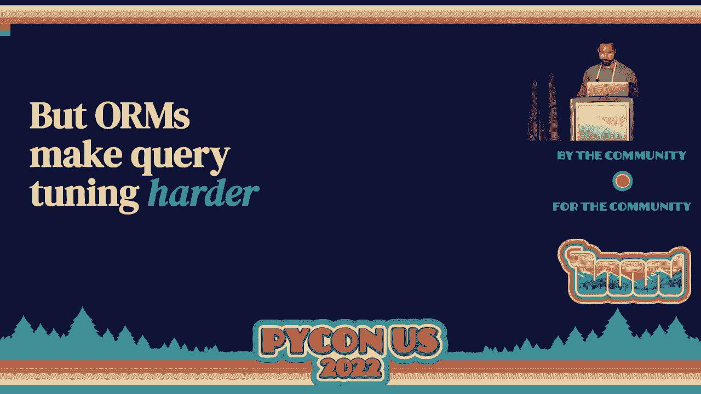

 So yeah， ORMs make query tuning harder and I'm going to try to explain this to you by example。

 So imagine that you are working for a company and this company has made the perfect restaurant， app。

 It's an app that's made for restaurants to download and for eaters that enjoy their times。

 that these restaurants to download as well。 And it's supposed to make a perfect little synergize experience for restaurants and consumers alike。

 And you are newly hired site reliability engineer for this company and the company has experienced。

 tons of growth。 But unfortunately with that growth they're experiencing tons of database performance problems。

 So you come in and you are now becoming the savior to try to fix all these problems。

 And you learned that this application is written in Django which is a very popular ORM。

 But unfortunately you are not very familiar with Django。

 You do not know yet that Django has some issues that are going to make query tuning harder， for you。

 So you naively agree to tune these queries in this ORMs code and you run it to three problems。

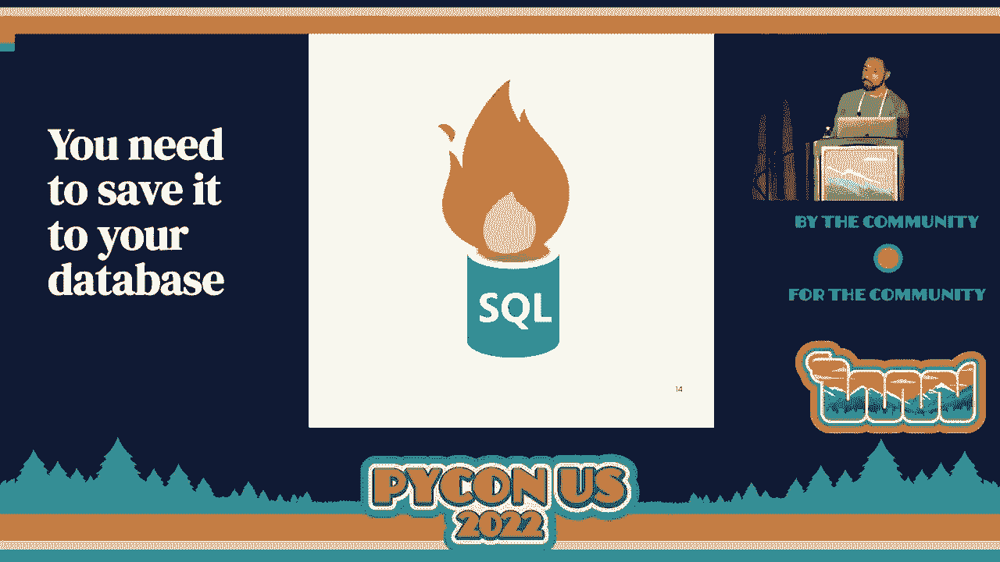

 along the way。 One of the problems you run into are ORMs code can look very different from SQL that is。

 executed by that ORM。 You know， ORMs are basically just translators of Python code to SQL。

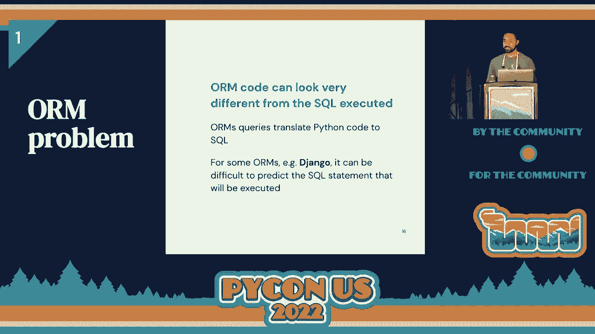

 And what you see is not always what you get or to someone who's not experienced at least。

 is what can be the experience。 And I'll kind of show you an example of this。

 So here on the right this is some Django code that allows me to see every dish that is ordered。

 by this customer named Juan。 It looks like very clean Python code maybe。

 If you're familiar with Django you might know exactly what's going to happen。

 But if you're not familiar with Django you might be very surprised to see that that Python。

 code that you just saw produced this query here which was operating on three different， tables。

 four different tables because the Python code itself almost suggested it was。

 acting on just this dish table。 So that's the first problem you run it to and you find that to be very annoying。

 But you start to learn the ins and outs of Django and how it produces SQL。

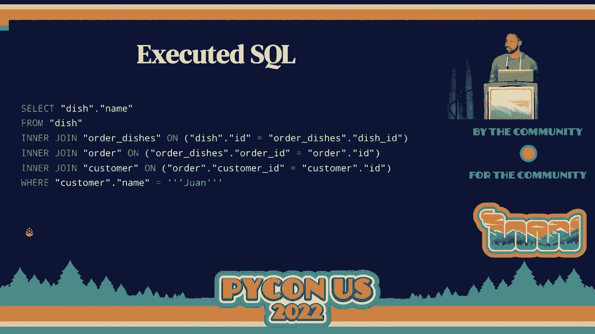

 But you run it to the second problem as well。 Even after you understand Django you're working in a Python application。

 So you start to realize there's another problem here。

 The Python code is written in such a way that functions call other functions and those functions。

 call other functions and they call them for different reasons。

 And you're having a hard time understanding exactly when and where these ORMs are actually。

 triggering query execution and why。 And what you would really love to see is like a stack trace explaining what exact line of。

 code is actually triggering these query executions。

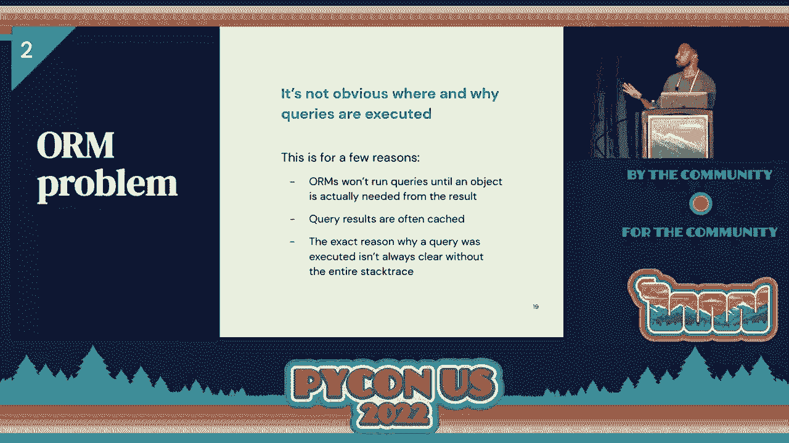

 So as an example if you're not familiar with Django you might look at this code and wonder。

 how many queries are being executed here。 So on the first line you might notice hey there's orders maybe we're dealing with all。

 the orders in this table are we executing a query there to grab every object from the， orders table。

 On the second line you're doing an annotation is that we're running a query。

 Is that we're finally running our first query or is it on the next few lines or is it at， the end。

 And if you're familiar with Django you'll probably know right away is actually at the。

 very end here。 This is the first and only place where a query is actually executed but then again you may。

 not， you may be surprised to see that this is the actual query that gets executed。

 It's something very complicated。 But that's really the second problem you start to notice。

 You're not sure where and why things are happening because you're not an expert on this。

 yet。 And then the final problem really kind of you know really kind of grinds your gears here。

 and that's that there's this n plus one queries problem which technically is not unique to。

 an orums but can happen in orums much easier than the application that was written in pure， SQL。

 And that's because an oracle makes it easy to fetch related objects from another one。

 And unfortunately this can make it extremely easy to accidentally query one table many times。

 when you could have actually created it exactly once to fetch all these different objects。

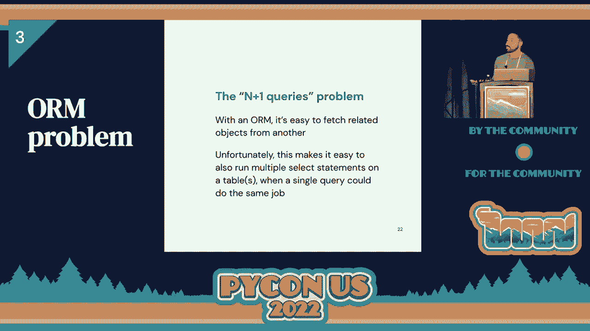

 And as in a sample here we have some bad code that is trying to get all the orders that。

 include addition and code be beef。 And at the end of that once we have all these orders we want to get the customer name for。

 each of those orders。 Now if you're familiar with Django you might realize this is bad code because what's going。

 to happen is you're going to do an additional query for every single order to grab the customer。

 name on that order。 And to see that in pure SQL here's what happens。

 You do one query to get all the code be beef orders and then for each of those orders you're。

 going to query the customer table to get the name for the first customer in that order。

 and then you're going to get the customer for the second order and then you're going。

 to get the customer for the third order。 So you just set a bunch of unnecessary queries on this same customer table that you could。

 have gotten in actually one execution。 And that's a pretty bad problem。

 The better code is to select all the customers at once when you're grabbing all the orders， as well。

 And that's what using this nice and tactical function on your original query set to select。

 all the related customers when you grab all the orders。 And that's going to actually produce a very。

 it's going to produce a much more performant， query execution where you do actually just one query。

 The problem with that is that you have to basically be an expert in Django to know that's。

 the case and even still it may not be obvious after the fact that you wrote code that actually。

 did this the right way。 So you see this and you think that you might have taken on this task prematurely and you。

 kind of just come to the conclusion that query tuning is probably too hard open or。

 am you may even think hey maybe the team should just stop using orms altogether and you may。

 think that the active query tuning is not a worthwhile endeavor。 It's basically impossible。

 You should always just scale your infrastructure and call it a day。

 But that's unfortunate because in reality， query tuning is actually， it can actually be。

 pretty easy。 The problem is that there aren't enough tools to really help this problem。

 And that story I just gave to you， it kind of hits very close to home procedure because。

 in 2019 we were experiencing tons of growth and our database was the bottleneck for us。

 And we did do infrastructure scaling。 We introduced Ruby replicas。

 We scaled our database horizontally。 We beefed up our database， made it stronger vertically。

 But we still wanted to find a problem to this query tuning problem。

 So one of our models is no mediocrity。 So we didn't want to just settle with the idea of having a non-performant or M code。

 We wanted to kind of find an answer for this problem。

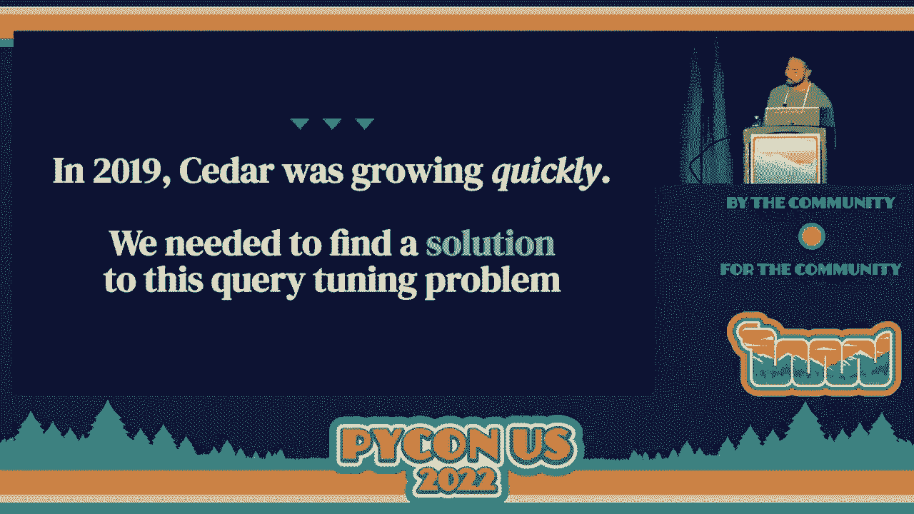

 And so we kind of introduced this concept of queries and have shots。

 And what we wanted from it was kind of simple。 What we wanted was a way to see every query that we were executing in our M code。

 And we also wanted to understand exactly where those queries were executing。

 And we also wanted to actually isolate the Python code that was triggering those queries。

 very quickly。 And we wanted to get this info at basically every stage of local development。

 And it's important to make that to kind of pause in this one statement here。

 There are tons of tools available today where you can actually do query inspection。

 A popular one is Django debug toolbar， which lets you do this deep dive of queries that。

 are being executed on a browser page。 But you have to do everything from a browser。

 So that's kind of what I mean by you want it to be able to use this at any stage in local。

 development。 So it's a terminal in the browser and middleware and tests basically everywhere。

 And because we have a model of no mediocrity， no mediocrity， we also wanted this to have。

 a very simple and intuitive interface as well。 And what we ended up doing was we created this tool called Snapchat queries。

 which is now， today an open source or an query capture。

 And I'm going to kind of show you what it looks like。 So it is out of the box a context manager。

 What it does is it lets you look at -- it lets you capture every query that any block。

 of Python code that is using Django or SQLAlchemy is executing。 So on the right here。

 all you have to do to use it is run this little snapshot queries， context manager。

 And what gets returned back to you is a list of all the queries that were executed。

 So on the right here， what I would expect is after this block of code exits， I would。

 see all the queries that were executed to grab this customer in a one to see the query。

 that was executed to create this order for one and to see all the queries that were executed。

 to add all these different dishes to his order。 And that's right out of the boxes which you get from this tool。

 And that's great as is。 But after we introduced this tool， we also started to enhance it。

 added more features， to it。 And I kind of want to talk to you about the top five features that were added to this because。

 I can't go over all of them in probably in time。 So I just want to highlight the top five。

 So feature number five is kind of what I described to you。

 You get to see every query that is executed。 But not just the query itself。

 You get to see the query SQL which is probably pretty obvious to you all。

 You get to also see very quickly all the Python code that was executed to trigger that query。 Sorry。

 when I say Python code， I mean the line of Python code that was executed to trigger， that query。

 And then you also get to see exactly how long it took to execute that query。

 Which from my own personal experience when I was in 2019 helping us figure out ways to。

 reduce our sites impact on our database， just to use three features alone were extremely。

 useful for me as always doing local enhancements to our code to make it a lot faster。

 But it's still number five。 So that means that there's four better features than just this alone。

 Number four is right out of the bat when you use this tool， when you have this list of。

 queries that are executed， there is a method on this object that lets you display a beautiful。

 summary of every query that was executed for you。 And it gets printed to the terminal with nice formatting and also nice coloring to kind。

 of just give you a quick snapshot of all the information that is probably going to be relevant。

 to you。 An example of this is on the right here we have an output from this query executed。display。

 call。 The first thing you're going to see is the amount of time it took to run this first query。

 you're going to see the actual line of Python code that triggered it。

 You're going to see the actual code itself that triggered it。

 And you're going to see the SQL statement printed in a nice formatted way for you。

 And that's just out of the box。 It's a pretty great feature。

 I use it a ton network when I'm just trying to debug something or trying to figure out。

 what's going on with code。 So number four， so there's three better features than just this。

 Number three。 Like I said before， the stack trace is really important if you want to know exactly where。

 code is called because knowing where a function that is used throughout your code base is。

 not enough if you need to also understand how you got to that path because code is complicated。

 code calls other code and that calls code that code calls other code and et cetera， et， cetera。

 This to me is one of the top features because in the beginning when I just saw the lines。

 of code that were being executed to run queries since our code is pretty non -- it's pretty， dry。

 Just seeing the code itself wasn't enough。 I had to get a full detail of the entire stack trace where these queries are being executed。

 to get a full of picture of what was going on。 So I consider this to be the third best feature because it's just us so much for us when we're。

 trying to optimize our queries themselves。 So not the top feature。

 So a better feature than that is this one here。 This is an answer to the N plus one selects problem that I think is pretty neat。

 What it does for you is that query executed object that I showed before。

 It has a method called similar and what it will do for you is group together all the。

 queries that look similar to each other and display them out to you if you want to or。

 you can just loop over them。 And what we mean by similar are any queries that have the same SQL besides the parameters。

 themselves。 So in this example here from this output that you would see from the top。

 you can see that， there are two similar queries that have been detected。

 The first query is similar to the second query because the queries themselves only differ。

 on the customer ID。 So for us， in this simple example you just see two queries but for us when we ran this。

 in production。 Sorry， when we ran this on our code locally。

 we started to see tons of info about queries， that were similar that gave us a lot of insight on potential areas of our code base because。

 again you can see the lines of code themselves to try to figure out， hey， this might be a。

 place where we're doing the N plus one selects problem and let's figure out a way to fix， it。

 And this is the top feature。 It may seem there's not a lot of details here。

 I wish I could fit more details on this slide because it's actually quite a lot to unpack， here。

 So this feature is something that we use all the time at work。

 In 2019 when we were improving our apps performance， we were improving the load times of our home。

 pages or the pages that customers go to to see all their bills， things of that nature。

 We did tons of work using this library to help figure out what was going on but we were。

 very afraid that this work would eventually undo itself because we can't always be there。

 to improve your app， eventually get to stop and you have to get back to do other things。

 So we came up with this solution here。 So how many of you are familiar with HTML snapshot testing？

 Okay， so not a lot of you are。 So let me kind of give a brief explanation of what that is because I'll give a lot of insight。

 on what this will do。 So for a lot of apps that render HTML。

 it's hard to verify the HTML that's getting output。

 So a common strategy is to have your tests render the HTML with some specific inputs。

 save a snapshot of that HTML to some local file and then on each subsequent test run。

 the HTML will be re-rendered and then compared with that snapshot。 If the snapshot changes。

 you can see a very quick diff to understand what has changed or。

 nothing has changed and if there is a difference it will fail explaining why。

 And that's called HTML snapshot testing。 It's a very common strategy for front-end development。

 And I thankfully have some experience with front-end development and when we were doing， this。

 we're dealing with this issue of performance enhancement， we got this idea to capture every。

 query in our code that was particularly hot， it had a lot of performance problems。

 Capture those queries to a file， save the output including where those queries were executed。

 into that file so that when something changed on that particular hot piece of code， we would。

 get a test that failed explaining exactly why with a diff so that the code owners of that。

 test would be able to inspect the difference and understand why it changed and give the。

 okay or the thumbs down if there was actually a new， you know， performance problem being。

 introduced。 And that's what we call query snapshot testing。

 And I call it our top feature because it's a feature that we use the most。

 It's a thing that we kind of take for granted that runs every day on our code base， we run。

 it in all of our tests and it has made the burden of maintaining quality a lot easier。

 so we can sleep at night better because of it。 And that is the query snapshot testing tool that we have at CDER。

 It helped us script through 2019 really well。 I'm happy to say today we are performing a lot better。

 The problem with query tuning seems like a much less daunting task for us。

 And we're still obviously dealing with performance issues as we get bigger and bigger。

 But this is I think a very big win for us。

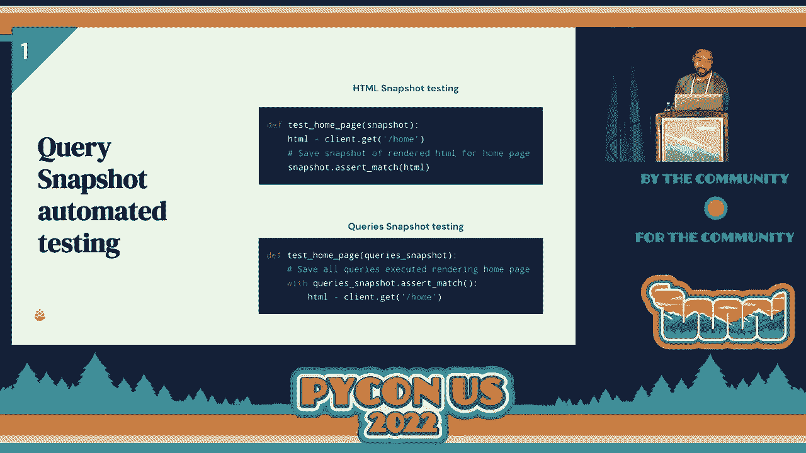

 And it is available for you to try out。 We have a that URL that QR code there should actually reach through our GitHub page for。

 it。 It is very recently open source。 So if you guys want to take a snapshot of that and just take a look at it。

 if you want， to improve it， test it out yourself， give us ideas of how we can make it better or give。

 us ideas of what tools have done this better if you can find any。 We would love that。

 And if you have any questions about CDER as well and you are interested in maybe joining， us。

 you can take a look at cedar。com。 And if you scan up your code because you're interested in joining us。

 you can see our， careers page and see what is available for us for you to join us。

 And that is my talk。 Thank you all for being here。

 [applause]， [applause]。

