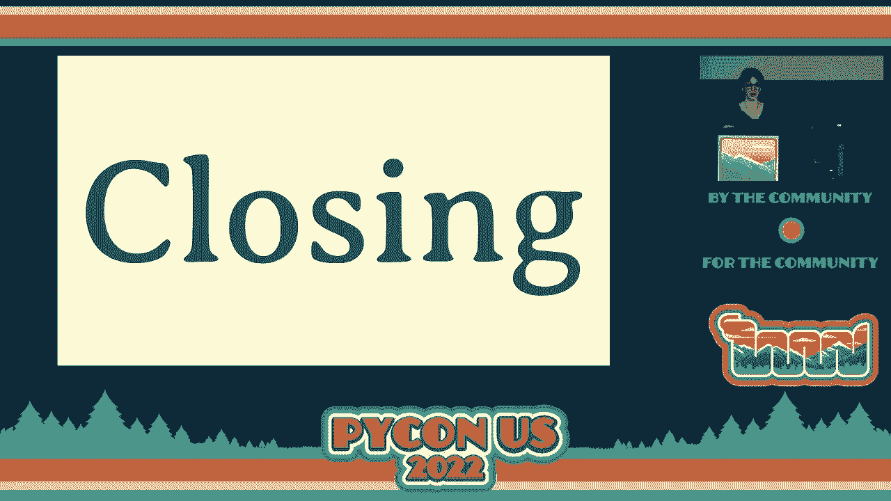
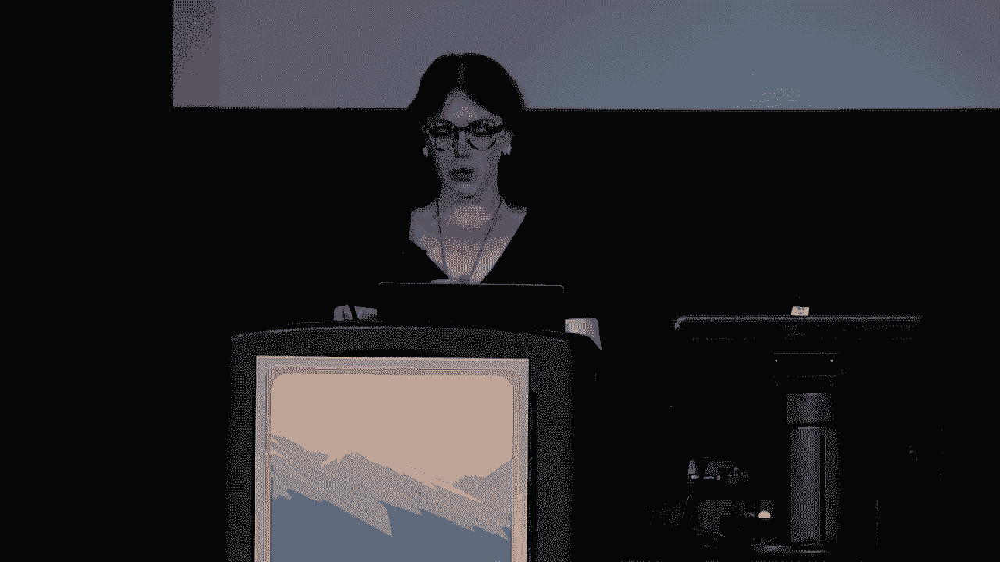
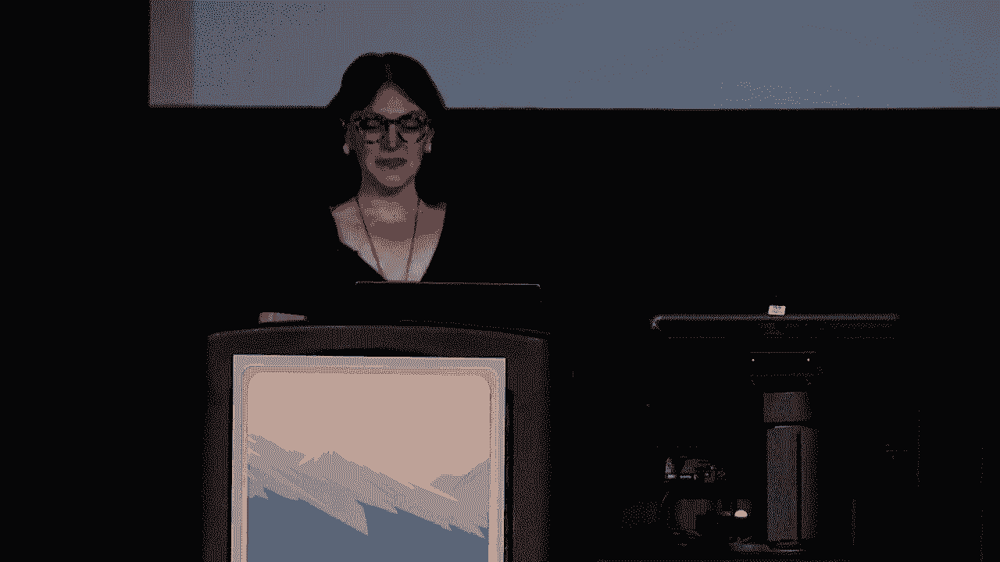
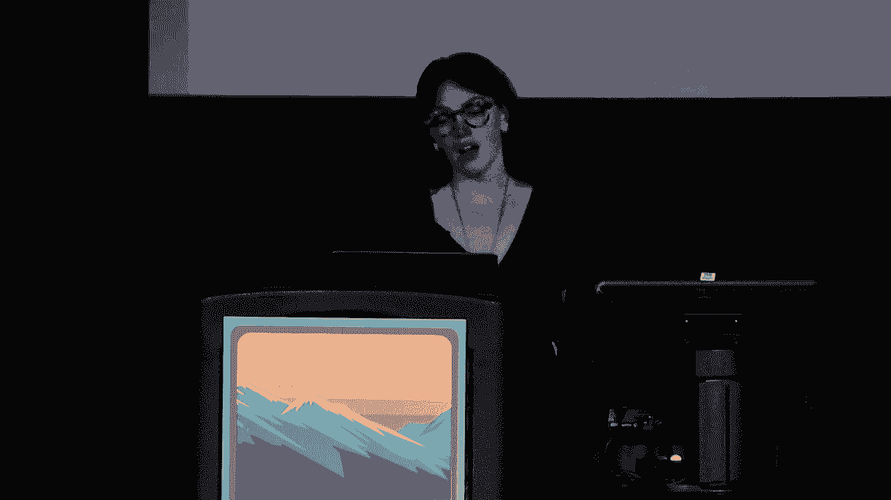
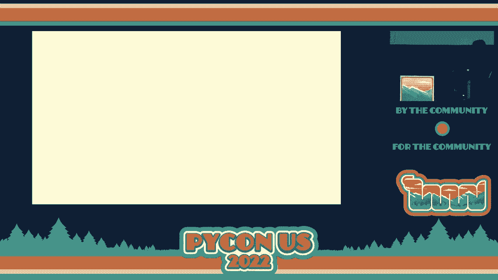
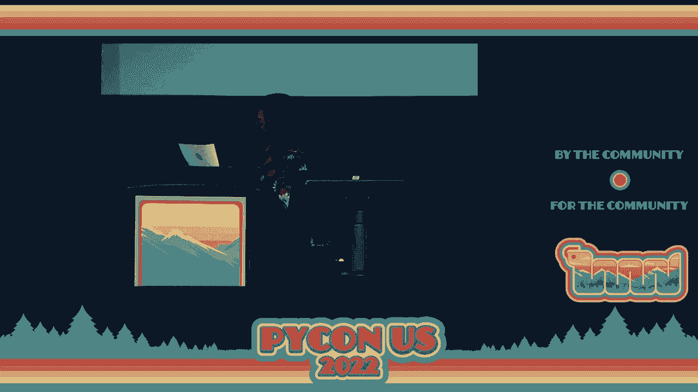
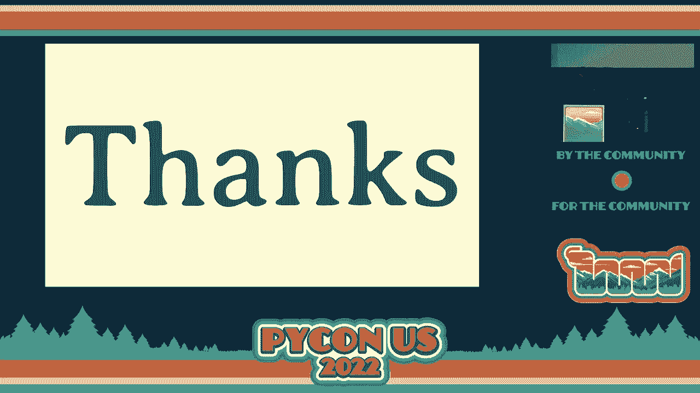
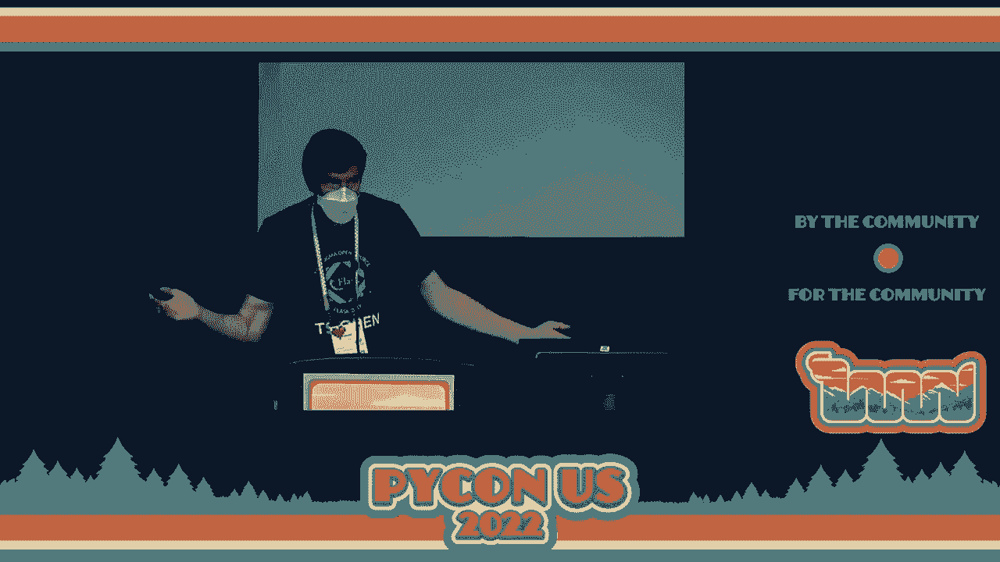

# P5：Keynote - Closing_ Mariatta - VikingDen7 - BV1f8411Y7cP

 \>\> We have near the end of PyCon US 2022， but we still have a few things left for you。

 So just a couple of housekeeping items。 Our final PyCon US event is our sprints。

 They will be held in rooms 250 and 251 and are free to attend to anyone with a PyCon。

 US registration。 Please note that these are still。

 essential PyCon US events and that our health and safety guidelines do still apply。

 We'll provide coffee and lunch during these events。 For more information， check out PyCon。

us/ sprints and stick around right after this， where we will have our sprint rows。

 We'll have quick introductions for all the， projects that we'll be participating。

 No need to sign up。 Just after we close out this event right now， we'll bring the half slides up。

 let people， come to the first place to attend or aren't able to stick around。 So at that point。

 if you're interested in presenting a project， just come line up， right next to the stage and five。

 ten minutes after that， we'll start our sprint， rows。 Also， there are receptacles all around。

 the convention center。 There's definitely one by the salt shaker where everyone has， been entering。

 but there are a few others scattered about。 So if you don't want to keep your lanyard as a memento from the conference。

 you can， actually drop off your lanyard and it will be upcycled into art by a local。

 artist collective。 Alright， so last night we had the Pye Ladies' auction。

 Eventually we're going to have to drop some of these years off the slide because they。

 just aren't all going to fit。 But this growth is just phenomenal。

 And so last night we were able to raise $40，000 for Pye Ladies。 [Applause]， But wait。

 that number actually isn't quite right。 Once we totaled up all of the donations that we've collected。

 auction bids， auction entry tickets， Pye Ladies' keychain and t-shirt sales and all。

 additional donations and donation matches， our grand total was， $53，267。 [Applause]。

 Huge shout out to our accounting department， especially to Phyllis and Joe。

 who crunched these numbers for me so that I could present them。

 And they also ran all of the payments and processing throughout the event。

 Another piece of really impressive data。 The numbers of attendees that we had this year in person。

 We knew that this year was going to be sort of a slow ramp up to get back to our。

 previous in-person attendance numbers。 So this year we had 655 active online attendees。

 so people who actually logged into， the system。 And 747 in-person attendees who picked up a badge。

 Of those attendees， 389 of our online participants were first time attendees， and 1。

149 in-person attendees were first-timers。 [Applause]。

 So for those of you who haven't already done the math on that。

 that means that 64% of our attendees were first-timers at PyeCon US this year。 Personally。

 I like to interpret this as a testament to our community。

 How enthusiastic people were to get to a PyeCon who had never been。

 And also how strong our sense of community is that we could have a PyeCon。

 just like every other PyeCon， with so many new people here that we could welcome them。

 into our community and still have an event like any other。 And so as quickly as it started。

 our time together is coming to a close。 It gets you and you don't expect it。 [Applause]。

 Okay， so one of the things I tried when I was rehearsing this to avoid this was to talk in a British accent。

 So we're going to give that a try for a couple of lines。

 So if there's anything more clear to me than five days ago。

 it's how persistent and durable our community is。 How it spans the globe effortlessly and brings us together and supporting each other through space and time。

 [Applause]。

 So I saw a tweet toward the beginning of the conference that I unfortunately couldn't track down who exactly it was from。

 But it was from a person who I assume was the first time attendee。

 And they essentially said that within the first few hours of them being at their first PyeCon。

 that they felt solidified and confident in the direction that they were taking their life and career。

 by pursuing programming and by being at this conference。

 We have so much more impact than we sometimes realize。 And I， for one。

 feel fueled up and re-energized after a mere five days with you all。

 We sometimes forget living in our own bubbles， working from our homes or interacting over ones and zeros。

 the breadth and depth of the PyeCon language and its applications。 And yet。

 as Peter pointed out in his keynote， there's still so much more reach that we can have。

 And that is staggering because we've done so much already。

 So I thank you all for carrying this forward and for continuing to contribute and grow our community。

 And I thank you all endlessly for letting me be your steward for the last three years。

 One of my favorite authors has said， "Nothing of me is original。

 I am the combined effort of everyone I've ever known。"。

 Thank you for taking a chance on PyeCon and constantly giving to others more than you take yourselves。

 I know that PyeCon would not be the same without each and every one of you。

 and your unique perspectives to share with each of us。 And now， in my final act。

 I'd like to introduce you to your incoming chair for 2023 to 2024， Mariana。 [ Applause ]。

 Thank you， Emily。 [ Applause ]， Okay。 All right。 Hi， everybody。 My name is Mariana。

 I have to like to show up。

 Okay。 Tada。 Yeah。 I'm really sorry that I get to be the one who say goodbye。 Also， I'm Canadian。

 But I know we're all feeling emotional right now。 It's been a great almost a whole week for me。

 And I know you all feel the same。 I'm not sad because I know I will see all of you back here again next year。

 Right？ Right？ And for those of you who join us virtually online。

 I really hope you could join us next year right here。 If that's not possible。

 we will still be offering the virtual streaming option。

 I also saw on Twitter that people attended only on Twitter。

 We attended Python US on Twitter because of the result of folks live tweeting using the hashtag。

 #PikonUS2022 and that's really awesome。 I really hope they all will join us in person next year。

 And I would like to ask all of you。 Tell your friends， tell your coworkers about Python。

 Tell them about how amazing what a great time you have here。

 Tell them about all the things you've learned， all the people you've met， so that they can。

 experience this themselves next year。 Now， PikonUS is just one of many Python conferences all around the world。

 In fact， if you go to pikon。org， you can see a list of all Python conferences all around， the world。

 not just in the US。 In fact， I collected a list of upcoming regional Python conferences all around the world between。

 now and the next PythonUS。 In fact， there's almost more than one each month。

 If you live near these areas， go there。 If you don't live near these areas。

 it's a good opportunity to travel there。 So， again， there's more pikons in September。

 all the way until next year。 So after you attended all of those pikons。

 I will see you all back here， right here in， April 19， which is less than even a year from now。

 And after Salt Lake City， after 2023， we will come to Pittsburgh for 2024 and 2025。 And now。

 let us all take a moment to just recognize the work of volunteers who make this pikon happen。

 Pikon is a community run。 So I want to really want to make sure we recognize our volunteers。

 So I'm going to start calling out names of groups。

 If you hear the name of the group that you participate in。

 please stand up and please remain stand up。 And I would like for all of us to look around you so we can acknowledge their contributions and applaud them。

 All right， so long list。 I'm ready， okay？ So， first of all， thank you， pikons staff。 Thank you。

 Jackie and Olivia。 Pikon staff and PSSF staff members。 [applause]， Diversity and outreach chairs。

 stand up。 Program committee chairs and reviewers。 Tutorials， committee and reviewers。

 please stand up。 Both those committee and reviewers。 Charles has committees and reviewers。

 Lightning chalked organizers。 Travel grant team。 Greenroom staff。 Screen coordinators。

 Open spaces team。 By ladies charity， auction organizers。 Education summit organizers and team。

 Language summit chairs。 Maintainers summit organizers。 Mentors， screen organizers。

 Packaging summit organizers。 Typing summit organizers。 Pikon chardless organizers。

 Startup row organizers and selected team。 Captioning staff。 Audio and video tech team。

 New camera orientation team。 Thanks to all of our keynote speakers。

 Diversity and inclusion panelists。 Steering council panelists。 All of our speakers。

 Tutorial instructions。 Poster presenters。 Language summit speakers。 Education summit speakers。

 Maintainers summit speakers。 Packaging summit speakers。 Typing summit speakers。

 By controller speakers。 All the people who volunteer on site。 Session runners。 Session chairs。

 If you run items at the auction。 If you run the registration information desk。

 If you greet a tutorial at the end。 If you are the ask me button。

 And all of you thank you for being here。 All of you thank you。 Thank you。

 All right thank you so much and I will see you all back here。 Next year in Salt Lake City。 2020。

 Thank you。 [Applause]， [Applause]， [Applause]， Hello。

 Yes don't leave yet。 If you are sprinting tomorrow。

 If you are a maintainer please come out and line up over here to， introduce your projects。

 The maintainers are about to introduce what they are working on。

 So contributors can hear what they will have a chance to work on tomorrow。

 Every project gets one minute max。 It is like extreme lightning talks。 It is going to go quick。

 When you are starting what people can work on and what they might need to， know first。

 If you hear a project that sounds interesting。 Say hi to them after they step off the stage。

 You can also find sprint boards outside of the hallway where the open， space boards were before。

 I will jump in line because I am a maintainer。 I will let the first project come up。

 You want me to go first？ I am David Lord。 I am a pilot and a PSF fellow。

 I will be sprinting on all the projects tomorrow。 That is flash。

 I have been brainstorming a bunch of issues。 I have been studying for new and experienced contributors including。

 async， customization and automation and more。 I will be starting at 8am and I will have donuts。

 Please join me to contribute to flash and pallets。 Thank you。

 No one asked me to do this but I guess I sort of volunteered。

 Some of us are going to be sprinting on CPython which is the， first thing we are going to do。

 If you want to come by， you can。 I don't know if there is an organized thing but we will be doing。

 that。 Thank you。 [Applause]， \>\> Hi there。 My name is Christopher。

 I am working with the pants build project。 We will be sprinting on both pants。

 the build system as well as， pecs which is a project that we maintain。

 We will have a collection of first time suitable tickets if you。

 want to hack on some of the code behind pants and pecs。

 Also if you are interested in onboarding your repository， open source or otherwise， onto pants。

 we are interested in， having more users so we can figure out how to make everyone's。

 builds run faster and we need to onboard more repos and we have。

 core contributors who are happy to help you do that。 Come find us tomorrow。

 We will be there sometime probably before 9 o'clock。 [Applause]， \>\> Hello everyone。

 My name is Patrick。 I am going to be sprinting on sub-bank。 It is a library based on the classes。

 We have a bunch of issues for beginners。 We can also work on docs or if you have experience with。

 Django channels， I would love to chat with you。 We also have integration with fast API。

 flask and other frameworks。 If you want to work on that， come and join us。 I also have stickers。

 Thank you。 [Applause]， \>\> Hi。 It seems every word counts。 I am reading this from my phone。

 including this sentence。 I work on Samgrav tool for searching through code。

 If you want to write a linter rule， we can write it as a， semia rule in 5-10 minutes tomorrow。

 You can share with others。 Join us tomorrow。 [Applause]， \>\> Hey everybody。

 Nick Reineke with the national renewable energy laboratory。

 We recently refactored some of our matching code and released it， as a Python package。

 We use the code to support some research that we do in our， transportation group。

 We use it to support a recent effort with Google maps to。

 incorporate eco routing into their platform。 We are going to be sprinting on making the package a little bit。

 more robust。 It is a baby package right now。 Version 0。1。

 We are going to be doing this for everybody。 There should be stuff for everybody。 Docs。

 new features， testing。 We would love to see you there。 [Applause]， \>\> Hello。 My name is Eric Mathis。

 I will be working on a project called Django simple deploy。

 The goal of the project is to support people who are learning， management command。

 If you have an account on a platform like Heroku or Azure。

 you don't need to visit their docs to learn the initial， deployment。

 You run one command and your project appears live on that， platform。 The project works。 It is new。

 but it has had a positive early reception。 If you are interested in this。

 I am happy to show you a quick， demo and tell you what I am working on and either accept， it。

 [Applause]， \>\> Hello。 We are going to sprint on Pyre。

 The sprint aims to focus essentially to improve， Pyre。

 To make designing applications for the browser easier。 Of course。

 you can also work on everything that is in the， ecosystem。

 If you have an application and you want to use Py script for it or， you want to play with Jupyter。

 there is a lot of things that， Are happening or contribute to CPython upstream and for the。

 Wasm work。 \>\> We are also happy to answer questions。 Thank you。 [Applause]， \>\> Hi， everyone。

 My name is Zach。 I am a PSF fellow and I am a testing library called， Hypothesis。

 It can write tests for you as well as generating test data。

 Tomorrow and on Tuesday I will be sprinting on a whole bunch of。

 cool new features around optimizing that， fixing a number of， Smaller bugs。

 If you are really keen diving into the eldritch， Unreadable internals。

 I have enough stickers for everybody here。 For those who contribute。

 I also have gorgeous little enamel， Pins。 If you would like some gorgeous dragon flymerch。

 come see me and， I look forward to sprinting with you tomorrow。 [Applause]， \>\> Hi， everybody。

 I am Eric and I am with the Pygenitor project。 Pygenitor is a project that has a collection of data cleaning。

 Functions that are compatible with Pandas data frames。

 We will be sprinting on primarily documentation tomorrow。

 But if you have ideas of common data cleaning functions， You would like to contribute。

 we would love to hear from you on， That too。 The sprint is intentionally designed to be extremely。

 Beginner friendly。 This is your first time ever making an open source。

 Contribution and you would like to try your hand at making one。

 In a library that is easy to use and easy to contribute to。 Come check us out。

 We have all the set up instructions needed to make life， Really easy for you。

 It is especially suited for people who like myself， Handle lots of data。 Come check us out。

 Thank you。 [Applause]， \>\> Hi， everybody。 I am Matt Wysniski。 I am one of the maintainers of memory。

 which is a， Profiler that tracks memory usage of a python application。

 It can track native applications that are happening in the。

 See libraries underneath your python application。 It has a live mode that lets you see what is going on。

 As you run it， it is pretty cool。 I don't have issues groomed for beginners。

 What would be really helpful to me is if people wanted to， Stop by and try it out on their projects。

 Let me know what is wrong with the documentation。 Let me know what bugs you find。

 Let me know anything you see that is wrong with it。 If you are interested in contributing。

 I am sure I can， Help you get set up with a build environment and you can， Start hacking on it too。

 Thanks。 [Applause]， \>\> Hello， everybody。 I will be sprinting on cloud coast odian tomorrow。

 It is a rules engine for evaluating your cloud resources。

 If you have interest in determining if you are， A cloud resource or comply with some internal policies you have。

 Or you want to get used to using the project， Explore documentation。

 make any sorts of contributions you， Are interested in， please come by and say aye to us。

 [Applause]， \>\> Hello， everyone。 My name is catney and I will be sprinting on circuit python。

 Circuit python is a version of python that runs on micro， Controllers。

 We have hardware available so if you want to contribute to the， Libraries or the core。

 you will need to know python for the， Libraries or see what the core is written in just like python。

 We will be there for both days。 Myself and Melissa will be hosting。

 So stop by if you want to learn more about circuit python or， If you want to contribute。

 we are happy to facilitate both。 Thank you。 [Applause]， \>\> Hello， my name is darata。

 I am from the Macgava Institute for Brain Research at MIT and。

 I am working on your data flow engine。 This is called pager。 This is a very small project。

 I don't have any stickers but I would be happy to show you and， some tutorials with you。

 If I don't have any beginners， I would work on adding data。

 that supports schedule jobs and probably some as in bio， new implementations。

 If you can help me with this， that would be also great。 Thank you。 [Applause]， \>\> Hello。

 my name is Lauren。 I work with meta and we are working on cinder。

 We have a couple of specific optimizations to see python and。

 we will be sprinting on trying to upstream some of that work。 Thank you。 [Applause]。

 \>\> Thank you everybody。 Thanks to all the maintainers。 Sounds like there are some great projects。

 I am really excited to see so many contributors sitting in the， audience still。

 I have a great rest of your night and see you all bright and， early tomorrow。 Right？ Right here。

 [Applause]， \>\> Thank you to the PSF and all the organizers。

 Goodbye。 [BLANK_AUDIO]。