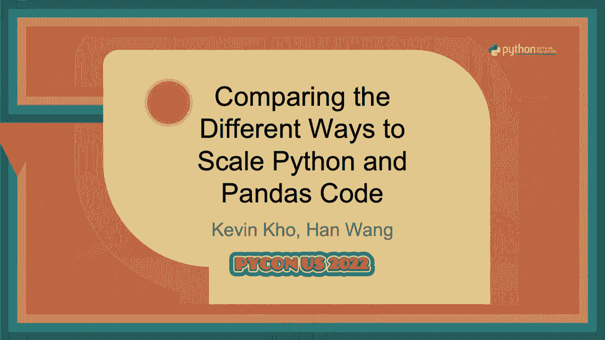
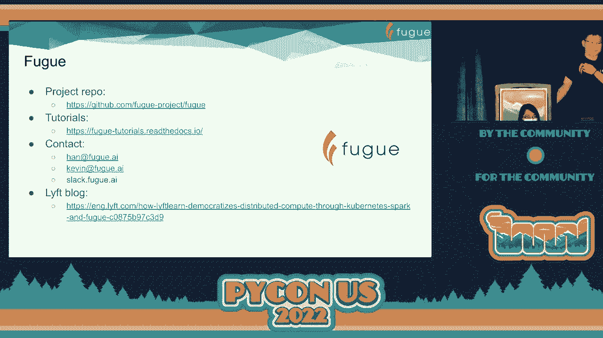

# P50：Talk - Kevin Kho_Han Wang_ Comparing the Different Ways to Scale Python and Pand - VikingDen7 - BV1f8411Y7cP

 \>\> Everyone， how are you doing today？

 \>\> Good。 \>\> Okay。 So we can get started with our next talk。 We have comparing the different ways to scale Python and Pandas code。 We had the speakers Kevin Ko and Han Wang。 Just a quick tip。 So there's no Q and A after the talk。 but if you'd like to ask questions to the speakers。

 you can feel free to catch them at the hallway or anywhere outside。 All right？ Over to you。 \>\> Thank you。 \>\> Hey， everyone。 Welcome to different ways to scale Python and Pandas code。 We're very happy to be here in an in-person conference。 Happy to have met a bunch of you and definitely looking forward to chatting with the rest of。

 you also。 So a bit about us。 So Han and I will be talking。 Han is -- we are both affiliated with the Fugue open source project。 Han is the main Fugue author and he works for Lyft as a tech lead for the Lyft machine。 learning platform。 I am an engineer at Prefect， which is also a sponsor for this year's conference。

 We have a sponsor booth。 Prefect is an open source workflow orchestration framework and prior to that I was a data scientist。 So obviously we're here to look at ways to scale Python and Pandas code， but just worth。 noting what the limitations of Pandas are。 So first of all， it's single core by default。 It's known to not be memory efficient。 You probably heard something along the lines of if you want to handle a Pandas data free。

 may efficiently， you need 3x or 5x as much RAM as your data。 So if you have like a 5 gig data set。 you then need like 15 gigs of RAM to handle it effectively， at least。 And of course there's an assumption that everything is confined to a single machine。 So once you start hitting this bottle next and hitting these limitations， then you need。

 to use other frameworks to scale。 So how do you scale out？

 If you start with your existing computing logic in Python or Pandas and you want to bridge。 that gap to utilize distributed compute frameworks， what you can use is a semantic layer。 And the semantic layer is what will map that existing logic to the distributed compute， frameworks。 So we have two kinds of semantic layers。 The first is Pandas like。 The second one is SQL like。

 And what we find is that both of these semantic layers have some deficiencies in them which。 Han will talk more about later。 And that's why Fugue as a semantic layer aims to provide both of these options so that we。 can allow the user to describe their logic in the grammar that they prefer。 And then we can be responsible for bringing that to the distributed compute framework。

 So if you're not familiar with the distributed compute frameworks， these are the most popular。 ones right now as part， Dask and Ray。 So what happens with Pandas is when you have like a five gig dataset and then maybe you。 use like a 16 gig gram machine and it's going fine， all of a sudden five gigs becomes 10。 You didn't have to bump up the underlying hardware。 And that's what's called vertical scaling。

 But what happens is maybe you only have one step in the pipeline that really needs a lot， of RAM。 But then because of the way Pandas is， you then need to have your machine， your powerful。 machine for the duration of your entire pipeline。 So these distributed compute frameworks allow us to use clusters that utilize auto scaling。 under the hood so we only need to bump the resources up for an expensive step。

 And then these frameworks are also optimized to handle operations for big data。 So for example。 if you have a lot of columns and you only need two at the end， there are。 these optimizations that can traverse the computation graph and only use those two columns。 Whereas Pandas， you need all the data in memory。 But of course。

 these frameworks are not straightforward to use。 You have to learn a new syntax or a new framework。 And in addition to the new syntax or framework， you then have to learn a lot of concepts such。 as partitioning， persisting， even schema。 And in general， they all have a relatively。 I compared to Pandas， a relatively poor developer。

 experience in that it's hard to develop locally quickly and then bring it to the distributed。 setting。 And that's about Spark specifically。 That's just a bit better because it's Python native。 And that's why a few exists to bridge that gap between local compute to distributed compute。 So there are other projects that do the same thing in Modin and Koalas。

 The difference is that they use Pandas as the interface。 Whereas Fugue uses Python， Pandas and SQL。 So again， these are interoperable。 People can choose the language that they prefer。 And then we port it over to the relevant distributed system for them。 So a lot of this talk will be about what the deficiency of the Pandas interface is and why。

 it's not necessarily the good grammar for distributed compute。 But before that。 we're going to introduce Fugue。 So Fugue is an abstraction layer for distributed computing。 And we find that Fugue users often see because they can describe their code in native Python。 We find that maintenance is reduced。 And also iteration speed with big data projects increase。

 So we publish an article with Lyft earlier this month。 And with Fugue。 the average wall time of Spark jobs decreased from 3 hours to 0。3 hours。 This is because that bridge allows you to prototype quickly and only use the cluster。 when your code is production ready。 We don't have any fancier optimizations other than providing guardrails around best practices。

 so that your code can execute well in the distributed setting。 So let's look at the most basic Fugue code。 Here in this operation。 we have input data with the ID and value。 And we want to make a new column called food。 So the top code is the Pandas syntax。 And the bottom code is the Spark syntax。

 So if you want to -- if you already have a lot of Pandas code that you then want to bring， to Spark。 you then have to rewrite a lot of the code。 And this isn't an isolated example。 You'll find that a lot of similar operations have drastically different syntax。 So let's look at how Fugue would do it。 Up above is the Pandas function。

 All we're using is this map to get the appropriate dictionary value。 And then -- so all we want to do is get the value in the value column， use the dictionary。 to map it to the corresponding food， and then create the new column。 So here the function is left unchanged。 And what we're going to do is we're going to use the Fugue transform function。

 And the Fugue transform function takes in the data frame and the function。 And then the schema。 which we'll be adding a new column called food。 And then we have the parameters passed。 And this will work on Pandas。 But what happens if we want to bring this to Spark？

 All we have to do is specify the engine。 And the engine is just a Spark session。 And we also support desk at the moment。 So what we can -- we're using the same function。 All we have to do is change the engine now。 And then the code will run on Spark or desk。 And this is also flexible to however you want to define your function as a user。

 So I have three other implementations that are non-pandous based and purely native Python。 that you can also be brought to Spark or desk。 So all of these use some combination。 I'll use some combination of list and dictionaries。 And then it's flexible。 whatever the input type is or the output type Fugue will then， adjust。

 And now I'll hand it to Han for the second portion of this talk。 Hello。 Hello， everyone。 Nice to meet you。 And thank you， Kevin。 And now I'm going to have a further discussion on the deficiencies of the pandas like semantic。 layer and the traditional SQL semantic layer。 So first of all。 let's talk about the limitations of the pandas like semantics。 Considering this data frame。

 it has four columns， A， B， C and D， A and B are strings。 And C is just a random number from zero to one。 And D is just an integer from zero to one thousand。 We're going to use this data frame in the format of pandas coalesce， which is also known as。 pandas on Spark as of Spark 3。2。 And also that's data frames and the morning data frame。 Okay。

 We're going to use this data frame as an example to demonstrate some of the problems of some。 basic assumptions of pandas。 First of all， pandas assumes that data is physically together。 Look at this I log function。 I think everyone knows I log and I think most of us just the love I look。 But the assumption behind I log is that random access is cheap。

 But this is not true in the distributed system。 So look at this data frame with one million rows of the previous example I've shown。 And now we are going to run five different cases and we are going to compare their performances。 in each backend。 Here is the result。 So we always use the first case as the reference case。 We assume the first case will always take one unit of time and then we compare horizontally。

 You will see that for pandas， I log is faster than the popular functions such as head and， tail。 which is good， right？ And no matter where you access the data frame， it's faster。 But for moding on Ray， you will see that the performance of the four cases， first four cases。 is very similar。 But for the last case， when you try to access the middle of the data frame。

 somehow it is， two times slower。 And then for Spark case。 even more weird because none of other cases is even close to the first， case。 This is slower than the first case， especially when you use random access， try to get the。 middle and the end part of the data frame。 You see it's 15 times slower。 And for dusk。

 dusk even this allows you to do random access using iLook。 So here we see the first discrepancy of the interface。 But why does this allow this？

 Because random access is not a good practice in distributed computing。 So I think what dusk is doing is just trying to provide a guardrail for you to use the。 distributed system in a more efficient way。 Natural order。 So pandas assumes that natural order is preserved。

 But this is not always true in the distributed system。 We still use the existing data frame and we sort by C。 We compute the diff， we compute。 the standard deviation。 On the other hand， we just the same sorted value。 So if our really back to the same compute。 So if natural order is preserved by a backhand。

 then x should equal to y。 So as you can see， it's not true in Spark。 Why？

 Because it is very expensive to preserve the global order of data in a distributed system。 Sometimes this is not even a well defined problem。 So that's why you cannot expect a distributed system to always keep the global order for， you。 It is very expensive。 Now let's talk about data shuffle。 If the data frame is in memory and local。

 data shuffle is trivial。 But this is always a very big challenge in distributed systems。 Assuming we have a data frame with 100K rows and for each group of D， we just want to group。 the data frame by D。 And for each group， we just find the row with the largest C。 You probably can use group by applying to solve this problem。

 But someone just figured out a more elegant and smarter way to like method one to solve。 this problem。 We just need to sort the values on both columns C and D。 And then we just drop the duplicate based on group D。 And keep the last。 Then we get the expected result。 It is expressive and it is very elegant。 On the second method。

 we just group by D。 And then we try to find the index with the max C。 And then we join back this index to Df， all index in order to get the result。 The second method is less straightforward。 It's more complicated。 Let's take a look at the speed。 And actually on pandas， the second method is even slower than the first method。

 That will just confirm you that method two has no value。 Now this is not true on distributed system。 You will see that on a distributed system， all of them will get significantly faster， on method two。 Why？ Because method two can avoid shuffling。 It can minimize， at least it can minimize shuffling。 And in some cases， for example， in Spark， with certain settings， you can completely avoid。

 shuffling。 That is why method two is much faster in a distributed system。 Now you have a dilemma。 If you want to keep use the pandas syntax and you have to choose between flexibility and。 elegance versus performance， which one do you choose？ It's always a difficult choice。 Now let's talk about index。 It's common sense that index can speed up the pandas computation。

 But it's not always true in distributed systems。 So now that data frame or still have one million rows。 an idea is just a Df。set index on A。 And we do two things。 We just use the original data frame and use the data frame with index to get a one group， of data。 And then we compute the sum of C。 As you can see， pandas， as you expected， it is faster。

 But look at this distributed backends。 They have very different execution behaviors。 This is not the only thing。 The other thing is multi-index is not fully supported by any of these backends。 There is technical difficulties to support this multi-indexing in a distributed system。 So here the point is not only you get different execution behavior， but also you get inconsistent。

 interface。 And it's not like identical interface with pandas。 Now let's talk about eager evaluation and lazy evaluation。 Let's use this example。 It has two million rows and 40 columns。 And we just want to save this to a file。 The first example is just we read back this file and we just compute the mean of every， column。

 And the second case， we just compute the mean of two columns of this file。 By the way。 it has several hundred megabytes of data。 So it will take some time to load。 So here is the result。 You can see that for pandas and moding on rain， the second case is just a little bit faster。 than the first case。 It's expected because the heavy part is read by K。 But why in Spark and Dask。

 they're significantly， faster than the first case。 This is because of the benefit of lazy evaluation。 Many evaluation can understand that you only need C1， C0 and C1。 So it will just access a small portion of the file。 So the IO will be much。 much smaller than reading the whole file and storing in memory。 So that is why Spark and Dask are so much faster because they save on the IO time。 Okay。 But if you don't fully understand lazy evaluation， then you will get hurt immediately。 So we have these two examples。 The only difference on the second case is that the second case will。

 in addition to computing， the mean， it will also compute max and the average。 Look at the time。 Again， pandas and moding， they're very predictable。 The computer is just a little bit slower on second case。 But look at Spark and Dask。 They are much。 much slower。 Why？ This is also because of lazy evaluation。 L lazy evaluation will depend on actions。

 Action will trigger the lineage to run and to end。 So if you don't know that you need to break the lineage here， then these three actions。 will trigger this read by K， three times。 Right？ Then now we are facing another dilemma。 Do we want to add a persist here in order to save the time？ Right？

 Next is not even a concept of pandas。 And now we have to make a decision。 Do we want to add additional syntax to pandas？ If we add that is not consistent with the pandas interface。 but if we don't add， we can， fully control our powerful distributed systems。 We cannot fully utilize it。 So which one to choose？ You can definitely see that voting on rain。

 voting does not choose lazy evaluation。 It chooses to be eager evaluation to be consistent with pandas。 But Spark and Dask， they choose to provide additional syntax in order for you to have。 more control of the distributed systems。 Pro-san calls。 But the point is now they are no longer the same。 They are very different。

 So what is the motivation to use pandas like semantic for distributed computing？

 Flat learning curve， low migration effort， no vendor logging。 So as you see from the previous example， only if you are using Hello World examples， you。 will find it has flat learning curve。 You can have dropping replacement for the pandas input。 But if you use anything that is a little bit advanced， you will see a lot of inconsistency。

 on interface and you will see even bigger difference on the execution behaviors。 Then you have to write the backend specific code or corons and then you have to optimize。 towards one backend。 But when you make it work for one backend。 you get vendor logging because that code is， no longer optimal for other backend。

 That is also the reason that field doesn't want to be another pandas like framework。 We don't see much value to use the pandas as our semantic for distributed computing。 But we have to clarify that we heavily rely on pandas。 But just in a totally different way。 I will talk about it in the next example。 So now let's talk about the limitations of SQL semantics。

 Considering this data frame， it contains 1000 time series。 Each has 10，000 data points。 And instead of using data stamps， we just use IDX which is integer for simplicity。 In the values。 there are anomalies。 What we want to do is we want to compute the rolling Z score and then using the Z score。 to identify anomalies。 We want to find the top five series with the most anomalies and then we want to get the。

 sum of the Z scores。 It sounds complicated， right？ It is complicated。 So here is a Spark solution based on traditional SQL syntax。 Because it's not trivial。 we will have used this with statement which is also known as， CTE statement。 Because in this way we can write several sub-statement and then to combine them together。

 There are several problems with this CTE statement。 Although I know a lot of you just write this kind of statement every day。 But have you ever thought about the baller play code you have to write every time？

 For every step you have to write as bracket， bracket， comma and you have to have width。 And also you have to name every step。 If you write in bad SQL you don't have to name every step。 But now you have to。 Even sometimes it's awkward to figure out the name。 You still have to give a name。 This is probably the minor issue。

 But this is probably a bigger issue。 That this kind of syntax， parquet。file， something like that。 This is platform specific。 So as soon as you write this kind of syntax you get vendor logging。 This SQL is already logged with a certain back-end。 And another thing is look at this Z。 If you're familiar with distributed computing。 So look at this Z。

 This Z is used by both top and the worst by two data frames。 So in order to avoid a recompute。 what do we should do？ I mentioned that before。 We should use a persist here to break the lineage。 How do you add a persist in SQL？ It's not even a syntax of SQL。 Right？

 SQL does not have this in mind。 Then what can we do？

 So in Spark you can break this big width statement to two width statements。 To run the first width statement， export that data to Spark， persist it， and register it。 as a temp data frame back。 And then you run the second statement。 What is the problem with that？

 This is your logic flow。 Right？ This is one unit of logic。 But now in order to achieve certain features you have to break it up。 Then the code becomes less readable， less understandable， and it's harder to maintain。 And there are some other syntax that SQL doesn't have。 Group to map， group to apply in pandas。

 SQL does not have that。 Persist broadcast。 They just very commonly use the syntax。 And the next thing is single task。 Think about that。 Sometimes I want multiple output。 What if I want to save the top data frame into a table or into a file？ Can we do that？ No。 Only solution is you have to break up the CTE statement to several parts in order to save。

 the intermediate files。 Because my definition of CTE or any statement of SQL is to do one thing。 For this complicated logic you have to do multiple things。 Last but not the least。 it is very expensive and difficult to develop such kind of query。 Think about that。 You're working on big data。 Each sub statement could take significant time。

 Every time when you add one more sub statement during development you have to rerun everything。 from the beginning。 So that's a huge amount of recompute。 With time it wastes money。 And you will find your iteration time is just getting slower and slower while you develop。 this gigantic query。 So here is an example of how Fuchsie call by improving the syntax of traditional SQL。

 How we can solve this problem。 So look at the SQL and the SQL immediately is smaller。 And what we removed is the CTE statement。 Of course we support CTE statement but we don't have to use it。 And look at this we only need to name two steps because it's necessary because we need。 to join them so they need a name。 And for other steps we can keep anonymous。 And look at this load。

 It's additional syntax but Fuchsie call is able to run seamlessly on any back-hand with， support。 So locally we can run that DB and distributed we can run that and spark。 So using this additional syntax does not give you vendor locking。 And also look at this persist。 We just need the seven-letter keyword。 We can totally change the game。

 So the speed will be much faster。 You will see the final benchmark。 This persist the execution speed of the whole workflow is much faster than before。 So now let me talk about another thing。 How do you leverage Python？ Think about that。 For this query there is still a big chunk of code which is to use the window function to。

 compute the rolling standard deviation and the min。 It is what it is。 If you're using SQL you have to write that。 There is no shortcut。 But what if you can express that logic in Python？ It will be much more elegant。 Given that this data frame is already one series of data。 It's already sorted。

 Then you can use this very expressive and very short way to describe your logic。 Plus you can also do the filtering。 So this is to visualize the transformation。 It's from a thing told data frame to a fat and short data frame。 This is not a typical thing that any SQL UDF can do。

 Because SQL UDF requires the output to be exactly the size of the input data frame。 It has the change， it changed the dimension on both dimensions。 X and Y。 So for this kind of transformation how can we use that in FUG？

 As you can see we just replaced that whole chunk of window function with just one line， of code。 It is additional syntax but this syntax can run any backhand with support。 We just use this way to call a very simple Python function that has nothing to do with， FUG。 And people may ask things。 So what I heard is that Python is always slower than Spark。 Is that true？

 Actually that is not true。 So here is the example。 Here is the final execution result。 Firstly let's take a look at the code size。 Original Spark SQL and then with the FUG SQL you can see the code size reduced a bit。 But with just that persist keyword you can see how much drop on execution time。 But the final winner is the last one。 Where we combine the Python logic with the SQL。

 And it has the least code but it has the best performance。 I'm not saying this is always the case but at least it should be easily available to。 every developers to try and to figure out which way is the best for you。 And here FUG SQL just find a way to get the best part of Python and the best part of SQL。

 together in a very organic way。 So let me give a summary of our talk。 Moving from local computing to distributed computing。 It is just like moving from integers to real numbers。 You cannot avoid learning。 You must learn。 You must accept this fact that you have to learn new things。

 And you have to change the way of thinking。 It is necessary。 There is no magic。 And as a semantic layer for FUG our mission is to keep the operations simple and intuitive。 but not magical。 You should understand what is going on there。 And we should keep you mindful when you program。 And we should help you follow good practices。

 That is the mission of FUG。 Thank you everyone。 And here is the resource page of FUG。 If you are interested in using FUG or contributing to FUG feel free to contact us and we are。 open to talk to you。 And also there are tutorials。 And feel free to browse the source code in the open source repository。 Thank you。 Thank you so much。

 That was pretty informative and I think it was an amazing talk。 Feel free to reach out to the speakers for Q&A。 They will be at the hallway。

 And I think our next talk starts at 3。30。