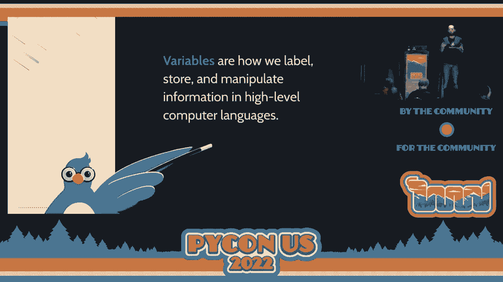
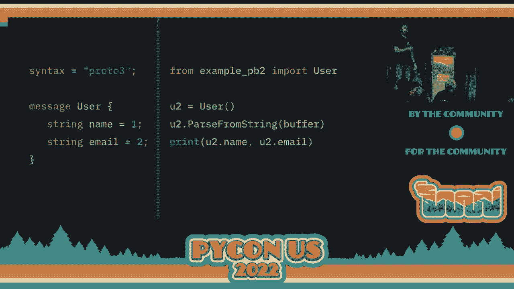
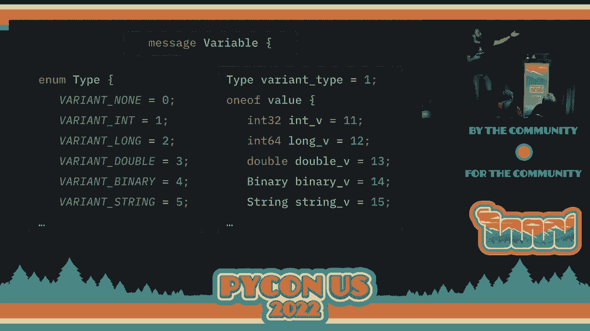

# P52：Talk - Liran Haimovitch_ Effective Protobuf_ Everything You Wanted To Know, But - VikingDen7 - BV1f8411Y7cP

 Hello， everyone。

 Welcome to what's this？ Our 415 talks。 Hopefully， you've had some awesome talks so far。

 This next talk is by Lidon Heimovich。 Is that really good？ CTO， co-founder of Rookout。

 As you can see， a broad experience with cyber security。 He's here to talk to us about Protobuf。

 All right？ I'll leave it to him。 Thank you。 [APPLAUSE]， Hey， everyone。 It's great to be here。

 It's actually my second time speaking at PyCon。 I got to be at Cleveland three years ago just before the pandemic hit。

 I'm wondering how many of you were at PyCon at Cleveland， the show of hand？ Oh， nice。

 A lot of people。 I'm not sure if you've seen me there or not。

 but it's awesome to see all of you here again。 Conferences have been missing， at least for me。

 Today， I'm going to be talking about Protobuf and about serialization in general， what it， is。

 why do we need it， and how do we make the most of it， some considerations。

 Before we dive into things， I just want to quickly introduce myself。 My name is Lidon Heimovich。

 I'm the CTO and co-founder of Rookout， which I'm going to mention later on。

 I spend the most of my time today focusing on various run times and how they operate in。

 cloud environments。 Python is definitely one of them when I spend the most time on。

 as well as the JVM node， which I'm spending a significant amount of time understanding how they run and how to。

 make the most of them in cloud。 It could be net is in serverless environments。

 Spend most of that in the context of observability of how can you understand what's going on。

 with the applications。 How can we instrument them and how can we get high quality data from them easily。

 I'm very curious to know how things walk behind the scenes， which might help explain。

 some of the things we're going to do with Protobuf later on。

 Before we dive into serialization， all of that fancy stuff， I want you to take a look。

 at this for a second。 The reason I started with the Hello World application for Python is because this is probably。

 the first， last， and only application you've ever seen without variables。

 Whenever we want to do anything meaningful in software engineering， we want to run a significant。

 program of any kind， we must have variables。 The reason for that is that variables are how we manage data within our code。

 The dictionary definition are that variables are how we label， store， and manipulate information。

 in high level computer languages。 Essentially anything we want to read from the user。

 anything we want to write as an output， anything we want to process in any way， kind， or form。

 we're going to use a variable to， do that。 Obviously。

 behind the things the Python interpreter doesn't really care so much about our variables。

 What happens is that there's a CPU running our code， some level， and the Python interpreter。

 or any other runtime of any kind you'll be using allocates memory or uses the memory within。

 the machine。 I'm not going to dive in too much about virtual versus physical memory and all of that。

 But the interpreter uses the application's memory to store and manage your variables。 If you say。

 for instance， create a statement that x equals 5， then the Python interpreter， has two tasks to do。

 The first， it has to find some of the memory where x is going to reside。 So that from now on。

 whenever x is referred to， that's going to be used。 It's going to put 5 in that memory address。

 If later on you're going to do x equals 7， then it's going to go to the same address。

 and update to 7。 If you go ahead and read x， then it's going to read from that memory address。 Now。

 the reason I'm starting with variables is because just like variables are the key。

 to how we write computer preplications， what comes next？

 What happens when we want our application to communicate with other applications？

 Maybe we want to communicate over the network to send a request somewhere。

 Maybe we want to store some piece of data on file or on disk or even in a database for。

 this application or for another application to read some time in memory。 Now， to do that。

 we need to extract our information。 We need to take that information。

 We've given to the Python interpreter that it's stored somewhere in memory。

 We need to get it back in a way that we can transfer because we don't really know what's。

 going on within that memory。 Essentially， that's what serialization is all about。

 Serialization is about taking our information from the memory and creating it into a stream。

 of bytes or a buffer， if you will。 So we get， I know， 100 bytes or 5K。 It doesn't matter。

 We get some amount of bytes that represents the information we want in a clear and usable。

 manner that we can then save to the database， save to the disk， send over the network so。

 that we can someone else， another application or even our application in the future， can。

 read that information and use it。 Now， there are quite a few ways。

 quite a few considerations as you're thinking of serialization。 First and foremost。

 I want to tell you， don't write your own。 Whatever you do， whatever you need。

 chances are you don't want to write your own。 There are tons of useful serialization out there。

 Each with their pros and cons， chances are that whatever you're going to write yourself。

 is going to have more cons than pros。 So please， unless you're expert in that， don't write your own。

 Choose one that's already there。 Now， there are a few things to keep in mind as you're choosing your serialization engine。

 First， you need to think about do you want it to be portable or not。 Now。

 there are many elements in portability。 In portability。

 can I read this buffer I've created in another application？ Can I read it in another runtime。

 such as a， can I move it from Python to Java or to JavaScript？

 Can I use it in a different operating system or a different CPU architecture or anything， like that？

 Or will this data only be useful within the context it was provided？

 In the various levels of portability with various limitations。 And obviously， of course。

 we all want our code to be portable because why not？

 We want our code to be portable and want our data to be portable。 The thing is。

 if you give up on portability， you can often make a variety of shortcuts that。

 make things easier for you。 Well， if you do go for portability。

 things can get tougher along the way。 Second， you need to decide if you're looking for dynamically typed or statically typed。

 or a serialization。 Now， the reason for that， again， just like you do it for Python。

 Python recently introduced， typing。 But even so， we often create small programs。

 we just want to write something quick and dirty。 We can go do without typing， whatever walks walks。

 it's easy。 But later on， these programs grow， as code bases grow。

 as our consumers for the data we're， generating， we often want static typing so that both a machine can verify the correctness。

 of the data and also as a form of documentation。 So it's going to be easier for people for other engineers to understand or for future。

 chefs to understand what the data is。 And last but not least。

 we have to choose between textual and binary。 Textual usually made for humans。

 It's going to make your serialization much easier to read。 So when you get that stream of bytes。

 chances are you'll be able to glance at it and get， some sense of what's going on。

 what's the data that you've extracted， and what does， it mean。 But if you go binary。

 chances are it's going to be much harder for you to understand what's， going on。

 But you get this huge benefit that binary is usually better for machines。

 So performance is usually going to be better if you go with binary format。

 So let's take a look at a few popular frameworks that you might be familiar with that you can。

 think of besides a protobuf， obviously。 So first， JSON， JavaScript Object Notation。

 How many of you are familiar with JSON？ That's pretty much everyone。

 So I'm not going to talk too much about JSON， but it's pretty much the standard on the web， today。

 As I'm sure you know， it's very portable。 It's very textual。 So you can very easily read it by eye。

 And because it's so widely adopted， chances are that even though it's textual， you're going。

 to get some decent performance in every runtime you choose， let alone Python， because it's。

 going to be great。 On the other hand， we have Pickle。 How many of you are familiar with Pickle？ Oh。

 pretty good。 So Pickle is a built-in package within the Python standard library。

 It allows you to serialize any Python object with a single line of code and read it later， on。

 It has decent performance。 Pickle's biggest disadvantage is portability。

 Besides not being able to read it outside of Python， even within Python， you might find。

 it difficult to serialize an object if your application has changed or other elements have， changed。

 So it's something to keep in mind。 But if you're looking for something weak and dirty just to get started。

 Pickle can be， a great option for short-term serialization。 And last but not least。

 we have Protobuf， which is pretty much the topic of what we've， discussed today。 And at Rookout。

 I think it's one of the most popular serialization platforms we use。

 We use it for multiple purposes。 And there are a few reasons for that。

 First is that Python is -- Protobuf is highly portable。

 I think that's one of my favorite options about it。

 There are about 20 languages today that support -- 20 platforms today that support Protobuf。

 It's super important for many use cases。 Protobuf offers static typing。

 which makes it easy to document whatever it is you're trying， to serialize。

 Make it very clear what you're serializing and how it should be written and read。

 And it has amazing performance， both due to the static typing and its binary nature。

 Protobuf has amazing performance in pretty much all runtime， Python， obviously。 One of them。

 There is great back-hood and forward compatibility， so you can add fields， you can remove fields。

 Everything is pretty much going to keep going。 It's pretty long boilerplate。

 That's obviously something that's of key importance because when you're serializing stuff， there。

 are often a lot of boilerplate involved。 You have to take all the information that you have in memory and kind of set it up for。

 the serialization algorithm to take its hold。 And Protobuf is very good at making it easy to do using a lot of auto-generated code。

 I'm going to touch on that in a bit。 Protobuf is very time-tested。

 It's been around for 20 years now， which was actually -- Google started using it internally。

 in 2002， open-source it a few years later。 And today。

 Protobuf 3 is the main version everybody's using。 And that has been also around for quite a few years。

 And there is a great community。 Obviously， nothing compares to JSON。

 but it's a pretty great community。 I think it's the most vibrant community for any binary serializer out there。

 So those are kind of what do I like about Protobuf。 Now。

 before you jump into using Protobuf for everything， a few things you want to keep。

 in mind for when you're not two years Protobuf。 First， Protobuf is less appropriate。

 If you do want to read yourself， the output， the output is going to be binary。

 It's going to be very hard to read by I。 It's not textual， don't go for it。

 And also keep in mind that if you're working with Protobuf， you need a spec。

 The same message can mean different things using different specs。

 So it's very important to have the static typing of the message to be able to read it。

 Make sure that if your messages get too big， essentially above a few megabytes， then the。

 serializer hasn't been optimized for that， and you can get some pretty bad performance。

 And last but not least， if you're dealing with data that has dedicated serialization， algorithms。

 obviously information metrics says audio， video， images， all of that of。

 their own dedicated serialization formats。 It's better to use those rather than using some generic general purpose algorithm。

 So let's do a quick three slides overview of what is Protobuf and how to use it。 So this is what。

 as I mentioned， Protobuf is using static typing， and you start out by， creating a protocol。

 in our case example， Protob， which allows you to define whatever， data you're trying to serialize。

 You start by defining your header， the syntax in our case， Protobuf3， and then you create。

 as many messages as you want。 Or it's a very simple message。 User， it has two fields。

 One is the name， the other is email， both of them are strings。 And there are field numbers here。

 one and two。 Now the reason Protobuf asks you to specify the field numbers is that field numbers are。

 how the messages are encoded and are critical for for them backwards compatibility。

 And so Protobuf takes the Python approach of explicit is better than implicit and asks。

 you to define the field it is so they don't change over time and that it's very clear for。

 you that you can manage that。 So once we've got our file， we use the Protobuf compiler， Protosy。

 to build our Python files， that you can use it。 Protobuf is compilers for pretty much every operating system out there。

 You can see the command lines for installing it for a few of the more common ones。

 And then you just write it， Protosy， Python out into the current folder， create our protofy。

 Now we have it。 It's very， very， very easy。 All we do is we can import。 For example。

 our new class essentially Python has created a class。

 Protosy has created a class called user to represent our user message。 We import it。

 We create an object。 We can set the name and the email of the object。

 And then we just serialize it into a buffer using buffer serialized to swing。

 We can print it out if we want。 As I mentioned， very， very， very light on boilerplate。

 How do we read this message？ It's also fairly easily。 We create an object。

 We pass it from the string。 And then we can exit it there。

 The Python class attributes as the fields of the message that we've just read。 Very， very。

 very easy to get started with。 Very easy to do some pretty impressive stuff。

 Now there are a few fancier things you can do with Protobuf that I'm going to touch upon。

 very briefly。 First regarding primitives， I've shown you string primitives。

 Protobuf also has buffers， bullions， integers， and floats。

 So you can serialize pretty much all the common stuff。

 And obviously you can also nest messages into other messages so that you can create more。

 complex objects as you see fit。 Protobuf is a few advanced keywords for more advanced use cases。

 Include repeated， which allows you to make any field into a list so that instead of having。

 just zero or one instances of the field， you can have as many as you want。 You can add one off。

 which allows you to specify that only one of multiple fields can， exist within the same message。

 kind of like a union if you're familiar with it。 Reserved allows you to specify that the field number shouldn't be used。

 whether for backward， or for compatibility。 And enum allows you to just for syntactic sugar a kind of number。

 given names to numbers。 And last but not least， Protobuf has its own version of dictionaries。

 which is called， maps， and you can use to serialize those relevant objects。

 Now why do we need Protobuf to look at what have we been doing with it？

 So I'm not sure how many of you are familiar with what we do， but Protobuf is essentially。

 a form of a live debugger or production debugger。 We allow you to set a non-breaking breakpoint in any line of code within your application。

 and once that line of code is hit， we take a snapshot of the state of the application。

 all the local variables， the stack trace， and then we transmit it in the background so。

 that you can see the state of the application and get a debugger like experience， even if。

 the pure application is running in the cloud。 Now this is where we're using Protobuf first and foremost from day one。

 We use Protobuf to serialize the state of the application， so we take all your local， variables。

 we take everything you have， and kind of put it into a structure for Protobuf。

 So how did we go about creating a Protobuf message that couldn't represent a variable？

 We started out by creating a message， obviously a message named a variable。 We added an enum to it。

 These enums allow us to say what's the type of the variable。 Is it a non？ Is it an int？

 Is it a long double binary string， whatever？ Obviously there are about 30 different types that we have to describe different objects。

 including types names， and objects and so on。 And then we add actual fields。

 So we have one field which is the type which allows us to see it。 And we have a union。

 one for each value。 So we have an integer， we have a long， we have a double。

 We have a binary and a long。 So if I were to serialize a non， the type would be zero。

 and there wouldn't be a value， because non is always non。 If I were to serialize an int。

 the type would be one， and the value would be within field。

 number 11， which is the value of an int。 And that works。 That pretty much works。

 You can set a break point on any line of code you want。 You can see the data。 Everyone is happy。

 But we wanted to take it to the next step。 Because if you think about it。

 once you look at the local variables， there's going to be， one variable。

 and that might have an attribute that goes to another variable， and another， variable。

 and another variable。 And where do you stop？ So in our original POC， we started at about level five。

 We got to five level of objects and stop there。 But then one of our customers came by and asked us to go down 20 levels deep。

 Now obviously this is an expanding tree， so the amount of data grows exponentially。

 And getting a tree 20 levels deep can be pretty then expensive。 In memory， in CPU， in latency。

 And so we found ourselves trying to balance it。 And the one that we do give our customers some level of control。

 do you want bigger snapshots， that might take a little longer？

 Or do you want smaller snapshots that take a little faster？ Obviously they want both。

 They want big snapshots that are very， very quick。 And so we wanted to do better。

 We wanted to increase our performance， especially for larger snapshots that contain a lot of， data。

 So like any optimization project， it's very important to define what you want to optimize， for。

 So we decided first and foremost we want to optimize for latency。

 Because that's how we're slowing down on stopping the application。 Second。

 we're optimizing for message size， because as I mentioned， those were getting。

 some pretty big messages over 100 megabytes。 Protobuf is very inefficient for that。

 It can get messy to transmit them。 So we wanted to reduce the message size。 And also as a side note。

 we wanted to reduce the CPU utilization and reduce the number of， allocations。

 So the first optimization we've done was asking serialization。

 We do the very bare minimum in a synchronous manner。 We only copy the primitives。

 capture the immutable data structures and copy mutable data structures， such as least in dictionary。

 And then we do everything else in the background。 The immutable data copying， packaging。

 managing all our metadata， and the final serialization， to bytes。

 All of that can happen in the background as the application continues to move forward。 Second。

 we've seen that what takes the most amount of data， amount of size， within those。

 100 megabytes of messages， is strings。 Because an integer would probably take a handful of bytes。

 maybe two bytes， maybe six bytes， but it's not going to be much bigger than that。

 Strings can be dozens， hundreds， and even thousands of bytes。 And they repeat themselves。

 It's not just the string variables themselves， which can often be， you can have multiple variables。

 that are actually the same value。 But think about the attribute names or the type names。

 If you have the same object a thousand times， you're going to capture its type a thousand， times。

 For each of its attributes， you're going to capture the string of the attribute a thousand， times。

 So why not deduplicate that？ Whenever you encounter the string the first time， give it a number。

 The next time you encounter the same string， just give it the same number。

 And then in the background， you also serialize this entire dictionary， so that it can be， apprised。

 Now， I wanted to just briefly about protocol encoding， but I'm not sure。

 So protocol fuses the variant approach for serializing numbers。

 The most important thing I want you to take， the numbers take a different number of bytes。

 If the number is shorter， if the number up to 127 are going to take one byte。

 Then number above that are going to take two bytes or three bytes rather than having the。

 fixed number of bytes。 So it's very， very， very important to stick with smaller numbers。

 especially where it， comes to fields。 Now protocol fuses key value encoding。

 which essentially means that if you think of our， previous message user。

 then it's going to be key for name， then the value for name， which， was León Hamovitch。

 Then there's going to be the key for email and then the value of my email。

 And keys are a big part of a ham of a message， especially for smaller fields。 And by the way。

 the keys are built。 They are also built as variants。

 They are calculated as the field number shifted by three times， bit old with the wire type。

 And so we essentially get four bits for the field numbers。

 This means that field numbers one through 15 are encoded as one byte。

 Everything above that is encoded at two bytes or if you go crazy three bytes。

 So my third tip for you is make sure that any field ID you're using often resides in。

 the range of one to 15。 It's going to save you a whole lot of memory and make processing faster。

 Now in one of the things we've seen at that point， we've had about 40 to 50 different。

 field numbers。 And some of our most useful fields resided outside of the one to 15。

 So the next thing we've done was work very， very hard to reduce the number of fields we've。

 been using。 Now I want to mention this is something that's going to break up structure to a certain degree。

 And we've decided it's worth it for us。 We're taking it to the extreme。

 We want to make it as fast as possible。 Even if it's going to make the code a bit messier。

 That's not always the case。 That's not always good。

 Many cases you can suffer with the extra performance impact to make the code clean。

 So one of the things we've done was to merge fields。

 If you have multiple fields where there are very small values， whether it's Boolean or。

 small numbers by themselves， you can merge them。 For instance， we had two fields。

 One of them was an enum that you remember that holds a type。 And another was a Boolean flag。

 So we merged them。 We've shifted one of them， left， added a bitwise all。 And we've saved one field。

 which is awesome。 We've done a lot of work around reusing fields。 For instance， if you remember。

 we had field number 11 that was an int， field number 12， that was along。 Now， as I mentioned。

 a protobuf encodes numbers based on their size， not based on their type。

 So we can just use the same field for a number without spending too much around it。

 Now as we got more aggressive， we've seen that each message we create adds its own key， header。

 adds its own header， which adds additional processing， additional size。 And also。

 if you see the implementation of how lists are made， so lists for complex types。

 are repeated key value sets。 So you're adding the key time and time and time again。

 On the other hand， if you're using a list of numbers， then essentially the length is。

 encoded only once。 And then they just add the values one by one。

 So we've seen that each message we add caused a significantly in performance。 And so to manage that。

 we've figured out how can we use less messages， how can we avoid， creating messages。

 And we found that there are only four complex types that really justify messages。

 Everything else we can walk around and keep a flutter structure that is much more efficient。

 to encode。 And last but not least is the one-off， which I've mentioned。

 Now one-off allows you to say that only one-off thing is。 Now if you remember。

 I've shown you that we created a message for a string。

 And the reason for that is that with only one-off， you can only have one field。

 So if you want that field to have essentially multiple attributes， you need to wrap it with。

 a message。 And as we mentioned， wrapping with a message is bad。

 So I was--and also as another side note， one-off doesn't allow you to add repeated to the。

 attribute。 And again， you have to walk around that by adding a message。

 So originally we had one-off where a lot of the values were。 And after that we removed the one-off。

 we created a flat structure。 And after using fields aggressively and merging them。

 we actually got to the point that only， field 6 to 12 are used to contain the values of the variables。

 One through five are used for the metadata。 And actually everything else is reserved for future use。

 So this is how it does。 And those are pretty much average messages。

 And we got some pretty nice performance boot。 We got the latency of serialization down by 40%。

 We got size down almost 50%。 And if I were to show you larger messages of harder being about thermal。

 you would be， seeing even more dramatic results。 I feel that's not fair。

 But that was one of our purposes。 Now before I finish this， I don't want to mention one thing。

 which I didn't touch upon， because this talk was mostly focused around protobuf in general。

 There is a C extension for protobuf that can be used within Python。

 Now this is something we couldn't use because our code runs within other pre-press processes。

 And we don't want to add in native extension that can cause slow problems in some cases。

 But if you're running protobuf in your own application and you're just looking for some。

 simple extra performance boost， you can， by simply adding an environment variable， you。

 could instruct protobuf to use the native extension。

 And that's going to use C code instead of Python code for the serialization。

 So we're going to get some nice performance out of it。 It's going to be the same message size。

 but things can often be faster in many use cases。

 \>\> So， all right。 Thank you， Bidan。 You have any questions for him？ You can， yes， thank you。

 \>\> [APPLAUSE]， [APPLAUSE]。

