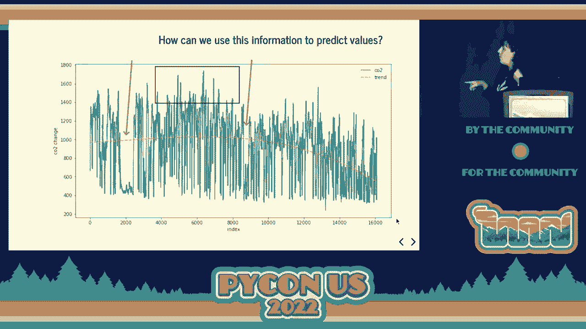

# P53：Talk - Maria Jose Molina Contreras_ Better Air, Better Health  Creating an indoo - VikingDen7 - BV1f8411Y7cP

 Welcome back。 I welcome you all to the last talk of the day。 We have Maria Jose to deliver。

 a talk on better air， better health， creating an indoor air quality monitoring and predictive。

 system。 Over to you， Maria。 Thank you so much。 Hello everyone。

 I'm so excited to be here today talking about how。

 creates an air quality monitoring and predictive system。 And before to start， I would like。

 to ask you how many of you are interested in sensor data and microcontrollers？ Good。 And。

 what about data analysis？ Oh， good。 And what about machine learning and data science in， general？

 Awesome。 This is the talk for you。 Let's start then。 My name is Maria Jose。 As， you know already。

 I have a background in plant molecular biology。 And currently I am working。

 as a data scientist at infarnt that is a vertical farming company。 But in my free time， I enjoy。

 doing doing yourself projects with microcontrollers and IOT and kind of mixing all the things that。

 I love。 And this is one of those projects。 What is the motivation of this project？ Well。

 with the pandemic situation， my lifestyle changed before the pandemic， I was working on site。

 and I was having some more active life。 Then I moved to remote life and some changes happened。

 Some of them， it was like more be at home。 I was mainly at home almost the whole day。 And。

 some day I started to feel like a lot of headage， some feeling of being really sleepy and I didn't。

 know why。 Until one day I was thinking to say what is going on in here and I realized。

 that when I was going outside taking fresh air， I was feeling better and I thought， wait， a second。

 maybe it's something in my air， in my apartment that it's not going really， well。

 And then I started doing some research to know what， how can you quantify your air， quality at home。

 And I realized that there are a lot of factors。 For instance， the co-pans。

 How many people is living in your apartment？ Also， there are the humidity of a moisture。 By the way。

 I think that it's really important that you take care of what is the moisture， at your apartment。

 This is a biologist because the mold and the fungus are really happy once。

 you have moisture and high humidity。 But this is another topic for another day。 Then we have。

 also the ventilation。 Something that you think， wow， I opened the windows and that's all， right？

 Well， it's a bit more complex and you're going to see later why。 Later we have the pollut。

 and sources。 For instance， it's not the same if you live in a city with a lot of factories。

 or if you live in countryside， for instance。 That is not the same if you live close to a， volcano。

 for instance in Canada， in Canada， Iceland or in a desert。 Also， we have others。

 and gazes that is quite important。 And I start thinking， "What is my problem？ I don't know， yet。

" And I start reading publication as I mentioned， I am scientist and I love just。

 great scientific publication and I realize that there was a field that a lot of scientists。

 are publishing about CO2。 And all of them， for sure， this is just a some collection but。

 there are so many publications about CO2 and the effect of the in our health。 All of them。

 end up saying that it's difficult to correlate the CO2 levels with the health problems because。

 it's more complex。 As I mentioned before， there are the humidity， the pollutants， the。

 previous health condition that you can have but all of them indicate that CO2 has an important。

 factor in our health。 And as you can see， for instance， in the first one， say the CO2。

 will have an impact in decision making performance。 Good advice。 If you need to make a decision。

 open your window sometime before make this decision because this will affect you。 Well。

 what is good？ What is bad？ Depends， right？ The definition always。 Be careful because。

 depends on the source， the numbers change but let's take it as a proximity to the values。

 What we have in here is the CO2 per per million numbers， it's the x axis and then we have。

 the difference steps when we consider that this situation is good or kind of bad。 And。

 as you can see， lower to 1000， we are kind of considered good and higher to 1000 will。

 be bad just to summarize the information。 Also， the difference health impacts that we can。

 find here， you need to have a consideration that it's around 2000 but depends on our other。

 factors and our previous health condition could happen before this 2000。 Well， at that， point， say。

 hey， I need to do something and test that if my indoor conditions are okay， or not。 For that。

 what I did is say I'm going to take sensors， I'm going to collect data。

 and I'm going to monitor these values to see what is going on in my apartment。 But then， I thought。

 wait， what if I also do some prediction because it's really nice to have the values。

 in real life but what if I could prevent this situation and then appear the idea of the predictive。

 system。 Let's start step by step because you are going to see that this is a bit complex。 Well。

 let's start with the data collection。 I used two different sensors。 One is for particles。

 a blue one， that is the PMSA， and then we have the CD that is for the CO2。 I wanted to have。

 as much data as possible because as I mentioned before， those factors are always working to， help。

 My favorite approach， I try to keep it simple。 It's like I try to do something simple。

 but then everything gets complex。 You are going to see， you are going to see。 But I try。

 I try to keep it simple， I promise。 And then what I did is to connect this particular sensor。

 to a QT pi microcontroller， what is really， really small is really compact system and。

 was really kind of straightforward to have it。 And I was running it using the liquid Python。

 Everything was really okay。 Until the moment that I decided that I want to collect all。

 this data and I wanted to do the transmission of this data。 This microcontroller has not。

 the Bluetooth or Wi-Fi and then I could not collect the data。 And then I thought， well。

 let's try another approach。 You can think， okay， you could change the microcontroller。

 and choose another one with Wi-Fi or wireless。 Yeah， it's true。 The thing is that I was trying。

 to recycle the microcontroller that I had at home to minimize kind of everything。 Because。

 therefore， yes。 But just to be honest， what happened。 My second idea for the CO2 was use。

 micropysome with ASP-ASP32。 This microcontroller has Wi-Fi。 Everything was working really well。

 Until I tried to connect the other sensor， the particle one， I had some issues with the connection。

 and I could not solve those issues。 And it was kind of a bottleneck to me。 And for that reason。

 I just decided to continue with another approach。 But you're going to see that this is one of the。

 working progress that I have right now。 Well， what's next？ Then I went directly to a Raspberry。

 Pi with wireless。 And that will be the setup for data collection。 Of course， I wanted to。

 have something else。 I wanted to have a device with a screen where I could check my information。

 Because it's really nice， imagine you are in your meetings and you can see if you need。

 to open your window or not or how it's going on。 And also it's a perfect excuse to say， "Hey。

 we need to finish the meeting because my values of CO2 are getting high。" Well。

 I'm not sure it will work。 But maybe it's a perfect excuse。 Raspberry Pi 4， in this case。

 also it was because I have it at home。 You can probably use another one and it's not a problem。

 at all。 And just added the screen that also is touchable is really good。 Nice。 Then this。

 is the project structure that we are getting。 The two sensors are getting information。 The。

 storage information is the Raspberry Pi。 And then I have the two Raspberry Pi's connected。

 for a TCP socket， a socket connection。 And then we can start taking a look to the data。

 And of course， this is just an example of some of the data that I got。 On the X axis。

 we have the date and on the Y axis， we have different parameters， right？ The cells use。

 the temperatures in cells use， the humidity and the CO2。 Just to show you that there are。

 some fluctuations there and it's not going to be easy。 This is not going to be an easy， project。

 I can tell you。 And here are my values of CO2。 In green， it's kind of the good values。

 that is slower than 1000。 Then in orange， I have these values that it could be better。

 and in purple are values that are not okay。 Especially the ones that are in the arrow and。

 the bottom close to 2000。 This is not a good condition。 And of course， I cannot correlate。

 it with my heritage because I cannot do it。 But this is an indicative that the air quality。

 of my apartment was not okay。 What gives me a lot of happiness to see that this project。

 had to make a lot of sense to develop。 Then we have the monitoring system by one side that。

 we are going to see the results later。 On the other hand， we have the predictive。 For the。

 predictive one， what I did is implement a time series。 If you are not familiar with。

 the concept of time series， basically， here we have a plot not related with the CO2。 Anyway。

 on the X axis， we have the time and the Y axis， we have values。 This means that we are going。

 to get values in time and the time is important。 The order is going to be really important。

 And here we have a quite overwhelming plot of my data。 Please take it to time。 It's okay。

 It's just that， wow。 In the X axis， we have the index。 The index is the time。 In time series。

 usually what we do is take the time as a index。 It's like first day， second day， third day。

 What we are going to do is one， two， three， and then we take it as a index。 In the Y axis。

 we have the CO2。 What we have here is a different oscillation of time of my values of CO2。 In。

 the arrows， I am indicating some spaces where the values were quite low。 Do you have an。

 idea of what happened in those moments？ Open the window。 Something else？ We can windows。 No。 No。 No。

 Wow。 I am going to tell you。 I was out of home。 I was on holidays。 Once， you are on holidays。

 you can see that the whole change。 It's really cool to see。 What is important。

 is where I was tracking also the CO2 was in the place where I work in the office place。

 let's say that way。 And then if I was not in the office， where was not problem。 In the， square。

 I am indicating a really high number of CO2。 Do you have an idea of what is going， on here？ Sorry？

 No。 Many days。 I had some visits at home。 Then if you have， visit at home。

 be careful and open more frequently your windows。 That is important lesson that， I learned。

 If you open once per day， when you have visit， try to double or triple the， times。 And also， really。

 the last interesting thing is the trend。 Is this orange line that。

 we have here？ Sorry。 That we have in here at some point start to decrease。 Any idea？

 What happened？ Yes。 There was two things。 One is the change of season。 And as I live， in Germany。

 where the winter is really cool。 And then， you know， you try to decrease to。

 open the window because it's really， really cool。 And this is a problem， as you can see。

 But when the spring starts， it's really different。 The behavior， the weather is like， "Yeah， yeah。

 let's open the window and everything will be fine。" And one thing was that。 And。

 the second thing is that I realized， I start analyzing the data of the CO2 and I realized。

 that I was having an issue at home。 And I start to change it the way that I was opening the。

 windows。 Because at the beginning， I was only opening one window and then the third one， let's say。

 it's a combination。 And I realized that when I was playing with the different， windows opening。

 the values were changing dramatically。 This means that the whole fluids。

 are going in my apartment were affected。 Then this is really interesting to know。 And also。

 something interesting to play with in case you're interested。 Then it was okay。 Let's implement。

 some machine learning to try to predict my CO2 levels。 There are so many approaches that。

 you can use to do it。 In my case， I decided I saw this publication， which has a really。

 interesting approach because it has an adaptive approach to predict the indoor CO2。 And then。

 also they have this table with the different conditions， different parameters and different。

 architecture。 And I kind of realized that it was like， "Wow， I can implement a lot of。

 different architecture。" Yes， I buy it。 Of course， I did some variations with my project。

 but at the end， what I try to follow is the adaptive idea of windows of that。 But I am。

 doing some spoilers for the next one。 Then I created that asset。 Well， I monitored before。

 created that asset。 I monitored different variables that was the CO2， the humidity， the。

 temperature， the particles and also the activity level。 Because of course， you realize if you。

 are not at home， then you decrease the levels of CO2。 And then if you include that in your， model。

 the prediction will not be really accurate because if you are not at home， you'll。

 do a lot of the work done， produce CO2 and then that。 Yeah， these kind of things。 Then。

 I created that asset， having in consideration of the time series work。 Always be careful， with that。

 Also， it needs to be normalized to the data for the training。 And I implement， this idea of windows。

 the mobile windows。 In this case， I'm not sure if you are familiar。

 with these kind of methodologies， but what we have is a time， a period of time that we。

 train our model and then we do the prediction for the next hour， days， depends what you need。

 Then what you want is move this window to the prediction and update that。 We move， we update。

 we'll retrain， we'll retrain， we'll retrain， we'll retrain。 What we are going to have with。

 that is more accurate results because we are having more updated results because if you。

 have the personality of if you are not at home or if you have whatever reasons you have。

 your data set will be affected。 And then at least if you have the most recent situation。

 you are going to get more accurate results。 Then I use a CNN。 I'm not going to go into。

 the tails because if not， we are not going to be able to end the talk。 But if you have。

 any questions later， I will be happy or at some moment just to show you what is the。

 architecture of the CNN looks like。 What I like also to share and I like to see when。

 I go to data science talks is this whole people do this deeper parameter selection。 For that。

 reason， I also include it， but I'm going to keep it also fast and simple in case that。

 you are not really interested。 But I love it。 For that reason， I decided to include it。

 Just mention a couple of things。 It's like we have a convolution 1G that in this place。

 we are analyzing what is doing is analyzing and structure the pictures。 Then we have the。

 input shape that we are going to introduce the variables and the times and the time there。

 in the match pool 1G what is happening is we are taking the most important information。

 and then we are going to have our output。 Of course， there are much more code。 This is， just a part。

 Just to let me know。 Well， about metric-gen results， I use the RMS as a metric， of performance。

 I did some experiments for a per parameter。 I tried to see how it was， working。 But as you know。

 as a data science project， you need to iterate one and one and， I did the best so much。

 I just did some analysis and approaches because what we are going to。

 need to do once this project is done is go back and improve and optimize all the process。

 Then from the window in perspective， it's really nice and I love it to implement that。

 But you need to be aware that each window is going to have their own performance because。

 if you have lack of data in some window or something happen or a lot of things could， be。 Here。

 I show you some results that I just considered that could be really interesting。

 to see and how it's going。 In blue， we have the input。 In green， we have the labels and， in orange。

 this crosses the prediction。 What I'm having here is the window of 24 hours。

 and what I'm doing is a prediction each hour。 Of course， in the final version of what we。

 are going to see， we are not going to have this exactly。 What we are going to have is。

 the prediction at the end。 But I just wanted to share with you how it was going in each， step。

 As you can see， in some points， it's quite， accurate。

 What we expect is half overlapping between the labels and the prediction， the， green and the orange。

 But in some cases， at some moment， it's not happening。 But it's。

 kind of normal and it's something that needs to be optimized。 But it's not bad at all。

 And this is the final project structure that we've got because we are going to have the。

 machine learning prediction to deploy in our Raspberry Pi and then we are going to have。

 a simpler flash application in the other Raspberry Pi and we are going to have the display and。

 how everything looks together。 First， I thought， okay， I need to install all my sensors on。

 Raspberry Pi in my apartment。 Let's see。 It's really nice。 And I remove a picture of my， sister。

 Don't tell her。 Please don't tell her。 And I just did your hair for some sensors。 Yeah。 Well。

 this is who looks like the flash application in our Raspberry Pi。 It is the。

 one that we are going to have close to our seat or where you work。 And what you have。

 you can see this in here is the temperature， the humidity。 This is the CO2 concentration。

 Here we have the prediction and just the date。 The idea is to have the raw values from the。

 sensors in constant in real time。 Of course， not each second。 I think that I turn every。

 10 minutes if I am not wrong。 And then the prediction， each hour。 One hour， I decided。

 to one hour because it's kind of a time enough to when I am a meeting and I can kind of take。

 a break。 And it's time enough to me to open the window and do something。 For those values。

 are really interesting to have more frequently。 But of course， this is the pen of the criteria。

 and the things that you need。 And this is who looks like。 This is your Raspberry Pi and。

 change and how。 And what is working for us right now？ I am doing this implementation。

 but using microcontrollers， not taking out at least one of the Raspberry Pi。 My idea is。

 to implement and use TensorFlow Lite。 Kind of for fun， let's be honest。 I want to just。

 do a bit of research and see。 And something that I did mention， it didn't include the。

 particles information in my model。 And maybe someone is wondering wait， but you change the。

 system from the microcontrollers to the Raspberry Pi for that， right？ Yes， I did。 The problem。

 was that the sensor arrived late because I bought it a bit late and I could not have。

 all the data that I wanted。 And I had the system running with the CO2 and the humidity。

 and temperature and I did the decision and say， okay， I am going to take out the particles。

 but for the next iteration， it will be in because we will bring a lot of interesting information。

 And then of course， optimization。 This project has a data science， projects， and it's optimization。

 but also from microcontrollers， it could be optimized and all projects could be。 And yeah。

 that I am going to end my presentation here。 If you want to be in touch or if you have questions。

 just feel free to reach me out。 I will be really happy to discuss because I love all those。

 topics as you can see。 I enjoy it a lot。 And yeah， thank you so much for your attention。 [APPLAUSE]。

 (applause)。