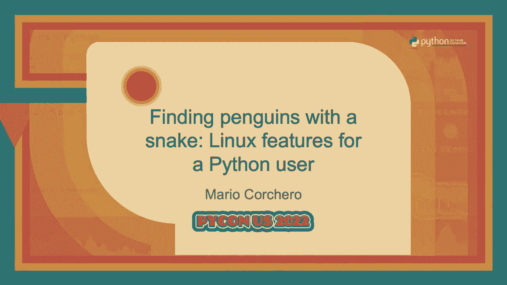

# P54：Talk - Mario Corchero_ Finding penguins with a snake  Linux features for a Pytho - VikingDen7 - BV1f8411Y7cP

 \>\> Thank you。

 Hello everyone。 My name is Mario。 I want to make sure you're in the right room。

 This is not the pattern matching talk。 That's in the room。 I'm surprised to see many people here。

 You still have time to go to the other one。 Well， as I was saying， my name is Mario。

 I work at Bloomberg。 I want to speak today about basically how to explore some Linux features from Python。

 The talk could have been just named that。 But it's so about the clickbait， right？ After the talk。

 I'm going to be around。 I'm one of these people that love to get stopped in the hallway and chat about anything。

 There are a lot of topics you can speak with me about that doesn't have to be necessarily， Python。

 Hopefully， I will get to meet and share some time together。 So as I was saying。

 we're going to speak about Linux and Python and we'll see some basic Linux。

 concepts hopefully through APIs that you already know。

 The objective of this talk is that you will get to hopefully know a little bit more of。

 Linux through an environment that you're comfortable with。

 I think we don't have time for questions at the end， but I'll be at the hallway。 First of all。

 Linux or Python， you might be wondering what does Python build against。

 There is a put here to URLs that you can check that will help you out to figure out whether。

 the platform you're working on is supported at Python。 On the second link。

 there's a pipe that defines what that supported means。

 There are situations where a release may be blocked based on issues in that platform。

 And there are some others where these are most best efforts。

 There is also the Python build bots where it's basically the farm that's building CPython。

 against multiple platforms every day。 There is even a watch with a really cool shield。

 It's kind of like a really slight group。 You have some people that belong to that here in the talk。

 But basically， there are people that are making sure that CPython continues to build and to。

 run in multiple platforms whenever there's a new change that's made in the source code。

 Additionally， you should be aware that CPython release only releases pre-built interpreters。

 from macOS and Windows。 And what that means is that if you are using CPython in Linux in any of this distribution。

 you are basically using something that's built from source。

 You will need everything is built from source， but you will need to build it on your own。

 Or in some cases， for example， you're using Ubuntu or something like that， there will。

 be some package manager that does that for you。 But it's not the Python release managers that are doing that。

 It's some other third party。 So getting into the meet。

 I'm going to speak through multiple modules that allow you to。

 interact with APIs that are at the end providing use services that belong to the OS。

 And before we start into that， there's something I like to tell you。 Because I find， like。

 I work with a lot of Python developers and sometimes I find that。

 people don't know about many of the modules that are part of the Sunday library。

 And we are proud to say that our language comes with batteries included， but we never。

 get to know about all the batteries that include。 So here。

 I'm basically distancing some of the modules that allow you to interact with， the OS。

 And I'm sure that many people here in the audience have not seen some of them。

 And a module of course， I'm placing many people don't know about。 And it's， in my opinion。

 quite handy。 It's a file CMP。 That basically allows you to compare if two files are equal or even compared to directories。

 It's super cool。 And I'm sure that many of you have written that code on your own to compare it to directories。

 so file， isn't it？ So you know， if you have the time after this talk or after Python or whatever。

 you can， there， is a page in the C Python documentation that lists all the modules in the standard library。

 Just go through it。 I'm sure that you'll learn some new， cool module。

 So we couldn't speak about Linux and Python without speaking about processes。

 So a really big introduction when we're writing a program， all we're doing is basically creating。

 instructions， right？ And then those instructions define a program when it's in disk and you're going to move。

 it into memory。 And that creates a process in some way。

 The process is made of those instructions that we wrote together with some state。

 There is some memory around it。 If you have my experience with it。

 I recommend that you read some information around the memory， layout of a process。 I promise you。

 you're going to be fascinated。 And basically， once you have that in memory。

 the DOS through this scheduler will prioritize， what the instructions are being executed。

 And that's cool。 But how do we create a process in Python， right？ So if you haven't seen it before。

 oh， no， the slides are cut。 So is there the video-- the media people-- is there any way I can， like。

 make the-- ah， don't worry。 There is a part here in the corner that is going to put on all the slides。

 all the policies， lights afterwards。 But there is a main command for each of the slides that I'm putting that allows you to。

 go deeper if you want。 But I'll just say that。 That's a pity。 So well， fork。 Through the iOS module。

 you will be able to run this。 It's called fork。 And what that allows you to do is basically get the current program and create a clone。

 of-- on its own。 And that's going to be a child process。

 This is kind of like the most-- about the way to create new processes on Linux。

 You can see that what the API allows you is you call OS。fork。

 And that's going to give you a return code。 The return code is going to be zero in the case of the child。

 And it's going to be the PID of the parent-- sorry， the PID of the child in the case of， the parent。

 This is really handy way to just allow you to run some coding parallel， right？

 Here you can see how in this example we are basically starting a program， right？

 Then we're going to call in fork。 And those two things are going to be executed in parallel。

 The child process is going to run the first section of the if。

 And the parent process is going to run the second part。 When I say that when you run fork。

 the process is duplicated， you might be thinking that， wow， that has to be really expensive， right？

 And there are many optimizations to make sure that that's not the case。 Good example is that。

 for example， on the next， there's a comp-- what's called copy， or write。

 And what that means is that when you're actually fork-in， you are not copying the whole thing。

 You are only going to start to copy that part of memory when you modify them。

 Which is really handy if you think about， for example， these instructions and all the code。

 that are there， which is not going to be changed。 And I also wanted to mention here。

 which you can find in the man page if you read that。

 And I really recommend that you run man fork if you ever have to interact with any of this。

 is that threats are not copied。 When you run fork。

 only the threat that's executing that is going to be the one that's， going to be cloned。 Again。

 don't be afraid of the Linux manual。 I promise you， it's really nice and easy to read。

 especially when you know what the thing， is doing。

 So it's a pity that we cannot see here in the slides。 But there at the top， it says man fork。

 The second thing I want to speak about， you can speak about fork without exec， is the exec， API。

 This is going to allow you to interact-- well， there are multiple functions you can see-- you。

 can find in the OS documentation of Python the different functions that allows you to interact。

 with execs in different ways because you might want to pass different-- like， basically， the。

 API just changes how you can pass parameters and some other things。 So for example。

 the path environment where a variable is going to be used to find the， command。 But basically。

 what this is going to do is it's going to replace the current process with。

 the one that you pass it here。 So here we're just saying， like。

 this program is just importing OS and then it's saying， okay， replace myself with this new program。

 And that's going to execute Python 3。9 and it's going to execute that。

 You can realize that line number 6 is never going to be executed because you're replacing。

 the whole program and therefore the instructions of the previous program that no longer is。

 16 that process。 At the top there， you can see a new reference which is man exec。 Okay。

 Something else that might be handy when you are doing fork and exec is that you can register。

 at fork handlers。 What this allows you to do is to execute code before you fork or after you fork。

 And you can customize that in both in the parent and in the child。

 Python allows you to do this really nicely through this OS register at fork。

 You can basically pass function there with what you want to execute。 Okay， so you might wondering。

 okay， I'm not going to use any of this。 Why are you speaking to me about it？ Well。

 have you used a process？ If you have ever used a process to run anything like this。

 this is a code example taken from， this subprocess documentation， you are indeed using this。

 This is the source code behind subprocess， so you can see there， I'm not lying to you。

 And here is basically doing fork and exec。 Something similar to how I say。

 go and read the different modules that they have in the， standard library。

 There are some modules that are really easy to read and understand what's going on。

 So I would encourage you as well to go and read the source code of some modules because。

 then you can understand what's actually happening behind。 In this case， indeed。

 it's just calling fork and exec。 And you can see here how it's the same structure that we saw before。

 where it's just calling， fork， getting the PID of the child， right？

 And here it's checking if the PID is zero， that means that we are in the child。 So it's just。

 it means that we are in the parent， so we are just returning。

 Otherwise here you have the code for the child。 You can see here again the code to the after fork in the child。

 There is also a new other section in the code that does the after fork of the parent。

 but I didn't include it in this slide。 Similar to how such process just do fork and exec。

 multi-processed in， that's something， really similar。 So believe it or not。

 you have been using this all the time。 I'm not only on Python， of course。 Some more things。

 If we start to speak about files， something I love also to show some people is how you， can just。

 you know， you probably know that your process is always writing to standard， output， right？

 And it's written from standard。 Those are just normal files。 They are really not text files。

 but those are files that you can even open on your own。 Here you can see， for example。

 you can just open a STD out on a pen to it and read from， STD in。

 Something to mention here that I'm not catching some people is you can see here how we write。

 Hello Picon at Solid City， but only the first line is actually printed before we reread， STD in。

 They wonder why that's happening in the sense of like why do we see Hello Python， we have。

 to present there and then the other line appears when in the code we can see that he's。

 writing twice to STD out and then reading from STD in。 That's because the output is being buffered。

 I'm sure that many of you have， you know， love to live cowboy lives and have removed your。

 USBs taking windows without extracting the device， but that's actually the reason why。

 it's happening。 Because the Python or the OS， depending on their multiple layers。

 will be buffering the output， that you write to a file or to a media or anything like that。

 So you need to make sure that those are buffered before you close。

 If you want to go a little bit further and see what's actually STD out because you might。

 wonder anything， hey， this is just a file。 How come that I can have multiple processes writing to it and they are not colliding。

 right？ I can have multiple terminal screens and they are not interacting with each other。

 How does this work？ So what's actually happening is that STD out in STD just point to this like prok self。

 If you haven't ever worked a little bit through prok， I encourage you to do it as well。

 You can find all the information about the process there。

 And what's actually happening is that's basically just pointing to a file description of your。

 process。 And that's actually， and I think I have time and that's actually， I'm going to show you。

 what actually happens there。 And that then is pointing you to your terminal。 So for example。

 here if you see prok self live demo， whoo， FD1， that's actually just a， same link to my terminal。

 You can see here if I run TTY that matches。 And what that means is that basically STD out is being pointed to that file descriptor。

 and then that file descriptor is pointed to my terminal。

 But this is as fun as you can just take this and write things here。

 You can write hello picon from here。 And that totally works。 It's just the file。

 You can even write from a different terminal。 And that will work。

 And of course you can do exactly the same thing from picon。 You can see it's here。

 You can even cut it。 You can even read from it if you want。 And then fun things start to happen。

 Like for example， if you write here， both of them are running and you'll see it in both， places。

 It's at the end the API you're working with is just a file descriptor。

 So you can just work with it as with any other file descriptor。 Really cool stuff。 You can， yeah。

 that's continually because I'm actually running out of time。

 Similar to how you can open and read files， you can also read about the metadata from， Python。

 There's this that command in Linux and you have this that module in Python that allows。

 you to resolve that。 Okay。 How am I doing with time？ So next thing is the locale module。 Again。

 you can read man set locale and that will allow you to learn a little bit more on。

 the Linux man pages about how the locale works。 But this allows you to handle all kind of like cultural specificities of your code。

 Here I'm going to put in an example of how you for example can use locale to parse that。

 string for 43， 210 into a float。 And you can see that you get different results whether you're using the US locale or the。

 Spanish locales。 All programs start with what's called like the legacy C locale。

 But you can change that once you start by changing the locale here。

 Probably when you are working with like local specific programs， you're using more high-level。

 modules。 But it's always good to know what's behind the hoods on this basically what allows you。

 is to read that information from the OS。 If you wanted to add more locales。

 what you need to do is basically install the interiors。

 some language pack and that will give you that。 Okay。 So time。 This is topic I love。

 If you might be wondering， "What's so hard about time？ Why do I need the OS to give time？"。

 To give you the time。 Well， the thing is time is not hopefully this is not new to you。

 But time is a complex concept to it's just hard to know what time is this。 How crazy it sounds。

 But the thing is like the in Python， the time is being provided by the OS。

 And the OS actually works with some hard work code which is just using Quartz because that。

 provides， that gives you something that gives you a periodic event that you can check and， then the。

 you know， your PC is going to check is going to be able to track how seconds pass， by using Quartz。

 And then your OS will be able to read that and will combine that with the time from all。

 the PCs which is being given to you via NTP。 At the end， the time is just giving to you。

 is actually being provided by some atomic， clocks that you don't have to worry about。

 But it's good to know that whenever you are asking Python for what time is it， all this。

 is happening。 And the reason why I'm saying that is because you might start to build some assumptions around。

 it that you should not。 Like for example， that the time is monotonic and extending。

 So that's something you can actually not rely on time。 So yeah。

 like this basically allows us to call to the OS and get the time that it is。

 And you might wondering， yeah， but I never use time。time。 I use daytime。 Well， if you read the code。

 it's actually the same thing。 All time in Python is actually being provided by the OS by just calling time。

time。time。 Here is the underscontang which is the extension that's actually calling them to the OS。

 You cannot see the main pages here but here actually it says "man and TPD"。

 And it allows you to know how this protocol that synchronizes your time with all the PCs， work。

 Because probably many of you here will have a watch。

 And it's important to realize that your watch will have a different time from my watch。

 And even if we were to synchronize them right now after a day or a month or a year because。

 your watch is probably based on words or it's mechanical， it will lose synchronization。

 with each other and you need to synchronize them from time to time to make sure that you。

 are following at the same time。 So you get all of this for free in Python because it's just asking the OS to give you。

 the time。 And in case you wonder because you have seen this YouTube channel， a very test， I call。

 like "oh， how can I handle lib seconds？"， Well， the thing is like the OS is giving you the time in what's called Unix time and that's。

 not included lib seconds so if the OS does not know about lib seconds， Python cannot know。

 about lib seconds。 Okay， so let's go with signals。

 So signals are just so far interrupt to notify a process of an important event。

 There are many events that your processor might want to know about and the OS can pass that。

 to them。 You can also just call kill and basically pass a signal to your program。

 There are usually signals that you can customize yourself and then there are signals to tell。

 the process to interrupt itself or there are signals that surprise many people which is。

 the seek pipe。 What that means is that you saw how before we saw， you know， like there is STD out。

 STD， out and STD in。 When you in Linux when you have a command and then you put like the pipe symbol and another。

 command， what actually happening there is that the OS is mapping the STD out of your first。

 command to the STD and to the first one。 So if one of them， there is no file there really， right？

 So what's happening is that when one of those processes die， the pipe is broken because one。

 it's not connected anymore。 So that's the OS is going to notify you via that pipe broken signal。

 Something where you might have seen signals well if you are running web applications or。

 really common practice is to basically handle the seek interrupt as a way to have a way to。

 tell the process like hey I want you to stop because I'm running or start the machine or。

 whatever so you can customize what to do with SIGINT and basically clean up your process。

 before exiting and if they don't exit then you can just run SIGGL which no one can overwrite。

 and it will just kill your process in a nice way。 And how is all of this handling Python？

 Well you can call the signal module and here you have an example of how to register a signal。

 This might cause you nightmare because you might have realized that now any instruction。

 in your Python program can run any kind of， can raise any kind of exception。

 Please don't start to capture serial division errors around time。sleep。

 So here you can see how to register a handler for any signal and something to be aware is。

 how does Python handle those signals， right？ Because signals are done on a lower level。

 So what's actually happening is that Python will always pass those signals and call the。

 signal handlers in the main thread。 And the same way that signals are handled in the main thread。

 signal needs to be registered， in the main thread。 You cannot register a signal in any other thread。

 Something that Python will do by default for you is translate SIGINT to a keyboard interrupt。

 exception and SIGPIPE to a broken pipe error exception。

 If for a reason you wanted to overwrite SIGFALT and some other signals that won't work as。

 you expect in Python because at the end they're going to be passed again to the C level and。

 your program will not be heavily expected。 So you have another module in the standard library called fold handler that will allow。

 you to do that。 Okay， so name pipes。 I don't know why I love this。

 They are a really simple way to have interprocess communication。

 What this allows you to do is you can have a file where you can have two， well a file。

 where you can have two process connect and pass information from one to another。

 Is you need directional？ And here you have an example on how to do that。

 Something to note is that you need to have both sides connected and otherwise they will。

 by default block on it。 So that's why here you see some APH related to how to connect with a block and things like。

 that。 And basically， yeah， you cannot see the main page there but you can read MAM FIFO and you。

 will get more information about that。 If you want to use name pipes。

 go and read that because there will be some things that， surprise you。

 Something I like to do when I'm using name pipes as well is on the reader process I like。

 to have as well like an open file descriptor with a write permission。

 That's a way to unplug myself if I have some kind of multi threading application。

 But if you like this you would love unique domain sockets。

 So what this allows you to do is similar you have kind of like a file that allows you to。

 have two process communicate with each other but here you have a bidirectional channel。

 So that means that you'll need to use send and reg V。 But this allows you to have basically。

 a communication between two process similar to how you can use a socket to communicate with。

 a process in a different host。 You can use you to need the myself to communicate with a process in the same host。

 Something that's amazing about this is that because it's a file you can control permissions。

 like who can read and who can write just with file permissions which I think it's beautiful。 Okay。

 so if you want to do this and you want to combine it with fork and exec here we have。

 an example that's kind of like full end to end。 So here you can see how you can use socket socket per which is another function that you。

 have in the standard library and that's going to give you basically two variables that you。

 can use to communicate between each other。 So here you can see that we call socket per and then we have the call to fork and so now。

 you have to know， okay so I have now two programs running through this， right？

 And we can see that in the child we can use this like child socket to send information。

 to the parent and the other way around which is super easy way to use information from。

 a process to another。 If you wonder what is all of these useful for that allows you to then create this is。

 the sponsor slide。

 This allows you then to create products like main rate。

 So if you haven't heard about main rate it's a new memory profile that we built。

 And the reason why I'm including here is because if you like to know more about like some Linux。

 picture I would really recommend that you read through the source code。

 It has not only some advanced and beautiful concepts but it's really well to comment it。

 and we have actually got some really cool comments from people about how well I'm fine is to。

 read the source code。 I promise really。 Basically， have a look through it。

 I'm not one of these like fanboys that will just like。

 publish a tool like with flags and t-shirts and everything。 Don't trust that kind of people， okay？

 But if you have the time I would really recommend that you have a look at it totally objective。

 okay？ And yeah， check it out because you have many many concerns that you might like that are。

 related to this presentation as well。 And that's all I have。 [APPLAUSE]。

