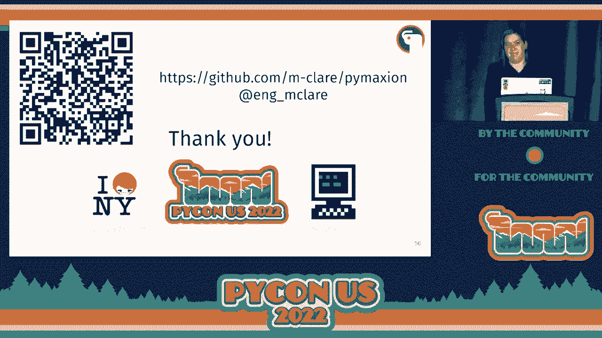

# P55：Talk - Maryanne Wachter_ Will it Blend_ Writing A Custom Constraint Solver for B - VikingDen7 - BV1f8411Y7cP

 All right， hopefully this will advance my slides and I can move on。

 Okay， so， yeah， my talk is entitled "Will It Blend？"。 And it's about writing a custom constraint solver for Blender using Python。 So the agenda in terms of what I'm going to cover is a bit of motivation and background。 about why I looked at this particular problem and then go into the back end of why I chose。

 to use scythethon， looking at a toy problem for this going over the Python package structure。 when you're using scytheon and then compiling scytheon packages and then moving on to performance。 So how you can use scytheon to release the gill， how you can profile scytheon， and then。 on the front end， why do I choose to use Blender and then going into some information about。

 Blender developments and Blender add-ons。 So a little bit about me。 I used to be a structural engineer， so I worked on some landmark transit projects and big museums。 But for the past year， I've worked on software before that。 I've been writing Python since 2015。 but I've made the switch to entirely just working on， software。

 mainly focusing on full stack web applications， doing a lot of data visualization。 And you can find me at my blog。 I write about some of this kind of stuff and also I'm on Twitter。 So I could do an entire talk about the state of software for structural engineering， but。 the 32nd bit about it is that it's not great。 You model building and commercial software to understand how it behaves under loads。

 You want it to move， but not too much。 And then you use an analysis program that might have a way of doing design。 so how big， should a column be， how much steel should you put in the floor。 But often in consulting design practices usually go back to designing all this in Excel。 And then most often you're using proprietary software to exchange data with other disciplines。

 so architectural， mechanical， electrical， and plumbing to basically figure out how all of。 the structural stuff will fit together with all the other components。 So having worked on software for a while， I have a lot of issues with the state of software。 in the built environment。 The UIs are usually super outdated and also it's very difficult to get information without。

 pointing and clicking and going through a bunch of different sub-menus。 It's very not developer friendly。 It's pretty expensive。 Standard structural analysis software is usually about $10，000 a license， even with the terrible。 UI。 For reference， the starting salary for structural engineering is somewhere between $60，000 and。

 $70，000 a year。 In terms of how the software operates， it's pretty slow， I would say。 There are a lot of matrix inversions required for the math behind structural analysis， and。 there really isn't any immediate feedback loop。 You click on something， you walk away。 you come back and you see the results。 Probably my biggest issue with it is that it's all a black box。

 If you're lucky， you'll get a manual that will have simple test cases and validations。 but looking at the actual code is not possible。 Before we had computers。 some of the most exquisite buildings constructed used physical。 modeling methods called form finding。 The idea was that you could take a hanging weighted chain intention and then invert it。

 in order to find the form of a structure in prepared compression。 You might be familiar with Antonio Gaudis still unfinished cathedral in Barcelona called the。 Sagrada Familia， which actually used this technique as seen on the left with his hanging。 chain model to find the prepared compression form of the building， which is still unfinished。

 and you can see on the right。 So today， the construction of the cathedral is being undertaken using computational geometric。 techniques as well as computational form finding。 So I also became interested in computer graphics a few years ago as it's a field that's miles。

 ahead of structural analysis in terms of using real time simulation。 There was one particular constraint solving algorithm for form finding and real time physics。 that actually has made it into built environment software through two plug-in implementations。 and a commercial three modeling software called rhinoceros。

 The examples shown here are from the original implementation of the algorithm called shape， up。 which was developed at EPFL， but the one that's widely commercially used now is called。 kangaroo too。 So you might ask if these always already exist， why would I rewrite it？

 My issues with this are that I still don't think the UI is great for that particular software。 It's based on visual programming， which is really great for rapid prototyping， but it's。 not great for documentation or having reproducible processes。 Even in this interface， it's not free。 Rhino costs about $1，000 a license， which might put it out of reach for hobbyists。

 These implementations are not slow。 What you were seeing on the previous slide was all real time。 but there's still a little， bit of a black box around the implementation while shape up is open source。 It's kind of academic abandonware， but the physics engine for kangaroo too is still。 not open source， but the constraint formulation， all those geometric constraints that feed。

 into the engine are and they're written in C#。 With those caveats。 I wanted to try my hand at implementing this algorithm myself in Python。 so to make it open source accessible and extensible。 Moving on to the back end of how I built this Python plugin， which I called Pymaxian。 Obviously。

 the first stumbling block you get when you say you're going to build something。 in Python is the complaint about how slow it is。 So I turned to Python as a way to keep Python syntax that I'm familiar with。 but improved， the speed significantly。 So there are several wrappers and ways to get C or C++ execution with Python as printed。 In fact， you can generate Python bindings for shape up still using SWIG。 However。

 this still means that if you want to extend constraints or change anything。 you're going to have to write them in C++ and compile them with Python bindings。 I wanted to write as little C++ as possible。 Some of these other libraries。 I thought it would be a little bit more difficult to translate。

 the constraints because they're very matrix operation-heavy。 So basically。 I wanted to create a general framework that I could build upon and keep。 the look and feel of a Python package。 Most critically。 I wanted to be able to write functions that would release the global interpreter， lock in Python。

 the GIL， to gain significant speedups and also possibly use parallel computation。 So what is Python？

 It's an optimizing static compiler that allows you to wrap C or C++ libraries in Python。 You can also compile Cython， which is a superset of Python to C or C++。 And then that compiled library can be imported into a standard Python script as an extension。 So to get myself started， I picked a pretty simple static analysis problem， the loading。

 of a cable at a midpoint。 So this is actually a pretty difficult problem to solve by hand because the deformed shape。 of a cable changes significantly under the load。 Fun fact。 most of structural analysis is based on assuming that deformations are really small。 This problem only involves three types of constraints and there are five constraints， in total。

 You've got anchors that will keep points 0 and 2 from moving towards the center as the。 load is applied。 The force itself is a constraint。 And then there's a relationship between points 0 and 1 and points of 1 and 2 that are based。 on the material properties of cable。 It's basically how stretchy it is because it wants to snap back to its original length。

 So what the shape off algorithm does is consider these constraints independently and projects。 the ideal position at each point separately based on the constraint， which is a local， solve。 The constraints are then weighted against each other to find the position of the particle。 that best satisfies the constraints applied and this is an iterative process。

 The key feature of this algorithm is that the local solves for each constraint can be applied。 independently of one another， which means that you could possibly run this in parallel。 So ultimately what I ended up with for this small problem was quite a large library， a。 large number of files。 So PXD and PYX file extensions are unique to Cython。

 Those PXD files are basically borrowing from C++ for header files and then classes and。 methods are defined in the 。pyx file。 Okay， so I did end up writing a really small geometry library in C++ rather than dealing。 with wrapping an existing one and that's just because I didn't want to deal with all of。 the licensing issues or large builds for some of the typical C++ like geometry libraries， like CGAL。

 So the rest of the constraints were defined purely using Cython contracts， so each one。 of those required a PXD and a PYX file。 So why do I need all those header files？ In Cython。 if you're planning on importing a module， you have to have a PXD file that， corresponds with it。 So one thing that did jump out to me in Cython is that you can't just subclass all over the， place。

 You only get one level of subclassing that was subclass can inherit from more than one， superclass。 So for my purposes， this was fine because I could just set that a constraint was the parent。 class and then each type of constraint， so those anchors， those cables， those forces。 those are child class with its own calculate implementation based on the constraint。

 So this is a typical header file for the parent constraint class with all of the type declarations。 So each of these types are prefixed with CDF as they are data types and methods that will。 be used for running a program without the gill， which means that they can't be Python， objects。 So CDF methods also cannot be called from Python。 If you'd either need to define a CP def method to do so。

 so that's something that will run， either in Python or as a C extension。 or you're going to have to write a Python wrapper around， that function。 So with the actual methods for the general constraint class， the calculate method is。 going to be overwritten based on all of the constraints。 So it just has to have the same signature。

 The sum moves method is common to all of the constraints because that's the local solve。 per constraint。 So the calculate method for an anchor point is really simple。 It's just a 3D vector in space that will return the point wherever it is in space to。 the original anchor point。 The calculate method for a cable is a bit more complex and you can think of it like the。

 forces from stretching a rubber band or the rubber band wants to return to its original。 slack shape so it imposes opposite forces on the two points that you're holding in the， system。 So getting back to my first slide with the XKCD joke， you do have to compile Python。 I wrote a bunch of helper functions to make sure that Python would properly identify all。

 of the different components in different directories as well as attaching some extra compilation。 arguments to compile against OpenMP in case I wanted to use OpenMP in the future for parallelization。 So by default， Python compiles the C so I needed to specify C++ as the language。 For the actual build command， the in place flag ensures that the compiled files are going。

 to be in the same directory as the base files so that importing from the package is really， clear。 It just looks like it would be if you were importing a standard Python file。 So once you've compiled a Python package， you're going to get the dynamic library files。 I'm building on a Mac so I've got an SO extension。

 You're also going to get new C++ files that are at the same level and these are giant files。 There's like thousands and thousands of lines of generated C++ code so not necessarily something。 you're going to want to go digging through。 So I tested this out。 It was significantly faster than the original only vanilla Python， methodology that I used。

 But while it was faster， I wanted to know how much faster it。 could be and I wanted to figure out what the best way was to profile Python code。 So I mentioned wanting to use Python so I could release the guild to improve runtimes but there。 are a number of steps you have to do before you can run Python functions without the guild。

 So you've seen this on previous slides a bit but static typing and variable declarations。 are required。 Other things that you can play around with to improve performance are taking。 some of the training wheels off on Python through adding compiler directives at the top of your。 files。 So in this case I took a bounce check and wrap around and turns those off。 You really。

 have to use these with caution because you'll get really funky errors if you build it and。 then accidentally index something that would wrap around and this might be difficult to。 debug because you're just going to crash Python。 And then I also highly recommend writing Python wrappers for the functions that we'll compile。 just to see because otherwise you can't access them。 So you're going to have more code but。

 it will be easier to debug and test out。 If you're not writing no-gil functions you can。 just use a CP def function within Python and those can be called from either C or Python。 So other items for no-gil functionality， you see def rather than CP def or standard Python。 def functions。 Though if you're not trying to optimize for no-gil you can absolutely。

 mix these around in Python for other use cases。 Sython is pretty good about warning you when it compiles if you have incompatible Python objects。 that are still embedded in your code。 And for these CDF methods you'll also need to make。 sure that the signature matches in your pxd file and your pyx file so all of the arguments。 as well as the no-gil flag。 One thing to note is that writing no-gil in the signature。

 of a method doesn't mean that it's automatically going to default to no-gil when you run it。 You're just indicating that the method can be run without the go。 One of the biggest lifesavers for this project was a feature in Sython that lets you see inside。 each pyx file just how much Python is being called in the method。 So if you pass the dash。

 a flag to the command line it will automatically generate an HTML file for whichever file you're。 looking at and that file will highlight just how much of a method is accessing Python objects。 So you can see in this block because I'm using NumPy to create arrays that means that I'm。 creating Python objects。 So， end-to-erays are Python objects。 How can I have arrays that。

 work without the go？ You can use memory views to access NumPy arrays and update them within。 a no-gil block。 And so this was really useful for me to be able to keep track of particle。 positions as a 3D position array that I could pass to the calculate methods for each constraint。 Okay， so it's all this prep work and once you've done that it's time to release the go。

 All you have to do is add with no-gil to the part of the function that you want to run with。 no-gil and you just have to make sure that any of the functions that are called within。 that block are also designated as no-gil and you've checked all of those previous steps。 So you should see serious speedups in your code。 I was able to see more than 100 times。

 speedup once I released the go， which gave me near instant convergence for thousands。 of constraints。 I still wanted to try out profiling with scytheon so I turned to PySpy。 which is a low overhead profiling option that's implemented in Rust。 So integrating。 this profiler into my code required a bit of setup， including adding some additional flags。

 to my setup file to make sure that the generated C++ code from scytheon would include line， numbers。 And then you also had to add it at the start of those compiler directives in。 each PyX file to have line trace set to true。 My personal computer is a Mac， which works。 fine for some of the functionality of PySpy， but you can't profile native functions。 So。

 I ended up making a Docker container and ran PySpy with Linux。 This was kind of fun to。 figure out how to make a container that would have the right permissions。 So that's what。 that first command is。 The second command is includes flags that ensure that native sub。 processes are recorded and then all that is going to be output for the results to a flame， graph。

 And then the last command is just copying the flame graph out of the Docker container。 into my regular directory so that I can take down the container once it's finished running。 And so what I was able to get was a flame graph that gave me an idea of which processes。 during my simulation were taking the longest。 It actually turned out the assembly of the。

 particle system and translating all the Python objects to see， so basically like initializing。 all of the objects。 That was what was taking the longest。 So moving on to the front end。 this is great。 I've made something that runs fast， but I can't see it。 So I don't have。 any nice visuals of simulation yet。 And I didn't want to reinvent the wheel， so I decided。

 to integrate Pymaxian with a well-established open source 3D graphics program called Blender。 This comic is going to make a little more sense in a few slides， but needless to say。 there's a lot of fun with Blender Python versus system Python versus a virtual and Python overhead。 So what is Blender？ As I mentioned， it is free and open source with the new GPL license。

 I've only listed a few of the possibilities with Blender， which will exceed the capabilities。 of Rhinoceros， which was the other three modeling program I was familiar with。 The figure I。 had to do anything in Blender is like drinking from a fire hose。 There are a lot of different。 things you can do with it。 I barely scratched the surface with Blender with what I was doing。

 with Pymaxian because I was just mainly working with meshes。 Blender also has a really well-developed， Python API that most of its underlying code is written in C or C++。 So there's a very， robust Blender ecosystem of add-ons。 I've added some of my favorites from the built environment。

 So Sverchock is more general purpose because it's a visual programming interface that's。 similar to Grasshopper， which is really commonly used by architects with Rhinoc。 So how do you get your newly minted scytheon package into the Blender Python？ You're going。 to need to build scytheon against the same version of Blender Python as Blender Python。

 You can interrogate everything about your Blender Python install from the scripting tab。 There's an IPython interface to basically put in sys。path or sys。version info。 I decided。 to sim link my scytheon package into the site packages for the Blender Python install。 rather than copying it or building it with Blender Python。

 And then so now Pymaxian is part of the Blender site packages， but I still need to add how。 Blender is going to interact with that package through its UI and operators。 So there's a。 lot of disagreement about what the best way to develop with Blender is。 I've typically。 just created something to close and relaunch Blender whenever I'm making changes because。

 hot reloading doesn't always work。 And it's efficacy keeps changing as Blender evolves。 like things that work in 2。9 for relot reloading don't necessarily work in 3。1。 But at a minimum。 I do recommend adding Blender to launch from the command line because then all of your outputs。 or like debugging is going to print to a separate console window。 So I put my Blender package into。

 the add-ons directory also using a symbolic link。 Sorry。 Okay。 So this is the typical file structure for a basic Blender add-on。 And on。 the right you can see that there's this side menu and that's actually the menu that I created。 for the Pymaxian interface for Blender。 The Blender context in which you can use Pymaxian。

 is the object in editing context on one of the tabs。 So I have a number of buttons that are part of this menu as well as some pop-out panels。 And the Blender operator files where you're going to find all of your UI actions that call。 Pymaxian。 So it has a specific Blender class structure in terms of attributes and methods。

 And it also has a number of requirements for like unique labels。 So that's like underscore， ID name。 underscore label。 And then you can see that I have to define execute which is。 also has return a specific set of values。 So for all those nice panels you have to have a specific prefix in order to the specific。 attributes。 Otherwise it won't register when you tell it to basically add your package。

 So within I've got these pop-out panels you have some additional attributes that you can。 set basic values。 So in this case it's adding the strengths of the constraints with a typical。 notation。 And all of these UI panels have a draw method。 So most typical add-ons also have a property file and you have to register every single。

 constant that you use for those menus which in my case resulted in a lot of code pretty， quickly。 So rather than using a properties file I decided instead to put those constraints。 and basically they're bound so like all the options for like how precise that value is。 going to be that the user can set。 So I put that into a JSON file that basically groups。

 each set of values by the type of constraint。 And then within my actual menu file for loading。 into Blender I was able to import and iterate through that JSON file to automatically register。 each one of these properties so it's going to be easier for me in the future to add on。 to this JSON file rather than having to write a bunch of classes。

 And so what do I have after all that？ Pimaxian currently only supports a couple of constraints。 as basically a proof of concept but I was able to replicate the kind of hanging cloth。 form finding that I showed on that first few slides。 I'd like to do more to make it。 more interactive。 You can use modal operators within Blender to sort of allow for some interactivity。

 or I was looking into possibly using sockets that would be able to feed updated geometry。 back so that the user can have more interaction with the simulation。 So in closing I'd really like to thank the Python software foundation and Pilates for。 the opportunity to speak here。 Particularly the New York City Pilates group who acted as。

 a sounding board for a much shorter version of this talk。 And I'd also like to thank the。 Recur Center because I worked mainly on the Blender part of this project when I was doing。 a retreat there last summer。 So thank you。

 [BLANK_AUDIO]。