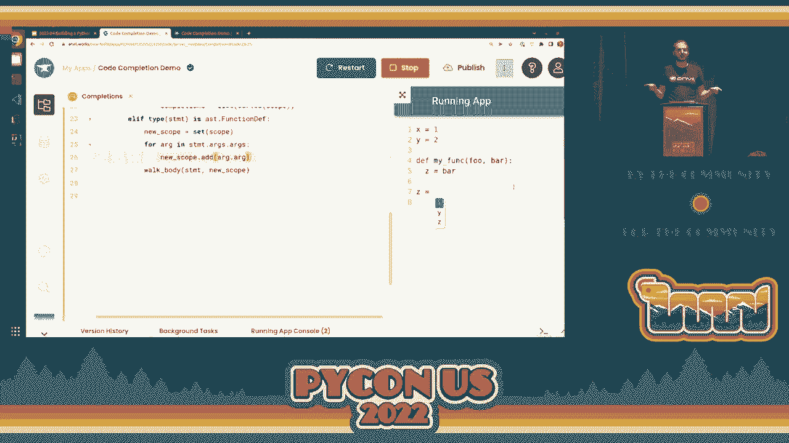
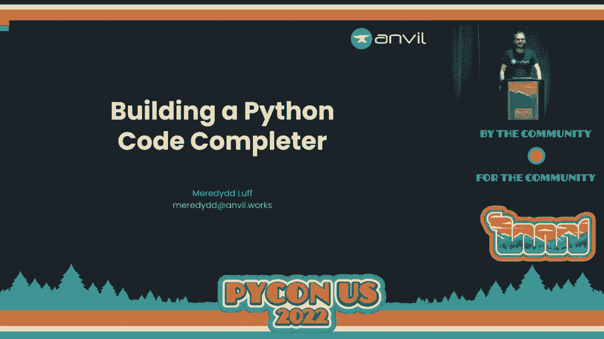

# P57：Talk - Meredydd Luff_ Building a Python Code Completer - VikingDen7 - BV1f8411Y7cP

 Hello and welcome back。

 This will be， I guess， one of the final sessions here before the plenary session。 So thank you for sticking around and I think you'll find it worth it here。 So。 Loretta Fluff is here and going to be speaking about building a Python code completer。 Let's give them a big hand， please。 All right， thank you very much。

 My name is Merrudiv and I am here to talk today about code completion。 So code completion is that little pop-up box you get in your editor， offering to auto-complete。 your variable names， your identifiers， anything else in your code。 And I got interested in code completion when I had to build a completer myself。

 And it turns out that code completion is really awesome。 It's one of these amazing things in computing that feels like absolute magic when you are。 using it and it's actually incredibly simple at its core。 So today we're going to be talking about why code completion is important to us as developers。

 We're going to talk about how it works and how it might be simpler than you might think。 And to show how simple it is， I am going to build a code completer live on this stage。 in a little over five minutes after which we can talk about the hard parts。 The things I'll need to do to take something I can build in five minutes and turn it into。

 something we can ship to a working developer。 But first。 let's talk about why code completion is really important。 So it gives us a bunch of stuff。 For starters， it gives us discoverability。 So we use a huge number of libraries and modules in our code and code completion lets us discover。 what APIs are available in our code editor without having to page over to the documentation。

 It gives us speed because we can type a few characters and hit the tab key rather than。 taking the time to spell initialization correctly for the fifth time dysfunction。 It gives us confidence that what we're doing is right because there are whole classes of。 bugs we can spot and fix or avoid entirely because the code completer warned us。

 And for all these reasons， it feels good to use。 It lets us stay in that flow state that as programmers is where we want to be。 So code completion is a pretty essential part of any modern developer workflow。 But why did I end up building one of these beasts myself？ Well。 this is because I am one of the original creators of Anvil， which is a framework for。

 building full stack web applications entirely in Python。 So that's Python running in the web browser， Python running on the server， even a Python。 user interface toolkit。 And more to the point， we have an online editor for apps built with this framework。 with a， drag and drop designer for building your user interface， but also an online code editor。

 for writing the Python code that will run in the web browser to drive that user interface。 as well as the code that will run on the server setting up a built-in database， and of course。 a built-in hosting platform， so you don't need to know about DevOps or JavaScript or HTML。 You can build and deploy a web application， even if all you know is a bit of Python。 Now obviously。

 to pull this off， we need good code completion。 And there are some off-the-shelf code completion systems。 but we had a couple of specific requirements。 One is that this is a full stack framework。 so I'll complete a need to know about some， stuff outside your code。 It needs to know about what components are -- what UI components are on your web page。

 It needs to know about the schema of your built-in database， and okay， we could have hacked。 that in。 But the real kicker is that this is an online editor in the browser。 And when a programmer is typing， there is just not a lot of time between keystrokes。 You do not have 300 milliseconds to send your code to the server， run it through a completion。

 engine and send the results back。 So we ended up building our own。 and that is how I ended up on the journey that I'm sharing， with you today。 So if we are building a code completer， what is our goal？ Well， we are here to answer one question。 and that is what is the programmer going to type， next。 And to do that。

 we need to understand the program that they are writing。 And to understand how we do that。 I'm going to have to take a brief tour into how Python， compiles our code。 So when you run a Python program， the Python interpreter reads your 。py file and follows。 the instructions contained within。 Now it does not actually seek through your file byte by byte reading each statement as。

 it executes it。 That would be a very inefficient way to run your code。 So instead it does something called parsing， where it reads all of your source up front。 and then turns it into a more tractable representation。 So it feeds this text to a bit of code called a parser， which will then generate something。

 called an abstract syntax tree。 Here's one。 So this is another representation of the same code。 It's a set of objects， and it's much easier to work with。 You can see we've got a function definition。 It's got a name。 It's got some arguments。 It's got a body that's a list of statements。 The first statement is an assignment。

 It's assigning to a variable named message。 It's assigning a string value。 Hello world。 And then we've got a function call that's calling a function named alert with one argument。 and that is the variable named message。 And this is much， much easier to work with from code。 It's just a bunch of objects you can walk over it。 You could walk over it， execute it directly。

 You can generate byte code。 You can do all sorts of stuff。 Now， as an aside。 parsing is actually really， really cool。 That parser wasn't even written by a human being。 Instead。 if you go to the Python documentation， you will find something called a grammar file。 And that is a textual description of the syntax of the Python language。

 So here's how it describes an if statement。 So it defines an if statement as the word if followed by an expression followed by a colon。 and then a block of code and then either an elif statement or an elsplock or nothing at， all。 Those square brackets mean the elsplock is optional。 And likewise。 an elif statement is the word elif， then an expression， then a colon， then， a block。

 then another elif statement or maybe an elsplock or nothing at all。 And if you look through the grammar file， there are pages and pages of this stuff defining。 every piece of syntax that could go into a valid Python program。 And what you can do is you can feed this textual description into something called a parser。

 generator and it will output code for a parser。 And remember。 the parser is the program that takes our source code and produces an abstract， syntax tree。 So we're reading in a text file and spitting out code for a program that will read in a。 text file and spit out an abstract syntax tree。 It's all very meta and it's enough to give you a little bit of a headache。

 But fortunately， as Python programmers， we don't have to engage with all this complexity。 because the parser functionality is exposed to us out of the box as part of Python's standard。 library using the AST module。 So this is a module you can import and then you can call AST。parse。 You can feed it a string of Python code and it will give you an abstract syntax tree。

 You can print it out。 It looks a bit like this。 You can see we've got a very small Python module here with a body with one statement。 That statement is an assignment。 Its target is the variable named x and the value we're assigning is the constant value 42。

 And this is， yeah， this is a set of objects。 It's much easier to work with。 It's all extremely cool。 But I'm pretty sure I was supposed to be talking about code completion somewhere in， here。 Fortunately， parsing is our magic bullet for code completion because if you are building。 a code completer， you are facing a half written program with a cursor somewhere in the middle。

 of it。 And it's your job to answer the question， what the program is going to type next。 And to do this， you need to understand what's going on in the program around where the cursor。 is to work out what the valid next moves might be。 And this is a pretty daunting task。 If you're looking at this as a set of text， you might want to examine byte by byte。

 But if we have a parser and we can convert it into a more tractable format， well， now。 we're cooking on gas。 So what we can do is we can replace this cursor with a special symbol and feed this to a parser。 And now we have an AST representing that code。 And somewhere in that AST is our cursor symbol。 And now we can walk through these objects。 We have a predigested idea of what the code is doing。

 We can build up a representation of what's going on。 So that by the time we encounter the cursor。 we know what's going on and we can offer the， programmer contextually appropriate completions。 So we could say， well， here we've got a function definition。 Okay， so we've got some arguments。 So we have the local variable self and event tags。 We know they exist。

 We've seen an assignment to the variable message， so we know the variable message exists。 We've got a function called arguments。 Oh， there's our cursor。 Well。 I guess we might want to offer those local variables as code completion options。 So that's how it works in theory。 So let's build one。 So here I have， open in the Anvil editor。

 I have a running web application right over， here。 So this is using the code mirror， code editor。 And every time I trigger the code completion in this editor， it's going to call this complete。 function。 And whatever it returns， it's going to offer me as code completion options。 So if I trigger it here， I am going to get some text because that's what was hard coded。

 And if we look at our print output， we can see we've got the source code here with the。 cursor symbol where that cursor was。 So we know what we want to do next。 We want to parse this。 Let's go and have some syntax tree by calling ast。parse on that text。 Let's dump that out onto standard output。 Now let's restart this and write it again。 Okay。

 let's trigger our code completion。 And in the app console， we can see， oh。 rather poorly formatted AST。 Let's use a new option from Python 3。9。 And now we can get a nicely indented AST。 And see。 we can see we've got a module with a body with an assignment to the variable x。

 and then assignment to the variable y and then assignment to the variable z and its value。 is our cursor symbol。 So we can just walk through the statements in this module and build up a representation。 of what variables are hanging around。 We want to keep a set of what variables are in scope to build that up。 So we're going to start that。 There's going to be a set of strings with the variable names。

 And then we go just for the free statements in the body of that module object。 Now we only really care about these assign statements。 So we'll go if the type or if that statement is AST assign。 Then now we have a couple of things to do。 The first thing is that we now know that this variable exists because it's been assigned。

 to。 So we， let's get the name of that variable。 See， targets。 First target。 We're not dealing with multiple targets。 No tuple destructuring in this demo。 Grab its ID。 Okay。 and now we can just take the scope and we can add that variable name to the set。 of variables we know exists。 Okay， now the second thing we want to do is check if we hit the cursor。

 So let's check the value if the type of the value of this assignment is a name object。 And the ID is this cursor symbol。 Then we've just hit the cursor。 We want to offer code completion。 Now we already have a set of all the variables that are in scope right now。 So that makes a perfectly valid list of completions。

 Let's just make a sorted list of everything that is currently in scope at the moment we。 hit the cursor。 And then instead of our hard coded list， we can return that。 And of course。 if we don't hit the cursor， this will raise an exception。 So let's have a fail safe。 Set that to an empty list。 Okay， if we go here and we trigger the completed here。

 we will be offered those variables。 So we have just built a code completer that passes our code。 walks through it， builds up， a representation of what's going on。 and then offers us contextually appropriate completions。 And that was barely 10 lines of code。 Let's get a little bit more fancy。 Let's talk about functions。

 So I've got a function here that's got two arguments， foo and bar。 And if I do an auto-completion inside this function， well， now I'm inside the scope of。 this function。 I have access to those global variables， but I also have a couple of new variables。 foo， and bar， because those were arguments to my function。 Of course。

 if I trigger the completion now， I will see absolutely nothing at all because。 our completer doesn't know about function definitions。 So let's go look through the AST and work out what's going on。 So this module body has an assignment to X as an assignment to Y and it's got a function。

 definition。 Okay， paid it。 We've got some arguments。 We've got a name and we've got a body。 There we go。 And here， of course， we have an assignment to Z and we've got our cursor。 So we just want to walk that body like we've walked the function body。 Now， of course。 that means this is going to have to be recursive。 So let's factor this out into a recursive function。

 So some tree， some scope。 And then if， oh， LF， type of statement is a function def， then， well。 we want to recursively， walk that statement's body。 Let's start with the scope we've already got。 Okay， now we're doing this recursively。 We can't just return the completions。 We're going to have to make that a global variable because we don't know where we're。

 going to find them。 So let's initialize them a global scale， global scope。 And then when we complete， we just walk the body of the tree， our initial syntax tree。 using that initial scope and return whatever completions we happen to hit along the way。 Let's run our code。 So now if we complete inside this function。

 we are being offered those variables。 Okay， so our complete now knows how to walk inside function definitions。 We're getting somewhere， but it still doesn't know that we're in a new scope now。 We've got some different variables if our cursor is here than if our cursor was outside。 So let's go model that。 So when we hit a function definition。

 we create a new scope to represent what's going on inside， the function。 Of course。 it's going to start out with all the variables that already existed in the， parent scope。 And then we want to add all that function's arguments to it。 So again， let's look at the AST。 we've got these args object。 So for arg in statement。args。args。

 we add the argument name to the scope because that's， now variable that's in scope。 And then when we walk the body， we walk it in this new scope。 So now if we run this。 if we trigger our completion here， oops， we will explode。 Line 26， oh yes， new scope。at。 coding live on stage。 It's full of pitfalls。 All right。

 we have a code completer that passes our code， walks through it， builds up a representation。 of what's going on。 It understands that inside a function you're in a different scope to outside a function。 and it's offering us those foo and bar as completions。 But if we complete outside。 you see it's only offering us our global variables because it。

 knows we're not in a scope where those are valid options。 So we have built a completer。 it passes our code， it walks through our AST， it builds up。 a representation of what's going on and offers suggestions that are contextually appropriate。 to where the cursor is。

 Pretty cool， right？ That was pretty simple。 What's next？ Well。 there are some pretty straightforward extensions we might make。 For one thing。 we might want to teach it about some more syntax。 Right now。 our completer only understands assigned statements and function definitions。

 We'd probably want to teach it about if statements and while loops and arithmetic operators and。 the rest of Python syntax。 We could make it track types。 So it's actually quite handy to know not just that a variable exists but what type it。 is so we could have our completer notice that hey， there is a person class here and Alice。

 is an instance of person。 So if I type Alice dot， it could say did you mean Alice dot name？

 We could give help with function arguments。 We could notice that the cursor is inside the arguments to a function call and we could。 pop up some helpful information about what arguments that function takes and so on and， so forth。 I mean， I'm not actually going to implement any of these， we'd be here all day but we。 wouldn't be here much longer than that because these are all pretty straightforward extensions。

 to what we've already set up。 Unfortunately， it's a bit more complicated than that and the main and biggest source。 of complication in code completing a Python program is that it is mathematically impossible。 to know in advance what a program is going to do before you execute it。 And in a languages dynamic is Python that means we don't know for sure what functions。

 are going to be defined。 We don't don't know what variables will be valid。 We don't know what attributes some module we import is going to have。 So we have to approximate。 we have to guess， we have to cheat。 And that's okay because building a code completer is a little bit like building the graphics。 to a computer game。 You don't need perfect physical accuracy。

 You need to keep the human in front of the computer happy。 Here's an example of where we might want to cheat so backward references。 This is a perfectly reasonable Python program。 It has a function。 doubles everything in a list of numbers with this twice function。 And if I'm editing this code。

 I might reasonably expect code completion。 Unfortunately。 the cursor is up here and if we are scanning this AST from top to bottom。 then at the point where we hit the cursor， we haven't even seen the twice function。 We have no idea it exists。 So what can we do？ Well， we can cheat。

 We can remember that the cursor was inside the double all function and then carry on scanning。 the rest of our module and then go back afterwards and rescan that function now that we know。 what's going on in our program。 Is it a cheap dirty trick？ Yes。 Does it produce surprisingly good order completion？ Also yes。 Cheating works。

 What about invalid code？ Here is a bigger challenge。 So very often if you are in the middle of editing a program， your program is not going。 to be syntactically valid。 So this is a very common situation。 You're editing on line three。 but line two has a syntax error。 And unfortunately， if you feed an invalid program to AST。parse。

 you're going to get a syntax， error exception raised and that means you're not going to get an AST。 Now this is enough information to display a nifty red line and say hey， syntax error， on line two。 you might want to go sort that out。 But we'd still actually like to provide a little bit more help with the editing that's。 going on on line three。 So there are a couple of approaches you can take here。

 You could use some filthy， filthy hacks。 You could notice the syntax error and then try and massage that program text into something。 that will parse。 Or you can use a parser with error recovery。 Now the idea behind error recovery is that you can feed the parser a program that has。 a syntax error in it。 And it will still produce a partial AST。 Now of course。

 this is syntactically invalid program。 Somewhere in here， it's going to throw its hands up， go。 "Ugh， syntax error， I don't know， what's going on。"， But with luck， this approximation。 because it is an approximation， will be good enough。 that you can still walk over it and learn some things about the program。

 And hopefully what you learn is enough to provide good autocompletion。 Now as I've said before。 Python's AST module does not do error recovery。 But that's all right。 There are some alternative parses you can use。 So jdai is actually a full-fledged code completion system for Python。 Or there are alternative standalone parses like tree sitter and laser and so on。

 And actually the anvil editor I've been showing you doesn't use any of these。 Because when you write programs in anvil， you write Python code that runs in the web browser。 we already make really heavy use of the sculpt Python to JavaScript compiler。 And so we use sculpt's parser to do our code completion。 Unfortunate consequence。

 sculpt's parser does not， is not good at error recovery。 So we lean quite heavily on those filthy hacks I was talking about earlier。 But I am one of the sculpt maintainers， we are rebuilding the sculpt's parser。 It will be good at error recovery， I promise。 Watch this space。 Okay。

 let's finish up with something a little bit more philosophical。 Let's talk about types。 So we already know that keeping track of the type of variables is useful in a code， completer。 So we can say hey Alice is an instance of person。 And that means that it has a name attribute。 But what exactly is a type？ Well， as working Python programmers。

 you might say to me the type of an object is it's class， dummy。 It's what I get if I call the type function on it。 Or you might say it's what the type annotations say， yes， okay， whatever。 As code completion authors， it's actually much more useful to think of the academic definition。

 of a type， which is to say anything we know in advance about a value。 So here， sure。 we know that we got the value of the variable Alice by calling the person， constructor。 And we know that the person constructor when it's called returns is something that has a。 name attribute。 So yeah， fair game， use it in your code completion。 But what about these values？

 They both have identical types as far as the interpreters concerned。 They are both instances of the dict class。 But they have some crucial differences that might be useful to the programmer。 If you're using one of these things， we might want to offer completions for what items to， look up。 So it's perfectly valid for our code completers to treat these two values as having different。

 types。 Perfectly fine。 Now， why am I banging on about this？

 Because I'm a web guy and the web sucks at this。 All the time we write code that hits some remote API。 gets back a blob of JSON and then， tries to look something up in the middle。 And of course。 our code completer doesn't stand a chance。 It has no idea what's on the other end of that HTTP request or what type of data it's。 going to return。 Now in AMBL， we deal with this by using function calls to go from the client to the server。

 And because it's a full stack framework， the code completer knows about that server function。 It knows what type get user returns so we can provide useful code completion in client， code。 But for traditional web development， we're writing two completely different programs that。 know almost nothing about each other。 And we get no code completion on our application's main data model。

 It's bonkers。 Now good news is that things are getting better with projects like OpenAPI that allow。 a server to specify what type of data will be received and transmitted for a particular， URL。 Unfortunately， this being the web platform we have chosen something with maximum complexity。 you can write out an extremely long YAML file describing the types of your HTTP endpoint。

 or you can use a whole bunch of automation， which means more build chain for you， I know。 you love it。 You can write your code in fast API， then automate the extraction of an open API specification。 from that and then automate the ingestion of that into swagger so that you generate an。 up to gate client library and then automate the ingestion of that and make sure it lands。

 in your Webpack build config correctly。 But at least things are getting better。 Slowly。 And now I'm really on my hobby haul， so it's probably time for me to wrap this up。 Today we have learned that code completion isn't magic。 It's so simple you have seen me build a code complete alive on this stage。

 We have learned that code completers cheat。 And that's okay because our only job is to keep the programmer happy。 We've learned that parsing is awesome and so is working in a programming language where。 that functionality is available at our fingertips as part of the standard library。 And I hope we've learned that the web needs better code completion。 Come on folks， it's 2022。

 sort yourselves out。 I have been ready to love this has been building a Python code completer。 Thank you very much。 [APPLAUSE]。
