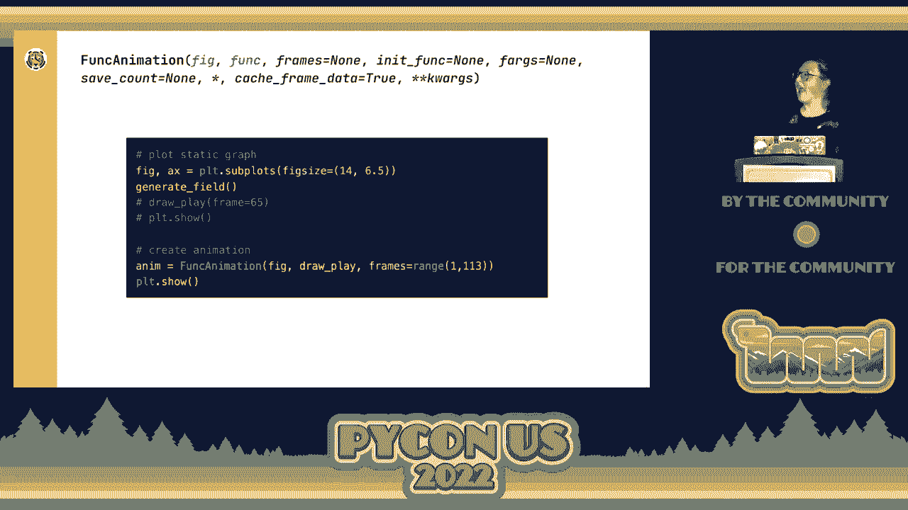
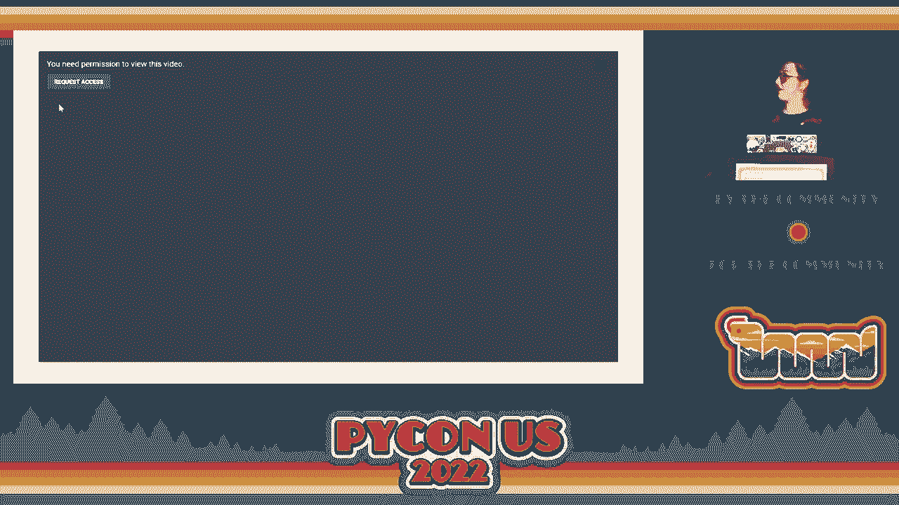
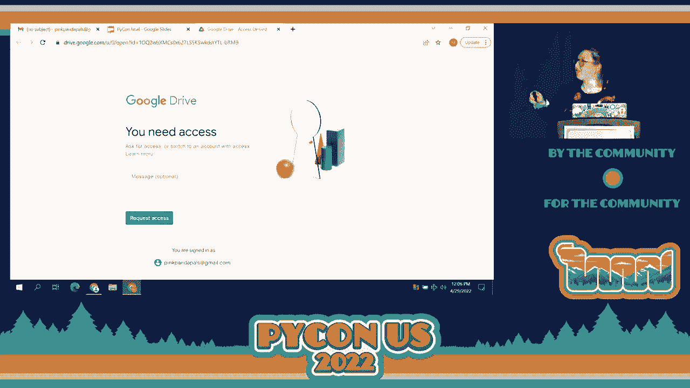
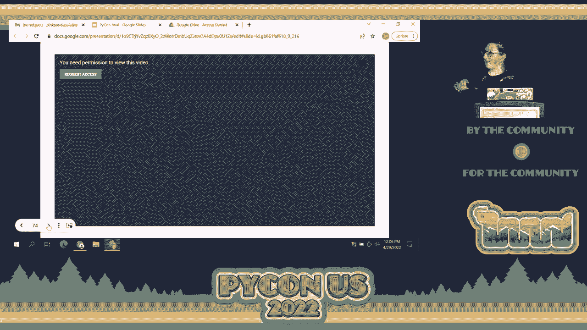

# P58：Talk - Miranda Auhl_ Animating NFL play by play data using matplotlib's FuncAnim - VikingDen7 - BV1f8411Y7cP

 All right。 I think we're finally ready to start。 Sorry for the bit of a wait， but hopefully。

 we're good to go。 All right。 Let's give Miranda a round of applause， please。 Thank you。

 Hello everyone。 I hope that you were having a wonderful day so far。 I am super excited to。

 be here today。 This is actually my first time speaking at a large conference。 So， whoo-hoo。 Yeah。

 Thanks for the enthusiasm。 Whoo。 Today we're going to be looking at。

 animating with funk animation specifically， which is a matte plot lib class。 So。

 a quick intro on myself。 I had a wonderful introduction already， but my name is Miranda， All。

 I'm a developer advocate at timescale， which timescale is a time series database， built on Postgres。

 So that's kind of where I'm coming from。 And then I included my GitHub。

 first because I will be showing some code snippets in the talk today， but I won't be。

 going into super detail。 So， if you want to make sure that you can see all the detail。

 that you want in the Python script that I'm going to be walking through today， you can。

 access it through my GitHub account。 So don't worry if you skip something now。 You can look。

 at it later or ask me questions also。 And I'll have a link to the exact repository at the。

 end of the talk as well。 And then that's just my email and also my Twitter handle。 So feel。

 free to reach out at any time。 So， I want to take you on a journey and unfortunately not。

 a hobbit's journey because that would be awesome。 But my journey from taking a static。

 graph and transforming it into a data animation。 And on this journey， we're going to walk through。

 this is kind of like the setup and the path that we're going to be following。 So first。

 right before we can really visualize any data， we have to understand the data and actually。

 grab the data。 You know， important。 Then we'll look at actually creating a static visualization。

 And then the last thing that we'll look at is actually transforming that static visualization。

 into a data animation。 So we start off as you probably could expect from the name of this， talk。

 We're starting off with NFL and NFL data。 So in 2015， the NFL did something really interesting。

 They started requiring that every stadium have RFID receivers and that every player。

 have RFID tags in the ball as well。 Actually have RFID tags that track every tenth of a。

 second all their movement， speed， acceleration， all this stuff。 So as you can imagine， we have。

 from 2015 to now， the NFL tracking， speed， acceleration， all this stuff every tenth of。

 second for every player for every single game。 That is the lot of really cool time series， data。

 And what's amazing and blew our minds at time scale was that the NFL actually gave。

 access to people to access this data for free。 In the same， like I could not believe that。

 the NFL released free data for anyone to analyze。 All you needed to do is have a casual account。

 So starting 2020， the NFL started these big data ball competitions where they released。

 a subset of this awesome time series tracking data。 And you could download it， download the。

 CFPs and analyze it。 And specifically in the 2021 big data ball competition， they released。

 a bunch of the tenth of a second tracking data available and with kind of a bend towards。

 passing plays specifically。 But it's still， you know， they can't release of course all。

 the data because， you know， they don't want to release everything to the public。 But they。

 did release a huge portion。 And so when my team and I found out about this， we were like， whoa。

 with great time series data comes great responsibility to analyze it。 That's how the， saying goes。

 right？ Well， we're just going to roll with it and say that that's how it， goes now。 So all analysis。

 right， we saw that data， we knew that we wanted to analyze it。

 So the first step is actually getting to know the data， right？ And so this is one table that。

 you can access through the 2021 big data ball competition。 So this is the tracking table。

 which is tracking that tenth of a second kind of IoT readings basically of the players， in the ball。

 And this is actually a subset of the columns that you have access to in that， competition。

 So we see that there's a lot of data here。 And first I want to start off。

 by just going through each column and just kind of like helping everyone to get to know。

 the data a little bit。 So first off we have time， which is a timestamp column。 And we see。

 that it is incrementing an a tenth of a second time like stamp。 So first we see that we have， 14。

599， essentially 14。6 in kind of the far left end of the timestamp or the right， excuse， me。

 And then the next timestamp is 14。7。 So we're getting tenth of a second readings， in this data。

 So it's really granular。 That's super fun。 That means that we could， there's。

 a lot of possibility for how you can analyze this data and aggregate it and stuff。 And also。

 notice that we have a bunch of repeated rows for each timestamp。 And that's because right， the NFL。

 they put RFID tags on all the players and the ball。 So each player and the ball is。

 going to be taking in a reading for every tenth of a second。 Now in this case， since again。

 the NFL can't release all of the data to us。 They did though release for this data set all。

 the most important players for a specific passing play and the ball for tenth of a second。 So。

 that's why you see 14 rows here。 So that's 13 of those are going to be players， one of。

 which is going to be the ball。 So cool beans。 Next up we have X and Y。 X and Y are columns。

 that represent X and Y coordinates on a coordinate plane。 The NFL set up the field， the football。

 field。 So that they could take in basically as an X， Y coordinate plane so that you could。

 find out the location of any player or the ball at any moment in time during any of these， games。

 Pretty sweet， right？ And so that's really what these X， Y coordinates are。 It's， yards。

 it's in yards。 It's saying exactly where that individual or the ball is at any， given time。

 So then next we have speed which the S is representing the speed of the individual。

 at that moment in time。 Then we have acceleration is what the A stands for。 Game ID which is a。

 unique identifier for each game。 Gotta know which one is which， you know， good to know。

 And then this play ID is talking， specifying since this data is kind of bent on just showing。

 passing plays。 This play ID is a unique identifier for us to know within a game a specific passing。

 play。 So that's what that play ID is。 And then this last column is kind of important。

 And what we're gonna dig into a little bit more in today's talk， but it's this frame。

 And kind of at first glance， you know， it's not super clear what it is。 Essentially this。

 frame column is taking every tenth of a second and mapping it to an integer value。 And it， also。

 it's not only just mapping it to an integer value， but it's mapping it to an integer value。

 that's increasing continuously with time。 So as you see right， the 14。599， tenth of a second。

 is mapped to a frame value of one。 And the 14。7 second， tenth of a second is mapped to。

 a frame value of two。 So we see that as time is increasing， that frame value is increasing。

 And another note that when we looked at this data more is that for every play ID， it will。

 count every tenth of a second and map each tenth of the second to the frame。 But then as。

 soon as you hit a new play value， so like if we were to go to 76， the frame value would。

 kind of restart at one。 So essentially we know from this that that 14。599， tenth of a second。

 was the first tenth of a second to occur in the 75th play。 And then you know the 14。7。

 was the second tenth of a second to occur in the 75th play。 So these frame IDs are unique。

 to the play。 Alright， so we get to know our data。 Now right， we can get to the fun stuff。

 We can actually analyze it。 We can create visualizations。 And so one of the visualizations。

 that I wanted to know was， well， we have these x， y coordinates。 Let's actually plot these。

 players on a field， right？ That seems kind of fun。 And we have the information。 Let's， do it。

 So I created a script and I set up my Python script kind of with an argument because。

 I wanted to focus on one play at a time。 And so I defined the game ID that I wanted to look。

 at and then the play ID that I wanted to kind of zoom in on and graph the data from。 So I。

 defined that。 And then I also pull in my data from my time scale DB database。 So I'm pulling。

 that data in my Python script for this specific play。 So then I can really dig in more and。

 analyze it。 So then I have data in my Python script。 What's next？ Well， if I'm going to。

 plot players on a field， I'm going to need a field。 So what I did was that I created a。

 generate field function， which I could just call that and get this awesome field。 So I。

 made it so that I kind of like smush all of my matplotlib functions into one kind of。

 wrap them all up into one function so that I can call that generate field and get you。

 know the yard lines and the hash marks and all this good stuff。 So then， right， we have。

 a field but now we need to actually plot the players。 So I created another function。 I。

 created a draw play function。 And this draw play function takes in a value of a frame。

 So it takes in a frame argument and it's going to draw a play kind of plot in a play from。

 that frame。 So with the frame value， it represents right a moment in time。 So I can put in a moment。

 of time and get this plot plotted。 So with this function， I made it so that I plot， oh。

 this is just， you know， showing us the frame value。 So with this plotting function， I take。

 in that frame value and then I can actually plot the players。 I created a legend and I。

 also get a title。 So， all right。 So now in order to actually create the function and plot it。

 on a graph， I made it so that I can just call these four lines of code and get， you know。

 this static plot that I wanted。 And so the first line is a figure。 So I'm creating a。

 matplotlib figure。 Second line is I generate the field so I produce the field on the figure。

 Third line is that I'm calling the draw play function for a frame ID value of 65。 And then。

 the last line is plot show that actually shows us the plot in， you know， so that we can see， it。

 So this is the 75th， 10th of a second for this specific play that I'm kind of digging。

 into for this script。 And so， you know， we see we have home team， away team， we have the。

 football and like， you know， this is pretty cool。 You know， this is an interesting graph。

 I can see that like， I see the players on the field， but like， you know， is the ball being。

 passed right now？ It seems to be kind of floating in air。 No one's really attached to it。 So。

 really， this static plot， I was like， it's not really doing it for me。 And so， I asked。

 the question， well， what if I could animate it and actually not only just animate the。

 players movements as they were going through this play， but also see historically where。

 they went as they went through the play。 And this is really where funk animation comes， into play。

 And so， but in order to understand how to use funk animation， I really feel that。

 you have to understand how animations work in general because they play， they tie directly。

 together。 So， let's consider a flip book。 So a flip book is， you know， traditionally。

 it's usually a set of static drawings that you flip through really fast to kind of give。

 this illusion of motion。 And so， that is exactly， I actually created a digital flip book with。

 my iPad。 And so， I drew a bunch of static images of this pink ball。 Okay。 Each one is。

 just a static image， you know， cool beans。 I get this static image。 Awesome。 Well， what's。

 super cool is that when you play these static images one after the other in like， in sequence。

 you get an animation。 Right。 You take these static images， you string them together， and。

 you get an animation。 And that， folks， is exactly how funk animation works。 It's basically。

 a fancy digital flip book。 So， how funk animation， how the process works is that funk animation。

 takes a static graphing function and it iterates over that function again and again。 So it。

 produces， you know， the static graphing function produces a graph。 So funk animation iterates。

 over that and it's creating all these static graphs which it then kind of puts all together。

 plays one after another to create an animation。 So， if we're going to use funk animation in。

 our code， we got to understand how to use it， right？ So， here， I took this from the matplot。

 lib documentation and this is a just like all the arguments that we would need if we were。

 going to use funk animation。 And I highlighted the two necessary requirements that you have。

 to include when using funk animation。 So， the first one is fig。 Fig requires a figure， matplot。

 figure object that it can kind of produce this animation on。 And then funk represents。

 a plotting function that matplot， or that funk animation can actually iterate on to create。

 all those static graphs which it will then， you know， mesh kind of weave all together。 Hopefully。

 at this point， you're like， wait a minute。 I think we have that。 I think we。

 have these exact two things and we do， in fact， by setting up the static graph like this。

 we create a figure that's the first line of code that we do。 Cool。 We got the first requirement。

 Awesome。 And then the third line of calls the drawplay function。 And we know that drawplay。

 function is， in fact， an iterable function。 And that is because of the frame。 This frame。

 is directly tied to time。 So， as we iterate over this frame value， you know， we're going， you know。

 one， two， three， through these integer frame values， right， we're actually iterating， over time。

 We're looking at the first tenth of the second， the second tenth of the second。

 and continually on and on and on。 So， when we iterate over this frame， we're actually iterating。

 over time。 And that's exactly what we want to plot， right？ We want to plot the players'。

 movements on this field over time。 And so， we have the two requirements。 Well， now the。

 next question is， can I just， you know， throw it into the function and function and we're， good？

 And the answer is basically yes。 But we need to do just a few quick adjustments。

 to make sure that it works。 So， one thing is that if we were to animate our drawplay function。

 as it is right now where I， you know， plot the figures on the field， create the legend。

 create the title， we would get something like this。 Not ideal， right？ This is not exactly。

 what we want。 So， like， the players' movements， that's good， right？ I want to see how the players。

 are moving over time and I want to keep their historical movement in view。 But this legend。

 is a problem。 And so， that takes me to wanting to talk about these two types of functions。

 that you can use when you create your iterative function that you're going to insert into。

 Funk animation。 And that is plotting functions， plotting function types versus setting function。

 types。 So， plotting function types， I highlighted the three functions that I call， the three。

 types of functions that I call my iterative function， my drawplay function。 And this plot。

 function that we're going to look at first， that is truly a plotting function。 It's additive。

 Because the animation is continuing， it's adding plots to the animation。 So， every time draw。

 play is called， this plot function is going to add a new plot to the animation。 It's additive。 So。

 that's what plotting functions are additive， okay？ Saying that a lot。 My apologies。 Just。

 remember it now， forever。 So， then the next function that we're going to look at is set， title。

 This function is a setting function。 It's going to replace。 So， plotting function。

 add when you animate， setting functions replace when you animate。 And so， this， the title， you know。

 it's not really causing a problem。 Probably， you know， every time draw play， is called。

 it's setting the title。 So， maybe for efficiency sake， we might want to move， it out。

 But I'm just going to leave it there for now because it's not causing tons of， issues。

 But the legend， the last function， this is a problem， right？ This is actually。

 acting as a plotting function， right？ Because it's adding a legend every single time the。

 draw play function is called。 So， this is a problem， easiest way。 We remove it。 And we。

 move it to the generate field function， which only goes once。 So， that just makes it easy。

 It's an easy way， quick fix to remove that plotting function。 That is doing what we don't。

 want it to do。 So， then the next caveat you want to make sure is that whenever you create。

 your iterative function， the value that you iterate over or the argument that you iterate。

 over has to be the first argument specified in the definition。 So， for draw play， right？

 It doesn't matter。 We have only one argument value。 But say that I had two other arguments。

 in my iterative function， I need to make sure to call frame first and then all the other。

 arguments after。 So， that's just something that Funke animation really looks for。 It。

 will not work if you don't put that iterative argument first。 Okay。 So， now we can actually。

 create our animation。 We can transform that static graph into an animation。 So， here。

 is static graph Python code。 And we have Funke animation at the top of definition just for。

 reference。 So， first off， we need to actually insert Funke animation into our code。 Cool， means。

 We put it in。 The thing is that Funke animation， it needs to store the animation， into a variable。

 And so， in this case， I called my variable anim represents animation。

 And then it's just one of the requirements with Funke animation。 It has to have somewhere。

 to store the animation。 So， you create that variable。 Next， you have the two required arguments。 So。

 first， we have fig。 We throw our fig in there and then draw play which is the iterative， function。

 That's the next required argument。 And we just call the name。 You don't add， any of the arguments。

 You just call the name of the function and you throw it in there。 And then， lastly。

 I wanted to also -- oh， sorry， I didn't -- Michael's there。 I also。

 wanted to specify the frames that Funke animation is going to iterate over。 By default， Funke。

 animation will iterate starting at an integer value of zero。 And it's going to iterate over。

 integer value。 So， it goes zero， one， two， you know， on， so on and so forth。 In our case， right。

 we like the integer value。 We want to iterate over an integer value。 But we want。

 it to start at one and iterate over the integer values。 So， we can actually specify the exact。

 range of values we want for animation to iterate on。 And in this case， right， I want values。

 starting at one， you know， going at -- increasing by one。 And then this one 13 is just the max。

 value for the frame for this specific play。 So， I just put bounds around all the frame， values。 So。

 that's where I get that one from because we're starting at one。 And it goes， all the way to one 13。

 And then friends， well， now we can actually comment out the draw。

 play frame function that we call up there and the plot show there for the static graph。

 We can comment that out。 And now put plot show underneath our animation。 And -- oh， it doesn't。

 get -- okay， that's okay。 Because I have another graph here。 That's okay。 I have a -- I have。

 a -- a GIF of it。 So， not a problem。 Technical issues， folks。 Gotta love it。 Okay。 And I。

 think I can go to the next slide。 You can just -- yeah。 Okay。 So， this is -- this is an。

 added animation that I -- that I was hopefully going to show after the first animation。 But。

 what's cool is that I took this static plot and so you can ignore the jersey numbers。

 Those are jersey numbers that I added。 And， right， this is far more interesting。 Now。

 we can actually see how this play -- you know， we're not getting a snapshot of just seeing。

 you know， the ball floating in space。 Now we actually see the past being thrown。 This。

 person is like just about to score touch on and actually does。 This is super fun and way。

 more engaging。 And what's cool is that once you have an animation like this， you can add。

 to it like I did here。 So， in this case， I used a setting function， a setting type function。

 to add the jersey numbers for each individual so that we know who's， you know， getting past。

 what or who's， you know， tackling， whoever。 And I also added some statistics tables。 And。

 you could even add statistics to the individuals if you want on the graph。 The possibilities。

 are endless。 So how can you use animation？ Well， as long as you have a figure， you have。

 a matplotlib figure， ooh， and an iterable plotting function， then you can animate it。

 That's really all you need。 And especially if you have kind of set yourself up with avoiding。

 kind of the plotting setting type functions and also making sure that that iterable frame。

 value is the first， like you can animate it。 And I hope that you feel encouraged to actually。

 try this out in your static plots at home。 And so， folks， that's it。 That's pretty much， it。

 Here are some resources。 So this first link is a link to my GitHub project。 I include。

 all of the slides and also the Python script that I ran through here。 It's the full script。

 So you get all the code that I didn't hear。 The second is the CAGG competition link for。

 the 2021 CAGGLE competition。 So you can download the data yourself。 All you need is a CAGGLE。

 account。 And then the third and fourth links are actually the first one is a tutorial that。

 my team made to help you basically walk you through ingesting the data from CAGGLE， putting。

 it into a time scale BB database， which is basically Postgres。 And then， oh， that's my。

 train of thought。 And then actually analyzing it。 And then the last is just a blog post kind。

 of diving into other analytics that you could try out。 So that is it。 Happy coding friends。

 Thank you so much for being so patient with all of these technical issues。 And I hope that。

 you have a wonderful rest of your day。 Yes。 Thank you。 If anyone wants stickers from time， scale。

 come see me or if you have questions。 Also come see me。 So thank you。

 (applause)。