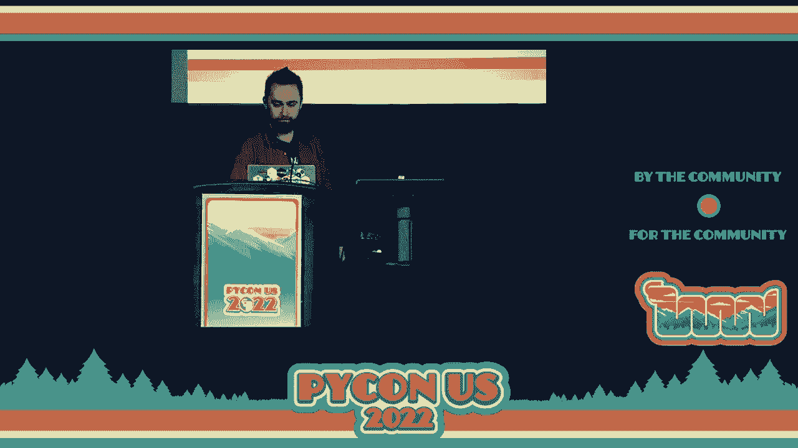

# P6：Keynote - Łukasz Langa - VikingDen7 - BV1f8411Y7cP

 And now I want to welcome Uka Shlanga， our CPython developer in residence， and our first。

 keynote speaker。 Let's give him a warm welcome。 Hi there。 This is easily the biggest crowd I've ever spoken to。

 So I'm a little nervous。 My name is Uka Shlanga， I come from the internet。 You can find me in all sorts of places online。 But I've been coming to Python for a while now。 and I will be here for the entire event， so I'm happy to answer any questions you might have about any subject。 I like Python， so we can talk about Python。 I also like Robert Maynard Persig's Zen and the art of motorcycle maintenance。

 That's a pictogram from the cover of the book。 First read it some ten years ago。 and it massively influenced me。 It's like some meditation about technology that also is connecting it to how people perceive。 art。 It talks a lot about Quality， and it never really left me since。 I just reread it this month。 and it totally holds up。 So I highly recommend you looking it up if you haven't read it yet。

 And in fact， we're going to be talking about Quality here too， but it's going to be maybe。 a little bit of a mundane kind of Quality， because we're going to be talking about type。 of notations。 The annotations are here to stay。 They've been first added to Python 3。5。 and ever since there's been a number of peps， that made them easier to use and made them more powerful to express more complex and。

 complex types。 So if you haven't ever annotated any application yet。 you're likely to be in for a treat soon。 And if you did， you might have some experiences with it。 Some of us have been annotating Python programs for quite a while now。 And with this experience。 we have kind of devised some best practices on how to do this， how to write code。

 so that it doesn't really fight the type checker。 And this is what we're going to be talking about today。 And also about some， what we consider， anti-patterns where what you're trying to do works against。 what the type checker will want from you。 And finally。 we'll cover some limitations of static typing compared to what the runtime。

 Python allows you to do and whether they're a ball and chain or more of something that。 you should be really kind of grateful to have。 So why do we even have type annotations in the first place？

 Looking at this very simple code example that pretty much reads like English， we can see。 that it's a process all function， accepting one argument， which is items。 And for each of those items， it will find a children attribute on them and call a process。 method easy。 But even in such a small example， there might be a lot of complexity and questions hiding。

 In this particular case， what is items？ We don't really know。 In Python， items。 maybe there are pairs， inductionaries， key value pairs。 But here we know that this is not the case because those don't have a children attribute。 So it's something else。 How do we find out if there's no doc string。

 we need to grep through our code base to， find out。 But finding items in a big code base。 not very easy。 So how about looking for the children attribute？ Again， not very easy。 How about we grep for a process method in all likelihood you're going to have more than， one。 So you need some form of documentation。 And you need it if you're using powerful features of Python like its dynamicism as well。

 Because in this case， we have some proxy that has instances which are callable， just like。 functions。 And from the signature here， you see that you can call it with any arguments。 Anything goes。 It's all good。 Is it-- experience shows that there is only one-- or a few cases where it makes sense to。 call this proxy with some set of arguments。 So what are they？ Well。

 either we need to read the body of the function or we're lucky enough to have some。 documentation which is either in a doc string or provided in some Sphinx docs on the side。 But I would argue that type annotations are a wonderful form of documentation which works。 for you because it will both allow people on board it to a new code base to be productive， quicker。

 But it also will allow you yourself to remember what you thought about the function you were。 writing six months or six years back。 It helps with review。 It helps with debugging but also it's machine readable。 Thanks to a type checker。 we can validate assumptions about code that you're writing。

 right now and keep validating those assumptions into the future。 So if you change a function which is very likely to happen， we modify our software， we。 keep maintaining it。 The type checker might still be checking whether the API stays sane。 So I could finish right now and we could just go to the coffee break sooner because I hope。

 I convinced you it's all good。 But what if your type annotations look something more like this？

 This is a screenshot taken by Ned Batchelder and posted on Twitter last year by him。 He said。 "I'm looking through this Python documentation and like， what is this？ Is this the future？

 Are we supposed to be able to read this？"， My response at the time was like， "Ah， yeah， no。 Obviously even the biggest fan of typing will tell you that this is not optimal。 This is not what we want。"， Fortunately， there is plenty of ways in which even without bothering Python developers。 we， can improve the situation so we can make this more readable。

 So I responded on the Twitter thread but people started piling on with their own favorite。 examples where like， "Ah， how about this example？ How about this？"。 And I came to the conclusion that sometimes ugly type annotations hint at ugly code。 It's a controversial thing to say， maybe insulin， but if you're not at least a little bit controversial。

 doing a keynote， then how are you living your life？ It needs to be memorable。 But also I'm pretty serious。 Like type annotations don't create additional complexity。 They expose complexity that was always there。 And hold on， hold on。 I understand that eight-year-olds who first double with programming thanks to Python don't。

 necessarily need to know all this and it's wonderful that Python allows that。 I understand we have even in the audience plenty of professionals who wouldn't otherwise call。 themselves programmers but they're enabled by Python to be productive in their respective， fields。 So I understand all this。 However， with experience you're going to be handling increasing amounts of complexity。

 Your five-line long snippets will become 50-line long scripts and then 500 lines long。 And soon enough you're going to be looking at half a million lines of code that you're， maintaining。 And with that increased complexity your understanding of what's going on has to increase as well。 Otherwise you're going to end up with a big ball of mud that is not really maintainable。

 and its behavior cannot be easily reasoned about。 So let's talk about how we can structure our code such that it actually makes type annotations。 less ugly。 First let's actually solve this case that Ned Batchelders showed us because it's particularly。

 egregious。 And luckily we can do this with only a few simple things。 First of all。 please use modern typing syntax。 We are working on Python 3。11 right now。 Python 3。10 was released in October and Python 3。9 will see its final bug fix released just。 two weeks from now。 What that means is there is little excuse not using Python 3。9 right now。

 It's unstable Debian。 Come on。 So using modern typing syntax in Python 3。9 allows you to use built in types as generic， collections which is tremendously useful。 And in Python 3。10 you can use the pipe operator for unions which combined make for really。 terse but readable syntax that expresses even pretty complex types。 Let's see an example。

 We have a match argument to some function which can be either a string or a regular expression。 pattern or a none。 This is how you express it。 And the only piece of complexity here is that it's a regular expression of string because。 it could be an irregular expression of bytes。 So I hope that even if this is the first time you're seeing type annotations in this form。 you can kind of see why it's read like this。 But after a while it becomes second nature just looking at those types you know they are。

 Let's look at a more complex example where we don't want an object of a type we want。 to be past a class。 So in this case we would say we expect some type to be given to us。 Type of E not E itself not an instance of an object a class or we want many of those classes。 in a tuple。 So we either accept a type of E or a tuple of many of those types。

 And with those two examples combined we end up with a much more readable piece of documentation。 that is an equivalent of what we've seen before。 We can really read what it does right now which is a context manager that responds to a raised。 exception and you need to specify what you expect to be raised。 Either one type of an exception or multiple in a tuple。

 And you can optionally say that we should be matching some piece of message in this context。 manager。 So it's either a string or a pattern of a string。 If we don't specify anything the default value is none。 Done okay we understand what is going on right now。

 The context manager actually returns a raised context that is dependent on the type of the。 exception that we gave it。 Okay so cool。 But I kind of you know helped it be more readable by changing formatting here a bit。 And it's maybe a mundane thing to say right now but I do believe that standardizing signature。 formatting has a lot of impact on how readable annotations later are。

 Because some pre-existing conventions on how to format them don't really gel well with annotations。 especially the ones that try to hang subsequent arguments under the opening parenthesis。 It ends up looking something like this。 It's very small I don't expect you to be able to read what is there。 I don't even expect you to be able to say how many arguments this function accepts。

 It's not very nice and there's little space for the return annotation as well。 So how do you fix it？

 Well I have one simple suggestion。 It's black in that shit you know。 I'll do it for you。 I'll do it automatically。 This will allow you to increase the font size over twice。 Now we can actually see what's going on。 We can see the name of the function and that it accepts three arguments。 Cool and there's plenty of space for the return annotation which is a dictionary of strings。

 to a set of strings。 But I'm not particularly happy about this annotation because what are those strings？

 Remember type annotations are human readable documentation。 They're meant for humans first。 So my suggestion to you is to give those types meaningful names。 It doesn't matter to the type checker and it matters even less to runtime Python which。 doesn't do much with type annotations。 But it matters a lot to a human。 Let's see an example。

 If we have a show lyrics function that takes some query list of string and takes some lyrics。 database which is a dictionary of string to another dictionary of string to string。 This is everything that a type checker needs。 But I don't quite understand what's going on here。 So let us help ourselves by giving names to all those strings。

 For example looking at the inner dictionary we can say that the keys are song names and。 the values are lyrics。 Now the mystery of the inner dictionary song so we can even give that entire dictionary。 a name song to lyrics and the annotation magically becomes less verbose。 We can do this with the external dictionary too saying the keys here are actually artist， names。

 So now with all of those annotations we have a much shorter function signature and also。 we can reuse those human readable names in other functions。 You can expect that if we are being passed a lyrics database in one function there must。 be some other function that produces it and there might be others that filter them， mutate。

 them or what not。 So we're using the same annotations that communicate to humans what those things are tremendously。 useful， highly recommended。 So now we are moving from visual things from simple modifications to more of like code refactoring。 area。 So we're going to be making increasing changes to this but this is all still about human understanding。 of the code at hand。 So for example I would argue that you should be making your functions small and simple and。

 to dispatch early to specialize the tractors of typing love to give you examples where。 they would use some super dynamic function the found in Python say the max built in and。 they will say hey try to type that and see what happens。 Well of course this isn't even a built in that has one signature it's got two and those。

 are plenty dynamic here as well and they allow for some funky stuff like the a terrible。 in the first form doesn't have to have the same types as the optional default value and。 the arguments given in the second form might be of incompatible types too like it's it's。 all good you can all do this and it will work magically in Python and are you using functions。

 like these of course you are this is the core of Python the vocabulary that we have that。 doesn't matter what kinds of data you're putting in the same verbs apply so it's wonderful to。 have this in Python but when was the last time you actually constructed a function that was。 this dynamic I would argue that if you're raising your hand right now which I can already。

 see like you're an author of some library or framework that needs this sort of dynamic。ism and gospel to yes that in this case static typing will be a little verbose but for everybody。 else for end user code it's very unlikely for you to have to deal with this sort of。 dynamicism so let's just put things in perspective well if you do then you will look inside the。

 implementation of a function like this because the documentation doesn't tell you that if。 you're implementing something that is tremendously dynamic the implementation tends to look sort。 of like this there's some dispatch there there's 20 lines here dealing with one form and 10 lines。 there dealing with another form it's not the kind of function that you love to read it's hard to。

 test it thoroughly right now you can talk about cyclomatic complexity whether you covered。 actually all paths that are possible the max built-in is wonderful but Python is powerful also due to。 its maturity like all the edge cases were already ironed out you can pretty much you know use it。 without fear that some edge case was not covered with functions that you're writing yourself how。

 lucky is it that there is going to be some edge case that slips in well there might be a case like。 that so I would recommend you dispatch early replace the implementations with smaller functions。 that only respond to a subset of what's going on this allows usually for shorter function signatures。 of those sub functions let's call them that the external one will still have a horrible big function。

 signature with long type annotations but it is what it is life looks like that like that but。 why splitting the function into many sub functions allow us to now see the birds I view of what's going。 on and for example to identify the bug that was on the screen all along which is that we accept a。 boolean as the function signature tells us but boolean happen to be integers so maybe we don't。

 actually want to parse it as an integer which we are here because this is the ordering in which the。 if's an ellipse go so by splitting the functions it's more likely for you during testing to identify。 this problem and you know you can assert maybe that as parse and does not want to get boolean because。 they're not exactly what we want to deal with and if you look at the function signature of the sub。

 function it becomes pretty much trivial one argument which is only an end we return an item done right。 but I don't want you to only write trivial functions like this like this is no way to live and the。 robustness principle tells us that we should be flexible in what we accept and strict with what we。 emit when we're talking about functions that first part applies to the arguments of the function。

 and the other applies to what we return from the function let me give you an example from the black。 code base we're looking for configuration so we have a bunch of candidates for paths where。 configuration might hide and then we're going to be returning a path to a configuration file if we。 find it or none if we don't well do we need this argument to be a tuple maybe it's not really that。

 important for it to be exactly a tuple all we're doing here is iterating over it so maybe saying。 just give me an iterable is a better idea because now the color of this function is able to provide。 you a list that they already produced so they don't have to convert anything they can just pass this。 data right there maybe they have a set and maybe that's also fine so this is what we mean about being。

 flexible and what we accept well we're strict in what we emit and are we here not really because we。 either give you a path or give you none and this is not perfect because it forces the color of the。 function to always check what is it that they received is it none sometimes people will forget。 to check sometimes they will just pass this responsibility on to further functions making。

 non proliferate in your code base which isn't something that you particularly want so how do you。 solve this well you can in fact use exceptions for exceptional states it's what python wants you to。 do in this particular case you can use a lookup error one of my favorite built-in exception types。 index error and key error both inherit from it but it's also useful for our wide array of cases like。

 this where we're finding something and failing so yes you should be using exceptions for exceptional。 states but there's another thing that you can do without having to modify types there so you can。 use empty values this is especially natural when you're dealing with collections for example if you。 have a function that lists all the users that are currently logged into our application it's perfectly。

 reasonable to return an empty list if no user happens to be logged in to your application at this。 point but this makes also sense depending on context to do for scalers so python does allow for。 full c values when we're talking about numbers and it allows for four c numbers a full c values。 with bullions and empty strings and so on sometimes that's dangerous so what you want is actually an。

 exception to inform the color that you know we actually fail to find something and the default。 value would hide this fact but if you ever used a default dict you know that there's plenty of。 cases where an empty value makes perfect sense none is a particular special example where returning。 it from a function is annoying but it's not the only one in fact any kind of type union that you're。

 returning from your function is going to be hurting your users because they will be forced to check。 which one did I get and if they do this and they write some if lf chain and you later change your。 function we already talked about bullions being ints but this only stands in any form of sub-classing。 code that looks like it works might not actually do what you want so I always recommend avoiding。

 returning unions from functions as much as you can help it so coming back to this robustness。 principle when we say that we want to be flexible in what we accept and strict in what we return。 what we're really saying is that we want to be vague in what we accept and concrete in what we。 return what I mean by this is that in the arguments here we accept a collection we don't really care。

 what it is you might give me a set you might give me a dictionary you might give me whatever else。 we only need a collection but when we are returning our list of items we should say that to the user。 not an iterable not a sequence let's tell them what they received by telling them exactly what。 they're getting they can now utilize append methods they can rely on the order of the things that。

 they got and so on and so on so that's pretty much the robustness principle in hindsight right like。 in I don't know like high level but sometimes it's not really that easy to be you know truthful to。 the dot typing like make it overly verbose or it might actually be not helpful because you're。 gonna be spending a lot of time only to end up with something that's more brittle than what you。

 wanted let me give you two examples of this so the first example is another piece of code from black。 where we split a single line into many lines and we're generating it because we're efficient so we're。 yielding those lines what that is is a generator that generator generates lines it does not accept。 anything being sent to it so none and it does not emit anything on stop iteration so another none。

 but I'm not really super happy with this annotation because it is super verbose so instead what I end。 up using is to say I'm returning an iterator of line is that more vague yes a little but what can。 you do with a generator that does not accept anything being sent to it and it doesn't do anything special。 on stop iteration well you can pretty much only iterate over it so it's pretty truthful to what。

 you're wanting and it's also a much simpler annotation to be reading the opposite example would be。 in arguments where you're accepting a file argument an open file but you're looking at the body of。 your function and you're like I'm not really using the entire api of file I'm only using the small。 slice so maybe any file like object will be great you know and how do you annotate that well either。

 you look at your application and see what are the possibilities of types that I could put there and。 there's gonna be some big union of those types or you can use structural typing so protocols and。 actually define what methods and attributes you want people to be to have to implement to。 conform to your file like object or you can just say any which is essentially shutting the type。

 checker up saying you know I'm gonna be doing weird things here please don't raise type errors。 so you can do those three things and I used to be in the camp that actually specified everything。 to the dot so that you know we sliced the contract as thinly as possible but I grew to stop doing that。 now when I need a file I'll tell you exactly that please just give me IO of text and we're good。

 why because of my previous experiences as a beginner core developer back in 2010 I was making。 config parser a little better and I deprecated a function that had multiple issues with it with。 a better function of course read file and I didn't want to have any duplicate application of the。 implementation so I remade the read FP the procaded function to actually use the new one internally。

 the argument we accept here FP is an open file so it wasn't really a problem to me that before we。 were calling read line on this open file but now we were iterating over that new in that new。 implementation so obviously it was not a problem for me but it was for other people who were passing。 file like objects to this function and that stopped working so I had to put this piece of。

 documentation that's still there now to shame me forever that I haven't really foreseen this problem。 but you know and if you have to rationalize your mistakes later in life because you know。 otherwise you're gonna just be a sad sad person with plenty of regrets so I tried to realize that。 you know maybe when I wanted a file and the documentation never said anything else that。

 please give me an open file me changing my requirements as to which part of that file I want to use。 isn't really that unreasonable so if you spend your time cutting your contract really neatly。 to expose only the minimum of what you want that's perfect that's great but in the future you might。 actually want a little more for example if your function accepts a file like object but later on。

 you realize that you want to log an error case and actually tell people the path to you know where。 stuff gets wrong now you have to use the dot name attribute on a file like object and you might have。 not required this before this is not awesome because existing code especially on papi if this is open。 source might give you a lot of grief so in the end I tend to simplify and just you know be concrete。

 about the types that I expect people to be able to put even if something more will be in fact。 accepted at runtime I want to be concrete because it's my contract from me to you from programmer。 to a programmer so now let's talk about the mismatch between static typing and what python allows us。 to do at runtime because it allows for a lot so you can perceive some of the limitations of static。

 typing as like seat belts you just put them on you don't even you know think about it or you might。 think about those limitations more like the masks that you're wearing you know a sad sad reality。 that we're in but you know you'd rather not so let's see let's start with a simple thing one variable。 one type python will not complain if you reassign a given name to mean something entirely different。

 to have a different type to have a totally incompatible value later on it's all good you know in terms of。 how runtime perceives this a type checker will be annoyed at you if you do this so now the question。 is who's right well obviously python at runtime is right it will run your code fine but do you need。 this form of dynamism all the time if you even have a very simple example that is a little jarring。

 because your function signature tells you that argument is one thing whereas after this conversion。 to daytime it is suddenly something else no grade especially when this conversion doesn't happen。 right there online one but happens online 20 of this function where it happens only in some。 conditional or better yet if this is in an object and under in it creates a bunch of attributes of。

 one type but then some other method modifies them to mean something else it is very confusing very。 quickly and it's hard to say whether this was the intent of the programmer so static typing。 errors on the side of caution saying you know this used to be a string and now you're trying。 to make it a datum are you sure the solution here is obvious and we should just move on just。

 use another name right like i know that there's implementers of python interpreters in the room。 so they will say hey but like they're not exactly free but for our intent and purpose here they're。 pretty much are like just adding just one more name is not going to destroy the world in fact。 it's useful because if you ever debug this function and you list its locals now you will be able to。

 see the value pre-conversion and post-conversion so if the bug is actually in the convert to daytime。 function it will be easier for you to identify this faster for you to identify this。 this all comes down to the difference between duck typing so structural typing and nominal typing。 so us telling that this is an int this is a string this is a list of string this difference is highlighted。

 sometimes you know when people talk about type annotations but for me personally they aren't。 actually that different so it is true entirely that when we are running python code unless you're。 running its instance or its subclass python doesn't care about the types all it cares about is if you。 have an object and you look up some attribute on it that it finds this attribute or if you're。

 calling a method on an object it finds that method and its signature is compatible with whatever。 arguments were given during the call as long as that's fine it doesn't care right if it quacks like a。 duck it's a duck like as much as we care nominal sub-typing means that in-function signatures。 in fun in type annotations we don't really specify what we're going to be using we're saying what。

 this thing should be what it is so we need an integer we need a decimal we need a string we need。 a path object this sort of thing but if you look at a program even at a at a big one there's always。 only a finite set of which objects actually conform to the operations that you're doing on the object。 within your function so at worst what you will be dealing with is some union of possible types that。

 can actually successfully respond to whatever the function is doing without a given argument so with。 that in mind nominally listing those either one in the happy case or a union of a few isn't really。 that bad there is not really a huge disconnect there and better yet nominal typing doesn't mean you。 only have to specify concrete classes there's abstract base classes now so you can say it's a。

 terrible of string just as just as well if you don't mean a particular implementation I only care about。 song structure and if you really want a flexible structure protocols allow for that too but giving。 nominal types is sometimes helpful for us for example when we're dealing with dynamism of python that。 can be sometimes dangerous for example in python a string is also a interval of strings if you pass。

 a single string to a for loop it will happily split the string character per character and do the。 iteration with no complaints but if we look at the previous example in the actual black code what we。 have is not an interval of path which is a happy case but a interval of string where a single string。 is also one so do we want this is this a feature for us if we by mistake specify a single string。

 now the for loop will cut the string into characters and happily try them as candidates this is。 meaningless so what we have to do is either to do this dreaded is instance where duck type people。 will tell you don't use this instance like that's anti duck typing but you have to do it here because。 otherwise you will be opening yourself up to this bug what you can also do though is to just say。

 we don't want interval of string we want a list of string yes other types will be accepted too but。 through this simplification we are dealing with a class of errors that people can do。 and this lets us to typing things that are not quite clear to how to do。 very often you're be tempted to just put any there so let's talk about this for a second。

 people who are just beginning with typing often ask me like you know isn't object the base class。 of everything in python so why do we need to input any from typing like if i say this should be object。 like wasn't will wanted be true as well well for the typing use case they're actually opposites。 when you are typing an argument to be a string what it tells the type checker is that any operation。

 which is valid on a string so concatenating it to another string or calling the upper method。 all those things are fine but if you call say append the type checker will now complain because。 that operation is not implemented on strings so if you would say object right if you would annotate。 an argument as object what that tells the type checker is that any operation that is valid on the。

 base object type is accepted and nothing else what operations do objects accept well you can check。 it's id you can convert it to a boolean you can see it's wrapper not much than that right all the。 upper appends and other attributes are not there on the base type so any is the opposite it tells。 the type checker that whatever operation the user will do inside that function should be considered。

 valid please don't raise exceptions there so any is tempting you might be tempted to to use it whenever。 you don't know what you what you should be putting instead but it's not that great and the reason why。 it's not is it will again proliferate just like Nandas and silence actually valid warnings from the。 type checker because now it is instructed by you explicitly to ignore problems that it sees elsewhere。

 in your code so Annie should be sort of taken with a grain of salt and used with care and let me。 just finish with another controversial thing because you know like I only had one so far。 which is that I started considering strings to be not much better than Annie because a string can。 be an identifier from a database it can be an email address it can be an entire poem or a JSON。

 encoded image it can be whatever so when you use strings as types everywhere what are you getting。 you don't actually know so I'm not saying you should be not using strings from now on but whenever you're。 seeing that your function accepts a bunch of strings everywhere let's think about like hey maybe。 there is some other representation that I can use that will explain my intent better and it'll。

 make sure that I'm not swapping a string that is incompatible with one that I actually wanted。 so I could still keep talking and keep talking and keep you from the nice coffee break that will。 come after but there's only that much of typing information a person can reasonably。 get at one point so let me just give you some further reading if you're actually dealing with。

 JSON that I just mentioned type dict will allow you to say that if the key is named email it's。 going to be a string but if it's named birth year it's going to be a number all right so you can。 actually now annotate strongly some you know random dictionaries you're getting from the internet。 we already talked about giving meaningful names to strings but there's still nothing stopping you from。

 you know putting an artist name where a son name should go so new type is a functionality of typing。 where you can actually semantically differentiate between two kinds of strings or numbers or whatever。 else so look up new type it is very good for that and finally in the talk you might have gotten the。 impression that I'm not really that happy about you know structural typing about ductile no it's。

 not what I'm saying it's just that you know sometimes it is a little too heavy of a tool for what you。 actually need but since my name is on the pep like you know please read the protocols pep it's a wonderful。 feature of typing as well which gives us a lot of flexibility to actually merge duct typing with。 type checkers so go ahead and look it'll likely solve issues that you might be having later on in。

 the future and a class of errors that you know or like annotations that I like to talk about but。 there's no time right now is self-type so whenever a function accepts some object and returns another。 one like it or accepts a type and returns an instance of it this is a very very popular。 scheme in Python because it's how methods and class methods work so reading on self-type and how。

 to use type-vars and then newly added self is going to help you actually navigate this sort of thing。 especially when sub-classing is involved and finally varance is a word where I'm like you know sure to。 lose the audience so instead of talking about it right now I'm going to be giving a lightning talk。 later today just in five minutes just about variance like you might just laugh at it later but。

 you might actually get what contra variance covariance and invariance are and the funny thing about。 this is that people hate static typing for variance they're like you know those weird terms like why。 are you imposing this on me but this is something that you're dealing with in collections even if。 you don't think about this same with list of substitution principle you might be breaking it。

 even if you never use the type checker the type checker only exposes those classes of issues so。 reading up on all of this is very very useful so you know there can be too much of a good thing just。 like with this talk so for example if you find yourself you know fighting type annotations if you。 find yourself unable to express what is happening you can take a step back they take a step back and。

 ask yourself hey like Python is dynamic should I be using those features yes of course like this is。 why we're on pikon you know come on like a dynamicism is great the flexibility that we have from runtime。 introspection is wonderful we should be using those things but should you be 100 dynamic 100%。 of the time I would argue that you don't have to so whenever you find that your types are especially。

 ugly just consider refactoring maybe you can simplify and if you cannot maybe you can shove the complexity。 somewhere else so divide and conquer this doesn't fundamentally change the amount of complexity in。 the system but it will let you deal with a smaller amount at a time which even in the Zen of Python。 is a good thing so with that in mind I'm not sure if we have time for questions right now if we do。

 that's great if not I'm happy to answer any questions you might be having if you find me at。 the conference I'm gonna be masked so it's gonna be a challenge for you but I'm here for you thank you。

 for your attention。