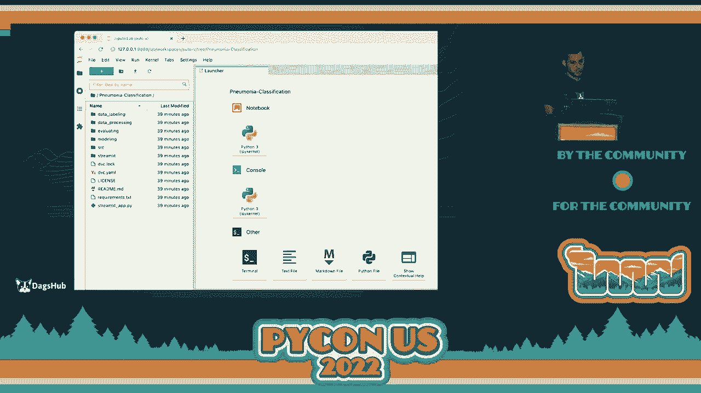

# P62：Talk - Nir Barazida_ Dock Your Jupyter Notebook - VikingDen7 - BV1f8411Y7cP

 All right， everyone。

 Thanks for your patience。 Please join me in welcoming Nia from DAGsHub。 who is going to talk about docking Jupyter， and load books。 Thank you。 And thank you so much。 everyone， for waiting。 I'm sorry for the technical issue。 And I must say that this is awesome to see everyone here。

 It's been two wild years doing virtual conferences and finally seeing all of your faces and even。 some familiar faces that I already met during the conference。 This is absolutely awesome and I want to thank you for joining me today。 And I'd like to start our session today by asking you a few questions。 So we'll be more data-driven。

 The reason why we want to use Docker for Jupyter and NodeBook。 So I'll start by asking what type of operation system are you using？ So with a show of hands。 who is using here， MacOS？ Whoa， okay， quite a lot。 Nice。 I love it。 It gave me a few issues just now。 What about Linux？ Nice。 Wow， quite a few。 Windows。 Ooh。

 coding with Windows？ Oh， that's working for you。 No， I'm kidding。 I used to work with Windows but then I discovered Mac and coding with Mac， it's the best。 So are you using any type of special hardware？ Any specific like GPs， powerful GPUs。 very powerful clusters？ Anyone are using special hardware here for training their machine learning models？

 Okay， see quite a few。 Nice。 Awesome。 So I'd like to ask all the people in this room。 what do you think if I'm going to ask， you to collaborate on the same machine learning project altogether？

 Do you think it's going to be even possible？ Well， probably it's going to be very challenging。 You're going to have a lot of different dependencies， operation system that you're using。 You're going to have problems like it works on my machine but it won't work on your machine。 and those are a lot of challenges that are hard to overcome。 And by the end of this talk。

 we'll make it possible for all the people in this room to。 collaborate together on the same machine learning project together regardless of their operation。 system or the tools that they're using only by using Docker。 So you're going to become a super woman or a man of Docker。

 And this talk is going to focus on the very basic concepts of Docker。 What is Docker？

 Why do we actually need it and what are the different components that it has？

 So if you are not familiar with it by the end of this session， you will be。 And if you are familiar with Docker and you know how to use it， this is going to be a。 very good refreshment for you。 And my name is Nio Balazita。 I'm an MLOps researcher at DAGsub。 which is the GitHub for machine learning。 It does the DevOps heavy lifting for you。

 And in my research， I focus on machine learning workflows， which in my opinion has the perfect。 balance between machine learning， DevOps and people。 And when I'm off the clock。 I do a different kind of heavy lifting。 And with that， I think we're ready to start。 So what is Docker？ Docker is an open source software packaging tool for building isolated environment and。

 running applications with their dependencies。 So we're able to wrap our application。 our project to the OS level and run it on different。 machines without worrying on the dependency that it has。 It's one of the most widely adapted tools in the industry。

 And it's used throughout the development and production lifecycle of a project。 And why do we really need Docker for machine learning？ So generally。 the main advantage that Docker provides is tenderization。 And this gives us first and foremost reproducibility， which is very valuable for data scientists。

 So everyone are using the same operation system， the same tools， the same dependencies。 Which means that if we want to reproduce previous results， we can do it very easily。 We can simply use our Docker container to run it on a local machine and， start building our model。 And it also provides us the ability to move our application or。

 our training of our model from one machine to the other。 And if you can think about it。 most of the people who are using or， are training machine learning models use heavy computing power。 So they do need to move their projects from their local machine to their remote cluster or。 to a powerful GPU machine。 So this is very important。 And some of you might ask。

 why not simply use call up for that task？ Well， call up does provide an isolated environment that has all the dependencies。 that you need for the rest of your team。 And that might be a bit of a harsh slide。 so I'm sorry for that。 Because Docker is good and it does provide some valuable capabilities。 But when you're gonna try to productionize your work and move to production。

 it's gonna be harder because you don't know which operation system that a machine。 used if you and your teammate use the same machine， what tools you use。 So it's gonna take much longer to move from your research state to your production state。 So that's why I wouldn't recommend using call up when thinking about deploying to production。 Okay。

 so we're ready to talk about Docker。 And Docker has three main components that eventually creates that isolated environment。 And I read a very good blog post， reading by our CEO， so I might be biased。 And he compared building that Docker container so。 that isolated environment to the process of baking a cookie。 It might sound funny。

 but I promise you that it will make a lot of sense。 In the next two minutes。 So the first component the Docker has， it's the Docker file。 And the Docker file is basically a file that contains all the commands。 that we want to call when we generate the Docker image， which is the next component。

 And it basically has all the commands such as copy or， move files or run some sort of installations。 So that file is gonna hold all of those commands。 And in our analogy。 the Docker file is the engineer's instructions on how to create。 our cookie cutter for baking our cookie。 So which height it should be， how strong it should be， etc。

 Next， we have our Docker image。 And our Docker image acts like， and this is a very， very big like。 So don't use it outside of this room， including the people watching back home。 So the Docker image is like a zip file that holds all of the components of our project。 or all of our dependencies in it。 So if you want to copy files that you have from your local machine to that Docker image。

 if you want to install the operation system that you want to use， the Nox Ubuntu and more。 And in our analogy， our Docker image is basically our cookie。 cutter that will create our Docker container。 So basically it has everything that we need in order to run our application。 with all of our dependencies。 And last， we have our Docker container。

 which probably a lot of you heard about it。 And Docker container is basically a single instance of our application that is live and running。 And in our analogy， our Docker container is actually our cookie。 So what we try to build through that entire process。 And where does those container live？

 So container lives in a container registry， which is a special type of storage。 And company use different types of storages like AWS， ECR， Azure Container Registry and more。 But there is another registry， which is the Docker hub。 And this is。 you can think of it like the GitHub for Docker。 And it has a lot of Docker images。

 So this is important。 All of those registry are holding Docker images。 And those images are available for the public use on Docker hub that are for。 various types of tasks。 So if you want one for machine learning or for running a flask application。 if you want to use Windows， Mac OS， different operation system。

 So you're going to find them all on Docker hub。 And now I think we're ready to get our hands dirty and。 start building our new Docker container from scratch for our machine learning project。 And for that。 I'm going to use my new monoclecification project。 Where I try to classify X-ray chest images if they have pneumonia or not。

 So my DAGs up repository holds both my code and my data。 My code is version by Git and my data is version by DVC。 And I'm going to pull all of it to my Docker container。 And at this point。 let's say that I'd like to test a new hypothesis。 So I want to use a different type of backbone model。

 Instead of using ResNet， I'm going to use VGG19。 So this is my new hypothesis。 And for that。 I'm going to create a new Docker。 And I'm going to have all the dependencies I need to run that experiment on。 So this is our goal here。 Create a Docker container that I'm going to run my experiment on。 which has all the dependencies that my team is using。

 So what would be the first part that we're going to do？

 We're going to start writing our Docker file。 And due to time constraint。 I'm not going to cover how to install Docker。 This is a fairly easy process。 This is the only process that varies between operation systems。 So there are different installation on Mac， Windows， and more。 But this is very。

 should be very easy task。 And I'm going to add a link at the last slide with a reference on how to install it。 So by starting to work on our Docker file， we'll usually base it on a previous image that already has。 some of the base dependencies that we're going to need for our project。 Like the operation system that we'd like to use， the language that we'd like， we'd want to use。

 which is obviously Python。 Some frameworks， so Keras， TensorFlow， PyTorch， etc。 And if we're not going to base it on a previous image。 we're going to have to write everything from scratch， which is going to be very hard to do。 Or it's going to be a very long process。 So I highly recommend basing your image on previously defined images。

 So for my project， I will need the following dependencies。 So I need Python 3 and above。 I'm going to need Git because I want to clone my project to that Docker container。 Like to have a Jupyter notebook and TensorFlow as the framework to use。 So a quick search on Docker Hub and Voila。 I have a Docker image that is maintained by Project Jupyter that probably a lot of you。

 are familiar with， which are maintaining that image for TensorFlow with Jupyter notebook。 And a lot of other dependencies that are relevant for data science， like pandas， NumPy， etc。 And what do we actually see here？ So first of all。 we see the name of the maintainer and then the backslash。

 and then the name of the image that we have here。 So the name of the image here is actually TensorFlow- notebook。 This is important。 Next， we can see how reliable that Docker image is。 So we can see that it has 50 million downloads， which is fairly reliable。 We can also see how we can pull it to our local machine。

 So let's say we don't want to create to reinvent the wheel。 And we want to use that exact image that already exists。 So all we need to do is pull it to our machine and we can start using it。 Next。 we're going to see here the tag。 So the tags are basically the version of that Docker image。

 You can， it will be updated as the dependencies are updated。 So let's say TensorFlow releases a new version。 Then probably Jupyter notebook or the Project Jupyter are going to create a new version。 And you can see that there is a special type of tag here， which is the latest。 And latest means the newest version of that image。 Next。

 we can see the operation system that it used。 So here it's， it uses Linux and it has it's 3。1 gigabyte weight。 So let's take this information and put it in our Docker file。 So for that。 we're going to use the from command， which is going to state the base。 image that we're going to use。 Next， we're going to state the maintainer backslash。

 the name of the image that we'd like to use。 And last， we're going to state the tag name。 So here I use latest， but if you want previous versions of that image， you can simply specify， them。 specify it here。 And by running that command， when I'm going to build the image。 it's going to simply run， the install command and it's going to use the tag latest。

 And at this point， I would like to go ahead and go to my DAGSA repo and see what is my， Git remote。 my DVC remote， which is basically my remote storage。 So I'll be able to pull off my data。 And where do I store my requirements？ So I would like to also install all the relevant requirements for my project。 So I'm going to take all of this information and I'm going to put it in my Docker file。

 And here you see that I'm using the run command， which is basically going to run the following。 pipeline。 And next， I'm going to clone my repo。 I'm going to change directory to the project。 I'm a true believer in using branches for testing new hypothesis。 So I'm switching to VGG19 branch。 Then I'm installing my requirements and I'm going to pull all of my data。

 So this is going to be translated into this。 And a few more commands that I think are going to be valuable for you。 So we have the N command， which is simply going to set the environment variables。 We have the copy。 which is going to copy the files from our local machine to that image。 So to that imaginary zip file， if you can think of it。 We have the maintainers。

 so the name of the maintainer of the Docker image。 And the CMD command。 which is the default command to run after building the image。 Next。 we're going to want to run that Docker file and build our Docker image。 So for that。 we're going to use the Docker build command。 We're going to use the pull flag。

 which is simply going to pull all the latest updates， from the remote Docker hub。 Next。 we're going to tag it。 So I tagged it as mnemonic classification， which is the repository name and。 the VGG19， which is the hypothesis that I'd like to test。 And next。 I'm going to specify the path to my Docker file。 And by running this command from your terminal。

 it's going to build a new Docker image。 If it's the first time that you're using that base image。 so， the TensorFlow notebook image， it's going to download it to your local machine。 Then it's going to run all the relevant commands and。 it's going to wrap it up in that Docker image file。 And now let's see all the files that we。

 all the images that I have locally。 So by running Docker images。 you're going to see all the images that you have。 And here I can see that I have the new monoclecification and then the VGG19。 with that Docker image。 And now， we'd like to run our Docker container and。 start working on our project。 So for that， I'm going to use the Docker run command。

 I'm going to give it a name， so near my name， the port I want to use。 and the image that I want to base the Docker container on。 So it's going to use the new monoclecification， VGG19。 You can also specify here the Docker image ID and it will also work。 And by running that command。

 I'm going to see in my terminal the same thing that I。 see when I run a Jupyter notebook from my terminal。 So it's going to simply run the Docker container and。 it's going to provide me with the URLs that I'm going to need to copy to my browser。 in order to get the Jupyter notebook environment。 And by copying one of those URLs。 I'm going to get a fully configured Jupyter notebook environment with。 all my project dependencies and files。 So this includes both my code files and my data files。 So basically everything that I need in order to start testing that new hypothesis。

 And let's say that this at this point， I change a few lines of code， I ran the experiment。 and now I'm ready to version it and， push it to my Git and DVC remote。 So I want to push both my Git tract files and my DVC tract files。 So for that。 I'd like to connect with an SSH to that Docker container。 And how can we do that？

 So we're going to use the Docker X command， which is going to execute that command。

 We're going to get an interactive terminal。 And then we're going to take the Docker container ID that we'd like to connect to。 And then the command that we'd like to run。 And how is it going to look like？

 Then I'm going to start by taking， by looking for all the containers that I have live。 And from that， I'm going to take the container ID that I'd like to connect to。 Next。 I'm going to run the command， the Docker execute IT。 And then I'm providing it the container name。 And unless I'm going to open a shell script in that container。 And as you can see。

 I'm inside that my running container。 Next， we can simply run or change directories， run Git status。 version our code， and， push it to our remotes。 And as simple as that。 you can start building your machine learning project on。 an isolated environment with your colleagues without worrying about issues with。

 dependencies or using different types of tools。 And by pushing all of those files。 I can see that experiment on DAGs up and， compare it to different experiments。 I can diff my Jupyter notebook and see which cells I modified。 What was the output when I modified it？ So if I process my data differently and now what was its output。

 etc。 So reaching to the end of our time together today。 I'd like to have a quick recap on what we covered。 So we started by talking about why do we actually need Docker for machine learning？

 And we understand that this is very valuable for us to collaborate and。 reproduce results with our colleagues。 Then we talked about the different components that Docker has。 So we have the Docker file， the Docker image， and， eventually we have the Docker container。 which is a live app that is fully configured and， running。

 And last we saw how we can build our Docker container from scratch。 I'd like to ask you if you have any questions and before you are going to refer it。 I'm going to state one question that I didn't cover。 So how you can share that image that we just created with your colleagues。

 So because of time constraint， we can't cover it today。 But it's a fairly straightforward task。 which is kind of like Docker push。 It sounds to Docker push。 You simply need to set your credentials with Docker Hub and push it to your Docker， registry。 Once again， I added a link on how to do it in the last slide so you can easily do it。

 And if you have any questions， I'd love to take them。 I think we have a minute or you want to take it offline。 \>\> Actually。 we're on sorry for the confusion。 We can't take questions in the room due to COVID restrictions。 but， feel free to come to the front and ask them。 \>\> Awesome。 So we're going to take it offline。

 So I'd like to thank you all for joining me today。 It was awesome。 It's so great to finally do live presentations and live talks and， seeing all of your faces here。 It's actually wars my heart， so I'm very excited。 And thank you so much for joining。 \>\> [APPLAUSE]。