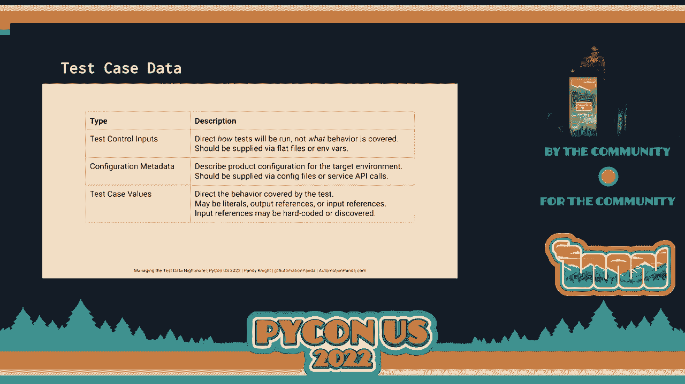
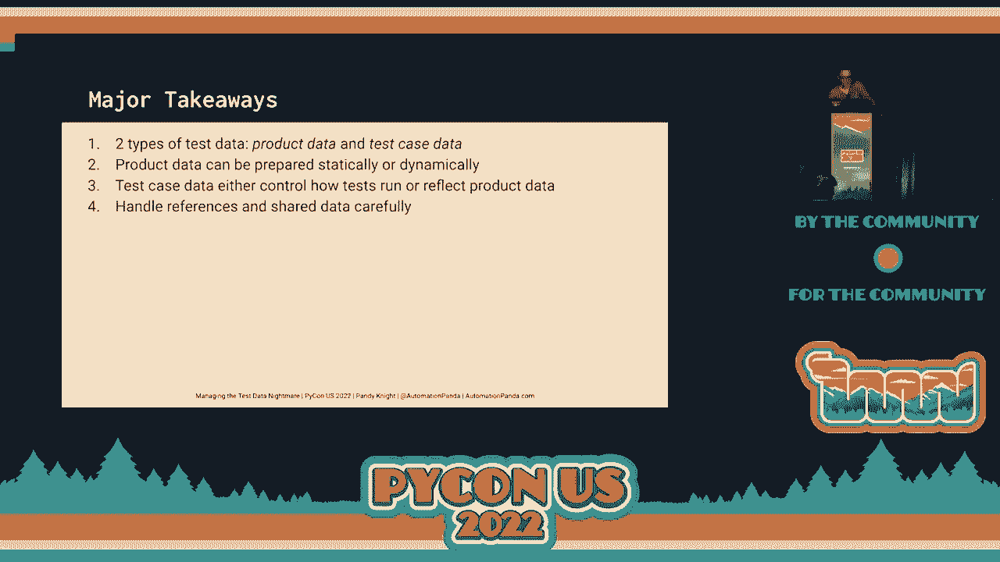

# P67：Talk - Pandy Knight_ Managing the Test Data Nightmare - VikingDen7 - BV1f8411Y7cP

 Okay， so this is the second to last talk， so enjoy it。

 It's going to be great。 Our next talk is Managing the Test Data Nightmare by Pandy Knight。 so go ahead and give him， a round of applause。 Thank you， Mason。 Thank you。 Also。 Mason is pretty awesome。 Go follow him on Twitter。 He does amazing things。 So hello， everyone。 Thanks for joining my talk today。 My name is Pandy Knight and I am the Automation Panda。

 It's been three years since our last in-person picon。 It's hard to believe。 Since it's important to make human connections， I'd like to share a little bit about myself。

 So my wife and I have this adorable French bulldog puppy。 Her name is Suki。 She is super cute and I miss her so very much。

 This is my car。 I drive a 1970 Volkswagen Beetle。 Yes。 So when I say this is my car。 I mean that this is my primary driver。 This is not a toy。 This is not something I pull out for shows。 This is what I drive to get groceries and stuff。 I'm restoring the inside。 The exterior is already pretty baller and I dropped a whole new engine in this bad boy。

 So about me where I work， I work as a developer advocate at Apple Tools， where I help people。 get the most value out of their test automation， hence automation panda。 Apple Tools provides automated visual testing tools。 So what does automated visual testing mean？

 Take a look at this picture。 Can you spot the differences？

 Apple Tools can。 There it goes。 There are 10 differences in here。 This is what visual AI does。 You might think， well， that's cool， but how is it useful？

 This is a game changer for testing your web and mobile apps。 Think about all the changes you make。 Oh， did a button disappear？ Did this label go bad？ Boom， we can find it for you。 At Apple Tools。 I'm also director of Test Automation University， which provides free courses。 on testing and automation topics。 Personally， I've developed four courses for TAU。

 even before I joined Apple Tools， three， of which cover Python。 Woo！ Python for testing is amazing。 All righty。 So let's get down to the nitty gritty。 One of the toughest challenges in testing any software product is handling the test data。 Now when I say test data， quote unquote， I'm referring to multiple things。

 Test data includes both the actual data inside the product under test， as well as the data。 values used by test cases。 As testers， we shouldn't underestimate the work to handle test data properly。 Good data is just as important as good tests and good automation。 So in this talk。 we will dive deep into the connection between product data and test case， data。

 We will learn how to pick the right strategies for handling both， including how to avoid data。 collisions when testing。 By the end， you'll know how to manage the test data nightmare for your own test projects。 whether you're testing a Django app， a Flask app， some other Python project， or something。 written in a completely different language。

 Let's learn。 Let's say we have an application for a bank to provide loans。 The bank could configure this application from any different types of loans， such as。 a home mortgage loan， a car purchase， or a student loan。 All the information， whoops， whoa。 there we go。 All the information the bank needs to provide the loans is stored in data in the database。

 It's part of the system。 Each loan product is different。 It comes in with its own rate， maturity。 and payment schedule。 The bank must also store information about borrowers， funding curves。 profitability targets， all that stuff。 It's fairly complicated。 It requires that all data already be present in the system as a prerequisite。

 We could write a simple test case to exercise the basic application behavior。 A scenario for creating a new loan application starts with， given the Chrome browser is open。 and the page MyLoneApp。com is loaded。 When the user creates a new loan for the home mortgage。 and the user enters all their personal， identification information。

 and the user submits the application， then the page displays a。 success message with a reference number， and the application is sent to the bank。 Or so we hope。 Now bear in mind， a real loan application will probably have several pages of information。 but let's keep our example simple for here today。 I know it's a Sunday afternoon， a picon。

 We're all here， which is awesome。 This test creates and submits a new home mortgage loan application for the user。 We can all agree on that。 Now there are many test data points in this scenario。 Most apparently。 there's the user's personal information。 There's the type of loan。 The record of the loan application sent to the bank。 The reference number shown to the user。

 Furthermore， the URL is configuration info， and the browser is arguably a type of test， input。 Test data is everywhere in this short simple scenario。 The data is inextricable from the test。 Without specific data， this test would be meaningless。 Everybody with me？ Yeah， good。 Unfortunately。 the term test data is ambiguous。 We've applied it to both the product data in the loan web app。

 as well as to the various， pieces of test case data that make even the most basic test work。 Product data refers to real data living in the software system。 For the loan web app。 product data includes all the bank's product configurations and lending， information。 Test case data， however， refers to data used to define test cases。

 It may include values to enter into the product under test， inputs controlling how the testing。 is performed， or records to retrieve from the product。 In the latter case。 test case data is a reflection of product data。 Its values refer to entities existing in the product data。 The two types of test data are separate but connected。

 Singing these two types of data is important to avoid confusion。 The dependency of test case data on product data can be brittle。 For example。 consider our test case step to create a new loan application for a home， mortgage。 This step works as long as the bank's web app is configured for home mortgages。 However。

 the product data could be changed at any time， just like product code。 But if the specifics of a home mortgage loan change， what if the loan is no longer called。 a "home mortgage loan" but a "personal residential loan"？ That would make the test case break。 Compounding breakages calls nightmares for test management。 So how should we manage test data？

 For feature testing， test data is just as important as test cases and test code。 How do we handle both product data and test case data appropriately？

 Are there strategies we can use to avoid brittle dependencies？

 In this talk， we'll explore multiple ways to handle both product data and test case data。 Unfortunately， there's no universal or perfect solutions out there。 But you can avoid nightmares by picking strategies that work well for your needs。

 Let's start with product data。 As stated previously。 product data is any live data in the product or system under test。 In simplest terms。 it's everything in the database。 It can include user accounts， administration settings。 product customizations， records， created by users， files uploaded by users， so on and so forth。

 For that example， loan application we were talking about， product data would include。 things like the user accounts。 The loan product settings， the loan applications。 and the behind the scenes bank data。 Data must be present in a product as a prerequisite for most testing。 There are two primary ways to get that data in the system。 On one hand。

 you can set up the data before running your tests。 This would be static data creation。 For example。 a loan web app could be set up with a set of preregistered users and a， collection of loan types。 Test cases， whether they are manual or automated， can presume that this static data is already。 in the system and simply refer to it。 Static data preparation is a good strategy for complicated data or for data that is slow。

 to create dynamically。 For example， user accounts may need email verification。 so it might be easier for automated， tests to simply use a set of preregistered users。 People run faster if they can simply reference existing data instead of creating new data each。 time。 However， static data must be maintained。 Any changes to static data could impact tests too。

 Static data may also become stale over time as data formats are updated or if data is time。 sensitive like a time series。 On the other hand， you could set up data during test execution。 This would be what we call dynamic data creation。 In the example loan test case。 the loan application document is dynamically created。

 The test does not reference an existing loan application。 It creates a new one。 Dynamically created records avoid the brittleness of hard references to static data。 It can also be used exclusively by the current test case， protecting them from interruptions。 by other test cases。 The main downside of dynamic data prep is the execution time。

 It does slow down your tests。 Dynamically created data is essentially disposable too。 so it should be cleaned up eventually。 Which strategy is best？ Typically。 testing requires both strategies together。 Data that is slow to set up or considered immutable should use static data preparation。 while data that is quick and easy to set up should use dynamic data preparation。

 When I develop test solutions， I prefer to create as much data as possible dynamically。 per test case to try to preserve test case independence。 When a test creates the data。 it needs dynamically。 It will be the only one referring to it。 And there is a much lower risk of collisions。 These two data prep strategies are a bit complicated when implementing them。

 Data prep really depends upon the test case that you are doing。 For example。 with that loan test case， we had to create a new record for that instance。 However。 static data prep has a few general strategies that are independent of the test， cases that use them。 The simplest data prep strategy is manual configuration。

 How many people have done this in their systems before？ Yeah， yeah， I know。 That's exactly what it sounds like。 Testers log into the system and manually create whatever records they need to be in。 the system。 That can include creating users， configuring settings， and saving records。 The nice thing about manual configuration is that it's low tech。 Anyone can do it。

 You don't need fancy or complicated tools。 However， manual configuration is slow。 It does not scale well for large systems or large test environments。 Furthermore。 manually configured systems can easily fall into disrepair without any automated。 mechanisms for maintenance。 Better strategy might be automated configuration。

 Rather than manually setting up everything， automated tools can create the desired data。 This could be accomplished in many ways。 Reusing UI interactions from tests， calling REST APIs。 or even possibly using tools like， Puppet or Chef。 Automation could generate data deterministically or randomly。

 The main benefit of automation is the ability to create fresh data at any time。 Automation can also clean data like scrubbing private fields or updating time sensitive， fields。 Unfortunately， automated configuration is not a free lunch。 It requires extra skills and the automation code must be maintained。 If you want a shortcut。

 you could try to clone the database。 Cloning databases is easier than ever with cloud management tools。 You can maintain one database in a golden state and create a copy before running tests。 Once testing is complete， the copy could be destroyed。 Granular cleanup would not be necessary。 Database clones make it easy to copy all data at once without worrying about any damage。

 that rogue testing could cause。 However， databases can have a lot of data。 so cloning large ones may not be practical。 Clones may also need extra refinement to scrub special fields and hook them up properly into。 your systems。 Finally， if managing real data is too much of a hassle。 then you can mock your endpoints。 This will completely remove dependencies on databases and even services。

 All data returned by the MOCs will be deterministic too。 yielding consistent results for your functional， tests。 But MOCs are not always a good solution。 They often require a lot of extra effort to set up， and MOC data can make tests overlook。 the unprecedented real world variations。 MOCs also mean that tests will not truly be end-to-end in coverage。

 These strategies can also work together。 For example。 you could use automated scripts to configure product data in a golden database。 and then you could make clones of that database。 In another example， in a large testing environment。 you could choose to mock some endpoints while， using real data for others。 Many times。

 we want to use production or production-like data in our systems to mirror the real world。 Unfortunately， production data has things like personally identifiable information in， it。 and it's not always safe to share。 Many things might be like credit card numbers or Social Security numbers that must be kept。 private。 Generating data synthetically is a great way to avoid those roadblocks。 For example。

 Redo AI is an awesome tool that generates synthetic data that is statistically， accurate。 privacy protected， and safe to share。 You can use Redo AI with any of these static data prep strategies。 There are multiple factors that should be considered when deciding the best strategy for。 static data prep。 How big is your data？ If it's small。

 manual configuration can probably be sufficient。 Chubbled law。 But if it's large。 then automation may be required。 Fresh does the data need to be。 If data is time sensitive。 then automation will be needed to keep it up to date。 How frequently will the data need to be updated？ Again， automation can help for frequent updates。

 and synthetic data generation tools like Redo， AI really shine here。 How difficult will it be to try advanced tricks like mocking or cloning databases？

 This may be especially difficult for old or legacy systems。 Is there any bureaucracy in the way of automated solutions？ Hey， company Red tape happens。 Not every organization has efficient or even healthy culture。 Bureaucracy can stone wall advanced solutions that need extra support。

 Do folks have the skills required for automation， database administration， or MOCs？

 Skill level may be a barrier at first， but with training and learning， you can overcome。 any of those limitations。 And finally， what about the cost？ Each data prep strategy has a cost。 There should be a cost-benefit analysis done when your team is deciding。

 So that's how to handle product data。 Everybody still with me？ Still with？ Yeah， whoo！ Awesome。 awesome。 I love seeing everybody here。 This is so cool。 So what about test case data？

 Only halfway through。

 Let's look at test case data next。 Test case data is inherently part of test cases。 Let's revisit that example test case from earlier。 As we saw before。 there are multiple bits of test data throughout the steps of this short， scenario。 They represent different types of test case data。 So， look at the first step。

 Given the Chrome browser is open。 Chrome browser is test data because it specifies the type of web browser in which to load the。 app。 This is what we call a test control input。 It directs how tests will run rather than specifying anything about future behavior。

 Theoretically， this test should run the same on any browser， but the steps dictate that。 the test should run on Chrome。 That's the best practice， don't do this。 Test control input should not be hard coded in the test automation code。 Instead。 they should be passed into automation as inputs。 That way， tests can easily be retargeted。

 There's a few ways to do this。 Simplest way would be to create a flat file with input values。 I recommend using a format like JSON or YAML because they're easy to write， easy to read。 and easy for programming languages to parse。 They can also have line by line diffs。 Test automation code can read the file before any tests start， and it can inject input values。

 as appropriate。 For example， using this JSON file。 automation could read the browser type and construct。 a web driver instance or playwright page for Chrome for each test。 The path for the input file would need to be hard coded into the automation， but it。

 could be as simple as standard file name in the current directory。 Another way to handle input is using environment variables。 Test could set variables from a system shell or profile， and automation could read those。 variables by name。 This can be useful for integrations with continuous integration servers or Docker containers。

 However， it can be a little more dangerous because anyone could change the variable values。 Again。 automation would read them in before any test run and handle them appropriately。 Let's remove that hard coded step for browser type from the test scenario。 Test can be handled as an automation level concern。 Next。

 let's look at a second type of test case data。 Notice how the URL here is hard coded。 This is also not a good practice。 Don't do this in the real world。 Typically development teams host multiple instances of products under development， like。 a developer environment or a staging environment or a test environment。

 Using configuration information like this limits where tests can run。 Any information about a product's configuration is called configuration metadata。 This can include things like URLs， usernames， passwords， and possibly other descriptors。 There's a few ways to handle config metadata。 You can use flat files or environment variables like for test control inputs。

 However， I do recommend using flat files and I also recommend separating test control inputs。 from configuration metadata。 Creating input to refer to the target configuration and store multiple configurations in the configuration。 metadata files。 That way testers can change those one or a few simple inputs to target any configuration。 And they won't need to change multiple configuration fields regularly。 If you want to be fancy。

 you could create a web service to provide config metadata， something。 like Azure Key Vault or whatever the AWS thing is。 But you don't really need to do that unless you want to go big or you need to keep your。 passwords and secrets safe。 So it may be overkill。 Either way。

 the test case step can be rewritten to refer more generically to the web app。 Automation can select the target environment using the inputs and config metadata。 By the way。 did anybody see that YAML shirt from CircleCI？ That was pretty funny， wasn't it？ Alright。 The remaining pieces of test case data all fall into the category called test case values。

 These values pertain directly to the behavior exercised by the test， not to any configuration。 factor。 Even in this classification， guess what？ There are subtypes。 First kind of test case data is a literal value。 These are values that are hard coded in the test。 In this example， the table of personal info contains literal values。

 Literals are simple to use and they provide specification by example。 People should also be independent of any statically created product data。 They should be values that can be safely originated by the test case。 The literals in this info table will be entered as input values into the web app。 Theoretically。

 they could be any values。 The second kind of test case value is an output reference。 These are values that are typically retrieved from the product under test。 They are the outputs generated by exercising a behavior。 In this example test。 the reference number can be scraped from the success page and verified， for correct format。

 The loan application can be retrieved from the web app's back end to verify that it was。 correctly submitted。 These values cannot be literals because they originate from the product。 That must refer to them by reference and retrieve their values from the product。 As a side note。 this test dynamically creates the loan application。

 The third and final kind of test case value is the trickiest。 The input reference。 At first。 these values may look like literals。 However， input references are values that directly refer to product data。 While personal info like name and address are created dynamically by the test case， the。 name of the loan type refers to the loan configuration in your application。 Thus。

 this test has an input dependency。 It must specify the type of loan and that loan type must already exist in the product。 data。 The simplest way to write this test is to simply hard code the reference。 That's what's done here。 The name home mortgage refers to the name of the loan type in the web app。 Automation can use that name when selecting the loan type like from a button or a drop-down。

 Hard code references make it easy to write tests， but they require statically prepped data。 to exist in the system。 References also become hard to maintain when the product data changes or when the same test。 must run against different configurations with different names。 One way to avoid the pain of static data is to dynamically create these records or configurations。

 If the test calls the back end to create a new loan product named home mortgage for， each test run。 then static pre-prepped isn't needed。 However， we already know the pain points of dynamic prep。 So in this case， let's say dynamically creating a new loan type is just too slow。 A robust solution could be what we call data discovery。

 Let's say the target web app is already configured with multiple acceptable loan types。 Instead of hard coding the names of the desired loan type， the test could describe the loan。 type and then use automation to search the web app's configuration to find a loan type。 matching the desired criteria。 For example， if different regions of a bank have different names for this type of loan。

 the discovery mechanism could look into the config for a satisfactory home mortgage loan。 type and return the specific name for whatever region you're in。 Discovery enables tests to search existing product data for required records instead。 of hard coding those records。 Discovery makes tests more resilient to changes in product data。

 It's great when testing multiple environments with ever-socially differences between them。 However。 it does require extra coding and it may be overkill for small projects。 Whoo！ Who's still with me？

 I'm not sure I'm still with me。 Where are you， Pikachu？ Let's get them。 That's a lot of information about test case data。 Right？ Here's summary。 Test control input directs how tests will be run， not what behavior is covered。 They should be supplied via flat files or environment variables。

 Configuration metadata describe product configuration for the target environment。 They should be supplied via config files or service API calls。 In test case values。 direct the behavior covered by the test。 They may be literals， output references。 or input references。 And input references may be hard coded or discovered。

 You want to take a picture of a slide and take this one。

 Here's your chance。 Whoo！ So at this point， you're probably thinking， "Wow。 that's a ton of information， especially， for a Sunday afternoon at PyCon。"， That's it， right？

 We're done。 We're good。 Time for Q&A。 Well， frightfully， nightmares not over yet。 There's one more problem to address。 Collisions。 Collisions can happen whenever multiple actors operate on shared resources。 For example， they could happen whenever multiple testers simultaneously access the system or。

 when automated tests run in parallel。 Additional considerations apply。 First and foremost。 isolate your test environments。 Please isolate your test environments。 Prevent external actors from interrupting。 If you have a shared test environment。 block people from using it while tests are running， or run off hours or something。

 If you're containerized， great。 Run containers by yourself。 Don't let anybody touch them。 Try to get it things as isolated as much as possible。 Second， treat any shared data as immutable。 When I say immutable， I mean constant， not changing。 Nobody can go in there and tweak it。 If tests run in parallel against the test environment， they may have to use the same， product data。

 Or if an application has multiple components， certain components may be difficult to isolate。 for testing。 So treat any shared data as constant so one thing can't mess up another。 Third and finally， use dynamic data prep as much as possible。 Tests can't collide on data they don't share。 Keep statically prepared product data to a minimum。

 You will need it， but keep it minimal。 Statically created data is more likely to become shared data and shared data is more。 likely to cause collisions。 Boom！ We made it。 We covered lots of information today。 So again。 I would say here's your money shot for a slide。 There's two types of test data， product data。 test case data。 Product data can be static or dynamic。

 Test case data either controls how tests run or reflect the product data。 Handle your references and share data carefully。

 And overall， if there's one message you take away other than Pokemon is awesome， choose。 the best strategy to defeat your nightmares。 Every product is different， every team is different。 Take the strategies I shared in this talk as suggestions。

 So thank you again for listening to my talk。 Again。 my name is Pandy Knight and I'm the Automation Panda。 Be sure to check out my blog and follow me on Twitter and I hope you enjoy the rest of， PyCon 2022。

 [APPLAUSE]。