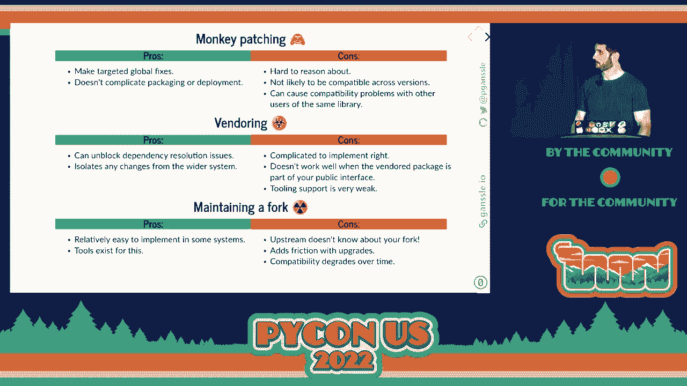

# P68：Talk - Paul Ganssle_ What to Do When the Bug Is in Someone Else's Code - VikingDen7 - BV1f8411Y7cP

 So we're about to start the second talk of the session。

 This will be Paul Ganssell。 And he will tell us what to do when the bug is in someone else's code。

 Stay tuned。 All right。 [ Applause ]， Thanks everyone。 It's really great to be back at PyCon。

 Jonah said， my name is Paul Ganssell。 I'm a software engineer at Google and also a contributor to many open source projects。

 Among other things， I'm a core developer of Python， where I've worked on daytime and， zone info。

 And I've maintained libraries like Date You Tale and setup tools and got involved in。

 a lot of packaging things。 I don't recommend that last part。 I mean， go to the packaging summit。

 It's going to be really fun。 As someone who primarily develops libraries。

 I'm obviously a fan of shared code。 But I recognize that there are risks to taking on dependencies。

 whether that's a third party， dependency or just like an internal dependency on some other team in your organization。

 And one of those risks is the topic of today's talk， which is when something you depend on。

 has a bug or other incompatibility。 It's not as easy to fix as it would be if it was a bug in your own code。

 But first thing to start with a warning。 This talk deals with a number of strategies for handling bugs in your dependencies。

 But it's organized as a series of strategic retreats away from the right thing to do。

 So we're going to start out with the right tool to hammer in this nail。

 And then we're going to go to more sort of hacky and even dangerous things as we move， along。

 So what do we mean by a bug in someone else's code？ So here's an example that I encountered at work。

 This is just a minimal reproducer。 So the way this function is supposed to work is that you have data frame。

 it takes AAG， and it's supposed to pass this function F。 And AAG itself takes two parameters。

 It takes the function and then it takes the access。

 And then it's supposed to pass all the additional positional and keyword arguments to the function。

 that you passed。 Right？ So what this is supposed to do is it's supposed to apply F to every row and it's just going。

 to pass to F the row and then the number three。 In PANDAS 1。1。3。

 which was the most recent version when I first wrote this talk， this， actually raised an error。

 Some kind of weird thing about the access parameter was being passed twice。

 So that's kind of strange。 So we can check the documentation。

 make sure that I understood how to use the function correctly。 And you can see yes。

 PANDAS did indeed intend for you to use it this way， but it doesn't work。

 So this is a bug in PANDAS or it's a bug in their documentation， one or the other。

 So what should I do about this？ The right thing to do is to tell PANDAS about it because how are they going to fix it unless。

 they know about it。 And if you're feeling adventurous， you can submit a patch and fix it upstream。

 In this case， it was fairly easy to do and crucially， it was fairly easy to review that， patch。

 So this was merged just like a couple days after I made the pull request。

 And then it was scheduled for release in 1。144。 So all I had to do is wait for the release to come out。

 And just as an aside， this all seems very standard for me because I do like a million open source。

 things。 But I can understand if it's sort of intimidating to think like， oh。

 I'm going to make this open， source pull request and ask someone to take my patch。

 I don't have time to get into exactly what you should do and the practical aspects of， it。

 But I gave a talk in 2018 at PiData about exactly this。

 So if you look at the slides there on my website and stuff， you can find that talk if you're。

 interested in that。 So so far， this is all looking like a great open source success story， right？

 I just have to wait for the updated version and then updated in production and we're good， to go。

 So what can go wrong？ Well， for one thing， maybe I don't want to wait until PANDAS makes a release because。

 my boss is saying， hey， on Friday we have to deploy this and you have bugs in your code。

 And I can't be like， well， I've fixed it upstream。 So ask them。 You know？

 There's also such thing as long upstream release cycles， right？

 Maybe PANDAS is releasing every week。 But in just a couple of years ago in C Python。

 they shortened the release cycle from 18 months， to one year。

 So the short release cycle is one year。 You may not have a year to wait for your features to get in。

 And of course， I don't know how many of you get to deploy Python the day it comes out。

 the newest version， right？ But probably there's going to be a fairly long QA process after that。

 like six months， to a year before you get to use the latest version of C Python。 So basically。

 you're probably going to have to wait if you want to do this。 So what do you do in the meantime？

 Well， probably the best thing you can do is to just sort of work around it。 In this case。

 it's fairly trivial to work around this because all I have to do is instead。

 of passing this by position， I can just pass it by keyword。

 So I could just change it to pass by keyword， maybe leave a little to-do comment or a comment。

 saying this is written this way because I was working around it。 And then we can be done。

 And this sort of thing works just fine if you hit the bug in exactly one place。

 And if the workaround is fairly simple， so it's just changed one little thing。

 And it's also especially good if you're indifferent between the bug triggering code and the work。

 around code。 Like I really don't care in this case whether it's positional or keyword。

 So I maybe don't even need that to do comment。 If some of these things don't hold。

 it might be good to sort of wrap your workaround into， a wrapper function。

 So here I've sort of just taken that little workaround and I've made it a little more generic。

 and I've wrapped it in a function that is kind of a drop-in replacement for data frame。

 for data frames ag function。 And what that does is it just sort of takes whatever。

 it takes arguments the way that we're， expecting the arguments to work and then all the positional arguments。

 it turns them into， keyword arguments and passes them to dataframe。ag。

 So this is useful because it can help you encapsulate any like complicated workaround， logic。

 It also provides an easy target for removal。 So what you can do is you take all the places in your code where you're calling dataframe。

ag， and you replace them with dataframe_ag。 And then later when you fix the bug in 1。1。

4 is your main thing。 You go and you do a search and replace and you put back the original code。

 Okay， so we can all say that we're going to clean up this technical debt that we've just。

 incurred but in reality this workaround function is going to last forever。 Or maybe。

 So one strategy you can use to sort of make it less of a hack and to minimize the scope。

 is what I'm calling opportunistic upgrading。 And the idea here is that in our wrapper function instead of just unconditionally applying this。

 hack I will just write a little function or something that says if this pandas bug is。

 currently active do this otherwise just return the original thing。

 So now we have this sort of thing which says we're applying our workaround if and only if。

 the bug is present。 And I would say that there are two broad strategies for determining whether or not the bug is。

 present。 One is by feature detection。 So you can in this case it's fairly easy to trigger this bug so I just have this minimal。

 reproducing I can just run it and if I've triggered the bug I return true and if I didn't。

 trigger the bug I return false。 I actually only have to run this one time because the pandas version is not going to change。

 the bug is just there or it's not there。 So I can just actually cache this。

 I can also you can also check the version because in this case I know that the bug is， fixed in 1。1。

4 and I also happen to know that the bug wasn't present in 1。1。0 so I can。

 just check the versions and then I'll know whether or not the bug is present。

 So there's pros and cons for both of these。 I tend to prefer the feature detection version because it doesn't require knowledge of exactly。

 which versions are affected most of the time you don't know that you've got a released。

 bug fix up somewhere and you can just opportunistically upgrade when the version hits a certain。

 number you just sort of are like well if they ever fix it this will start to work。

 You may not always also have accurate version information and also the bug might be simple。

 to check for like in this case but it might be hard to describe in terms of versions and。

 platforms so if you really want it tightly scoped and you're only triggering it on Debian。

 on 64 bit architectures with Python 3。9。7 and Pandas 1。1。4 this is a lot to try and encapsulate。

 into your into your version detection and it's quite easy to just trigger the bug。

 Whereas the version checking version works when the bug is kind of hard to detect so if。

 the bug is a memory leak right you're not just gonna like wait until your computer runs out。

 of memory and you're like oh yeah I should use the workaround and you know if it's a。

 seg fault that's not something you can recover from and the other advantage of this is it's。

 relatively simple to implement especially if the minimal reproducer can be a little complicated。

 So once you've written your opportunistic upgrading function you can either incorporate。

 it into the wrapper function or you can actually conditionally define the wrapper function based。

 on whether the bug is triggered right。 So if it's cheap enough to call hasPANAsBug at import time you can say define this wrapper。

 function if the bug is present otherwise define the wrapper function to be the original function。

 that I'm replacing and then and then you're good to go and this really minimizes the scope。

 because you're not even defining an unusual function。

 So for each of these strategies I'm gonna give a couple real life examples where they're。

 applied probably the most prominent thing that you would see these in is something like。

 feature backports so import live resources is only in Python it started in Python 3。9 almost。

 everything in the backport names face these are basically wrapper functions or workarounds。

 right because you you want new features from something that exists in a future version and。

 you can use these backports to to sort of simulate and most of the time these do use。

 opportunistic upgrading right it's a very common idiom to say like try import import， lib。

resources except import error import import lib_resources。

 Six the package many of you are probably familiar with was used extensively to make Python 2。

 and 3 compatible that used essentially the same strategy and when I first wrote this talk。

 it was number two on the on the most downloaded pipi packages interestingly in the two years。

 since then it has now dropped to nine so maybe my little joke about that we're never going。

 to remove our to do comments is not quite accurate so thank you all for stopping using， Python 2。

 The last example is just kind of a pitch so I'm not going to talk about it but check out。

 the slides and you can you can check out pi tz deprecation shim if you want to know more。

 about that。 Alright so let's get into the next strategy and this is where we start getting into properly。

 like dangerous and hacky territory and that's monkey patching。

 So the way monkey patching works is that so Python most modules and classes in Python。

 are mutable and they live in a global namespace so you can actually just dynamically modify。

 the code that you want to that you want to patch at runtime。

 So here's an example where we decide that the apps function is like a bit stodgy you。

 know it's always returning positive numbers and so we want to be like let's be a little。

 bit more chaotic okay so 20% of the time we're going to return a negative number so what。

 we can do is we define that function and then because we want everyone to use our。

 apps we take dunder built in dot abs and we replace it with our function which we've。

 called six pack because it's an upgraded abs and and you can see when I when I when I。

 print the return value for abs like about 20% of the time it's a negative number and this。

 affects not just that local name space it affects everyone using the name space so evidently。

 the fraction object uses abs somewhere in its hash calculation and so if I just generate。

 a hundred copies of one fraction object and I hash them I'll get two different values。

 So how does this help us right it's super cool that we can break the hash function of。

 fraction objects but that's not exactly fixing a bug so let's jump back to our pandas example。

 right so instead of implementing our our our workaround as a wrapper we can implement it。

 like this where we use our opportunistic upgrading strategy very critical when monkey。

 patching and and we can instead of trying to replace all the call sites with data frame。

 underscore AG we can just replace the AG method on data frame with our wrapper function so。

 what this will do is it'll like globally and transparently fix the issue for everyone in。

 the name space which is kind of important which is kind of useful when someone else is calling。

 AG and you're calling that person so if they have some 200 line function and they have。

 one place where they're using agron you can't really patch their just a little a single。

 line in their function you definitely can't monkey patch it and you can't you don't have。

 any control over it it's just another one of these someone else's bug problems right。

 so what you can do is you can patch the AG function when you're calling their when before。

 you call their function and then they and their function will be fixed so now we're。

 going to move on to why this is a terrible idea most of these strategies at this point。

 are kind of terrible ideas so there's going to be large sections like this so one problem。

 is this is sort of action at a distance what you're sort of dynamically modify I mean it。

 should be obvious right like you dynamically modifying code no one is really expecting。

 you to do this right and because they're not expecting you to do this they're not going。

 to code with your workaround in mind they're not going to be trying to keep compatible。

 with it it's obviously going to it's obviously going to break if so if they start making changes。

 that you're relying to implementation details that you're relying on and in fact you usually。

 tightly coupled to implementation details when you're using monkey patching one example。

 of how you tend to be tightly coupled to implementation details is that it's very important。

 to to scope your patch correctly so here's an example where we've got two almost identical。

 versions of the same module and they just tell you what pie over two is and we've decided， that 3。

14159 whatever has too many digits we're just going to call pie three and so we're。

 going to patch math。py to be three and critically we've done that after we've imported the pie。

 module and pie module two so the first version of pie module returns 1。5 so the patch is。

 taking effect the second one it's clear that the patch didn't take effect and the reason。

 for that is that in the first module every single time you call this function it looks。

 up the pie attribute on math resolves that to a number and then returns that in the second。

 version at import time it looks up what pie is on math stores that as a variable and then。

 every time you call the function it calls whatever it's stored right so if you want to。

 patch pie module 2 you actually have to patch it in the pie module 2 namespace so it's。

 not actually quite as global as you would hope you have to patch it if people are doing。

 these this kind of important you have to patch it on the module that you need that you want。

 to change so after all this reasoning like you decide alright it's kind of a terrible。

 idea but I still want to use it I would highly recommend that you scope it as tightly as。

 possible if you really only need to apply the patch for a short period of time or just during。

 one function or one section of a function you can use a context manager to do this right。

 so you can imagine we'll have a function that patches the code and then another function。

 that fixes that restores the patch and you can just write a little function like this。

 using contextlib。contextManager and you can use a context manager to say alright I'm calling。

 someone else's function I want them to have the patch version of it and then I'm going。

 to restore the original one so I don't create too much chaos everywhere and you can use that。

 either as a context manager or as a decorator right you say during this affected function。

 I want the patch applied but I know other time so let's move on to real life examples。

 a lot of the rest of the examples come from packaging and I don't know if that's just。

 familiarity or because they like to do this kind of stuff or both but it may be a little。

 disturbing for people who think that it's all rock solid up there so setup tools this is。

 really a cautionary tale as an example it's not like six where six was a godsend setup。

 tools extensively patches distute hill and it does it on import so when you import setup。

 tools it actually like fixes a bunch of bugs in distute hills and I guess at the time this。

 was this was useful and good and it was fixing things in people's code that you didn't control。

 when you're trying to build their packages and so pip started to like this and so when。

 they were running your setup。py they would invoke the monkey patch even if you didn't。

 import setup tools so then people started to depend on distute hills features that were。

 actually setup tools features even though they never thought they were depending on。

 setup tools it became a huge morass so this was expedient at the time but setup tools。

 have taken like years to unravel this and it's still not totally unraveled like it's。

 caused lots of problems so this is one real life example I mean I guess I could have just。

 told you like mock。patch works with monkey patching and that's something that people。

 kind of like but this one's more fun okay so now we'll move on to the next strategy which。

 is vendoring so Webster's dictionary defines vendoring as the word you have entered isn't。

 in the dictionary but really that's just because the fat cats at the dictionary don't want。

 you to know about this strategy but I'm here to tell you the truth so vendoring is when。

 you include a copy of one or more of your dependencies in the project source code I don't。

 know why that was so secret so the way this works is you just sort of take the source code。

 of the of the dependency you have and you copy it into your project tree somewhere and then。

 say the thing you're trying to vendor is called squalene you would take all the references。

 to squalene and you would change them to be my project underscore vendor dot squalene。

 and if you need to apply some patches to this vendor copy you would apply them to your local。

 copy so the advantage here is that there's no chance that your hack will break if the。

 dependency is upgraded it has a lot of the same problems as monkey patching except that。

 here you're not modifying the global namespace so it's just scope to your package and you。

 don't have to worry about the dependency breaking your your patch is because you control when。

 the dependency gets upgraded this is also useful because it allows two packages to use。

 otherwise incompatible versions of a shared dependency so like if your library depends。

 on library A and then library B also depends on library A but B needs version two and you。

 need version one you can vendor version one and let B use the the global version of it。

 so the crotions here are for one thing if you have these two versions coexisting things。

 may get a little weird right so if you can imagine squalene has this object called magnitude。

 and magnitude implements comparison if you're comparing between two versions from the the。

 global package things will work great if you're comparing two versions from the the。

 vendor version it looks great but if you mix and match all of a sudden they're like well。

 what is this vendor magnitude thing I don't know anything about that no type error this。

 isn't going to happen and this is actually compounded by the fact that references to the。

 package's top level name within the vendor package will still hit the global package but。

 then also relative imports will hit the vendor package so if you have if squalene is doing。

 some mix they're they're going to have some mix of functions from the global package and。

 from the vendor package and to solve this you need to do something like either patch the。

 whole source code to remove all references to the top level package or you do something。

 with import hooks or you mess around with the path none of these things sound like a fun。

 leisurely activity for your weekend so the downsides here it's kind of hard to implement。

 correctly at least it's hard to maintain and as a tendency to be like leaky in one way。

 or the other we saw one example but there's like a million because the import system was。

 not really built with vendor in mind and this also doesn't work well for any dependency。

 that's part of the public API right if you're if you're returning data frames you can't。

 be returning data frames that were defined in your weird vendor version of pandas that。

 has a fixed AG function right you have to be returning them from the global namespace。

 so this only works for things internally that are using the vendor API so this tends to。

 be more useful in like applications so real life examples oh look pip and setup tools are。

 back on the list so pip and setup tools vendor all their dependencies and this is actually。

 one of the weird ones where it kind of makes sense right because they're at the they're。

 at the base of the dependency tree so they do it to avoid bootstrapping issues they don't。

 do any patching and they kind of get it to work by manipulating the namespace resolution。

 they do it in like incompatible ways so it's not great but you know it seems to work there's。

 a there's a an application called invoke the vendors all its dependencies and this is a。

 cautionary tale because you can see there even though they've been updated kind of recently。

 the invoke has none of the dependencies been upgraded in over five years and I think some。

 of them have CVEs on them so it's not great and in a little bit of irony this talk itself。

 is an example of it so reveal that JS and Jekyll reveal JS I've entered them into the source。

 so it's going to be easier to reproduce this talk in five years when I've totally forgotten。

 about it and Jekyll reveal even carries a patch because when I was first putting this。

 talk together I found a bug in Jekyll reveal and I tried to upstream it but there wasn't。

 enough time so I just modified my local copy of it and now it's almost two years later。

 and nothing's been merged I'm not sure if this package is still active or anything but now。

 I'm just kind of maintaining a fork reveal Jekyll reveal inside of my inside of my talk。

 repo which brings us to the last option maintaining a fork so the last option is basically when。

 you are deploying and maintaining a patched version of the library or the dependency in。

 your production distribution right so the difference between vendoring is that this is global rather。

 than using an unmodified version of upstream you would just take the patched version of。

 your of the thing and put it in your production pipeline whether that's your Linux distribution。

 or or a mono repo or your own mirror of pi pi or you're serving a patched wheels unfortunately。

 in my experience people will take this as their first option because kind of like just。

 patching your local version before deployment is relatively easy and the cost for this really。

 comes later on down the road so if you do want to do this it tends to be done mostly。

 the way I've seen done is you you take the original code and you store a tarball of that。

 and then you store a series of patches that are going to be applied to it before it before。

 it gets built most people I've seen use quilts for this and I don't have really time to go。

 into like how to use quilt but I found this blog post which does a much better job of explaining。

 how to use quilt than I would be able to in you know the 30 seconds that I have and if。

 this is too complicated for very simple cases you can also just sort of like use like said。

 or other little search and replace at build time you know for for simple patches like the。

 path here is in this thing to deploy is wrong and I'm just gonna I just want to globally。

 replace it this this idiom seems fairly common to me from what I've seen in the arch Linux。

 distribution where they have a fairly strong cultural norm against carrying patches on their。

 on the things they distribute so when they do carry patches they tend to be very simple。

 things that can be executed just with said so back to the downsides because I really don't。

 like this strategy the downside is that you're maintaining a fork that your upstream doesn't。

 know about right so when they don't know about it there's a good chance that they're going。

 to make decisions that are incompatible with the things that you're patching right and then。

 every time they make a change this is going to add a bunch of friction to your upgrade。

 process because you go to upgrade and then your patches don't cleanly apply or you know。

 you have to rewrite large sections of the patches because your approach was different。

 than their approach you know and then they're certainly not making any guarantees of compatibility。

 if you file a bug that's like my patch doesn't apply right they'll be like why are you carrying。

 a patch why didn't you submit that upstream so you know and the worst case scenario here。

 is that the other people in your organization who are using this start to depend on your。

 version or specific details of it and then you can't pull back your your your patches。

 and now you have just a whole ecosystem that's built on this alternate fork and you're increasingly。

 unable to pull from upstream so I hardly have to mention any real life examples like every。

 Linux district does this it's incredibly common in industry it it it's almost a default in。

 some ways but I'm going to take this time to mention a success story which is when I first。

 got to Google I took on the task of helping to keep adders up to date but we had a whole。

 bunch of patches that we were that we were carrying on adders just little things and one。

 by one I was able to remove all of them except for one which was that adders relied on soap。

 for their tests because they wanted to make sure that soap worked with adders which is。

 great but we don't use soap anywhere and I didn't really want to package and deploy。

 soap just for the purpose of running the adders test which had no effect so that was。

 our one patch and so I actually made a pull request I thought it was a long shot to say。

 we'll mix open optional dependency and amazingly Hennick accepted it and I got the last patch。

 off and it's like a breeze to upgrade adders now so let's go to a recap of the strategies。

 that we covered so patching upstream that's that's the gold standard right you fix the。

 bug for everyone there's nothing for you to maintain I mean there might be for the maintainer。

 but you know hopefully this would actually improve your relationship with the maintainers。

 because they're there they're seeing that you're you're willing to fix bugs for them。

 the downsides here is you know delays right you have to and also you have to convince。

 someone to accept your patch I've shown some success stories I've also shown at least one。

 failure story right the Jekyll reveal did not accept my patch if you can't patch upstream。

 or in the meantime while you're waiting for your patch to deploy wrapper functions I think。

 are a perfectly acceptable way to do workarounds right they help maintain compatibility they're。

 easy to remove and then you can deploy them immediately the downside is you can't always。

 apply this strategy right there's there just times when you need something else so when。

 we move into the more dangerous strategies there's monkey patching which allows you to。

 make more targeted global fixes and it doesn't have any problems it doesn't introduce the。

 same packaging and deployment problems that the other strategies do but it can be hard。

 to reason about and can cause all the issues that I mentioned there's vendoring which can。

 unblock your dependency resolution issues and isolate your changes from the wider system。

 but it's you know it has a lot of the same problems as monkey patching and then there's。

 maintaining a fork which I did put a pro column on this even though I didn't like it it is。

 relatively easy to implement and there are a lot of tools that exist for this so that is。

 the end of my that is the end of my talk I'm gonna leave you with a couple of final thoughts。

 the first one is that I really think that patience is an underrated virtue here each。

 of these strategies involves incurring some technical debt and some of them involve imposing。

 technical debt on your entire organization so you should consider developing organizational。

 strategies that would allow you to patiently wait for upstream to to for upstream fixes。

 to be deployed and some of those strategies could be strategies for making it faster right。

 so developing good relationships with your with the maintainers of your dependencies so。

 that you can get your patches in and the last thought I'll give you is that it's very tempting。

 to say well we're in for a penny in for a pound right we're already patching this this。

 is a thing and that's not going away so we may as well patch a whole bunch of other things。

 as well but you should consider that the that each one of these hacks represents technical。

 debt you should accrue it thoughtfully and not too much of it you should pay it down。

 as quickly as possible so with that I will leave you with those thoughts I will I'm gonna。

 run to another talk right after this but I'll be around the conference for all the way。

 until the end of sprints so find me anytime I'd be happy to talk about this or D times。

 or anything else you'd like。 [Applause]， (applause)。

