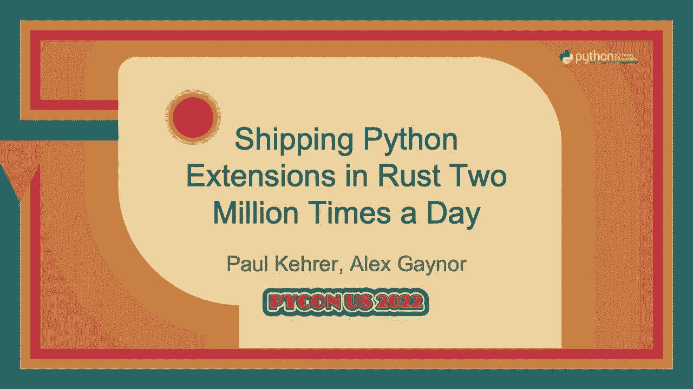
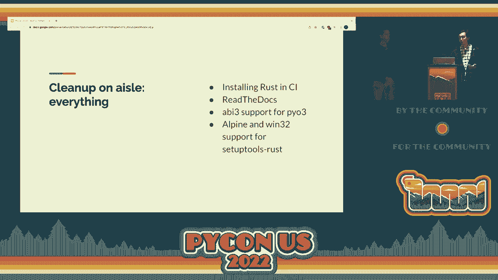

# P69：Talk - Paul Kehrer_Alex Gaynor_ Shipping Python Extensions in Rust Two Million T - VikingDen7 - BV1f8411Y7cP

 \>\> Good afternoon everybody。

 Welcome to this next session and it should be an exciting one here。 We have Paul Carrer and Alex Gainer here are going to tell us about shipping a Rust Python。 extension many， million times a day。 So take it away。 \>\> All right。 Thank you very much everybody。 So welcome everyone。 It's nice and intimidating to see you all in one room again。

 We're doing this talk as a cooperative presentation so I get the honor of introducing my co-presenter。 Alex Gainer。 Alex enjoys describing himself as a software resilience engineer which is an accurate if。 understated way to describe his passions。 He currently works for the US government at the FTC。 However， he is here in a personal capacity and is not representing his employer in any， way。

 As for me， these days I am a zoom based bobblehead and I moonlight as a security architect for。 Oracle Cloud infrastructure。 I'm here in a personal capacity。 Although if you're a cryptographic security engineer I'd love to talk to you。 Alex and I are the co-mentainers of the entire Python cryptographic authority suite of libraries。

 But we spend most of our time and effort on PICA cryptography。 The goal of this talk is to tell you about how we incorporated Rust into PICA cryptography。 First we need to explain why we did it。 And to set the table we think security is important。 As a cryptography package we think our users expect that we go above and beyond to keep。

 them secure。 After all， if you're encrypting something you probably care that you're encrypting it。 securely。 PICA cryptography depends on open SSL。 We use open SSL for all the cryptographic algorithms like AES and RSA。 And before we did all of the work we're going to describe here today we used it for parsing。 structures like X509 certificates。 Open SSL is written in C。 And C is a pretty low level language。

 This can be useful if you're trying to make an AES function that runs as fast as is humanly。 possible。 But C is also memory unsafe。 This means that it's very easy to introduce vulnerabilities like buffer overflows and use。 after freeze。 And indeed open SSL suffers from these from time to time。 Perhaps most famously heart bleed which you may have heard of。

 A full analysis of open SSL security is beyond the scope of this talk。 But in short we think it's both reasonable to rely on open SSL and we want to minimize。 our exposure to vulnerabilities in open SSL。 Paul has done a bunch of analysis and in general for large code bases written in C or C++。 about two thirds of their vulnerabilities are going to be because of memory and safety。

 Or put it another way two thirds of these vulnerabilities are avoidable with a different。 programming language。 That's the case for why not C but why Rust in particular。 Well first and foremost it's memory safe。 Meaning that as long as you don't use Rust's unsafe keywords these vulnerability classes。 like buffer overflows and use after freeze are impossible。

 It's high performance in the same way C is。 You can control the exact layouts of objects and memory allocations。 And it's got a very modern set of tooling such as a package manager， build system， code。 formatter and even integration with Python bindings。 And it's widely used at this point many many of the sponsors of this conference and many。

 other major tech companies are using Rust。 Having identified that we thought Rust was a good choice for pie C8 cryptography that。 was really enough for us to commit to figure out how we were going to use it。 But we have another motivation as well。 When Paul and I look at the problem of memory safety we see a problem that goes way beyond。 pie C8 cryptography in open SSL。 We see a problem that impacts operating systems and web browsers。

 chat applications and video， and image libraries。 And we see memory and safety vulnerabilities used against women's rights activists。 human， rights activists， nutritionists working on a sugar tax in Mexico and ethnic minorities。 And we believe something must and can be done to improve the state of security that makes。 exploiting these vulnerabilities so practical。 Part of improving the situation is making it easier for more people to adopt memory safe。

 languages。 We have a pretty significant place in the Python ecosystem。 A lot of people rely on us。 As you may have gotten from the title of this talk we have millions of downloads a day。 We regularly are in the top 20 Python packages on PIPI by downloads。 We want to use that position to make it easier for the next library that wants to adopt Rust。

 to improve their security。 As you're going to hear we have to do a bunch of work to make this practical and realistic。 We want the next person to choose Rust not to have to deal with the challenges we had， to。 So how did we actually go about adopting Rust？ Well first we had to figure out which tools we were going to use beyond the Rust programming。 language itself。 And the first choice we made was which library we were going to use for binding between Python。

 and Rust code。 We chose a library called PIO3 which wraps the CPython C API。 It's got a very ergonomic API。 It's well maintained。 It has support for basically the entire Python API surface。 And here's some example code creating a module with a single function in it called。

 double that takes an integer and multiplies it by two。 We're not going to fully explain the Rust programming language but hopefully this is。 pretty reasonable readable to you。 And PIO3 handles a lot of the details behind the scenes automatically for you such as converting。 between Rust integers and Python integers。 Noting when a Python integer is too large to fit into a Rust integer。

 all the details， like that。 So we find this to be pretty ergonomic。 I just want to take this opportunity to say that PIO3 maintainers have done an amazing， job。 The work we're going to strive here is really a testament to the quality of the library they。 have built。 Now that we have some Rust code we need to know how to build it。

 How do we make this a part of the pip install process that everybody uses to actually get。 our library？ We wanted something to be drop in as possible that would integrate with our existing setup。 tools build process。 Ideally users would just have to have Rust installed and then everything would work。 For that we chose setup tools Rust which is also from the maintainers of PIO3。

 It adds the Rust extensions option to the set up function， set up the PIO and it kind。 of does what you'd expect。 You pointed the directory with your Rust code and it will compile it。 put the 。so in the， right place and you're off to the races。 So we picked our tools and so we put together a small little PR just a basic integration。

 Create a module， one function， no problem。 Everything breaks。 So here's what we have to do in order to get even the most basic pull request to green。 Well first things first， we need Rust to be installed in our continuous integration environment。 Obviously the base image for GitHub actions actually comes with Rust installed。

 So we're good there but we also run some tests and some Docker containers so we need to install。 Rust into those environments and on top of that we also used a service called OpenDev for。 continuous integration where we also need to install Rust。 Fortunately installing Rust is pretty simple， just a matter of a single line of shell script。

 Speaking of CI， we also used the ReadTheDoc service to build our documentation and it didn't。 have Rust installed in its environment。 This was also pretty straightforward but we were able to contribute upstream here sending。 a pull request to the ReadTheDoc's official Docker image to add Rust to that environment。 Now anybody using ReadTheDocs can easily build a Rust documentation for a project incorporating。

 Rust。 Now we get to the more challenging pieces。 For many years C Python has supported something called ABI3 or the limited API。 The basic idea is in exchange for using only a subset of the C API you get wheel targets。 that are forwards compatible。 This means you build one wheel for all your Python 3 versions instead of needing to build。 one wheel for Python 3。5， one wheel for Python 3。6， one wheel for Python 3。7， one wheel。

 for Python 3。8 and so on。 We currently support five different versions of Python 3 so ABI3 is more or less a hard。 requirement for us to keep this maintainable。 It's also a really important user experience thing for when a new version of Python 3 is。 released。 We don't have to scramble to get a wheel out as soon as Python 3。11 ships。 Unfortunately。 PyO3 didn't support ABI3 and always built libraries that targeted this， full C Python C API。

 So this was a pretty involved fix。 We had to send about seven pull requests。 a few thousand lines of code and refactoring， to the PyO3 team。 Again。 they were fantastic contributing code reviews and even working on this feature themselves。 once we got the ball rolling。 But the good news is this is all upstream now。

 Anyone using PyO3 can simply turn on the ABI3 option and they'll be able to build ABI3。 wheels with Rust。 It's even nicely documented。 We also ran into some build challenges with setup tools Rust and Alpine Linux and Windows。 32-bit。 On Alpine Linux， the challenge is that Rust treats muscle libc which is what Alpine uses。 a little specially which the Rust maintainers agree is a bug but fixing it's hard to back。

 with compatibility。 As a result， we had to send a pull request to setup tools Rust that has it detect when。 the system libc is muscle and pass the right flags to Rust to not treat it specially。 On 32-bit windows， the challenge is that very often people use a 32-bit Python on a 64-bit。 windows operating system。 A lot of tools would get confused and think it needs to build a 64-bit Rust library because。

 it's a 64-bit operating system。 Again， fix was thankfully pretty straightforward。 A small pull request to setup tools Rust to have it detect that actually it's a 32-bit。 Python on a 64-bit windows and pass the right flags。 Going through all this was pretty involved。 It took us a couple weeks， maybe a couple months to get to the point where all of the。

 different tools we rely on supported the full range of functionality and targets that。 we and in turn our users need。 The good news is that this whole cost basically only needs to be paid once。 Having done all this work ourselves， it's even smooth sailing for us ever since and all。 of this is available to the next user who wants to pick up PI03 or setup tools Rust。

 So we think we hit one of that objective of making it easier for the next person。

 So as we did the engineering work， we concurrently developed a roadmap for how to actually ship。 this。 We are a foundational component of the Python ecosystem and that has made us acutely aware。 that difficulties installing our package have profound ripple effects。 However。 refusing to drop support for anything or move to more modern solutions is also untenable。

 for security and maintainability reasons。 So we attempt to balance the two inherently conflicting requirements as best we can。 We're going to talk a little bit now about how we generally make choices， why we think。 about these things and how Rust altered our math。

 This actually has broadly speaking four unofficial levels of support。 First is what we test in CI and ship via our binary wheels。 These are to use Rust's parlance tier one targets， which we have high confidence in。 and have thoroughly tested。 Cryptography will never ship a wheel for anything we do not test in our CI。

 Second， we provide best effort support for environments we can't test but we are aware。 have significant use in the real world。 For these。 we will accept patches and we'll potentially even perform significant effort。 ourselves to provide a reasonable experience。 Examples of this right now include things like RMHF and MIPS platforms。

 Third， we have， yeah， sure why not。 Where we will accept patches for less important architectures and OS's as long as they're reasonably。 wet written and pass our CI gates。 And then finally。 there is the set of things we consider entirely unsupported。 For example。 versions of open SSL that are too old， Python versions we have chosen to。

 drop and arcane architectures where support would require significant modification of。 the code base。 A good example of this is something like S390， not S390X。 If you want these things to work， you're going to have to fork us， sorry。 So we have the data that we want to use but we get it from this big fire hose called the。

 PIPI statistics。 So how do we use that？ First usage of Python versions。 We actually choose to drop support。 We would love to drop support when the upstream drops support。 This is unfortunately not practical。 We drop support as usage drops under a threshold。 like for example 5% or less。 Dropping a version for us is a concrete barrier because when we drop support for Python version。

 we tend to immediately start using features from our new minimum。 This means that there's typically no way to run our code on an older Python。 When we began this work， cryptography actually still supported Python too。 But PyO3 did not。 We had already chosen to support Py2 well past when CPython did。 In fact。

 we had made a decision early on that we would support it at least one year past。 the final sunset date。 And PIP had dropped support as well。 But this gave us an even stronger reason to finish our deprecation。 Fortunately。 the statistics that we had showed usage dropping very rapidly and this was not。

 actually an issue for us。 Within the set of Python 3s that we were interested in supporting。 which was 3。6 and， above， our Rust dependency that we were adding through PyO3 was not affected after the work。 that Alex and the PyO3 maintainers had did in the previously mentioned contributions。 Next of course， operating system。 We support Linux， Mac OS and Windows directly in our CI。

 But we of course provide best effort support for other operating systems like FreeBSD， Open。 BSD and even some more esoteric things。 But of course Linux is itself not a monolith。 And at the time we were looking to ship Rust， PIP only supported many Linux wheels， which。 excluded Alpine and other muscle-based distributions。

 This meant that adding Rust would at minimum require Alpine users to install Rust C as part。 of their build process in addition to the existing GCC and Clang requirement。 GCC or Clang。 I mean。 you're welcome to install them both。 Obscure operating systems might also lack Rust targets。 but ultimately we decided that holding， back the entire ecosystem for niche areas wasn't unreasonable。

 Wasn't reasonable， rather。 Those unusual edge cases can and should get LLVM and Rust bootstrapped in their world。 much， like they did with their C compiler。 So cryptography tests and ship wheels using x86。 x8664 and ARM64 both ARM V8 and Apple， silicon。 We get occasional requests for various other architectures such as ARM HF or PowerPC64。 a little and the end。 But as previously mentioned。

 we only directly support what we can test against。 However。 those best effort targets should still compile and generally work。 So we need Rust to export at least the broadly popular CPUs in the desktop， mobile， server。 and even some of the embedded world。 Rust supports all these targets along with many more。

 but we realize that there may be， some silent users looking where this could be challenging。 So even though most of our users get a wheel， we do want to allow users to compile their。 own versions。 This means deciding on a range of open SSL versions to support。 We support various versions of Libre SSL and most recently boring， in addition to all。

 the versions of open SSL that we currently have supported。 The PIP data that we get is critical in making these decisions about when we can drop older。 versions， which frequently carry significant support burden。 But it didn't affect our Rust release。 so I actually mention it here only for the sake， of completeness。 And then of course。

 as you might imagine， we're interested in the version of Rust， the Rust， compiler that they have。 that users have available。 So we've recently convinced the PIP folks to add that。 So the data we had gave us reasonable confidence that the vast majority of our users would either。 be entirely unaffected or would be able to continue using the project with some changes。

 to their build pipeline。 But how do we let people know this change is coming so they can make plans and invest。 in the areas needed to ensure their chosen platforms still have access to this project？

 We first announced that we were considering adding Rust code to PICA cryptography on August。 2020 on our cryptography-dev mailing list， along with a GitHub issue we invited people。 to comment on。 We followed that up with another email in December 2020 that also outlined our general。 release plan， which we can summarize as the next release， which would be 3。4， would include。

 a Rust extension module， which would be built by default but would not be required for cryptography。 to work and could be disabled at build time with an environment variable。 The release after that。 which we ultimately versioned 35， not 3。5 for reasons we will， get into soon。 would include a Rust extension module without which cryptography could not， work with。

 In other words， we would depend upon Rust for actual core functionality。 This two-step plan was a result of community feedback， specifically Jeff T。 So thank you， very much。 Jeff， and designed out of a recognition that very few people follow mailing lists。 or are issue tracker on a consistent basis。 They wouldn't be aware of this change without us putting it front and center。

 but breaking， them with no escape valve was an anti-goal。 It was not our desire to break people。 So after all this， we released 3。4 on February 7， 2021。 Hooray！

 This allowed us to both let people know Rust was coming， but also let people who weren't。 quite ready to add the cryptography but don't build Rust flag to their environment variables。 so they don't have to immediately make changes to their build pipelines。 We expected feedback and。 well， we got it。 So the vast majority of our users experienced no breakage in this transition。

 However， amongst the minority who did， and to be very clear， we considered that minority。 significant and important to us。 They existed a subset who were willing to provide feedback。 It took various forms。 It also started getting a bit heated。 We also saw this release。 got some attention in places you wouldn't expect， which ultimately。

 spawned some other articles talking about trade-offs we had chosen to make。 So throughout this process， we were taking what we learned from our users and trying。 to provide improvements as quickly as we could。 First we got a bug in our new type-ins。 which there's a lesson there。 Don't ship other stuff with your big rust change。

 We also realized we should provide more robust debug output when compilation failed for people。 who aren't C and rust experts。 One of the unfortunate things when we build these things is we become experts in the very。 things that are the most opaque to the users who are having problems。 So day two was spent improving our documentation， making our errors even more debugable and generally。

 learning from user confusion to build more paved roads。 And again。 don't ship other invasive changes with a rust transition。 After this。 we added a test in our CI that tests for all possible import cycles because。 that was really annoying。 And finally， on the 13th， we released a version that dropped our MSRB。

 our minimum supported， rust version， and also pre-announced a new versioning scheme。 So what lessons did we learn from all this？ Well one common point of feedback we got initially was that while we documented that don't use。 rust environment variables in the documentation， it wasn't clearly linked to from either the。 error message or the change log。 The flag was simply not as discoverable as it needed to be。

 Errors out of PIP when compilation fails can be extraordinarily verbose。 So catching that and then emitting a more friendly message with both a set of relevant。 environment information as well as links on how to some common problems went a long。 way towards minimizing the time it took users to get their environments working again。

 This is the difference between a pile of Rust C or GCC failed output and one that has like。 a pretty output that says， "Hey， look， you should consider doing the following things。"。 And if those fail， please submit an issue。 Additionally。 for users who were willing to immediately jump into our rust requirement。

 we didn't provide enough information about required rust version or how to obtain it。 Typically users obtain their C compiler directly from the operating system and the version。 barely matters。 But in the Rust case， our minimum supported rust version was higher than some of the older。 Debian and out-client installations requiring the user to learn how to install Rust up。

 which is an alternate mechanism installing these things。 These items were potentially foreseeable errors on our part。 Our own familiarity with the code base and tooling required resulted in a failure to。 systematically examine failure cases and think through user experience。 We considered some of these。

 but failed to give users with problems good enough tools， to fix their issues。 We also discovered just how many people pinned cryptography assuming semantic versioning。 When 3。4 made this change and their build pipelines blew up， this shocked them as they。 believed we were breaking an unwritten contract。 While Alex and I both have very strong feelings about the value of semantic versioning in general。

 as well as specifically in the case of security critical libraries like cryptography， we also。 don't want to surprise users。 So accordingly， we reversioned our library such that every feature release is now a new。 major version， 35。0， 36。0， et cetera， in the vein of Firefox's version numbers。 A talk about versioning could fill 30 minutes alone， so if you want our full hot takes。

 you'll have to find us in the hallway track。 Finally。 when things aren't working and people are under pressure， tempers run hot。 We had passionate people both defending us and registering their objections to some。 of our decisions。 But an issue this emotionally charged results in that defense occasionally looking more。

 like an attack， and many users couldn't tell the difference between those overly zealous。 defenders and the actual core maintainers。 This led to a less civil discourse than we would have preferred。 So having shipped a module that incorporates Rust into the build process but ultimately。 does nothing of use， the next step was do something useful with Rust。

 Get the value out of it that is the reason we're using it in the first place。 Luckily for us。 we had a few concrete use cases in mind。 First we wanted to replace the small amount of C code we've written ourselves for handling。 things like cryptographic constant time operations。 And second。 we wanted to replace open SSL's X509 layer in all of the parsing code for， ASN1 that it contains。

 There's actually not a ton to be said about the process of replacing these things， because。 mostly we just stuck to the best practice you'll hear about anytime you think about rewriting。 things。 Make sure you have great test coverage。 Don't rewrite everything at once。 Break up your rewrite into small components。 Make sure things are working all along the way。

 Right don't leave things in half broken state。 And so really the process of migrating to Rust is just a series of small pull requests that。 keep tests running， add new test cases where we got concerned there wasn't enough test。 coverage and attempting to measure how we were getting benefit from this。 So for example。 even though our primary motivation in this effort was security， we also got some。

 really big performance wins。 In the benchmarks we've got here。 we migrated the parser for the OCSP request class from。 an open SSL and CFI implementation to the Rust implementation。 The result is it is now 10 times faster than it used to be。 This might come as a surprise。

 Open SSL is written in C。 C is fast。 C may be fast， but it's not magic。 Open SSL's parsing code performs a significant number of allocations and memory copies。 Because of Rust safety features， we were able to easily write parsing code without any。 allocations and without any memory copies。 We're still having confidence that we weren't introducing these memory safety vulnerabilities。

 we talked about at the top。 We also got big benefits out of this in terms of architectural improvements。 Specifically， our X509 API's implementation used to be deeply intertwined with the open。 SSL implementation of other components of our library。 This means this meant we'd have APIs that said things like "take a private key，" but。

 in practice would be totally broken if it wasn't an open SSL private key。 Using this code in Rust。 let us make the API boundaries between these two components， actually much clearer。 And now things like sign a certificate with a private key in a cloud key management service。 actually just works。 And here's what our adoption curve looked like。

 The blue sectioner downloads the versions with no Rust， the redder versions that contain。 the optional Rust， and the yellow versions that require Rust。 There's really two things I noticed about this。 First。 adoption of a new version happens in two phases。 First it happens all at once。

 and then it happens slowly。 Immediately after we release a new version。 nearly half of our users will be updated， indicating。 they're almost certainly not using any sort of version or hash-pinning。 After that。 adoption increases very gradually。 Right now we're at a point where approximately 80% of our downloads are processed in a facility。

 that contains Rust。 And we'd like to get that 100% obviously。 We know the blue section and no Rust is a mix of causes though。 Some of it is folks deliberately pinning to versions before we had Rust。 Others of it are users pinning to our 2。x series， presumably because of expectations around。

 semantic versioning that are not actually accurate for us。 So we hope we've convinced you in this talk that Rust is now a viable choice no matter。 how popular your project is。 Much of this ecosystem work was done out of necessity。 but the vast majority is now complete。 We were also thrilled to see that other developers took up the challenge to implement the muscle。

 Linux standard across PyPA and PyPI， which gave out-pine Linux users access to wheels。 much like we already had for Debian Ubuntu， Red Hat and other Glib C based distributions。 And of course， we've hopefully weathered this storm of legitimate concerns， well-meaning。 but confused people and angry trolls。 If we can do it， so can you。

 Next time you find yourself reaching for the Python C API to eke out some more performance。 take a second and maybe reach for a nice cold glass of Py03。 There is however room for future improvement here。 For example。 alternate OSes such as FreeBSD and OpenBSD are still required to build from， source。

 It would be nice to be able to potentially define standards where that is no longer required。 Additionally， to streamline the experience even more， we could investigate better binary。 build tooling， moving setup tools rust into setup tools， or better integrations with C Python。 itself。 The experience today is excellent for most users， but we can make it better。 Oh。

 and as announced via the Python announce list， and in this talk right now， the next。 release of B-Crypt will be pure rust。 Thank you very much。 [APPLAUSE]。
