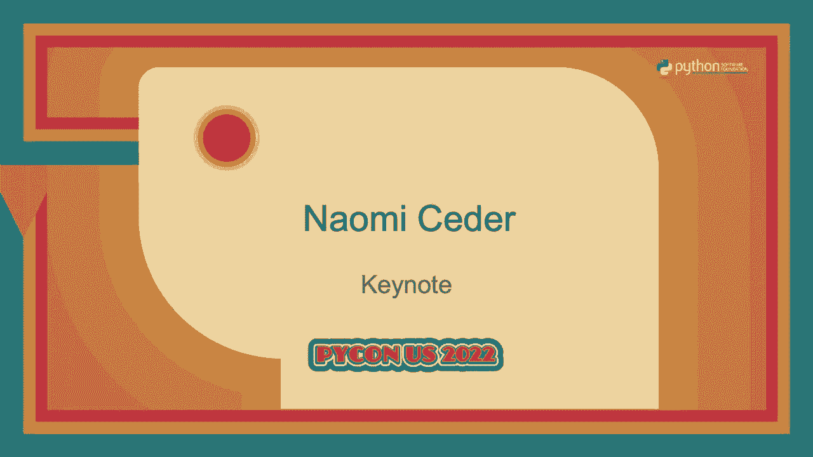
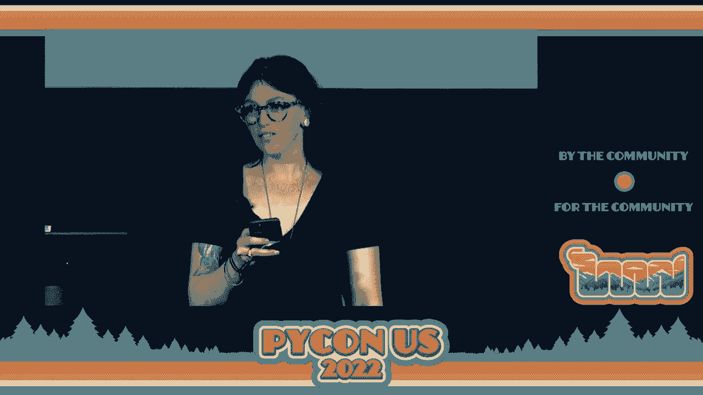
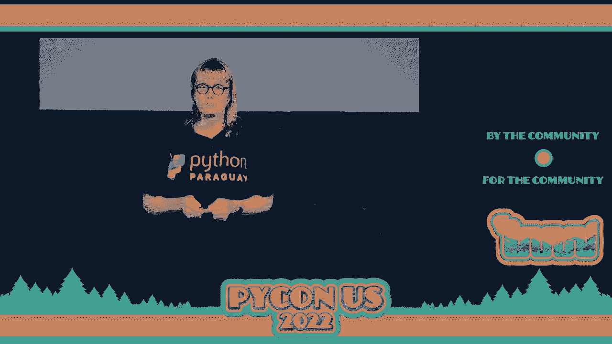

# P7：Keynote - Naomi Ceder - VikingDen7 - BV1f8411Y7cP

 I am very pleased to introduce you to our final keynotes。

 She is a Python user since 2001 at PyCon US attendee since 2003。

 One of the originators of the poster session， the education summit， the intro to sprints， sessions。

 the PyCon charlars and the hatchery programs。 She's the co-founder of Transcode。

 I could go on and on about everything she's done for this community。

 She's one of our most prolific community members。

 I'm pleased to introduce Naomi Cedar。 Well， good afternoon。 I'm honored and delighted to be here。

 And before anything else， I'd like to note that this is our 20th PyCon。 Yes， number 20。

 My 20th PyCon is well， I might add。 And I would like to give my deepest thanks to the organizers。

 the staff， the volunteers， and to all of you for making this such a joyful return to the world。

 So thank you all。 Now， I call this talk a time of gifts。

 And that's inspired by this little gem of a travel memoir that was written by a man named。

 Patrick Lee Fuhrmer， who in the 1930s， after being thrown out of his last year of British。

 public school because he wasn't serious enough， decided to walk from the Netherlands， up the， Rhine。

 across Europe， down the Danube， and ultimately to Istanbul。 Now this took him a couple of years。

 but the focus of his book is not on the places and， the sites he visited。

 nor is it on the historic events that were unfolding around him because。

 he was crossing Germany and Austria as the Nazis were coming to power。

 Yet he seems to barely notice that。 Instead， he is interested in the people he met along the way。

 boatmen， truck drivers， farmers， shopkeepers， even occasionally an aristocrat。

 and their gifts of food， shelter， and companionship。

 which sustained him along the way in that long journey。 And for me。

 and I would imagine for many of you， my time in this community has been my， time of gifts。

 Gifts that have sustained me in so many ways on my journey over the past 20 years to various。

 continents， across two genders， through different stages of my life。

 So that led me to think about how we value and share the gifts of our community and how。

 people have compared open source communities like the Python community to a gift economy。

 Now here at PyCon the other day， I heard somebody say， "In Python， people know how open source。

 works。"， Maybe。 There are a lot of ways to look at communities。

 I wonder if that understanding of how open source works is the same for everyone。

 I certainly expect there are a lot of opinions。 But I do think it's important for communities to think about and to articulate how they。

 think their principles should work， how their communities should work。

 And I want to present a way of thinking about our community that makes sense to me。 And who knows。

 maybe it will at least be fodder for some discussion。 So to be clear。

 what I'm about to say is purely my own opinion。 I stepped away from the PSF board two years ago。

 Please don't blame any of them for this。 But I would say that as a community。

 a community that is organized around an open source language， and an open source ecosystem。

 we do have a gift orientation。 The thumbnail definition of this is that people contribute what they can。

 when they can， and， in turn share resources and help contributed by others in the community。

 The thing is we're so used to the values of a market economy that it's sort of hard for。

 us to consciously grasp how this works。 This kind of gift giving is not barter。

 We're not doing a one-for-one exchange at the same time。 And the goal isn't to come out even。

 or actually some studies say that a lot of cultures use。

 barter as a way to kind of take people from a different group。 It's not that。

 That's not what I'm talking about。 Instead， I'm talking about someone contributes something and then at a later time they're going。

 to share something that someone else has contributed。 No one can demand a gift。

 yet everyone accepts that they're going to contribute as they can。 For example。

 in hunter-gatherer societies， if somebody finds some food or makes a kill， or whatever。

 they share it with the entire group knowing that everybody else is going。

 to do the same thing if they get the chance。 So this is the sort of gift giving that I think we see a lot of in our Python communities。

 Some people are contributing code， others documentation， still others the labor to hold。

 community events like this one， and all of those gifts are freely given and everybody。

 enjoys the benefits， right？ I mean， it's kind of like a utopian and archosyndicalist commune。

 or what the animals had in animal， farm before the pigs turned into totalitarian dictators。

 And I think for many of us who love this community。

 this is the narrative that we turn to particularly， in misty nostalgic moments。

 which old-timers like me experience every pike on。

 But I think in those moments we tend to forget that things are never quite that simple， never。

 quite that perfect， never quite that idyllic。 As Python and our community。

 our projects and our gatherings have grown， things are not， so clear。 In fact。

 a lot of people these days I think are questioning whether this model of open。

 source powered by gifts is still sustainable。 I suppose part of the problem is that the open source world in general and Python in particular。

 have been almost too successful。 Even as we've grown in every aspect。

 the number of users in their demands has grown exponentially， faster。

 How can such a relatively tiny group of volunteers keep a community and a language used by millions。

 going？ And I think if we look a little bit， it's easy to find examples where things go wrong。

 And the issue in particular is burnout of the volunteers that make everything work。

 Many times I've seen what I call shooting stars。 These are people who burst onto the scene and start contributing to the community。

 usually， in multiple ways， showing seemingly superhuman amounts of energy and enthusiasm。

 Only a few months after their first events， they're organizing other events， they're teaching。

 courses， they're contributing code and more。 And they're so successful。

 they're so eager to help that we give them more and give them。

 more and give them more to do to the point that people like me start wondering how can。

 anyone possibly do that？ The answer usually is that they can't， at least not for very long。

 And in those cases we'll start to notice them getting tired， enthusiasm， fading， even as。

 they get involved in more and more things。 I've had some people like this take me aside and quietly ask me how to deal with the stress。

 how to keep all of the balls in the air。 And when I tell them that the answer is to do less。

 they have a hard time accepting that。 Sometimes I think maybe they would like to。

 but by now they don't have the time。 They've got an event to organize。

 a blog post to edit or code to write or calls to jump on， or whatever it might be。

 And in many cases， not all， but in many cases after a few months， a couple years maybe they。

 start to fade。 Emails will go unanswered， deadlines will slip， pull requests ignored， calls missed。

 whatever it might be。 Because the demands of all that they were doing for free as volunteers combined with。

 work， family， everything else， literally sucked all of the energy out of them。 The tank is empty。

 they have no more to give。 And the relationship between them and the community is damaged。

 often irreparably。 I've also seen people who've maybe started slower。

 focused on one thing built over the， next 20 years until they've become key developers。

 maintainers of a project， key community organizers。

 And they've been doing what they've been doing for many years， usually hearing more。

 complaints than praise。 And they feel like their work is being taken for granted。

 Many cases they may have too much invested emotionally to walk away， but they're tired。

 And I'm wondering how long they can hold on。 In fact。

 sometimes these leaders have given so much more than anyone else， they end up。

 kind of running the project alone。 They hold the credentials whenever something needs to be done。

 it goes through them。 And when they're encouraged to share the load， they tend to say， "Oh。

 now I can handle， it。"， And besides， it's more work to train somebody new。

 or "I don't know how to onboard somebody，"， or， you know。

 there are lots of things that will keep them from doing that。 But on the other side。

 we have people who would love to contribute。 And we see this all the time where they're eager to contribute something。

 but for one， reason or another， it goes wrong。 They might be ignored because nobody knows how to onboard them。

 Maybe the people running that project think they have enough people already。

 Maybe they're just talking to the wrong people。 Or maybe they're trying to contribute something that isn't appropriate。

 Maybe they're trying to come in way above the level of what they actually understand。

 Now if that's the case， if they're trying to come in at a level， they can usually be。

 redirected to something maybe a little bit more appropriate to start out on。

 But for a lot of those others， it seems to me they just fall through the cracks。

 And each time they try to get involved and somehow get turned away， they're less likely。

 to try again and we end up losing those people。 So the end result is that our projects。

 our community initiatives， whatever it might be， are at the risk of dying as people burn out and are not replaced。

 And that's how we end up finding projects that are abandoned， you know， with unanswered， issues。

 ignored PRs， out of date dependencies。 We find community initiatives with deserted mailing lists。

 ghost town slacks， all of that。 And occasionally maybe one of these will be revived。

 but most of the time they're just， left behind。 So some people see this as just the way that open source projects work。

 I was reading an article a couple weeks ago on the sustainability of open source and a。

 developer and maintainer of several Java projects characterized open source as this is a quote。

 a model that relies on people giving more than they can for very little or nothing in return。

 hoping that there will be someone to take over the mantle when the previous person burns， out。

 That description of how open source works tells me that if we are in fact a gift-giving culture。

 which I would argue we are， things are going wrong。

 We have people giving more than they can sustain， others who are barely able to sustain what。

 they give but feel they aren't receiving anything in return。 And you know， by the way。

 I'm sure that these feelings of not getting anything in return。

 are made worse by seeing companies all over the place use their work for free in place。

 of things that they had been paying cans or hundreds of thousands of dollars for without。

 acknowledgment， usually without them giving back anything too。 So that's a very demoralizing thing。

 And then also， as I mentioned， we have other people who feel that their gifts are being， rejected。

 And this last is actually a pretty serious thing。 In gift-giving cultures。

 refusing someone's gift is an insult。 You're basically telling them you don't want them to be part of your community。

 So that happens。 It's no wonder that they're not going to be around to help take over a project。

 So clearly， there are some challenges that we face as an open source community。 The question is。

 what do we do about it？ What can we do about it？ And to my mind。

 the first step is to understand what's going on。 What are the motivations and the values that are driving our community？

 And I think this is important。 I know from many experiences in my life that the narrative。

 the way that you think about， something， has an enormous impact on how you are able to deal with it。

 Sometimes there are ways of thinking about a problem that will actually keep you from。

 finding a solution。 And indeed， there are many times where I've found that changing， clarifying。

 modifying， the narrative， the way that you are actually thinking about the problem is an essential。

 first step in dealing with that situation。 So what does drive our communities？

 Why are we here at a conference like this where there is so much talk about community？ Well， again。

 this is for the old-timers。 And 20 years ago， the most popular explanation。

 at least according to the cathedral and the， bizarre， the old-timers know what I'm talking about。

 was that open source was driven by， self-interest。 Enlightened self-interest， perhaps。

 because it was much easier to get what you wanted， if you were agreeable， but still self-interest。

 People only worked on what interested or benefited them， the famous scratch your own， itch。

 And beyond that， the only other motivation for doing open source things was the ego。

 boost that you would get from reflecting that you were the one to solve a problem。

 And that everyone interested in that project would know that。 In fact。

 even if you were to do something nice， something completely altruistic without。

 an explicit ego boost for payback， that was only because you could then reflect upon how。

 noble you were and get your ego boost that way。 In other words， no matter what you did。

 it was self-interest all the way down。 And along with this。

 there was this belief that if you had enough genially selfish people。

 working to scratch only their own itches and boost their own egos， this would somehow。

 result in the best of all possible worlds for everyone。 Now， as you may notice。

 this view doesn't have any room for community， for service， for， altruism。

 And if that's the view you've got of open source， then there is no problem with any of。

 the examples I mentioned before。 You've got rapid burnout and departure。 Well。

 level of their interest is no longer high enough for them to continue。

 Must not have achieved enough ego boosts。 So where you go？ Your volunteers are exhausted。 Well。

 look， if they're doing what they want， they'll continue。 And when the rewards aren't great enough。

 they'll quit。 So where it goes？ Abandoned projects？ Well， so what happens？

 There's not enough interest。 Better learn to deal with that。

 And what about those volunteers who wanted to be， those people who wanted to be volunteers。

 got turned away？ Well， they must not have wanted it bad enough， or maybe they weren't smart enough。

 or push， you enough， or whatever enough to force their way in。

 So as I look back on some of that stuff that was sort of a common interpretation of how。

 we worked 20 years ago， it comes off to me as an adolescent mix of iron-rand and liberal。

 capitalism。 And mercifully， it seems to be falling out of favor。 I hope so。 I believe so。

 And I'm not really trying to claim moral high ground here。 I think back in the day。

 a lot of us didn't really question that at first。 Even though in practice。

 most people didn't actually behave that way。 People weren't actually， as far as I can tell。

 driven only by ego boosts and self-interest。 You know， even in those days。

 we all benefited from what we were doing。 That was pretty clear。

 But there were too many people doing things for community， generous things， altruistic， things。

 for self-interest to be even the main thing that was driving us。 But if you'd asked。

 I think a lot of us would have explained， yeah， that's how open source， works。 And to my mind。

 that narrative of self-interest was damaging to the open source community， in general。

 to the Python community in particular。 And I think that even now， 20 years ago。

 we're still kind of dealing with the after effects， of that。 And in fact。

 I think Brett Cannon's favorite phrase， which I have stolen so many-- and。

 I'll borrow it because I did ask permission。 I wish I have used so many times。

 I came for the language， but I stayed for the community。

 Kind of sums up this change in thinking from the old days on what's important in the world。

 of open source and Python。 So that brings me back to this notion of gift giving as essential in our community。

 And again， let me go back to the hunter-gatherers， the classic example of this。

 If a hunter makes a kill， they share with everyone。 I mean， sure， they want to eat。

 But so there is self-interest， but they also share it with everybody。

 And it's not even considered to be something special。 It's just what you do in that culture。

 So we're not hunter-gatherers， I'm not suggesting we go out and make a kill and share what-- no， no。

 no， don't get me wrong。 But I would argue that this pattern appeals to most of us。

 I think it appeals to humans in general。 And if you look at how people behave in our community。

 I think it's pretty easy to see， the same ethos at work。

 People who contribute code do so because they can and because it improves things for everyone。

 Now certainly sometimes the code that they contribute addresses a personal need， but many。

 many times it doesn't。 And the same thing is true for people who are， say。

 on a PSF board or for event organizers。 They give a lot of effort。

 a lot of labor that doesn't benefit them personally。 On the other hand。

 we can all-- or we should all be able to count on sharing the benefits， of the community。

 And in addition to the software， things like Python， there are lots of other benefits too。

 like support and friendship。 Maybe it's education and skills。

 Maybe it's professional contacts and increased networks and opportunities。

 I know that I myself have pretty much benefited from all of those from being offered my first。

 book deal to making so many friends from other countries that I now spend a large part。

 of my time learning languages to Python nine years ago， which as it happened， my father。

 died very early on this Sunday morning and there was no way I could get back at any time。

 And that evening， a number of people from the community， people that I didn't even really。

 know that well， made a point of sitting with me so that I wouldn't have to deal with that， alone。

 So there are a wide range of benefits that we can get。

 But the interesting thing for me about cultures that rely on gifts is that the whole process。

 is so vague and so messy。 There's really no way to determine that sharing one deer equals so many fish。

 equals so many， apples or whatever。 Or in our world。

 there's no way to say that so many code reviews equals a conference talk， equals a board meeting。

 et cetera。 There's no way to keep tit for tat accounts。

 What we can all count on is that when someone is able， they will make a contribution in which。

 we will all share。 And in turn， we will all probably contribute what we can when we can。

 And this messiness is not a bug。 It's a feature。 Not knowing this timing or the precise values of the contributions works to bring people。

 together。 No one can ever say they're completely even in square with everyone else and walk away。

 Instead， there's kind of this realization that our fortunes are all entangled。

 We're all in this together。 So in other words， this giving of gifts。

 mutual contribution is what helps bring people together， and create community。 And for me。

 articulating gift giving is what drives our culture， what creates our community。

 leads me to a couple of things that I think we can do better and things that we need to。

 think about if we want to preserve this community， if we want it to continue to grow and thrive。

 So on an individual level， if we consider everyone around us to be contributing to the。

 best of their abilities， to be giving their gifts to the community， I believe we will treat。

 them and ourselves differently than if we think we're all in it for self-interest and。

 we don't owe anything to anyone。 And I would say that understanding that we're all benefiting from the contributions of others。

 makes it easier to appreciate that work， the gifts that they are giving。

 One hopes it will also prompt us to show that appreciation， something that so many volunteers。

 receive far too little love。 And it probably should make us less critical of others since we can understand their contribution。

 as a gift freely given。 It's not an obligation。 It's not a transaction。

 And when we think about those shooting stars， maybe who burn themselves out， maybe reflecting。

 on gift giving will help remind them that there is no need for any of us to give more。

 than what we can。 What we are able to offer at any particular time is enough。 And in turn。

 we are able to share in the contributions of others。 Maybe even， I hope。

 some of us who've been around will be more inclined to give people。

 who are over committing the gift of reminding of that。 Hey， it's enough。 You can take it easy。

 And this is particularly important。 I think the mindset of this kind of gift-giving community may also help us be more willing。

 to share the load， to respect what others are bringing， and to give the gift of allowing。

 others to take on the tasks that we've been doing。 As I've said earlier。

 rejecting someone's gift shows a lack of respect。 By rejecting a gift。

 we say we don't want them to be part of the community。 So keeping that in mind。

 I think we want to be sure that there are ways for new and different， people to contribute。

 to give their gifts。 And in turn， we need to give them the gift of mentoring and guidance so that they can。

 And a part of this is the need to hand off leadership generously， to share positions of， leadership。

 And this is something that benefits the giver as well as the receiver。

 I am pretty sure that one reason I've been able to stay active and involved in our community。

 across 20 years has been that I've had a very deliberate policy to hand off the leadership。

 of any project I've ended up leading to new people after three to five years。 In fact。

 here's the pro tip。 If you're in a position of leadership and you're wondering about when you should start thinking。

 about training and finding a successor， the answer is the first day that you are in that。

 position of leadership is when you should start thinking about that。 Okay， it's really easy then。

 We need succession planning。 It is not easy at first。 It feels like a loss。 But it is。

 It helps the new people grow and it keeps the experienced people fresh because you can then。

 go on and do something else。 You don't have to just quit。 So I recommend this very highly。 Okay。

 The other area where I think a sense of clarity about what makes our community work is really。

 important is when it comes to money。 So far I have deliberately not mentioned the dominant form we have of sharing resources。

 which is a market economy with exchanges based on money。

 I could go on and on about what a wonderful scam money is。

 It can be imaginary as long as we all believe in it and everybody in the world seems to。

 believe in it。 It's the one article of faith we all share。 Then money works， but let's not go there。

 The thing about money is it has a tendency towards exact transactions， the exact opposite。

 of the messiness you get with gift-giving cultures。

 And that means in fact it works against connection and community。 If you give me something worth $2。

52 and I in turn give you $2。52， we both know we're exactly， even the transaction is done。

 There is no need to continue any relationship。 Transactions don't build community。 For that reason。

 particularly as a community， I think we need to be very， very thoughtful。

 about how we deal with money。 I am not naive。 In this world we pretty much all need money。

 And I can testify it's better to have a bit more of it than not to have enough of it。

 That's true for us as individuals。 It's true for our communities and the PSF。

 It's just true in general。 And certainly when we as like say the PSF ask people to make helping our community a full-time。

 job， whether that's managing our community events or our infrastructure or coding process。

 or whatever it might be， those people deserve to be paid fairly， actually I would say generously。

 And we also want to make our communities， our events more inclusive。

 And that means that many people will need financial help to take part。

 And if we want to foster communities around the world， that also takes money。

 And I think we know that for many， many reasons these days that is going to take even more。

 money than it has before。 So we clearly need financial resources for the community， for the PSF。

 for our meetups， for lots of things in order to grow and flourish。

 What I worry about is the notion that we should make monetary exchange the driver of either。

 the way we get financial resources or the way we share them。

 So let me explain a little bit what I mean by that。

 What I mean by that is that when we go about raising money and using money for the community。

 we need to be very careful， very wary， we need to avoid becoming "a business。"。

 I don't have anything at all against business， mind you。

 I have made a living working for businesses and helping them succeed。

 And I certainly appreciate the support that businesses have given our community。

 That's not what I'm saying， but I would argue against our Python communities， the PSF， ever。

 acting like a business。 I worked for various companies over the past 35 years and no matter what HR or marketing。

 would like you to believe， being an employee is not being in a community of shared contribution。

 with your employer， at least not in the companies I've seen。

 Or is being a customer being in a shared community of contribution。

 If our contributors become employees and our sponsors become customers， if we become a， business。

 I believe our community will be diminished， if not destroyed。 Now I admit that I am biased。

 but I think so far the PSF and the Python community have， handled this well。

 The PSF has hired people to support the development of the community to help enable people to contribute。

 more successfully across all the areas。 There has been money spent supporting smaller regional and local groups and helping those。

 communities grow and contribute。 And there has been financial aid for Python and other conferences that has helped people。

 who otherwise wouldn't be able to join and make contributions at this level。 In addition。

 so far I think the model of sponsorship that's been developed is for support for the。

 PSF generally without corporate strings attached。 And I believe this is the right strategy。

 As we interact with the business world， we should not， as a Python community， as the PSF， and so on。

 try to become a business。 And there is a temptation for that。

 People have suggested things that start to go in that direction。 We should not become a business。

 but rather we should invite those enterprises to join， in our world of free contribution。

 Now that does mean selling those businesses on hard to quantify intangible benefits。

 And that's a tough sell， but it's not impossible。 And I think it's worth it。

 I think it is the way to go。 The thing is we're still in the early days。

 As late stage capitalism becomes harsher， which I bet it will， as Python's importance。

 and big tech's power both continue to grow。 I think that the tension between the market economy around us and a community centered。

 around gifts is going to grow。 In other words， I think it's pretty inevitable that there will be more pressure on us to abandon。

 our culture of gifts and free contributions in favor of transactions。 I mean。

 it could be companies trying to buy control over the language and/or the community。

 It could be pressure from various sources to treat our contributors and volunteers more。

 like employees。 Could be any number of things。 I really。

 there are so many possibilities that I can't begin to suggest what it might， be。

 But in the coming years， I am pretty sure that there will be many， many opportunities。

 to sell out our community for one tempting offer or another。 If and when that happens。

 it will be up to us to decide whether we still want this community。

 to be a place of free contribution and a time of gifts。 And I， for one， already know my answer。

 Thank you very much。

 It's been a pleasure。 [APPLAUSE]。