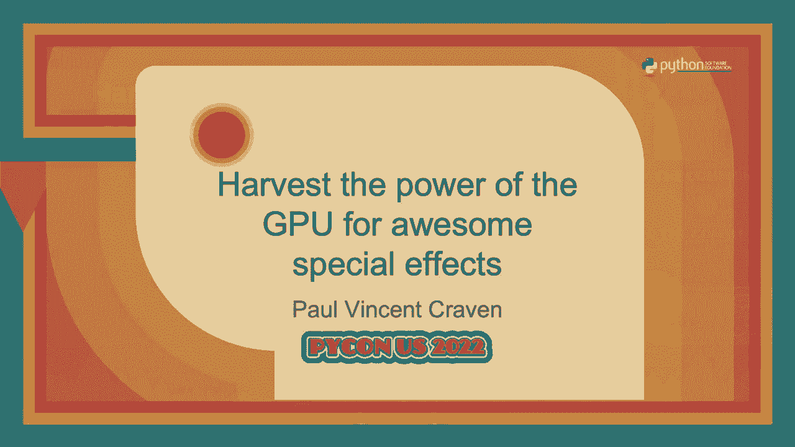
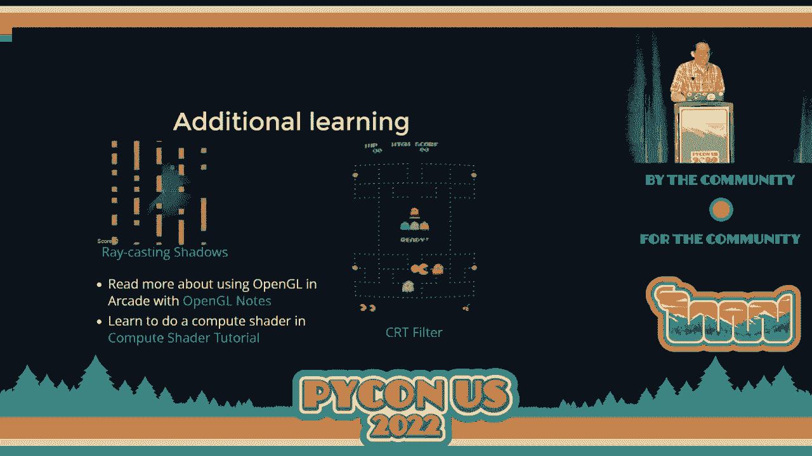

# P70：Talk - Paul Vincent Craven_ Harvest the power of the GPU for awesome special eff - VikingDen7 - BV1f8411Y7cP

 >> Hello， everyone。 Welcome back。 We have a next talk。 Harvest the power of GPU for awesome。

 special effects by Paul Vincent Craven。 Over to you， Paul。 >> Thank you。 Hi， I'm Paul Craven。

 And if you would like to copy， paste any code samples。

 if you want to refer to stuff later or find additional info that tiny URL that's on the。

 screen will give you a page with all of that。 The goal of this talk is to show you how your。

 programs don't have to be limited to just using the CPU。 You can also use your graphics card。

 known as the GPU to harness and do a lot of really awesome special effects。 You can offload。

 a lot of graphical work from your CPU to your GPU。 After all， you just have thousands of。

 processors sitting there waiting for you to give them something to do。 This animated cyber。

 image is run completely on the GPU side。 The CPU is doing nothing while it's going on。 And in fact。

 that glow effect is kind of difficult to do well on a CPU， but on the graphics card。

 it's made for doing this。 And it's really easy to add that glow effect。 So in this talk here， here。

 I'll briefly show you some of what you can do with the GPU and a little bit of conceptual。

 information on why we do things a little bit differently if we have to end up using the。

 GPU as opposed to the CPU。 And I'll also show you how easy it is to get started doing this。

 yourself。 With less than 50 lines of code， you can get started offloading stuff onto the， GPU。 Oh。

 and again， on this one， yeah， the GPU is doing all the star， flashy animation。

 movement and the CPU is not doing a thing at all。 So what more things can you do with。

 the GPU aside from cool background animations？ If you want to draw graphical images on your， screen。

 the sprites， the squares， the fundamental building blocks of a game， using the GPU is。

 much faster than using the CPU。 PiGame， which has been around forever， is a classic CPU based。

 library。 And it does really well up to about 2000 or so sprites on the screen。 Once you。

 get beyond 2000 sprites， depending upon your computer and what else is going on， your frames。

 per second really start stopping off fast。 But if you use a GPU based library that offloads。

 all that sprites onto the graphics card， you can not only do more than like 2000， more than， 14，000。

 but you can even have a million sprites on your screen and have those things be rendered。

 So it's not just a little bit faster。 It's a whole nother ballgame if you end up using。

 the graphics card。 You can also create games that aren't just with pixels， but you can。

 add the glow effect， the flash， all of those particles flying out。 All of those are completely。

 done on the graphics card side。 And that leaves the CPU just having to worry about the game， logic。

 So how do you take calculations that you might have used to do with your CPU and。

 offload those to your graphics card， the GPU？ Well， unfortunately one of the things we。

 can't do is the old school way， the CPU way of doing things， where it was straight forward。

 and if you wanted a rectangle， if you wanted an image， you'd just say draw a rectangle and。

 you'd draw the rectangle。 But that doesn't really allow the graphics card to help much。

 It's just getting one drawing command at a time。 It's got thousands of processors。 And， in fact。

 if you do it this way， not only is it not faster， it's slower。 So if you're。

 used to doing things a CPU centric way and you transfer to a library that uses the graphics， card。

 you might actually find that things run slower until you kind of realize how the。

 graphics card works。 It's one of the reasons why I kind of like teaching students to program。

 using more of a graphics card oriented library like arcade， just because it gets them in the。

 habit of doing things that way from the beginning。 But regardless， it's not hard to make the switch。

 Really the key thing here is before we start our scene， we need to send all the data to。

 the graphics card。 And if you've worked with any modern games and it's got the little loading。

 screen when you're loading up a scene， it's got the progress going across， a lot of what。

 it's doing is dumping data to the graphics card。 The images， the geometry， all of that。

 So that when you're playing the game at 60 frames per second， instead of redrawing every。

 image every time， all your CPU has to do is just say， oh， that stuff I gave you before。

 just draw it。 And then the graphics card that has all of that information at once can draw。

 the stuff in parallel。 And that makes it run so much faster。 And it frees up the CPU to。

 do the game logic。 But this still isn't perfect。 This only offloads the drawing。 After all。

 what happens if something moves？ Because it's not a very exciting game if nothing moves。

 And the CPU still has to do the movement。 And any updated data that you've got needs to。

 be sent to the graphics card。 And this is still much faster because instead of sending。

 the image every time， the geometry of the object every time， all you're doing is sending， updated x。

 y coordinates。 So this is still a definite improvement over doing things the， old school way。

 But what we really would like to do is minimize that amount of data that's。

 being sent to the graphics card。 And we can do that by upfront not only sending data to。

 the graphics card， but sending a script。 So we can automate any sort of calculation that， we can。

 And if we can do that script on the graphics card instead， then that stuff that。

 our CPU doesn't have to do。 This next simulation is an end body simulation。 And it has basically。

 40，000 stars that are going to sort of do their gravitational attraction to each other。

 So 60 times per second， for each frame， they are calculating the gravitational attraction。

 to the other 39，990 stars。 Resulting approximately 1。6 billion gravity calculations each frame。

 or about 100 billion calculations per second。 And this is totally doable on a modern graphics， card。

 It's like 30 frames per second for me because mine's 7 years old and they're hard， to get now。

 But for a modern graphics card， it looks really， really sharp。 And by offloading。

 those calculations on the graphics card， I mean， there are so many processors there。

 you can do things that you couldn't even remotely come close to on the CPU side。 So how do you。

 get started with this？ Well， to get started， what we need to do is learn to write a shader。

 And we're going to create a Python program that loads a shader to the graphics card。

 The unfortunate side of things is that shaders aren't written in Python， which is sad。 But。

 we can control shaders with our Python program。 We can send the position， the color of our， items。

 and then a shader can take over and do a little mini GLSL， open GL shading language， GLSL for short。

 And it will run that， in our case， for the example we'll do here， for every。

 single pixel on the screen。 So if you have an 800 by 600 screen， it'll run at about half。

 million times。 And for each frame， about 28， 29 million times per second， which seems like， a lot。

 and it is， but that's what the graphics card does really well。 The other thing is the。

 Python Arcade library makes it really easy to create and run shaders。 And it does so because。

 it adopted the shader toy。com framework。 Shader toy。com is a cool website on the web。 Well。

 most websites are on the web。 Anyway， shader toy。com is this website that allows you to。

 actually code on your web browser a shader and run it using WebGL。 And it has a nice framework。

 that takes care of some of that grunt work for you， like the resolution of the screen， where the。

 mouse is。 All of this stuff is already there and available for you。 And this makes writing。

 shaders very convenient。 And you can take those shaders and pretty much copy， paste them over。

 and run them in your Python program。 So to start with and show you how easy this is， we're going。

 to do a tutorial where you can create a glowy ball that you just sort of move around with the mouse。

 And the whole glow effect and the rendering of this will happen on the graphics card。 And you can。

 change the color too。 So our first step in doing this is to open up a window。 This has nothing to。

 do with shaders， but we at least need to get a window that we can render something to。 And the。

 code to do that is here。 Basically， it， we're going to import the arcade library。 And the arcade。

 library is going to， you can just do a pip install arcade and it'll take care of some of the graphic。

 stuff for us。 Then we'll do the magic if statement that only runs if we run this script， as opposed。

 to import it。 The my game instance that we create here will be the window that pops up。 And I'll。

 talk about that here in a sec， but this pops up a window。 And then once we get the window up， we。

 need to start our event loop。 The event loop responds to keystrokes， mouse， mouse。

 that type of thing。 If we didn't have this here， then the window would just close because we were done with our program。

 So that's what the arcade run does。 It starts up the event loop。 We can take our own custom class。

 and derive from our arcade window。 And when we derive from our arcade window， we get all of the。

 grunt work that arcade does for us。 And all we need to do is add the extra stuff that we need。

 which in this case isn't really that much。 In our init， then we are going to simply call the。

 parents init and tell it how big of a window we want。 So if you want different window dimensions。

 in this case， it's just defaulting to 1920 by 1080。 And the next thing that we definitely need。

 is to tell it what to draw。 So 60 times per second， it's going to call an on draw function。 And we。

 need to define what that is so that it knows what to draw。 And in this case， we're just going to。

 clear the screen just as the window pops up。 This will automatically default to black。 And we've。

 got a window that pops up onto our screen。 Step two， how can we add in the shader？ And we've got a。

 window that pops up。 Adding in the shader is dead simple。 First off。

 we just need to import a shader， toy class。 This is basically what implements that framework that shader toy。

com has。 And that shader， toy class just needs a couple bits of information to get started。

 We're going to create a shader from， the file。 And the file name where the shader exists。

 I just have a circle one glsl。 But you're， doing it what the file name is。

 And then you need to tell it how big the window is or the area that， you are rendering。

 In this case， it's going to be the entire window。 So we just do self。get size。

 which returns the size of the window。 And given these two bits of information， I can create my。

 shader toy class。 This happens on startup。 And then 60 frames per second， rather than clearing the。

 screen， we're going to render the shader。 And there we are。 So two basic things that we're adding。

 We， create the shader and we render it。 Next up， we're going to write the shader in parts that you can kind。

 of see the progression of how this works。 I like writing everything where I start insanely simple。

 and then work up from there。 This shader， again， remember， there's going to be a small program that。

 runs for every single pixel。 The pixel is going to figure out how far am I away from the origin。

 coordinate？ That zero， zero coordinate。 If I'm close to the origin， the zero， zero。

 I'm going to make， myself white。 If I'm not， I'm going to draw black。 And furthermore， basically。

 this is what it's going， to output。 The origin is in the lower left。 You might be familiar。

 Some coordinate systems use the， origin in the upper left。 In this case。

 we use like standard mathematics where the y goes up and， it's when it's positive。

 The other thing that we're going to do， which most shaders will do， is we're。

 going to normalize the coordinates。 Which just is a really fancy word for saying。

 I'm going to convert， all my coordinates from 0。0 from what they are from like 0 to 800 or 0 to 1920。

 I'm going to switch， them from that to 0 to 1。0。 Floating point coordinates。 The reason we do this。

 I can then make the window， 4K window。 I can make it a small 800 by 600 window。

 But after I normalize the coordinates， everything's going to come out the same。

 So this shader is going to look like this。 And if you are。

 at all familiar with any of those evil curly brace semicolon languages， it should look familiar。

 But we won't have to make much of a shader to get our stuff up on the screen。 It's going to call。

 this main image function for every pixel that I've got。 And it's going to take in the coordinate。

 that I'm rendering。 So if I am currently trying to figure out what should appear at coordinate 800。

 200， I'm going to get a vector of two elements。 Vector is just a really fancy name again for a list。

 of stuff。 So a list of two items， an x， y coordinate。

 I know that this is coming in because it's got an， in keyword on it。

 I'm going to output what color I want that pixel to be。 And the output is going。

 to be a vector of four numbers。 You're probably， if you at all have worked with web or graphics。

 with the red， green， blue， whole framework of how you specify colors。 So how much red。

 how much green， and how much blue should I have？ Those are three elements。

 The fourth one is transparency so that， you could layer additional renderings on top of each other。

 So this is the input。 And this is the， output。 It's weird because you are used to perhaps using the return statement when you want to return。

 something out。 And instead we simply specify that the out is here by using the out keyword。 So that。

 is a bit different。 We can normalize a coordinate， convert it to that whole 1。0 thing going on by。

 dividing out by our screen resolution。 So we take the input fragment that we got from up here。

 And we divide that by the resolution of the screen。 We're given that automatically by the。

 shader toy framework。 And we can divide both the x and the y at the same time， which is pretty cool。

 because we're working with vectors。 So now I've got a normal， it's coordinate and I'm storing it in。

 the variable called uv。 And yep， there's my normalized coordinates。 Next up。

 I need to figure out how， close I am to the origin， right？

 To know if I'm going to be a black pixel or a white pixel。 And， to do that。

 I need to figure out the distance I am from the origin。 And I can do that with a built。

 in function called length。 And that built in function length， I just pass it in the uv。 Bang。

 I've got how long that vector is。 And it basically， which is basically how far away I am from the。

 origin。 If I'm greater than 0。2 far away， I'm going to make a white pixel。 Otherwise。

 it's going to be， black。 So white， 0， 0， 0。 And black， 1， 1， 1。 The last number is our transparency。

 We'll just always， be opaque and set that to 1。 Don't forget， frag color comes from there。

 So I didn't have to define， it because I defined it up there。 And as soon as I assign it。

 then that's my output value。 Dead simple， not too many lines of code， just like 17 sitting here。

 And I've got comments and spaces。 So let's make this a little bit better。 Rather than a blob。

 let's do a circle and adjust for aspect， ratio。 We want this。

 We basically need to shift everything over 0。5， right？ Because we're at 0， 0。 So 0。

5 will shift it over to the center of the screen。 And then I don't actually want to go from， 0 to 1。

0 for the height because my window is not perfectly square。 So I need to adjust for aspect， ratio。

 And I can do that。 I can do the shift by this line of code where I'm going to create a brand。

 new variable called rpo s relative position。 And relative to the center of the screen， I am going。

 to take a look at what my current coordinate is。 And I just do that by subtracting 0。5。 That sort。

 of shifted it all over。 And then I adjust for aspect ratio by taking that relative y coordinate。

 And the aspect ratio is simply how wide the screen is divided by how tall the screen is。

 I just divide my y coordinate by that。 And my circle is now a circle rather than something， oblong。

 And you should note that instead of figuring out the length to the origin， I am now。

 using this relative position。 And that's it。 Now I got a circle that's in the middle of the screen。

 So circles are boring。 That was like the most work you've probably ever gone through to draw a circle。

 So how do I get it to actually look cool？ I want to add this cool， fadie， glowy ball effect because。

 I like fade and it's neat。 How do we do this？ Well， this doesn't really complicate the code much at。

 all。 All I need to do is I'm going to take a base color， which in this case， I've got a vector。

 three of one， one， one。 That simply is for red， green and blue of all red， green and blue。 And it。

 gives me a white color。 And I'm going to multiply it times the strength value。 So if the strength。

 value is one， I'm going to end up with white。 If the strength value is 0。5， I'll end up with gray。

 zero， I'll end up with black。 So how do I get what the strength should be？ All I need to do to get。

 a good strength is basically one over the distance。

 The inverse of the distance gives me a nice looking， fade effect。 If you're a physics major。

 you'll know it's like one over distance squared。 If you， want to be accurate。

 but I like glowy stuff。 So I'll leave that to you if you want it a little bit more， accurate。

 But the unfortunate thing is one over distance will always give us numbers bigger than。

 one or the most part。 It would give us numbers bigger than one。 And if I multiply numbers bigger。

 than one times my white color， I'll end up with a white color of one， one， one， one or two， two。

 two or three， three， three， which is still white。 And like I'll get a whole screen full of white。

 I need， to tone this down like a lot。 And I do that by multiplying at timescale。

 which is just a number， that I trial and error type in this number。

 type in this number until I get about where I want it to， be。 I use 0。02。

 If you want a smaller glowy ball， you do 0。01， you just adjust it。 But that's really all。

 there is to it。 And now I've got a glowy ball on the screen。 I do have step six and seven。

 which are， detailed online。 But A， I don't have time。 B， this is a Python conference。

 not a GLSL conference。 So I， want to get back to the Python stuff。

 How do you send data from your Python to this shader that I've， got？ And oh， anyway。

 after I get done， I added a few more steps and the glowy ball looks like this， instead。

 which I like a little bit better。 The still up on screen for that。 I just won't go over the。

 explanation。 Anyway， so I want to position the glow and I want to be able to also configure where。

 the color is， what the color is。 So I can do that first off by going back to my Python program。 And。

 first off， need to figure out where do I want the glowy ball？ So I'm going to grab the mouse。

 coordinates。 And I grab the mouse coordinates this way。 This is how you do it in the arcade library。

 So this gives me a tuple of two values for the x， y where the mouse is。 I also want the color。 I'm。

 just going to hard code this as a light blue， but you can have this change every single frame。

 And I convert it to the three floating point format that open GL uses。 Then here's the key。 Shader。

 toy has a built in dictionary that you can use to specify name value pairs to send to your shader。

 So in this case， I'm setting POS to the position that I just got。 And I'm setting color to the。

 color that I just got。 And this will go to the shader。 And I pick it up in the shader this way。

 Up there at the top is a vector two POS， which matches the POS that I put here。 And a color that。

 matches the color that I put here。 It's expecting two elements， the x and y。

 and then three elements， for the color， red， green， and blue。 I'll add the transparency later。

 And it's got a weird keyword， in front of it called uniform。

 And I know programmers don't like to wear uniforms。 Well， I shouldn't。 Anyway， I don't。

 But what this actually means is that this data is going to be the exact。

 same for every single pixel。 So every single pixel is going to know the same position of where。

 the center of that glowy ball is and the same color of what that glowy ball is supposed to be。

 It's not going to change。 Because remember， while running is all in parallel， it's just data that's。

 going to stay the same for everybody。 Okay。 So in order to make use of that， I'm going to normalize。

 the position of where I want this glowy ball to be。

 So I'm going to take that POS that I had up there， shove it down here。

 and do the same normalization that I did with the coordinates of where I'm at， right now。

 So I know where the center is。 I know where I'm at now。 And they're both normalized。

 Then I'm going to take that color that came in。 And instead of multiplying the white color。

 I'm going to multiply instead times the color that comes in。 So I can use any color。

 And then finally， I'm going to do a little bit of subtraction here。

 So I'm going to see how far away， my current normalized position is versus where the pixel is and how far away I am from that。

 And then you'll note that， whoops， I don't have an arrow for it， but the R POS that I've got right。

 here， I end up using that to figure out the length and I know how much glow to have。 And that's。

 basically it。 So really， in less than 50 lines of code， especially if you take out the blank lines。

 and stuff of Python plus the GLS L code， both of about 25 lines， I've written a Python program。

 that interfaces with a shader。 And the shaders themselves are not hard to write。 They're great。

 If you're the type of person that really likes to experiment， let's change this and see what。

 happens and see some results visually， as opposed to like numerically。 There's a lot of visual。

 feedback and it's one of my favorite ways of programming。

 Additional types of things that you can do， and learning。

 If you ever wanted to figure out like how to rake ass shadows， so if you're moving。

 around and amazed and you want to have shadow show where you can't see。

 then that is very easy to do， with a shader。 And there's some trick to it。

 If you go to the web page， there's a whole tutorial， that takes you through how to do that。

 If you want to know how to do that whole star field simulation。

 the end body simulation with everything flying around， then there's a tutorial also on how to use。

 how to do that。 And it's really not that bad to do。

 If you ever wanted to filter things like you can， add。

 create a regular game and then throw on top of it a filter that makes it look more like a 1980s。

 style CRT monitor that sort of glowy and separates everything。 That's very doable。

 We in fact just had somebody a couple days ago read in a video and then use a shader to basically。

 add a way of effect to the video。 So you're not just limited to like 2D graphics like this。

 you could， actually write video filters yourself and do the data。

 And they run so fast on even low-end hardware。 There's also a whole set of OpenGL。

 notes that are available if you want to read a little bit more conceptually as far as what's going。

 on。 And if you want to experiment around with this or no more info， shoot me a message。

 Paul Vincent， Craven。 And if there's one of those sprints as well coming up and working with the arcade library。

 there's a ton of info available on the arcade library and using shaders。 And it's pretty。

 I strongly encourage you to experiment around and work around with it。 So that's what I've got。

 Thank you very much。

