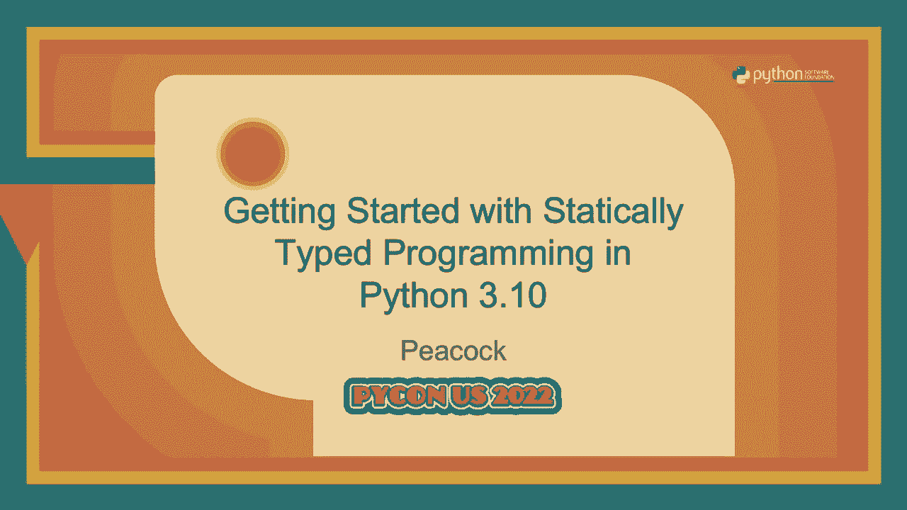
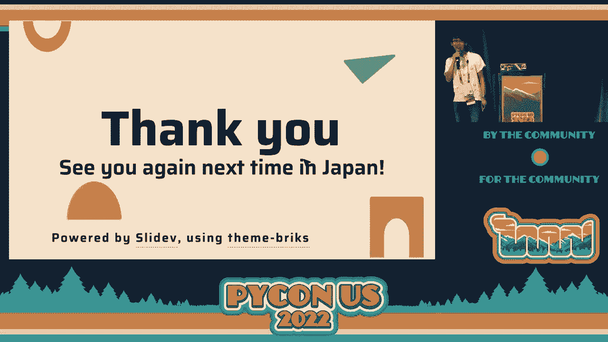

# P71：Talk - Peacock_ Getting Started with Statically Typed Programming in Python 3.10 - VikingDen7 - BV1f8411Y7cP

 \>\> Hello。 Good afternoon， everyone。 Now we will have a talk on getting started with statically。

 typed programming in Python by P。Cock。 And since the code is still a thing， we're not doing。 Q and A here。 The speaker will be happy to take your questions in the hallway。 Thank， you。 \>\> Thank you。 It is first time speaking for being on site in Python， so our first song， is not just。 My talk is getting started with statically typed programming in Python 3。0。0。

 Let me self-interlacing。 There is a table of contents。 Okay。 Three-field pictures or。 screenshot one。 And the hashtag is Python US 2023。 And slide is uploaded。 You can also， see there。 Okay。 That is me。 My name is P。Cock。 Social media is P。Cock 33S。 And so on。 So my free name is EoTaka but pre-scoring P。Cock。 Okay。 My hobbies， my favorite is playing。

 me as a client， listening to classical music， skiing， I got it。 I'm 20 years old。 This is。 my first trip。 So it's the status。 Thank you。 \>\> Okay。 My last comment is there。 My company is CMS code。 First time since 2020。 There is， my boss。 I'm a application developer using Flask， Pymeet or Chrome。 I have a few areas running。

 Haskell on type split。 Now I'm leading program types and programming languages as known as， Python。 And my community， I belong to my community。 I'm a member of the Python JB and I'm a staff。 of Python JB since 2020。 And this year， 2022 is a vice chair operating member of Python。 JB association。 I'm director of the Python JB TV。 It is YouTube live about local Python。

 as an event。 One， three。 There is today's topics。 First， why I look about typing this。 is motivational。 And second， I'll introduce basically use this first step of typing。 That。 is what I'm most drawn to say。 And then， Gen X and user-defined types。 \>\> It is best practice in include。 And last update overview and background compatibility， for 3。9。

 Last topic， overviews new features on 3。10。 And one topic about 3。11。 Okay。 This， is my motivation。 It's been seven years since typing in Python 5 at 2015。 Many backpeps。 adapted and updated over the years。 So even now， I think many people don't know where to， start。 Because there is concrete information。 This is what I will not talk about。

 And the last one is configuration of my pie。 So important topic。 But it's so long。 So I， skipped。 And for example， CIs， history， implementation and SD。 I will not talk about。 And this is my body。 Okay。 Let's start。 Look how it was。 Start typing。 Okay。 This is what， makes you happy。 It's not type when you reference it in the entire， such as the code。 It gets。

 angry when I try to give it long run。 And that computation will work when accessing the value。 of the function using dot。 Okay。 These are typing。 Yes。 We can't know the errors。 Yes。 It will occur。 It will occur。 But we can't know。 It's typing。 But it's typing。 Yes。 Like this。 It's called review。 This is actually -- actually， in my -- I had to explain that this -- my voice。

 said what types do function returns？ It's strings first or now。 That's the way two types。 So it。 is unhappy。 But like this。 Yeah。 But we're typing。 It looks like this function may return。 three types。 Isn't that too much？ I see。 That could be bad design。 Let me fix it。 Show a， place。 Yes。 Starting this， let's start with the function of definitions。 And this is nothing。

 too difficult。 Just the right type。 After the arguments， write column and the types。 Before。 the column and end of the function definition， write arrow and types。 Okay。 This is standard。 types using to the nothing。 There are bytes， floats， int and str。 And now it's used for。 functions that returns nothing。 Yes。 Such as main functions。 Yes。 Yes。 This is a very， dangerous。

 very dangerous， very dangerous。 Any type of instance of any type。 Of course， it。 is a very dangerous， very dangerous。 And then you see it。 When you're using it， it's very。 dangerous。 Okay。 Since stats from the upper case， as collections， it can use without， input。 Yes。 Before the input， you must have to write this sentence。 But now it's difficult。

 So you may use dict or list using a start with small case。 And these collections can。 be written with square brackets for the type inside。 Other modules are variables in standard。 library。 Collection is， for example， a queue or a different tick。 Collection。avc， the interval。 or the protocol related。 And the re has leg like special modules。 And finally， context。

 leave is context related items such as using data or data leave。 Okay。 There are so many。 types in collections。avc。 So it is better to use collections with few methods in case， of the data。 And the next figure shows relationships between collections of the sequence of the。 virtual types as defined by the methods instance methods that are implementation。 It is good。

 idea to look at methods here。 Fewer methods。 So narrowing。 Okay。 Let's see。 Yeah。 This is。 a great method in latency。 So it is complex but do not feel difficult。 The first of the。 bottom of the year ago， the field method it has on the top side， this side。 You just want。 the more method it has。 For example， if you want to loop over a sequence of the argument。

 in the function， you can use the collections of a vc。iterable。 Yes。 If you run a access。 if you need run access， use sequences。 Or if you need to change the value， the use type， is mutable。 Yes。 It is。 Or if you simply specify the list of the argument type， you will not。 be able to set or it can't。 However， I think it is easier to understand using this。 Yes。

 There are differences between the types of other sequences。 If you also know， the number。 is fixed up the length information。 You must specify the type of the number of elements。 Yes。 Like this。 Or you can use also mixing types such as type of int， str， and float。 Okay。 Our sequences such as list has the same constraints for the elements。 Yes。 This is the difference。

 of the and the tuples。 It can be used regardless of the length sequences of setting only one。 Okay。 Next is advanced。 There are a few advanced types。 Okay。 Looking。 At first is union。 Multiple， types。 Yeah。 Probably it's seen this。 This style pipes。 Yes。 It's on a higher scale or， a type script。 Next code。 This top code is the example of a function that accepts both integers。

 or floats and returns or floats。 Next， bottom， bottom examples。 It can be tested。 Equal weight， so。 First， next is union and flat end。 Next， this type is limit。 Yes。 This。 Sorry。 This， is limit。 And all that is， you know， you can swap them。 And combats with typing。union。 Yes。 This is 3。9 or before styles。 And then this style is for 3。10。 Okay。 Optional types。 It。

 is shorthand for the option of t。 It's union with none。 Yes。 So we have strikes just like。 union of type or none。 Yeah。 If you type with a function of the value of something， it will。 be propagate。 So we careful when use it。 Yes。 Yes。 This is a part example for using option， models。 Yes。 It's， it's made returns。 Nance。 So when use this function， you might be answer， the words。

 So in this case， it would be cleaner to the later runtime error。 Yes。 The as a。 mentioned as a keynote speakers， the cost of the raising exceptions in Python is relatively。 you know， yes。 It is little performance impact。 I like Java。 And that goes， the new Python。 is also factor。 Java's， Java script has new safe methods。 Java equations， but no Python。

 But if there's such as methods， that， yeah， there's the upset。 Okay。 And there next is， clable。 And since 3。9 using this input。 And it is various function such as flask or fast， API。 And yes。 That returns clable。 It is function。 Okay。 Yes。 It's made it turns。 It's made it， turns this。 This funk is equals this is。 Okay。 And the next is user defined generic types。 Yes。

 It is typically declared by inheriting from the in session of the cross is one more， type variables。 Yes。 Using defining and using the kk t and vt and passing。 And you defining， x and y。 And using this using mapping takes mapping of x and y and returns y。 Okay。 Yes。 I talked about some new features。 It is， it is， it is， it is， but got compatibility for。

 all the versions。 Okay。 What is the standard features。 It is using typing new features or。 the order versions。 Right。 This import statement。 In action to typing， it was also used to call。 it simple x in features in 3。x。 For example， which functions。 Yes。 That is random modules。 Okay。 Now I talked about， I will talk about a recent update。 Yes。 This is overview。 Yes。 3。

7 has data classes。 And 3。8 has the F strings。 It equals in F strings。 Yes。 It is for debugging。 And 3。9 is union operators in the dict。 And 3。10s are， as you know， pattern matching。 And， 3。11 it will release 2000s 22 October。 It's focus on performance training。 And new features。 on typing on 3。10。 There is four features。 Yes。 And there is difficult topic。 Yes。 This is。

 I'm not sure。 So I can explain where。 Okay。 As you know， new type of union operator is， in pipe。 The union of the can be used operator。 You can also， asking instance。 Yes。 Like this。 Optional of T is also written by the like this type owner using this。 Okay。 Yes。 This is the。 very difficult。 But I'm not sure to， I can explain。 It， it motivation is needed way。

 represent functions that returns same arguments as a specified function。 Yes。 That is， it。 is readability。 But approach is here。 Adding the argument type called is like this。 Using。 this to use this， use this import， import from typing。 Yes。 It can be used with cover to。 behave like a general cover of the X。 Yes。 Before， I'm logging to this。 We can't know the argument。

 of types。 But after this， yes， like this， you can put， you can know that the keyword algorithm。 is dict and this is the top of this and using this。 Okay。 The second， third one， type areas。 Motivation is， we consider variable， global bias with type in these type areas。 This tends。 to cause problems with what the X events， for the reference， scoping and what。 So we are。

 going to make it possible， uh， expected， define type areas。 Okay。 Uh， approach adding new typing。 to type areas。 Um， you can like just like this， uh， tick column type area is equal in。 Yes。 Uh。 you can like， like this， uh， using double code for using four differences。 Okay。 Uh。 this is before and after。 Okay。 This is the global expressions， uh， is the areas and type， type， uh。

 global expression。 And then， uh， this is using for further references。 Okay。 This is the last week for the C point 10， uh， user defined type of Gauss。 Yeah。 Motivation， is， uh。 type check， uh， through the technical called type， not only to determine， uh， the。 type of information。 Yes。 Uh， on this line， uh， type of var is narrow to SDR。 Uh， next， uh。

 this line， uh， narrow to SDR。 Okay。 Uh， however， that will not， will not act， uh， as， intended as。 uh， if user defined is a function of easiest。 Yes。 Uh， this is invite type， uh， uh。 type Gauss allows to define user defined types， uh， Gauss， you， you write a new typing。 Okay。 Yes。 Writing the， like this， uh， on the narrowing type， works here， like next。 Yes。 Uh。

 this narrow in top of SDR and SDR。 And next is one or two steps。 Uh， this is， uh， this is SDRs。 Okay。 Okay。 This is， uh， this is last topic。 Uh， new features on five zone， three point 11。 Uh。 if you're as a note， uh， five zone three point 11 is focused on the， performance tuning。 But， uh。 there are also a new feature on typing。 Yes。 This is， uh， that， uh， six， six， seven， three。

 safe type。 It's， uh， a way to， uh， uh， way to annotate， the methods that return， uh。 instance of the SDR class。 Okay。 Let's see。 Motivation is here。 Uh， the coding， uh。 set scale of the self-grace shape， self-grace shape。 Uh， the type， uh， check out is， uh。 if I was the lead answer， the shape shape。 Yes。 This is the shape， uh， not， not circle。

 And using this， uh， shape has no other view。 Set radius。 So it occurs。 Uh， yeah。 There is， uh。 worker， there， there is worker， but， uh， intuitive。 Yes。 Uh， there， is， uh， not so， not good。 really， really。 But， uh， using a type in dot-save， uh， resolves， that is， uh。 important and using like this。 This， uh， not that this self starts with， uh， upper S。 And， uh。

 using the， using self-grace， it will be the circle。 Okay。 This is， uh， But my summary is。 I talked-- fast benefits， starting with using， def definitions， build-in types。 and using standard collections， since 3。9。 And those collections， unions， options。 are defined genetics， and then， updated overview， and standard future for compatibility。 And last。

 new features on 3。10 or on 3。10。 Yes， 3。10 has new type union of data。 parameters with efficient variables， type areas， user-defined types， and type gods。 And that's a 3。11 has a self-type， annotated。 OK， that is your parentheses。 I want to say thank you。 OK。 thank you so much。 Thank you for listening。 See you again next time in Japan， middle of October。 OK。

 see you。

 [APPLAUSE]。
