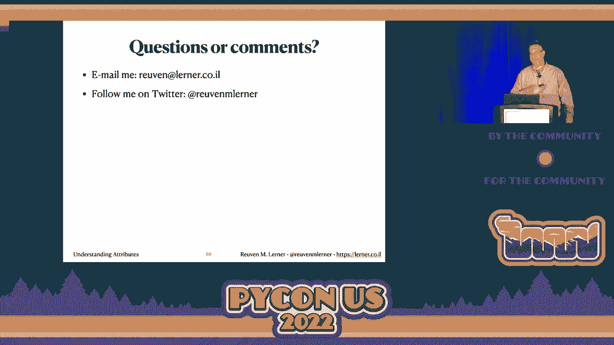

# P72：Talk - Reuven M. Lerner_ Understanding attributes (Or_ They're not nearly as bor - VikingDen7 - BV1f8411Y7cP

 Hello， welcome to the second session。 My name is Jonas。 I'll be the session chair for the。

 next three talks and introduce the speakers。 Make sure you come to the front if you're。 comfortable so you can see the slides。 Our first speaker in the session is a Reuben。 learner who will be talking about understanding attributes。 Allegedly they are not nearly as。 boring as you might think。 Take care of your own。 Okay， hi everyone。 Wow。

 it is so nice to see people in three dimensions。 You have no， idea。 Maybe you do。 Maybe you've been experiencing。 You might have heard there's a bit of a pandemic， going around。 In any event， my name is Reuben and I teach Python for a living。 I've been， doing this since。 I've been in business since 1995。 I do corporate training。 I do video training， hybrid training。

 I have this thing called weekly Python exercise。 I have books， pandas， workout， Python workout。 You're welcome to come to my booth， ask questions afterwards。 and even get swag and a raffle on my books。 But let's get into the topic at hand。 Let's。 assign to a variable。 Exciting， right？ So here I say X equals 100。 What's going on here？

 I'll tell you what does not mean。 So many people who come from the C world and we have。 to sort of be nice to them， pity them。 But basically people from the C world sort of believe that。 when you say X equals five， what you're doing is you're taking a variable which is basically。 an alias to a memory location。 And you're saying I want to stick that value into that。

 memory location。 That's not how it works in Python。 This does not mean put the value of。 100 in the memory location called X。 What it does mean is the name X should now refer。 to the integer object 100。 A totally different kind of thing。 And we can see this really， nicely。 For those of you who aren't familiar with it， the Python tutor site， Python tutor。

 dot com for Phillip wall。 Amazing， amazing stuff。 And we can see here on the left we have。 the variable X， the global variable X， and referring to an integer object 100。 So far， so good。 Let's get a little fancier。 Let's create a class， a do nothing class class， my， class pass。 And then I say X equals an instance of my class。 Now what I'm going to do is I'm。

 going to say X dot Y equals 100。 What am I doing here？ I am not assigning to X。 I am。 assigning to X dot Y。 I am creating an attribute on X。 Y is not a variable。 And it's very。 important to keep track of that and to understand that we have two totally separate storage。 systems in Python。 And here we see them that X refers to an instance of my class。 And in。

 that class we have the attribute Y with a value of 100。 Now every single object in Python。 has attributes。 Every single one。 And you can think of them as a private dictionary on， the object。 But instead of using square brackets， you're using a dot to either set or retrieve， them。 And the attribute does not exist in the variable。 So while we colloquially could。

 say yes X has an attribute Y。 Realistically X is the variable referring to that object。 and the object has the attribute Y。 So we can retrieve from attributes really easily。 I。 can say for example， sys dot version。 Right？ I have， I do import sys。 I've created the global。 variable sys which refers to a module object。 So sys is a variable and version is an attribute。

 on that variable。 And it gets me back the version of Python I'm running。 I can say stir。upper。 of ABC。 Stir is a global variable actually built in。 Right？ It's a variable that refers。 to the string class。 Upper is a method on that。 And then I can once I retrieve that method， object。 actually a function object， then I can use parentheses to invoke it and get back， a result。

 And similarly I can say random dot random to zero to 100。 Random is a module。 It is a method。 I get that method object back and I invoke it。 So far so good。 Just like。 variables attributes can contain any Python object at all。 It can be data。 It can be a， function。 Absolutely anything can be in an attribute。 Just as absolutely anything can， be in a variable。

 What if I want to set attributes？ Well with pretty rare exceptions typically。 having to do with built ins that are written in C you can set any attribute on any object。 you want in Python。 So here assuming that I have an object that's not one of the built。 in types I can say x dot y equals 100。 And I will have added that attribute to the object。

 Or if the attribute already exists then I replace the previous version with the new， version。 And if that sounds a lot like a dictionary guess what it's a lot like a dictionary。 So。 some of you might remember the difficulty in paying that we had in upgrading Python 2， to Python 3。 Well I have an easier solution。 Sys dot version equals 4。00。 There you go。

 I have now upgraded Python 4 with no paying whatsoever。 You see then I can set absolutely。 positively any value I want。 On absolutely positively any attribute I want。 On absolutely。 positively any object I want。 But you know why would I set version to be 4？ When if I， set it to 4。20 Elon Musk comes and buys Python。 Okay we actually set attributes all the time。

 All the time we don't think about it very much。 If I create a new class class person。 I'm going to have depth under in it。 What is under in it？ I'll tell you what it is。 It。 isn't the constructor method。 It's not creating a new object。 After the new object has already。 been created， under in it is invoked to add attributes to the object。 That is the role。

 of under in it。 If you don't have attributes on your object， don't have under in it。 If。 you don't have attributes on your object and you've got other issues but let's not talk。 about that right now。 And then I get self a name。 So self is the instance。 It's the new。 instance that was just created。 And name is the parameter， the local variable that contains。

 the value。 And then what I do is I take that value name and assign to self that name。 And。 self of course is that new instance。 So I'm adding an attribute to that instance。 And。 now the object has it。 Now it's referred to here by self。 But of course outside of the， method。 outside of under in it， that object is going to have a different name， a different， reference。

 a different variable。 For example， P1 and P2。 Now while under in it is wrong。 we can see what's going on。 We have the global variable person which refers to the person， class。 And then inside of under in it， we have two local variables， self which refers。 to the person instance。 And we can see then that self has an attribute called name and。

 its value is name one， which we got assigned to from that variable name one。 Then when。 we return it， well here we go， we've got name and name one。 When we return it， P1 is。 referring to that instance， which still has the attribute name。 And we have the value， name one。 Okay， not too bad， not too shabby。 Let's make this a little more interesting。

 What's missing from this program？ Well， let's assume that our， like that this is our startup's。 you know， crown jewels。 We， it's such a great program。 Be able to create a person like this。 Clearly we're going to go public pretty soon。 But， but my manager has come in and said。 I've spoken to our customers and they demand new functionality customers。 They want us to。

 keep track of how many people we're creating in our virtual world， our virtual universe。 our metaverse if you will， to coin a phrase。 So let's keep track of the population as。 we add people there。 Okay， well how am I going to do that？ Well， here's one idea。 I could。 use a global variable for that， right？ That's a fantastic idea。 It's not a fantastic idea。

 So I'm going to say here population equals zero。 I'm going to create that global variable。 Then I'm going to create the class。 And here's what I'm going to do。 Every single time I。 create a new instance， we're going to go through Dunder in it。 And so every single time I can。 add one to the population。 And so before I create my instances， I'm going to say before。

 population equals that。 And afterwards， I'm going to say population equals that。 It's。 going to start at zero。 It's going to end at two。 It's going to be fantastic until it's， not。 Unbound local error。 I hope each of you has a favorite Python error。 Because this。 is my favorite one。 Because it confuses the heck out of all sorts of people。 Unbound local， error。

 What does that mean？ Well， binding is a way of saying assignment。 It basically， means， hey dummy。 you have a local variable that doesn't have a value。 But you're trying。 to retrieve that value anyway。 Well， wait， how can that be？ Because normally in Python， I mean。 look， in other languages， you can declare a variable and then not give it a value。 You。

 can end up with this sort of thing。 But in Python， we don't have declarations。 Well， other than。 whoa， what an amazing language。 So basically， how can I have a variable that doesn't have， a value？

 And the answer is because it's local。 Because when I'm inside a dunder in it there。 I'm inside of a function。 And inside of a function， if I assign to a variable， that。 variable is local by definition。 Python keeps track of this and says， aha， you assigned a。 population， population is local。 But that's a compilation time。 Then I run the function， and says。

 OK， I need one plus the current value of， oh my god， unbound local error。 So， what am I going to do？

 Well， one possibility is to use global。 Not a good solution。 One， possibility is to use global。 And the global statement says， hey， Python， when you compile， this function。 don't record population as a local variable， pay no attention to that。 Instead。 assign to the global variable。 And indeed， that works。 I can say here population， equals zero。

 Here we'll get zero。 Here we'll get two。 All is good。 But it's not。 Because。 you really shouldn't be using global variables unless you absolutely， positively have to。 And this is not so good。 But we have a better solution。 Remember， everything in Python is。 an object， including classes。 Every object has attributes。 We can set and retrieve attributes。

 on every object。 So how about， how about it？ We set an attribute on the person class。 So here's what I'm going to do。 I'm going to take my class person。 And after I define， it。 then I'm going to add population to it。 Can I do that？ Absolutely， I can do that。 Don't do this。 But you can absolutely， positively do it。 And it will work。 As I like to say， unfortunately。

 this works。 Right？ Like， it will give you the right solution。 And here what we see is we。 can't talk about population anymore as a global variable。 Because it's not。 It's not。 a variable at all。 It's an attribute。 An attribute on person。 But I think we can all agree。 This is pretty ugly。 Or， as we call it， the consulting industry。 An opportunity。 So first。

 we're creating the person class。 And then after we're done， we add the population attribute， to it。 This cannot possibly be the best way。 Well， I have a solution。 The solution is quiz， time。 What will this code print？ So I took basically what I had here with a person class。 And I got rid of the population stuff。 And I added a few print statements。 So the question， is。

 what will be printed in what order？ And I am such a nice guy， I will give you a hint。 A will be printed first。 After that， you're kind of on your own。 All right， fine。 I'll。 reveal the answer。 The answer is A， B， D， E， C， C。 Okay。 Well， what's going on here？

 Because that is not obvious to an awful lot of people。 I showed this too。 And I really。 enjoy showing this to people because it forces you to really think for a lot of these issues。 And it's not obvious to have any to do with classes。 So print A， done。 But many people。 especially those coming from statically compiled languages， say， well， okay， this print B here。

 that's not going to run at all。 Or maybe it's going to run and then like they start trying。 to figure it out and it just sort of doesn't work。 But actually it's printed right away。 And then they say， oh， I get it。 A then B。 Obviously then we're going to print C next。 No。 we print D next。 We skip over C。 So something is going， something is very weird there。 And。

 it's not just if you're overseas。 So then we have D。 Then we have E。 And then finally。 we print C and we print it twice。 So what's going on？ And part of the reason why people。 get confused by this is that functions and classes look almost exactly the same。 So before。 this can happen， before we can have person invoked。 And before we can then call Dunder， in it。

 Dunder in it needs to be there。 Functions and classes look the same， but function bodies。 are not executed when we define the functions。 But class bodies need to execute when we define。 the class。 Otherwise there's no Dunder in it for us to call on our brand new object。 So what that means is that when I define a class is executed line by line by line。 But。

 wait a second。 In my class I had Dunder in it。 Shouldn't the body of Dunder in it run？ No。 because a function body does not run when you define it。 The function body only runs。 when you actually run it。 But there's something kind of weird going on here。 What about death？

 Death does two things。 It creates a new function object and it assigns that object to a variable。 that functions name。 But here death is defining Dunder in it， which is what？ It's an attribute。 It's an attribute。 Methods are attributes。 And so Dunder in it is an attribute on the。 class just like the attribute we set before population。 This happens to be a function attribute。

 It wasn't integer。 In both cases attributes on the class we define them in different ways。 We use death to define it。 But something still doesn't make sense here。 I've got in。 it as a class attribute。 How can it be that death is now defining an attribute when it。 usually defines a variable？ The reason is you can think of classes as fileless modules。

 Modules without a file。 Functions in a class body are class attributes。 Inside of the class。 they look like variables。 But outside the class， they look like attributes。 It's just like， modules。 When you define a function or a variable in a module file， inside of the file， that's a global。 But outside the file， I have it as an attribute on the module object that， I have defined。

 that I've imported。 So any functions we define inside of a class aren't， variables。 They're attributes。 Attributes on our class。 And any assignments we thus make。 in a class don't create variables。 They create attributes also。 Which means I can go back。 to my person class from before。 And I can say population equals zero。 Just like that。

 I'm not at all creating a variable。 It's not a global variable。 It's not a variable at， all。 It is an attribute。 Person。population。 By the way， sometimes people say， well， why。 don't we then call it person。population side of the class。 And the reason is that the name。 person is only defined after the class body has been run。 So you can't do that。 Some people。

 look at this and they're like， oh， I've seen these before。 I come for a background in C++。 And we call these static variables。 And I say， please don't use obscene language in my classes。 But the thing is you shouldn't talk this way because it mixes things up。 Static variables。 are shared。 They're shared among the class and the instances。 But attributes are not shared。

 The names are not shared。 They can all reference。 They can all point to the same object。 But。 an attribute only exists in the class。 Python does not have the idea of a shared attribute。 It just doesn't exist in language。 Well， let's see that。 Let's see that they're different。 So I'm going to add a little code here。 I'm going to say after we've created our two person。

 objects， person。population。 And I'm going to show you。 We're not going to get anything。 from P1 and P2 population。 See， person population I get to， P1 population I get to， P2 population。 I get to。 Uh oh。 It worked。 And we got the same values。 So maybe they are really shared。 Nope。 This is where I introduce what I call ICPO。 The attribute look up path in Python。

 Instance class parent object。 This is how Python looks for attributes all the time， all of。 the time。 And once you understand this， a whole lot of other things in Python start。 to make more sense。 So what is this ICPO rule？ First of all， Python looks on the object you。 actually talked about。 The instance itself and says， does this attribute exist here？ If， so， great。

 We stop。 We have the value。 If not， we're not going to give up right away。 We go to the class。 Does the instance class have this attribute？ If so， great。 If not， we keep going to the parent。 We'll talk about that later， but we look it up at the parent。 And if not there， then an object。 the top of the class hierarchy。 So let's walk through， this。 I say person。population。

 Python turns to， I know it doesn't feel like an instance， but classes are objects。 Unless their instances， does person have the attribute population？ The， answer is yes。 We get the value to end of story。 And then Python says， hey， P1， do you。 have the attribute population？ And the answer is no。 But Python doesn't give up。 It says， oh， I see。

 Oh， I'll check on the class。 Does person P1's class have the attribute population？ It does。 And we get the value back too。 I can also say P2。 Does P2 have it no？ Does person， have it yes？

 And we get it back。 Now I should note， this assumes we have not assigned an。 attribute population to P1 or P2。 If you do that， all bets are off。 Because then it will。 find the attribute on the instance。 And it won't continue to the class。 And you'll end。 up with a terrible， terrible situation。 Don't do that。 My CPO explains method lookup。

 It really does。 Because if now I have a new version of person， right？

 And this version of person has a new method。 It has the greet method。 And so I can。 say P1 equals person name one， P2 equals person name two， nine， my two people。 Let's。 say hello to them。 P1。greet。 What happens here？ Python turns to P1 and says， does it。 have the attribute greet？ And the answer is no。 So it turns to the class。 Does person。

 have the attribute greet？ The answer is yes。 We get back that method object and we execute， it。 And then we do the same thing here。 P2。 Does it have attribute greet？ No。 Does person， have it yes？

 We get back the method object and we execute it。 And it works great。 The。 method here is defined as a class attribute。 But we access it via the instance。 Okay。 Let's try a new class。 Right？ Our person object is such a roaring success。 My boss has come。 back to me and said， listen， we need something new。 We need an employee class。 And employees。

 are almost like people。 Sometimes employees even are people。 But that depends on the company。 you're working for。 So employees， unlike people， are created with two attributes。 Name and ID。 number。 Otherwise， they're the same as people。 So we have to have some distinction。 So what。 do I do？ I say do my boss listen。 I know exactly what I'm going to do。 Give me a month。 And my。

 boss says， sounds great。 See in a month。 And I think， ha， I'm going to do this in five， minutes。 And I'll watch TikTok videos the rest of the month。 Perfect。 So here I have， my person class。 And I now use the most powerful tool in a programmer's arsenal。 Copy paste。 And I define my employee class making a few slight adjustments。 I add an assignment to。

 self ID number based on ID number。 And then I can create a new employee。 I call it E1， greet。 E2 greet。 And it's fantastic。 And I am feeling great about myself because now I。 have a whole month to improve my ridiculous dances。 My boss come back a month later。 And。 as bosses always do in software companies wants to inspect my code。 Looks at my code， and says。

 why am I spending so much money on Python training and conferences for you when。 all you did was copy and paste。 Why didn't you use inheritance？ I say， inheritance。 Right。 Give me another month。 I promise it'll be better。 Sounds good。 Boss walks away。 I'll see。 in a month。 So let's try this again， except with inheritance。 What do I do here？ I put。

 person in parentheses after employee。 This says， employee is a person。 Employee inherits。 from person。 What does that really do？ It inserts person into the ICPO search。 It means。 now that if we don't find an attribute on the class， we will look for it in the class as， parent。 If we don't find an attribute， a method basically， an employee， we will look， for it in person。

 And sure enough now， I call E1。greet。 What happens？ Python says， does E1， have greet？

 The answer is no。 Does this class employee have greet？ The answer is yes。 End， of search。 We have accomplished nothing at all through our inheritance。 So yes， we inherit， from person。 but we're not taking advantage of it。 So let's take advantage of it now。 Let's， use inheritance。 And we can take advantage of it because the greet method is exactly the。

 same in both person and employee。 So we can get rid of it in employee。 And so I say here。 class employee， just like before， except I've gotten rid of the greet method。 And now when。 I call greet， what happens？ Python asks E1。 Do you have an attribute greet？ The answer is， no。 It asks the class employee， do you have the attribute greet？ The answer is no。 So we。

 go to the parent。 Do you have the attribute greet？ The answer is yes。 We get back the method。 we run it， all is good。 And the same thing happens with E2。 So a lot of people look at。 this code and they say， oh， inheritance sounds great。 And then they say wait。 We can improve。 this code even more。 Because name， I'm setting name and employee。 I can also set name， why。

 am I setting name and employee and also setting it in person？ I can just get rid of it in employee。 And all will be great。 So here I have name being passed in and nothing having to do with。 name because I am an optimistic person and I assume that person will take care of it。 Yeah。 except it won't。 Employee has no attribute name。 And I say what？ How can that be？ And I。

 decide to run the var's function on it。 Just a double check。 And I see that E1 has only。 an ID number and E2 has only an ID number。 And perhaps you feel this way sometimes at。 work that they don't really believe you have a name。 Just a number。 But that's a bug， not。 a feature。 Or so I'd like to think。 So what's going on here？ Well， here's the thing。 The。

 name attribute was never set。 We never got to person。thunder in it in which name was set。 And the problem is basically this。 We created a new instance of employee。 We asked the。 new instance do you have in it？ No。 We asked employee do you have in it？ Yes。 That ran。 we never got to person in it because it never ran。 Name was not added。 People coming from。

 statically compiled languages are often surprised by this because they see classes as a set of。 declarations。 And they say oh， the subclasses declarations and the superclasses declarations。 will be merged together。 So I get all of these different fields。 I get all of these different。 attributes set。 But that's not how it works in Python。 We set these attributes explicitly。

 in Python and under in it。 You don't run under in it。 The attributes not set。 And so what。 can we do about this？ We have a few different possibilities。 One is to explicitly call person。 under in it。 Right there inside of employee in it。 I can say yeah， I can run it。 There's。 nothing technically wrong with this。 But this is where， right， gives me the right answer。

 But it's better to use super here。 Super basically says it's a proxy and it says I will figure。 out who we can run under in it on。 And it goes up the chain。 It says oh， person has， done in it。 I'll run that。 Fantastic。 And then we get M1。 We get hello M2。 All is good。 So this is how we see attributes in use on the instance， on the class and on the parent。

 And I should add if we have multiple parents， right， if we have something that hurts from。 something that hurts from something that hurts from something that hurts from something， it。 will just go up that whole chain until it gets to object。 Object is the top object。 Top class in our object hierarchy。 And let's talk about that a bit。 What happens when I。

 print P1 or print E1？ First of all， I get back something that's just horribly ugly。 I will never understand why this is like considered the default， but fine。 It is。 Anyway， why？

 Because when I call print， print， why can we print anything in Python？ Because print turns。 its argument into a string。 How do we turn something into a string？ We call it stir on， it。 What happens when we call stir on it？ It looks for a dunder stir。 And the dunder stir。 method with P1 does P1 have dunder stir？ No。 Does P1's class person have dunder stir？ No。

 Does object have stir？ Yes。 So we get the default implementation of dunder stir。 And。 that's where we get the default ugly result that we saw。 And with E1， it's basically the。 same thing just with an added step。 Does E1 have dunder stir？ No。 Does E1's class employee。 have dunder stir？ No。 Does E1's class's parent person have dunder stir？ No。 Does object have， it？

 Yes。 We get it all good。 This is how we can do operator overloading。 Attribute look， up。 If you define dunder stir in your class， you're basically stopping the search at an， earlier stage。 And thus you never get to dunder stir in object。 But something is still missing。 Python loves to be explicit。 And Python loves to work without magic。 We in the Python would。

 like to laugh at those other languages that had magic。 You know， explicit is better than， implicit。 But there's a big piece of magic here that we all know about and that we don't。 complain about too much。 And that is method rewriting。 So you might know this and you， might not。 But basically， if I have s equals abcd and then I call s dot upper， I get back， abcd。 Great。

 That's the normal way we would invoke a method。 But I can also say stir dot， upper of s。 And that works also。 It's exactly the same thing。 But something's wrong here。 Something's a little weird。 We know that methods are stored in class attributes。 And。 we know that we can retrieve a class attribute， either the class or the instance。 But somehow。

 we're getting different behavior depending on how we retrieve it。 Let's just look at that。 again for a moment。 Go back here。 Here we go。 Right。 I'm asking for the dunder of the dot， upper。 I'm asking for the upper attribute。 I can ask for it on the instance。 I can ask， it on the class。 In one case， it expects to get in the class case， it expects to get， the instance as an argument。

 But in the instance case， it does not。 So what's going on here？ Well， let's ask person dot greet。 What do we get back？ We get back a function， a plain， old Python function。 P1 dot greet。 I get a bound method。 Huh。 That's kind of weird。 What's， going on？ And the answer is descriptors。 Normally when I retrieve a class attribute， I get the， object stored in that attribute。

 That's the normal behavior that we've seen so far that， you've probably seen day to day。 And you don't think much more about it than that。 But if， the attributes has a dunderget method。 that is to say if the attribute is of a type and， that type has dunderget installed。 then the result of dunderget is returned instead。 Let's， try this。

 I'm going to say here class loud number。 All right。 And basically this is just。 going to store an integer for us。 Nothing too exciting。 And I should add by the way descriptors。 can be very， very complex。 I'm not going to all descriptors here。 I'm just sort of showing。 it to you at a higher level。 But you'll sort of get the gist here， I think。 So basically。

 I have my class。 This is a totally reasonable class， right？ Dunder in itself N。 And then。 when we run Dunder in it， we're going to print out that we're there。 And we're going。 to assign self N equals N。 And then dunderget， this is that special method。 We're going to。 say self， and I'm just going to sort of paper over the arguments we get for now。 We're going。

 to get into it in a moment。 Splat args， meaning all whatever positional arguments you want， to pass。 that's fine。 And then here， what are we going to do？ We're going to return self， dot N。 If I assign an instance of loud number to a very special， nothing special happens。 But if I assign it to a class attribute， magic happens。 Let's see。 So let's say class person。

 age equals loud number 30。 Right？ So what am I doing here？ I'm creating a person class。 And the person class is nothing else。 And I'm just concentrating right now on this descriptor。 And I say， let's make age equal to an instance， one new instance of loud number 30。 When I， now ask。 well， when I run that， I get in loud number in it and equals 30 because we ran that， code。

 It's part of the class definition。 When we define a class， the class definition runs。 When I say P equals person， great。 We've created a new instance of person。 And when I say， whoops。 Oh， no， no， no， no， no， no， come back。 Well， end of talk， folks。 Hope to live， you in suspense。 It was much worse when that happened during my dissertation defense。 Anyway， what's going on here？

 What we have here is P， an instance of person。 It refers to an instance， of person。 Great。 That's not the truly interesting thing。 The truly interesting is that above， it， I have person。 which refers to the person class。 It has an attribute， age。 And what is， the value of age？

 It's an instance of loud number。 I know it's a little confusing to， keep track of。 But basically。 the class attribute is an object。 But of course， class attributes。 are always objects because everything is an object in Python。 Just here， it's an object。 of a type that we created with this wacky dungger get method。 And watch this now。 I say， P。age。

 I'm retrieving the class attribute via the instance。 And it invokes the method。 Dungger get is running。 And then I get back 30。 And then I say person。age。 And the method。 is running and I get back 30。 That's kind of weird， right？ I mean， I did get the attribute。 value back。 But I didn't get the attribute itself。 I got the whatever dungger get in the。

 function to return to me。 Here's the weirder thing。 I did not use parentheses。 In Python。 if I don't use parentheses， I don't invoke a method or a function。 And here I did not。 use parentheses。 And yet， it was invoked。 What the heck？ So what are get parameters？

 What is it actually doing there？ Well， before I said it was just splat args。 It actually。 gets two arguments。 And those two arguments are assigned to two parameters。 And there。 are different names and conventions for calling these。 I call it object type。 Choose your own。 poison here。 So the first argument that we get after self is object。 From what instance。

 is the attribute being retrieved？ Right？ So through whom am I trying to retrieve this？

 And the second argument is in which class is this attribute stored。 So let's try this， again。 I'm going to create my class。 Age equals loud number 30。 And we see that。 And。 now I say p equals person a new instance。 And I say p dot age。 And look at what I get。 for my in my printout。 It says object is an instance of person。 Well， that's true。 I。

 accessed age via the instance of person p。 And the object is person， the class person。 So we know is like p dot age。 It invoked under get。 And under get knows on which instance。 and from which class。 And if I say person， if I say person dot age， object is none。 And。 still object type is the class person。 In other words， if I retrieve it via the class。

 object is none。 But if I retrieve it via the instance， object is the instance on which， I ran that。 Whoops， come back。 So here's the thing。 You use descriptors every single day。 Because methods are descriptors。 When we retrieve a method via the class， Python returns the。 original function。 But when we， and it can tell because object is set to none。 So we。

 need to supply an instance as the first argument。 It knows， oh， I didn't get object here。 So。 we need to get that argument so that we can call the function correctly。 But when we。 retrieve a method via the instance， Python says， aha， what I want to do is take that instance。 object and turn it into the first argument， move it over there so that then we can call。

 the original function with all of its arguments but with object at the front。 Well， how's it。 going to do that？ And the answer is， partials。 So you might not be familiar with it but we。 have something in fun tools in Python called partials。 So I can say， for example， death。 added a and b return a plus b totally normal addition function。 And then I say add five。

 equals partial of add and five。 Add five is a function object effectively。 It's a callable。 I can invoke it as you see down at the bottom。 I say add five of 10 and it returns 15。 Because。 we sort of preloaded the first argument five on to add。 That's exactly what's going on。 here with our methods。 When I invoke a method via the instance， Python does the rewriting。

 and returns a partial。 It automatically assigns or binds that instance to the method。 Guess。 what it says here。 When I retrieve person。greed， it's just the function。 But in return p1。greed。 it's the bound method person greed to that particular object。 It's telling us what it's， doing。 But it's hard to understand without walking through all this attribute stuff。 Wait， a second。

 What did it do with our original function？ Right？ Like it's very nice at all， to say， oh。 I defined my method and it was replaced with this， you know， descriptor magic。 But where is my original method greed？ And the answer is that it's put on another class， attribute。 It's sort of moved around to dunderdict。 And so the method name there is the key。 And。

 the original function is the value。 So if we ask for a method via the class， object is， none。 And we get back the original function。 The method descriptor just returns a function。 from dunderdict。 But if there is an object there， then Python basically creates a partial。 with our instance and that function returns them together and that is our method。 So when。

 we ask for a。b in Python， an awful lot of stuff is going on。 Python looks for our attribute。 via iCPO。 When we finally find an attribute， it might be descriptor。 And the descriptor。 then does some magic there depending on if we called it via the instance or via the class。 We use descriptors every single day without thinking about it very much。 And I should， add。

 there are people who really want to implement descriptors。 You almost certainly don't have， to。 I think knowing the protocol is useful for a deeper understanding of Python。 But。 the odds of you actually implementing a descriptor on your own are very， very slim。 Most of the。 time if you think about implementing a descriptor， you can instead use what's known as a property。

 which is a much， much simpler form of descriptors that papers over a lot of this stuff。 But。 basically via these attributes， we get class attributes。 We get inheritance。 We get almost。 kind of sharing stuff between instances and classes。 And we get the magic of methods and。 their rewriting。 All right。 We're at the end now。 Thank you very much。 Apparently we're。

 not taking questions and sessions here。 But I will say if you want to come up， I have a。 booth in the expo。 You're welcome to come up and chat with me and ask me whatever questions。 you want， it will be my pleasure。 Thanks so much， everyone。 [APPLAUSE]。
