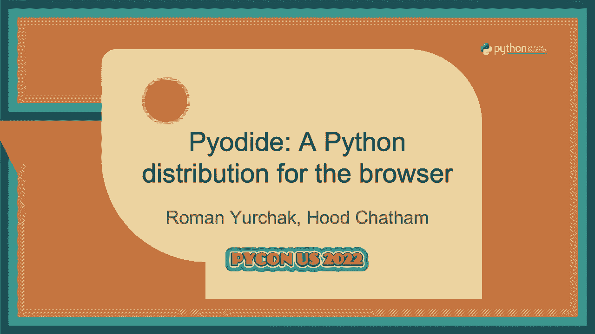
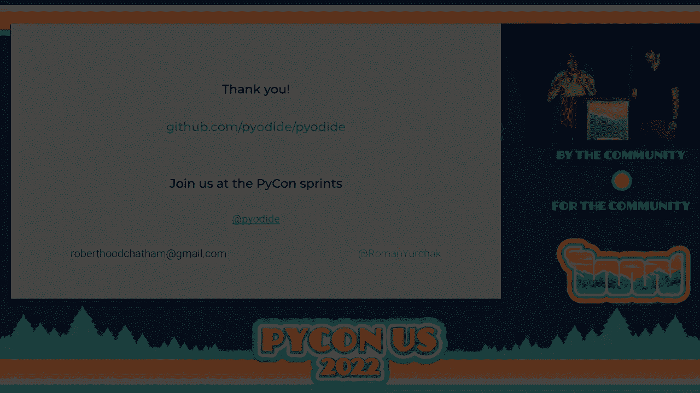

# P73：Talk - Roman Yurchak_Hood Chatham_ Pyodide_  A Python distribution for the brows - VikingDen7 - BV1f8411Y7cP

 Okay， hello everyone。

 Thanks for coming。 Thanks to all the organizers and all that。

 So we are two of the PIAIDIDE maintainers and we're here to tell you about PIAIDIDE。

 which you may have heard about in Peter's talk this morning。

 We are a PIAIDIDE distribution for the browser。 So a quick about us。

 So I am a UCLA national science foundation assistant adjunct professor， which means a， postdoc。

 but there's like title inflation。 So yeah， so this work that I've done is partially supported by NSF grant。

 department of material， science number， whatever， mathematical sciences。 Okay， here's Roman。

 And I'm Roman， so I'm a data scientist working mostly as an independent consultant。

 And I'm a core developer for at CICET Learn and PIAIDIDE， so mostly projects that are。

 difficult to pronounce。 Okay， so today we're going to talk about what is PIAIDIDE。

 We're going to review some of the most common use cases， which include interactive computing。

 educational use cases and machine learning。 And then we'll discuss a bit more in detail like the technical developments that has been。

 going on in the last several years in PIAIDIDE。 Sorry。 So as you all know。

 if you have a Python code and you want to run it in the browser， and。

 this is also what we was presented in this morning's keynote， essentially the setup is。

 fairly complicated because you have to have some front-end code in JavaScript， probably。

 some back-end code in Python and some infrastructure that you either need to maintain or configure。

 if it's a cloud provider。 Right。 And so the idea is fairly simple。 What would we just run。

 take this Python application and run it directly inside the browser？

 So this is possible with PIAIDIDE， sorry， WebAssembly。

 And like the general implications of this were really well presented this morning in the。

 keynote by PIAIDIDE。 So we're going to talk to introduce you， PIAIDIDE。

 which is the distribution of Python in the， browser and with the focus of not so much just running the interpreter or like being able。

 to execute Python code but essentially being able to run existing packages and existing tools。

 in the Python ecosystem。 Okay so first what is WebAssembly？

 So WebAssembly is the second programming language available in the browser。

 It's a binary instruction format for a stack-based virtual machine。 It's portable。

 It's designed for small code sizes。 It's designed for security。 And so as part of that security。

 it doesn't come with any sort of standard library that， it always has。

 It just defines a set of imports and it has a system for calling a function and so it can。

 call the imports。 And so the host application has to define what gets the import。

 It's implemented in all modern browsers， mobile browsers。

 You can run it in non-web environments like Node。 WebAssembly system interface。 So yeah。 Anyway。

 so that's what WebAssembly is。 And so then we have the inscript and build tool change。 So as I said。

 WebAssembly itself has no standard library。 It can't do any input or any output。

 It can only do pure computation。 All contact with the outside world has to happen through imports。

 And so the inscript and build tool chain is a compiler tool chain that compiles C and。

 C++ code to WebAssembly。 This uses clang so you can set up a WebAssembly target for clang。

 But then we also need an environment that supports system calls that actually interact。

 with the outside world。 And so it also provides JavaScript bindings for all the system calls that you need。

 It's designed for porting POSIX Linux applications。

 So it has Postix Linux system calls implemented in JavaScript。

 So then you can load this from an HTML page and serve it to a Web browser。 Yeah。

 So the main components of Py， is really rich。 It allows for very easy usage of one language。

 The other we'll talk more about this in a bit。 And then we take the C Python interpreter and our foreign function interface。

 which is， like a C extension of Python。 We take these two things and we can compile them with them scripting into a WebAssembly。

 binary with a JavaScript host that provides the operating system， all of the standard， library。

 We also compile most of the popular Python binary extensions， including NumPy， Panda， SciPy。

 Matplotlib。 Also we can compile cryptography。 So now we have Rust support very recently。

 And then we have a package called MicroPIP， which is for installing pure Python wheels from， PyP。

 Yeah。 And we want to call out Michael Druhtbaum， who was a Mozilla employee who originally made。

 Pyadide and did really great work on it。 And we've sort of been polishing the stuff that he set up。

 Right。 So I mentioned upstream in RC Python patches。

 So we used to have to patch all sorts of stuff in order to get Python to run because WebAssembly。

 and Emscripten is a very different sort of host environment than x86 Linux。

 And so in order to do signal handling， in order to handle certain extensions， we needed。

 to patch a bunch of stuff。 And so Christian Himes and Brett Cannon and I guess Ethan Smith have been involved in a。

 process and many other Python maintainers have been involved in up-streaming a lot of。

 our patches and a lot of other fixes that they're adding to see Python in order to add。

 sort of third party support or tier three support for Pyadide in Python。

 And so this includes upstream in our patches。 The compiler itself does a lot of bugs。

 It's fairly new。 There's not a huge number of maintainers for Emscripten。

 And so we're hitting a lot of edge cases， a lot of bugs， trying to get the C Python test。

 to beat the pass。 So over time this should make Pyad more sustainable and also help the ecosystem so other people。

 who are trying to compile Python to WebAssembly might hit the same edge cases in the Emscripten。

 compiler and so it should help them too。 So for context。

 Pyadide isn't the first project that builds Python for the web。 You have a number of those。

 so you have for instance， Brighton which is a Python 3 implementation。

 in JavaScript which implements the interpreter and parts of the standard library。 There's the PyPid。

js which is essentially fairly similar to what Pyadide does but it was like。

 several years ago and it used a different technology rather than ASMGS rather than WebAssembly。

 and this project is no longer maintained currently。

 And there is the Rust Python project that because it's like so it's a re-implementation of。

 the Python interpreter in Rust and because Rust has already a pretty nice toolchain to。

 port things to WebAssembly you can essentially with little effort to run it in the browser。

 So the difference， let's say what we are focused on is not so much having the interpreter in。

 the browser but is having the whole ecosystem run there like the whole Python ecosystem。

 And what matters there is essentially very good compatibility and being able to run your。

 code with minimal changes and this is for instance difficult if you implement your interpreter。

 from scratch because then you will have some edge cases you'll like for instance in Brighton。

 it's difficult to have exactly the same behavior as the standard C Python。

 So by using the standard C Python we remove a lot of those compatibility issues。

 And so I'm going to present next how we package the library ecosystem。

 So we have a tool called MicroPip which allows to install pure Python wheels from PIP API。

 So essentially it's like a pip but very simplified so it has very rudimentary dependence。

 And this resolution it's only allowed to load a pure Python wheels so wheels that have the。

 file extension as you see below。 On the contrary a lot of packages that have binary extensions will not be able to install。

 them。 And instead what you have to do is use the PyRAD build system to build them specifically。

 for WebAssembly。 So we use a configuration format very highly inspired by Konda so it's a metayamel where。

 you can configure how you would need to build your package with a binary extension。

 There is cross compilation set up and since recently we're out the output is wheels so。

 so you get Python wheels。 Those are not still very standardized because in particular while for instance the M script。

 version doesn't have a stable EBI so if you update the script version your wheels are。

 not going to be compatible with the previous ones so that's still a significant problem。

 There have also been a lot of improvements in the build system so since recently we used。

 PyPI build tool to have build desolations and we do also some custom post processing steps。

 for instance we will unvendor tests so that the package that you install is a bit smaller。

 because probably you don't need to have tests when you just use NumPy。

 However you will be able to install NumPy tests as a separate package。

 And so all this is currently distributed with a JES deliver so we have you probably heard。

 like the scale of what is involved in distributing Python packages with PyPI。

 We're clearly not at the same scale so we're much smaller but there are still some challenges。

 in making sure that if anybody puts a Pyodid import loading Pyodid on some high traffic。

 web page and everybody is going to download those files that we are able to support this。

 and we're really grateful to JES deliver who are able to do this mostly because they're。

 supported by a number of CDN providers。 And just to mention there was also some related work to have a build system which is more。

 closer to Conda which is to also build essentially packages， Python packages for Gwasm which is。

 done in MScript and Forge project。 So to give you an overview of the packages that we currently can use while some of them。

 were mentioned before so we have all the core scientific computing packages NumPy， Pandas， SyPy。

 Matlab， and all of that。 So this also means that we can actually build for instance packages that you cite on。

 For SyPy， SyPy was very challenging， we'll talk about this later but SyPy uses forthron。

 That's fairly difficult to build。 It requires external libraries such as BLAST and LaPac for linear algebra and then with。

 this we can also build all the downstream packages， scikit-learn， scikit-image and stuff， model。

 So we can load packages from PyP and MicroPip and also we have a number of different other。

 packages that are not part of the scientific computing so Pyodide is not a project for。

 scientific computing。 It's just that we have a lot of scientific computing packages because those tend to have。

 a binary extensions but you for instance can use a scale alchemy to set up a SQLite database。

 so that's the only type of database that currently works and use it for something completely unrelated。

 to the scientific computing。 And since recently as we mentioned we also are able to compile the latest version of。

 cryptography which was re-implemented in Rust and uses the Pyotree library to expose。

 the Rust code to Python。 So overall we have over 120 packages in Pyodide and in addition to those you can install from。

 PyP that are just through Python。 Okay， so I'm going to talk about the foreign function interface。

 So we have Python， the interpreter which you can run in the browser but the browser's host。

 system is all in JavaScript so if you want to directly talk to the DOM you need JavaScript。

 functionality。 And so it's important that we can sort of interface well with existing software that's。

 already written for the web。 And so we have a very pleasantly designed foreign function interface that makes it very。

 easy to do this。 So if you want to use JavaScript from Python you can import JavaScript objects that are。

 in the global JavaScript scope directly from this sort of magic JS module。

 So for instance set time out is a JavaScript function that calls a function at some delay。 You can。

 it's a global in the global scope so you can import it from JS and then you can。

 call set time out and it will call a function at 100 millisecond delay。

 On the other hand you can also use Python from JavaScript so like at the start entry point。

 of your application you want to call into Python to call your main method。

 So a Python object that's in global scope can be accessed from JavaScript so here this。

 is an example where we load the sum built in method and then we use it on a list and you。

 know it sums the entry。 So sum accepts any iterable that argument is a Python。

 is a JavaScript array but we can， make JavaScript arrays into Python iterables and so sum accepts it and successfully iterates。

 over it and sums the values。 So we automatically convert simple types so float， string， and void。

 none， null。 Most other types are proxied so we just make like a wrapper object that like allows you。

 to make sort of convenient idiomatic calls in the current language that go across the。

 other language and do operations in the other language。 So here's some examples。

 So here's some examples of using Python utilities from JavaScript。

 So Python has all these great standard library utilities so for instance here is the reduce。

 function。 So the first argument is a lambda。 Now this。

 this is the Python fun tools package we imported it and returned it so this is。

 fun tools the Python object is a module object。 So fun tools dot reduce now is a method and we can call it its first argument is supposed。

 to be a function that takes two arguments and returns one。

 Now this argument is a JavaScript lambda expression， right， multiplies the two arguments。

 This is a JavaScript array。 Reduce expects its second argument to be an iterable。

 It expects its first argument to be a callable。 This is a callable， this is an iterable。

 It successfully reduces it and gets a ten or something。 So right。

 okay here's the second example so math is like another standard library package， we can import it。

 it returns the module， the math module and then math has a least common。

 multiple method and this will compute the least common multiple of four， six and thirteen。

 from JavaScript。 So you know again another example which is a bit more complicated so here we import the。

 random module and so now random does not take an iterable as it's a sort of random dot sample。

 is going to sample from a list and it does not take an iterable as it's first argument。

 It needs a list。 Now this is a JavaScript array which is different from a Python list。

 So we need to convert it into a Python list so we have this converter function， pi dot。

 dot two pi which takes the JavaScript array and converts it into a Python list so that。

 it's acceptable for random sample。 Then this samples five random elements from the pair red and blue so we're going to get。

 like red red blue blue red or something and then but that returns a Python list but if。

 we want a JavaScript array then we need to convert it back so that's this 2。js function。

 So here so that previous example actually leaks a couple of Python objects。

 They'll eventually get reclaimed by the browser garbage collector but it takes a while whereas。

 like Python garbage collector because it's reference counter tends to get called much， faster。

 So here's an example that actually doesn't leak these objects where this is basically。

 a wrapper function which you would use to call it from JavaScript。

 And so in general you might have like some application which does some data processing。

 It receives some data structure from that you collect from the user interface and then。

 you call into like the main entry point of your Python application it does some processing。

 and it returns some data back to JavaScript for display。

 And so this shows you how you would do the translations at the boundary of the application。

 So here we have like the sample space so this would be red and blue but that again we're。

 expecting this to be called from JavaScript so we're expecting this sample space to be。

 a JavaScript array。 Now sample expects again a Python list so first we convert space to a Python list using。

 the 2Py method。 And then we sample from it we get a Python list and then we want to return it to the UI。

 potentially that's going to display it to the user in some way and so we convert the。

 result list back to JavaScript at the boundary。 So here's another example so this is the fetch API so fetch is a way to download you。

 know like URLs in the browser。 This would fetch example。

com we can specify some options and it looks very much like normal。

 Python code but it's calling into a JavaScript method。

 You'll see in some of this some of Peter Wang's talk if you went to it too。

 So here's another example where this shows using low level memory buffers so NumPy has。

 a multi-dimensional array interface so it makes like fast memory buffers and you can。

 actually make direct memory accesses from JavaScript。

 So for instance if you want to use a JavaScript image or video processing library you can pass。

 it an indie array from NumPy and you can access from this buffer the strides and the。

 dimensions and all the stuff and you can hand it to a JavaScript indie array library and then。

 call into whatever this image processing or AI library you want to use。

 So what we're doing is essentially we're running our Python code in the in the in the。

 inscription host environment that which we use as a VM。

 So it's it's essentially as running Python code on any like a bit stranger VM。

 So the the the features of this one is that it's a 32-bit architecture so while normally。

 it works but some Python packages are a bit like less well tested on 32-bit。

 We have in file in memory file system so in inscription provides this so you have a file。

 system you can you can write files like your Python modules are loaded from files but it's。

 in in memory one。 Okay so and the limitation is that you cannot use for instance supercesses you cannot use。

 threading because those are not not not allowed by this VM。

 You can also not use sockets and some system calls are implemented but not all。

 So it's also difficult to use it's also difficult difficult to use some of the standard like。

 IO streams such as SCDR， SDD， SD out because they like if you want to show something you。

 need to render it on the HTML page not like as you would normally on the next。

 And next we'll present some of the use cases we have that used by that。

 Right so so I guess our three main use cases that we want to talk about are interactive computing。

 as was discussed by Peter Wang and then education and machine learning or sort of special cases。

 of the interactive computing that were particularly good for it。

 It's very good for like scientific communication and that sort of stuff。

 So we want to talk about client only architectures which is what Peter Wang again talked about。

 this morning。 So the idea is that if you have a back end server you know so then the user is using your。

 website your web application it sends data back to the server the server does some computations。

 with it and then it sends the results back to the UI to be displayed。

 And so the client only architecture the server's only role is to send a set of static files。

 to the user。 And then all of the logic all of the computation happens inside of the browser。

 And you know so this has benefits to privacy it has benefits from the right I guess we'll。

 talk about it here right okay so so so so so usability benefits right so you don't need。

 to install Python so if you're like doing scientific computation you can share your work。

 with other people they don't need to have Python installed。

 Right so there's big benefits to scalability so you don't need to have a web server you。

 don't need or you need to have a static you need to sort of static files you don't need。

 like any containerization you don't need any cloud you don't need to figure out how to。

 organize the compute because it all happens on the client side。

 Yeah and generally packages only need to be downloaded once and then the browsers will。

 cache them so so it takes a long time on the first use but if you're using it like every。

 day as part of your like scientific computing workflow then you'll only see that time hit。

 on the first load。 Right so it also has big benefits to privacy so because all calculations are run locally。

 no data is sent to a remote server which is you know good for users because their data。

 is private it's good for developers because they don't have to fill out as much paperwork。

 So for instance there's a talk analyzing sensitive data at scale doesn't have to be a headache。

 which is about analyzing you know children's financial data with Python where they have。

 a lot of trouble installing software there's a complicated paper they have to do to install。

 software but they also cannot use software as a service because they cannot send out。

 that private data。 So what they do is they go to a website they download the Python application with Pyadide。

 and then they can turn off the internet air gap the computer plug in a flash drive with。

 the children's sensitive financial data and then do the analysis there。

 And so what's also interesting that lately there has been a growing ecosystem of tools。

 that allow you to make client only Python applications。

 So there is PyScred which was introduced in this morning's keynote which allows you to。

 do to create rich Python applications in the browser using HTML。

 There is Iridium which is a tool that allows you to make interactive documents and data。

 visualizations like they use a lot of markdown so it's nice to write。

 There are also attempts to essentially interface react like to use react from Python using the。

 Pyadide type translation tools and then there is project like VC code which runs essentially。

 Python snippets as HTML types。 So there is like a growing system of tools we can also mention all the projects that allow。

 you to run notebooks on the client side so one of the most popular ones is Jupyter Lite。

 currently which is essentially the code base of Jupyter lab which normally requires a kernel。

 on the server but in this case the kernel was moved inside the web browser and it runs， on Pyadide。

 And there is also startboard notebook， there is Bastone which is a fork of Jupyter Lite。

 with the same idea as Jupyter Lite。 So this allows to have interactive computing in your browser without having to stop a server。

 essentially。 And for instance if you go， I don't know。

 if you go on the NumPy page there will be some， examples that use these tools to illustrate NumPy。

 Another significant topic of applications， Pyadide applications has been education。

 So to give an example for instance currently Python is mandatory in French high school curriculum。

 And so the problem they face is that teachers are not really Python developers so they don't。

 have time to install Python on students laptops。 And on the other side if you actually want to have some centralized infrastructure that。

 allows you to execute Python code while this is costly both in terms of servers， compute。

 time and in terms of maintenance。 And so what they did is to essentially run one like to develop a notebook solution Bastone。

 which is backed by Pyadide and they deploy this massively in high schools in France。

 And so they have like 100，000 weekly users while only having to maintain a very small。

 like essentially just serving static files。 And generally they have been a lot of different projects that try to use some of these ideas。

 for either for education or for research。 Another use case that I'm personally interested in is how do we deploy machine learning models。

 So the traditional way to do this is you train your model which is often Python code so it's。

 going to be I don't know， scikit learn or TensorFlow or PyTorch。

 You can use the standard pickle format which is like the standard way to serialize Python。

 objects or there are some specific serialization formats。 Then you develop a web service。

 you package probably in a container and then you deploy， it somewhere on some server。

 So this is again， this is complicated。 And there are tools that actually work with this custom serialization formats that allow。

 you to do inference in the browser。 So that's support to WebAssembly。 However。

 they only work for a fairly limited set of operations。 So for instance， if you use TensorFlow， yes。

 you will be able to run TensorFlow operators。 But you will not be able to run arbitrary Python code that you might need to pre-process your。

 data or transform it somehow。 And so the idea is that， well。

 since you now have Python running in the browser， you， can just use pickle。

 so pickle is a standard Python serialization format。

 It has some disadvantages because it's a bit unsafe since you're running arbitrary Python， code。

 It's a bit brittle to environment changes， but it's essentially portable and non-apac。

 meaning that once you de-sterilize it， you get your original Python object and you can， explore it。

 And so the steps to now to deploy circular models， for instance， with Pyodiode would be。

 just you create the environment which needs to match between the environment where you。

 train your model and the environment where you predict。 You pickle your model。

 you unpickle it in the browser， and then you run an inference with， your Python object。

 So also training can also happen directly in the browser。

 We can illustrate this with the following example。 Okay， that was not it。 Sorry。

 The home key is a bit of a。 Okay， so here we have an example which is a React application that's used to display。

 a classifier decision boundaries using Matplotlib。 It uses some example data。

 it trains a model in it， and then it displays the decision boundary， here。 So you have。

 for instance， you have three classes and you see the decision boundary here with。

 the logistic regression model and then。 You switch browser tabs。 No， it's fine。 Sorry。 Yeah。

 so you can see the three boundaries， three classes that are categorized with this， model。

 And now you can just change that， for instance， your model。

 It's going to be retrained live in the browser。 You're going to have it changed fairly quickly。

 And then even here in this application you can add extra points， for instance。

 And your model is going to be retrained each time you do this and it's going to be adapted。

 and fairly very quickly。 Okay， so now I'm going to talk about latest developments in Outlook。

 There were a bunch more fancier demos at Peter Wang's talk this morning so you can see more。

 of the stuff that we can do with this。 Right， so it's what I'm going to talk about some of the technical things that have gone。

 into making Piedide work recently which we think are really fun。

 So what issue is packing SciPy and Fortran？ So there's not a working Fortran compiler based on LLVM。

 Our inscription tool chain is based on LLVM。 And so this is the problem for us。

 There's three work in progress compilers。 There's L Fortran， there's Flame Classic。

 and there's Flame。 And then， so I mean you can do even like very desperate things。

 Like there's a GCC plugin called Dragon Egg which allows you to produce LLVM IR。

 And then you can like hand that over to LLVM and like compile it to WebAssembly。

 But this is sort of a desperation move。 So we use FQC which is a program to convert Fortran 77 code to C code。

 One problem with this is that much of the code in SciPy is Fortran that's newer than， Fortran 77。

 Fortran 90 even newer ones。 And FQC sometimes exceeds on it。 But we have lots of trouble with it。

 So we use a mix， we have an automatic source transformation that we do on the Fortran input。

 We have automatic source transformations on the C output that we do both before and after。

 conversion。 And then we also have a lot of sort of manual patches。

 And this gets most of the SciPy tests passing but it's sort of a big effort。 Okay。

 so another big issue for us is function pointer cast。

 So Python C extensions define C functions and then call them with the wrong number of， arguments。

 The C standard says this is undefined behavior。 But most C compilers generate code that doesn't crash。

 So if you define a function that takes two arguments but ignore the second one and then。

 you call it with one argument， usually on native architectures this doesn't crash。

 What other simply however puts the signature of the function into the assembly and the。

 runtime will validate the function pointer at runtime and check whether its signature。

 matches the assertive signature。 If it does not it will crash with call indirect function pointer mismatch。

 So here's an example。 So here's a C extension like NumPy or something。

 So we define the function called do something。 Now this function actually just doesn't do anything。

 it just returns non。 And it takes a single object which is the representation of this function as a Python。

 object。 And it's going to return non all the time。

 So then you need to tell the Python virtual machine the Python interpreter how to invoke， this。

 So we say its name is do something。 And we say that here's the function point that we're going to call when we want to call。

 this。 And then we give it the calling convention which is no arcs。

 Now people in the back probably won't see this at the bottom but in method object。c in。

 the interpreter it will call this function with two arguments。 See this null here。

 So it's going to put a null in as the second argument。

 You know of course the reason we didn't take that as an argument is because it's always， null。

 It doesn't give you useful information so C developers for Python packages forget about， it。

 But in WebAssembly this is a crash。 And there's tons of these。

 So I mean all the solution would be to fix all of them in the packages but we don't have。

 the maintainer effort to do that because there's so many of them。

 So the solution that we finally found after much contemplation is that calls from JavaScript。

 into WebAssembly are flexible。 They can be called with the wrong number of arguments and it just works。

 So we use a trampoline call。 We call from WebAssembly back out to JavaScript and we say JavaScript why don't you call back。

 into WebAssembly with this function these arguments。

 And then it calls back into JavaScript and that accepts the wrong number of arguments， is fine。

 This solution has been upstreamed into Python 3。11 thanks to the encouragement from Christian。

 Himes。 You know and so I have a blog post about this you can see the pull request if you want。

 It's a big thing。 Okay so another issue is for running。

 So another problem that most like a lot of Python users face is that you cannot use essentially。

 a stupid client or request or all those libraries that need to interact with the network because。

 sockets。work。 So what you have to do instead is to use JavaScript API such as fetch。

 But then there is another problem that those APIs are often async and Python expects those。

 functions to be sync。 So there is a working progress solution which tries to use a web worker。

 So web worker is essentially like a process in classical Python so it's another worker you。

 can run in your browser to which you can actually send their requests to download your。

 package async and meanwhile you block your main thread with atomics to until that fetch， completes。

 So there is a project that's being worked by hood called sync link which aims to make。

 this process easier。 And so as an example another thing is for instance because you are in the browser sandbox。

 you cannot access files on your file system due to security reasons。

 However there is a Chrome file system API which allows you to essentially using this system。

 to mount a mount point like a local folder inside the M script and file system and then。

 you can directly write into the host's OS file system。

 Okay so we have a CTO in the browser so each browser process I guess we are going to call。

 it comes with its own event loop and Python has event loops you can implement and so we。

 have a custom event loop for async IO which basically all it does to do is schedule tasks。

 on the browser event loop。 So in a certain limitations like async IO。

run until complete cannot work as expected because。

 it blocks the same process that's actually doing the Python computation and so it cannot， block。

 And we also have no control over the event loop lifecycle。

 But one of the big benefits of this is that you don't need to control the event loop lifecycle。

 no one wants to do that。 You really just want to run your async code setting up the event loop is sort of baggage。

 that we have to go through to get to the run in the async code。

 So another frequent question is how big are like packages you download。

 So for instance if you have an application on the right here that loads pandas well you。

 have to load pandas and all the dependencies of pandas so including numpy here and then。

 you have to load CPIT on the standard library。 So in this example at the very bottom you can see that we in total downloaded 18 megabytes。

 and around 30 megabytes we get around 30 megabytes after it's uncompressed。

 So this is a significant issue because Python ecosystem was never optimized for size because。

 if you install locally it doesn't really matter。 There are historical large packages such as SyPy which has a lot of modules that might。

 maybe you're not going to use in the given application but they're still there when。

 you install SyPy。 And also as you mentioned before some packages will include tests。

 So what can we do about this？ Well there are several possible ways。

 So we could try to break large packages into smaller ones。

 The problem is basically it changes your dependency graph so you have new packages that are created。

 and that's a bit difficult to manage。 A different approach is to use a bundler tool so bundler tool means that we have some Python。

 code that we need to run。 We know the code in advance。

 We're going to run it in the Pyodeid and we're going to check at runtime which files are。

 actually accessed。 And then we're going to recreate an archive with just those files which should be much。

 smaller than all the files that were installed。 And finally the last approach is using dynamic imports so essentially fetch the file when。

 you import it。 However there are often like more than 50 modules that a given application can import。

 so it's a lot of， it's probably a significant performance concerns。

 And finally the last solution is to， well we can just wait for the average webpage size。

 to grow larger。 I mean it's a sad situation but it turns out that it's a trend that goes in our favor。

 Okay so now we're going to talk about the roadmap。 So you know what we're up to in the future。

 There's a lot of maintenance work to do so we need to keep up with inscription releases。

 Currently we're stuck on an old version of inscription due to a bug in recent versions。

 of Firefox and bind with versions of LLVM。 But it's a fair amount of work to keep up with inscription because of very weird bugs。

 We need to upstream patches so NumPy has a lot of patches。 We'd like to upstream them。

 many other packages have like a few patches and it would be nice， to get more of those upstream。

 Yeah support for Secret is IO and web workers as we talked about a couple minutes ago。

 It would be nice to re-implement certain standard library modules that you use web。

 APIs like HTTP client you know could use fetch。 Reducing size packages and proving the sustainability of the build system。

 maybe some day threading， support。 So there's a lot of work to be done both upstream and downstream。

 In fact it would be very valuable to work on the inscription compiler and improve some。

 of these weird educations that we had。 And of course to actually get this to users our project is very much sort of down the。

 trenches of doing like platform compatibility problems that we're trying to solve。

 But we're also trying to be useful tools like downstream so there's documentation work。

 there's all sorts of work to be done。 We love anyone that has issues。

 please write your questions on our issue tracker， please， help with the docs。

 any work on our package or work downstream we're very happy to see exciting， projects downstream。

 Yeah。 And so just last note is that there's still a lot of things to be done and some of those。

 things don't require that much work to finish。 Yeah， yeah。 Very accessible problem。

 So we'd also like to thank all the people who contributed to Pyodide directly or indirectly。

 So they're directly the Pyodide contributors starting from Michael Dordboom who created， Pyodide。

 They're like users who report bug issues， our sponsors and then the community。 So M-scriptin。

 Pyodide wouldn't exist without M-scriptin， CPython for the improvements that's。

 like for the support of WebAssembly that's happening now， all our downstream libraries that。

 will make creating client-side application with Python in the browser easier。 So Jupyter Lite。

 PyScript， RIDM， et cetera。 The Iodide team， so initially Pyodide was created as part of the Iodide project at Mozilla。

 and also all the package maintainers that help us to review our patches when we try to fix， things。

 So thank you。 We'll do a sprint at the end of PyCon if you want to work on any of those subjects or。

 related subjects on HeadState to come。 Thank you。

 [Applause]， [Applause]， [Applause]， [Applause]， (applause)， (audience applauding)。

