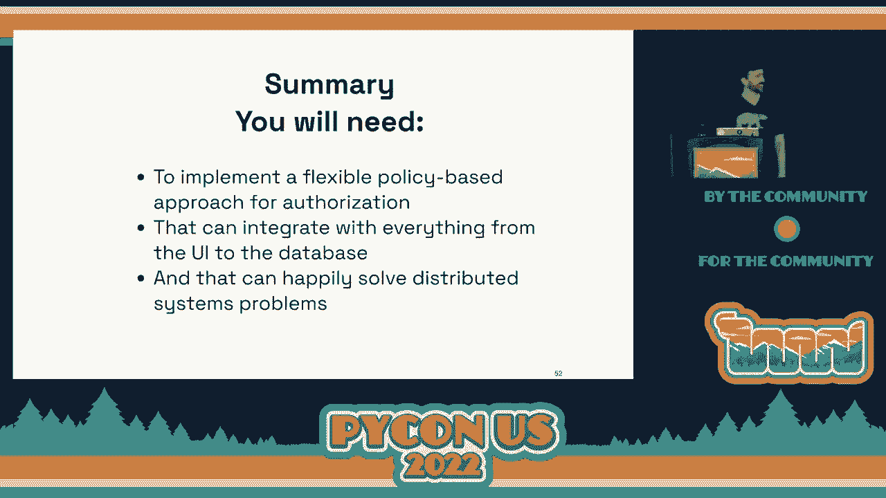
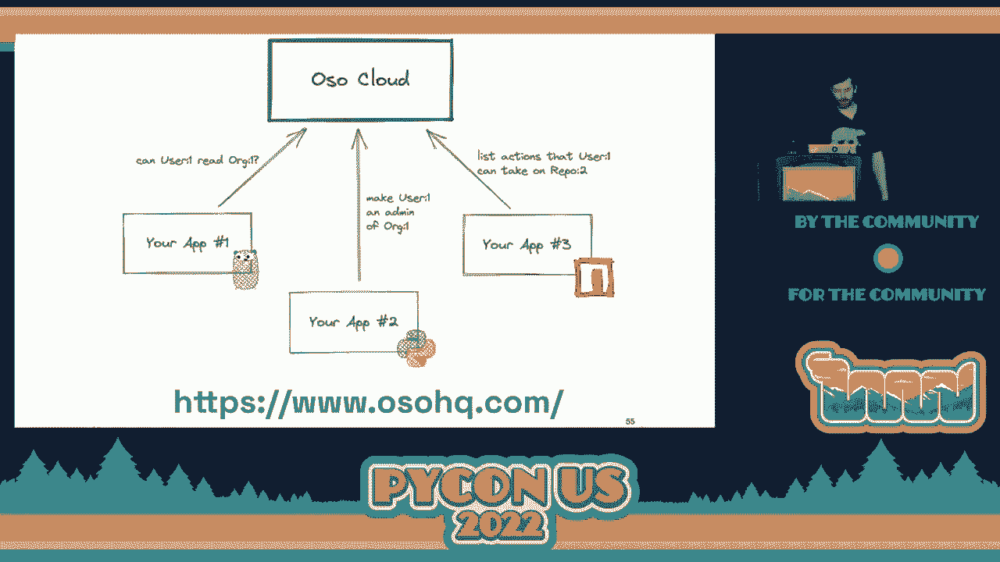

# P74：Talk - Sam Scott_ Why Authorization is Hard - VikingDen7 - BV1f8411Y7cP

 \>\> Our next talk is about to start。

 Sam Scott， the co-founder and CTO of OSO will talk about why authorization is hard。 \>\> Thank you。

 Sam。 \>\> Well， thanks very much， everyone。 So to start with。

 I actually have an announcement which is I will not be giving that talk。 Sorry about that。

 When I sat down to write this， I decided it felt a little bit too negative。

 Everyone just had a big lunch。 You don't want to come in here and hear me whine about authorization for half an hour。

 So instead， I will be talking about why authorization is fun。 There we go。 So this talk is for。

 I'd say， two types of people。 This is your chance to run away if you're not one of those two。

 Either you have never heard about authorization before， and I'm basically going to give you。

 a crash course in all the different ins and outs and what makes it fun。

 Or you've experienced authorization before， you have felt the pain， and you are incredibly。

 skeptical about how it could possibly be fun。 Who am I to talk about this topic？ Well， first of all。

 I did a PhD in cryptography， so I definitely not fun is。 But since then。

 since then I've been spending my time trying to make security less terrible， for developers。

 And in the course of that， I've met with hundreds of companies speaking about how they're trying。

 to do authorization and what's been fun about it。 So just put some terms out there。

 So I'm talking about authorization， not authentication。 So authentication is about identity。

 Who is the user？ User name， password， multi-factor or single sign on that kind of thing。

 I'm not talking about that。 I'm not talking about OAuth。

 I'm not talking about access to infrastructure， getting access to your S3 buckets。

 I'm talking about authorization inside an application。 So once the user is logged in。

 what can they do inside that app？ For some examples， I assume most people are familiar with GitHub。

 I think GitHub is a pretty unobtrusive authorization model。 Honestly， most of the time。

 I don't even think about it when I'm inside GitHub。

 I can just kind of go about my business and contribute to repositories。 On the other hand。

 AWS has a product called IAM。 Super powerful， flexible， complex。

 can let you do really anything you want。 And probably most people who have interacted with it wish they spent less time with it。

 There's a trade-off there。 I think Summer in the Middle is products like Notion。

 They can give you a large degree of granularity on a per-page basis。

 I can specify groups of people who can read or edit that page。

 And they actually have some really nice UI to help you inform you of exactly what you， can do。

 So you can see this document， you belong to this group， so on。 On the flip side of that， though。

 Notion has historically had some performance problems， victim of their own success。

 And allegedly a lot of that is because of the complexity of their permission system。

 So there's really no free lunch here。 It's like you can do a lot of work and then you're going to have a big engineering effort。

 So what is it about authorization that makes it important？ Well， from the examples you just saw。

 it's a core part of the product。 People need to get access to things。

 If you had a product without authorization， it would be entirely anarchy。

 Like everyone could just see and do absolutely everything。 So it's a cool part of the product。

 But equally， if it fails， your entire app probably goes down。 If your authorization breaks。

 no one could do anything in your app。 Or again， I don't like to hop on the security piece。

 but if you get authorization wrong， people might get access to data they're not supposed to。

 data breaches， things like that。 So the stakes are pretty high for authorization。

 And I think because of this， it's why people cannot some be a little bit scared to touch it。

 It can be a piece of the code base that people stay away from。 And that's not fun。 So in this talk。

 I'll be talking about three distinct areas of authorization。 The modeling， the enforcement。

 and the architecture。 And these all are intertwined and relate to each other。 So modeling。

 this is about basically figuring out what you want your application to do and。

 then going and implementing it。 So this is things like。

 do you want your app to have sharing or roles or administrators？ Or what does that look like？

 And then how do you go and build it？ As I mentioned at the beginning。

 I've spoken to hundreds of companies at this point。 And typically， when I ask them。

 what kinds of things does the app do， they all， about， half of them will say， oh。

 we have something super bespoke custom that you probably haven't， heard before。

 I'll kind of like smile and nod knowingly as they list something that's on my sort of。

 like list of different authorization patterns and I'll kind of go along and tick them off。

 But every now and then， I do hear something new。 And so that list kind of keeps growing。

 It's now 22 different authorization models that we've sort of seen out there that different。

 companies have。 And so most companies will have some combination of these 22 different models。

 So the question is， what do we do？ How do we implement this？

 A lot of authorization comes down to this core interface。 It has three inputs， a user， an action。

 and a resource。 And the thing we're trying to do is basically answer the question。

 can the user perform this， action on this resource？ All right。

 And the thing you get back is normally， you know， a yes/no。

 So as an example of a really simple authorization model， we might say that admins can do anything。

 All right。 This answer is always true when they're an admin。

 There's two core pieces of this model that I want to call out。 One is the logic。

 It's kind of the abstract piece of this that says admins can do anything。

 And the second is the data that drives that。 In this case。

 I'm just representing it as like an attribute pulled off of my Python class。 So you know。

 this is admin field。 But equally， that data could come from the database。 So in this case。

 the logic is the same。 I'm still saying admins can do anything。

 But the data is coming from a database， maybe an admins table or something like that。

 So those are two core pieces。 I'll come back to it a lot。 So this is a very simple model， right？

 It's just as admins can do everything。 We don't speak about non-admins。 And typically in products。

 people want more granularity than this。 You know， I wouldn't be able to invite members to the organization。

 maybe， but they can't change， the billing info。 You can read， but not write， and so on。

 And so in a product like GitHub， you have this concept of role-based access control。 It's a very。

 very common thing that people reach for。 The general idea is that you sort of group the kinds of things people can do by this thing。

 called a role。 And it kind of describes who you are or what you can do inside the app。 So in GitHub。

 you can have one of five roles on a repository。 These range from things like reads。

 which means you can read the repository， to triage。

 which means you can go and close issues all the way down to an admin that can basically。

 do anything。 So in Python， you might represent this role-based access control model by sort of mapping this。

 to maybe like a dictionary or something。 So here， we're saying for each role。

 we're basically creating a dictionary or this is， kind of a matrix from that role name to the kinds of things they can do。

 So read can read repository， clone repository， things like that。

 So given that we have that dictionary back in our logic， we can write this sort of a simple。

 role-based access control model like this。 So basically。

 the check becomes a user can do an action on a resource if they have a role。

 and the role has that permission on that kind of resource。

 And this is a really common thing that people reach for。

 This is a really good starting point to add a certain amount of granularities to your， app。

 But it's still not enough。 It's not enough because in， think about something like GitHub。

 you don't just have， one repository role， you have it on a per-repository basis。 And so in reality。

 most applications look more like this。 Most models rather look more like this。

 You have multiple tiers of resources that are related to each other。

 Users can have roles for the organization。 They can have a role in the repository。

 They create issues and stuff like that。 And so the logic and the data that backs this is similarly a lot more complex。

 So what I have here is a sort of kind of pseudo-code but pretty realistic example of that more complex。

 authorization model。 Now this is just for saying whether a user can do something on an issue inside GitHub。

 and we're doing things like checking the all roles， the repository roles， checking if。

 they're an admin， checking if they created the issue。 And this is not a， you know。

 this is not like an odd use case by any， by any search， of the imagination。

 This is very common both in terms of the complexity of the model and also the implementation。

 honestly。 Like you'll probably see equivalent code to this in many code bases。

 And so this is what tends to happen is that as your authorization model grows， so the。

 code grows and it kind of becomes this big ball of mud kind of sticking together different。

 conditions。 And like it's really sort of flaky， it's hard to maintain。

 People don't want to touch it because remember again， authorization， it's like it's on the。

 critical path。 It needs to be fast。 You've got， you know， performance hacks like thrown in there。

 And that's， that stuff is not fun。 And I promise you fun。 So how do we make this fun？

 So I think the solution is basically to turn to purpose-built languages for authorization。

 And there's quite a lot of good examples out there because authorization maps really。

 nicely to like either declarative languages or logic-based languages。

 It's just a paradigm that's really well suited for the problem space。 So why is this fun？ Well。

 first of all， building a language is a lot of fun。 Spoilers， aloe。

 so we build a language for authorization。 That part is a lot of fun。

 But you'll probably struggle to make the case to your boss that you should go and implement。

 a language for your authorization problems。 It's not unheard of and if you want to。

 I will help you make that pitch。 But I think the thing that's really fun is once you have something like an expressive。

 language for authorization， it kind of helps you get this， get authorization。

 like the implementation， details out of the way。 Right？

 So instead of focusing on like the how do you want to make it all work， you get to focus。

 on the sort of what do you want your product to do。

 And that is honestly that that's the piece that I find really fun。 Right？

 Going back to those 22 models， like which ones do I want？ How do I get them working？

 What do I want the users to be able to do？ So takeaways from modeling。

 Remember it's all about logic and data。 We're answering that question。

 can the user perform an action on a resource？ And it very commonly starts out simple but over time gets more and more complex。

 And that's just something to be aware of。 And so it's often a time where something like a language can be a good approach。

 Okay， so next I want to talk about enforcement。 So enforcement is all about taking that model that we just built and working out how to enforce。

 it or carry it out。 So many ways it's sort of the flip side of the authorized method that I just showed you。

 Right？ So this is a pretty common example。 A typical example。

 imagine we have a flask route that takes in a document ID and returns， the document to the user。

 We want to make sure that the user can only read documents that are allowed to。

 So we add our enforcement there that checks， okay， can the user do this thing。 And if not。

 we return an exception or an error。 And this is your bread and butter typical enforcement。

 But it's not sufficient。 It's not enough。 And the reason is because if you just do this。

 then typically what will happen is your， user will stumble across some page and they get some big horrible error。

 And that is not fun for anybody。 And I'm claiming that this is our responsibility as developers to avoid people from hitting big。

 horrible error messages。 And so the way we do that is we want to basically inform our users early on what they can and。

 can't do inside the app。 You can sort of think of this like Minority Report if you've seen the film。

 It's like a pre-crime decision where they can sort of anticipate that someone is going。

 to do something wrong so they get there early and then they， I'm pretty sure they just educate。

 them and send them on their way， right？ That's what we're trying to do here。

 So in an example of this in the wild， I have a little game here。

 It's going to be the spot the difference。 I have the same page in GitHub。 It's the OSO organization。

 At the top， I'm logged out and at the bottom， I'm logged in。 So there's a bunch of differences。

 The one I want to call out in particular is this account of how many repositories OSO supposedly。

 has。 So at the top， if you can't read that， it's pretty small。 At the top。

 it's saying there are 35 repositories and at the bottom， there are 70。 And basically。

 what's happening here is GitHub is filtering out and hiding from me the repositories。

 that I don't have access to when I'm logged out。 So these are private repositories inside the organization。

 GitHub doesn't let me try and open this page and then give me big error that says you don't。

 have access。 They just hide it from me entirely。 So I'm unlikely to stumble into an error page saying I don't have access because I can't。

 even try to get there in the first place。 So the way we might try to achieve this。

 let's say in a Django app， is by taking that authorization， model from before。

 taking our logic and trying to push it down into the database。

 The core idea here is by taking your logic and turning them to something like a query， filter。

 so that when we make a query to the database， let's say using Django's RM， it already。

 has those conditions applied。 So what I'm showing here is a specific Django technique that kind of lets you expose an。

 objects manager that has already had that authorization applied。

 And now anywhere in my app that I try and reference an object， I go and get a specific， document。

 I get a list of documents， it's always going to have that authorization logic， applied。

 And so my app kind of almost behaves like if you don't have access to it， it doesn't exist。

 There's other ways you can achieve this as well。 So some databases like Postgres have a concept called like row level security where you can。

 achieve the same thing but directly writing SQL filters in the database。 Okay。

 so you do this and then you get this， you know， if you don't have access， you don't， see it applies。

 But that's not the end， right？ It's not just about read or not read。 So I have another game。

 another spot the difference。 This one's going to be a bit harder。

 The difference here is that at the top， you can see this close issue button but not at， the bottom。

 And this is because I'm looking at an issue inside and also repository versus in a Python。

 repository。 So again， GitHub's not going to let me attempt to close the issue and then tell me you don't。

 have access so you're not allowed to do that。 That'll just hide it from me entirely。

 And I can try and bypass this， right？ This is purely a cosmetic thing on the front end。

 I could still go make the raw API request and GitHub will still enforce it。

 But what they're doing here is providing a really nice user experience that， again。

 it's kind of informing me what I can do just by the UI。

 And you can get some sort of maybe breadcrumbs of how they might implement this by interacting。

 with their APIs directly。 So you can call the GitHub API for a specific repository and there will be a field on the。

 data you get back called permissions。 It kind of contains these five different permissions which honestly a bit blurry with。

 roles and permissions here but that's fine。 And so basically you can see the difference here。

 When I query this API for an OSO repository， I have the triage true permission。 On the other hand。

 if I do this for the Python， I'm not a contributor to Python so I get。

 full spag from that permission。 And so with this small amount of data。

 you can see it would be pretty easy as a UI developer， to just implement the logic that says。

 you know， if you don't have the triage permission， hide the close issue button。 So in a nutshell。

 that's enforcement， right？ It's about taking that authorization model that we had previously。

 The logic， the data， all of that。 And then figuring out how to apply it across these like three different parts of your app。

 It's like on both， you know， enforcement on a specific thing。

 There's pushing it down into the database。 You can filter objects。

 And then there's also like pushing it all the way to the front end so you can provide these。

 like rich UIs that let's your users have a really fun experience。

 And imagining at this point you're all having an epiphany like， ah， this is why every company。

 reimplements authorization from scratch and get it again。

 Clearly they're having such fun with this problem that they don't want to like let someone。

 else do this。 On a more serious note， you know， there is， you know。

 because of the kind of two dimensions， of modeling and enforcement。

 there is like a high degree of customization that every product， kind of builds。

 And so I think until this point， many people just didn't really think it was possible to。

 build this in a way that was sort of generic enough that any app could use。

 But my claim is that like with better frameworks we can really make this a lot of fun。

 So as an example， we had an engineer at a company that was actually， you know， working。

 with us to integrate OSO in their application。 And they actually had so much fun working with us and making all this stuff work that。

 they， after finishing the project， they then went and applied for a job and joined us as。

 an engineer so they could work in that full time。 So I have a warning which is this stuff is so fun you might not want to do anything else。

 with your life afterwards。 So the final area I want to talk about is about architecture and what makes this fun。

 So again， I'm going to be talking a lot about logic and data。 Remember logic being， you know。

 things like admins can do anything or you can do a thing， if you have a role and so on and so on。

 The data is the piece that's back in it。 You know， you have a specific role in organization or。

 you know， this user created this issue。 For the following diagrams。

 I'll just use these icons to represent them。 Okay。

 so when we start out with our monolithic application， so this purple hexagon here is。

 representing our service， life is pretty okay。 We have our authorization logic that's happily integrated inside our app。

 Our app talks to the database so anytime it needs to get that data it can just call the， database。

 Life is good。 And then we go and implement a new service。 We have some new application。

 product feature， whatever it is。 So we have a new service and that has its own database。

 Now that service is probably going to want to do some authorization itself and it's very。

 likely that it's going to want to do the same kinds of things the first app was doing。 For example。

 suppose you were building GitHub actions， right， the sort of it's the CI pipeline。

 thing to sort of run your test suite， stuff like that。 You're building GitHub actions。

 The kinds of things you need to authorize is， you know， who can read running workflows。

 who can cancel jobs and restart them。 All of that is going to depend on the permissions you have in the repository。

 And that's the kind of thing that I was talking about that was implemented previously。

 And so what ends up happening is that you have multiple applications and multiple services。

 but they have a lot of shared logic and shared data to kind of make them all work consistently。

 And so what ends up happening is you sort of have this problem of like， well， how do I。

 make sure the right things have the right bits in the right places？ And this part gets fun。

 So the option space is kind of falls on like a two by two。

 On one hand you have the logic and the data that's spoken about a bunch。

 And on the other dimension we have， to what extent can you centralize those two pieces？

 So to start out with， decentralize logic。 There's not really much to say here。

 This is kind of the sort of the default that you would just do by continuing to do what。

 you were doing previously。 You keep writing your code in your apps。 If you need to， you know。

 if you need to duplicate stuff， you go ahead and write that， code multiple times。 Very simple。

 Your sort of model of working on services doesn't change。

 But it can be kind of hard to keep things consistent。

 Like if you want to make a change across everything， you need every team to go and make that change。

 So instead we might try and centralize some of that logic。 So again。

 so take my example from before about the roles model。

 We had that like dictionary and Python of like what roles can be what。

 Imagine we were to just take that piece of data and put it into some central place。

 And we put it into an S3 bucket。 And now essentially every application on startup periodically。

 I don't know what， can download， that sort of blob dictionary and use that to drive its authorization logic。

 What's nice about this is we now have that central place to define roles。

 If I want to extend an existing one and say， you know， repository readers can read GitHub。

 workflows， actions workflows， I can do that in one place。

 Now the challenge is we've obviously introduced this new external dependency， external piece。

 of state that's like shared between all of our services。

 So what we might do alternatively is kind of take that logic and wrap it inside a service。 So again。

 maybe all the service does is tells you can this role do this action on this resource， type。

 What's nice about this is now we're making that decision dynamically。 We don't need to worry about。

 like cache invalidation and things like that。 But we've introduced that external service dependency to like every single request。

 This is going to keep coming up again and again in this world is you have this piece of shared。

 logic that needs to be used across your entire architecture。

 There's just like no good way around this。 But in this case， this is a pretty simple set up。

 You can even add things like caching if you want to， you know， locally if you want to， sort of。

 you know， increase the robustness to the network going down and stuff like that。

 But that's going to introduce complexity。 Okay。 So what about the data？

 So in terms of having your data decentralized， so things like， you know， what roles do people， have？

 If you have a very small amount of shared data， so let's say that in your application， users。

 only really have like one role on an organization and that's it。

 Then what you can do is distribute that data on something like a cryptographic token。

 So maybe something like a JWT， you kind of encode it into that token that， you know， the。

 user has a specific role。 What's nice about this is now for an individual services standpoint。

 when a request comes， in， you know， you do your JWT validation and now you have that data as if it already was。

 local and you can just read straight off of that like， okay， you know， what roles the user。

 have and the rest of your app kind of continues as it was。

 That's a great option when your data is kind of small。 But think， you know。

 if you had to encode in that token， all of the orgs you have， all， the repositories you have。

 all the issues you created， all the PRs you submitted in GitHub， that token is going to be huge。

 So this is not， you can't really do this once data gets past the certain size。

 So one option for still keeping that data decentralized is you just leave the data where， it is。

 You say， look， I have my microservices or my services。 They， you know。

 have good service boundaries of what data they manage。 So every time I need that data。

 I'm just going to do what microservices do and I'm just， going to query that service。

 Maybe I have a role service that just manages roles。 Anytime I need to check that。

 I'll go query that service。 I think this is， this is like a good approach if you already have a very robust mechanism。

 for querying other services。 You've， I know you've gone all in on microservices and you've got a phenomenal。

 I know， GRPC method， for doing this because it really needs to be good because this will make your app incredibly。

 chatty。 Right？ Anytime you do authorization， pretty much every request。

 you're potentially going and reaching， out to another service and asking what roles does user have。

 So that brings me to the final option， centralizing the data。

 I'm going to claim that if you're centralizing data， you might as well centralize the logic。

 as well。 Like instead of just having it as be like a， a dumb store of， of data， extend it with。

 some logic。 And so in this world， what happens is you're almost back to the simplicity of that initial。

 monolithic API where an individual service can just ask， authorize， can this user read。

 this document。 And that， you know， that's just going to be a network。

 network request that goes in queries， that central service that has all the data。

 has all the logic and it can make that decision， and return that true or false。

 So from a downstream app standpoint， incredibly， incredibly clean and simple， there's like no。

 work to do。 The challenge here is building that central service。

 And it's kind of hard to understate just how challenging that is。

 So companies who've gone down this path talking Google， Airbnb， Carter， just across the road。

 Carter， when they did this， they had， you know， full team of engineers， six， eight engineers。

 you know， initial upfront work， multiple years， and then ongoing forever maintenance work on。

 keeping those services running。 And so like， for example， here's。

 here's what the Google's Antibar architecture looks like。

 Here's the architecture powering Google's authorization。 Because remember。

 we're talking about this is on every single request， you're making this， authorization query。

 Any latency you add there is added basically to all of your applications。

 So it needs to be incredibly fast， needs to be incredibly high availability。 So you know。

 some numbers from Google， they do something like 10 million queries to the， service per second。

 They have like trillions and trillions of rows in that database。

 They have something like five or six， nine of availability。 It's a hugely challenging problem。

 So very， very high benefit to doing this， right？ You sort of， if you do this。

 your application stay simple， but the， I guess I'd say the fun。

 part here is in building out this distributed systems problem。

 And that's kind of my takeaway from this whole architecture piece is fundamentally distributed。

 systems are pretty hard。 It's a really fun engineering challenge。

 but you sort of can't quite get away from that， fact that it's going to be。

 it's going to be a question of what trade off do you want， to make。

 It's a question of how much time do you want to invest。 It's a question of like， do you want this。

 do you want to balance ease of individual people， collaborating on a service versus having something more abstracted。

 So it's summarised everything I just said， right？ I spoke about modelling。

 where you need something super flexible to handle those 22 different， models。

 You then take enforcement， which requires you to take those models and put them across。

 everything from the front end back to the database。

 And then for those lucky few who are working across multiple services， you take that already。

 challenging problem and then figure out how to distribute it across a whole architecture。

 It's a lot of fun。

 It's a lot of fun。 On a serious note， I don't want to just like leave you there with this hugely challenging。

 problem that with all these kind of trade offs。 The reason I want to give this talk and the reason that my company exists is to try and。

 make authorisation easier for developers。 And so to that end， there's a couple of resources we have。

 So number one， we put together a series of technical guides called Authorisation Academy。

 This is basically long form content of the kinds of things I spoke about today。

 What are the trade offs？ What are the things you need to do？

 When should you use different patterns and why？ This is like fully vendor neutral。

 This isn't about OSO。 This is purely like go read this as a developer if you want to understand authorisation deeper。

 On the other hand， we do have a product that is basically our take on the best way to solve。

 for these kinds of problems。 So my sort of closing recommendations are sort of two things。

 Number one， if you listen to this talk and you thought， wow， this really does sound like。

 a lot of fun。 I totally buy everything Sam just said。

 You should come and work with us on it and have fun。

 Come build the language and distribute the system。 It's great。 On the other hand。

 you're listening and you're like， that sounds terrible。 I really want to focus on making my app。

 my product work really well for my customers。 This isn't the kind of thing we should be spending time on。

 Then you should check out our product because our mission as a company is basically to get。

 people to spend a tenth of the time on this problem that you currently do。

 So that concludes my talk。 Thank you everyone for listening。

 I will be hanging around to answer any questions。 We're also doing an open space at three in room 251D。

 I believe。 So I hope to see you out there at the conference and I will happily talk about this topic for。

 forever basically。 So yeah， thank you everyone。 [Applause]。

