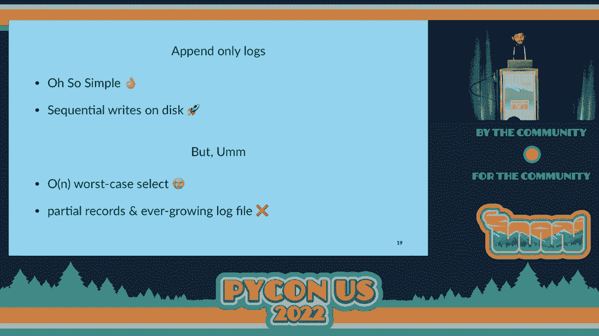
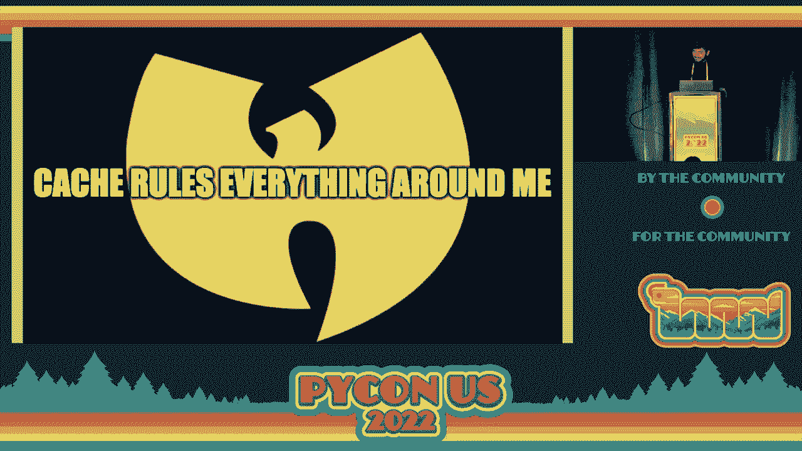

# P75：Talk - Sangarshanan_ Build-a-Database with Python - VikingDen7 - BV1f8411Y7cP

 So before we start， just a small story， so imagine me as an intern in my first company。

 I'm just in the meeting room and we are discussing how to build a good back end application and。

 database comes into the topic。 And me being an intern， I got all excited and I was like。

 you know what？ We should use Google Spanner， we should use Cockroach TV。

 we should use some niche databases， that were really cool at the time。

 And that made everyone aware that I was the intern in the room。 But apart from that。

 after the meeting， this person who I like to think of as my mentor。

 kind of like pull me aside and he gave me this advice that kind of stuck around。

 So he told me whenever you want to pick a database that you want to use for your project。

 think of three reasons why you should not use Postgres。 And if you can give me three solid reasons。

 then yeah， go ahead and think of another one， or else just use Postgres。

 And that actually confused me a bit。 I always thought developers like to play around with toys。

 cool new tools， the niche， new thing in the market， we like to use it， like to play around with it。

 But with databases， I always saw that people just like to keep it safe， they always go。

 with the default option。 And that made database kind of mystical for me because it's like this black box machine。

 that kind of just works， right？ Like for almost everything that we wanted to do。

 And we can just tune it to make it do things and we have our， you know， data engineers。

 database administrators who kind of take care of things for us。 So we just， you know。

 have fun with it。 But what made it mystical also made me curious about it。

 So I wanted to kind of break down what it all meant。 So why build your own database， right？

 That's the first question。 And the fact that it's mystical is not a good enough reason for。

 you know， sane people。 So it essentially kind of helps break down the abstractions that， you know。

 make up the， database， the black box that it is。 And you can also kind of reason about bad performance and bugs。

 which you can face when， you're kind of creating database。

 There are actually a lot of concurrency bugs that happen even in like production， create。

 Postgres databases。 But the timing has to be exactly right for you to face those bugs。

 They are really cool though。 And then you can actually write better queries if you know how your database is working。

 right？ Like how it actually kind of fetches the data internally。

 You can write good queries that don't take an ask to execute。 And also it's fun， you know。 Cool。

 So as the Victorian man once said， what to make it a database？

 So that's the first question I asked myself when I went to help to build the database， right？

 And fair warning， I was an intern during this time， right？

 So I did not have a good idea on how databases， you know， what are they made of， what do they。

 even do？ So this was what I had in my mind， you know。 So you， this is me。

 And then I just talked to the database and there is a base。 I don't know。 Is it a base？

 And then I consider a base to be how you talk to your database。 So it can be like your， you know。

 Python， SQL， I can be engine， it can be your PGCLI， you， know， CLI tool， it can be， you know。

 table plus literally anything， right？ And then the base kind of talks to the data that's there internally and it kind of returns。

 to results to you， right？ Like this is how I kind of imagine the database to be。

 which is not actually completely wrong。 But it has a lot of things inside and there are a bunch of utilities that are in the background。

 and a lot of crazy things which I'm going to discuss later。

 But this is essentially what I thought it looked like。 So first is the base， right？

 The part of the database that you can use to talk to your database initially。 And you know。

 fun fact， the database that I built is a good listener。 So you know， you can talk to it really well。

 Cool。 So I don't know， the code might be a little small。

 So you should find it in the repo if you can see。 Awesome。 Good。 So I chose repo as my， you know。

 weapon of choice to talk to the database。 Initially I thought of sending it pigeons， but you know。

 repo worked out well for me。 You can use this really cool Python library called Prom Toolkit that I used to kind of。

 build a very simple CLI that can be used as your interface to talk to your database。

 So what I'm essentially doing here is just defining a wild， true loop so that my terminal。

 keeps running。 And then I have a session that I start。 Oh， and by the way， I call my database。

 yeetdb because it's a throwaway database and you， know， you call it yeet。 Cool。 So。

 so after we define the session， we have a query executor which， you know， you pass， a SQL query to。

 you know， we'll discuss what that is。 And once you run it， it kind of gives you the result。

 It kind of gives you the time it took to run it。 It kind of gives you what operation you ran。

 It kind of returns the results if it can or if it faces any error in between the steps。

 It's just going to say， you know， I can't do it。 It is an error。 Yeah。

 So we're going to discuss what exactly is happening in the classes that are defined， here。

 but this is the general structure。 Okay。 So we talked， I briefly mentioned SQL， right？

 This is how you talk to your database。 So SQL is your databases second language of choice。

 First being love。 So SQL can be used， talk to your database。

 And there are several dialects of SQL that are present， like really， really crazy dialects。

 so much grammar that's there， which kind of put me to sleep when I try to like do research， on it。

 There was like so much。 So I decided to keep it really simple and I kind of define really like took part of this。

 syntax， kind of defined a grammar for SQL by myself。

 So it's no longer a structured query language for me。 This structure is gone。

 It's just a query language。 So this is the grammar that I define for my database。 So you have DDL。

 DML， DQL， the keywords that you hear。 So they mean data manipulation language。

 data definition language and data query language。 And you also have wildcards that you can use in your SQL query。

 So my grammar is like very simple。 So I can， you know， create a table。

 delete a table or a database and I can also perform， select and insert。 I cannot do alters。

 I have my wildcard， which is going to be a star。 And I have my query languages。 So I can use from。

 where and limit。 For the purposes of this talk， I'm not going to go into the details of the implementation。

 of like group buys and you know， joins。 But if you want to talk about it， you know， find me later。

 I would love to discuss that， with you。 Cool。 So this is how the query indicator kind of looks like internally。

 So what it does is， so if you kind of know how programming languages work， this is kind。

 of similar to how they work as well， like how they take in your code， which is kind of， an English。

 right， and kind of interpret what they mean and execute。 It's kind of like very similar。

 So the query indicator kind of takes my query in， right？

 It takes a simple SQL query and SQL queries actually make a lot of sense， you know， when。

 you read them as a person who is not kind of accustomed with the whole database thing。

 If you just show them like a simple SQL query， they know how it works， right？

 So you have a SQL parser， you have a SQL planner and you have your executive。

 So SQL parser kind of takes a SQL query and kind of splits them into tokens。

 SQL planner kind of creates a tree out of that query and then you kind of tree。

 So we're going to discuss what exactly those mean。 Cool。 So first， I write a query， right？

 I write a simple select query。 So if you cannot read the query。

 it says select star from customer where name is JoJo。 Right？ So once I write the query。

 the query gets passed。 And by passed， I mean the database kind of figures out that my DML is select。

 my wildcard， is star， I have from is my DQL， my customer is the table name or the table reference。

 I， have where clause which uses an equal operator and I have like these objects that I have to。

 compare， you know， a column reference， which is named and the object is JoJo。 Cool。

 So using this token， it generates like an abstract syntax tree， which kind of looks like this for。

 this query， which is very simple。 So if you want to look at query plans。

 you can also perform explain on your queries in， like。

 get a bit of like Postgres where you can actually visualize this tree for yourself。

 for any query that you write。 And for this simple query is just a select star from。

 you have customer reference when， you have a where clause and you have this operation that's running on a column name on a constant。

 Right？ So once I have a plan， I know exactly what to do because there's a order defined by SQL。

 standard， like how I have to kind of execute a query。 So I just go ahead and run it。

 But you know the query that I wrote is really bad。

 You cannot just select star all the data because you don't know the amount of data that you're。

 querying。 And when you query a lot of data， you're going to face some problems。 Cool。

 So now our base part is kind of sorted。 We can talk to our database。 Now we get to the fun part。

 you know， the data part where we're going to actually， you， know， build the data out。 Cool。

 So first of all， I decided， you know what， I'm going to keep it simple and I'm going， to， you know。

 write all my data into memory。 So what I've defined here is a simple database class that kind of creates a new hash map or。

 a dictionary in Python words for every single table。

 And what I mean by an insert is just inserting a new key and a record for a particular ID。

 for a table。 Right？ So it's just a dictionary insert， a dictionary get。

 and a delete is just a dictionary pop。 And this kind of worked for me， you know。

 it's crazy how easy it is， but it works。 And I can just define my database。

 I could define a table which is test。 I can insert named Barry who is 35 and I can just be like。

 you know what， select name and， select age from the test table and it's giving me the results。

 And I can also delete age。 I've never done a select。 It's going to give me like a key error。

 which means， you know， there's no agent that is， immortal。 But one thing is missing。

 which is persistence because when my database closes or if I close， my session， everything's gone。

 you know， puff。 So I need some kind of assistance。 So to do that， you always remember to flush。

 which I do by flushing it to the desk。 So for every insert that happens to the dictionary。

 I just write it to a file and deletes are， kind of a spend operations。

 I'm going to insert something called tombstones。 So for tombstone。

 I just use the tombstone emoji database， which is like a bad way because， it takes a lot of space。

 But you know， I want to have fun。 So， uh， apparently locks are nuts， right？

 Because it's so simple and sequential rights on disk are like performance， like super fast。

 It's like one of the best operations you can do in the disk to a file。 You know。

 it's really happy about that。 But you have this issue when you move in from in memory to disk。

 right？ Because when you want to select something， you have to go through every single key in。

 your disk， which gives you an off and worst case select complexity， which is like that。

 And you also have the issue of like when you kind of flush to a disk， what if something， happens。

 you just flush partial records or where did it go。

 And also you kind of keep appending to a log file， which kind of can get really big and。

 you run out of disk space， right？ That's also a problem。

 So we're going to solve these issues one by one。 Cool。

 So we're going to kind of bring back the in memory concept， which kind of is like a cache。

 which is going to put our disk。 So what it's going to have is contain where exactly the files are present in the disk。

 And what I call cache and in memory dictionary is what database calls indexes。

 Yeah， it's a really cool concept where database is kind of have a secondary structure on top。

 of your actual data， where it kind of maintains where the exact data is located in the disk。

 or you know somewhere else， depending on the database。

 And we can use that to quickly look up where my data is and then directly just go there。

 rather than just you know looking at the whole data， which can be really big。

 So we're going to start really simple and bring back our in memory dictionary， which is。

 going to be hash indexes。 So by hash index， I just implement an in memory mapping of every key to the byte offset location。

 So for example， I have I have written to my file a name called John and a name called， Don， right？

 And the ID is like one and two。 And the offset location is like 0， 9。

 18 and it just goes in multiples of nine because， that's the size I'm giving it giving the table to write。

 you know， this kind of is defined， when I create the table。

 I kind of define what size I'm going to occupy for every record。 And if I go more than that。

 it's going to be like， you know what， I can't do this。 This is bigger。 So if I want to look up。

 for example， the key to or the named on， I just go to the offset， nine。

 which I can look up directly from the hash index。 So it's like， oh。

 want to look it up and you just go and read it from the disk。 I mean。

 seek it from the file in the disk。 So it's super fast， right？ And cool。 This is the implementation。

 The code can be really bad。 So you know， you can refer to the whole。

 So what I'm essentially doing here is what I just said。

 So we kind of define the size for the record that we have and also the primary key and。

 we just use the size to kind of exactly know the offset in which the data is located。

 So we just perform an insert。 And when we do an insert， we do actually two inserts。

 So we actually insert to the disk and also insert to the index。

 We kind of tell the index where exactly my start and end offsets are and where exactly。

 my data is so that it can quickly look it up。 And when I do a get。

 I just kind of use those to get the data out。 And when I do a delete。

 I just kind of look for that index。 And if it's like a tombstone， I just be like， you know what。

 the data doesn't exist anymore。 Cool。 So we have actually solved the problem of speed， right？

 Because now we have indexes and data is super fast。

 But we still have the problem of running out of disk。

 So we're going to solve that problem by breaking our logs into segments， which is going to。

 be very easy because we're going to be defining fixed size for every segment。

 So if you have-- so this is from DDIA， by the way。

 So if you have two segments where we have these append only logs， right， you're going。

 to have repetition of keys that happen。 Because for every insert， you're going to perform an append。

 And a key can have like thousands of inserts that happen。

 And you just want the latest insert that happens for a key， right？

 You don't care about what happened like 10 inserts before。

 So what you do is you perform this operation called compaction that happens in the background。

 that you don't have to care about。 So what compaction does is it takes these older blocks of segments that are there for the data。

 and kind of combine them into a newer segment。 And it creates a new segment。

 It doesn't replace anything。 It just takes the older segments， creates segments。

 creates a new segment， and then just， updates the mapping。 So when a look up happens。

 the database just looks up the newer segments。 And this is actually quite optimal because this is happening in the background。

 And merge operations are quite efficient when you perform them on files and disk。

 And then you have now smaller segments that keep incrementally getting smaller as you。

 keep writing data， right？ So you don't have to worry about ever running out of this size if you have these operations。

 running。 And when I say the segments get deleted， we don't actually delete them。 We just say。

 you know， mark them for deletes。 And what happens is there is an operation that happens in our database in the background。

 which I like to call vacuum， which is a really cool name for a process， which kind of does。

 exactly what it says。 It kind of cleans up all these segments that are marked for deletes。 Cool。

 So we solved both the problems， right？ We have speed and we are not going to run out of this space。

 So we have super fast lookups that happen through indexes。

 We have append only writes that happen through logs。 Both of them are awesome。

 And we have compaction happening in the background。 We are not running out of this space。

 And because of the presence of both these structures。

 we have crash recovery because whenever database， crashes。

 we can generate the state of our index directly from our data。

 And we also have concurrency because you just have one writer in your append only logs。

 And the tree can have multiple writer threads that kind of run simultaneously， right？

 So we have concurrency too。 But there is an issue by issue with our hash indexes。

 which is if you have a lot of keys， in your hash index， you can no longer have it in memory。

 So it kind of fits well when you have less number of keys， but more keys means more。

 memory and you're going to fail。 And you also have really bad performance for range queries。

 You want to look up data from like， you know， index ID one to ID hundred or to look them。

 up individually， right？ Which is like， I don't want to do that。 That's cool。 Cool。

 So we're going to solve this by introducing a very simple concept， which is sorting。

 And interviews will be happy that， you know， we're using sort of， you know， we're using。

 sorting here。 So what you're going to do is rather than just storing it as in an append only format sequentially。

 we're going to make sure that what we write to the disk is sorted so that when we're going。

 to look up a range key， we just know what range it is in。

 And we don't also have to store an in memory mapping of every key。

 We can just have like a key that's kind of like we can just have a sparse representation。

 of the key so that if there is any key between the two keys， we know exactly where it is。

 because it's sorted， right？ So we can just quickly look it up。

 So we don't also have like a huge index file that's， you know， crunching our desk。

 So an example of an in memory balance tree that we can use to replace our hash index is。

 going to be red black tree。 We also have like a lot of other sorted balance trees that you can use。

 but I just picked， this。 So red black tree can like I'm not going to explain how the data structure works because。

 there are other Indians on the internet that do that。

 So red black tree essentially just have really simple rules that it follows。

 So you can just have a black key， a black node in the root or the leaf and red cannot。

 have red children or parents， right？ So these are these two rules that it follows。

 And then you just when you make an insert or a delete， you just make sure we just make。

 sure to update your node so that the rules still apply。 And when you do that。

 your tree is going to be as balanced as it can and it's going， to have a log in complexity。

 which is like really cool。 So now again， there is no persistence because we're having this in memory。

 having this red， black tree in memory。 So we're going to have to write our tree to a desk。

 So to do that， we're going to introduce what's being the standard in the industry since the， 1970s。

 which is like a crazy time for an algorithm or like a software to kind of live， on， right？

 And that is B trees。 So in B trees， we just take out these nodes that we had in red black trees and we just。

 make them into pages。 And pages kind of work well with our OS because the data in the disk is also arranged in the。

 form of pages。 So it kind of works。 So what we do is if we have this is also a media here。

 by the way。 So we just have these， we just have a page which has the keys that we want in a sorted。

 order and it has a reference to the keys that kind of move around like a tree。 So for example。

 we have 100 to 500 and there is a reference for keys that lie between 100， and 200， right。

 which goes down and the keys less than 100。 There's another reference that goes down。

 So if you want to look up， for example， key to 51， we just go by the third reference and。

 then we know to 50s there。 Between 250 and 270， we just go down and we find it， right。

 So we have a fixed size for these segments and in certain update operations kind of happen。

 depending on the file size。 And yeah， this kind of just works。

 So how do you perform operations on this B tree， right？ Like， again。

 I'm not going to completely go into the details of insertion and deletion， on a tree。 So again。

 there are a lot of videos for you to check it out or， you know， on the internet， it's all there。

 So in general， if you just need a key， you just check if there is a space in the segment。

 because segments are fixed size， right？ So you must have space to insert。 If you have space。

 you insert， if you don't have space， you split the key。 That's it。 And with deletions。

 it's a bit more complex。 It depends on if you want to delete what's in the leaf or what's internal and if it's。

 leaf， it depends on the number of keys， if it's internal or depends on the keys and it。

 depends on the children。 So essentially it's like you either do the operation or you， you know。

 split the tree， change it around and then do the operation。 And again。

 B trees have existed for a long time and it's a standard implementation in。

 almost every relational database and even non-relational databases use it as an index。

 And it has like， again， over log in complexity for performing these operations and maintains。

 the tree in a balanced way。 So， B trees are old， right？

 But we're going to have a lot of improvements that can happen on top of B trees。

 So one thing that we can do is copy on right， which is rather than updating a page in a， tree。

 we're just going to create a new page and then reference the new page rather than。

 updating the existing page， right？ And what we get out of this is something super cool。

 which is really good concurrency， because for example， if someone is running a query at 8 a。m。

 and they look at the tree， state at 8 a。m。 They look at page at 8 a。m。 And after 8 a。m。

 there are several updates that happen to that tree， right？ So the references keep changing。

 But since it's copy on right， they're going to be new pages that kind of reference new， queries。

 So the query that you run at 8 o'clock， it's going to return the result of the database。

 at 8 o'clock。 It's not going to change as time moves， even if your query takes a long time to run。

 And this happens with every query that runs at every point in time。

 So we call this snapshot isolation。 And since we have this。

 we can actually-- so this is what databases call MBCC or multi-version。

 concurrency control where you can have several versions of a single data so that you have。

 snapshot isolation in your database。 There is also the concept of wall logs where you just have append only logs of B3 operations。

 so that you can regenerate your B3 if you're in a base crashes and you also have latches， and logs。

 So if a write happens， you can just lock a tree saying that there's a write happening。

 so that concurrent reads don't read dirty data。 Cool。 So just a quick plug。

 Euro pattern is another awesome conference that is happening in 11th and 17th of July。

 in Dublin Island。 It's happening also remote。 And the program is going to be out in the next week case。

 There is also a really amazing stuff called Make a Summit。

 We have transcored awesome stuff happening。 So just check it out。 And thank you so much for coming。

 I'm going to wrap this talk up。 Yeah。 [APPLAUSE]， [APPLAUSE]。

