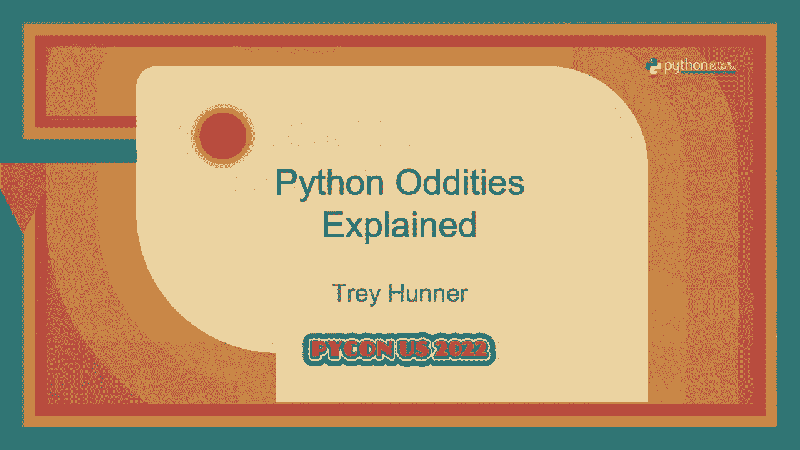
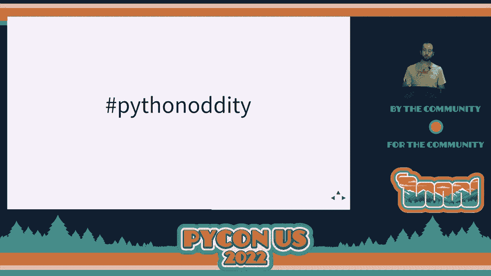
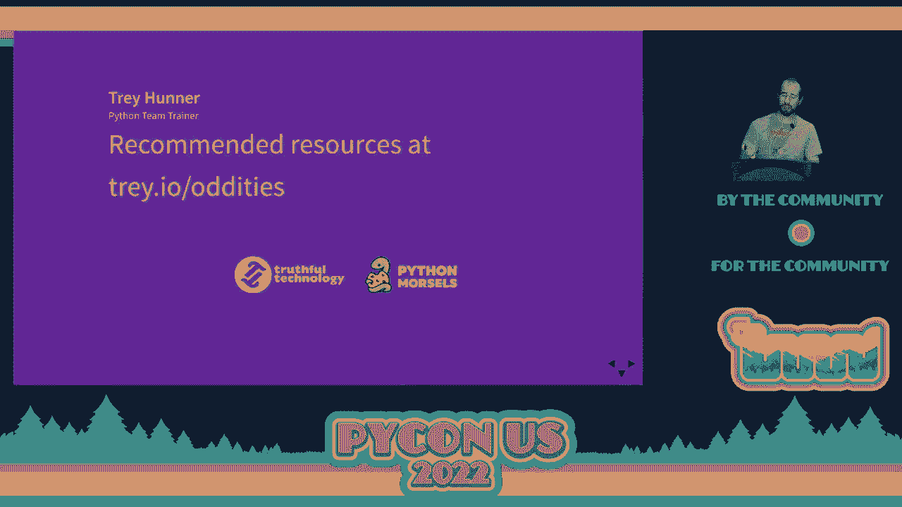

# P79：Talk - Trey Hunner_ Python Oddities Explained - VikingDen7 - BV1f8411Y7cP

 All right， so is everyone awake？

 Sort of。 Okay。 So my name is Trey and I help folks level up their Python skills through onsite and remote。 team training， mostly remote the last couple of years for obvious reasons。 And with Python morsels which helps experience programmers develop a habit of deepening your。 Python skills every single week through hands-on learning because you don't learn by putting。

 information into your head by trying to retrieve information from your head that you actually。 learn。 So when I do team trainings， I often see some very weird code because my students are playing。 with Python which is lovely because playing is a wonderful way to learn。 Sometimes though when I'm trying to explain something that Python is doing， I realize that。

 I don't really know what Python is doing or at least I don't understand why it's doing。 what it's doing。 So this talk was inspired by all of the individuals who asked me weird and confusing questions。 while I was holding a Python workshop at your company。 So thank you for your confusion。 This is a Python 3 only talk。 If this was a Python 2 oddities talk。

 it would be much longer and much funnier。 Feel free to ask me questions about Python 2 oddities later if you're strangely interested。 Alright let's get started。 So first I would like to talk about variables。 Let's say we have a variable x that is equal to zero and let's say we have a variable numbers。 and that variable points to a list of numbers。 If we loop over this list of numbers and assign y to the square of each of these numbers。

 what do you think y will be after this loop？ What's your guess？ Who thinks it will be zero？

 Who thinks it will be eight？ Who thinks it will be 64？ Who thinks it's an error？

 We can't see what y is。 So it turns out we can see what y is。 It's 64。 And if we access x。 who thinks it's zero？ X is still zero。 Who thinks it's eight？ Who thinks it's something else？

 No it's not something else。 I'm not sure what you were thinking it was though。 It's eight。 And it's eight because inside of a loop variables leak their scope。 Loops don't have their own separate scope。 So this 4x in numbers。 this is actually an assignment that happens during each iteration， of our loop。

 It works the same way that an assignment statement happens with an equal sign。 The part between the four and the in that x there is the same thing as the left hand。 side of an equal sign。 So if we take those same x and the same numbers variables and we make a list comprehension。 representing the squares of these numbers and we use that x as our looping variable， what。

 do you think x will be after we've executed this code？ Who thinks it's zero this time？

 Wasn't zero before。 Who thinks it's eight this time？ Still eight。 So it was eight in Python 2 but it's zero in Python 3 which is kind of nice。 List comprehension has their own scope。 That's the last time I'm going to mention Python 2。 It's just Python 3 from here on out。 So let's say we have a global variable numbers and we want to add more numbers to that by。

 using the plus equals operator。 What do you think will happen if we call add numbers this function here with the list。 4， 5， 6。 Now it could modify numbers。 It could just give us an error。 It could make a local variable number。 So who thinks it's going to give us an error？

 Who thinks it's going to make a local variable numbers？ It won't modify the global。 Who thinks it's going to modify that global variable numbers？ So very mixed here。 Most of you seem a little bit confused about what it's going to do。 As you should be。 this is a strange thing to do。 It turns out it gives us an error。

 It gives us an error because this plus equals operator both reads from and assigns to the。 variable that's on the left hand side。 So we're trying to read from a global variable and assign to a global variable and Python。 doesn't like that but it's not because of the plus equals， not in particular。 If instead we used an equals with a plus we would still get an error。 When we defined this function。

 Python actually parsed all of the assignment operations and。 claimed all of those variable names as local variables。 Since numbers is a local variable。 we can't read from it before we've written into it。 That doesn't make sense。 So let's look at one more example of the same thing。 If you don't believe me yet。

 hopefully you'll believe me after this next one。 If we make a similar function that prints the global variable numbers and then assigns。 to it right afterward， calling that function gives us an error。 Variable names in Python cannot be both local and global in the same scope。 So we're allowed to read a global variable and we're allowed to write to a local variable。

 but not with the same name。 Python doesn't allow that because that would probably be a bug in our code。 This really doesn't make sense to do。 We're allowed to read from global variables without writing to them but once you assign。 to a variable that variable magically becomes local。 So if we swap these two lines of code。 our function will not give us an error。 This function actually does what's expected but our global numbers variable hasn't changed。

 because we're assigning to a local variable here and then we're reading from that local， variable。 So the global numbers variable and the local numbers variable both have the same name but。 they're different variables pointing to different objects。 Assignments in Python only change the local scope。

 You can't change the global scope with an assignment。 Actually you can。 there's an escape hatch to do so I'm not going to mention it though。 because you shouldn't change the global scope with Python。 You could only change the local scope with Python。 All variable assignments are local。

 So this will always assign to a local variable here inside of a function。 Now what if instead of doing an assignment in this add numbers function we use the extend。 method on this list。 How is this any different？ So when we call this function。 Python might print out 123456 or it could give us an error， or it could do something else。

 So who thinks this will give us an error？ Who thinks this will print out 123456？

 Who thinks it's also going to change the global variable numbers？ All right。 so a lot of you got this one right。 You're right。 This prints out 123456 and it changes numbers。 Now what's going on here？ The reason this works and a lot of you had some intuition about this is that the word。 change is tricky in Python。 It's an ambiguous term。 What are you changing？

 You can change a variable or you can change an object。 So assignment statements change a variable that is which object a variable is pointing， to。 That's what we talk about when we talk about scope。 That's what we've been talking about。 This isn't an assignment though。 This is changing an object。

 We're not changing which object a variable is pointing to with an assignment。 We're doing a mutation which changes the object itself。 So we can't assign to a global variable but we can mutate any object that we can get our。 hands on as long as it's a mutable object。 So you're allowed to read from global variables in Python but you can only write to local variables。

 every assignment statement assigns to a local variable。 There are some escape hatches in Python to get around that limitation but you shouldn't， use them。 List comprehensions have their own scope but for loops do not because Python is function。 level scoped。 It's function scoped not block scoped。

 We don't really have blocks in Python and Python scope rules are entirely about assignments。 not about mutations。 Speaking of which， that's our next topic， mutability and mutations。 Number two is about changing variables which object those variables point to。 Mutability is about changing objects。 So let's say we have a list of numbers and we assign numbers to numbers。

 If we append to numbers to how many elements will numbers to contain？ So who thinks three？

 Who thinks four elements？ I think something else。 There's a couple something else。 There's always a couple something else。 I'm curious what those would be。 It's four elements。 There's numbers。 What is numbers at this point？ We append it to numbers two。 Who thinks it's three still at this point？ Who thinks it's four at this point？ You're right。

 It is four and it's four because these two variables are referencing the same object。 So we have two variable names that are referencing the same object。 These are not two different objects。 Mutating one of these lists mutates the other because they're the exact same list。 Using objects and changing variables are distinct things。

 Assignment statements change which object a variable is pointing to。 But mutations change the object itself。 And that will change or seem to change any number of variables that might be pointing to。 that object。 So can we make a tuple with a list inside it in Python？ It's a weird thing to do。 Is it possible？ Who thinks you can do this？ Python will allow it even though it's weird。

 Who thinks this is an error because it doesn't really make sense？ So Python does allow this。 We can do it。 What if we call the append method on the first item in this list？ Well。 Python will allow this。 Who thinks it will allow it？ Who thinks this is not possible？

 Shouldn't be possible。 So Python allows this。 It does allow us to append to this list。 It doesn't give us an error at least。 The first item in this list has now changed。 Now tuples are immutable， meaning we can't change them。 It seems like we've changed this tuple though。 But we haven't。

 We haven't actually changed the tuple， not technically， not from the tuples perspective， at least。 If we take the first thing in this list and we assign a variable to it and then we append。 to that variable， we've changed the list that that variable is pointing to but we've。 also changed every other reference to that variable because we changed an object。

 And not a variable。 Variables don't store objects。 They're not like this bottle here that stores liquid。 They don't contain a thing。 They refer to something。 They point to something。 So variables are more like pointers or references。 They don't actually contain objects。 Now what would happen if we make a new list and then we try to append the list to itself？

 Who thinks this is possible to do in Python？ You think some weird things are possible in Python。 I like you people。 This works。 You can append the list to itself。 Now this makes an infinitely recursive data structure with Python represents a bit strangely。 at the REPL。 It does this to not break our machine。

 Otherwise it would be an infinite amount of square brackets。 So Python represents this strangely but it is possible to do。 And this really demonstrates that analogy of a variable being a bucket that contains an。 object doesn't make sense because a bucket can't contain itself。

 A bucket can have a piece of paper in it though that refers back to itself。 So lists are not buckets which contain objects。 Instead they're look up tables that reference the memory locations of an object。 Data structures， lists， dictionaries， tuples， anything else that might contain something。 They don't actually contain objects。 They contain references to objects。

 Variables also don't contain objects。 They just refer to or point to objects which means that change is an ambiguous term in Python。 We can change which object a variable is pointing to with an assignment statement or we can。 mutate an object which actually changes the object itself regardless of what variables。 or data structures might be pointing to that object。

 Now if you feel rusty on this topic I wrote an article on it recently called Overlooked。 Facts and About Variables and Objects in Python。 It's all about pointers。 And I highly recommend Ned Batchilder's talk from years ago at Python called Facts and。 Mists about Python names and values and Brandon Rhodes' talk from quite a while ago called， Names。

 Objects and Plumbing from the Clif which actually goes into quite a bit more than。 just this topic here。 Alright let's talk about ducks。 Let's say we have a list called Duck List。 What do you think would happen if we used the plus equals operator to add a tuple of two。 values to this list？ Well Python let us do this。 Who thinks this will work？ It'll do something。

 Who thinks this will give us an error？ Doesn't make sense to do。 So Python actually allows this。 It allows us to do this and what happens is Python loops over the tuple and adds each。 of the values to our list。 Let's make a tuple called Duck tuple that has two strings in it。 Will Python allow us to use plus equals to do the same thing but with a list to a tuple？

 So we're trying to add these two items in our list to the tuple。 So who thinks this will work？

 Still works。 Who thinks we get an error at this point？

 We do get an error at this point but the error isn't because we can't use plus equals。 with a list or rather plus equals with a tuple。 Plus equals works with tuples。 We're allowed to use plus equals on tuples as long as it's with another tuple。 So plus equals on tuples only works with other tuples。 It doesn't work with lists。

 That's the weird thing。 And in fact tuples aren't actually the odd one here。 Lists are the odd one。 Let's take an empty list and try to use a plus equals operator with a string。 Who thinks this will work？ It'll do something。 Who thinks this is an error？

 So this does actually work but it might not do what you think it does。 It loops over the string and adds each of the characters to the list because the plus equals。 operator on a list accepts any iterable of strings。 As long as it can loop over it。 it will loop over it and as long as it gets strings it。

 will add those strings to the list individually。 So plus equals on lists does the same thing as the extend method on a list。 The extend method accepts any iterable and it loops over it and it pins each of the items。 to the list from that iterable。 So plus equals on lists is consistent but not with plus equals on tuples it's consistent。 with the extend method on lists。 The list extend method and this plus equals operator on lists。

 they're not an isolated， issue。 Many other operations in Python accept any iterable。 For example。 the string join method accepts a list but it also accepts a tuple and even， accepts strings。 But again it might not do what you expect it to do。 What happens when you loop over strings？

 What do you get？ It's technically strings that represent characters because strings are infinitely recursive data。 structures。 That's a whole other oddity though。 So when we loop over strings we get substrings and that's what we're doing。 We're joining together each of the characters in this string with space which is a strange。 thing to do。 So if we give the dictionary constructor in Python an iterable of two item iterables it。

 will accept whatever we give to it as long as there are two item iterables and make the。 first thing a key and the second thing a value。 Lots of things in Python accept any iterable as long as it fits the shape and the style。 they're looking for。 They don't really care what you give to it。 What's the word for this？

 What's the animal that we use to describe this？ I'm sure someone knows。 A duck。 Right。 We're practicing duck typing。 Rather， Python is practicing duck typing。 So the idea behind duck typing is when we're trying to identify an animal we don't check。 its DNA to see whether it's a duck。 Instead we observe it。 We observe it and say， you know。

 if it looks like a duck， it walks like a duck， maybe it， sounds kind of like a duck。 then it's a duck。 That means that checking the behavior of an object instead of checking what the actual。 class of that object is。 We don't check its type， its class， we check its behavior。 So we don't usually care whether something is a list。

 We care whether it's a sequence or maybe whether it's an iterable。 And we don't care whether something is a function， we care whether it's a callable。 We tend to use generic words for describing behaviors of objects instead of discussing。 the types of those objects。 All right。 So the list extend method accepts any iterable and the plus equals operator on lists works。

 the same way as the extend method。 It's consistent with extend。 But the plus equals operator works differently on tuples and in fact on most types of objects。 And in many cases， Python doesn't do type checking at all。 Because it's practicing duck typing。 It's checking the behavior， it's trying something out and hoping for the best。

 So if you embrace duck typing in your own code by thinking in terms of behaviors like。 an iterable instead of a type like a list， you'll better understand what Python is doing。 But you'll also probably write better Python code。 Your code will fit in better in the Python ecosystem。

 So familiarize yourself with terms like iterable and callable and hashable sequence mapping these。 generic terms that describe behavior instead of the type of something。 And if you're interested in specifically how iterables work in Python， I gave a talk on。 this some while back called loop better a deeper look at iteration。

 Though it really dives into how iterables work deeply。 You don't really need to understand it。 But it's nice to embrace these generic terms when you're talking about types。 Because in Python we think in terms of behavior not in terms of concrete types。 Okay so we're going to take a very quick mental break before an accession。

 Here is a dog in a mailbox。 A chip monk enjoying some tea。 And a cat debugging its code。 Alright that's a long enough break。 Let's look at the plus equals operator again。 Let's take two variables and assign them to the same tuple。 Then let's try to use the plus equals operator to modify one of these tuples。

 Does Python allow plus equals on tuples？ Who thinks Python allows plus equals on tuples？ Okay good。 You should know that by now Python allows plus equals on tuples。 We just saw it。 So Python does allow plus equals on tuples。 And we can use it with another tuple。 So A at this point has four things in it。 How many things does B have？ Two or four。

 what do you think？ Two things， four things。 So it turns out it has two things。 So A has four things。 B has two things because we changed A， we didn't change B。 So plus equals on tuples is really the same as a plus operator followed by an equal sign。 We're not mutating the tuple。 We're just making a new tuple and then reassigning our variable to it。

 So X plus equals something is the same as X plus something followed by an equal sign afterward。 Both of these statements make a new object and then afterward point our variable to that。 new object。 Alright let's take two variables and do the same thing。 We'll assign them to the same list。 Now let's use the plus equals operator to modify the first list。

 So our first list now has four things in it。 How many things does our second list have？

 Two or four at this point。 Yeah， this point our list has four things different from the tuple。 So the plus equals operator doesn't mutate tuples but it does mutate lists。 Now I find this interesting because that means that on lists A plus equals something does。 a mutation but A equals A plus something creates a new object and then reassigns the。

 variable to that new object。 So in Python A plus equals B is not always the same as A equals A plus B。 It is sometimes， but not always。 These two things are the same on strings。 on numbers and on tuples but they do different， things on lists。 Now this seems a little bit inconsistent but from Python's perspective it's perfectly， consistent。

 So this is because lists are mutable and plus equals is an in place addition operation which。 means it performs a plus operation in place。 So you're supposed to do a plus operation in place on mutable objects。 It's actually supposed to mutate in place if it can but it's convenient to use plus equals。 on immutable types like tuples and strings and numbers。

 This is a convenience for us because we don't want to have to type plus and then equals all。 the time in our code。 So on immutable types in place assignments they just fall back to returning a new object。 instead。 So on mutable types in place assignments mutate the object and on immutable types they return。 a new object to us。 Now if we take a tuple with a list inside it who thinks we can put a list inside of a。

 tuple。 Okay so we've stuck a list inside of a tuple you remember that we've already seen this。 It's possible to do but what happens if we say x sub zero plus equals a list three four。 Now we've got a list in this tuple who thinks it will mutate this list。 It's actually going to mutate the list。 Okay who thinks that this won't work we're going to get an error。

 Who doesn't know what this is going to do？ Okay so that was most of you here。 Now it turns out that the first two of you here you have an interesting situation going， on。 It actually does give us an error but it also mutates the list。 So everyone's happy at this point right。 Now this is probably the most obscure Python oddity I've seen and it's never going to。

 bite you in real code because why are you trying to mutate a list that's inside of a。 tuple by subscripting the tuple nothing seems like it's a good idea here but we're going。 to take a look at what's going on anyway。 So whenever we use the plus equals operator in Python Python will try to call the dunder。 iad method on the object that we're pointing to and in that case it's our list。

 After that it will do an assignment。 So the exception happened because the assignment failed but that was after dunder iad successfully。 mutated our list so the list dunder iad method mutates our list and then returns itself back。 for the sake of that assignment statement but we're not allowed to assign into a tuple。 so we get an error at this point。 Now this isn't ever going to bite you in real code because again why are you doing this。

 in your code。 What's the situation with this makes sense but this is an implementation detail that we。 found an interesting excuse to learn about here。 So some takeaways。 The plus equals operator always performs an assignment but plus equals and other augmented。 assignment operators or in place operators as they're all also called are also allowed。

 to mutate the object that they're called with if that object chooses to mutate itself。 if it's a mutable object list mutate themselves with plus equals but tuples don't。 Now this might seem inconsistent but consistency is really about your frame of reference。 According to the Python documentation in place additions are supposed to do their operation。

 in place whenever possible and lists just happen to be the most common data structure。 where it's actually possible to do that。 So if Python doesn't do what you expect it to do that doesn't necessarily mean you found。 a bug in Python。 It does mean that what Python's doing doesn't match up with your own sense of reality the。 way Python sees the world isn't the way you see the world。

 So I'd like to leave you with a few closing thoughts。 Regardless of what programming language you're in it's important to understand how the fundamentals。 of your programming language are different from other languages。 How do function calls work？

 How do variables work at a fundamental level？ And how do objects work？

 Also what is an object in your language？ It's important to understand the way that your programming language thinks about the world。 and more importantly thinks about itself。 What does the world look like through the eyes of the Python interpreter？

 And if you think you found a bug in Python it might just be that you're misunderstanding。 what trade-offs the Python core developers were taking when they were implementing the。 particular bit of functionality that you're using。 So if you see something odd going on in your code before you fix that bug poke around and。

 see what there is to learn from it because breaking things is one of the best ways to， learn。 Also if you find a Python audio of your own use the Python audio hashtag if you're going。 to tweet it or put it on social media。 Over the last many years I've probably put out over a hundred of these because there's。 lots of little weird things hiding in every programming language。 So join me。

 Tweet out a Python audio if you find one。

 Also if you would like Python morsel stickers because my logo is adorable find me in the。 hallway afterward。

 Thank you。 Thank you。 [APPLAUSE]。