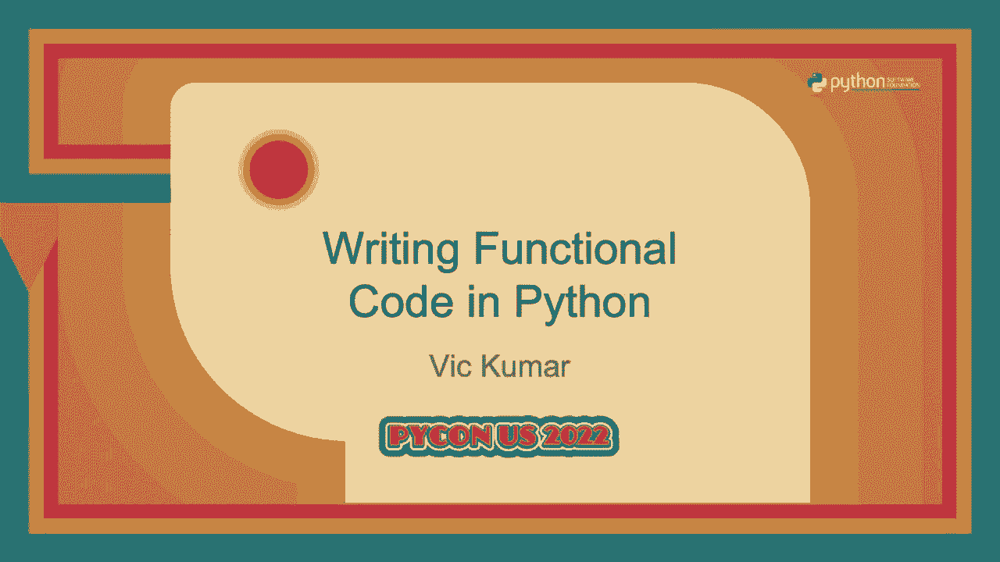
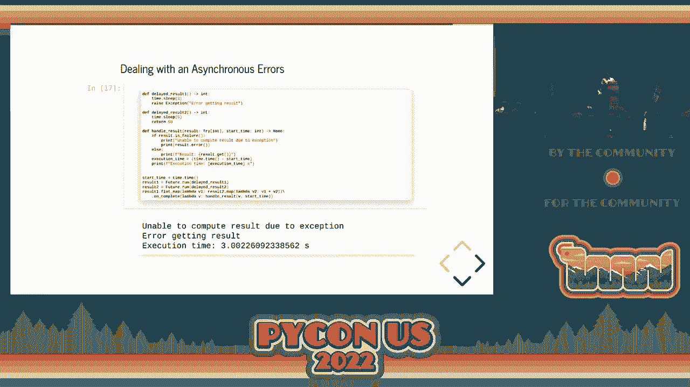
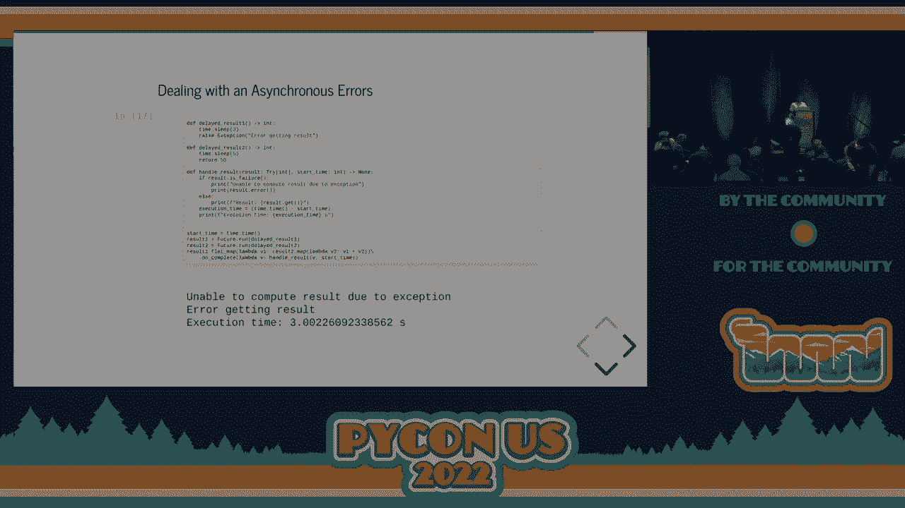

# P80：Talk - Vic Kumar_ Writing Functional Code in Python - VikingDen7 - BV1f8411Y7cP

 Welcome everybody。

 Hopefully everyone can hear me。 Welcome to the afternoon session of PyCon 2022 in Salt Lake City。 Before I begin this entire presentation， it's on my GitHub。 If you're running a Jupyter notebook。 you can run a Jupyter notebook。 The PDF slides are up there。 My GitHub is Vic Kumar， 1981。 All right。 So a little bit about me。 I work for Excela。

 We are a technology consulting firm based out of Arlington， Virginia。 We do three things that people sort of give us money for， modern software delivery。 AI and analytics， as well as agile transformation。 The website， excela。com is up there。 We have openings right now for data engineers and data scientists。

 So feel free to go to the website or reach out to me afterwards。 Right。 And some projects that I'm currently involved in go to code。io。 It's sort of like a leak code meets remote interview。 Again。 we have Jupyter notebook integration in several languages。

 So if you ever want to play around with like Rust in a Jupyter kernel， go ahead and check。 out that site。 If you use the registration code， PyCon 2022 or lowercase。 you can get a free extended subscription。 Yeah。 And I'm also working on HBCU Digital。 which is an ESPN sort of app for historically black， colleges and universities。

 We're trying to add a lot of live content there。 We have on Roku， Apple TV， as well as mobile apps。 All right。 Enough jibber-jabber about me。 Let's talk a little bit about functional programming。 So in the last five， six years， I'm sure all of us have sort of heard of， played around， with。 experimented with some of these。 Let's call them like the new kids on the block。

 These newer languages， we have React。js out there in JavaScript。 There's F# for all the 。NET folks。 There is obviously Scala and Kotlin are still going strong in the JVM。 And for iOS development。 we now have Swift。 So you don't have to write Objective C。 And as well as there are more traditional functional。

 programming languages still out there like Haskell or OCaml。 So the idea behind functional programming is a pretty straightforward idea， but one that。 has far-reaching consequences， which is why I think I like it。 So the idea behind functional programming is that we are going to impose a restraint or。

 we're going to try to sort of constrain our code， put a restriction whereby we write our。 code only using pure functions。 So what exactly is a pure function？

 A pure function is one that does not have side effects。 So the next logical question， well then。 what is a side effect？ So side effect， it turns out， is anything that isn't a pure computation。 If you mutate the state of a variable， if you modify a data structure in place， if you。 throw an exception within your code， if you deal with any sort of IO， the console， networking。

 these are side effects。 Another way of looking at or thinking about this is that a function has inputs and it has。 outputs。 In this sort of ubiquitous， not just a Python， but just programming in general。 function has， inputs and it has outputs。 If we do anything inside that function that doesn't explicitly deal with the inputs or。 outputs of that function， then that is by definition a side effect。

 It's not explicit in the signature of the function that it's doing this thing。 So that's kind of the idea behind the side effecting。 Right。 Okay。 A pure function has the property of referential transparency。 So when we talk about side effects and what are pure functions， it's sort of like something。

 we can prove。 It's like mathematical。 We can go through and I couldn't pace the definition there of what referential transparency actually。 is。 But there is an easier sort of way to think about this。 So yeah。 let's get to some coding examples so that we can actually understand this a little， bit better。 So I have a function here。 It just adds a list of numbers。

 So we're going to start by creating a variable sum。 We're going to assign it to zero。 We'll go through every item in our list and we will add the numbers and we can see that。 it gets the sort of the right output when we add those numbers。 But if I think back to algebra class or math class and I know that's why everyone is here。

 because they wanted to go back to algebra class。 When I say something like x equals one。 y equals two， what is x plus y？ I would tell you that it's three because in my head I took x and I replaced it with the。 value one and I took y and replaced with the value two and one plus two equals three。 So on this first block of code I said sum is equal to zero and when you tell me that sum。

 equals zero then mathematically if I use sum on the right hand side of any expression。 it should yield the same result。 So let's take a look at how that works then。 So instead of sum equals sum plus n I replaced it with sum equals zero plus n because you。 told me that sum is equal to zero。 And as you can see it doesn't give the same answer。

 It actually gives an incorrect answer because it gets to the， it iterates to the list。 It gets to the last item in that list and it says okay sum equals eight plus zero so。 it's equal to eight。 But that's not the same value we got before。 And even though this code block is sort of like very innocuous， very， very simple we can。

 see that perhaps there's some things that we don't like about it。 I could easily imagine that the list that we're trying to add up might become very， very large。 and so now we might think okay let's try to apply some concurrency to it。 Let's add some threads and run the same block of code using threads。

 And obviously we could maybe partition the list so that you know the threads are operating。 on different parts of the list。 But if we get to that line sum equals sum plus n and we do this mutation we can't have。 two threads mutating the variable sum at the same time。 You'd have to do something like a lock。 a metaphor， a mutex， some sort of lock or maybe an atomic。

 operation but in any case we're going to have to deal with this in a concurrent sense if。 we ever want to make this multi-threaded。 So the problem really here is the mutable state of sum。 We want to sort of get rid of this mutable state because as we saw in the previous slide。 mutation is a form of side effect and we can see that this function isn't referentially transparent。

 And we substituted the value zero for what sum was。 It didn't return the same thing。 So all right let's try to then rid ourselves of the mutable state sum。 And there's some pretty straightforward ways that we can do that。 The first of which is just let's use recursion。 So if the list is one item just return that otherwise return the first item plus the sum。

 of the rest of the list。 And we can see that that gives us the same value and does not have the consequence of。 a mutable state within the function。 Okay。 The second way that we could deal with the same problem is by using what we call a higher。 order function。 A higher order function is a function that takes in a function as a parameter or returns。 a function as its output。 And so here we're going to import this cool function called reduce from inner tools。

 And inner tools is first parameter is obviously it's a lambda。 It takes two things from the list and returns one item and then sort of recursively applies。 it to the list。 And so this concept is going to come back up in a few slides。 In functional programming we like using higher order functions to abstract around things like。

 having to mutate state。 So we see two ways here that we can get rid of that mutable state。 The two examples here add numbers two and add numbers three are referentially transparent。 and these are pure functions versus the one up here we know that it's not。 We've sort of proven that this is not referentially transparent and therefore that function is。

 impure in a functional sense。 It doesn't obey the properties and laws that we like in math。 And that's sort of where this premise is going to go with functional programming。 All right。 so now that we've sort of accepted the idea that we want to use higher order， functions。 I sort of did a thing。 I don't know if it's a good thing or a bad thing。 But I added some classes。

 So this is a library that you can pip install， pip install pi effects。 And so it's like my first attempt at trying to introduce some of the classes that you might。 see in a language like Haskell and most certainly in Scala you will see these types。 And so the types we're going to discuss today are option， try either。

 Actually we're not going to cover either but we are going to do option， try and feature。 either is there in the library but we're not going to cover either today。 So yeah。 let's talk about abstracting away certain behaviors， some common behaviors。 And the way that we're going to sort of approach this is we're going to use classes。

 So the option class is a parent class or like some sort of interface and it has two child。 classes actual implementations。 One of which is called some and the other one is called empty。 So if there is a value we encapsulate it in the some class and otherwise it's empty。 And as always let's go ahead and create an example data model that we can sort of play， around with。

 So the idea here is that we're going to create some classes。 We're going to have a person。 a person is going to have a contact and the contact is， going to have a name。 And the name has the properties first name and last name。 So this is sort of like a nested sort of hierarchical class structure。

 And so let's say given a person I want to go ahead and find the first name of contact， number one。 So I use data classes and then I let's not worry about the get functions， the get last， name。 the get first name。 Those are just wrappers and we're going to use those so that we can see how the option。 class sort of works。 But first we're just going to sort of use the attributes directly。

 So our example is we're going to be given a person and we want to go ahead and try to。 find the first name of contact number one for that person。 So we create this like person object and you can see we're just going to use like if statements。 So all along the way anything could be empty。 That's really what we're dealing with。

 We have this nested hierarchy。 We want to get to this thing in our hierarchy。 But along the way we have to do these checks because things can be have no value。 It can be empty and that would cause a problem。 So we have to do the checks that if the person is there。 if the person's contact one is there， and if they have a name then return this value otherwise return none。

 Right？ And this can get more complicated。 The more nested and more hierarchical structure that we have to our classes。 the more complicated， branching and conditional logic that we're going to have to use to get from this class。 to that class。 Okay， so let's take a look at how this works with the option class。 So okay。 so this is where functional pure sort of what they like。 Okay。

 in the second example we don't really have any the branching logic is abstracted away。 for you with an operation called flat map。 And so flat map is a way that we chain or combine inputs and you're going to see the。 same techniques with the other other classes as well。 So it takes the output of one and puts it as the input to the next function。

 And what functional peers would really like about this sort of function is as you can。 see the second function below we get an input， we apply a series of functions and we're given。 an output to a functional person。 This is how every program should always work。 We get an input。 apply a series of functions and get an output。 And it does the same thing that the first function does。

 The other sort of observation that we can make between the two functions is that the。 first function even though it tells me that it's returning a string， it doesn't tell me。 anything in the function signature that this string could potentially be empty。 In the lower function I can see that it returns an option of string so the caller of this。

 method now knows that this value that is being returned could be empty and they are。 forced to deal with the case of emptiness。 And in the case of an option class you have something get or else。 So if there's no value you can supply a value there。 And right。 So all the functions there。 the get contact one， contact。get name， name。get first name。 If I go up a slide。

 those functions are just simple functions that return an option。 And that's really what flat map is doing for us。 It's just chaining the options together so that we can rewrite this logic in a way that。 reads left to right。 The second API is also what we call it's a fluent API。 It reads left to right just like how English reads。

 You don't necessarily read English like inside out with if statements and while loops you。 kind of read it just left to right。 So we get the benefit of chaining operations and sort of seeing a fluent API style。 Okay。 So that's sort of how we can deal with emptiness using the option class。 The second example is going to deal with now with exceptions because what we talked about。

 before is that an exception just like that example that we did with the sums and we mutated。 sum that function was impure。 So anytime I raise an exception within my code。 I'm also suffering from the same problem that， my code is not referential or transparent and the function is not pure。 So the same way that we dealt with option where option was a parent class and we had。

 two child classes to deal with the behaviors that we wanted。 We have a class called try。 And the try class is also a parent class。 The try class has two children classes。 the first of which is called success and the other， one is called failure。 So success encapsulates the successful value of something happening without an error and。

 failure encapsulates the exception that might be thrown in that event if like an accept。 So let's take an example here where something that could potentially fail。 It could go wrong。 And so we're going to look at an example of JSON parsing。 So we have two strings。 The first string is going to be parsable。 It's going to parse to our model。 It's correct。

 The second string I've deliberately made a mistake。 There's no attribute called first name is wrong。 So when I try to sort of parse my JSON and get it into my model， it is going to raise， an error。 It's going to raise an exception。 So let's take a look at how we might do this in a very straightforward way。 So we have like parse person。 We're going to do a JSON loads。 We'll load it into a dictionary。

 We'll check some attributes。 From that person， we'll parse the contact and from that contact。 we'll go ahead and parse， the name。 The parse name function there。 we can see except it raised the type error。 I couldn't deserialize the name。 So that function is not pure。 And similarly， like we saw with the option。

 when I just look at the signature of pars name， it takes the dictionary's input and it returns a name。 Nothing in the signature of that function tells me that this could potentially throw。 or raise an exception。 Perhaps it's there in the docs and stuff like that。 But I think we could make it more explicit。 And so the example there， it works。

 It gets the first name of contact one from our JSON string。 And if you go back， oh， sorry。 Alice is the correct first name there。 So it works。 But the function definitely raises an exception and perhaps is not as explicit as we would。 like to make it。 So we'll take an example。 Oh， yes。 I forgot about this。

 So this is what happens if we sort of parse the second string， which is invalid， we'll get。 the error that the first name。 There's no attribute called first name is wrong。 So we can see that we get this exception when we try to parse the name because the second。 JSON was not a good JSON for our model。 Right。 So let's try to rewrite this using the try class。

 So the parse name function here， we're going to use try。of， which will encapsulate like a。 callable object。 And if that callable succeeds， it'll return a success。 If the callable fails。 it'll return a failure。 And in the signature of the function， we can see that， okay。 it takes in the same dictionary， as the input。 But the return value is not just a name。

 It's a try of a name。 So someone who sees that code， who reads that code。 can see that this function could， fail。 It could succeed or it could fail。 And just like we saw with the option class， we're going to have to sort of deal with the。 case of failure。 Oh， sorry。 Okay。 And so we're going to go ahead and test that function。 Oh， yeah。

 Sorry。 I forgot one thing on this。 The way that we deal with failure in the try class is very similar to how we would deal。 with the failure in the option class。 In the option class， when it was empty。 we applied a method called get or else。 So when it was empty， we said get or else do this。 And we can do that with try also。 But in this case， we're going to use it or else supply。

 which is like get or else， but， it takes in a callable as its parameter。 So in this case。 we're going to call a function called handle parse error， which will create， the contact。 but it'll just warn us that we couldn't parse this。 So if we have like a lot of JSON that we're parsing， we want to be warned。

 We want to know that never happened。 We might want to keep continue， you know， continue parsing。 even though there was some， kind of mistake or error。 So yeah， these are tests。 So person one。 that's the good string there。 And you can see it does the exact same thing that we saw before without throwing an exception。 It gets the first name， Alice。 And then in the second one， it tells us， oh。

 there was an error parsing， you know， the， contact， contact one。 And it gives us the second person and it says that the contact name is known。 So that's sort of like the same thing that we saw with option。 We're trying to just be more explicit with how we deal and handle errors using the try， class。

 So we've extracted the behavior of emptiness。 We've abstracted around the behavior of try-except blocks。 And the third class that we're going to briefly touch upon is how we can use the same concepts。 to deal with concurrency， futures。 I'm sure futures are there in a lot of different languages we've seen。 promises。 Future works a little differently than option and try。

 And that there is no explicit parent class and child class。 What future does is future is going to start off and it's going to have no value。 The value is not completed。 It's none。 For some period of time。 future will eventually behave like the try。 Once the future completes。

 either there's a successful value from the future or there。 is a failure value from that same future which encapsulates your throwable， your exception。 that you're going to get back。 So let's go ahead and see how this works。 The simplest thing that we can do is sort of just run something asynchronously in a new。

 thread and that's done with featured outrun。 So we just have a real easy function here。 Sleeps for three seconds and it will go ahead and return the value 100。 So we're going to check some things。 The first thing we're going to do is we're going to sort of time the whole thing and。 we're going to， once we get the value， we're just going to do a little map statement and。

 add one to the resulting value。 We're going to check if the future is done immediately。 It's not going to be done because it just started and there's a three second wait and。 then we're going to wait four seconds。 We're going to check again if the future is done at which point it's true。 done equals， true。 We'll print out the result of that sort of value which is 101 and we got the overall。

 execution time which is roughly four seconds。 The time that sleep for in there is what's causing it to be about four seconds。 So yeah， pretty simple example。 We can easily run something in a new thread using future。 Okay。 But what about combining two things？ Looks like we saw a flat map to combine our options and our tries。 We can do the same sort of higher order function that we saw to combine features。

 So here we have two threads。 One is going to sleep for three seconds。 Return 100。 The other one is going to sleep for five seconds。 Return the value 50 and then what we want to do is sort of add up those two results。 right？ So you can see result one we call featured out run， result two we call a future， the second。 function and then we say result one we flat map it into result two and we add their two。

 values and we add a little callback。 So the callback here is doing the same thing that we did in the more imperative example where。 we're trying to calculate what is the total overall running time like you see。 So in this example one thread took three seconds and other thread took five seconds。 Both threads executed in parallel。 Once the longer thread was done it combined the results。

 We got the value 150。 It was roughly more or less five seconds of execution time。 So what happens then if something were to go wrong though？

 So in this example we'll deal with an error。 So the first function is actually going to just throw an exception which we know is impure。 but for this example we'll go ahead and do it anyway just to see what kind of happens。 And now on our callback we have the same code to flat map and map but on our callback。 because once the feature is complete it sort of behaves like a try。

 It has a success and a failure and we can check that。 So in my callback on this example now I simply we can simply check did the result fail or。 did it succeed and handle those two use cases separately。 So in this example again it ran both things in parallel the three second thread and the。

 five second thread the three second thread failed so it never actually had to you know。 the five second thread kept running but for the purpose of the computation it actually。 finished in three seconds because it got the error and it error out。 So we have this sort of callback style on the feature that we can use to check if the value。

 once it's complete succeeds or fails。 Okay but I'm going to go up a couple slides here。 So in this example where we are combining features using flat map and map comprehensions。 and stuff like that we could easily see okay so we have two threads running here two results。 values asynchronous computations that we care about the result but what if there was three。

 or four or five or more results this could get you know map flat map map flat map over。 and over and over again this can get a little complicated and the real thing is so when。 I do feature。run I'm getting a feature value back and I get another feature value back and。 another feature value back and eventually I'm left with a list a list of future values。

 and what I really want to do is I want to sort of invert that instead of having a list。 of future values I would like a single feature with a list of values that have the combined。 results of all my threats and in like a language like Scala that function is called future。trovert。 it inverts the two things so it'll take a list of futures and make it a future list a future。

 of a list right so let's go ahead and take a look at how that works right and so we have。 result one which is the same thing featured out run delay result one featured out to result。 to and here we call future。trovert and we supply the list of futures and then the same thing。 we just call the on complete handler to get the execution time and sort of like our final。

 result to print it out right so future。trovert we can see if we're dealing with like a lot。 of different sort of computational results we can quickly invert a list of futures into。 a future of a single list alright so some of the key takeaways here is that when we use。 side effects we can see that sometimes our code is not as explicit as we would like it。

 to be that makes the code a little bit harder to reason about if the functions are more referential。 transparent if they're pure then it allows us sort of reason about our functions in a。 more localized manner and it opens up us using higher order functions and abstractions to。 sort of deal with common behaviors that we might have in our code we saw the examples。

 dealing with emptiness dealing with concurrency and dealing with exceptions and all of these。 examples as you can see they sort of just like English they read left to right we're。 no longer sort of writing if statements and things that are nested and harder to read everything。 is just reading left to right we get an input value we apply some functions and we get a。

 return value and that is sort of how a functional program or thinks about the world how they。 think about programs and how they want every program to kind of behave and that's really。 all I had thank you guys so much that's my Twitter handle vikumar 1981 and that's my， get up page。 Thanks， WIC for that wonderful talk I would now like to I would like to open the floor。

 for discussion and invite questions from the audience。 Thank you。 Thank you。 Okay on time。 Any questions for WIC？ Okay。 Thank you。 [Music]， In the future example why was it a list of int versus a list of try event？

 Yes。 Okay so on the callback it's just a single try event so you have actually you might be。 right maybe I do I'm going to look at my slides that's a very good question you might be。 right because it's optional static typing maybe I did screw up the optional annotation。 on that let me actually check my slide real quick。

 The reason I asked is the previous example only without the traverse had the try in so I was。 wondering。 Okay this example right here right。 Yeah and versus the previous example that had just result as a try and。 Oh right right right so handle result takes in a list of the here the handle result takes。 in a list of in versus this example where it's a try of a single int。 Yes。

 Okay no that could be that's error on the slide actually you are right it should be a try of。 list event on that because you can check success and failure it is the try of list event I。 should have probably corrected that。 And then what would there be a list of try and versus a try list and。 Okay so what is the difference or。 Yeah so a list of try event is sort of a little harder to because each individual try now you。

 have to check the success and failure but if you have a try of list event I can check the。 success and failure of the whole thing right did this all the succeed or did all of it fail。 so inverting it becomes like a little useful because now I can just check the whole thing。

 right does that make sense。 Yeah it makes sense thank you。 [BLANK_AUDIO]。
