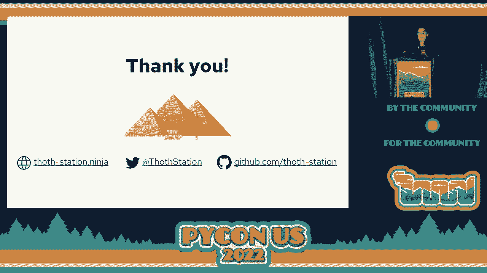

# P82：Talk. - Francesco Murdaca_Maya Costantini_ How to Make Your Python Jupyter Noteb - VikingDen7 - BV1f8411Y7cP

 The next talk is on how to make your Python， Jupyter Notebook stand alone and reproducible。

 to allow other users to replicate your experiments。 And the speaker is Maya Costantini。 Thank you。

 And as a reminder， the speaker won't be taking questions after the talk here。

 You can meet her in the hallway。 Thank you。 [APPLAUSE]， Hi。 Thank you。 Welcome to this talk。

 First to begin with， a few birds of help me。 My name is Maya。 I'm a software engineer at Red Hat。

 I'm passionate about Python and open source。 And I come from Paris and France。 If you want。

 you can find me on Twitter and GitHub。 And if you want to have those slides available to follow along。

 you can scan the secure code right here。 If I am here today。

 it's to talk to you about a great project I've been working on。

 at Red Hat for seven months called Tots。 And I want to explain to you how you can use it to make your Jupyter Notebook stand。

 alone， reproducible， easier to maintain， and to share with others。

 but also to radically improve the quality of your application software stack。

 by choosing the best possible dependencies for your Notebook。 Before we start。

 I'm curious to know who of you has ever used a Jupyter Notebook。 OK， a lot of people。

 And who uses this day-to-day for work， for example？ OK， great。

 For those of you who are not very familiar with Jupyter Notebooks。

 I can start with a quick introduction。 Jupyter Notebooks is an open source web-based application。

 that allows you to conduct iterative experiments， and to create documents with life codes。

 equations， images， graphs， et cetera。 And that supports a wide variety of languages over 40。

 They provide rich and interactive outputs， and allow you to leverage some big data and data exploration tools。

 such as the parks， for example。 As you may know， Jupyter Notebooks are， in fact。

 already quite popular， especially in the Python community。

 Data scientists use them for things such as visualization， data modeling， data analysis。

 and developing machine learning models。 They're also used by academics and by Python developers。

 for things such as rapid prototyping and proof of concepts。

 So what is the issue with Python Jupyter Notebooks？ What problems could we be trying to solve？

 To understand that， let me show you an example。 Let's say I'm a data scientist。

 and I want to create， for example， a computer vision application。 And to do so。

 I would like to install the OpenCV library in my notebook。 To install OpenCV。

 I will run the following command in my notebook， which is pip install OpenCV Python to get the OpenCV Python package。

 OK。 But what exactly is OpenCV Python？ OpenCV Python is a direct dependency of my application。

 And with this direct dependency come all the dependencies， like， for example， NumPy。

 the dependency of my dependency， which makes it a trendative dependency。 So far。

 I have run pip install OpenCV Python。 I got OpenCV Python and NumPy。 But did I forget something？

 What about versions？ Maybe I would like to install some specific versions of my dependencies。 Well。

 last time I checked， OpenCV Python had over 60 releases， and NumPy is something like 80。

 And if you take a look here at the release history for a package like NumPy。

 if you look at the dates， you will see that releases happen approximately， every month。

 which is very frequent。 So this means one thing。 It means that if today I start developing my notebook by running pip install。

 for example， NumPy， I just start to install NumPy in my notebook。

 And that I run this notebook once again in one month without specifying， any version either。

 I will probably not have the same version of NumPy installed in my notebook。 So this is an issue。

 of course。 And also， what about hashes？ Hashes are a way to guarantee the provenance of a package。

 And to make sure that an artifact that you use in your application。

 has to be installed from a trusted source of your choice， like， for example， in index。

 Specifying hashes to identify the provenance of your dependencies。

 is essentially if you want to share your notebook application， in a more secure and reliable manner。

 and allow users to install packages from the same sources as you did。 But also。

 what about the Python interpreter version？ Every Python interpreter version is different。

 And your notebook will not necessarily be compatible with all Python versions。 So this is an issue。

 for example， if you're not， developing your notebook using Python 3。8s。

 and you shared with someone who uses Python 3。10， maybe this person will not be able to run it properly。

 So we have issues with versions， with hashes， with Python interpreter versions。

 But can we think of something more？ In fact， a Python application is composed of many layers。

 And each one of these layers has a power to potentially break your code。 On the top layer。

 you have your Python application codes。 And this is really the only layer you really have some control on。

 For example， if your code is broken， you can still have a fix for it。

 and propagate this fix to other users。 And they will be able to run the code as well。

 But below this layer， as we saw earlier， you also have Python direct dependencies。

 transitive dependencies， the Python interpreter you use。

 But also other things such as native dependencies， like JLIP-C or CUDA， for example。

 You have also the operating system you use to develop your application。

 with different kernel modules。 And finally， on the bottom layer， you have the hardware。

 with different CPU and GPU architectures。 This is why using the simple PIP command to install your dependencies。

 will not help you achieve the goal of reproducibility， you would like to have for your notebook。

 So to summarize， if you do something like this， which is PIP install。

 your dependency without specifying， any version of hashes。

 it will not guarantee any reproducibility， for your notebook。

 And maybe you would think of doing something like that， which is specifying a list of requirements。

 either manifest files such as requirements。txt。 But here again。

 you don't have any information about versions， of hashes used。

 So this will not work and not guarantee either any reproducibility， for your Jupyter notebook。

 My point is Jupyter notebooks are by default not standalone。

 You can share a Jupyter notebook with someone else。

 It considers that it will run on a different machine， with different dependency versions。

 and using a different Python version。 In fact， dependency management in Jupyter notebooks。

 but constraints are the other of the notebooks， to provide a decoupled manifest file。

 like a requirement， that texts or a PIP file that luck， along with a notebook。

 so that the notebook users can install the exact same software。

 stack that you use to develop the notebook。 Dependencies are also a problem when。

 you want to containerize your notebook。 If you run， for example。

 to ship your notebook into your container， and share it with someone else， you。

 have them to make sure that your Docker file or container file。

 would be able to adjust the dependencies accordingly。 And finally。

 the consumers that receive a shared notebook， also have to set up manual is correct environments。

 which， can be difficult if no manifest file， or in any information regarding the environments in which。

 the author or developed a notebook is provided with it。

 And this is often the case with shared Jupyter notebooks。

 To summarize what would be the difficulties， this creates for both others and consumers。

 they should both create an environment to run the notebook， in， ideally。

 a virtual one that would not， be polluted by any dependencies。

 They will have to install the dependencies， to create a kernel， and update it every time。

 they have a new dependency。 And in addition to that， the author， had to maintain a requirement file。

 to allow others to get the exact same dependencies， that the notebooks was developed with。

 What we are looking for is a solution， that would have authors keep their dependencies。

 and manifest files up to dates and thus achieve， a reproducibility of their notebook。

 So earlier I introduced you project。tots。 So now I will see how that can actually。

 help you manage dependencies in your notebook， and get an optimal set of dependencies for your application。

 First， the three words about tots。 So the main goal of tots is to help developers and data。

 scientists create and maintain healthy Python applications。

 This project was started in 2018 at Red's Head Office of CTO。

 and now it is maintained by a team of 10 engineers， and has had over 50 contributors。

 That is a cloud-based recommendation， engine for Python application， which。

 is able to solve dependencies through their optimal versions， using machine learning。 Of course。

 tot is an open source project。 So you can contribute， of course， if you want to。

 and involve yourself in the TAT community， and share your ideas with us。

 What tot does is that it provides an extension， to manage dependencies in Jupyter Notebooks。

 Jupyter Notebook extension。 So Jupyter Notebook， if you know。

 is an interactive and extensible web interface， to work with Jupyter Notebooks。

 That extension for Jupyter Notebook， is called Jupyter Note Requirements。

 And it allows you to manage your net dependencies。

 without even leaving it by storing all of the necessary。

 dependency information directly in the Notebook metadata。 You can provide an optimized environment。

 unique to each Notebook by solving dependencies， using the policy resolution and giant。

 So let's see what the user interface of Jupyter， Lab requirements looks like。

 So when you work with Jupyter Notebook， you have your Jupyter Notebook open。

 and typically it looks like this。 And if you have Jupyter Lab requirements enabled， on Jupyter Lab。

 you will see this button called， manage dependencies。 So if you click on this button。

 you will have this menu， where you will be able to add your dependencies with a button。

 In this not before example， we import tensorflow and numpy。 And I want to say that--。

 I want tensorflow， for example， in version 2。2。0， and numpy in a range of version from 1。0。

0 to the latest， version possible。 So I will put the state of packages and constraints in the UI。

 and save those dependencies。 Now I will have this menu， where I will be able to choose。

 a resolution and giant。 So you can use the dot resolution and giant。 Or you can use p-pen of also。

 which， is used as a backup to Tarte。 You can also choose if you have the dot resolution。

 and giant recommendation type。 And we'll see later exactly what it is。

 But now we'll say that we want our dependencies to be， resolved to the latest possible versions。

 And finally， you have this section， with information about your environment， which is automatically。

 filled by the extension。 But if you want to， you can also modify it by hand。 So here， for example。

 I developed my notebook using， 5。3。8 in a row， eight environments OS。

 So now that everything is specified， we are conducting dots back in for advice。

 which takes typically， a few seconds or minutes。 And dots back in is going to compute。

 this fully pinned-out software stack here， with the latest possible versions I was specified。

 And send it back to us in the form of a log file。 Now that we received the fully pinned-out software stack。

 we are installing these requirements， in virtual environments。

 And this is done with a tool called MicroPIPEV。 And this tool has been developed within Project TOTS。

 to install dependencies。 And it can sort of wrap around PIP。

 to convert requirements to text or PIPEV or poetry， like files， for example。

 into a PIP tools compatible outputs。 So now we have our requirements locked and saved。

 They are installed。 We also created a new kernel。 And we can simply click to start working on our notebook。

 Everything is installed and ready to use。 On the right side of your UI。

 you will normally see an option to have the notebook metadata， which is a JSON file。 And here。

 as I said earlier， you will be able to see， that your dependencies， I just specified them。

 So with the right versions， have been locked directly， in the notebook metadata。

 And if you scroll down， you normally， will see also your whole software stack。

 with our direct and transitive dependencies， and the corresponding hashes they have。

 So everything has been saved there。 It's directly in the notebook。

 You can also have access TOTS recommendation， using Horace Magic commands。

 So maybe if you knew a bit high-pight， then you're already familiar with Magic commands。 But if not。

 it's OK。 So these commands basically allow you to do the same， but directly in the notebook cells。

 to speed up the development of your notebook。 So this is an example of the commands。

 that helps you lock your dependencies and outputs。 But you can also perform the those actions。

 which are checking notebook metadata about dependencies， with Horace Check。

 But also converting pip commands to Horace commands， to allow more reproducibility。

 You can also discover dependencies already， existing in your notebook and create automatically a pip file。

 and do a lot of other actions such as adding， or removing requirements in your pip file also。

 If you take a look at the output for Horace Check， for example， for checking for dependencies。

 you will have the following table， with information about your projects， about the advisor ID。

 or the advisor ID you sent to TOTS。 But also， for example， here I let this warning。

 which tells you that you forgot to set a kernel。 So it will warn you that you have to run Horace。

 at kernel to set a kernel for your notebook， before performing this action。

 If you want to install and run JupyterLab requirements。

 you can get this extension from the Python package index。

 by API by running pip install JupyterLab requirements， on your machine。

 And if you want to use this extension， you can do so by running the JupyterLab command。

 to open a local JupyterLab instance。 And if you have JupyterLab requirements enabled。

 you will be able to run it as we so just now。 And now what about containerized notebooks？

 Does any of your work with containers？ OK， let's have a few people。

 So besides this extension for JupyterLab， we started this also possible to manage dependencies。

 in containerized Jupyter notebooks using source to image。 Source to image is also known as 2i。

 It's a tool for building reproducible images。 And it produces images which are already。

 to run by injecting an application source code， into a container image。

 which assembles it into a new image。 And that provides minimal Jupyter notebooks container， images。

 which can be built on OpenShift， which， just had a distribution of Kubernetes。

 to manage dependencies using touch recommendation。 But also。

 container images for other types of application， by extending the functionality of some base。

 to i Python images to use touch services。 Now that we have seen a few ways to manage dependencies。

 in JupyterLab notebooks and to get an appropriate software， stack using Tuts。

 you might be wondering， well， how does that work？ How is this recommendation computed exactly？

 So that's what we will see。 The core component behind Tuts recommendation， is called the resolver。

 And the philosophy behind the resolver， is to recommend the greatest and not the latest possible versions。

 for your dependencies。 When you install dependencies using P or P Pen， or similar resolver。

 the resolver process， uses a backtracking algorithm， which will systematically。

 solve your dependencies to the latest possible versions。 However。

 this is not the case with Tuts resolver， which uses reinforcement learning。

 solve dependencies in the cloud， therefore using， resources from a cluster and not from the user's local machine。

 Tuts resolver has five different recommendation types。

 which can adapt the dependency resolution process， to user specific needs。 Of course。

 the resolver can solve dependencies， to the latest possible versions。 But for example。

 it is also possible to configure the resolver， to get the most secure possible software stack。

 The security recommendation type is particularly useful。

 if you want to manage dependencies in applications。

 which are deployed in the projection environment， for example。

 because the associated set of dependencies， will contain only versions that are free of non-vunderebilities。

 But for users developing programs， where the focus might be on performance， for example。

 the resolver can be adjusted to performance recommendation。

 type to get dependency versions which will， maximize the performance of an application according。

 to a user's hardware and software environments。 An example of how we evaluate the performance of libraries。

 by performing benchmarks between different versions， by using those versions of libraries。

 in different kind of performance scripts。 For example， it can be metrics， multiplication。

 convolutional filters， or any kind， of heavily computational operations。

 And then we can compare the speed， for example， of execution for different versions of。

 I don't know， tensor flow if you're using for metrics， multiplication。

 The recommendation type for TOTS can also be set to stable。

 If you want to get the most stable versions of packages， or to testing if you want to run。

 software that can possibly be unstable。 This recommendation type testing is more suitable。

 for experimenting because all the recommendation type can。

 be more strict and not resolve any dependencies in this case。 That collects a set of requirements。

 and constraints about dependencies as well as， a recommendation type for the resolution。

 and also information about the user's environments。

 such as the operating system and Python version used。

 But also if the application uses a base container image， to run， has good at configured or what。

 type of hardware is present， and it sends back， this information to a component that we call the advisor。

 The advisor is responsible for computing， the optimal application software stack。

 It uses a knowledge database containing information， about dependencies and it dynamically。

 constructs a resolution pipeline which， is made of different type of customizable pipeline units。

 The pipeline units makes the resolution process， optimized for each application and its runtime environment。

 So the advisor sends back a fully pinned-out software stack。

 including the direct and the transitive dependencies， in the form of a log file。

 along with a justification， to inform the user on why some dependency versions were。

 had or removed from the resolution process， and to warn or inform about some package specificities。

 So what we observe in our knowledge graph。 This observation include， among other things。

 information about the application stack， such as build time and runtime environments。

 and also about dependencies and benchmark of packages， version performances。

 They also have information about application binary interface， CVEs for libraries。

 different kind of security and lysers， and also source code meta information。

 So now I want to talk to you about prescriptions， and how they can help you heal your Python applications。

 So what we call prescriptions are， in fact， an example of configurable pipeline units。

 that we use in touch resolution process。 They are simply declarative， yaml files。

 stating how the resolution process should look like。

 And they are a way to formalize developers' knowledge， about dependencies in two units。

 which are automatically， consumed by the resolver to compute， the software stack recommendations。

 So prescription are present on an open source， GitHub repository under the touch station organization。

 so that every developer with any knowledge about dependencies。

 can help improve touch resolution process。 So now let's see an example of how a developer can create。

 prescriptions from its knowledge。 So here I took this issue from the pillow repository。

 on GitHub or the pillow library。 And here we have this user who saw this issue， which。

 was that pillow 8。3 and numpy are incompatible。 So for example， you have this error。

 when you try to run an application with pillow 8。3， and numpy。

 Type error array takes one positional arguments， but two are given。 So we see that pillow 8。

3 and numpy have API compatibility。 So what this developer can do， for instance。

 is create this prescription， which is a yaml file。

 And if you want to know exactly how to create the prescriptions， it's quite easy to do。

 It's something we have in our documentation。 And so basically in this prescription or yaml file。

 you will find information about the packages that， don't go together， the versions。

 the index that come from also。 And you will have a warning， which。

 will be returned as a justification to the user。 For example， pillow inversion 8。

3 by 0 does not work with numpy。 And you also have the link to the justification， which。

 is the issue that was open on the pillow repository at the end。

 so that users can check how white dots exactly didn't， allow to solve pillow 8。

3 and numpy during the resolution， process。 Some of the prescriptions we have are automatically created。

 and refreshed on a weekly basis using Python packaged data， from different sources。

 such as the Python package index， GitHub open source repositories， but also。

 from publicly available data sets， such as security scorecards， data sets。

 which is created by the open source security， foundation。

 This prescription can contain data about package popularity。

 non-relabilities for some packaged versions， artifact size， for example。

 And all of this can be used during the resolution process。

 to assess the reliability of a given dependency。 So finally， let's see what the conclusion--。

 what are the conclusion we can draw from what we just saw。

 Managing dependencies in Jupyter Notebooks， has become significantly easier for others。

 because of requirements being locked and embedded directly。

 into the notebook metadata with no additional five needed。

 Jupyter Notebooks with embedded dependencies， can be built using Jupyter Notebook source to image。

 without any additional files either。 And finally， Notebooks can be shared as standalone。

 units with an environment ready in a few clicks。 Using TOT to manage dependencies in your Notebook。

 both guarantees that your Notebook will be shared， in a consistent， reliable manner。

 and that your application will benefit， for the best possible software stack。

 according to its purpose。 Finally， I would like to thank you。

 and also encourage you to contribute to Project TOTs。

 to help make Python-dependent civil solutions better。 If you have any questions。

 you can ask them to me。 I will be available right there。 And so thank you very much。 [APPLAUSE]。

 (applause)。