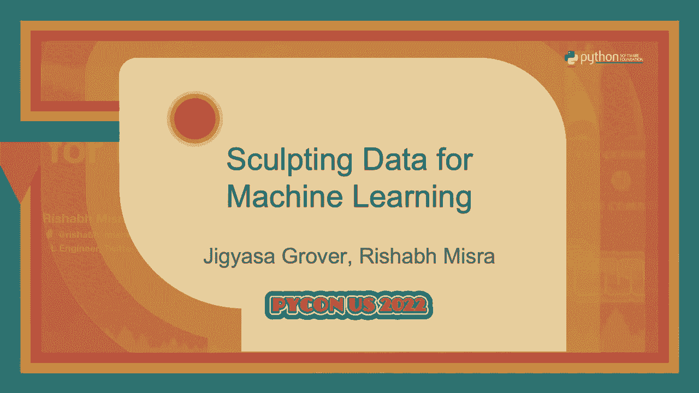

# P83：Talk_ Jigyasa Grover_Rishabh Misra_ Sculpting Data for Machine Learning V02 - VikingDen7 - BV1f8411Y7cP

 \>\> Hi， everyone。 We'll start off with our next talks。 We have Jigess， our grower， and。

 Richard Mishra， who will be consulting data for machine learning。 We do not have Q and。

 A's during or after the session， but if you would like to ask questions to the speakers。

 feel free to meet them in the hallway。 Yep， that's pretty much it。 Over to you guys。 \>\> Thank you。

 \>\> Hey， everyone。 I'm Jigess， our grower， and I work as a machine learning engineer in。

 the Performance Ads ranking team at Twitter。 And my co-presenter， Richard Mishra， he works。

 in the content quality team at Twitter。 Today， we'll be talking about how we can sculpt。

 the right kind of data for our machine learning models。 The last couple of years have seen。

 an immense growth of machine learning in multiple domains。 From influencing our shopping carts。

 to cars self-driving themselves around the town。 Unquestionably， machine learning is。

 the most used and the most abused and the most used sub-domain of artificial intelligence。

 presently。 It is being wielded in improving healthcare and advancing warfare， scrutinizing。

 your resume to determine your credit worthiness in creating music and meaningful lyrics， to。

 synthesizing pictures and videos of people non-existent on this planet。 Regardless of。

 our fascination or load for it， it is influencing our decision making power heavily and is dominating。

 our lives every millisecond。 So dominant leaps are leaving the scientists， investors， policy。

 makers， business leaders and audience bedazzled。 That human-like intelligence in machines might。

 be just around the corner。 Nonetheless， progress in machine learning has been very impressive。

 but there's a lot of pending explanation and examination which keeps this research going， on。

 So for the state-of-the-art machine learning algorithms to work their magic， it's important。

 to focus on three key dimensions。 Well calibrated data， sophisticated algorithms and efficient。

 computation。 Since we have progressed from the rule-based approach to a more data-driven， approach。

 it goes without saying that machine learning algorithms are trained to capture。

 implicit information from the data provided。 It is true that these approaches are very。

 data hungry and without going into a lot of details， for example deep learning algorithms。

 they have a lot of parameters that need to be tuned and therefore need a lot of data in。

 order to come up with a more generalizable model。 So in that sense， having a lot of data。

 is the key to coming up with good training sets for those approaches。 So look at this。

 pyramid which is the AILR key of needs。 It is drawn parallel to Maslow's hierarchy of。

 human needs by Monica Rogatti， who is a renowned data scientist and AI advisor。 She puts forward。

 that worthy data collection forms the foundation of this pyramid of the AILR key of needs。 Data。

 literacy， data collection and data flow。 These forms the basic needs which must be satisfied。

 in order for us to achieve self-actualization or nirvana which in our case would be the。

 attainment of artificial intelligence。 So nonetheless， the quantity of data we also。

 have to take care of about the type of data that we feed into the algorithms which has。

 a profound effect on the success of the algorithm。 As we say garbage in， garbage out。 So machine。

 learning models are essentially as good or as bad as the data that you have。 Peter Norvig。

 has put it in very clearly that more data beats clever algorithms but better data beats more， data。

 So in that case， we should talk about data， curation and first of all， let's talk about academia。

 Core machine learning and data science， research groups in academia are oriented more towards novelty and advancing the fields。

 Many are times weighing it much more than the money making logic or performance scaling。

 In this attempt to work on new problems， finding collaborators from pertinent domains and seeking。

 funding for research groups are not the only obstacles they face。 They also have to look。

 for relevant data sources in the absence of in-house data， contrary to corporate giants。

 like Facebook， Google who have access to tons of data。 So these established organizations。

 on the other hand seldom have obstacles in obtaining computation power， hiring folks。

 with expertise in corresponding domains or accessing relevant data。 The challenge， however。

 comes in scaling up the solutions to massive user base。 Any organization that would have。

 a lot of unstructured data available on its hand in the form of raw logs， however， developing。

 data processing pipeline for them remains a task。 And for creating such resilient pipelines。

 apart from relevant technology， we also require the skills to identify and curate meaningful。

 data sets， unbiased data sets from the sea of unstructured data that we have。 And that's。

 where we go for search of data sources。 And it should be one to take it。 So， yeah。

 so there can be like different approaches to building like a good quality data set。 And。

 like we'll be like giving you guys some overview on like how we can approach that。 Basically。

 some pointers regarding that。 But before we can do that， like let me introduce you to。

 three of our data sets that we have collected ourselves。 And these are available on Kaggle。

 so feel free to explore them。 So， the first data set is clothing fed data set。 So， this。

 data set was collected from our e-commerce website called mod cloth。 So， there people。

 kind of report their transactions that they have done。 And what all like they have liked。

 about the product and specifically whether the product was fitting to them or not。 So。

 the data which we have here is user ID， product ID， fit feedback， size purchased， ratings。

 and reviews of the product that has been purchased and some sort of like customer measurements。

 And second data set we have is sarcasm detection data set。 So， these we have collected from。

 two website。 So， the onion and half post。 So， past studies in sarcasm detection were mostly。

 done from like extracting data set from Twitter。 But they tend to be like noisy in terms of。

 like the labels they have and the language they contain。 So， people use like lots of， abbreviations。

 They are like spelling mistakes。 So， we collected this high quality data set。

 from two news websites。 So， the onion contains like if you know about it like sarcastic versions。

 of like the current events going on。 And the half post contains like real news reports。 So。

 we can treat them as like non-circastic。 So， we kind of combine them and made this。

 like one good data set。 And lastly like we also had like news category data set。 So， this。

 was extracted just from half post。 So， these contains like real news articles and we have。

 details like headline， preview text， tags， authors and date published。 So， essentially。

 if we have like news from different categories that could potentially help us in extracting。

 like exciting。 Sorry。 And just kind of banging out。 Exciting。 Yeah。 Exciting findings。 Sorry。 So。

 yeah， I'll be talking about those like later on like how that is kind of relevant， in our case。 So。

 let's talk about searching for the data sources to build good quality， data sets。 So。

 they are like basically two types of scenarios that we'll come across。 So。

 first would be that we have like a problem statement in mind that we want to solve using。

 machine learning。 So， for that case like we'll be using a guided search approach。 And second。

 case is when let's say we don't have any specific problem in mind， but we would like。

 to like contribute something like word file to the community。 So， in that way like we'll。

 be using like unguided search approach。 So， I'll be talking about like the guided search。

 approach first。 So， this is where like we have like specific problem in mind。 And so， the。

 main challenge for this type of data search approach is that when we know what problem。

 we have to solve， we have to kind of formally state it out and understand the problem thoroughly。

 so that we can identify what all data we actually need to collect。 So， that like we can address。

 the problem。 So， it could be daunting， but like we'll be sharing some pointers so that。

 it's like little bit easier。 So， first step for that would be defining the problem formally。 So。

 what I mean by that is let's say we are trying to solve this size recommendation problem。

 where we have like a customer and we have to recommend like a clothing product to them。 So。

 that the size for that is fits kind of perfectly to the user。 So， defining the problem。

 formally means like identifying all the aspects of it。 And what are like there are all the。

 variables involved。 So， for size recommendation problem like we can say that given a user。

 and a product with different catalog sizes， we have to recommend a product size that fits。

 the user's best。 So， this essentially kind of lays out all the variables that are kind。

 of involved in solving this kind of problem。 So， after we have done that like we have to。

 determine essential data signals that are involved in like solving this kind of problem。 So。

 in this case like as you can see in the formal definition。 So， we'd see that probably， user ID。

 product ID， size of the product purchased and the fit feedback from the user。

 are kind of essential things that would help us in like addressing this kind of problem。 So， yeah。

 So， basically these will then contain these will constitute all the essential signals。

 that we need to like address this problem。 And we could have like other types of data。

 as well like product category or price， but they could help in solving the problem in， a better way。

 but they are not like absolutely essential。 Then next is like data volume consideration。 So。

 whenever we are looking for the data source， we have to see that we are able to build like a sufficiently large data set。

 So， for example， if we go to some websites that don't have like enough reviews on the product or let's。

 say if you are looking at like news website， they don't have enough historical articles。

 that they have published。 So， those might not be like very good kind of data sources for。

 us to construct our data sets。 And the reason is like if we don't have like a good enough。

 data set where each let's say entity has sufficient amount of information available。

 our machine learning models might not be able to like learn good parameters from such like。

 underpowered data set。 So， yeah。 This was it for a guided search。 Some pointers that can。

 help if you have like some problem in mind。 So， like you can follow maybe these pointers。

 to see like how you can collect like a good quality data set。 So， now the next scenario。

 is like unguided search。 This is let's say for like creative souls who so this could be。

 like similar to let's say if you want to do research and you are looking for the problems， to solve。

 So， this could be like drawn parallel to that。 So， if you want are looking to make。

 like data set contributions and don't have like specific problem in mind like you can。

 try to follow this approach and see if like it provides any help。 And we will be referring。

 to the news category data set for this because that was like specifically collected without。

 having any problems in mind and then kind of backtracking to see how it can be like useful。 So。

 yeah。 So， the biggest challenge for unguided search is that it has like lots of uncertainty。 So。

 we don't know like what problem we are going to solve。 So， there's no like proper。

 structure in the way like we could approach our search operation。 Let's say when I say。

 search operations test like Google and on the web。 And so， although it makes things a little。

 difficult but the pointers that I will be just talking about will provide some structure， to that。

 So， first like we have to see whether the data that we are trying to collect whether。

 it can address some practical problem or not。 And whether it has the ability to lead us。

 to some fascinating insights or not。 So， yeah。 To take an example like for the news category。

 data set。 So， we can train a classifier on this data set and it can help us identify。

 some writing style of the news articles whether some writing style belongs to like a political。

 category or humorist tone or it's based on like fashion trends or something like that。

 And it can also help us to tag and track news articles and understand how basically the。

 writing styles kind of differ and so on。 Yeah。 So， then the next thing after we have determined。

 let's say that something is worth estimating。 We have to see that we have sufficient metadata。

 available around that。 So， having enough metadata will help your machine learning models to。

 draw associations between like different attributes and will help in ultimately like predicting。

 the target。 For example， let's say the news category。 So， another example would be like。

 let's say if you are trying to predict like a product price from just like user ID product， ID。 So。

 that might not go very well and we need like sufficient data around the product。

 let's say brand of it and the fabric of it for us to able to like give like a meaningful。

 predictions。 Now， data volume requirement applies here as well but this has like a relaxed。

 constraint because we are not looking to solve like any specific problem we have in mind。 So。

 we can always like adjust the problem definition according to what data we have。 So， for example。

 in new scattering data set like we had many instances where let's say there was some news。

 category which had less than 100 articles。 So， if you have some underpowered category。

 our machine learning model might not be able to learn well。 So， but that then stops from。

 making it let's say a high quality data set because our purpose was not specifically to。

 predict some category just that like we have like different categories and if those have。

 like sufficient data then only like we will be able to train good models on it and make。

 the model useful。 Sorry， yeah。 So， based on the data availability we can like always adjust。

 the problem statement and finally like this is just like it's like a critical point like。

 we should always because there is some uncertainty involved and we don't know what all is out。

 there。 So， if we have some ideas always try to check if something of that sort is already。

 not on the web。 So， we don't want to like duplicate the efforts and if something is already available。

 we just want to see let's say what are the shortcomings of those and try to kind of improve。

 on that。 Now， yeah。 So， that was some like pointers on like how to structure a search。

 operation and now after let's say we have collected the data like we have found out the。

 data sources extracted the data out of it that is just the beginning。 So， that at that。

 time we have like a raw data available to us but still we have to like kind of groom it。

 for it to be like very useful to our machine learning models。 So， we will be talking about。

 some of the techniques that can be used to kind of groom your data set。 So， first technique。

 is data trimming。 So， data trimming。 So， I will take an example from the clothing， with data set。

 So， there could be like some reviews。 So， it's not always the case that。

 all the essential signals are available in each transaction like the data could be very。

 noisy and if we don't have like a transaction with fit feedback available or size purchase。

 those are not really useful。 So， and then our job becomes to kind of let's say sanitize。

 our data set try to trim all the records which won't be ultimately helpful and predicting。

 what we want to predict basically let's say recommend whether a particular product fits。

 a customer or not。 So， we have to kind of remove those and one thing to keep in mind is。

 after we have done data trimming like we still have to ensure that the volume is kind of。

 good enough let's say we are not like drastically reducing the data volume。 So， yeah for the。

 next few set of data preparation techniques the guess we talking more about that。 So。

 we've already talked about how we can collect a data set and build a data set from。

 different sources and in an ideal scenario we would assume that we are using a single。

 web source to create that data set。 For example， for the clothing fit data set we use mod cloth。

 but there would be many circumstances where we would have to gather the different attributes。

 from different kind of sources to be it for more inclusive meaningful and available data， set。 So。

 coalescing these data from separate sets separate sources into one unified view。

 is what is called data integration。 For example， let's talk about vertical integration remember。

 the data set that we had for sarcasm detection there was data collected from the onion which。

 was non-circastic and then we had data collected from half posts which was non-circastic。 So。

 in that case the attributes collected from both these sources were exactly the same and。

 all we needed was to integrate them in a vertical sense because the attributes were the same。 So。

 we created a final data set with the label say one sarcastic and non-circastic by combining。

 the source data from these two sources。 So， this is called vertical because the attributes。

 that belong for example the headline the author and is it sarcastic or not sarcastic were kind。

 of same across both the sources。 The other could be horizontal integration which is when for。

 example for to create one single record of the data set you have to combine sources。 For example。

 let's just assume we are building a data set for different cities and their attributes。 So。

 we would assume like feels like state， country， area of population come from one。

 kind of source and the other like administrative， religion， language festivals come from the， other。

 So， in that case you would be identifying one city ID and integrating them horizontally。

 In such case this is how you would approach the data integration and it is very important。

 to try and make your data set as exhaustive as possible to have as many records and attributes。

 Further down the line when you do feature engineering in all this trim that but it's。

 always necessary to have like a good quality robust data set。 And for the other thing you。

 also need to do data transformation to make it more robust as I said because there is so。

 much content available on the web these days that it's impossible to check the correctness， of all。

 For example， in the reviews or the content posted by the publisher like the product， name。

 the product sizing they have to be moderated to some extent however people might use small， large。

 medium， as sizes or someone would use like 12， 13， 14。 So， it totally depends。

 Some people use different just two letters for identifying the state， someone writes completely。

 the state name or someone would just use like month， date， year or someone。 So， depending。

 for the date formats。 So， it's very important to sanitize the data to transform it so that。

 it's all in one form for it to be a robust data set。 And so to say the data transformations。

 primary focus is to scrub the data sets raw values to remove redundancies and correct。

 the language and the logical semantics that you have。 So， the some like some techniques。

 for transforming your data set could be handling special characters， handling grammar， spellings。

 error， encoding the sizes in numerical order， changing the format of date， etc。 So， these。

 are just a few cues on how you can scrub your data set。 So， as I mentioned that once you。

 have your big data set， you know， with all the records and with all the attributes， it's。

 necessary to proceed to feature engineering before you input this data set as is to a。

 machine learning model。 So， if you consider data to be the crude oil， features are the。

 fuel that we need。 So， feature engineering is nothing but applied machine learning。 It。

 is also one of the key techniques and the processes that does not get it the due limelight。

 in the machine learning workflow。 Much of the success of machine learning algorithms is。

 attributed to the success in engineering features from the data so that the learner can understand。

 This is where your intuition comes into play and you know， black art and creativity and。

 domain knowledge。 So， this is the step that should be considered much more important than。

 the model itself or hyper parameter tuning and whatever shenanigans people do and because。

 machine learning algorithm as you said is as powerful as the data you supply。 So， you。

 have to take care of what your intuition says domain knowledge trial and error。 So， that。

 is what feature engineering is all about and choosing the right features in right format。

 can buy for boost the performance using even using simpler machine learning models。 So。

 it increases the transparency you can better explain the model if you have fewer features。

 but they are much more powerful。 It reduces the need for heavy ensemble learning techniques。

 and also further reduces the need for hyper parameter tuning and model optimization。 So。

 the bottom line for this entire talk would be that typical machine learning workflow looks。

 like this。 You go from defining a problem statement to developing an intuition of how。

 machine learning can tackle your problem， get the data， process the data and defining the。

 appropriate success metrics choosing the model that you feel would fit your problem the best。

 deploying the model and then monitor it。 The problem comes when you focus more on defining。

 the success metrics and choosing appropriate model and just get stuck in this loop。 However。

 the focus should be on how you source your data， how you create your data set and how。

 you do feature engineering because these form the part of applied machine learning and can。

 boost your machine learning algorithm by 100x。 And that is what our experience has taught， us。

 Even Andrew Angie who is a machine learning expert has started a campaign for data centric。

 AI and he says that machine learning model is nothing but code like AI is equals to code。

 plus data and for so many years we focused on code which is like how to create a more complex。

 architecture， how to include more layers by keeping the data stagnant but now is the time。

 that we have state of the art algorithms and the focus should be on data。 How can we enrich。

 our data？ How can we make more creative features and how we can have more signals into our data。

 to basically boost the performance of a machine learning algorithm。 So that being on the same。

 lines with a co-author book called cutting data for machine learning and this is a QR code。

 if anyone wants to check it out on Amazon it's also available on Kindle and it talks about how。

 to identify signals from web sources to creating your own data set using Python， Selenium and all。

 the other open source tools。 And it also does synopsis of data pre-processing and feature engineering。

 introducing you to machine learning algorithms from a data perspective and we are glad that is。

 endorsed by leading ML experts in the industry and you can read forwards by Lawrence Morny。

 Julian Mcauley and Mankting Warren and that's it。 Thank you so much。 If you have any questions。

 please feel free to reach us out。 Thank you。

