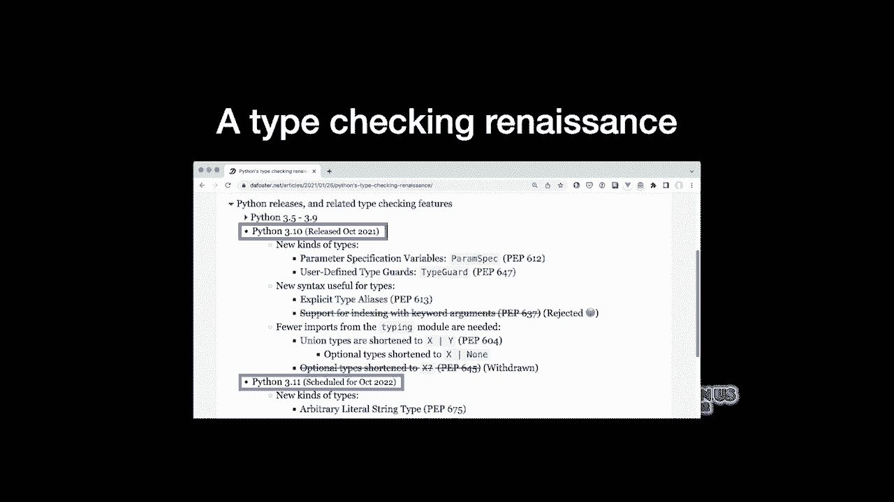
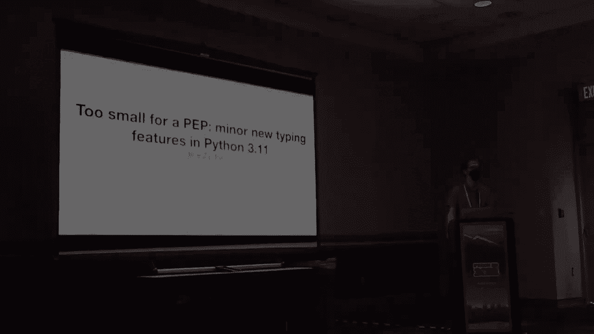
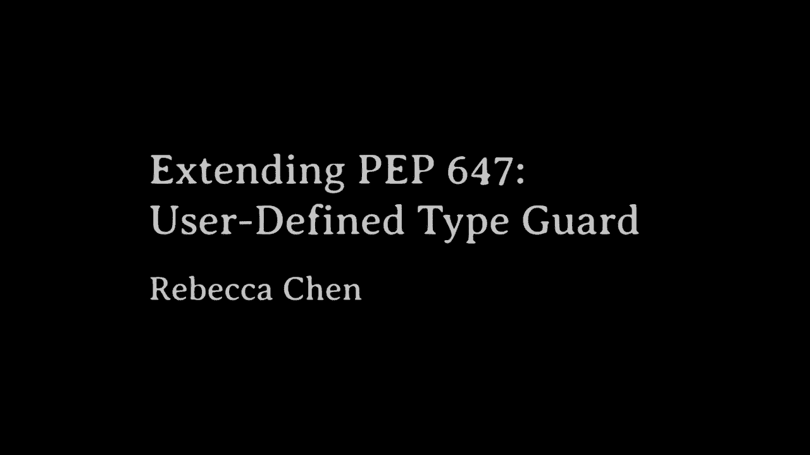
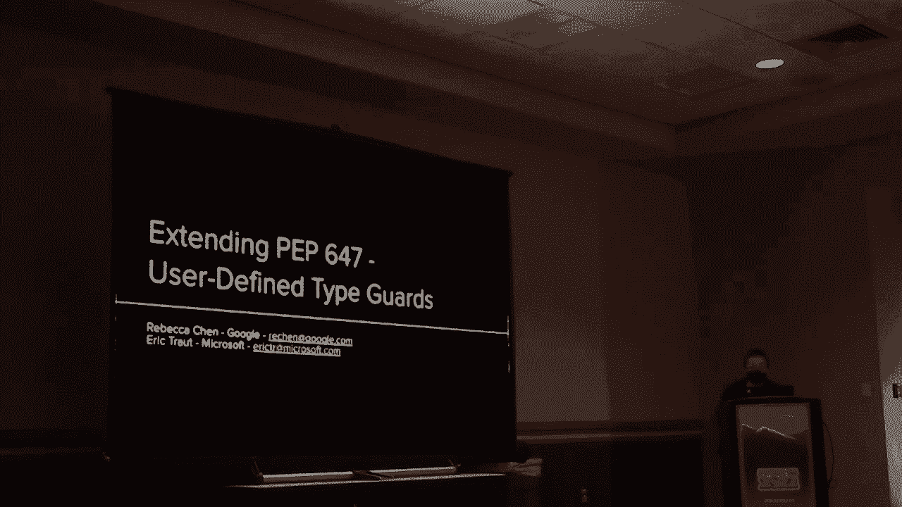
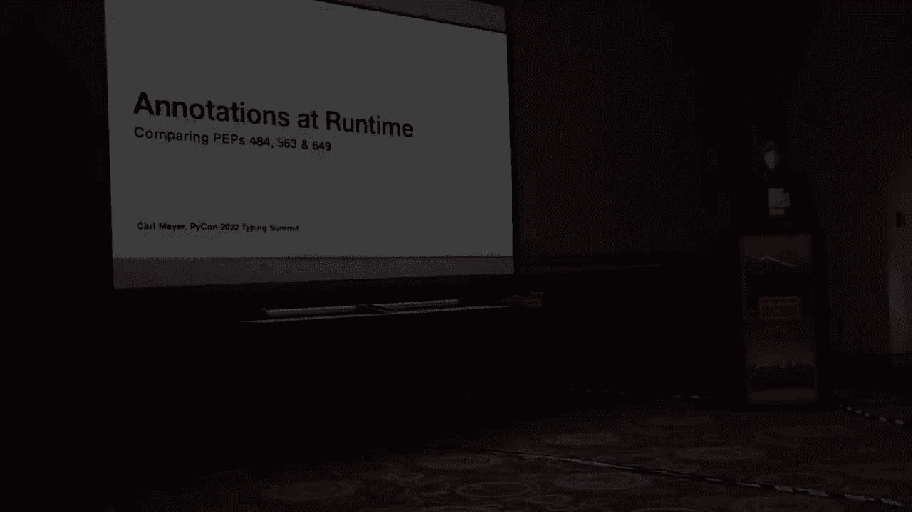
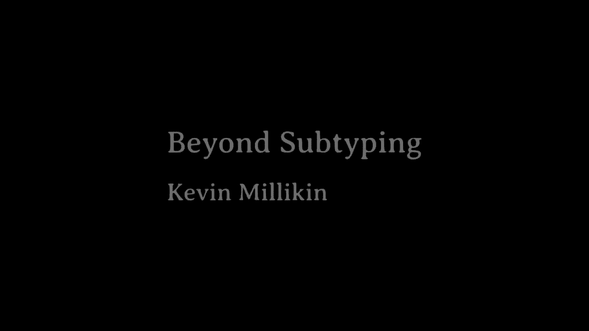
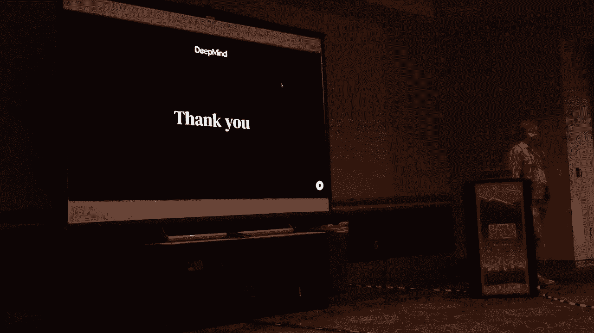
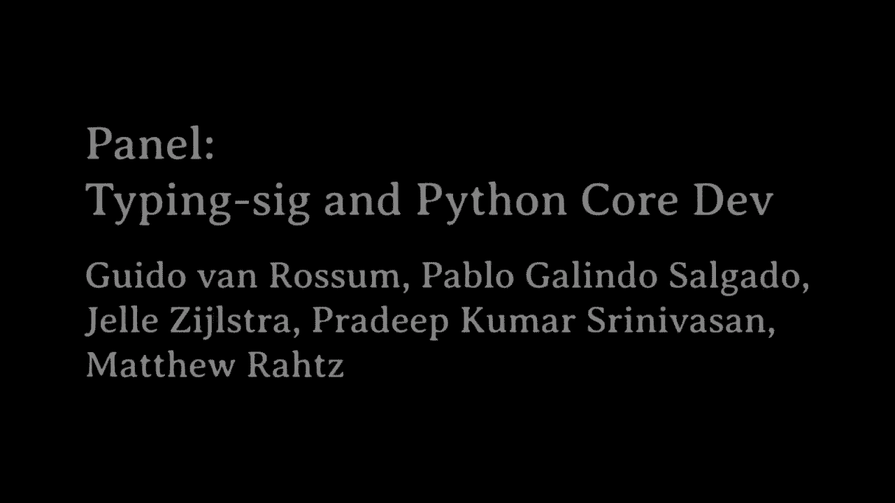

# P87：Typing Summit - at VikingDen7 - BV1f8411Y7cP

 Hi， I'm David Foster and yeah， welcome to the Typing Summit。

 So I thought it might be useful to present a roundup of some new typing features that。

 are in the current version of Python that we have right now， Python 3。10， and the new。

 version of Python that's coming up later this year， Python 3。11。

 So I'm just going to go through them somewhat quickly。 First。

 I guess I should introduce myself a little bit further。 Okay， David Foster。

 contributor to MyPy and especially typed dict。 When I'm not doing open source。

 I am chief technology officer at TechSmart where we are。

 bringing world-class computer science education to the next generation of K-12 students and。

 teachers。 So getting kids excited about coding and you can find me online at these places。

 So a couple of years ago， just last year actually， just in early 2021， I wrote an article that。

 is proclaiming that Python was in the middle of a type-checking renaissance because we've。

 had so many peps recently that are introducing new typing related features。 And this year， 2022。

 no exception to that。 So as mentioned， I am hoping to in this talk to go through some of the specific features。

 that are in both the current version of Python and the new version of Python 3。11 that will。

 be released later this year。

 So let's talk about where we are right now with Python 3。10。

 We've got four typing related peps here。 A couple that are introducing new kinds of types。 So peram。

 spec， and type guard。 There's other types of notation that's been added。

 And one theme that I think is recurring is eliminating imports required from the typing。

 module itself， which makes typing annotations more easy to use。

 So just to go through some of these briefly， I'll show an example of code before the introduction。

 of the feature and what you can do after the feature。 In 3。10。

 the first thing I have up is peram spec， which is particularly useful for annotating， decorators。

 So you can use that as a placeholder for any set of parameters。

 And so then it becomes possible to have this decorator nicely typed， which has been a problem。

 for some time。 So you can do that now。 Moving on， type guard。

 So this is particularly common in JavaScript， but also happens in Python where you have。

 a function that is used to check whether something is of a particular property that a type checker。

 can't figure out。 So in this case， you have an example of a function that checks whether something is a list of。

 strings。 So we have a function that just returns a bool here， which is okay， but it would be nice。

 that if you called this function and it returned true， that a type checker could narrow the。

 type of the thing that you passed to this function to be a stir of list。 And with type guard。

 you can do that。 If you set the return type to type guard list of stir， you return true。

 narrowing happens。 Beautiful。 Moving on， type alias。 So in Python。

 we've had the ability to define type aliases for a long time implicitly by。

 assigning a effectively a type expression to a variable。

 And then that is interpreted by type checkers as a type alias。 However。

 there are cases where you want to be explicit that that's actually what you're， doing。

 And at the moment， if you do something very similar， which is you assign a string of five。

 type expression to a variable， a type checker will not be able to figure out that you actually。

 wanted to make a type alias there。 So now with type alias。

 you can make the otherwise implicit aliases explicit and you。

 can now use forward references for stringified references， which is useful。 So that's kind of cool。

 Next up， one of my favorites is the ability to write union types and optional types， which。

 is a variable or the constant none using the pipe operator。

 So this eliminates a few typing imports from the typing module。 So no more important typing module。

 And you don't have to type as much either because instead of writing union， you can use。

 a pipe instead of writing optional。 You can just say pipe none works great is explicit。

 So that's Python 310。 That's what we have access to today in the final release。

 There is also Python 311， which is just about to enter its first beta， I believe， either。

 today or tomorrow。 And I heard a clarification next week。 Next week。 Okay， 310 beta one next week。

 So these types of types are now available。 So we have， let's see， one， two， three， four， five。

 peps here。 So I'll just briefly go through those as well。 So let's talk about literal string。

 So there are a number of APIs that expect some kind of fixed format string， command string。

 of some kind。 And in the documentation first， that API's。

 they may say that you really should just use， like a string literal。

 but there's no way for it to actually enforce that。 Because that's just in the documentation。

 So common cases， you have something that's running like a SQL command or as a second example。

 I'll show you in a moment。 If you're writing a format string to a logging function。

 So right now there's no way to tell a type checker that this string that you're passing。

 in should be a literal。 But with a literal string。

 you can actually annotate it that there should be specifically， a literal passed in。

 And if you don't do that， a type checker will tell you that that's no good。 So that's pretty cool。

 So you can avoid command injection for people who use APIs with literal string who also。

 are running type checkers on their code base。 And for many large code bases， this is already done。

 So as mentioned， there's a second example here of formatting strings， which is another。

 type of command string。 And in particular， we had an issue recently with log4j where you had some unexpected use。

 of things in command strings。 And that would be harder to exploit。

 If you had something like this used to type annotate a function expecting a format string。

 So that's literal string。 Type guard double。 So this is interesting。

 So there are a couple of libraries that define array like classes。

 So NumPy's nd array class tensor flows tensor class。

 In there are many cases where the data inside these has either a particular set of expected。

 data types or dimensions。 And right now， the only way that you can。

 right now you can only put that information， in comments and documentation。

 It's not enforceable automatically in any way。 So here I've just got a comment here that's saying like this is an image and it happens。

 to have a height and width as its dimensions here。 But with type bar tuple。

 you can define array types that you can just give generic properties。

 for each of either the dimensions or the data types or whatever property that you think。

 is useful to be enforced as consistent。 So here we're doing。

 you can actually just say height and width explicitly。 Because they're new types。

 it won't allow you to like mix them up。 Like instead of height width， maybe you put width height。

 easy to get it mixed up if you， have column based ordering versus row based ordering。

 So that's type bar tuple。 Self。 So there are a number of APIs that are written in a so called fluent style where you have。

 methods that on a class that return the same instance of that class after they finish。

 so they return itself at the end。 Before it was possible， although rather cumbersome and verbose。

 to annotate the return type of， such methods to describe to the type checker that it's actually still returning itself。

 You can do that with this fancy thing with a type bar。 Well now you can just do it directly。

 So if a function returns the value self， you can also say that in its signature that returns。

 the type of self and it will do all of that magic for you， which is great。 Data class transform。

 So this one's interesting。 So there are a number of libraries that define things like data class。

 model classes of various， kinds。 So you have adders as an old one。 Pidantic is a newer one。

 but there are many of these libraries that define classes that， act like the built in data class。

 And right now in order for a type checker to support these various libraries， there。

 has to be a special plugin that is written for each library and each type checker。

 So a lot of times these plugins simply don't get written。

 Well now there's a way for library authors who are making something like a pidantic model。

 or an adders based model to specify on those sort of meta models effectively。

 They can add this data class transform decorator， which tells type checkers that it acts like。

 a data class。 And so then you don't need the definer of the metal model。

 It doesn't need to start writing a series of plugins for all the type checkers。 So that's great。

 And last but not least， there is an extension to the existing type to dict type to dictionaries。

 data type。 Previously it was possible to define a type to dict， which is a dictionary with a set of。

 a particular expected keys that have expected values。 Very common in JSON。

 It was possible to define a type to dict where some of the keys are either required。

 and some of them where they are not required。 You had to do this weird hack where you had one type to dict inheriting from another type。

 to dict in order to mark some keys as required or not required。 Now you can just mark it directly。

 So very common is you have a lot of keys that are required and a few that are not required。 So much。

 much simpler to write。 So that is what I've got。 If you're looking for more information。

 for example， a list of typing related peps， I've， assembled an updated list in that blog post。

 Python's type checking renaissance。 If you search for that。

 you'll find that list of typing related peps and you can get， the pet links there as well。

 Thanks for listening folks。 So I've got like two， three minutes for questions。 Hit me。

 Will this be available in typing extensions or， you know， versions of a create instance？

 So the question was， are the features that you mentioned available in typing extensions。

 or will they be available in typing extensions？ In general。

 all new typing features are added to typing extensions first and they will work。

 in any version of Python。 So yes， you can use these today even if you're using a older version of Python in most cases。

 Because I love things like peps。 So for you sometimes have to lie and use computer annotations and that will break if you also。

 kind of use programming。 So peps。04， can you tell me what that maps to？ Type。 Sorry。 Next， pipe y。

 That will work at runtime。 You have to have fun teaching and fun annotations and if you try to use have runtime。

 you can， guess。 If you have runtime uses of that， that's a little bit more tricky。

 You can stringify the type of annotation in some cases but then you still can't use it。

 from the front。 With her right， front result of the people who work。 Her right。

 she can't use it at runtime in that case unless you're doing the library。

 It knows how to email them but actually I think it's going to work in the ability to work。 Yeah。

 that doesn't work in my case。 Oh， the overup words about I don't know what you're saying。

 I had a question on why we didn't support non-pipe X。 I mean X， pipe， no。

 Whether that's something that might be on the right。 Because I don't know。 No， no， no， no， no。

 I do not know if that works or not。 I learned something。 Okay， so yeah。

 the question was does we have X， pipe， none， but maybe not non-pipe X。

 Apparently from research here both work。 Got a question here。

 What are we going to get in three twelve？ Three twelve。 Three。

 so there are two things that I know about one which is tentatively called either type。

 form or annotation type。 That's something that I'm working on which will allow you to label the type of a type annotation。

 object which is very close to type of T。 The type of T doesn't accept certain things like unions and a few other things。

 That's something I'm planning on adding。 And there is a second one from that article which I do not remember offhand。

 You'll have to go look it up for me。 Optional is one of the most confusing words I had ever thought about。

 Optional X is not in basic classes for example， optional。 Could we take。

 could we replace it with a Y or a Y？ We can't in favor of five now。

 So the discussion that was made up was related to that the thought was that optional was basically。

 too big with us too deprecate。 So probably we're going to be with it for a long time at the very least。

 Rather than either reclassifying use of the word optional or going completely eliminating。

 That was more or less the consensus that seemed to be the case。 So yeah。

 for those of you who don't know me， I'm a sadest one。

 And today I will be talking about basically the word that has been going on around tense word typing in the past。

 What is going on now？ What is the next step today？

 What's going on there for those of you who are not going to take a sentence？ So first of all。

 like first I think it's a very analogous topic because it really works a lot of things and。

 getting anything that appears in numerical language。

 So on the one hand we have very clear aspects like creating a pencil or getting a pencil or doing some basic。

 multiplication or concatenation。 We have numerical language and language。

 And we can start the end of the day。 The layers are just performing multiple locations。

 We are talking about typing a sentence or typing a language and would be very fine in the input and how to。

 make it possible。 And then we also have a wide range of operations that are in our traffic experience and that is very open in。

 numerical categories。 For example， you have a pencil。 You have a pencil。

 You have a button in ten tours。 You have a green， perfect casting or some very popular operations like comics。

 comics， and we have a dashboard。 So unfortunately there is one person that has a little bit of a problem instead of going to solve this problem。

 with a combination of tours。 And we can put them into drawing categories， one for lyrics。

 another for lyrics。 And it's one of these two responses that we have to solve this problem。

 So here for lyrics， I love to solve something in the background。

 And it's the line in itself with a concept of cancer。

 like a class with a variable number of parameters， which is in the dynamic successes。

 And also I want to say that we are moving for like I mentioned。

 or for example in the magazine application。 And then there are many。

 just key in every time that there is some arithmetic operation in the dimensions， right？

 Or something like an animation and a special operation on a conversion。

 And then custom operators are needed for， also created， kind of the experts in another week。

 And that's very common。 For example， broadcasting。 For example。

 for casting is for whatever the place in numerical areas。

 And it kind of gives us a little bit more of a technical。 So as of now。

 I think something we really proud of is the huge milestone that I've been having with respect to last year。

 That is a sense of 36 or 6。 Now it's available from 5-month payload。

 I think what we have talked much about this from in the past years is one of the reasons why I'm able to keep working together in venture farming。

 So that this is already done， it's quite an achievement and I think they are very middle。

 Then on the definitely big side， I'm working with gravity on having a value or a portion。

 Although for the poor ones， to drive， you know that this is a value of an entire scene。

 By trying to think this from the value again。 And it's also nice to have it to show that this magnitude was implemented and to get insights about what are the implications of an implementation。

 And then customer break-tors is what I mean is so big that helping a lot of discussion about what all the operators are and important。

 Some of them that I mentioned were casting is very common of the product。

 This is already available in fire and there are no tricks that they will be coming to the table。

 So what I have is a few minutes to take a look at what we used to have on the camera。

 So basically before we put an express that we have a tensor pain and a lot of dimension。

 Instead to work with dimensions in terms of we need to have more。

 at least define a class with for every number of dimensions。

 Tensor one dimension to dimension to dimension to dimension and this applies also to methods。

 So you need to work those for any number of dimensions。

 There are two or three parameters going to allow this kid to work on another version that is crazy。

 Actually， my programmer probably was in the library that was trying to use this idea and at the end of the product。

 there were so many combinations that people understood。

 But now we have to have the one that we wanted to be able to express having a tensor and the one that we want to mention a lot of in any number of dimensions。

 And I think this is a very nice thing to have。 And it makes also very easy to work with dimensions later。

 For example， you see that now we don't need to be overly loving but as well as the numbers to express something that are not necessarily tensor specific。

 For example， when we find the enecro， we don't pass a dimension。

 So we have a variable number of numbers that will be converted into a set of dimensions where we can project and extract dimensions and put them into a tab。

 So having this makes big difference on what can be modeled and how much the words to do a lot of things。

 So once again， having this as the library news， then type arithmetic。

 Now that we have already added this kind of one of the most clear things that would have been the word to support many other news cases。

 especially when they want to hold machine learning。

 So type arithmetic basically appears anywhere where you need to do some arithmetic operations on the dimension。

 For example， if you want to come up and into tensor。

 you will need to get the addition of the tensor。 You want to get an instance of tensor。

 you will need to put the subscription。 You need to generate tensor with values in some range。

 You will work on the means of the fractional deviation or something like social plus allocation and going with requirement deviation。

 Perhaps the main exponent of what the library may be coming is a convolution。

 The convolution has a pre-intiming formula when you look at it。

 you will tend to think more carefully and realize that at the end it's a binary method。

 Basically the convolution is convoluted by definition， but it's pretty simple。

 There is a subtractional deviation on the dimension。

 So basically we are able to support every minute， we will be able to support tensor completely。

 as this no matter how we combine it， how many layers there are。

 we should be able to verify that what is happening here is correct。

 And this is a challenge for pre-minus programming because this formula is also complicated。

 so we can easily get those on them to have it verify that on bad timing。

 And then my extension by supporting this， we also support the important programming in the sense that we are also capable of giving to variables that they represent dimensions。

 We are able to represent their expressions because this way we can verify that the input that you are providing to an everyone in words corrects and you are not passing something like a word something like a word that's a good thing。

 So probably so pretty good work， but at the end the semantics of the operators are quite a separate problem。

 First of all we assume that we are going to be using the parameters for defining the values of the sets of dimensions。

 and then basically the mathematical parameters became really likely if they have a potential。

 Later as two， later on three， we have five and so on and so forth。

 So building in these cases that's so big material is far behind any other handling in and what this requires some more discussion。

 but this one that we have a little bit of， but that's simple summary。

 And then the other key part of what's important about it is equality。

 Because so far they have been commenting， that's surprising。

 because you have a system where you have to prescribe an address by part。

 but it's not enough because at the end you are going to be doing all the time expressions and sensors that they are going to get equivalent but with different expressions。

 And the problem is that you will get an error from the net secretary to create like for example。

 they do have a tensile size， a black bean， and so they don't size a deep plastic。

 so they are not the same when you are a Christian。

 but for us like these are usually the same way because I think it's comfortable。

 but throughout the net secretary this is popular and is surprised to have very wide range of expression that they will be hearing absolutely normal circumstances。

 So supporting them is a must for the main discrete or usual。

 but at the same time we want to make sure that this is not going to make the language way more complicated because now all the other languages that can do such a thing are depending on the type in languages。

 where basically the only way to provide that approach that there is an equality in the expression and that's definitely far from the division that we have for 5 months of language。

 So basically the idea is that we need to show that whatever we are is going to ask you over heads for the parameter。

 like the potential we have done at it， and the only kind of advantage that we have is that we have limited ourselves to have a few number of operators。

 right？ We don't want to separate ourselves to be any thing in the tensile price。

 we only want to press a number of operators， so we can't make sure that we can and that's basically the same thing in the proposal。

 That is to create a generic representation。 Basically the idea is that we have two expressions which are irrelevant。

 based on the internal distribution in the same way。

 and if we have to use them and quality comparisons are free。 So how does this work？ Well。

 for the guess of additional expression and notification we can think about this as polynomials。

 so the problem becomes just how can we compare polynomials and so they could。 For this。

 we go through a series of steps that are called expanding polynomials。 Monomials group in them。

 reason， zero， something like that。 And with this we go on and get it。

 we go on and get it with a bit of a simple， simple， simple。

 It's not that much that we know exactly how to do this， and they are leveraged。

 they are kind of automatically like take this property。

 but I think in this case it's quite clearly how can we achieve it。

 In the initial division it's a bit tricky because this is not just division。

 this is in the deviation on the floor division。 So this is not such a common mathematical function。

 based on the many rules that are popular。 But basically it's hand-rocks that are played for the idea of normal division and availability of division。

 Perhaps the most obvious is a hand divided by two class and divided by two-ish in order。

 We have an example， right？ One area by two， the one where the two-ish actually should。

 So all these things will make a big difference in mind to make sure that the rules of the tabular and mathematical。

 consistent with the runtime behavior of the California 5th and 5th。

 So that's a overview of the rules of equality。 Here is a comment about some experience that I have taught myself in implementing the tabular and mental empire。

 So I was typing some part of the last night， this is a random working with 5。

 I'm going to go to the main challenges， the main content， what makes it hard to dive in。

 The fact is that at some point I could type this part of the network where there is a long series of convolutional layers。

 And if you remember what the formula for convolution is quite sophisticated。

 so if you're just imagine doing this five times， one side of your folder。

 the formula gets pretty complicated。 But the interesting thing here is that if you look at the return value of the function。

 which is that the actual dimension of the dimension of the return value is really simple。

 And this is the figure of the equality and the material quality system。

 It's coupled with realizing that it's quite making a lot of sequences of these complicated transformations。

 A lot of things can get simplified and overall get simple， very simple。

 So I think that's a way of solving the problem and the plans of quality techniques coupled with。

 Finally， there's something I was custom operators。 Again。

 this is like a growth category to put together many different ideas that would contribute to venture planning。

 But clearly， one of the most part of all is broadcasting because so far we have claimed that we could support many operators in the support for parallatics。

 the variety， but the five is the emotional libraries。

 almost all operators have a variant for their broadcasting case。 Basically。

 the potential in that event， they will go to Scotland。 So。

 to fully support all these libraries that we're broadcasting， we need to be able to express it。

 The things that we're cutting up here seem all the key operators like at least on suppression。

 application， evaluation， comparison。 There are a lot of other places。

 They don't have a broadcasting， but being able to express this is very important。 Fortunately。

 we're broadcasting a very standardized or a semantics。

 The case should not be saving by a potential flow， so that's， I would think， nonetheless， again。

 we're having broadcasting the challenge of making sure that the people and different broadcasting expressions。

 we can verify that they're the same。 We don't realize that the broadcasting of the young people in the same area。

 we don't have any problem。 Or， so， we stay with this man。

 or we don't have multiple situations for doing so。

 And our operators that we have talked about in the past， for example。

 I mentioned many times the product。 You need to make the product of all the dimensions， for example。

 for example， you want to have a save or pay the value of the tensor。

 you want to have plenty of this。 It's true that we will overload the lines and modifications。

 nonetheless， like this is not a good example， especially when you have multiple parameters and you can install it in a too many combinations。

 And then a pattern that appears very open is when we are removing a dimension from a tensor。

 when we are replacing a dimension from a tensor。 These operators were mentioned by a private。

 not so long time ago， and I remember， you can send checks and there were like 40 or 50 or more different operators in factors that wouldn't mean these two extra dimension。

 So this is how common this pattern is， for example， in the pattern。

 so I mean that this pattern is very common on the use。

 You have a very interesting model in one dimension， so the tensor has one of the positions。 Or。

 for example， when you are doing a task force by definition。

 you are doing a motion to do the dimension， so you will be doing a task force。 So。

 how do you support for this？ Certainly， over the language。

 And that's basically a summary of all the key elements for a tensor typing， I think。

 against it's important to realize that the difference is forward， it has been 36 and 4。5。

 So maybe there were lots of things on that， and also to be excited about what was going to be achieved for the month。

 So， yes， that was a written from my side。 Thank you very much for your attention。

 And for the first Kelly Popper， to my discussion， I think in my one day we are going to be telling you。

 and I'm going to take a look at where we came from here。 So， yes， thank you very much。 [Applause]。

 [Indistinct chatter]， [Indistinct chatter]， [Indistinct chatter]， [Indistinct chatter]。

 So broadcasting means that you can add tensors that are not identically their dimensions。

 but are aligned along with cross certain dimensions。 For example， you have one tensor of dimensions。

 5， 1， and the other one of 1， 4。 So they're not identically， so you might think they can't add them。

 but clearly， you might be able to add them and get a tensor of 5， 4， because it's like 5。

 all the ones that are not basically， and sort of collapsing together。

 So that's still tied in from a shape point。 So we need that， because without that。

 we will be able to check。 So we need broadcasting to be able to support usual touch。

 a tensor of opportunity。 The key example is， if you take a matrix and add a steel。

 it will just magically work， even though the steel is not in the matrix。 [Indistinct chatter]。

 Any other questions？ [Indistinct chatter]， [Indistinct chatter]。

 So I went to a audience that I mentioned that we have right now， and I'm like。

 "What operators do we need for each one？"， [Indistinct chatter]， [Indistinct chatter]。

 [Indistinct chatter]， I didn't understand one part of the slides where I think we did the E of Zero Prove。

 to make this work。 But it sounds like you're lifting the whole like context where it's been into typing。

 and typically from what I know from like the post-plus， I know the type of content。

 [Indistinct chatter]， [Indistinct chatter]， So the thing is for addition and multiplication。

 you're able to sort of get a canonical representation。

 so that you don't need to prove that these two types are equal。 But for division。

 right now we sort of have a best effort and simplification。

 And if you divide because it's integer division， and as I mentioned， n by 2 plus n by 2。

 they're not equal to n by 2。 So in that case， we do have equivalent expressions that the fact you're going to do not move。

 So it's important。 So， so， so， so， yeah。 I would like to add that since the last year。

 like I would probably be surprised by the power of Zimpy， I think Zimpy， right？

 And they have some specific functions for doing pretty much the same， but in the conversation。

 Quite a method， but we can change variables to whatever Zim， safer。

 And we think that they do guarantee that your division acquires its equals。

 just so that it's going to be the best case。 So I think that's the recommendation for when on view this will be delivered and I like everything。

 [Indistinct chatter]， [Indistinct chatter]， Yeah， yeah， thank you。 [Applause]， [Indistinct chatter]。

 [Indistinct chatter]。

 Thank you。 [Laughter]， My next journey。 Yeah， David already told us about all of your paths and back up big we did that。

 There's actually a bunch more smaller features we're also getting and going to introduce those。

 But the other least， perhaps， not going to talk about them。 Instead of you have this revealed type。

 never assert never assert type get overdose， change to final and any use of this class。

 You're starting to be revealed type。 So we started talking about this。

 actually called revealed type was already implemented in that point for instance。

 It wasn't because it was a night type， you always had it so you're still going to use it。

 So the benefit to typing people in the left hand， a expenditure I think that what you're on time includes that you can run your test suite at the same time as you're defining your types。

 And if you're using it in education， you can run your examples which reveals that in them and they actually work around them。

 Now you've never， no return has been in the type system since pretty much the beginning。

 But it doesn't have to be only used for functions that never return。

 But every type checker they decide is we want to volunteer and you're going to use never for that。

 To make that clearer， people do not have your adding never as basically the equivalent of no return。

 So you can make the type checkers treat them as the same in their internal representations。

 That's in our message and we recommend to you how they never make your own people develop in the world you are。

 Good afternoon， we end in a server never function。 This isn't actually a text system feature。

 you would even understand it's in user code just as easily。

 But it's kind of hard to discover and a lot of people have to discover it in a memory。

 So we're having it to type things and make it easy or not going to find out that it can use it。

 So in this case， it's that you will do a server that some code is unmeachable and the text ever can prove that it's unmeachable。

 In this example， we know that you're only two bullions， so if not true or false。

 then it's obviously impossible。 And with this， a server never call。

 the text ever will tell you if there's a third bullion， you expect it to return very much。

 Then you'll update your code。 The next thing that is helpful for asserting that if you put type annotations in the text。

 it actually understands that the way you intended them。 In this simple case。

 it would end in the type of function annotations， so obviously the text will think that the text doesn't end。

 In this case， it's of course trivial。 In this case。

 we discussed in text sets where we want to test that the stuff we provide actually resulting in the types that we think they're resulting in。

 Because sometimes we do pretty complicated things with overloads and generic self-types and protocols and what else？

 We want to make sure that text actually understands what they're doing in a way that they intended it。

 And actually， as of yet， go ahead。 So， is it null？ It does nothing as rather than。

 I think you just made this picture of doing literally nothing。

 It's purely for checking that this static type is what you think it is。 It returns the value。 Oh。

 yes， yes。 You've got to return the value so that you can put it in the next question and keep using it。

 The specific things I think were the something that I had a link with some questions。

 It's an exact type check。 It's possible if you have to think more about details。

 One thing that I actually ran into recently was if you have two protocols that have the same methods。

 should that's a sort of type thing， the other thing。 And the way you can get the night height。

 it doesn't think that same thing， but any issue。 What is a reveal type of a current time？

 Is it printed out or do you sign any？ It prints the type of the value。

 Can't return to the value also。 Yes， it also returns to the value。 Yeah。

 that's one of the things we found out about the time it energizes， it's definitely， implemented。

 but all that really influences it， exactly to say。

 The returning value thing is what night height is。 Before people stand。

 you can just put a reveal type anywhere in the expression and it might。

 tell you what type is at that particular point。 So that's the temporary type of standard action。

 I think that's to change the information that I've got to do。 At the best of playing levels。

 I think that code is going to show me enormously confused new users。

 You see that and they assume that they're going to hard check it around time。 It's possible， yes。

 he wins over a lot of possible names for this function and also the。

 type of development was better than the serf type。

 The type of the clarity in the documentation wanted does。

 If you have suggestions for how to make it even more clear， we can still change the information。

 One final trick， go ahead and set it down like that。 The other one time is set， but it's not。

 That's true。 That's a good thing。 Yeah， it's possible。

 I guess I didn't want anything to do while I'm here。 That's a shock type。

 Check text can be something more likely than you're going to say。

 I think we've been talking about any of these and the couldn't come up with any of these。

 I guess the last thing I want to see is we are already using this intention right now。

 We have a lot of good evidence for our parents。 Last week I think。 And night time。

 we just released supports and we're going to have night time。 A serf type check is a type check。

 Also very soon， if the parent people want the parent to do the same thing， please consider that。

 I think one thing that's worth saying about the name is just， we use cases for this。 Most people。

 influencers and type checkers are a very complicated type library。 So it's not a kind of thing。

 It's likely to show up and go to the end of the scene。 Yeah。

 I guess the name is you see it in either the type of no connection。

 You see it and you don't know it's important。 That's your hand。

 and most people want to see it very much。 Yeah。 This is a feature of Python right now。

 Are you talking about something？ Yeah， so it's in typing a player。 It's in typing extensions。

 Obviously the right hand goes， I guess it just returns the value。

 The interesting implementation is in type checkers。

 And night time and time and support is a type type of game。 Support is on the list。 So the right。

 Yeah。 We need to put a type of extension。 A serf type。

 I think we need to just like daily if there's something in typing。 Okay。 Yeah。 Alright。

 That's a serf type。 Another type of work questions。

 Then the next thing we have is a support for run time use of typing。 The way F overload， you see。

 was implemented， it would just completely throw away the overloads after the actual function is defined。

 So in this example， before pick with the anthem， the overload is for a function for half。

 You've just never even got the guess because it's lost in one of the namespace。

 There's no more evidence to this。 This means that it's possible for step type checkers that look at their gun time types to ever time and over and over again。

 So we added something that's got visitors to overdose in basically the dictionary in the typing mode you had run time。

 So that you can then hold a get over those functions to retrieve the overdose again and see what they are。

 I just wanted to add this because in the type checker I work only， I need this to get overdose。

 Another use case is that in health outwards as what I've done with the mutation。

 we will now be able to show overdose because again they are completely successful around them。

 And so you can even find them。 How does that work at one time visits？

 Is the decorative fashion some secret names somewhere？ That's just a dictionary in typing that's。

 I think they may be doing this for module to function name to the list of overdose。

 The depth of this is that the social system memory usage because the distance you have and the echo of the bed for the little bit slower than the ground time because it has to do little bit more work。

 Similarly for final， also it was impossible for a ground time checker to support not self-testing final class because final district or classroom chase。

 there's no way to know that this class was decorated as final。

 So now we have this number of final attributes on the different class or methods。

 I think this now means that all type of graders are in respect for the ground time if you need them。

 So lastly here's a condition from Shenzil， but you're getting in a stop support of self-classing any for cases where you have something that you can face do anything with but also want some custom behavior。

 When most common example is more objects which you can use it past anywhere but they also have some methods that are just kind of unboxed。

 So there's a people who do nothing which will also be on the ground time。 Yeah。

 and so take this one， this includes that， there's still room for improvements。

 There's more things you can have at。 If there's new ideas that you think are useful。

 then consider them for Q412 or if we are really ambitious for Q413 or if we do that one for Q3。

 And actually， today you've spread that complex。 So if you have some idea of compactly and then you can get it in time and still。

 Yeah， so maybe you can then people develop it in better if there's more new ideas。 And last。

 as I mentioned， the bonus slide。 This is something that's starting to stretch out which is very active for developer。

 there's the R4 today。 Currently， every on time， it's impossible to make a generic name to book just because someone calls thanks to new implementation。

 Even though to be a basic， it seems pretty natural。 I think as an example， he has an A2 poll。

 while he'll do his hits， all he'll do is defend him with a generic。

 So I think it applies to allowing his keyword to learn him versus PR and make his support the ground time。

 My only hesitation is that maybe there's some reason in the static type system that this opens a giant hole and there's some reason not to do it。

 Please let me know and begin。 We must get out。 Would it work like you might buy items box？ No。

 My guys actually， the main reason I think it doesn't work。 Yeah。

 I think that my guys internal people support this doesn't go generic at all。

 So generic names of both are not trying to work unless not my changes significantly。

 I think that shouldn't stop us。 I think it seems like a natural way to extend the tax system。

 I don't support it， but you don't have to wait for them to do that。

 There's nothing he uses for long time things like a fight。 Maybe。

 maybe you use a new generic signature。 We have generic version of models。 Yeah。

 it's handy because I know I'm done， but I think people seem to use it。 I don't understand。

 But especially your classes are just classes and opening to both。

 So that's not going to work anymore。 It doesn't need to be a sentence。 So you know， like。

 with the generic or the many variables， like the full game， but you like X， Y， Y， and X， Y。

 I think so。 Yeah， I guess， if you're over this morning。

 I think we did the best of just adding this slide。 That's a good recommendation。

 But I think it should just be generic。 You can make a generic or type practical code read if you want to。

 One thing I was concerned about is the variance。 Should it be automatically coherent because two goes out。

 What happens if it is contra variant？ Yeah， I guess that's something for type。

 It's probably something that the random doesn't need to care about。

 I guess the pills can be both areas。 You can also have methods for a random type of difference。

 If you have a method argument that's generic， you could probably want to use the quantum variance on a variable。

 That's a good error。 Also， what types of text you have to protect it？

 I know the type of code can't be generic right now。 Yeah。

 it actually is better to do thinking for type things。

 I think that's something sitting near you a little bit about type things。

 I guess the quick thing about grand time， it doesn't work。 You have to ask support for that。

 And I think there's mostly work on sort of supporting you in the text system。

 That's any day that you have anything to ask。 Yeah。

 this is one of the four things that I'm looking at。 And I'm sure it's generic type of this。

 So you've instantiated that this has a D square root of the intercept。

 I guess that's not the type check。 Do we incur from the assets type check？ If you do NCE12。

 the type check would incur that。 I think it should just work like any generic class。

 I will say it's currently used to be some surprise that it didn't work。 Yeah。

 it just did something else because it wasn't essential。

 but it was surprising that you couldn't get it。 Yeah， I feel the same way。

 Like it feels like it should work， but it doesn't。 Yeah。 Yeah， it's also like。

 my title is called "Can I？ No more people's like not many people's。

 can I have people's answer both but my type？"， Yeah。 Yes， I think。 Yeah。

 I think there's just an artifact with the baby's picture that represents the night type。

 the path for generic and path for tuple just don't affect the market each other。

 Do you see that my five doesn't support generic tuples？ Yeah。 Yeah， so much better than that。 Yeah。

 so much better than that。 Okay。 Yeah， we're good。 We're the final one。 So。

 we have to talk about runtime usage。 Like， if you mark class as final。

 you try to get a carrot from it and then go out your code。 And then you can do it。

 I think it's maybe it should be a different decorator because final as an existing now already means like it's established that it doesn't get necessarily checked around。

 So， you're not the people depending on that thing that they're doing。 That's the group's ask。

 If it was to be group has a decorator in some of our depth actually makes it fast。

 not self-classical。 You could have it as non-， Yeah。

 I guess the interesting thing is that the group's even have that。 Personally。

 I don't feel like a very strong means， but that's the group I'm doing。 Yeah。

 it's also not for methods。 I just put a class on the example that's basically the very final work that I've done。

 Is it tries to step advantage of use in fields， in terms of error。

 any district there's whatever it comes to。 Okay。 I have a question about get overloads。

 If it sees a function that is a single dispatch function。

 we would be able to read that registry overloads， because I don't even get the ones that are。

 It's only over notes。 The action is， including this， I mean。

 it ties into generalize a single dispatch， but we decided it's too different。

 If that's just to keep it too different， I'm not。 I'm not。 I'm not。 I'm not。 I'm not。 I'm not。

 I'm not。 I'm not。 Okay。 The last thing I want to talk about is the intubl system。 Also。

 here I'm from Turkey that makes it possible to inherit anything and make a name to both。

 I actually like to not do that。 I feel like it would make it too far as to reason why it's not made to most not textures。

 It's going to make an inherit from arbitrary non-name to both classes because name to both are many different things。

 That would also be happen to hear more of anything to that。

 I have a question about the actual workloads。 You said it's like an acting of non-stroke functioning to both worlds。

 Yeah。 What happens if you have a workloads？ Not that I've ever used this。 I'm just curious。

 You mean the kind of overloads inside the function？ Yeah。 Yeah， they would get over again。

 So every time you do it， I guess it will pay new overloads and put them in the same place。 Actually。

 this was something we thought about a lot of。 I think this was a concern that you keep doing this。

 You just get a lot of them。 We're used to do it every time you do it， you get more overloads。

 So the result is actually that the line number of the overloads part of the key。

 So if you define a new overload， the same line number， it gets over again。

 This kind of has slightly unexpected effects。 It generates domestic functions。

 We didn't think it was a good outcome。 So I'm guessing that's your thing of looking for it。

 I was actually thinking of like the two functions that both define the same， but it's the same name。

 But if the line number is part of it， then I guess that's all of that。 Yeah。

 I guess if this came in the name of the same load， you know。

 I forgot what exactly makes the key speed。 That's a nice component。 I have a good idea。

 Is there more questions？ I can answer them。 If there's no more time。

 then we can move on to the next question。 Yeah。 Also， in reverse， I mean。

 if you're looking at it like there's been many times where I wanted。

 not necessarily a name to people， but just a immutable， no more other play structure essentially。

 Did it last quite a year？ Yeah。 But then you have， well， I mean， it's all data class。

 It's doing runtime stuff。 I don't know。 I know for many people， it's internal。

 and I don't care that it's any people。 Yeah。 I guess that's kind of a style question。

 I think we don't want to add too much more than any more things to the name to people because。

 data class is generally a better solution。 It doesn't make you better than you do it too。

 And that you iterate well， and it is usually not what you want。 Yeah。 So， you can't just do it。

 I think it's a good thing。 I think it's a good thing。 I think it's a good thing。

 I think it's a good thing。 I think it's a good thing。 I think it's a good thing。

 I think it's a good thing。 [ Silence ]。

 Hi everyone。 This is Bia Helen Mann。 My name is Rebecca。 I work at Google on the type type checker。

 Today I am not talking about type type ruins。 It talks about the classical extension to PEP 647。

 which is the user defined type guards。 These sides were made in collaboration with their child who was the author of PEP 647。

 He was not able to make it to Python， but he was a huge help in putting together this presentation。

 So， we start with a brief refresher on PEP 647。 We want some criticisms of the PEP。

 We look at extension proposals to cover these criticisms。

 and then we should have some time for discussion at the end。 So， first off， what is a type guard？

 It's an expression used to make conditional to narrow the type of another expression。 So。

 if we look at this example， VAL is not none。 It's a type guard that narrows the type of VAL。

 In the positive case， when the type guard returns true。

 VAL is narrowed to the non-non-type function。 And in the negative case。

 the type is narrowed to none。 So， what PEP 647 does is that it allows users to define their own type guards。

 So， this case is stir list。 It is a type guard。 In the positive case。

 it narrows the type of its input to list of stirs。 And in the negative case。

 it leads to type of changed。 So， for some background on this PEP。

 it was inspired by a type guard in a type script。 Eric， top of the type script team。

 a bit about what would they have done differently if they could go back in time。

 And based on those conversations， he made type guard and type guard as flexible as possible。

 There are no restrictions on the type guard type。 So。

 that's why examples and previous work are narrow list of the project to list of stirs。

 even though there's no sub-type evaluation to bear。 So， this。

 what's known as lead to some trade-offs， which is what I want to talk about next。

 to motivate this and start with an example。 So， number time is a popular and numerical computed library。

 It has this function called is scalar， which approximately speaking， what it does is。

 it takes no value。 That can be of any type。 And it will return true if the type is string or supports float。

 So， if you pass is scalar， the value that is either supports float or a non-high endearay。

 then with is scalar that is true， you know that supports float。 Otherwise。

 you know it's an endearay。 So， this is pretty honestly a type guard in the pool of goal sense。

 But if we annotate is scalar using pep 6。7 type guards， you'll see that a type checker。

 would actually infer the wrong types。 Do you remember we wanted a supports float in the positive case。

 an endearay in the negative， case， and we would get these both wrong。 So， why is that？ So。

 in the negative case， the problem is that type guard does not do any type narrowing。 So。

 we are able to get rid of that supports float。 And in the positive case。

 the problem is that the type guard type is actually the union。

 that contains this stir element that we should be able to tell is impossible based on the。

 input type。 But type guard does not do this， you know。

 like elimination of impossible union elements。 So， quick question。

 why does these type guards do these operations to refine the type？

 And the answer to that is that they're not always thick because a type guard can do checks。

 that aren't included in the type information。 So， if you have a type guard that checks whether something is a list of single character strings。

 when the type guard evaluates to false， the input can still be a list of stir。

 You can't actually eliminate that type。 And type guard， especially。

 there's no guarantee about the relationship between the type guard， and the input type。

 so it's even more unsafe to try to do these sorts of operations。 So。

 even though these operations are unsafe， we saw that there's an obvious use case for them。 So。

 the next thing I'm going to talk about is a few proposals made to extend type guard。

 to do these things。 And we'll cover the proposals basically in chronological order。

 We're going to show a couple of the earlier ones that we're determined to not really be sufficient。

 and hopefully that will show why the final proposal is what it is。

 Sort of the first and most obvious proposal was to add a two-argument form of type guard。

 In this case， the first argument was best by the type of narrative in the positive case。

 and the second argument， the type of narrative in the negative case。

 And one sort of nice thing about this proposal is that it would actually give a way to express type asserts。

 which are functions that raise an exception if the type isn't -- sorry。

 if its input isn't of a specified type。 You just put no return as the type in the negative case to show that it raises an exception。

 But as the appealing as this proposal looks， it has a couple of disadvantages that were considered to be deal-breakers。

 So， the first one is that it doesn't address that issue of not eliminating impossible union elements in the positive case。

 And that's just because that was a requirement that came up somewhat later in the discussion。

 And another problem is that for this to be useful， you really want to be able to say some type。

 but the type of the negative case is anything but the type of the positive case。

 And this proposal does not give a way to express that。 There's a last sort of minor thing。

 which is that it would also be a usual definition for type guard。

 different from other generic types， although that's not as big a video。

 So that brings us to the second proposal， which is just to modify the semantics of the existing type guard type。

 So， say if you pass in a union type to a type guard。

 and the type guard type is on the type in the union。

 then just go ahead and apply type-nanorite in the negative case。

 This seems like a pretty straightforward change。 Again， there are a few disadvantages。

 It doesn't address that issue of impossible union elements in the positive case。 And also。

 this would change existing behavior in an unsafe way。

 It could have music code that's already using type guard。

 make this change in something during the wrong thing。 And the last thing， sir。

 is that you start adding all these rules for what type-nanorine does， and it doesn't occur。

 starts to get pretty complicated。 So that brings us to the last proposal。

 which is to forget about modifying the existing type guard construct。 And instead。

 adding a construct called strict type guard， that does all these things that we wanted for a instigator。

 By type-nanoring in the negative case， eliminate impossible union elements in the positive case。

 In order to make these operations a little safer， strict type guard would also enforce that the type guard type is a subtype of the input type。

 So， this would be a complete solution， also pretty complex。

 And the strict type guard is already prototyped。 In Hyride today， you can try it out if you want。

 But what Eric told me is that he hasn't gotten much feedback on strict type guard， good or bad。

 So the question at this point is， is there much interest or appetite in this， like。

 it has to do with the type-4？ No。 And that's about all I have。 So。

 let me give you all a hug on this。 [applause]， Yes。

 Is there a threat specifically around strict type guard and either a typing-c or another location？

 Are there a step or I did not think to link them in this slide？

 I did not know that there was a question that there was a meeting to be considered as a no-thing。

 So， yes， I believe Simon's support is a problem。 So， last moment， I was in the institute。

 and I was very proud of him。 For the strict type guard to make your union。

 we got to make how it works with hence on。 Yeah， for example， in a strict type guard。

 if the input types in union can be used special narrowing。

 wouldn't that mean that's the way you think works with hence or whether the type-checker happens to incur a union in their case？

 Is there a type-checker in the first， some different type of union？

 It's somebody who is very different。 So， talking about this case here？ Yeah， so in this case。

 it's obvious that it follows the union because it's in a function representation。

 But in the general case， it might be some local variable。 And better or not。

 if it's a purpose of union， it can be how the type-checker does this type of union。 Yeah， that is。

 You can make a variable to sign it to different points， chase different types。 Yeah。

 so like if it's the times as either a valid or something else。

 you might be a particular type of a literal type， or the common type of a term。

 depending on what type of type of use to the type of equals。 So。

 just the mission is the type guard type includes the union。

 but only when the groups of union are stateless， so specific decisions in the type-checker on type of a inference。

 And so， I guess， if I find by the type guard type here。

 I mean that the type that's specified between the brackets after type， is after type bar。 So， yeah。

 whether that's a union or not to be pretty obvious， but it's definitely true that whether the。

 union type is a union， it can't be a type of a type of error。 Yeah。

 There are the union cases and eliminating some kind of possibility。

 Do you ever consider it over votes？ I know it would be overwhelming to be appropriate to follow the conversation。

 Or you can use having a global integer type guard in the type of option。

 That's probably going to be something that has been considered。 I think people， like， you know。

 you have the slide， but this is， you know， our case， if you have an overload on the hope。

 if a strain is passed in， then a like， a type of strain in it， but a load is passed。

 then a type of a short quote。 Or they are a sports book。 And I'm trying to make it， you know。

 you have to think about that somehow。 No， but， according to Tony's objects， we've only exactly like。

 like， this， right， a global state when you already move the type of strain。 So， you know。

 the next slide， like， with this one， people have like two different。

 imaginations of this era or in both。 And the first is when it's coming into support flow or individual。

 In case where you might have just opted to think the overall movement。

 I think we could be able to overload this scale， like， like a strain is passed in this era。 But。

 yeah， you can't think the right one。 So you wind up hitting the catch on the children's face。

 But that's what you're saying。 Yeah。 [ Inaudible ]， [ Inaudible ]， [ Inaudible ]， [ Inaudible ]。

 [ Inaudible ]， [ Inaudible ]， [ Inaudible ]， [ Inaudible ]， [ Inaudible ]， [ Inaudible ]。

 [ Inaudible ]， [ Inaudible ]， [ Inaudible ]， [ Inaudible ]， [ Inaudible ]， [ Inaudible ]。

 [ Inaudible ]， [ Inaudible ]， [ Inaudible ]， [ Inaudible ]， [ Inaudible ]， [ Inaudible ]。

 [ Inaudible ]， [ Inaudible ]， [ Inaudible ]， [ Inaudible ]， [ Inaudible ]， [ Inaudible ]。

 [ Inaudible ]， [ Inaudible ]， [ Inaudible ]， [ Inaudible ]， [ Inaudible ]， [ Inaudible ]。

 [ Inaudible ]， [ Inaudible ]， [ Inaudible ]， [ Inaudible ]， [ Inaudible ]， [ Inaudible ]。

 [ Inaudible ]， [ Inaudible ]， [ Inaudible ]， [ Inaudible ]， [ Inaudible ]， [ Inaudible ]。

 [ Inaudible ]， [ Inaudible ]， [ Inaudible ]， [ Inaudible ]， [ Inaudible ]， [ Inaudible ]。

 [ Inaudible ]， [ Inaudible ]， [ Inaudible ]， [ Inaudible ]， [ Inaudible ]， [ Inaudible ]。

 [ Inaudible ]， [ Inaudible ]， [ Inaudible ]， [ Inaudible ]， [ Inaudible ]， [ Inaudible ]。

 [ Inaudible ]， [ Inaudible ]， [ Inaudible ]， [ Inaudible ]， [ Inaudible ]， [ Inaudible ]。

 [ Inaudible ]， [ Inaudible ]， [ Inaudible ]， [ Inaudible ]， [ Inaudible ]， [ Inaudible ]。

 [ Inaudible ]， [ Inaudible ]， [ Inaudible ]， [ Inaudible ]， [ Inaudible ]， [ Inaudible ]。

 [ Inaudible ]， [ Inaudible ]， [ Inaudible ]， [ Inaudible ]， [ Inaudible ]， [ Inaudible ]。

 [ Inaudible ]， [ Inaudible ]， [ Inaudible ]， [ Inaudible ]， [ Inaudible ]， [ Inaudible ]。

 [ Inaudible ]， [ Inaudible ]， [ Inaudible ]， [ Inaudible ]， [ Inaudible ]， [ Inaudible ]。

 [ Inaudible ]， [ Inaudible ]， [ Inaudible ]， [ Inaudible ]， [ Inaudible ]， [ Inaudible ]。

 [ Inaudible ]， [ Inaudible ]， [ Inaudible ]， [ Inaudible ]， [ Inaudible ]， [ Inaudible ]。

 [ Inaudible ]， [ Inaudible ]， [ Inaudible ]， [ Inaudible ]， [ Inaudible ]， [ Inaudible ]。

 [ Inaudible ]， [ Inaudible ]。

 [ Inaudible ]， [ Inaudible ]， [ Inaudible ]， [ Inaudible ]， [ Inaudible ]， [ Inaudible ]。

 [ Inaudible ]， [ Inaudible ]， [ Inaudible ]， [ Inaudible ]， [ Inaudible ]， [ Inaudible ]。

 [ Inaudible ]， [ Inaudible ]， [ Inaudible ]， [ Inaudible ]， [ Inaudible ]， [ Inaudible ]。

 [ Inaudible ]， [ Inaudible ]， [ Inaudible ]， [ Inaudible ]， [ Inaudible ]， [ Inaudible ]。

 [ Inaudible ]， [ Inaudible ]， [ Inaudible ]， [ Inaudible ]， [ Inaudible ]， [ Inaudible ]。

 [ Inaudible ]， [ Inaudible ]， [ Inaudible ]， [ Inaudible ]， [ Inaudible ]， [ Inaudible ]。

 [ Inaudible ]， [ Inaudible ]， [ Inaudible ]， [ Inaudible ]， [ Inaudible ]， [ Inaudible ]。

 [ Inaudible ]， [ Inaudible ]， [ Inaudible ]， [ Inaudible ]， [ Inaudible ]， [ Inaudible ]。

 [ Inaudible ]， [ Inaudible ]， [ Inaudible ]， [ Inaudible ]， [ Inaudible ]， [ Inaudible ]。

 [ Inaudible ]， [ Inaudible ]， [ Inaudible ]， [ Inaudible ]， [ Inaudible ]， [ Inaudible ]。

 [ Inaudible ]， [ Inaudible ]， [ Inaudible ]， [ Inaudible ]， [ Inaudible ]， [ Inaudible ]。

 [ Inaudible ]， [ Inaudible ]， [ Inaudible ]， [ Inaudible ]， [ Inaudible ]， [ Inaudible ]。

 [ Inaudible ]， [ Inaudible ]， [ Inaudible ]， [ Inaudible ]， [ Inaudible ]， [ Inaudible ]。

 [ Inaudible ]， [ Inaudible ]， [ Inaudible ]， [ Inaudible ]， [ Inaudible ]， [ Inaudible ]。

 [ Inaudible ]， [ Inaudible ]， [ Inaudible ]， [ Inaudible ]， [ Inaudible ]， [ Inaudible ]。

 [ Inaudible ]。

 [ Inaudible ]， [ Inaudible ]， [ Inaudible ]， [ Inaudible ]， [ Inaudible ]， [ Inaudible ]。

 [ Inaudible ]， [ Inaudible ]， [ Inaudible ]， [ Inaudible ]， [ Inaudible ]， [ Inaudible ]。

 [ Inaudible ]， [ Inaudible ]， [ Inaudible ]， [ Inaudible ]， [ Inaudible ]， [ Inaudible ]。

 [ Inaudible ]， [ Inaudible ]， [ Inaudible ]， [ Inaudible ]， [ Inaudible ]， [ Inaudible ]。

 [ Inaudible ]， [ Inaudible ]， [ Inaudible ]， [ Inaudible ]， [ Inaudible ]， [ Inaudible ]。

 [ Inaudible ]， [ Inaudible ]， [ Inaudible ]， [ Inaudible ]， [ Inaudible ]， [ Inaudible ]。

 [ Inaudible ]， [ Inaudible ]， [ Inaudible ]， [ Inaudible ]， [ Inaudible ]， [ Inaudible ]。

 [ Inaudible ]， [ Inaudible ]， [ Inaudible ]， [ Inaudible ]， [ Inaudible ]， [ Inaudible ]。

 [ Inaudible ]， [ Inaudible ]， [ Inaudible ]， [ Inaudible ]， [ Inaudible ]， [ Inaudible ]。

 [ Inaudible ]， [ Inaudible ]， [ Inaudible ]， [ Inaudible ]， [ Inaudible ]， [ Inaudible ]。

 [ Inaudible ]， [ Inaudible ]， [ Inaudible ]， [ Inaudible ]， [ Inaudible ]， [ Inaudible ]。

 [ Inaudible ]， [ Inaudible ]， [ Inaudible ]， [ Inaudible ]， [ Inaudible ]， [ Inaudible ]。

 [ Inaudible ]， [ Inaudible ]， [ Inaudible ]， [ Inaudible ]， [ Inaudible ]， [ Inaudible ]。

 [ Inaudible ]， [ Inaudible ]， [ Inaudible ]， [ Inaudible ]， [ Inaudible ]， [ Inaudible ]。

 [ Inaudible ]， [ Inaudible ]， [ Inaudible ]， [ Inaudible ]， [ Inaudible ]。

 [ Inaudible ]， [ Inaudible ]， [ Inaudible ]， [ Inaudible ]， [ Inaudible ]， [ Inaudible ]。

 [ Inaudible ]， [ Inaudible ]， [ Inaudible ]， [ Inaudible ]， [ Inaudible ]， [ Inaudible ]。

 [ Inaudible ]， [ Inaudible ]， [ Inaudible ]， [ Inaudible ]， [ Inaudible ]， [ Inaudible ]。

 [ Inaudible ]， [ Inaudible ]， [ Inaudible ]， [ Inaudible ]， [ Inaudible ]， [ Inaudible ]。

 [ Inaudible ]， [ Inaudible ]， [ Inaudible ]， [ Inaudible ]， [ Inaudible ]， [ Inaudible ]。

 [ Inaudible ]， [ Inaudible ]， [ Inaudible ]， [ Inaudible ]， [ Inaudible ]， [ Inaudible ]。

 [ Inaudible ]， [ Inaudible ]， [ Inaudible ]， [ Inaudible ]。

