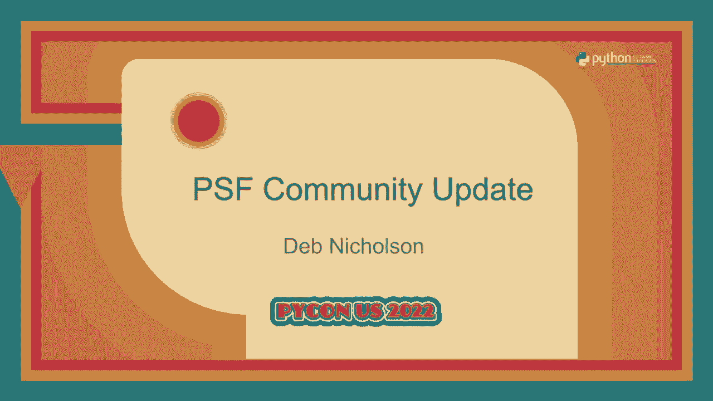
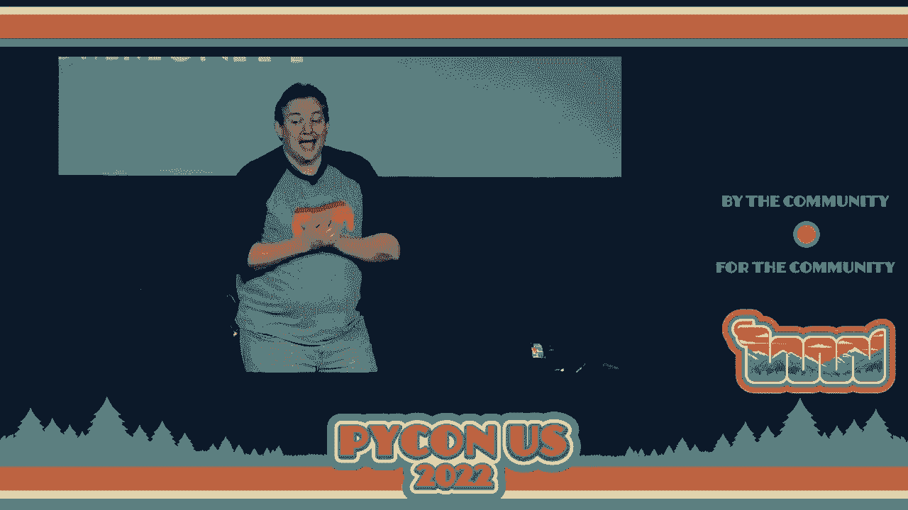
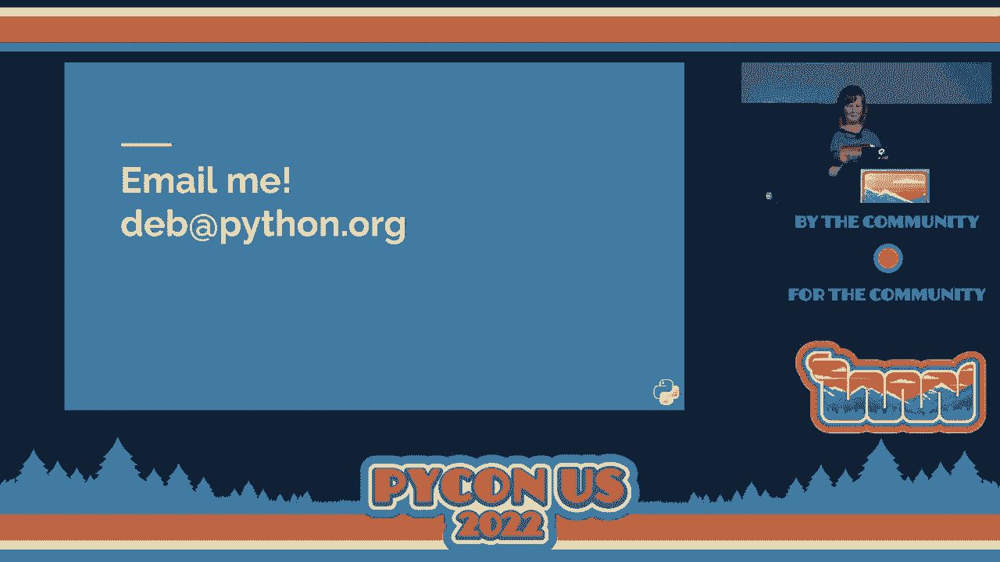

# P9：Keynote - Python Software Foundation Update - VikingDen7 - BV1f8411Y7cP

 \>\> And now let's welcome Thomas Waters to the stage to kick off our PSF update。

 \>\> So some of you may have seen me this morning on stage for the steering council。 This is not that。 This is a different hat。 I'm also the vice chair of the board of directors of the PSF。 And I have been for the last half year the interim general manager since Eva Yodlauska。 left the PSF last year。 I'm sure a lot of you have heard of Eva。 She ran PyCon for 14 years。

 She ran the PSF for 10。 Grew the PSF from a small volunteer led organization with one staff member to a multimillion dollar。 foundation with seven staff members to full time contractors and a bunch more。 Sorry。 Technical difficulties。

 And I just want to say yes， thank you。 I just want to say on behalf of everyone thank you Eva for all your hard work。 Many， many years of service。 And unfortunately she couldn't be here。 I know she'll be watching the recording so I just want to make sure we absolutely how。 grateful we are for all our work。 After Eva left she took great care to make sure that the foundation would keep running。

 without her。 I took on the general manager position just to make sure the staff had everything they。 needed but it was the staff who did all the work。 And they have been amazing。 So thank you to the staff as well。 And the board of directors set up a search committee to find the next executive director。 We talked to a lot of the community members a lot of whom told us who they thought should。

 be the next executive director。 We took that in but we also hired a search firm。 We looked at a lot of left field candidates at different people at different places in。 the industry。 And then we ended up with several really good candidates that we had good conversations。 with and in the end we hired one of the people that a lot of community members had been telling。

 us the hire from the start。 But at least we know we made the right decision。 I am entirely confident of that because we did our due diligence。 So Deb Nicholson。 a Python community member and someone with a large wealth of experience。 and knowledge of the open source community。 So welcome Deb。 Hello， I'm your new executive director。

 I want to thank Thomas for that lovely introduction。 He just made it sound like he showed up to a couple extra meetings but he actually acted。 as a staff person for months with no pay and then also helped really helped me find out。 where everything was and what meetings I should be at and who I need to speak to。

 So he did a fantastic job。 He might not like this but can we please give him a round of applause。 So it's really nice to see the top halves of your faces。 It's been a really weird ride。 I guess everyone says that， right？ But I want to really thank everyone for making this a great。 safe， welcoming place to come， back at the tail end of -- I'm hoping tail end of a pandemic。

 So thanks for being here and thanks for making it feel like a safe place for everyone to be。 And I want to also say hello to everyone who is participating remotely。 I'm told that there's about 600 people that are watching the live streams。 So maybe they probably don't know that we know they're out there。 We just kind of like hello。

 Thank you for watching。 I would love to see if we could make the hybrid version of the event a little bit more。 back and forth as opposed to like thanks we know you're out there。 So we'll talk about that in the future。 I also want to say a huge thank you to Emily Morehouse。 Pecan's volunteer conference， chair。 She signed up to do Pecan for two years。

 She did two remote years and then a third as we came back here。 She worked with all of our keynotes。 She set the program and as many of you probably have already noticed， she's been acting as， our MC。 So thank you so much to Emily Morehouse for three years of conference chair。 So I'm the executive director of the Python Software Foundation。

 How many people know what the Python Software Foundation is？ I see most hands， well maybe half。 Okay。 We're going to do maybe the Tencent tour。 First of all， we put on PyCon， which you're at。 So obviously that's great。 I don't know if you know that we do this usually with eight staff and this year was seven because。 I only joined three weeks ago。 So we have seven very tired staff members here that put on this entire event with volunteers。

 and vendors and everything else。 So I just want to say thank you to them also。 They have done so much work。 Like just hours and hours and hours and it is just so amazing。 And I can't touch the mic。 The Python Software is also the nonprofit vendor neutral home for Python。 That's what enables Python to stay an open source community that is driven by the community。

 and for the community。 And that lets us behave as an organization that can take patches from anyone。 can take， suggestions from anyone and can take contributions from anyone。 And I think that that is so important and completely different than the way a lot of。 other software gets written。 So that's one of the other things we do。

 We also provide the support and infrastructure for the Python programming language。 We also pay some very excellent people to work on Python。 Probably a lot of you saw WooCush's keynote earlier。 He's our developer in residence and works on CPython and is also working on optimizing。

 our volunteer contributions。 The other person who we pay to work on Python is Shimica Manihan who is our packaging manager。 She wanted me to let you know that we are working on a grand vision for packaging and。 we are going to be seeking input from the community within the next month or so。 So I hope you will keep an eye out for that survey and request for information and feedback。

 from Shimica。 The other thing we do is we give money away which is super fun。 We gave $117。000 away this year which is kind of awesome。 It's a little less than in previous years because of the pandemic。 But another thing I would love is if you know of an amazing Python project or community。 or initiative that could use some money that you tell them that the PSF can help them with， that。

 So how do we do all this？ The short answer is you。 But the long answer is also you。 We are able to do all this because you in your lives and in your communities and at your。 workplace talk about Python。 You help other people learn Python。 You get us in front of your boss who writes a check to the PSF。 Also very important。

 And so that is how we do this。 We could not do this without all of you。 This is our new。 brand new annual report。 Take a picture， it's many pages so you won't want to read it this minute but it is beautiful。 it lays out in detail everything that we accomplished over the last year or so。 Or you can just take my word for it that we are awesome。

 This is the fundraiser and you can give us more money unless you already have or you can。 give twice。 You are allowed。 I will accept it。 If you have ideas on how we could get in touch with your boss to give more money let us know。 So that brings me to the community service awards。 Let's see。 We have three years of backlog of community service awards because we haven't met for a， long time。

 So I am going to go a little faster than I might have liked to if you are doing one year。 because I want you all to be able to get to sprints tomorrow。 So let's talk about the community service awards。 I am going to do first the folks who are not here with us in person and then bring up the。 folks who are here with us in person on stage for each year。

 So the 2019 winners I want to thank Chris Angelico， Felipo de Marais， Jessica Upani， Minnie Young。 Katie Bell， Lillian Ryan and Mark Zipiro for their service to the community。 And then I also want to bring up Deborah Acevedo if she is here。 So Deborah is amazing。 She does a lot of work with Piper Zill and is a lot of work with Pi Lady。

 She spoke on Charlie's this weekend。 She is an amazing。 engaging presenter and participates in ton of community events。 So thank you， Deborah。 for your service to the Python community。 Our 2020 winners。 it's just like the whole year took place in 10 minutes or the whole， two years， three years。

 Manuel Cauffman， Abigail Dougby， Katya Lyra， Noah Aluru， Rami Choudhary， Elaine Wong and。 Humphrey Butao。 Thank you so much for your service to the Python community。 And then I also want to bring up Georgie Kerr。 She's here in person。 She's an instrumental in establishing Pi Lady's global。 She's a Pi Lady's Bangkok organizer。

 Remember the PSF Diversity Inclusion Working Group， organizer with PiCon Thailand。 And she designed our excellent theme for this year's Python。 Georgie， are you here？

 Thank you for your service to the community。 Thank you。 Where did I put the。 And now we're at 2021。 So I want to thank Jesse Nohler， Danielle Prasita， Teresa Oyofsu， Doris Zappari， Sylvia Kadar。 Vicki Tumili， Danielle Krasi， Takanora Suzuki， Takayuki Shimizu-Kawa。 Sorry。 If you come in person。 you can tell me how to pronounce your name， I promise。 Anyway。

 thank you so much to your service to the community in 2021。 And then finally。 I want to bring up two folks from PiCon Japan， the PiCon JP Association。 for their organizing local and regional pikons， the work of monitoring our trademarks， and。 in particular organizing the PiCon JP charity talks， raising more than $25，000 US in funds。

 for the PSF。 Thank you so much。 Suzuki and Manavu， please come up。 Thank you so much for your service to the Python community。 Thank you。 Okay。 And you can read more about our amazing community service award winners here and how to nominate。 more people。 If you know someone who's doing awesome work， we want to hear about them。

 We want to have them come up on stage and we want to recognize their amazing contributions。 So I just want to finish with a puppy。 This isn't mine。 A few years ago。 a friend of mine got a puppy and maybe two or three days later， he said， to me。 I was completely surprised by how quickly I fell in love with a dog。 And he said。

 I'm just so happy that I get to take care of this little guy。 I don't know why he was surprised because puppies are pretty darn great， right？ Anyway。 I'm telling you this because everyone here， the staff at the PSF， the amazing volunteers。 and all of you here at Python have been so amazing， welcoming， passionate。 Seriously。

 folks have gone out of their way to share their stories and their opinions。 and community history with me。 I'm saying that you all are the puppy。 The puppy that I didn't expect to love immediately， but here we are。 And I am so happy that I get to take care of the Python community with you。

 I want to hear all your ideas， so please get in touch。 And I'm glad that you're here at Python and I hope to see you again next year。 [ Applause ]。

 [ Silence ]。
