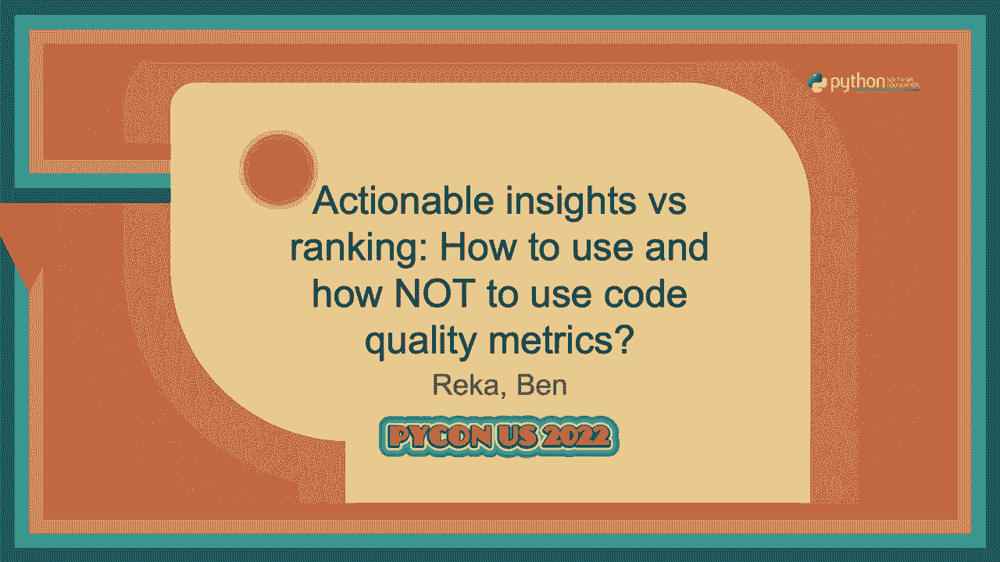
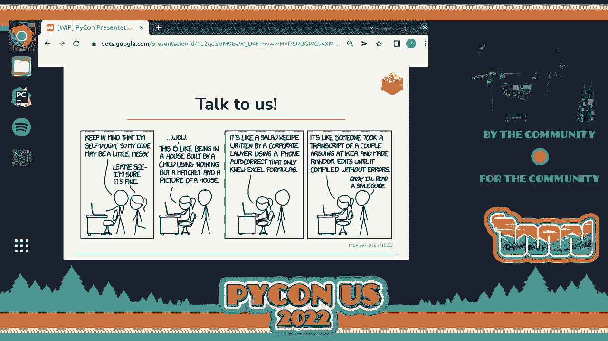

# P90：Talk - Reka_Ben_ Actionable insights vs ranking How to use and how NOT to use co - VikingDen7 - BV1f8411Y7cP

 >> Good morning。 Thank you for picking this as your first talk， not counting the keynote。

 Today we're going to be talking about code quality metrics， which is something that's。

 a great interest to us down at sorcery。 And we're going to be talking in particular。

 about how to use and how not to use code quality metrics。

 So let's start off by talking about code reviews。 Who here does code reviews？ Who gets。

 their code reviewed from time to time？ Raise your hands。 Who does code reviews？ Who。

 code reviews for other people？ Most of us here。 Who's a solo developer and doesn't。

 do any code reviews at all？ Yeah， I thought it might be one or two。 And who thinks their。

 code reviews are objective？ That's what I thought。 So today we're going to be talking。

 a little bit about how to introduce some objectivity into your code reviews in certain situations。

 >> So for that， we are going to introduce some metrics， then try to show how you can。

 gain insights from those metrics。 And we think it's very important to talk about the pitfalls。

 of those as well。 And I'm Reka。 And as a colleague is Ben， we both work at sorcery on code quality。

 tools， which includes refactoring automation and automated code reviews。 So that's one。

 of the reasons why we are so interested in this topic。 And in the years before joining， sorcery。

 I worked at fintech APIs。 >> And I said I'm Ben。 And for joining sorcery。

 I worked -- I did a PhD in material science and then worked as a data analyst and data。

 engineer at a fintech company。 So throughout this presentation， we're going to be looking。

 at a few code snippets。 We're going to be doing some code review， in fact。 And as we， go。

 we're going to be normally a bit thinner right。 And I just want to get your initial， opinion。

 And the reason for this is that these code quality metrics are designed to mirror。

 our personal biases， our personal feelings about what good code looks like。 So when we。

 see these things on the screen， just call out the right。 And let me know which one you， prefer。

 Let's get started with the first one。 Two snippets on screen and without any sort。

 of in-depth reading into what these do， who prefers the code snippet on your left， the。

 one on my right。 One person。 Interesting。 And who prefers the one on my left？ Your right。

 That's most people。 That's kind of what we guessed。 And when we talk about these sorts。

 of pieces of code， we've generally got several bits and pieces of code。 Things like whether。

 it is Pythonic， whether it is elegant， whether it is short， whether it is flat， we talk about。

 naming conventions。 And all of these are very useful terms， but they fall into a bit of。

 a bit of a region of difficulty if we're not thinking more specifically about how to apply。

 those terms。 So to introduce a very -- so to end。 So again。

 a very similar question to the previous one。 Please take a look at these code two snippets and raise your hands if you prefer the one。

 on the left。 And raise your hands if you prefer the one on the right。 And probably the reason。

 is that the second one is significantly short， which induces our first very simple。

 but surprisingly， useful metric function length。 And here we can't hit the statement in these snippets。

 but in Python it's even simpler to count the lines， which is often very close to the number。

 of statements at least。 And this can already give us some good feeling about how complicated。

 code is。 So if you come to the conclusion after this talk that the other metrics are。

 way too complicated， not first to have thought， that is already a way to make your conversations。

 about code a bit more specific and a bit more numeric。 And one thing which functional length。

 has in common with the more sophisticated metrics that it definitely has its limitations。

 And as this one single statement shows it's not always a good thing to strive for the shortest。

 possible solution。 So this introduces the next a bit more sophisticated quality metric， which。

 snippets do you prefer from these two。 Please raise your hands if you like more than one。

 on the left。 Thanks a lot。 And raise your hands if you prefer the one on the right。

 And here the difference is not in size， but rather in complexity which leads to our next， metric。

 Yeah， so we all know the danger of one line is， and this next metric is a way。

 of sort of overcoming some of the difficulty in describing code in terms of shortness。

 Cyclomatic complexity is essentially a measure of the number of branches in your code。 There's。

 a more mathematical description we don't really need to get into。 The right here shows， has。

 seven branches。 And by a branch we just mean different routes that might happen through。

 the code depending on the initial conditions。 And the one on the left， the sort of intuitively。

 nice one， nominally only has one branch。 Now I've put， because in practice， it's obviously。

 more than one， it's way through this code。 But the cyclomatic complexity was developed。

 quite some time ago。 The calculation is simple for every if statement， every try except block。

 and there's a few other conditions as well。 We just add one。 And that is the total cyclomatic。

 complexity of the code。 As I said， this was developed quite some time ago back in the， 70s。

 And it was， it was。 At a time when code was significantly more monolithic than it is， today。

 this is a famous photo of Margaret Hamilton with her code for the Apollo 13 program。 When。

 testability and maintainability were really important and testability in particular is。

 closely related to cyclomatic complexity。 The more branches you have in a piece of code。

 the more things you need to test going through it。 So that was why it was developed and why。

 it's still hanging around。 It is quite useful just as that first guess of how do we go beyond。

 function length。 But it too has its limitations。 These two pieces of code are more similar， ones。

 But just as again rough intuition， who prefers the one on my right on your left？

 And who prefers the one on my left， your right？ Yeah。 So that leads into the development of。

 cyclomatic complexity into our next metric。 This is called cognitive complexity。

 And both of these nipets have a cyclomatic complexity， of three。

 But the major difference is that on the left we have a nested structure。 And， on the three we have。

 on the right we have exactly three top level branches。 And this。

 is something which cyclomatic complexity doesn't make a difference of but cognitive。

 complexity penalizing it's not just new branches but every nested structure which gives this。

 very short nipet or cognitive complexity score of eight。 And cognitive complexity was developed。

 as an improvement of cyclomatic complexity。 And one significant difference between the。

 two metrics is the nesting which we have just presented。 Another one is that it also penalizes。

 recursion。 And on the other hand it tries to instant device good coding practices， things。

 which it calls shorthand structures which summarize multiple lines of code in one。 And。

 this is something that Python really shines for example with these comprehension and。

 context managers。 And cognitive complexity is much newer。 So it was developed in 2016。

 and I encourage you to check out the sonar's paper which has been updated since then regularly。

 And in the introduction they mentioned that cyclomatic complexity does a good job of providing。

 testability especially branch coverage。 But maintainability is a different thing which。

 has a lot of other components。 And one thing which they put a lot of emphasis on is readability。

 for humans and that's why for example nesting and recursion are regarded as not so great， features。

 Of course， psychomantic and cognitive complexity both have their limitations as。

 well because here both scores for this snippet would be one but probably you still wouldn't。

 describe this as really readable。 So to motivate our next metric we're going。

 to do a little exercise here it's not code review。 There are three numbers on screen。

 and the next slide is going to be blank and I'm going to ask you to put your hand up if。

 you feel confident remembering these three numbers。 Hands up。 Good。 Expect nothing less。

 Seven numbers on screen now。 I'm going to give you three， two， one to remember。 Who would。

 feel confident remembering those seven numbers after that。 Yeah， okay about half people that's。

 kind of what we'd expect。 You can see what's coming next。 Two， one and who'd feel confident。

 reciting out those numbers。 I think there's 13 there。 No one。 Interesting。 We'll come back。

 to that in a sec。 Hmm？ Oh， well， let's cheating。 So this is a very well known psychological。

 phenomenon。 It's difficult to keep more than about seven things in your brain for short， periods。

 So this motivates our next metric which we call working memory and this is a。

 very much work in progress thing that was developed down the outside by Brendan and Nick。

 So the count there's a number of ways we could describe the calculation for working memory。

 This is the one I've chosen for this talk。 The essential idea is that for each statement。

 we look at the number of variables in use。 We look at the number of variables which are。

 no longer in use but you might need to keep in your brain to work out what's going to， happen。

 And we also add an additional T4 conditions because the context matters basically。 As we。

 work through a function or something we look at the peak cognitive complexity and we use。

 that to describe sorry the peak working memory and we use that to describe the overall working。

 memory of that piece of code。 And as I already mentioned this is based on the sort of 7+2。

 rule in psychology。 Now you might sort of think well I don't need to remember everything and。

 that's 100% true。 This is one of the major limitations of the working memory as a metric。

 For instance if you knew that these numbers we just looked at were part of the digits of。

 pi you might have a much easier time reciting or being confident about those last few numbers。

 Does anyone know pi to 25ish places？ Yay。 So this is one of the main limitations。 It's。

 very difficult to specify what people need to know as their reading code。 Do they need。

 to remember the elements of the standard library？ Do they need to remember the context of the。

 package that they're working in？ There's a sort of element of expertise that comes in， here。

 So it's subjective and it's a bit difficult to define but it is quite well rooted in psychology。

 and in code style as we'll see in a bit。 So we have just seen four different metrics。

 Two of them were trying to measure the size of a code snippet and two of them the complexity。

 And for both we have a human focus and a code focused view and what this small matrix is。

 trying to show us that it's not that one of those is necessarily better than the other。

 but these are all important aspects of readability。 And it really makes sense to try to improve。

 all of them。 So to shorten your function， it's a name for conciseness to reduce the。

 psychromatic complexity and create specific methods which don't have too many branches。

 reducing cognitive complexity by nesting those branches also following the son of Python。

 and also reducing the working memory by being conscious about the scope of the variables。

 we introduce。 And we have already seen four metrics which sometimes perhaps contradict。

 each other and sometimes it would be perhaps nice to have one single score showing whether。

 a code has gotten better or worse。 So at sorcery for example we use weighted average for this。

 and another very interesting attempt for this is the maintainability index in Python 2019。

 that was an excellent about this from Antoni Show。 So if you are interested in metrics generally。

 I encourage you to check out the video about that。

 So let's take a look at some ways we can measure some of these things for real repositories。

 So here I've got a type of chart called a box and plot。 Depending on the C-born you may。

 have played around with this。 Box and plot is basically a discretized distribution。 It's。

 one way of an extension of a box plot essentially and each of the boxes corresponds to a quartile。

 And what we're looking at here is the function length for all the functions in some of these， repos。

 We haven't picked these for any particular reason other than that they are popular， well。

 tested and they're quite familiar to people。 Notice on the bottom I've got a log scale。

 so these metrics on the far right are particularly long functions。 We've got functions with well。

 over 100 lines in them。 There's a couple of things I want to draw your attention to。

 One is the line down the middle of the box represents the median and what I found really。

 interesting looking at this the first time was well the median of all of these， the median。

 function length in all of these packages is approximately the same。 It's between 5 and。

 6 and that just indicates well if we want our code to be maintainable easy to use open source。

 stuff， 8 for 5 lines in your function。 That's a good style guide and that's the thing that。

 I want to draw from this。 The other thing is that I already mentioned that are serious。

 outliers and we'll talk a bit in a moment about why the outliers are important。 As well。

 as function length we can look at the psychomatic complexity that's in blue and the cognitive。

 complexity。 I've drawn these side by side because they're quite similar。 The only thing I'm going。

 to draw attention to beyond the last slide was well as we'd expect the cognitive complexity。

 is a little bit more than the psychomatic complexity for most of these repositories as we'd expect。

 The working memory and this is something I alluded to earlier again the median of all。

 of these has an approximately equivalent working memory and that's really nice because and。

 it says oh whether by design or happy accident these functions have grown to have a working。

 memory about 9。 That's within the parameters of what we can keep in our brains。 So it's。

 a good indication that the psychology that was developed for the working memory metric。

 is actually seen in practice even without trying。 Another interesting way to look at these numbers is to compare the numbers of the same。

 repository across time and here we can see the cognitive complexity of a specific repository。

 so you can find some more similar analysis at repo analysis。com。 Here we just pick the。

 repo which shows a pattern which is probably a bit difficult。 So we see cognitive complexity。

 so the lower numbers are better and we see that this package started out with a fairly。

 high complexity then around version 0。8 there was a big rewrite which significantly decreased。

 this complexity and since then there is a trend of sometimes going a bit up when new。

 features are added and then come up so period of refactoring and stabilizing where it complexity。

 goes down。 This is the repository where we， the only repository where we show where the。

 data comes from because it is our own and here you can again see the cognitive complexity。

 and it looks like quite good so since 0。8 we have added quite a lot of new features and。

 the cognitive complexity has been still decreasing continuously so everything nice。 That's another。

 representation of or the very same repo and it tells a little bit of a different story。

 because we see that while the average complexity has been decreasing we have also managed to。

 add new outliers in this period and I think this is a very general pattern which we then。

 to oversee that even if we really care about quality and know how to try to improve it we。

 still add new outliers and it means we add new technical depth。 Let's talk quickly about。

 code quality and I'm going to draw an analogy with test coverage as another metric that。

 we're probably quite familiar with。 High test coverage as we all know doesn't necessarily。

 mean that your tests are great。 There's lots of ways that we can test things badly that。

 nevertheless cover all of our code。 However it's important to note that low test coverage。

 probably means your tests are pretty bad and there's an analogy here with the code quality， metrics。

 High code quality or good metrics short functions low cognitive complexity that。

 doesn't mean that your code is good。 However having high numbers of these functions probably。

 indicates that your code is bad and that's how we interpret some of these things。 The。

 higher numbers are less useful than the lower numbers。

 So at the beginning we mentioned that these metrics can help us in various conversations。

 about code and one of these decisions is refactor or rewrite。 So for example let's assume that。

 you are developing an application for an online conference and you need to handle time zones。

 and there is already some time zone package in your organization which has been used occasionally。

 and there is a discussion within the team members。 Some of them say that yes we obviously。

 should reuse what we already have while other team members say that all know that code is。

 quite difficult to understand。 We are afraid that it contains some hidden bugs。 Let's just。

 write something completely new and this is the kind of conversation which has the nature。

 of getting emotional particularly especially of the author of the library is involved and。

 we definitely don't say that this kind of a chart will give you an explicit answer whether。

 to refactor or rewrite but it can give some good hints that yes there are many quite some。

 of the majority of this library looks quite good but again we have some quite big outliers。

 and taking a look at these very complex functions is probably what should decide whether it's。

 worth keeping working with this。 Besides that another decision where these metrics can give。

 us some guidance is what to refactor and how to refactor。 So regarding what again the outliers。

 like these some functions with complexity around 70 there so if you have something like a clean。

 up week or whatever probabilities are the ones where it makes sense to focus the most effort。

 and probabilities are the ones which need the need the more additional test cases because。

 they are the most probable to hide some bugs and regarding how to refactor usually these。

 different metrics tend to correlate strongly with each other so shorter functions are also。

 less complex and if this there is a big discrepancy between them that's often a sign that some。

 specific kind of refactoring would be beneficial so this is again an example from this repo。

 analysis。com and this specific in this module the average function length is just under 3。

 and but the average working memory is above 13 which is which is definitely above that。

 optimal range and this is an indication that we try to probably squeeze a bit too much。

 information and too many different variables into those short functions so in that case。

 we probably are missing some levels of abstraction and we should introduce new data structures。

 new classes and things like that。 So that's to summarize this section it seems that there。

 is a general agreement on some elements of good code style like this medium functional。

 length of 5/6 which represented and that keeping the working memory under 10 is a idea。 It's。

 very important to say that poor quality provides more information than good quality numbers。

 because good quality code can be still difficult to under so good numbers can be still difficult。

 to understand and then you are doing such analysis probably the most valuable information。

 under outliers which shows some areas for improvement。

 Also seen some ways that we can use code quality metrics but the title of the talk includes。

 a bit about how we should not use code quality metrics so we are going to go through a bit。

 of that now。 One obvious problem with metrics in general is that they are typically gameable。

 A wheel-nove ways that we can come up with you know sort of systems to do code coverage。

 for example that doesn't actually test anything。 I was heard a story yesterday of somebody。

 who wrote a package which had 100% code coverage in their tests but none of the tests contain。

 any assert statements。 This is the kind of thing that can cause a problem。

 We also really shouldn't be looking at using these types of metrics as developer performance。

 metrics。 They are biased， they are sort of adhered to a particular style and those styles。

 aren't universal and they certainly aren't necessarily applicable depending on the type。

 of project you are approaching。 We have also mentioned something about average code quality， here。

 Averaging is a real problem for these types of metrics because as we have already。

 seen they tend to live on a sort of logarithmic style scale and the average dotted line on。

 the far left there that's way skewed low。 The thing that we are most interested in probably。

 is these outliers。 So averaging， ranking and sort of trying to use these things as developer。

 performance indicators would become a real problem。

 Besides that it's important to mention that code quality contains some elements which。

 aren't captured by any of these metrics and here we see some examples for bad naming like。

 not so descriptive names and descriptive names but not consistent terminology。 Another important。

 aspect is that these metrics are all quite on a short scale so they measure functions or。

 perhaps a module level but they don't tell us anything about the structure of a project。

 and also not about the external API of it and how convenient it is to use it。 So let's wrap up。

 We've seen a number of code quality metrics today。 This is by far， this。

 is very much not an exhaustive list but as we saw from the matrix it does tend to capture。

 a reasonable subset of what we'd expect to understand about our code quality。 So we talked。

 about the function length probably one you already knew about， things about the psychomatic。

 complexity， the cognitive complexity and this idea of working memory。

 And we have seen some areas where these metrics can provide valuable information so they can。

 be a good input to various conversations and trying to make them a bit more objective。

 They can also serve as code style checks so especially for things like method lengths。

 or also the more complex things for working memory。 They are a great way to identifying。

 areas for improvement and pieces of the code which are most probable to have some problems。

 and bugs and they can also help us with some more complex decisions like refactor and rewrite。

 We've been through the limitations of all of these metrics and also metrics in general。

 We certainly shouldn't be using code quality metrics， these metrics is the only measure of。

 code quality which we very careful with our aggregations and they shouldn't be used in， rankings。

 There's one more final point I'd like to make which is that like everything。

 like a lot of the tools we use， code quality metrics are just a tool。 You can't determine。

 correctness using code quality and that's the final line。 It is a tool to help us write， good。

 It's not going to tell us whether or not the code is correct and is doing the。

 thing that is supposed to do and that's why we're all here。 For those who might not be。

 able to read this， this is one of my favourite XKCD comics， four-star rating on an app which。

 has a good UI and it doesn't crash。 You can set multiple locations but it doesn't warn。

 about tornadoes。 Thank you very much。 So， we would like to thank you to all the sources which you have used here and also to。

 the developers of these various metrics。 So， you can check out these if you are interested。

 in learning more about them and you will find a list of these sources and some metrics about。

 various open source repositories at RepoAnalyses。com。

 You can contact us at the source reboot number， 713 or in the hallway here during the conference and at the GitHub after the conference。

 Yeah， as said， come and find us。 We're happy to talk and we're typically friendly and we。

 won't judge your code。 Thank you。 [Applause]。

