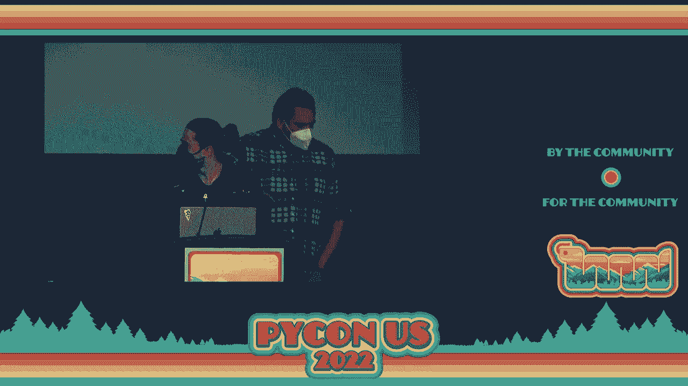
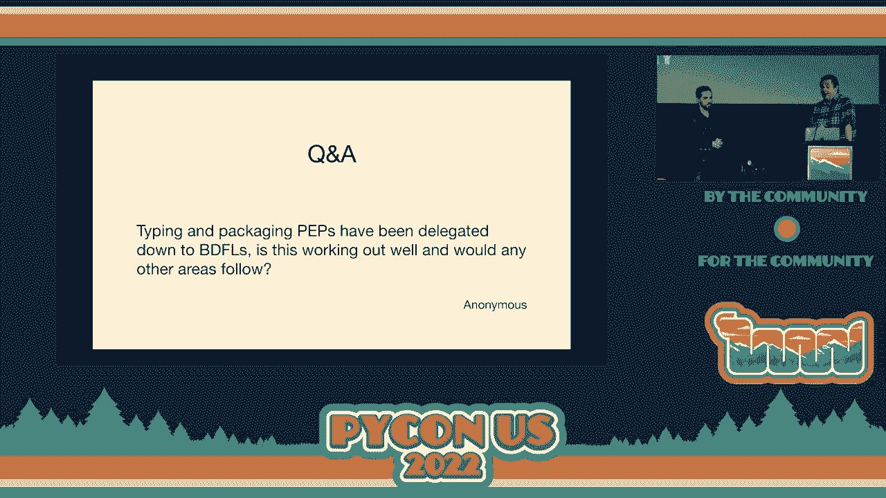

# PyCon US 2022 - P11：Keynote - Steering Council Panel - VikingDen7 - BV1f8411Y7cP

 So next up we have our keynote with Python Steering Council members Pablo Helindo and。

 Thomas Wouders。 Unfortunately， our other three Python Steering Council members weren't able to make it to。

 Python this year for various reasons。 You know， COVID， babies， et cetera， et cetera。

 So all very understandable reasons。 But they are certainly here in spirit。

 I did not have time to print out their faces， but that absolutely was my intention to have。

 them sitting in these chairs with them。 So just imagine little cutouts of their heads sitting here alongside。

 So we're just going to give them a moment to get everything hooked up and then we'll get， started。

 >>， >>， >>， >>， >>， >>， >>， >>。

 >>， >>， >>， >>， >>， >>， >>， >> >>， >> >>， >>， >>， >>， >>， >>， >> >>， >> >>， >> >> >>， >> >> >>。

 >> >> >>， >> >> >> >> >>， >> >> >> >> >>， >> >> >> >> >> >>， >> >> >> >> >> >>， >> >> >> >>。

 welcome to the probably most boring keynote of the conference， at least my part。 Pablo。

 and I are two fifths of the Python steering council， and we are going to talk about the。

 steering council。 Thank you。 So here is what we are going to talk about。 The steering。

 council highlights of the year， just a couple of highlights of the year and Pablo is going。

 to give a very exciting talk about what is new in Python 3。11 and then we will have a。

 little pre-recorded Q&A session。 The questions were asked via the internet over the last， two weeks。

 So what is the steering council？ The steering council as defined in 13， originally。

 PEP 16 is in charge of Python， the programming language and Python， the C Python。

 the implementation。 It replaced the BDFL， Peter van Rossen， and yes。

 that is how you pronounce his name， when， he retired in 2019。

 We are supposed to govern by consensus or not authoritarian control。 We。

 listen to the core developers， we listen to the community and we make decisions， we。

 think is best in all of that。 We are also charged with fostering the community and fostering。

 the core developers， making sure the volunteers can all do their work， all of that。 And then。

 also we make the final decision on Python enhancement proposals， at least the ones that。

 we don't delegate to certain individuals who have better experience or better knowledge。

 than we do and who we trust to make those decisions。 We meet weekly and I say this because we take。

 this seriously， there is a lot of stuff we have to go through， we meet for an hour and。

 a half every week and we fill that hour and a half talking about things。 And then we also。

 do some other work besides preparing emails， communications， et cetera。 And just to make。

 it very clear， the steering council is separate from the Python software foundation。 The steering。

 council is the technical direction of the language and the Python software foundation。

 is the community， the fundraising， the grants， this fantastic conference， infrastructure like， PIPI。

 There is a lot of overlap。 There are core developers on the PSF board of directors， including me。

 And there are board directors like me and former board directors like Brett。

 on the steering council。 We also have a very good work， had a very good working relationship。

 with the former executive director， Eva。 She had attended our weekly meeting， not a voting。

 member of the steering council but very much part of the process and providing a lot of。

 support and keeping the lines of communication with the software foundation short。 So we can。

 spend money， which I'll talk about later。 Eva left the PSF last year after 14 years of service。

 We have a new executive director。 We haven't quite established the same relationship yet。

 but I'm sure it will be fine because I love that。 For those who want to keep up up to date。

 on what the steering council does， we publish monthly updates on GitHub。 We also send them。

 to discuss。python。org which is the discourse website we use。 And if you have any questions。

 you can always ask us personally at the conference an email or you can send an email to steering。

 council at Python。org。 So a little bit of the steering council we had in the past， like I， said。

 this was established in 2019 because Hido wanted to retire from being the one person， in control。

 But as you can see from the fair steering council， he didn't quite abandon us。

 He was part of the first steering council creating a little bit of continuity。 The year later。

 we had Nick and Hido step down and I came in and Victor Stinner。 The year after that。

 Pablo replaced Victor Stinner。 Victor stepped down， I should say， and Pablo replaced Victor。

 And then last year， Carol stepped down。 Barry， who is probably somewhere in the audience。

 heckling me， didn't get reelected and we had Gregory and Peter in their stead。 Now， I put。

 the company names up there。 We have a conflict of interest policy， no more than two people。

 from the same company。 If， for instance， Google acquired Microsoft， you never know， one of。

 us would have to step down。 I also put it up there because even though we have a nice。

 turnover and I colored the slide so you can see kind of the spread in years of service。

 on the steering council。 And we have a spread of experience as core developers。 Brett， Greg。

 and I have been core developers for 20 some years。 Pablo and Peter are more recent core， developers。

 We are still five white guys working at tech companies。 So it's not exactly diverse。

 We are spread out of the world。 We have a very diverse set of opinions to the point where。

 occasionally we have discussions in our weekly meetings， specifically Pablo and I。 And then。

 when I come down from my office， my wife asks who I've been fighting with。

 I guess I speak very loud。 And it's all good。 I mean， we work together very， very well。

 It's just we have passion。 I mean， the diversity is a reflection of the core developers。 We。

 are all core developers。 It's not a requirement for steering council members to be core developers。

 I would love for a non-core developer to be on the steering council。 But the people who。

 vote for the steering council are core developers。 So there is a trust issue， an experience issue。

 A lot of the decisions made by the steering council are very technical。 So we want the。

 technical knowledge。 But there are also a lot of social things。 We're looking at ways。

 to spend money， acquire sponsorships。 Those also require other expertise。 So it is something。

 I hope we can improve as core developers in the future。 Here's a terrible picture of。

 us on the top from left to right。 Pablo， me， Greg， and the bottom， Peter， and Brett。 I apologize。

 for the picture that makes me look young。 It's very old。 So some highlights of the year。

 First of all， bugs。python。org was migrated to GitHub。 This was the result of years of planning。

 years of discussion before the years of planning。 And then more than a year of work by Ezio。

 which was funded by GitHub by donation from GitHub and with support from GitHub。 There。

 were a lot of GitHub engineers involved as well。 In the end， to try to get at the last， you， know。

 last mile done， we included Ukash as well。 And it was completely finished on April， 10th。

 There's still some cleanup to be done。 The current state is that bugs。python。org is， frozen。

 I don't know if a lot of people have used Roundup。 I thought it was great。 But it's。

 not GitHub issues and it doesn't have the network effect and the community knowledge。

 that GitHub issues has， as well as the integration with the rest of GitHub。 All old issues have。

 been moved， including comments and other metadata。 It was a lot of data。 It took three days to。

 migrate。 It was originally going to take seven， but GitHub managed to provide some speedups。

 All new issues have to be created on GitHub。 All the changes have to be made on GitHub。

 It's all on GitHub now。 All the documentation was updated。 As far as we know， we may have。

 missed some。 We have a new FAQ on the migration and the effects of the migration。 And we're。

 still ironing out last couple of things， but the bots and the workflows have all been updated。

 >> That's a funny thing。 We did this slide before we knew that the configuration was actually， done。

 We assumed it was going to happen。 >> We were never quite sure。 Other news from the last year。

 we hired a developer in residence。 This is something that the steering council has been working on since 2019。

 so since before， my involvement。 We originally wanted three developers in residence that we were going。

 to fundraise for in 2020， but then the pandemic happened。 We weren't quite sure what state。

 the PSF would be in。 Last year， Google came to the PSF and wanted to provide a significant。

 donation for a good project。 We convinced them very easily that it would be a good idea to。

 hire a developer in residence to work on CPython。 A full-time core developer。

 >> Lukas is a long-term core developer。 Really， he managed over 3。8， 3。9 and he gave a very。

 uncontroversial keynote on Friday， which I was in agreement with just for the record。

 So the position is hired by the PSF。 It's funded by Google this year。 Meta has already。

 provided funding for the next year， which starts in July。 So we're good for a little， while。

 but obviously we want this to continue in the future。 While it's managed by the PSF。

 because you need to make sure that people have everything they need to do the work， the。

 direction is set by the steering council。 We've asked Lukas to do a number of things。

 including the GitHub issues migration。 He's been working through issues and pull requests。

 mentoring and trying to figure out the best way to have impact。 He's also been keeping。

 the community up to date on his blog。 Other news of the last year， multiple efforts。

 to speed up CPython。 This isn't entirely a new thing， but a lot of things came together， last year。

 Microsoft has a faster CPython team that's been churning out changes to speed， up CPython。

 Instagram released Cinder。 Sam Gross came to Cordef with a plan to remove the。

 global interpreter lock， which would allow parallel threads to execute Python。 We have， piston。

 pigeon， all kinds of projects that have been going for a while that are still。

 going and providing insides and patches and experiments。 A lot of this work is experimental。

 Not all of the improvements will land。 There's a lot of communication that needs to happen， as well。

 There are tradeoffs to consider。 But we already see good improvements in 311。

 which Pablo will talk about and there is going to be more to come。 Awesome。 Who is excited for 311？

 Yeah。 Yeah。 So what I'm going to do is I'm going to cover。

 a bit kind of the things that you can expect for 311。 We still have one week， so maybe some。

 brave person will propose a gigantic pec。 Sorry if that's amazing。 Please don't。 Yeah。

 I'm a sort of a release manager， so better not give me more work。 But I'm going to cover。

 it briefly。 What is there？ If you have more interest on some of these topics， you can。

 read the what's near 311 or the peps in particular。 So let's go。 So the first exciting thing is。

 the faster CPython project。 So here you can see it is not important that you can read。

 the different things。 But what you're seeing here is the different benchmarks that we have。

 on the official benchmark。 So in 310 against 311， 311 is the orange one， 310 is the blue， one。

 The interesting thing to see here is that bigger bars are worse and smaller bars are， better。

 So a lot of these benchmarks have been improved。 This is the biggest improvement。

 in any patch release that we have done。 So in any minor release， sorry， which we are super。

 exciting。 How this will translate to your application， as Mark Sandon likes to say， it， depends。

 You know， give us more benchmarks so they can appear here。 But we are super， excited。

 We are packing very interesting optimizations and we are very hopeful that， you will enjoy them。

 Of course， there has been some interesting consequences of this。

 We have been working very hard to try to fix like third party projects and what not that。

 have been affected by some of the most internal changes。 So it may take a bit more to， for。

 some projects to support 311。 But we think that in total it will be worth it。 So yeah。

 fast-to-see Python。 Everybody is excited about that。 So what else？ So we have more error messages。

 I know when to talk about all of them in particular。 But I'm very excited to say that in 311， most。

 of these error messages that you can see here， those are like specialized syntax errors have。

 been continued by the community。 So before I've been working on them， but a lot of people。

 have been very excited about these things。 Many of the ones that you see here， like for。

 instance like functional elements with two stars and things like that， have been proposed。

 and even continued by members of the community。 So you could do that。 It's very simple。 You。

 can watch the recording of one of my talks to know how to do that。 But yeah， I think。

 everybody loves better error messages and we are going to still pack those in 311 and。

 even more in 312。 So stay tuned for that。 Something that we have also that we are super。

 excited about is PEC 657， which has this boring name， including fine grained error location。

 in tracebacks。 So what this PEC is about is， for instance， here you can see like a traceback。

 of an exception that says here， non-type object has no attribute X。 And this is because like。

 something in this big formula here is none。 And the problem is that in 310 and before it。

 was not possible to know which one of those things was none。 But with this PEC， we are super。

 excited because now we can show you this instead in which we can point to you immediately that。

 I was this guy here， the one that he was known， which is very cool。 You can see all。

 the examples here。 For instance， this is my favorite actually。 You can see here like in。

 mind that you have some big JSON with a lot of like， you know， levels。 So you are accessing。

 a bunch of things here and the problem is like， yeah， non-type object is not subscriptable。

 Not good， right？ But look at this beauty。 Now I'm telling you， yeah， it was this guy that。

 was not subscriptable。 Nice。 And also， who doesn't like dividing by zero？ The dividing。

 by zero is bad， right？ We don't like it。 But now it's even better because like we'll tell。

 you which one was the one that was divided by zero with this nice arrow here。 So much better。

 that you do not need to touch a PDB or anything。 You can know this thing from the tracebacks。

 So we are super excited about this one。 More cool stuff。 So for instance， we have now。

 exception groups and exception star。 This is a very interesting one。 So right now we have。

 this new API that still needs documentation。 So if you try to look for documentation， we。

 will get there。 But the idea is that it's something that will work very similar as how。

 three nurseries work。 So in a sync I/O， you can now say I'm going to start a task group。

 here with a context manager and a synchronous context manager。 And here you can create a。

 bunch of tasks。 And the whole idea here， although it has more interesting semantics， but the。

 main idea here is that the task group will basically wait until these two tasks finish。

 And you can handle correctly cancellation。 So you can sell some of these tasks。 It will。

 behave as you spec and it does in Trio and things like that。 And this is very， very exciting。

 because like a lot of people have been waiting for this。 This semantics has proven to be super。

 interesting from the Trio project and we are bringing them then into CPython。 Interestingly。

 to provide nice interoperability with the interpreter， this requires a big change， which。

 is the actual path that is here。 The reason is because this task over here， like T1 and， T2。

 are going to run concurrently， right？ And both of them can raise exceptions。 So we needed。

 a way to communicate to the interpreter that some piece of code can raise multiple exceptions。

 not only one。 And this is what this path is about。 So now there is this new exception。

 called exception group。 And here I'm raising one of them。 And the whole idea of this exception。

 group is that you can have many exceptions inside。 For instance， I'm adding here one。

 value error and one index error。 And for instance， if you raise these things， you will see that。

 now we have this nicely formatted traceback code。 So if this exception reaches the top， level。

 it will tell you， okay， someone from this exception group and inside this exception， group。

 you know， it was a value error and an index error。 This is very important because。

 this will allow you to handle cancellation and many other things that happen with exceptions。

 group in a nice way。 And to provide very good interoperability with interpreter， now we。

 have this extra key word called accept star。 So now you can write this kind of code， which。

 at the beginning looks of your funky， but it's very easy to understand。 The main idea here。

 is that in normal in an exception handler， only one of these will execute， right？ If you。

 throw an exception， it just happens to be an spam error。 So the spam error handler will， execute。

 If you happen to be a fooler， then the fooler will execute， so far and so on。

 But in it with accept star， because it's made to handle exception groups， then multiple。

 of these things can happen。 So for instance， if you throw an exception group that has an。

 spam error and a fooler， then both the handle for the spam error and the handle for the。

 fooler will trigger。 This will allow you to handle， for instance， an exception group that。

 has cancellation and other things。 So for instance， you could use some of the information。

 to stop a database or to log the exceptions， whatever you want。 The actual motivations and。

 why this is useful is very well written in the peps。 So I really encourage you to go。

 there and read about it。 It reads very， very nicely。 But we will also obviously put some。

 examples in the documentation， so you don't need to read all the technical documents。

 But it's a very small change， but if you write a sync。io code and you are being used， in Trio。

 we think you are going to love this version on a sync。io。 We are very excited for。

 you to try it out。 So we have -- sorry， this is the same thing。 So we have a lot of type。

 improvement。 So the first thing that we have is the self-type。 This is a small one， but this。

 is very useful。 So the idea is that if you have a function here that returns an instance。

 of a class， so for instance， in this class， in this example， this method called setScale。

 is written in an instance of the class shape。 So before， normally， if you type annotate this， code。

 instead of self here， you will put the name of the class， which in this case is shape。

 This unfortunately doesn't play very well if you now subclass shape， because if you call。

 setScale for a subclass， myPIE or other type checkers are going to freak out of it because。

 they are going to think you are returning shape here instead of the subclass。 And then。

 I want to play very well。 But now you can basically type annotate this kind of code with self and。

 it will do what you expect。 If you use this in front of subclass， let's say， I don't know， circle。

 when you call setScale， it will think that it's a circle of just spec and also you。

 don't need to type the name of the class over here， which is nice。 Some more interesting。

 type of improvements is baryotic generics。 So the idea here is that you can now do this。

 kind of code over here。 So when you are not a genetic， you can now put an unpacking star。

 and some type variable。 We have a new one that is called type bar table。 But the whole。

 idea of the star shape is that now you can assign to this thing a race that has multiple。

 dimensions。 For instance， here， I am creating two types for the height and the width of an， array。

 And I can use this shape to match an array that has height and width。 But I can， also do this thing。

 which has four of them。 So the idea is that this thing over here can。

 support assignment to things that have multiple dimensions over there。 Interestingly， this。

 PEP has some consequences on the language。 For instance， now you can do this， which before。

 it was illegal。 The idea is that now you can unpack in the items。 So for instance， I can。

 define here a bunch of indexes， one and two。 And I can unpack those in this here in this。

 one and one， this is equivalent to basically adding zero， one， two and minus one。 And if。

 you have an interval， it will basically impact the interval and access the index。 This is。

 not extremely useful。 It's kind of a side effect of the other thing。 But we think it's。

 actually consistent with the language。 Like there is other places where we allow to do。

 these things。 And it's just for you to know that it's allowed。 But this isn't all the。

 actual feature。 The actual feature is the one before。 We also have literal string types。

 And the idea here is that， for instance， if you have -- let's say you have a function。

 called execute that is going to run some query on the database。 So the idea is that if you。

 annotate the query itself with this literal string type， the type checker will complain。

 if you pass a string that is not a literal。 For example， the second string here is a full。

 literal string。 It's not formatted。 So that is good。 Because it means that not data from。

 the user or from weird parts of the system that will allow a squeal injection can make。

 it to my query。 But if now I go on format my string， either using F strings or format。

 this is not considered a literal string。 It's considered a regular string。 So executing。

 the query will error。 There are other uses for this。 But the security kind of thing is。

 the most interesting one that is written in the PEP。 But you can go to PEP to know how。

 this change can actually be useful。 So apart from typing improvements， now we have Tomo。

 live in the standard library。 This took a while。 But now we have it。 So now you can open， you， know。

 Tomo files。 And you can also do the same thing with strings。 We don't have dumps。

 So you are thinking about the JSON module。 You can load and dump JSON。 We only have loads。

 The PEP actually describes why you can only read Tomo and not write Tomo。 Because writing。

 Tomo is kind of a mess。 Especially because people like consistent format and what not。

 But now you can use this thing。 If you have a project of Tomo， you can directly read it。

 with Tomo live in the standard library in 311。 You don't need third party libraries。

 And basically that's it。 We have four three。 So far， here is a lovely photo of the language。

 summit this year at PyCon。 And this is not only the core of the team that attended PyCon。

 but also a bunch of people that were in the summit。 We are very excited for you to try， 311。

 I think it's going to be the best release ever。 But I'm also the release manager。 So。

 you know what I'm going to say。 So we hope you like it。 [APPLAUSE]。

 So I mentioned we put up a slide on the internet two weeks ago to assemble some questions。 Because。

 we didn't think with COVID rules， it would be a good idea to hand around a microphone。 By the way。

 Pablo and I are unmasked close together。 We're both vaccinated， boosted， and， we both had COVID。

 And still， I'm only comfortable doing this because everyone followed the rules。

 is wearing masks and everyone is safe。 So thank you。 [APPLAUSE]。

 So we put a slide on and started asking questions of people。 And I don't know how many of you。

 saw yesterday。 I saw Peter Wang's keynote。 But this--， I don't know。 That's not weird。

 This was the first， the most upvoted question。 What are the SCs plans to put Python in the， browser？

 We don't need the plans anymore。 Peter's taken care of it。 Seriously though。

 this is one of those things where it feels like something the Syrian Council， should care about。

 But we're only making decisions on proposals that other people bring to us。

 We're not driving the development of Python at this point。 We probably could， especially。

 if we had more core developers and residents。 But at this point， we are not making these， decisions。

 So I'm really glad that other people are doing the work。 And we're very happy with。

 Christian Heimers' work to include WasmBills in CPython and creating a supportive platform。

 But we're not the ones making the decisions or doing the work。

 So there are very popular questions that has been already actually answered many times。

 in the conference。 But I will try to do it again。 So is Don Quina asked， "So CPython 11。

 so it's not a good performance in Premiere of CPython 3。10。 So how much faster would we， expect？

" Well， it depends。 I mean， we are measuring， I think， every time I see the same。

 Mark Shannon corrects me because it's actually faster。 So we think we expect like 25% on the。

 geometric mean of the performance。 But that doesn't really mean anything towards your。

 application because as you saw yesterday， it depends on what you're doing。 You're doing。

 like number crunching， image change a lot if you're doing faster， sorry， heavy object。

 oriented code。 So it depends a lot。 But it will be faster for sure in most of the cases。 And in 3。

12， it will be even faster。 So stay tuned for the announcements of 3。11。 I try。

 as a realist manager to always keep those numbers updated。 And I'm actually going to。

 price it down with Mark to just find with this is the best way to communicate the。

 improvements because people like to know a number。 But yeah， faster。

 How beneficial has it been to have a developer in residence？ Are there any plans or desires。

 to look for funding to expand this like having more folks asked by Prudyun？ It has been a。

 great success to have Ukash as developer in residence。 He's doing a ton of work， has a。

 lot of positive effect。 And we would love to have three or more developer in residence。

 So we are looking for funding。 There are other aspects of this。 We hired Ukash。 He was already。

 a core developer。 We didn't explicitly say we needed an existing core developer but we。

 did have a number of core developers apply。 Even so that the pool of core developers who。

 are looking for employment or willing to move to the Python software foundation is fairly， small。

 So there's also the thing we have to consider are we comfortable hiring someone。

 who's not already a core developer to work on C Python and how long will it take them。

 to get up to speed and all that。 But it is something we're actively looking at and excited。

 about as well in the future。 Frank asks us， does the sting counts and things that San Luis will be viable for C Python any。

 time in the next few years？ And if so， does it have a roadmap？ This is an interesting one。

 We have not discussed this thing in depth。 We are excited about the work for sure。 So。

 we don't have a sting counts in official answer to this thing。 But it's certainly feasible。

 Unfortunately， we don't have a roadmap。 This means that we are excited about the idea。

 We have a lot of questions。 This is a very big change in the past。 Someone has said that。

 probably if there will be any Python forever， this doesn't mean that it's going to be Python。

 for them。 But it's a very big change。 And therefore， it cannot be integrated easily， in the core。

 Someone needs to put a roadmap。 That is going to be very important。 It's even。

 more important as the change itself。 Because even if it could be a scenario when we are。

 super excited about this thing， but there is no way to do it， right？ Because not only。

 about agreeing with that， it's trying to review those PRs， making sure that user code is not。

 going to be impacted， ensuring that backwards compatibility is preserved as much as we decide。

 to that is preserved。 If we can everything， if we cannot， which ones。 So right now， we are。

 like in a roadmap。 This didn't consider the support of the work， I think。 For sure， we。

 would like to see a PEP and discussions。 But unfortunately， we don't have any particular。

 roadmap right now。 Also， we have been focusing just as a discussion。 We have been focusing。

 on all the PEPs that we have for 311。 Because， as you know， after I release the first beta。

 next week， there cannot be any more PEPs on 311。 So we wanted to make sure that everyone。

 that has submitted PEPs， they have been reviewed by the Student Council。 So all of our focus。

 have been on that。 So now that we have 311 kind of more or less set up， we can start discussing。

 these kinds of things and how can the three council have some and the community to advance。

 this work if this is what the community wants。 >> Bernard asked what happened to HPI。

 any other initiative to address this problem？ Now， first of all。

 I want to say I don't think that's how Bernard usually spells his name。

 There's some accents involved。 I copied this verbatim out of fairness with all the questions。

 from the slide。 So it's not my fault。 For those who don't know， HPI is an effort to define。

 a C API for CPython and other Python implementations。 So you can have efficient extension modules。

 for CPython that already have efficient extension modules that will also work well when you recompile。

 them with other Python implementations。 I don't think anything happened to it。 It's still going。

 still being developed。 It's something that takes a long time and it's also something。

 that takes a long time to adopt because we have a lot of extension modules。 Rewriting。

 them is a lot of work。 So this is something that's just going to take a very long time。

 >> So anonymous asked， what does the steering-cals think of the process of attracting new contributors。

 in general and specifically for minority groups？ Well， we think it's super important。 How we're。

 going to achieve this thing？ So we， as the steering-calsil， have this thing actually as。

 a topic to discuss。 Again， we have been focused on the -- we started to discuss this thing。

 at the beginning of the year。 We have some ideas， then we have all these mountain of pups that。

 we need to check and other， like， the developer interested in stuff， we have migrations。 But。

 this is certainly on the agenda to keep discussing。 But also， like， many core developers are also。

 like aware of this thing and they agree that this is a very important thing to do。 Some。

 of them are actually only mentoring people for minority groups。 But we， in general， both。

 the steering-calsil and the core of the team， I think we believe that this is extremely important。

 especially for keeping Python -- for ensuring that Python serves all people from different。

 backgrounds and ideas and especially for people that are underrepresented in the community。

 We know that we have a lot to do here， for sure。 But I just want to make you understand。

 that we think it's very important that we are working on that。 Anonymous asked。

 "Any uptick of new contributors post-github migration？ Any other GitHub improvements， planned？

" I assume this is often about the GitHub issues migration because we moved to。

 GitHub a number of years ago。 I think we saw an uptick from the original move from curial。

 to Git on GitHub。 It's been two weeks -- it's way too early to say anything about GitHub。

 issues migration。 As for further improvements， some people are excited about new workflows。

 new hooks， new robots to do things for us on GitHub issues。 I think we need to figure out。

 more policy around， as the core developer group， not as the steering council， policy around。

 how we deal with new bugs， old bugs， bugs that require more information or that we can't。

 reproduce and that kind of thing， which people are absolutely working on。

 Another important thing on this topic is that we have migrated to have issues， but we still。

 have some rough corners that we are trying to get。 There are things that used to work。

 on BPO that don't work exactly the same or don't work even。 It's been just two weeks。

 as to how much we need to move。 We still， even before adding new stuff， we need to make。

 sure that most workflows keep working and things that used to work keep working here。

 We are going to need some time to ensure that we polish everything and everything works。

 as expected。 In Python， we got better messages。 What far the improvements can we do to make it even。

 better？ I need to steal from the languages。 That's an interesting word。

 I find this funny just as a small parent that is like every time when we start announcing。

 the error messages， like an enormous amount of people say， "Oh， Python is still in for， rest。

" We are not as team for rest。 Rest still has it。 It's great， but like， exactly。

 We are not even coping for rest because they are compiler， time errors that are actually easier。

 Anyway， you can expect more for sure。 This is an idea that we see that a lot of people。

 really like and they find it super useful。 We are super happy to keep working on this。

 I think the best way you can help us make better messages is telling us what do you think。

 is a situation and an existing error that makes your life very difficult。 Both as a user。

 or if you especially are teaching Python to people that are learning programming for the。

 first time。 Knowing those errors that are especially tricky or that people struggle with。

 it is super important。 As core developers， we are a bit biased over super fancy problems。

 and things that we think are super important and even we like to tackle the most difficult， things。

 Sometimes we spend a lot of time with things that maybe are not that useful for people。

 Even if you don't know how to even do error messages， just open an issue and say， "Look。

 I teach Python every Monday or something like that and at this thing always takes me an。

 hour to spend to people。" Even if it's a syntax error or if it's not。 That will be super useful。

 for us to know。 We may need to tell you that that is not possible but some of them and many。

 of them actually is things that we can tackle or improve in certain ways。 At least tell us。

 what do you think we can improve so we can think about it。 Bernad also asked。

 "Are the core devs generally happy with a steering console election system？

 Would any of you like something to change on it？" The steering console election system， we。

 elect a new steering console after every major Python release。 After 3。11。0 is released， we'll。

 elect the next steering console and the entire steering console gets replaced。 A lot of us。

 rerun and a lot of us get reelected at least the last couple of years but there's always。

 the risk that the entire steering console gets replaced。 Up until last year that wasn't a。

 major concern of mine because Eva was part of the weekly meetings and could provide continuity。

 We kind of lost that right now。 I'm not really worried that this entire steering console is。

 going to get booted out but in the future that might， you know， we don't know what's。

 going to happen。 Personally， I would like to see two or three-year terms and then overlapping。

 terms which we've done on the PSF board of directors a couple of years ago which I think。

 worked out really well。 That also allows people to take more risky votes。 If they know that。

 there are three people going to be on the board who aren't up for re-election that they。

 approve of then they can take a risk at a minority candidate for the current election。

 I think that's what would happen but that's just my feeling and in the end it's not the。

 steering console that decides these things。 It's the core developers so there needs to。

 be discussion among core developers on all of this。

 By design the steering console cannot change the document where it says how the steering。

 console works which makes sense。 Another thing I know this guy has a lot of questions。 Typing。

 and packaging pebs have been delegated down to BDFLs。 Is this working out well and will。

 any other was followed？ I mean packaging pebs are delegated。 We have the packaging and。

 authorities that is how it's going。 The fact with packaging is it's separate from Python language。

 They use the pebs system but， the pebs don't affect Python or C Python。

 They only affect the packaging。 Typing is not fully delegated。

 We have delegated some type of pebs but for instance I think。

 almost all of the ones that I just saw here were decided by the steering console especially。

 they touched the syntax。 And especially the ones that were rejected。

 And a bunch of them that were rejected as well。 I think it has been working really well， so far。

 I mean I don't know that much about the packaging world。 I see that some people。

 have some restraints maybe but so far it has not been abundantly a bad idea。

 For typing it has worked pretty well when we delegated。

 And this is because even if the steering console we are very technical people。

 We are not expressing， typing and typing all of their artists。

 It's always good to bring people that really know。

 about this stuff or to delegate if we think it's just a particular person and it's safe。

 to delegate。 But this is an interesting topic。 We are thinking about how can we leverage。

 better the community and the core developer community to help us。 Because what happens。

 sometimes is that we have these many pebs and we can't review them all in time so the。

 delegation is something that we are always looking at。 But we are also careful to make。

 sure that decisions that affect more areas than just typing are。 We make sure that the。

 steering console ensures that the whole community is represented when the decision is made。 The。

 answer will be I think it has been working quite nicely。 What do you think？ Yeah I agree。

 We are pretty much out of time。 We had a couple more questions but it was， one from my manager。

 I can answer him directly。 So thank you all and if you have any more questions。

 then Pablo and I are around at the conference。 [Applause]。

 Hey I was in one of those pictures。 That's kind of cool。 All right thank you so much to。

 Thomas and Pablo。