# PyCon US 2022 - P13：Lightning Talks - Day 2 AM - VikingDen7 - BV1f8411Y7cP

 Good morning， everybody。

 Good morning。 Thank you for everyone that decided to come this early to。

 The first of the lightning talks。 We appreciate it。

 We have a couple speakers before Emily comes back and we have， Keynotes coming back。

 Let's welcome them up to the stage to get ready and we can， Kick it off。 Right？ Indeed。

 Everyone is waking up waiting for the coffee to kick in。 First up we have jeff。

 He's giving us a talk on teaching python for community， Outreach。

 Let's give him a very loud round of applause。 There's not many of us here。 [ Applause ]， Hi。

 everyone。 Thanks for coming up this early。 I'm jeff。

 I'm a bioengineer at the rehab neural engineering labs at the， University of pittsburgh。

 I'll be talking about teaching python and community outreach。

 This is a picture of my lab from a couple years ago。 We've grown to this large group。

 I have our lab mission up here but I'm not really going to talk。

 About that if those words confuse you a bit。 I'm happy to talk about it if you find me later。

 I'd like to show that in the past couple of years especially。

 My lab has formalized a list of both scientific and community， Values。

 We've really emphasized that it's not just about doing the。

 Technical work and the science but we've emphasized the importance， of dignity and respect。

 diversity， equity and inclusion。 Actually being anti-racist， not just not racist。

 There's a difference。 Of course especially in education there's always been a big focus。

 On mentorship and training。 I think these ideals overlap with open source software too。

 We want to share knowledge and provide opportunities to all， With this software。

 These are important things to keep in mind。 I'd also like to talk about the context of my university in the。

 City that we're in pittsburgh。 If you've never been to pittsburgh it's a pretty cool city。

 I recommend checking it out。 You're surrounded by these three rivers。

 Most of the city forms this triangle。 On the west side here， we've got downtown。

 That's a really dis-tranghal area。 I've highlighted the university in red in this neighborhood called。

 Oakland。 We've got Carnegie Mellon University， our neighbors to the， West。

 It's a really big second downtown area。 It's hub of education and technology。

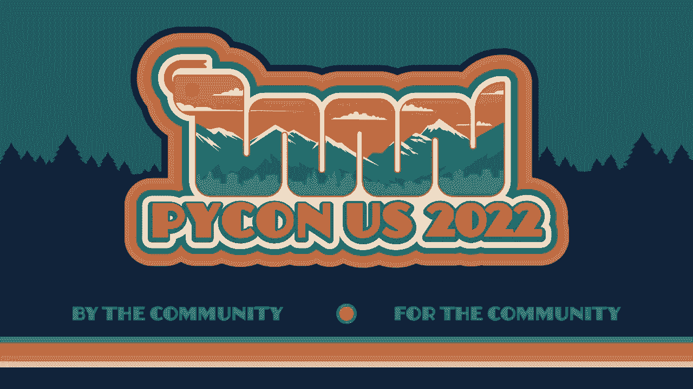

 In between that and the main downtown area is this neighborhood， Called the Hill District。

 It's actually like this really big hill。 Of course these are our literal neighbors in the city。

 It's an interesting neighborhood。 Especially in the earlier decades of the 20th century。

 It was actually known as little Harlem。 It was this really thriving center of African American culture。

 Especially like jazz and Pittsburgh。 But like many cities in the US。

 Unfortunately faced a lot of decline in issues later in the 20th century。

 I highlighted here that they constructed these highways and they put up， Some sports arenas。

 They actually had the knockdown housing to do that and they kind of， Cut it off from downtown。

 Now it's seen as this really disadvantaged neighborhood。 After that it's really unfortunate。

 But these are our neighbors and we'd like to engage with them and， You know。

 it'll change things for the better。 So some of the grad students in my lab plan this and show the Python course。

 The university actually has this community engagement center in this neighborhood。

 Something I'd like to emphasize is that the students who put this on， Are not expert coders。

 I mean they are bioengineering PhD students primarily。

 But they plan some short lectures to go over the fundamentals of programming。 Things like variables。

 control flow， loops， functions。 But actually most of the course time was spent just doing programming practice。

 And we really emphasize one-on-one help from volunteers。

 So we got a big group of volunteers from the lab。 You know， we had different people come each week。

 But we tended to have about as many volunteers as students。

 Which really meant we could do one-on-one time throughout like the whole class。 And you know。

 we had a lot of interesting students of various ages。

 We kind of targeted adults but they range from high school age to senior citizens。

 Different career backgrounds。 You know， some had had a little bit of program experience。

 Most had none。 You know， there was one woman shown here。

 Actually brought her son with her which was really cool。

 She was interested as well even though he was very young。

 So since we had all these different ages and career levels， the one-on-one tutoring really helped。

 And the course ended with some final projects where they had two weeks to work with us。

 To do something really creative and really impressive considering how little time they had to learn。

 They did things like creating password generators。

 Actually creating a Python tutorial and cheat sheet in Python。

 Music playlists and games like Hangman。 We ended with this graduation little ceremony where they presented their final projects。

 And you know， the feedback from the course is really great。 They wrote these sticky notes。

 We tried to teach them how they could learn more in the future and keep this going。

 And so it was just a really great experience and I hope this encourages more people to do something like this。

 You don't need to be an expert at coding or teaching to do something like this and to give back to your community。

 So with that I'm out of time。 So thank you。 [applause]， Thanks。

 I realize I forgot to explain what it was doing up here with my fingers。

 If you haven't seen the landing talk before I was a tiny clapping which is what we do as the speakers get close to their five-minute mark to give them a little signal time to wrap it up。

 Lorena？ Yeah。 I was going to say as someone from Chicago I can connect with the cool Python teaching all that jazz。

 So thank you so much for speaking。 And up next we have Jessica and I am very intrigued what we're going to hear。

 Good morning， good afternoon， good evening guys， Gals and non-binary pals。

 My name is Jessica and I'm a data engineer at Elastic。

 I like to call myself a career data pusher but I also do a lot of automation engineering and scripting in my current role。

 And most importantly I am a devoted cat mom which may not be relevant to this talk but is pretty relevant in general so you should know that。

 Now over the next few minutes while you're enjoying your coffee here in the Python ballroom I am going to change your life。

 I'm going to tell you how we're moving one word from your vocabulary will not only make you a better developer but a better teammate and mentor to those around you。

 This is a personal philosophy of mine but I think it will work for you maybe not exactly but I hope you get something out of this。

 So a little bit of background。 My previous job was at a consulting company where I spent most of my career there as a data-decent developer in some way shape or form starting in the humble rule of data warehouse developer in 2014。

 As a data dev and if there are any data engineers in the audience you may feel this as well。

 You get a lot of questions along the lines of hey why are the numbers like this。

 I would just best I could explain how the data pipelines work you know but I'm not the business owner of the data so if there's some issue with the source data that's not really my purview。

 I can only explain how data gets from A to B how C is transformed into D but not why the source value N was correct or incorrect。

 So one day during a stint with my second data warehousing client I was chatting with a business analyst about a dashboard and she was confused about a few numbers。

 To her they just did not make sense。 I was as usual explaining limitations of what kinds of things I could do like why the source data couldn't fit into the report she was expecting but she just looked at me and said why can't you just do this thing with the data。

 And make the numbers better which what does better even mean in this case。

 Then a couple months later I was transitioning off this client and I was handing the work off to another consultant as I was explaining a rather complex data pipeline which needed much ugly manipulation to even get from source data to a number resembling the output。

 He looked at me and said but why didn't you just insert technical solution that obviously works because I don't know the context of anything that you're talking about clearly you should have done instead。

 I hope you can all see where this is going。 Since these two occurrences I have been on a campaign against the word just when posing a question with someone I'm working with。

 To me just implies that the person you're asking a question to is missing something so obvious so inconceivably unmissable that they should have thought of it in the first place。

 With the first story the BA was saying it kind of out of frustration there was a number she didn't understand and wanted to have me fix it but the second one it was definitely with an air of arrogance this idea of like I didn't know enough to do the correct solution。

 So by phrasing the question away that promotes discussion rather than blame or ignorance which in my opinion is what just implies you can go much farther and maybe even learn a little something along the way。

 So here are a few of my favorite ways to rephrase can't you just like what if we tried what if you did something have you considered did you know about next time you come across this would you be able to explain why。

 And to me taking the time to rephrase this question may even get you thinking about why even came up in your mind in the first place like was there something that I missed or is there something I didn't consider。

 So to me phrasing questions in this way paves away to more understanding teams and colleagues who are willing to learn from one another also if you find yourself using it don't worry I caught myself using it in this presentation。

 So basically be gentle to yourself know that you're all learning as an ex jerk programmer every day I'm still thinking about how I can remove this word and be kinder to especially the junior devs around me。

 There's not we don't know everything so if you may all know that XKCD comic of like every day there's like one person who's learning something that you thought was very obvious for the first time。

 So I'm here to leave you with this very relevant motivational poster which is if your question starts with can't you just the answer is no。

 Thank you for listening to my talk come find me the elastic booth I'll be there around 11 if you want to share cat pics with me all these photos come from the Canadian Internet registration authority they have the best Doc photos on the Internet。

 and you should use them thank you so much。

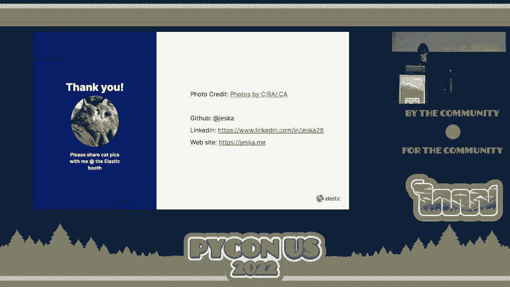

 I think Lorraine is getting her phone out now to show you cat pics。 I'm sorry I'm so sorry。

 I love that talk。 Another word I strike from my vocabulary is simply nothing is actually simple just stop saying simply。

 Alright next up we have Roy with biometric attack let's give a hand to Roy。

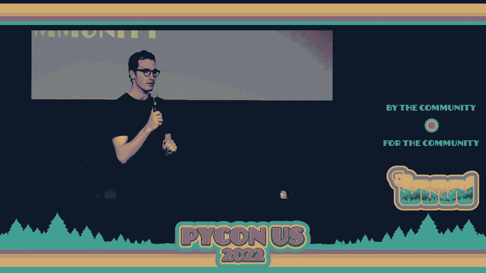

 Hi my name is Roy I'm a security software engineer and today we're going to talk about biometric attack。

 So is anybody at the audience use face ID like I do any other people in technology。

 Cool have you ever stopped for a moment and thought yourself how this magic actually occur how you can show your face to the phone and the phone recognize you as yourself and unlock itself and more importantly have you ever thought how secure is it。

 So let's dive straight into it when you phone see a picture of yourself or any other person it firstly detect where the face is inside a picture and using a deep learning algorithm provide us a feature vector of the face。

 Those features can be anything from the length of your nose or something weird as the ratio of your eye length and your mouth。

 We don't really know what the meaning of those floats but because they are generated by a deep learning algorithm but we know that this feature vector which is sized 128 most of the time supposed to represent you very well。

 So all your phone has to do is save this feature vector inside of it and compare every new photo to that feature vector。

 So let's simplify a thing a little bit。 I will take this 128 feature vector and make it into a 3D vector so our monkey brain can comprehend what's going on here。

 So point number point A is our first scan when we bought our new iPhone and we don't really try to match that exact point because today I'm looking a bit different than I look yesterday in my hair is a bit longer。

 I didn't shave so we're trying to do some circles some sphere around that point that everything inside its sphere like point number C which is a big different point number A represents me。

 Point number B on the other hand is very far which means it's not me it's probably one of you who try to hack my phone。

 So now I understand the process we got a picture and deep learning algorithm provides us a feature vector out of it。

 So we've got a set of feature vector which is a representation of our face but is this representation any good？

 Let me show you something a bit with。 So we tried to put many many images of many many people into many many iPhones and most of the people got exactly one hit。

 They were able to open their own phone but this dude here at index number 27 has something really weird going on with him。

 He was able to unlock more than 50 phone with his face。 So let's try to understand how is that。

 So if we take the example from before about the length of your nose most noses are two inches or five centimeters for non-American friends。

 And although you can have a little bit of bigger nose or smaller nose most noses will be at that range of five centimeters。

 And we found out that most of those features are normally distributed as well。

 Now let me show you we were able to hack a phone。 Third and times in a middle of times which means your phone is secure as in five digit numbers。

 So let me show you how this attack was there。 We generated here many many faces。

 We as a human can see that those faces aren't real at all but because we were able to generate the distribution map for each feature。

 we could create the most generic faces from most generic to least generic。

 And during this attack find a face that will be close enough to yours in terms of iPhone and unlock your phone。

 So no one is safe。 Thank you very much。 This is my mail and please feel free to approach me with any question。

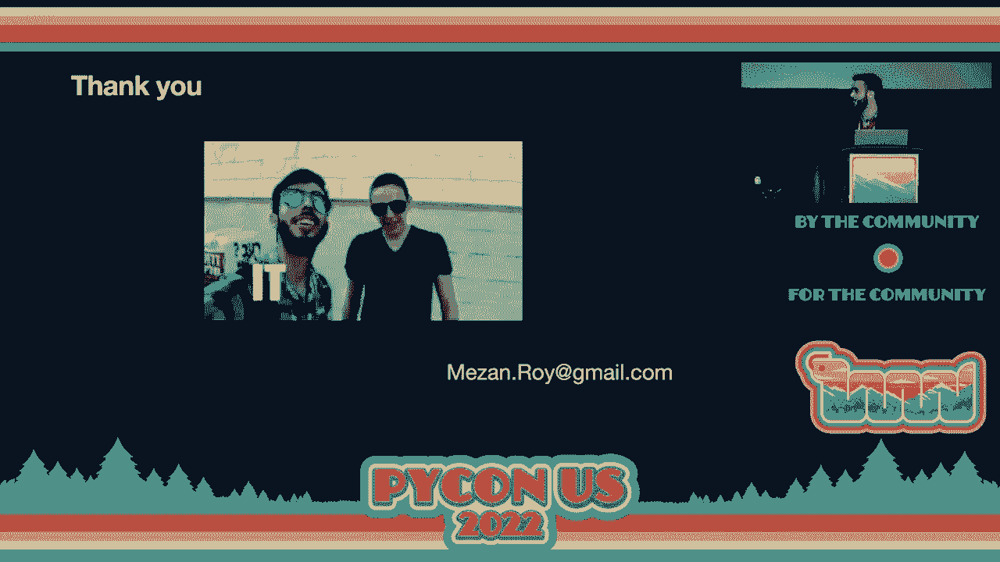

 Thank you so much for your talk。 Up next we have Gajandra continuing on a really relevant topic on security。

 Good morning everyone。 My name is Gajinder Deshpande working as a student professor at KLS。

 Co-ordangest of Technology India。 So I'll be delivering a short talk on security considerations in Python packaging。

 So in brief we are going to discuss three tools。 One is Bandit。

 second one is Safety and third one is Samhgre。

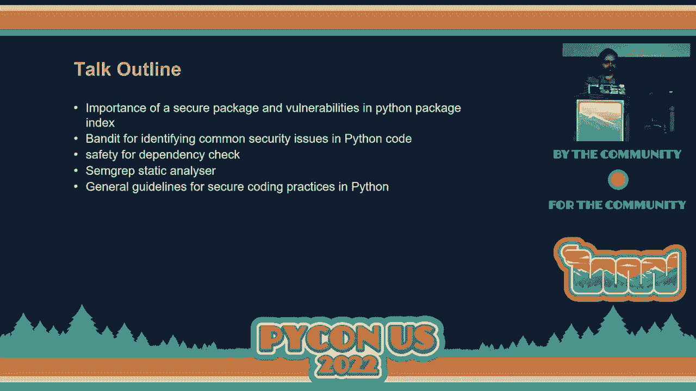

 So why Haka start targeting Python is that we know that Python is gaining lots of popularity and especially in Tobi index it has reached number one position。

 And even in stack overflow it has been ranked third。

 And even in non-Jitup stats you can see that in terms of number of active repositories Python is on third position。

 Now there is this general misconception about the security of the open source software。

 So some people cite that the major reason is that the code is open source。

 The code is available to everyone。 But generally speaking open source software are secured by design。

 And security issues are mostly due to the lack of understanding of secure coding principles。

 And Python is secure but vulnerable it is maybe present in the Python packages。

 So importance of secure package is that in secure package will make your application vulnerable and prone to external threats。

 Compromise and unauthorised disclosure of information may result into personal and company reputation and money。

 So unsecure code may damage the system of users and sometimes it may also lead to the physical damage。

 Now these are some of the articles which you can go to later。

 So these articles have been published recently and they have highlighted several security issues such as dependency confusion attack mounted by a pipy repository。

 Then JFrog detects malicious pipy packages， sealing credit cards and injecting code。

 And potential remote code execution in pipy and supply chain flaws found in the Python package。

 Let's see the bandit tool。 It's a tool designed to find common security issues in the Python code。

 So to do this bandit processes each file builds an abstract syntax tree from it and runs appropriate plugins against AST nodes。

 So once bandit finished scanning all the files it generates a report。 So this is how you can use it。

 You can run it independently。 You can run it against a code repository。

 You can also specify a profile。 So in this slide the shell injection profile has been mentioned。

 So you can also write your own custom tests using bandit。

 So there are some plugins and these are the various types of tests you can perform and there are various tests。

 These are the categories。 So these are the tests under those specific categories。

 The next is the safety check。 So safety checks your installed dependencies for non-security vulnerabilities。

 By default it uses the Python vulnerability database safety db but can be applied to use piup。

io safety apis using key option。 It supports Python 3。5 and above versions。

 Now how to test it is by installing an insecure package。

 So these are some of the commands how you can use it。 So this is the screenshot you can find out。

 This is the screenshot before installing insecure package。

 And this is the screenshot after installing insecure package and you can see that it has appeared here。

 But these are the insecure package installed on my machine。 Now you can use safety db。

 It's a database of non-secure vulnerabilities in Python packages。

 The data is made up available by piup。io and it is synced with the repository once per month。

 So you can visit the URL mentioned here the first URL to see the list of insecure Python packages。

 It doesn't mean that just because it appears in the list it is insecure。

 So there are some safety db tools which you can use。 The safety bar， pip and check and so on。

 The next one is the Samgrep which is the open source static analyzer。

 It works on mostly 17 plus languages。 It supports Python also。

 It is not vendor control and thousand plus community rules have been written。

 You can write your own rules。 It addresses OASP top 10 issues。

 And it hunts vulnerabilities by exploring code base with light wet queries and repel workflow。

 There is a link of playground mentioned here。 You can just visit the link and see how it works and you can explore。

 Then general guidelines that if you are a package maintainer then ensure that the package you are maintaining is secure and practice secure coding principles。

 So as an application developer follow secure coding principles by writing。

 Then use to check vulnerabilities。 Then periodically scan your environment。

 Sign in with your packages using pgp keys。 Use to find for improved security。

 Scan packages before upgrading。 Ensure that you install code from package from trusted source。

 Thank you。

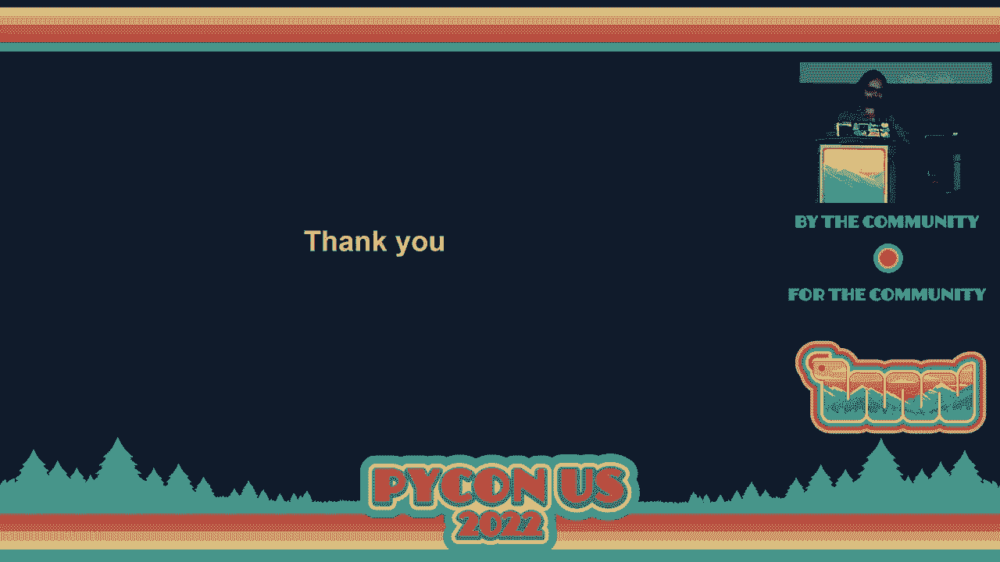

 Great talk。 Next up we have diamond giving us a talk on scaling PyTorch and fraud。

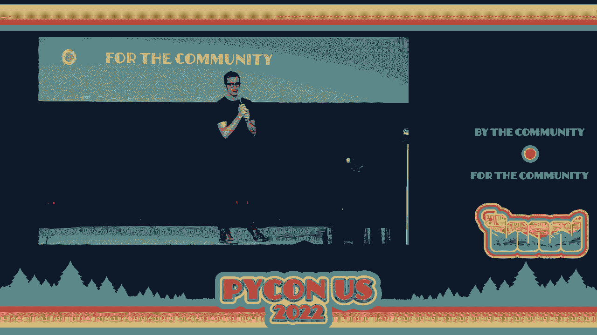

 Let's give it a wave for diamond。 Hey everyone。 Morning。 I'm diamond。

 I'm an engineering manager over at meta。 I work on PyTorch which is your favorite machine learning framework for Python。

 Apologies if we have anyone here from tensorflow。 It's a great framework。

 I'm going to be talking about one of the things near and dear to my heart which is scaling this for production use。

 Really awesome when people use PyTorch for learning machine learning for research for everything like that。

 One of the important things to me is that we make sure it works really well in production as well。

 We're going to be talking about one particular aspect of that in this lightning talk。

 The solution to the gill problem。 Solution put in quotes here because we're not actually solving the gill problem。

 Someone much smarter than me is doing that。 Instead I'm looking at a small part of this problem which is if you're running a production scale machine learning framework or machine learning system most of the time you actually don't want to just write everything in Python。

 There's a bunch of different reasons for that。 I know it's kind of a hard thing to say at a Python conference。

 Usually you end up writing your service in C++ or something that is kind of performance。

 really highly performant because you want really high throughput。

 What you want to do is have this model that you've trained in Python and use it in this potentially C++ or other faster framework service that is very efficient。

 That's really hard to do unless you take the model and translate it into some other language。

 Translations are incredibly painful。 Instead you want to be able to use Python。

 run it with C++ and profit。 How do you do that？ We have two different libraries。

 two different features that we've actually introduced pretty recently。

 One is called Torch Package and one is Torch Deploy。

 Torch Package lets you serialize and de-serialize your Python code。

 Keep your model in Python so your scientists can be happy。

 your machine learning engineers can be happy。 They don't have to do all this messy translations where you end up losing functionality of Python that you really want because we do love actually keeping the model in Python。

 running the model in Python， training the model in Python。

 But you're able to then deploy that and use it in your C++ system。 Under the hood。

 the way that works for a Torch Deploy is that we have actually an interpreter manager so that you have n Python interpreters。

 So you're not just running one because if you're just running one。

 you run into the guild problem where you have the global interpreter lock that makes it so you can only run in one thread。

 Instead， if you have an EC2 instance or something else that has tons of cores that you're paying for。

 you can actually use each of those cores。 Each core is able to run a copy of your model and we do that with having a separate Python interpreter per core。

 An example of this is pretty straightforward。 You've got your C++ program。

 Once you package up your model， you can make a call straight to it。

 We have here that you're loading up the model from your package。 Then at the very bottom。

 you can see that we're actually going to run inference with it。

 Execute your model with the tensor that you're passing。

 That tensor represents the data that you have in the real world interaction。

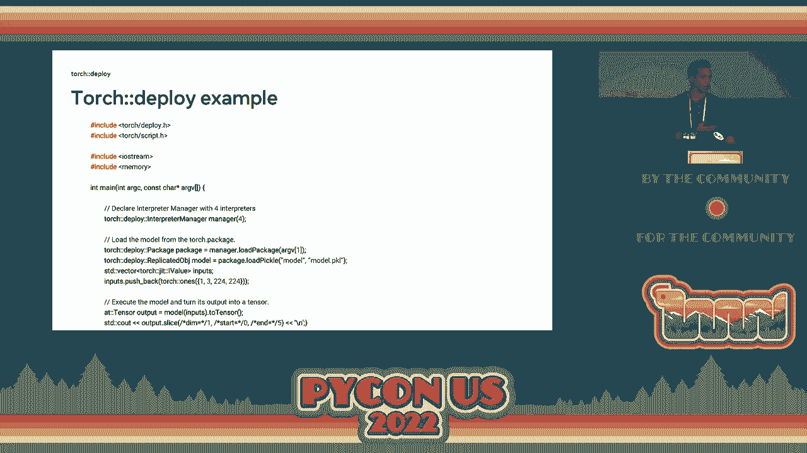

 So how do you actually put your model into that state？ You use Torch Package。

 which is part two of this。 It's hermetically sealing dependencies in with your source code。

 your source model。 It's Pythonic so you can make changes to the dependencies that you're covering with it that you're wrapping with it。

 You have fine grain control of it。 Torch Package example here。 This is in Python， not in C++。

 so it's not as ugly。 This is something that you can see。 We're packaging up the model。

 In our situation， we're saying "extern" is really when you're saying。

 "We're going to rely on an external dependency。 We're okay with that。

 It doesn't need to be hermetically sealed。"， Intern is when you're saying we're going to actually pull this in as part of our package。

 So this is an internal package dependency。 A couple different options you have here。

 These graphs are hard to parse， so apologies。 Real quick。

 the main important thing is that there's a bunch of different ways， like TorchScript。

 which is turning it into another language that you can use to make this much faster。 Instead。

 we show that you naturally， without having to do any performance work。

 are able to get higher performance than your single thread for certain types of models。

 most small to medium-sized models。 The models are a bit more complicated。 We get some improvements。

 but not as much as we'd like。 Yeah， so here's the public docs。

 I'm going to actually be hosting an open space as well at 5 p。m。

 for anyone who wants to talk about PyTorch or machine learning in production。

 You can come talk to me。 We can chat about it。 I love to hear your pain points in particular。

 I have a whole group that really focuses on how do we make PyTorch better for you。

 better for production。 So if you are using it or you're using machine learning in production。

 if you want something from us， come by。 I'm always trying to figure out what else we can do to make it easier and better for everyone。

 And， you know， software is eating the world and ML is eating software。

 so please help us make that happen。 Thank you very much。

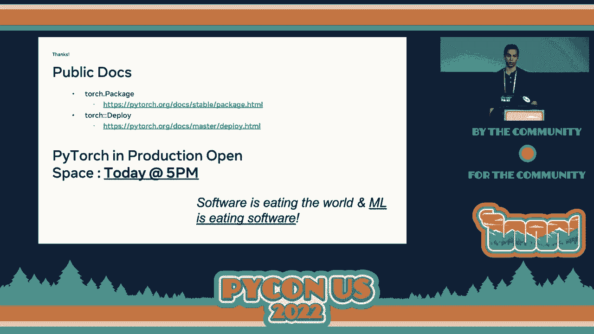

 I might be at that open space。 Up next we have Manabu， who's going to。

 I think it's a really relevant topic， so I'm just going to pass it on to you now。

 Hi， good morning。 I will talk about Split Pyzone community with COVID-19 in Japan。

 My name is Manabu Terada from Tokyo， Japan。 But so I was tough to live from overseas。

 But I came back to here very nice。 And I bought the photo of PyConJP， PyCon Japan Association。

 and a PSA forum member。 So we launched the PyConJP， PyCon Japan in 2011， about 10 years ago。

 At that time， the PyCon community in Japan was very small， so it was an equal sign， an e-ansan。

 and I took the land。 And as a PyCon user， it was full active in Tokyo。

 and as a part of Japan started from PyConJP。 At first， it was only 150 people joined the PyConJP。

 Now we are able to help 1，000 people， 1，000 people， PyConJP。 Thank you very much。 So of course。

 this year we will have an in-person event in October。 If you can come to Japan， please join us。

 As the activity was being promoted to PyCon all over Japan and create more various community in all over Japan。

 While those are the tutorial event， PyCon Bootcamp。

 this could be introduced in the post-accession in the U。S。 PyCon 2019。

 And we supported PyRE this Tokyo， PyRE this Taliban。

 It is making local women's community and connecting all over Japan。 However。

 you have all know the world has changed in the spring of 2020。

 But we thought it would not be good to stop our activity here。 We made some activities。

 So first one， we had PyCon charity talks in Japan。

 It was donated to PSA's PyCon Software Foundation。 So first time we donated 10，000 dollars。

 And total is at 25，000 dollars。 So we had three times。 And other activity。

 So we have YouTube live every month。 We share some news。

 news of Python and the community and introducing some events。 And the new future for the PyCon 3。

10 and more。 Last， we are taking the interview for the next PyCon JB TV。

 And this is my PyCon JB TV and stuff。 So we have an open space session at 250F。 So we started 30。

 30， 30。 Please come to the room if you have a message to Japanese Python。

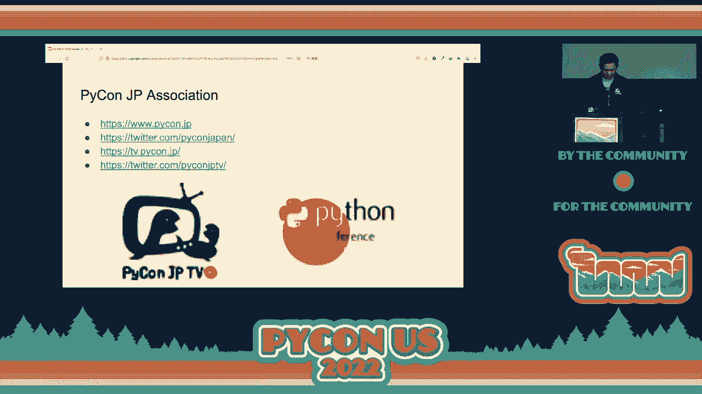

 Thank you， Beatty Matz。 Thank you。 And I want to reiterate that $25，000 donation was really awesome。

 Really helped out the PSF and the folks at the PyCon JB association got a community service。

 for many people。 Thanks for that。 So thank you。 Next up we have Jay。

 who is going to talk to us about DevRel sharing your company's skills。

 with the world。 Let's give it up for Jay。 All right。 So I'm going to be honest。

 I did this lightning talk for two reasons。 One， a lot of people ask me what is DevRel and I go。

 And then the other reason is when I talk to all of my friends in DevRel， they all say， hey。

 do you know anybody that would be interested in a job at DevRel？

 It's growing every company that I've talked to。 We're hiring advocates。

 We're hiring content creators。 So if you've ever thought that getting up on stage and giving a lightning talk or going。

 to PyCon and getting to walk around and talk to your friends and getting paid to do that。

 is something that you might be interested in。 Hey， let's figure it out。 So yeah， like I said。

 DevRel。 I don't know。 It's a good thing though。 Don't worry。

 Every company that tells you what DevRel is， they're telling you what their version of DevRel is。

 It's going to be different every time。 It may change with the seasons。

 It may change with the weather。 And again， this is a good thing because static sites are cool。

 Static teams and companies， not so much。 We have to be flexible。

 We have to be able to adapt to what is happening in the space。 So your job is to be a communicator。

 Your job is to communicate to the community that you serve。

 But it's also your job to communicate to your company the needs of your community。

 If you're not doing both， I'm sorry， you're wrong。 Like that。 I'm hoarse。 I can't。

 I don't have time to argue that point。 If you can't provide value to both the community and your company。

 then you're doing a disservice to one of those two。 So how do you get into DevRel？

 This is going to be the quick three minute version。

 Choose at least one of each of these three kinds of things。

 If femoral content are recurring presence and a longer sustained commitment。

 If you do more than one， great， you get bonus points。

 That'll also give you an idea of what type of role in DevRel you want to take on。

 So we're going to start with the first one。 A femoral content。 This is a Twitter space。

 That's the new hotness。 I love Twitter spaces。 They're amazing。 I did my first one。

 I was driving and then I was like， I want to talk， but I also don't want to crash。

 And like that was like， all right， pull over to the side。 Tell everybody why this is amazing。 Okay。

 then get back on the road。 We'll do safe stuff here。 YouTube live。 Twitch。

 If you've always wanted to tell people to like， like， follow， hit the bell， do all that stuff。 Like。

 hey， maybe this is a way that you can do that， and not have to A， fight the algorithm or B。

 worry about subscribers， clicks and downloads。 Or TikTok。 I'm not going to do a TikTok pants。

 You can't make me。 I'm sorry。 IG live， YouTube shorts， all of these things。

 all of these pieces of content that happen。 They're like a flash in the pan。 Then they're gone。

 If you like doing that， maybe being a developer advocate is for you。 A recurring presence。

 Being at meetups。 Being at conferences。 Joining online communities and Discord Slack channels。

 Appearing on other people's podcasts。 Doing guest posts and things。

 These are things where people in the community will see you or at least hear your name。

 And you don't have to worry about whether or not you did good。

 because you're going to come back and you're going to do better。 You're going to iterate over time。

 Just like when you're learning to code。 Your first code， your first lightning talk。 You're nervous。

 You're scared。 You want to push that button and your buddy Seth is like， "Don't worry。 You got this。

 That was a true story。 That was the story of my first pull request。"， But the more you show up。

 the better you get at it。 The better you get at it。

 the more people notice that you're getting better at it。

 And then the more people are going to want to talk to you because then you go from being the person。

 that was learning to the person that's not teaching。 And then finally。

 the longer sustainable commitment。 This is your blog。 This is your podcast。

 This is your personal YouTube channel。 This is your newsletter。

 This is you posting cat pics on Twitter。 Sorry。 I've been trying to convince some people to get into devroll lately。

 So anything that allows people to see you， know who you are and feel like they can connect with you。

 and they know exactly where they can find you。 That is going to be the thing that you need to focus on。

 And like I said， it's not just being an advocate。 You can be a content creator。 You can be a writer。

 You can get in the video team。 You can do all of these things。

 But I know what you're going to tell me。 I'm introverted。 Me too。

 I'm going to go home and go to sleep for a few days。 You might have ADHD。

 How do you focus on all these things？ Me too。 Having a lot of different things to focus on actually makes the job fun and easy。

 And you can bounce from one idea and then when you're tired of that idea。

 you put it down and then you pick up another one， and then you work on that stuff。

 And you're not the most tech savvy。 That's fine。 Your job is to learn and to show people what you've learned。

 There are a lot of people in the Expo Hall。 If you're interested。

 you can find me or find someone in a booth and ask them。 Your favorite part。

 your least favorite part。 Thank you。

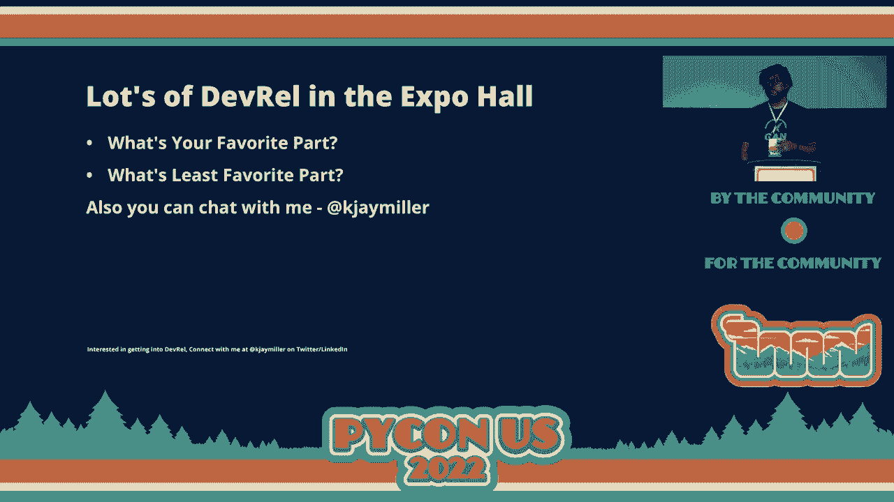

 [applause]， So I have two main coons who I'm very， very proud of。 One of them is named Percart。

 after John Lechbecard。 And all those things。 And yes， I do put them on Twitch。

 I'm very excited for this next talk and we have Jack。

 [applause]， Yeah， hi。 I'm Jack。 You might be able to tell about a title of this talk that it's going to be a bit different in terms of content from the other talks。

 But I'll be talking about what I think is an interesting use of binary search。

 And I swear this is more interesting than Lechbecard。 Okay， so as a quick review。

 I'm assuming most of you are familiar with what binary search is。

 So we're going to go over an easy problem。 So you have this list of a positive number of zeros followed by a positive number of ones。

 And your task with binary search is to find the index of this first one in the list。

 So how we can do this is that we have two pointers low and high to indicate the current search range。

 And then in each step we try to reduce the search range by a factor of two until eventually we end up our answer。

 Okay， so that's pretty simple。 So now we're going to look at how we can apply this to solve a harder problem。

 And this is the problem statement。 Partition a given list with n positive integers into k contiguous segments such that the maximum segment sum is minimized。

 That's a lot to take in。 So I think this is best explained with an example。

 So we have this list here with ten elements and we want to partition it into four parts。

 So one way we can do it is like this。 So the sums are ten， eighteen， six and eight respectively。

 So the maximum segment sum is eighteen。 And this red number here is what we want to minimize。

 And it turns out that we can actually do better than eighteen。

 If instead we partition the list like this， where the sums are ten， ten， twelve and eight。

 the maximum segment is twelve and it turns out this is optimal。 So to get to solving this problem。

 it isn't very easy。 We have to first make a few observations。

 So the first observation is that if we fix the number m。

 it's easy to construct a partition where no segment has some exceeding m。

 So here's this function I have called construct partition。

 We take in a list k and m and then we either produce a partition satisfying these constraints or just for convenience we return none。

 I have no partition exists。 So the idea is to just build each segment one by one。

 And once we get to a point where our segment sum is about to exceed m。

 we add the segment to the partition。 And we're going to keep doing this through the whole list and you get the idea。

 So eventually we end up with our partition from the previous slide。 Okay。

 so now with this function construct partition， we can decide whether or not we can partition the list so that the maximum segment sum is at most m。

 And we can also provide a construction。 But what we want is to partition the list so that the maximum segment sum is minimized。

 So to do this， we have to make another observation。

 And we're going to look at this funny looking list comprehension here。

 Here we're going to construct a partition for just about every possible value of m that might be interesting to us。

 From zero to the sum of the whole list。 And this list has a few special properties。

 First of all is that the last element is not none。

 And this is because any partition has the property that the maximum segment sum is at most the sum of the whole list。

 And also the elements in this list which are partitions are topics of the list。

 So if you think about this list comprehension structurally。

 it's some number of nuns followed by some number of partitions that you can construct。

 And then if you look at the first partition， it also has maximum segment sum of exactly J。

 If we say that this partition is at index J。 And then using the same proof by contradiction logic。

 we can also show that this first partition is actually answer。

 It's the partition that minimizes the maximum segment sum。 Okay。

 but if we treat all the nuns as zero and all the partitions as ones。

 this problem of finding the first partition is basically the same。

 as the problem that discussed earlier of finding the first one in this list of zeros and ones。 Okay。

 so this is the code。 That's a pretty short code。 And you'll notice that it's actually pretty similar to this first problem I described。

 And now I want to take some time to revisit the title slide。

 So actually an hour before this talk when I was preparing。

 I realize that this is actually a leak code problem。 Yeah。

 but nonetheless I still think it's pretty interesting。

 So this is the code problem 410 if you want to have a crack at it maybe during lunch。

 I think it would be pretty interesting。 And that's all。 Thank you。 [applause]。

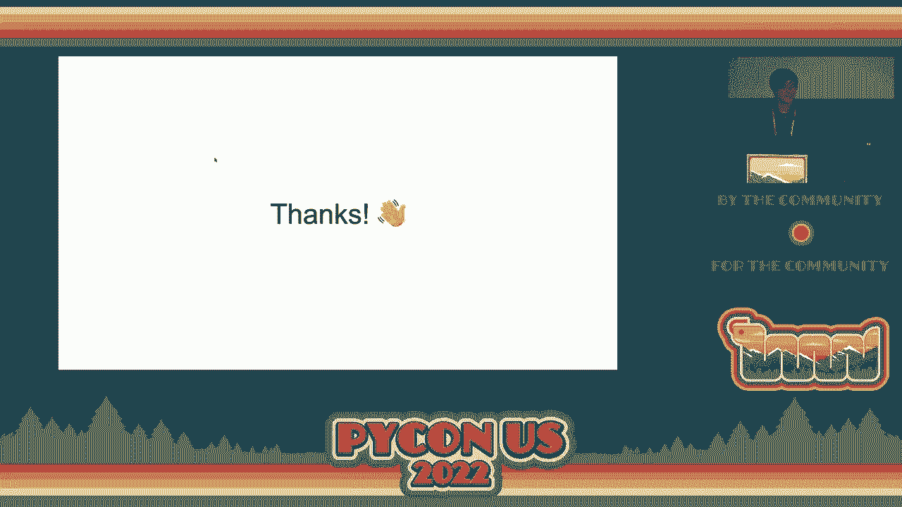

 Thanks very much。 All right。 Next up we have Henry who's going to give us a talk on Scikit HEP developer pages。

 Let's give it up for Henry。 [applause]。

 Okay， thank you。 So I want to talk about the Scikit HEP developer pages。

 So Scikit HEP is a GitHub organization that was built around providing energy physics packages。

 So we have a bunch of energy physics specific packages that have been built up over the last few years。

 You can see a few of them listed here。 But we have also worked on some general purpose packages as well。

 So we have some packages that are there like Vector for Vector Manipulations。

 Awkward Array for JSON like data structure but NumPy like Access and Histograms。

 But one of the products that has come out of this is the Scikit HEP developer pages。

 And this is the most general I think of all of these and that's what I wanted to talk to you today about it。

 So if you want to find these you can just go to Scikit HEP。org。 It's also linked for my blog。

 I signed up by Dev and you'll get to a page that looks like this。

 You can click on either of these two places and you'll get to the developer pages。

 So when you get to the developer pages you'll be greeted with something that looks like this。

 You have a variety of different pages there and it will guide sort of walks you through the different pages。

 These pages can sort of be grouped into these areas。

 There are some tutorial like pages that sort of tell you how to set up a development environment。

 use pytest， static typing， things like that。 Cleaning a very nice GitHub actions tutorial including how to do binary packages。

 regular Python packages and discussion of how you use a task runner like Knox。

 And then there's some specifications。 The packaging is in two different sort of groups or a classic packaging and the simple or six。

 twenty-one style packaging。 And then there's a style guide and then there's a couple extra tools which I'll show you cookie and repo review that support this。

 So this is the simple Python packaging page。 It used to be called pure Python packaging but hopefully this is sort of growing to include some binary packaging soon。

 And so you have this little toggle here and you can actually just switch this toggle from flip to hatched。

 PDM set up tools。 The whole page is the same。 All this part of the page is the same。

 It's really just that tool that changes。 Just those two lines which is a really nice feature of PEP 621。

 And so this can be a guide for any one of those。 For style there's a bunch of different things。

 It sort of tells you how to set up pre-commit hooks for all of these different tools with recommendations for how you would configure these。

 And sort of describing sort of what each one is。 Now this all comes together in second-hep cookie which is a cookie cutter package。

 It gives you eleven different back-ins to choose from。 So if you want a set of tools。

 traditional package or if you want a set of tools at 621 or a flit or hatch or PDM or several others。

 And it even has some binary packaging which you don't see very often in sort of a general cookie cutter。

 Something with a second build or just plain set of tools C++ or even rest is supported there。

 So to do this you could just do a PEP X run cookie cutter or however you like to run cookie cutter。

 And then that's the path that you can put in。 And this is all backed by the Psycadep developer guidelines so you're not just thrown at a bunch of different styles and things。

 You can actually go look up and see why each choice is made and why each package is there。

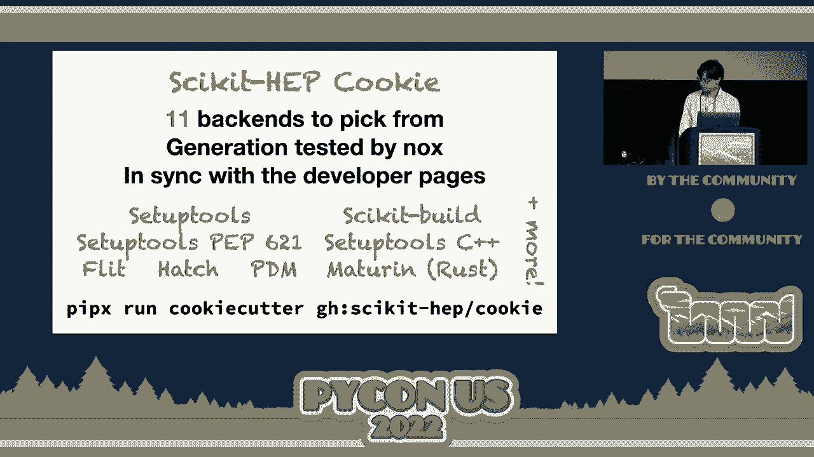

 And then there's the Psycadep repo review。 And this is something that I sort of wrote for myself。

 This is a rich application。 And you can just run this and it will see how close a repository is to following these guidelines。

 So it will go through and check a variety of these different guidelines。

 There's lots of different ones here。 And tell you if it matches or not。

 And this is really nice but it's still something you have to go manually run。

 So what I've recently done is written the Psycadep repo review PiDye app。

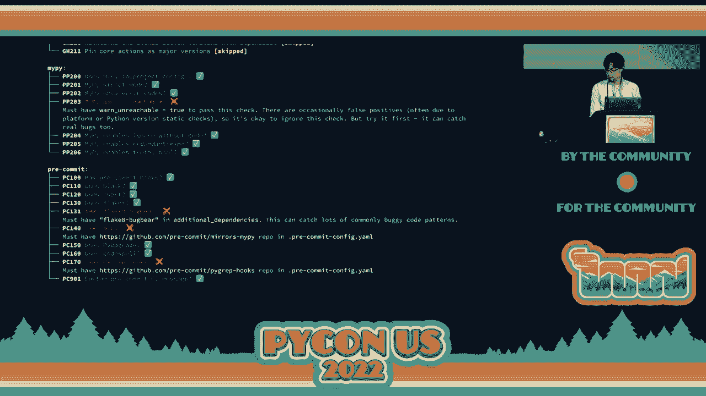

 So this PiDye app sits there in the Psycadep developer pages。

 It's just one of the pages in that list。 You can just type in your repository。

 pick a branch and click a button and in your browser， Python。 And this is a Python 3。

10 application that uses pattern matching and things。

 But it's able to just run right there in your browser without installing anything and give。

 you a report that looks like this in your browser so you don't have to leave the Psycadep developer。

 pages anymore。 And a day later another HEP user took this。

 I was also really excited just in this technology and the ability to do this。

 One day later another of our Psycadep developers took this and adapted it to one of the other。

 packages there。 So that was something that was exactly what I wanted to happen from this。

 I was really excited to see other applications。 Okay。 So， Fett， thank you very much。

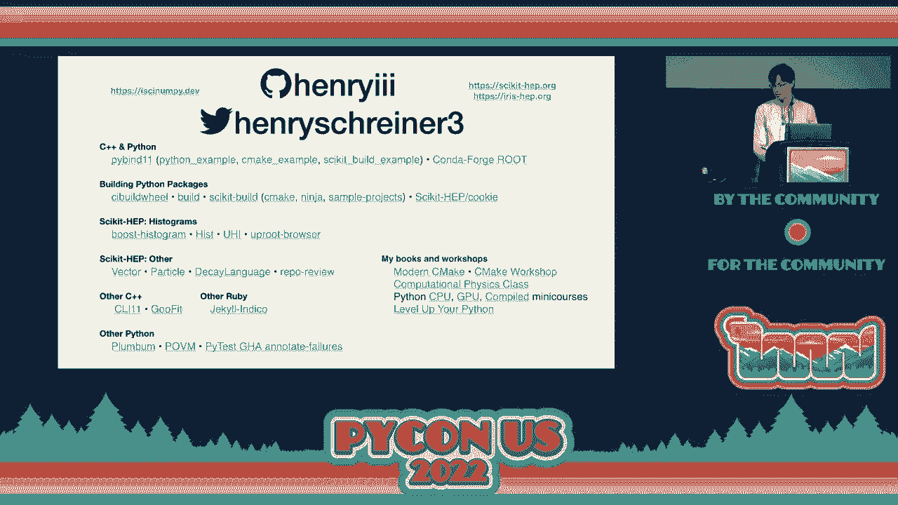

 [Applause]， Thank you so much， Henry。 I just want to do a quick plug。 PiLadies' auction is tonight。

 It's a really great organization。 Hence the shirt I'm wearing。

 And it helps us raise money for folks to come to PyCon and do really great things。

 And all that being said， you should grab a ticket if there's still some left。 Now。

 without further ado， Chris。

 Thank you， Lorena。 Before I begin， I want to tell you about these words here。

 They're thanks to a person called Diane， who is a real human being。

 She's sitting on the other side of an internet and is typing exactly what I say onto this screen for your。

 benefits。 I watch this， a Septagenarian， a Fantasia， anti-disestablishmentarianism。 Thank you。

 Diane， and our other captioners。 Okay。 Hi。 My name is Chris。

 Please tweet me at the handle on your screen。 I'm here to tell you to stop running your tests。

 But， Chris， I hear you saying tests are how I am confident that my code works。 And that's true。

 Having good test coverage is a great way to be absolutely certain that your implementations are correct。

 And making sure that you don't break things as you develop。 But on the other hand。

 tests have a lot of problems。 They're slow。 When you run your full test suite。

 most of the tests you run are irrelevant to the changes you're making。

 But your test suite is only correct if you run the entire thing。

 But you don't run your entire test suite except in CI because it's slow。 So， in short。

 you have tests， but you don't run your tests。 You have no tests。

 What would be better is if you could keep not running your tests as often as you do now。

 but still know which of your tests are correct。 That world actually exists。

 I'm a maintainer on an open source project called PantsBuild。

 where a tool that orchestrates all the other tools that you use to interact with your code。

 That's everything from linting and formatting through to testing and packaging。

 Our goal is to make the Python tools you already use more efficient than they are in their default configurations。

 even on huge code bases with complex interdependencies。

 We do that by identifying work that can be run in parallel or redundant or duplicated work。

 which will save you from having to run at all。 Watch this。

 You can run an entire test suite that is not surprising。 You can see we run PiTest under the hood。

 and it runs all five of these test suites in parallel。

 but it only takes 20 seconds walk-o clock time to run this 60 second test suite。 That's great。

 but not completely surprising。 A lot of test runners do this。 What else can we do？ Well。

 if we change one of the test files and rerun the entire test suite， it looks like this。

 It looks like it runs everything， but it actually doesn't。

 Own all of those tests that we ran before and we didn't change get reused。

 Only the test that we changed gets rerun。 That is because Pants will cache every single run down to the process level。

 That's what this mean-alise thing means。 Our 60 second test suite takes only 10 seconds to run now。

 That's still not surprising。 A lot of test runners do this。

 Let's reset that change and run those tests again。 Pants will cache every test run。

 not just the most recent one。 If we run a command that's identical to the one we've run before。

 Pants will pull all of those test results out of the cache and reuse them。

 Our 60 second test suite will now run instantly。 Now， what if instead of changing a test file。

 we change an implementation file that is under test？ We can rerun the entire test suite。

 and this time the only test we rerun， is the one that tests the implementation file that we changed that we're testing。

 With this， you can make all the changes you want to your implementation files that you like。

 and you can rerun the entire test suite， and Pants will only rerun the tests that run-。

 that the tests where you change the code。 This is because Pants does automatic dependency inference。

 It will do static analysis on your code base， and it will figure out all of your Python codes dependencies automatically。

 This Pants dependencies command will show that dependency analysis for you， and again。

 it has figured all of this out automatically。 We didn't need to do any configuration。

 This is all the configuration we needed to do。 We just said there are some source files。

 said there are some test files。 If you've ever written a build file before。

 you know how short this is。 You don't have to map any dependencies yourself。 Our static analysis。

 if it misses a dependency， you can add it manually， but normally you don't need to。

 You don't even have to write this file yourself。 We have scripts that will automatically generate all of your build files。

 If this is interesting to you and you want more of a demo。

 or you want to talk about how Pants could help in your code base， you can find myself， or Benji。

 or John。 They're wearing shirts with the Pants logo on it。

 I've got a talk on Sunday at one o'clock about how Pants does all this fine-grained caching underneath the hood。

 and will be sprinting on Monday， where we will help you run Pants on your own code base。

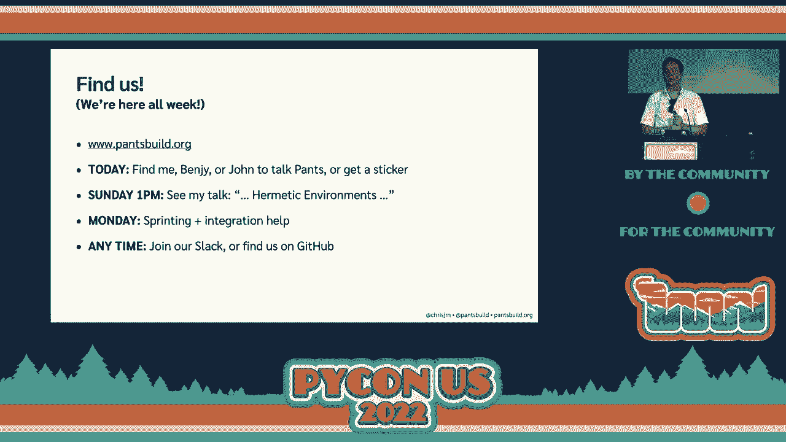

 So come find us at the rest of the conference。 That is how you can use Pants to stop running your tests unnecessarily。

 My name is Christopher Neuigabauer。 Thank you very much。

 [applause]， Can'talope！