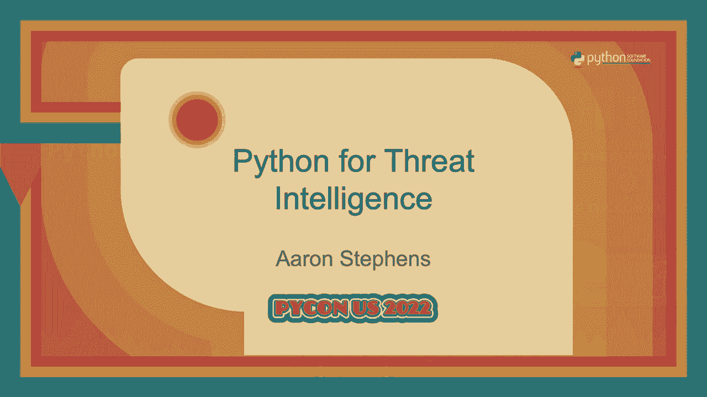

# PyCon US 2022 - P17：Talk - Aaron Stephens_ Python for Threat Intelligence - VikingDen7 - BV1f8411Y7cP

 >> Our next talk is Python for Threat Intelligence。

 Everyone please welcome Aaron Stevens。 >> Hi， everyone。 Thanks for coming。

 My name is Aaron and this is Python for Threat Intelligence。 A little bit of background。

 I work at a company called Mandiant and we provide cybersecurity， services for other businesses。

 You may have heard of us before。 We investigate some of the most high profile hacks around the world whether that's criminals。

 looking to get rich or nation states conducting espionage or other intelligence operations。 Now。

 as you may have guessed， my team focuses on threat intelligence。 If you're already lost。

 don't worry。 I'm going to go over what that means and how we do it in the next few slides。

 If I had to summarize what my specific role is， it's to provide capability and automation。

 for my team。 So basically enabling our analysts to do more of the work that they do and help them do it。

 faster。 Unless a little disclaimer， I'm not a software engineer and I never have been。

 I'm an analyst myself。 So I'm not here to tell you how to write code or to show off some new cutting edge project。

 My goal here today is to show you a little bit about what threat intelligence is and。

 how we use Python to help us do it。 And by sharing some of the things that we've had success with on my team。

 my hope is that， it might inspire some of you to do something similar in your own work。

 So what is threat intelligence？ Threat intelligence is knowing about adversaries。

 what they do and how they do it。 Mandiant conducts hundreds of investigations every single year and it's my team's job to。

 look at all of those investigations and keep track of who's doing what and how they're， doing it。

 Why do we do this？ To help defenders make informed decisions。

 This may sound like common sense but it helps as a defender to know what you're defending， against。

 right？ So a customer may ask， what are the most common threats targeting my industry and what tools。

 and techniques do they use？ And last but not least， we do this with data， expertise and technology。

 I know that sounds super vague but I think it's actually really important to understand。

 that we need all three of these things working together in order to be successful。

 To illustrate this， let me walk you through an example。 Say we have an investigation。

 One of the first things that we want to do is collect data。 Now when I say data。

 I'm talking about things like files， event logs， network telemetry， pretty。

 much anything that we can use as forensic evidence during our analysis。 At the same time。

 we're documenting what happened。 I know this sounds similar to collecting data but I think that the key distinction is organization。

 So if the data that we collect are puzzle pieces， then documenting what happened is putting。

 those pieces together so that we can begin to see the bigger picture。

 That usually means building a timeline of events and doing something that we call modeling。

 which I'll talk about in the next slide。 And with this bigger picture beginning to take shape。

 we start applying context to the， data。 This means taking a deeper look at the information that we have。

 expanding that information with， additional sources and beginning to derive meaning from it。

 For example， our collected data might show a program is being installed or executed but。

 we still want to know what that program does。 By reverse engineering the file and understanding what its capabilities are。

 this can help us， determine whether it's relevant to our investigation。

 When we do this for every investigation， it helps us identify patterns across them。

 These patterns become the backbone of our analysis which ultimately allows us to make。

 assessments about the adversary， their tools and their objectives。

 Focusing more now on expertise and technology， I don't think it's news to anyone here that。

 computers are better at some things than humans and vice versa。

 And I think this is especially true here。 And the more that I thought about it。

 the more that I realized there's kind of this， transition between the two as we work through this process。

 Computers are really good at collecting and organizing data and they can help us apply。

 context and identify patterns if we tell them where to look and what to look for。

 But ultimately in the end， we still need humans with the right expertise to analyze the data。

 and turn it into knowledge。 And the last point I want to make here is that this process is a cycle and when done well。

 feeds itself。 The assessments that we make and the patterns that we identify allow us to apply more context。

 and better informs our collection。 Now I want to quickly cover data modeling which I'll define as a framework for documenting。

 both our data and analysis。 Throughout the course of every investigation and research project。

 our analysts are carefully， modeling key information in trying the work that they've done into an ever growing graph。

 This graph serves as the authoritative knowledge base for all of Mandiant。

 So everything that we know about adversaries， what they do and how they do it lives here。 Again。

 I think it's easiest to talk about via example。 So let's say that we start with a Word document that maybe we found attached in an email at。

 a customer。 You might seem harmless but on closer analysis we determine that the document contains a。

 macro that when executed installs a malicious file of some sort。

 So we model that by connecting these two files or nodes with an edge。

 And we're already beginning to document what we have and apply context。 So let's keep going。

 After our reverse engineer analyzes the file， they report that it communicates via HTTPS。

 to a domain。 And continuing to expand what we know。

 we may also notice a code signature for the file， and a resolution for the domain thanks to our passive DNS source。

 Eventually， we have enough information to assess that this file belongs to the malware。

 family bad apple。 Identifying malware families is often the first big step toward attribution as adversaries。

 tend to use the same malware families across multiple intrusions。

 Which makes sense when you think about it。 Bad guys are people too and they like to stick to what they know。

 Like imagine having to learn a new piece of software every time you came into work。

 It just doesn't really make sense。 So we've applied our malware label to the file along with all the data linked to it。

 Signifying that each node is a component of the bad apple ecosystem。 Let's keep digging。

 We know our malware communicates over HTTPS which means a TLS handshake and an X509 certificate。

 for the domain。 And here's where things get interesting。

 We can't find any more direct relationships to our certificate but we're able to identify。

 a pattern softly linking it to another certificate with a similar organization name。

 Maybe we saw it recently and we just happened to remember or maybe one of our teammates。

 codified that pattern into a detection which made the link for us。

 Either way we've just uncovered a big clue because this certificate has already been。

 attributed to the adversary Dr。 Evil。 Now we have to be careful when we make jumps like this just because two things are similar。

 doesn't necessarily mean that they're related。 But as we continue to traverse the graph we find that this certificate is tied to another。

 bad apple sample including a document much like our own。

 And I'm simplifying here but with all of these identified overlaps we're eventually。

 able to attribute our activity to Dr。 Evil expanding our knowledge of this particular， adversary。

 And because we modeled all of it our team can now use that intelligence in their own analysis。

 and investigations。 Okay now let's talk about Python。

 Thinking about what analysts need to do how can we enhance or automate parts of that process。

 As I mentioned before I think collecting data is the easiest our analysts work with。

 so much data they shouldn't have to wrangle it all manually so we can automate most of。

 this with some good IO functionality。 And once we have that data we can also organize it according to our data model and publish。

 it directly to the graph。 This way analysts don't have to create every single node and edge by hand。

 They can jump straight to analysis and focus on the really hard questions that require。

 their expertise。 Applying context and identifying patterns gets a little bit harder but we can still help。

 by giving analysts easy access to data sources， extract and model the key information we get。

 from those sources and generate detections。 And finally our mission is to enable analysts but we can't replace them。

 They still need to be in the driver seat telling us what they need so that we can go and get， it。

 In other words we need a UI。 So over the next several slides I'll be covering the Python packages that we use。

 the features， we like and some examples of how we use them。

 The first one I want to talk about is argpars。 We use argpars for all of our command line input。

 We like it because it's part of the standard library。

 It's really easy to use and it's well documented。 It comes with a ton of default functionality without having to write a lot of code but it's。

 still flexible enough for our various use cases。 You can see here that with what is that five lines of code we get a ton of functionality。

 telling our analysts about the tool and how to use it。

 Another thing about argpars that we really like is that it allows us to define arguments。

 that we can then use across multiple argument parsers。

 So for example say we want an argument that allows us to define the log level that we。

 want to output。 We can store that in say like a core args module and then in another module we can just。

 import it and stuff it into an argument parser。 And as you can see it's right there showing us exactly how to use it without any extra。

 code。 This makes it really easy to have like a good base of arguments that we can then use across。

 our project。 Speaking of logging we try and use a logging package really heavily throughout our project。

 and not only helps us test functionality in triage bugs but it also gives our analysts。

 more control over the output that they get。 We like to use this for file I/O。

 HTTP requests and error handling。 The exception method there on the bottom right I think is particularly cool because it not。

 only tells us that we got an error but it also logs the entire trace back for us as well。

 For console output we really love the package rich and I'm sure a lot of you do too。

 Rich gives us automatic highlighting， colors， styling and even emojis。

 And that's really just the surface of it。 It also provides things like tables， syntax highlighting。

 markdown， better tracebacks， progress bars and so so so much more。

 I highly recommend checking it out if you haven't already。

 And for the specific things that we need highlighted that might not be covered by the default。

 regex highlighter that's included we can make our own。

 Pretty much anything that you can specify with a regex you can easily make a highlighter。

 for and then that just becomes automatic when you print things out。

 So you can see here that we've made one for MD5 hashes something that's really common。

 for us in threat intelligence。 Another feature of rich that we really like is the logging handler。

 The rich handler by default adds a ton of extra output to logging things like time stamps。

 a better formatting all of the same highlighting that we get with the print statements and。

 the location in the file where that log message was generated from。

 Because we interact with so many different data sources we need to be able to make lots。

 of HTTP requests to various APIs both internal and external。 We really like to use HTTPX。

 One reason is because it's both synchronous and asynchronous so depending on our use case。

 we don't need multiple packages to do one or the other we can just import HTTPX and that's， it。

 Also it's really similar to requests so if it's something that you're interested in and。

 you're already familiar with requests it makes it a lot easier to port over。

 One particular feature of HTTPX that I think is really cool is the event hooks。

 So for any request or response if we want to do something to that request or response。

 before it goes out or comes in respectively then we can create an event hook to make that， happen。

 For example if we have say like an API that we need specific authorization for then we。

 can create an event hook that will automatically add like a token in when it sees that we're。

 making a request to that specific host。 Then we can just import that client into another module and we don't have to worry about authorization。

 in our other code。 In thinking back to data modeling we need a way to represent data as nodes and edges。

 We do this with simple classes。 So for example we have a class node that it might take a type and maybe some properties。

 And then we have a method so that we can add tags to it aka apply context。

 And then on top of building on top of that we can also create an edge class that takes。

 nodes and relates them together。 Then we can use those to build a data model which kind of specifies the exact types of。

 nodes and edges that we want to be able to create。

 At the same time we can also build in some validation here to make sure that we're not。

 modeling anything that doesn't make sense。 In the same class but I couldn't fit it here so we just pretend it's further down。

 We also can create a payload which transforms those nodes and edges into whatever it is that。

 our API accepts say it's JSON and we can use our auth client that we just talked about。

 from HTTPX and submit that automatically to our graph。

 For an example let's say that we want to model network scan data。

 So we have a function here model scans and say it takes an instance of our data model。

 and a bunch of scans that maybe we got from an API。

 For each scan we pull out the IP and the port and we can model that as a node。

 And then if we're particularly interested in TLS data we can then parse out the certificate。

 pull that as a file， apply some context for say if it's self-issued and then we can link。

 those two nodes together with an edge。 Then we can display all of that information that we've modeled and by the way it looks。

 super awesome because of rich and then we can submit that to the graph if the user so chooses。

 As modeling data from sources we also often need to inspect files that we found。

 The most common type of file that we deal with are PEs so executables on windows。

 One of the packages that we use a law is called PE file。

 This package is really awesome for parsing pretty much anything and everything that you。

 could ever want out of a PE。 So for example here we pass it some bytes and then we can pull out the things we want like。

 the compile time stamp， the rich hash， the import hash， so on so forth。

 And then going a little bit further we can also parse out the code signature。

 It's not as easy to do but I've got an example here of how to get that done and once we have。

 the bytes we can hand it off to another package ASN1 crypto which will then automatically。

 parse all of the certificates for us。 Much in the same way we can then pull out the specific data points from those certificates。

 that we're interested in and do whatever we want with them， display them， use them for， detections。

 all that good stuff。 So when I talk about generating detections I think probably the most common one。

 not， only for us but across the industry are Yara rules。

 I've got an example here and a link if you want to check it out。

 Yara rules like I said are pretty much industry standard。 It's all open source。

 it's extensible and there are a bunch of default modules for things， like PEs。

 things like generating hashes and it has a Yara package， which lets you run。

 all of your rules against files and all that other good stuff。

 But at the end of the day Yara rules are really just strings and so once we have the data from。

 these files that we want it makes it really easy to then generate these boilerplate detections。

 So for example if we have a serial number and a common name for a certificate that we're。

 interested in we can create a Yara rule and then we can look for any PE file that might。

 contain that certificate。 Or with a rich hash from a PE we can use the hash module and PE modules to look for that。

 exact same hash in another file。 These are both really good examples of ways that we look for similar malware across our。

 data set。 And then finally I want to talk a little bit about engineering without engineers。

 As I explained before we don't have any engineers on my team。

 We're all just analysts trying to make do with a Python that we know。

 And so my advice for others who maybe are in a similar situation is to start small。

 Think about the things that you do every day that take a lot of time that are tedious。

 but that don't require a lot of brain power。 The boring stuff。

 The more that you can automate these things the more that you can focus on the stuff that。

 really matters the stuff that really needs your attention and honestly the stuff that's。

 more fun anyways。 Next I would say invest in your environment。

 Get yourself an IDE that really works for you。 I love VS code。 PyCharm is great too。

 There's a lot of like built-in extensions specifically for Python and some of the folks。

 that work on that are here at the conference。 Then I would say look at things like automatic formatting and linting。

 Projects like black， like pilot。 These can really help you catch bugs and make your code more readable。

 more understandable。 Not only for you but for others。

 And then remember that productivity is better than perfection。

 We're not software engineers but we don't have to be。

 We're not trying to ship a product that needs to be absolutely perfect that has no bugs。

 We don't want bugs but we're not afraid of them either。

 Any little improvement that we can make in our process is a win。

 Any time that we can save it allows us again to focus on those things that need our attention， more。

 That's pretty much it。

 Thank you。 [APPLAUSE]， (clapping)。

