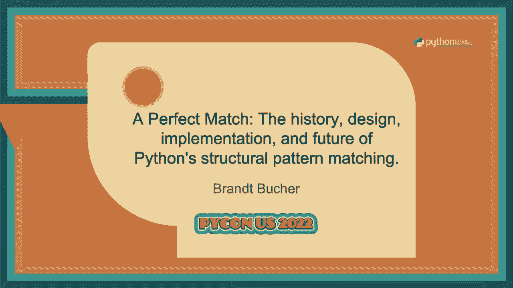
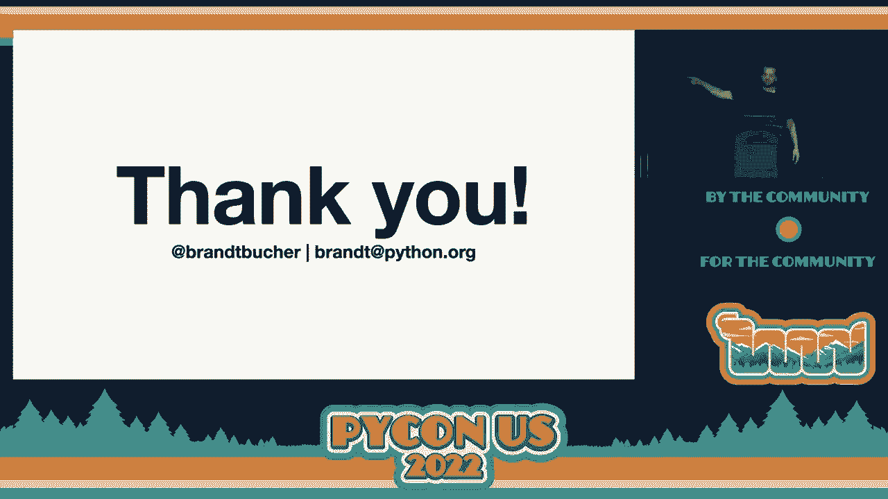

# PyCon US 2022 - P26：Talk - Brandt Bucher_ A Perfect Match The history, design, implementation, and f - VikingDen7 - BV1f8411Y7cP

 We have a full house today。

 So welcome， thank you so much for being able to join us this morning。 This talk is by our friend。

 Brent Booker， the perfect match， history design， implementation。

 and future of Python's structural pattern matching。 Brent， take it away。 Thank you。 So。

 my name is Brent Booker。 Today I'm going to talk about a Python 3。

10 new structural pattern matching feature。 Before we get started a little bit about me。

 I originally studied computer engineering， in college。 During my last two years。

 I encountered Python and it taught me that I like developing software。

 a lot more than I like developing hardware。 So I quickly became involved in Python core development。

 I've been a core developer for almost two years now。

 And I'm currently working at Microsoft as part of the Faster C Python team。

 The biggest project that I've worked on as a Python core developer has been implementing。

 and co-authoring the structural pattern matching proposal that we've talked about today。

 And a lot of the work that I did on this proposal was also while I was working at Research。

 affiliates in Newport Beach， California。 So I think both these companies are actually going to be boothing at the job fair。

 You should check them both out。 So I'm going to start with the history of the match statement as it relates to Python。

 So this feature probably began the way I imagined most new Python feature starting， which is。

 a nerd sniping email from Gito Van Rossum on a Wednesday morning during COVID where he。

 said something to the effect of a lot of people want to add a match statement to Python。

 Do you want to help figure out what that would look like？ And I thought， yeah， that sounds awesome。

 I'm stuck at home and locked down and I need a good project。 This seems like a good project。

 So eventually that work became PEP 622。 And it was early summer at this point where targeting Python 3。

10 and we had gotten four， other authors by this point。 And this PEP was a monster。 It was huge。

 It didn't really have a clear audience。 It included a bunch of features and kind of bolted on additions to the feature that just。

 sort of bloated the proposal and made it harder to actually figure out what was important。

 and wasn't。 And so the steering council read it diligently and came back to us and said， hey。

 you know， what， can you actually rewrite this thing because this is a very big decision for us。

 to make and you're not making it very easy for us to make it。 So we did。

 We rewrote it as PEP 634 and we split it up into three new PEPs。

 And this was great because it allowed us to present the proposal for three different。

 intended audiences。 And so each different person who had curiosities about what exactly we were proposing had different。

 places where they could find it。 So it was a fall at this point。 We still targeted Python 3。10。

 But now the three proposals were as follows。 We had PEP 634。

 which is a very dry specification of the feature。 I don't recommend reading it。

 It's mostly just for maintainers like me who are actually implementing the thing。 We had PEP 635。

 which was intentionally written for the steering council。

 So this basically explained why we felt the feature deserved to be added to the language。

 and backed up each of the different design decisions that we made along the way。 And then finally。

 we have the most important PEP in my opinion， PEP 636。 If you take nothing else away from this talk。

 it's to read PEP 636。 It's awesome。 It's a really in-depth tutorial of how to use pattern matching in your own code。

 It's better than anything I could present to you today。 Check it out。 It's great。

 You basically write a text adventure game using pattern matching。

 One other thing that I want to highlight from this period was our use of a dedicated。

 repository to facilitate collaboration on this project。 So it's on GitHub。 It's public。

 It's still available。 It's GitHub account， G Van Rossum/patma， that's short for pattern matching。

 And this was great because it gave us a few things。

 It gave us an issue tracker where we could basically track all of the different parts。

 of the feature and bugs in the implementation， et cetera， in real time。 So what we wanted to accept。

 what we had rejected， and what we're still figuring out。

 It also gave us a collaborative environment。 So this was a place where we could work on draft PEPs。

 have early prototype implementations， and we even had several medium sized apps that extensively used pattern matching。

 So each time we changed the syntax or added or removed a feature， we're able to see whether。

 that made pattern matching easier to use， harder to use， et cetera。 And finally。

 and most importantly， it was a source of information that is searchable。

 So if you're curious why we made a decision that we made， or what alternatives we considered。

 or why we didn't include a specific feature， all the conversations that led to it。

 Every single decision we made are there， and they're well tagged， they're well titled。

 they're very searchable。 And you can see how we went back and forth on different proposals。

 how the authors might， have been split at different points， what steering council's input was。

 So this was huge， and I used it when preparing this talk today just because all that information。

 is very valuable， and it's nice to have it there all in one place。 Okay， so that's the history。

 Obviously， the proposal was eventually accepted， yay。 It's in Python 310， you can go to Python。org。

 download it now with the big yellow download， button。 So let's talk a little bit about the design。

 I feel like a lot of people introducing structural pattern matching have oversimplified it to。

 the point of sort of defeating the purpose of the proposal itself。

 So my goal is to kind of reset your expectations for what pattern matching is， and hopefully。

 set you up for success in using it in your own code。 So what is structural pattern matching？

 I bet that's a lot of the reason why many of you are here today。

 I'm going to start by saying what structural pattern matching is not， by quoting myself。

 Structural pattern matching is not a switch statement。 I'm going to say it a second time。

 Structural pattern matching is not a switch statement。 It looks a lot like a switch statement。

 It behaves sometimes like a switch statement， but ultimately it's a lot more powerful than。

 a switch statement。 And I feel that you're doing yourself a disservice if you try to use it like a switch statement。

 You won't be able to harness its full power and you'll be frustrated when it doesn't behave。

 the way you expect it to。 So my goal today is to basically convince you that structural pattern matching is more。

 than a switch statement and then it deserves a place in your code base。

 So if it's not a switch statement， then what is it？ Well。

 it combines two ideas that we're all already very， very familiar with。

 The first is control flow and the second is destructuring。 So I'm going to go through each of these。

 Control flow is basically just branching。 We do this all the time。

 So here we're branching based on the value of an object， whether it's equal to the string， spam。

 the string eggs， or something else。 But we can also branch on what can more abstractly be called the shape of our subject。

 So instead of its exact value， we may actually care about the length of a sequence or mapping。

 for example。 These are all valid ways of branching based on the shape of our data。

 So that's control flow。 What's destructuring？ Well。

 destructuring is taking structured data and pulling it apart。 So in this example。

 we're using iterable unpacking。 But there are other ways of destructuring data that we do every day。

 You may access elements in a sequence。 You could access key value pairs in a mapping。

 You can even access arbitrary attributes of arbitrary objects。

 These are all ways of getting at contained data and actually making it more usable in。

 your own code。 So what structural pattern matching is asking is， well。

 what if we can branch while we de-structure？ What if we can de-structure while we branch？

 And the answer to that question is really a very powerful declarative programming style。

 that creates a new way of viewing a lot of the same problems that we've been struggling。

 with for a very long time。 So you may have noticed I've gotten about a third of the way into this talk and I haven't。

 actually shown you a match statement yet。 I'm going to fix that。 Here is a match statement。

 It's one of the more simple examples。 It looks like this。

 It's just the word match followed by any expression。 In this case， it's the name meal。

 And it's followed by one or more cases that are tied top to bottom。 In this case。

 we only have one case。 So the cases look like the word case followed by a pattern。

 And I really want to emphasize this。 Entre comma side here is a pattern， not an expression。

 So rather than building a tuple of length two， we're telling Python how we want to pull。

 apart a sequence of length two if it encounters one， sort of like the left-hand side of an。

 equal sign。 So to clarify this a little bit more， I'm going to put the equivalent Python 3。9 code。

 side by side with each of these examples。 So you can see here that this is matching any sequence of length two and then binding。

 the first element to Entre and the second element to side。 So this is the sequence pattern。

 And inside it has two capture patterns。 Entre inside are capture patterns。

 And patterns can be nested arbitrarily。 So you can see here the capture patterns。

 That was the end of my sentence。 I just started talking。 Just like interval unpacking。

 there are a few different equivalent forms for this。 So we saw it un-print the size。

 It can also be parenthesized。 Or you can use a square brackets。 All of these forms are equivalent。

 So that's capture patterns and sequence patterns。 We also have what are called wild card patterns。

 These are similar to capture patterns in that they match anything。

 But they don't actually bind any name。 So here that underscore is a wild card pattern。

 So you just use an underscore。 It behaves like a capture pattern where it matches anything。

 But you're just telling Python that you want to ignore that value。

 So you can see here that we're not actually binding anything from the first element of。

 the sequence there。 We're only actually binding side there。 And wild card patterns， like I said。

 can be put anywhere。 So a common idiom is to include a case at the end that is just a wild card pattern where。

 this matches everything。 So Python's pattern matching is not exhaustive at runtime。

 If you fail to match each of the cases， it'll just continue execution on the next line。

 This is really helpful if you want to raise in that case or assert false or whatever。

 Finally the last pattern that we'll cover today are called value patterns。 So in this case。

 the string spam is a value pattern。 And value patterns just look like atomic literal value。

 So we have a string here， but we also support byte strings， integers， floats， complex numbers。

 bullions， none。 And these basically just match based on equality。

 So here we're expressing a fairly complex condition。

 What we're saying is we want MEL to be a sequence of length two where the first element。

 is equal to the string spam。 And if that is the case。

 bind the second element aside and execute the corresponding case block， below it。

 And that would just be a list of statements sort of like you would find an if。

 Those are the only patterns that I'll cover today because it's kind of a good building。

 block for examples that will come later。 But one thing that I do want to clarify is that there are many more patterns。

 And I'm actually not showing you the most powerful and exciting ones。

 I will give you a little taste though， but again， read page 636 if you actually want to。

 learn about all these things。 But just to kind of peak your interest。

 we also have OR patterns which allow you to match， one of several alternatives。

 We have guards which allow you to attach arbitrarily complex expressions to your patterns as part。

 of the matching logic。 We have mapping patterns so that you can destructure arbitrary mappings that have the required。

 values。 These are especially useful when combined with sequence patterns so that you can。

 for example， parse JSON or other nested data structures。 And finally。

 my favorite and the most exciting are what are called class patterns。 So these are really cool。

 What I have here is a meal class pattern with two contained food class patterns。

 And what these do is they will match instances of a meal class with two instances of food。

 classes contained within。 So this isn't actually building any instances。

 It's telling Python how to pull apart these classes if we encounter them。

 So this just compiles to a bunch of is instance checks and attribute accesses。

 Another thing that you get here for free is really powerful runtime type parameterization。

 So there's a lot of exciting opportunities that you can use this in。

 This is awesome to use if you are writing AST traversals， for example。

 The big aha moment for me with pattern matching was when I was writing a red black tree， a。

 self-balancing binary tree。 That's a structure that I've never really fully understood。 I mean。

 I've implemented it before but never really got how it worked。

 Using a red black tree whether it's insertion， rebalancing， verification， deletion， using。

 structural pattern matching and specifically class patterns really， really clarifies how。

 the logic works。 Because you get to see the shape of the data that you're working with and the different。

 pieces that you're using as you're rearranging them。

 So those are all the different types of patterns。 One thing that I really want to highlight about this is that we didn't invent really。

 any of this。 Natural pattern matching has been around in mostly functional programming languages for。

 something like 50 years now， probably more。 So we had tons of prior art to draw upon。

 And to highlight that， I have an example here。 This is just a recursive factorial function。

 It has a parameter n。 If n is 0 or 1， we return 1， otherwise we return the recursive factorial。

 And I just want to put this side by side with two other modern examples of pattern matching。

 in Rust and Scala。 If I reformat the Rust and Scala examples to match Python's indentation style。

 it's very， clear where our inspiration came from here。

 One thing that was important to us is that people who have used pattern matching in other。

 languages find it natural to use in Python。 And that people who are using pattern matching in Python are well prepared to use it in other。

 programming languages as well。 But with that said。

 I think we can all agree that the example on the far right looks and， feels the most like Python。

 which was equally important to us。 So next， I'm going to talk a little bit about the implementation。

 I spent something like nine months working on this while in lockdown。 So I'm going to talk about it。

 The first thing， and my favorite part of the implementation， I actually don't get to take。

 credit for this。 It's called soft keywords。 You may be hearing this talk and saying， "Well， brand。

 this whole pattern matching thing sounds， really cool。

 But I have a bunch of existing code that uses match in case as identifiers。

 This is going to break my code， just upgrading to 311。"， And the answer is， "No。"。

 So that's what soft keywords are。 I have an example here that uses match in case as identifiers。

 And this is actually a really good example of code that can be refactored using pattern， matching。

 So this is what that looks like。 It looks a little weird， but it does work。

 You can see we're using match as a keyword in blue， in case as a keyword in blue， and。

 matching case as identifiers。 Python's parser， since 3。9。

 has actually been powerful enough to detect based on context。

 whether you meant to use it as a keyword or as an identifier， since it's never actually， ambiguous。

 And this was really important to us because even though this is a big new change with a。

 whole lot of surface area， we were actually able to completely preserve backward compatibility。

 which was something that was super important and we're glad that we were able to do that。 All right。

 so next， I'm going to talk about the structural pattern matching compiler， or。

 since that's a little wordy I like to call it the spam compiler。 Just a warning。

 I'm going to show you some bytecode disassemblies。 It is not important for using the feature。

 I think it's interesting。 You might think it's interesting too。

 I think it makes some good points about the value of native syntax features， but you could。

 skip the next two minutes of the talk and you wouldn't actually miss anything。

 So this is the same Python 3。10 match statement that I've been showing a couple of times now。

 Before I show you what Python does when it runs this， I want to show you， for context。

 what the equivalent Python 3。9 code does when you actually run it。

 So this is the compiled bytecode output。 And as many of us know。

 C Python uses a stack-based virtual machine， so I'm going to show the， stack there on the far right。

 So we execute this code， we start by loading three names。 Is instance， meal， and sequence。

 We call is instance on meal and sequence， and assuming that's true， we continue execution。

 Then we load two more names， Len and meal。 We call Len on meal。

 Load the constant to compare them for equality。 Assuming that that is true， then we have a match。

 So we load meal a third time， unpack it into two elements， store the first element as on， tray。

 and the second element as side。 Okay， not too bad。 There's a little redundant work happening there。

 but for the most part， it just clearly， follows from the code that you've sort of prescribed here on the left。

 Compare this to the code emitted for the match statement。

 People in the back will probably realize it's a fair bit shorter。

 The people in the front will probably realize that we got into a couple of new opcodes here。

 that are purpose-built for pattern matching。 So this starts in much the same way we load the name meal。

 Next， we execute a new opcode， match sequence。 This is really cool。

 It does the same instance check that we saw on the Python 3。9 code。

 But thanks to some work by my colleague Mark Shannon， this is actually about as fast as。

 you can perform that check。 It's basically reduced to a quick flag check on the type at the C level。

 And so you get really， really optimized performance out of this simple opcode versus the equivalent。

 pure Python code。 Assuming that's true， we execute the new get-len opcode， which is similar。

 rather than loading， the len object and going through a chain of calls。

 we actually just query the type directly， for what the length of our sequence is。

 And then the rest of the code is basically the same。 Compare that equal to two。

 unpack the sequence and store names。 And I think this shows the value of actually having this as native syntax。

 So， you know， Python's compiler has an extraordinary knowledge of context when it's compiling this。

 match statement。 It knows exactly what you're looking for and exactly what you're trying to match against。

 And that's important because when we're writing this declarative style of code， we're trusting。

 Python's compiler to generate efficient code for us。

 And so this is the sort of thing that you only get from native syntax。

 You don't get this from transpiled languages that emit Python code or maybe pip installable。

 packages that have context managers and strings to achieve the same effect。

 And so this is a very valuable thing in terms of， you know， trusting the compiler to make。

 the right choices for you。 So finally， I want to talk about the future。

 Everything I'm about to show for the rest of the talk， none of it is actually in any version。

 of Python yet。 I have mostly working implementations that aren't PR ready。 So maybe 3。12。

 We'll see if I find the time。 But the future is faster。

 So one thing that I'm really excited about is improved control flow。

 And I think this is best illustrated by an example。 So I have this match statement here。 Briefly。

 just walking through what it does。 If meal is a two-element sequence where the first element is equal to spam。

 I bind the， second element to side and execute the corresponding case block。

 If meal is a two-element sequence where the first element is equal to the string eggs。

 I bind the second element to side and execute the corresponding case block。 Finally。

 if meal is a two-element sequence， then bind the second element to side and execute。

 the corresponding case block。 Now the design of Python's compiler currently-- or CPython's compiler currently-- makes it。

 so that the way that Python actually executes this code is very similar to the way I verbally。

 described it。 We check whether meal is a sequence three times。

 We check the length of the sequence three times。 We have three separate places where we actually bind the name to side。

 But what you can see is that we're actually only checking if it's a sequence of length。

 two one time that we care about。 And if that's the case。

 then we're obviously going to bind the second element to side。

 And it's only after that that we care whether the first element was spam， eggs， or something， else。

 So this is an exciting optimization opportunity。 And it's more general than just this specific example。

 So to show you the equivalent code here with all the redundant work， all of you， as great。

 Python programmers， will look at that and say， "Brant， you can refactor this to reduce。

 repeated work。"， And it might look something like this。

 This is a really exciting optimization called decision trees。

 And there's lots of prior art and research on this in languages like OCaml。

 Basically the way it works is that you can merge overlapping checks and adjacent patterns。

 It's not too difficult to do。 Python throws couple curve balls your way that make it non-trivial。

 But I do working implementation for this 98% working。 And as I said， it's more general。

 So this can apply to all sorts of patterns as well。

 One other really cool thing that falls out of this decision tree optimization is improved。

 reachability checks。 So again， I'll leave you with one final example。

 Let's say that I have some cutting edge program that tells me if a number is divisible by， 5， 3， 15。

 or none of those。 So this is one possible implementation。 Does anyone see the bug？

 I'll give you a second。 So maybe some of you saw it。 The third case is totally unreachable。

 The first case matches anything divisible by 3。 The second case matches anything divisible by 5。

 Either of those will catch anything that's divisible by 15。

 So this actually isn't that easy to catch in the compiler。

 But when compiling efficient decision trees for these two element sequences， it actually。

 becomes trivial to catch。 And a future version of Python might give you a helpful runtime warning or a syntax warning。

 letting you know that your pattern is unreachable。 And the fix is really simple。

 Since cases are tried from top to bottom， you simply reorder your cases and it works。

 So that's all I have today。 Thank you for coming out here。 There was great hiking in Salt Lake City。

 I didn't realize it was inside the convention center。 So thank you for making the track out here。

 I'm at Brand Quicker on GitHub。 And you can also email me at brandup-pilot。org。

 I was told we're not doing Q&A today， so I'll be right outside that door。

 Feel free to ask me any questions or yell at me if we're ruining your language， whatever。

