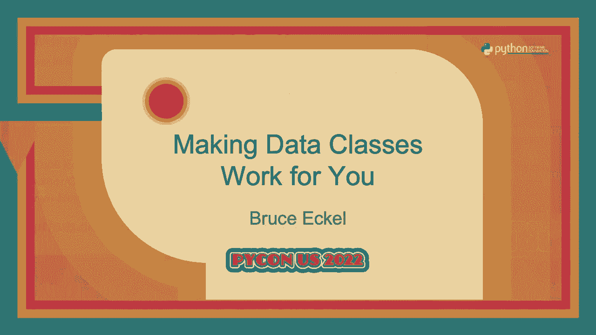
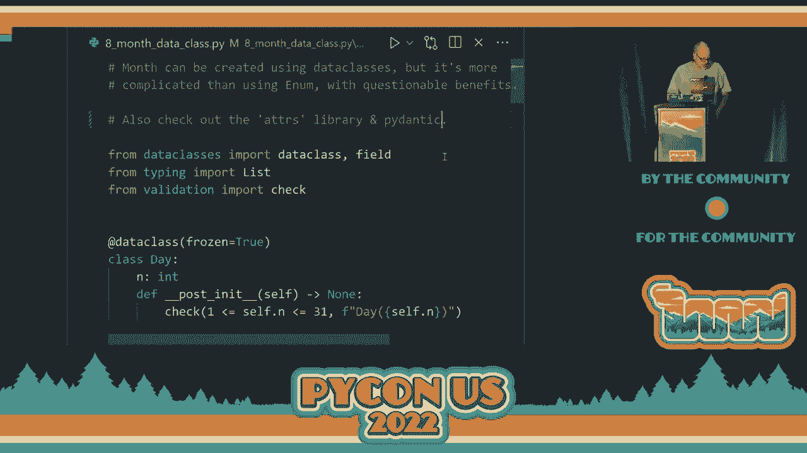

# PyCon US 2022 - P28：Talk - Bruce Eckel_ Making Data Classes Work for You - VikingDen7 - BV1f8411Y7cP

 >> Your ladies and gentlemen， we'll have Mr。 Bruce Ecker giving a presentation on making。

 data classes work for you。 >> Okay。 All right。 Sounds like it's working。

 So all of the -- this is really examples。 And all the examples are on the GitHub repo。

 So it's my repo and look for data classes as types。 Should be easy to find even if you forget it。

 And this started from -- I do a podcast with my friend James Ward and we interviewed somebody。

 who had created a -- they called it Smart Types Library for Scala and something just kind。

 of clicked。 I've been studying functional programming a lot in the last few years and something just。

 kind of came together and I'm hoping that that happens for you during this presentation。

 So I'm going to start with normally if your type doesn't -- if your type is incorrect。

 you should throw an exception。 But I want to show all of the errors and so I created this little function that checks the。

 expression and it has a couple of error messages。 The second one is usually out of range。

 That's why I separated it。 Normally you would use an assert to check things and throw an exception but I want to see。

 all of the errors that happen in the example。 So I wrote this。

 Not terribly important but you need to see what it was。 And let's make this bigger。 Okay。

 So suppose we have a very simple system where we want to do some kind of customer feedback。

 So we're going to have a thing called stars and the value should be between one and ten。

 And you know how customer feedback systems work。 You can never actually give it zero stars。

 So it will be one to ten and typical way we do this is just by using an int。

 And so the -- an int is a type that has a value between minus very big number to plus。

 very big number。 And we want to make this -- we want to adapt it to use for our stars so that it's between。

 one and ten。 And what this means what we typically do is we say， okay。

 every time I use this if you're， going to do it right。

 I need to check the argument to make sure that it's actually between， one and ten。

 So my stars are correct。 And so I do that there and then this other function where I use everywhere you use it。

 You need to check that it's correct。 Now some of you might be looking at this going， oh。

 but you're returning stars plus， five。 So what if you start out with stars that's ten。

 then you're going to return something that's， fifteen。 Well。

 we can only say that we're returning an int because， well， that's all we have in this， situation。

 So we don't really know that we're returning a stars object in this case。

 We're just returning an int。 So maybe it's okay that stars plus five or stars times five is okay。

 Maybe that's fine。 I don't know。 But if we do want it to be a proper star。

 then we've got a problem there too。 So this really isn't a very satisfying solution。

 Plus any time I had a new function or if I were to change something about stars， I'd。

 have to go back here and make sure that every place that I did a check， it would， you know。

 I'd have to change it。 So we got this stuff distributed all over the place。

 Let's see if we can look at this a little different way。 Let's， what's the problem？

 How do we solve this problem traditionally？ Well now traditionally。

 This is one of the things that objects were supposed to solve for us。 And the key was encapsulation。

 So the idea is that here in my constructor， first of all， in Python by tradition， we say。

 if it's preceded by an underscore， that means it's private。

 You can actually go in there and look at it but， and modify it if you want to。

 But that's what we call private。 So we'll make it private and then further down here we're going to set。

 use the property， decorator to allow you to read it。 But since there's no writer。

 then you can only read it。 So pretty good。 We've encapsulated it。

 we've hidden it inside of the class and everywhere， each of the methods， that I use。

 I need to perform， well when I go into it， I need to perform some kind of。

 precondition check which is in this case the number of stars that you pass me， still an， int。

 I'll check with my condition function to make sure that that's not too big。

 And then I'll perform some sort of internal operation and then I'll do a post-condition。

 check to make sure that I haven't messed anything up。

 And I need to do that every method that I have for my class。

 And the condition is simply using my check to， if you pass an argument， then it checks。

 the argument and if you don't pass in an argument it checks self。underscore number， the local。

 number value。 Alright， well this was the promise of object-oriented programming that we would have this encapsulation。

 and we keep everything safe and at the time that I got started in it， which is when it。

 was really starting to show up， seemed like a great idea， seemed like a much better idea。

 than what we had before with plain old functions。 But this still looks pretty messy and it doesn't seem great。

 Down here I'm just showing that because I didn't have a setter， it prevents mutation。

 and you get an attribute error。 And it's a lot of work。 And if I were to add another method。

 I'd have to make sure or if somebody else comes along。

 and adds another method they would have to know what to do to make sure that they did。

 the proper precondition and post-condition checks。 So it's not terribly satisfying。

 So let's look at another approach which is data classes。 So the idea of a data class is。

 and this is， I've actually lost track of when this was， added to Python。 Thank you。 3。

7 was added in 3。7 and basically what you're able to do is define these class properties。

 So this is a property of the class and then the data class， I want to call it decorator。

 but that's not the right thing。 We do column decorators。 Okay。

 because I know too many languages and I get the terminologies mixed up。

 So the data class decorator then takes this information and manufactures this class for。

 you which has a number of attributes。 Including it takes these properties。

 these class properties and creates a constructor， based on those that uses those in the order in which you define them and you need the。

 type annotations in order for it to know what to do with them。

 And so it creates a constructor that you can call。

 Don't have to give it the arguments names but you can。

 And each of the fields now has the same property in the object。 So you can access name， number。

 depth and then， oh， I had a default argument here。 So， and here's where I call the default。

 use the default argument。 It creates a dunder EQ so you can compare one of these messenger objects with another。

 There's a replace function that allows you to take an existing object and make a new。

 object with one or more of the properties given different values。 It's in arc， well。

 when you're looking at things in terms of functional programming， you get。

 into this immutability idea and the more you use it， the more you like it。

 So we'll look at that a little later。 These are still by default mutable。

 So one of the things that that means is that I can't use it as a key in a dictionary and。

 if I try to do that， it'll tell me it's unhashable。

 And the reason it's unhashable is because all of the properties are mutable and it builds。

 the hash key， the way that it indexes into the dictionary。

 It builds the hash key using all of those properties。 And so if they're mutable。

 that means you could put the hash key in， you could modify。

 the properties and then when you're looking something up， it would generate a different， hash key。

 And so you wouldn't be able to find the thing。 So it just prevents this is standard with any kind of hashing system across all languages。

 If it's mutable， that's kind of a bad idea。 All right。

 So there is one more thing we'd like to add here which is data classes have this option。

 that allows you to say that the objects are frozen。

 So what this means is that the constructor that it generates will make all of these properties。

 immutable。 Well， I mean technically， it's Python， you can always mush things around。

 But if you try to modify these things， you will get a frozen instance error。 It will tell you that。

 oh， you can't do that because you said that this was supposed to， be frozen。

 So now we've got something where， and this is much closer to what you do in functional。

 programming and we'll see the benefits of that in a second。

 And so one of the things that we see is that we're able to use the object as a key for。

 our hash table because if it's immutable， then it'll automatically create the dunder hash， function。

 And so it's happy with that。 So we can use it as a key in a dictionary and here we look it up。

 All right。 So in functional programming， well， one of the things that I was confused by for a long。

 time is a phrase that I heard， I don't know， it's probably Luca Cardelli or somebody， one。

 of the early type people say that a class is not a type。 I didn't really know what that meant。

 but in functional programming， they talk about， this a lot。

 And the phrase that you will sometimes hear is that a type is a set of values and that。

 is much easier for me to think about。 It's just some way to define a finite set of values。

 And one of the things that you try and do， well， a couple of things you do in functional。

 programming， one is that you make everything immutable so that you don't have to think。

 about protecting that data。 It's protected by default because you can't change it。

 And so it simplifies everything。 You don't have to have this cluster of methods around your data to protect it。

 You say， here's my data。 You can't change it so you can read it， but you can't modify it。

 Everything's safe。 The other thing that you want to do with types typically is to make impossible values。

 unrepresentable。 So in our case with the stars example。

 what we want to do is the impossible values are， anything except for the values between 1 and 10。

 And so we'll start out by saying， all right， here's my stars class and it's a data class， immutable。

 here's the number of stars。 And then the other thing that you get with data classes is this dunder post init function。

 Because the data class takes your information and it generates the constructor for you。

 And so there would probably be some way to go and muck about with a constructor。

 But it's much easier to say， all right， automate the constructor。 And then once it's done。

 I'll run this function post init and I'll check the values。

 That's typically what you're doing with post init。 You might be able to do something else with it。

 But the intent of it was so you can check the results of this object that you've just， constructed。

 And so here's the one place now where I do my check to make sure it's within the range。

 1 through 10。 And now when I have my functions that operate on the stars objects。

 notice they're no longer， methods。 Those they could be。

 but it's just a lot easier to think about them as standalone functions。

 that accept stars objects and return stars objects。

 Now I don't have to worry about testing before or after I modify them or any of that stuff。

 That's all taken care of because the only kind of stars objects you can even create are。

 the correct ones。 So and also notice that here I actually am returning a star's object。

 And so it's clear when you read it that， oh yeah， whereas before I was returning an int。

 I could be a star， could be a not。 Here it's very clear that I'm returning a star's object and when I perform this operation here。

 if it goes out of range， the constructor， well， the construction process， including the。

 post-init automatically discovers if I've done something wrong。

 And so what I want to point out here is how much simpler and clearer this is because here。

 in the stars class， I define exactly what it is and I can't create any of these objects。

 that are incorrect。 And so for the rest of the program， I don't even have to think about it。

 And that's kind of the aha moment that I want to initially get you to say， oh， I should do。

 it this way。 This is going to make my life much， much easier and it's going to reduce all kinds of errors。

 now。 And if anybody uses my star's object later， if I decided to change the top number to five。

 instead of ten， everything is going to be fine。 Or at least if there are problems they're going to be discovered immediately。

 I don't， have to go through my code looking for all these tests。 All right。

 So now let's look at the next thing that we try and do in functional programming which。

 is composing things together。 So we have all these small pieces that work well and then we want to be able to put them。

 together。 And what I'm going to compose here is a data class made from other data classes。

 So this will be ultimately what we want to do is create a person。

 And the person is going to contain a full name， a date of birth， and an email address。

 So might as well make those into data classes as well。

 So the full name has some-- so the post in it now is going to be checking the validity。

 of the name after it's been initialized。 And one of the tests I'm going to do is to make sure that there are two names。

 And so I split it and if it's greater than-- let's see。 If it is-- yeah。

 it should be greater than one。 And if it is not， if there's only one name then it says， "Oh。

 you have to have two names。"， And you'd want to do all kinds of other things there。

 But you can do that all in this one place where you're talking about the name。

 And then once it's created then you don't have to worry about it being used any other， place。

 The second place is the birth date。 And for the others of these。

 I'm just going to show some sort of checking is taking place。

 We'll actually look at birth date in a second。 And then the email address does some sort of checking。

 And now we can compose a new data class from the existing data classes。

 And you'll note that the constructor that it creates requires you to pass the name and。

 the birth date and the email address in。 So it's very clear and readable what you get。

 And then-- so if we go ahead and print that， you can see it performs the checking as part。

 of this person constructor。 It calls the constructors for all of the individual parts。

 And then it displays-- and this is one thing I didn't mention before that the data class。

 also generates a nice dunder str for you so that it produces something you'd have to。

 do yourself normally， creating a new class to make a readable string output。

 And so you can see this produces that for you as well。 All right。

 so now I sort of waved my hands over the birth date。

 But that's kind of an interesting one to delve into a little bit more。

 And so let's look at-- so the thing is what we want to look at is the value of using these。

 types and data classes are really great but enums are also a way to define a type because。

 with enums you have a set of values。 You have a finite set of values。 It's defined at-- well。

 compile time。 I mean， it's there before whereas the data classes we've seen are actually created at。

 runtime whereas enums are created at compile time。

 And one of the benefits of that is that your IDE can use that to do completion or whatever。

 If you've got an enum and it can tell you here are the options and you can just select。

 for them and other more sophisticated things are possible。 So let's look at the building a date。

 And so we're going to have-- we're going to follow this pattern with frozen data classes。

 We've got a day and it has the day number and we're going to check。

 We're going to do a basic check which obviously isn't thorough enough。

 But just for starters we're going to say this day has got to be between 1 and 31。 All right。

 The year we'll say all right this is somebody's birth date so probably nobody's alive before。

 1900 and definitely not no birth dates after 2022。 So that'll be our post in that check。

 And now for the month we'll use any num。 And so this allows me to have names for all the months。

 And again， can't remember when this feature was added but you can assign each enum value。

 to an object。 And it might have been 310。 In this case the object is just going to be a tuple。

 And the number is the month number that we traditionally use。

 And then over here we have the days of how many days can be in that month。

 And so one of the things we can do is we've got a static method here and I can say give， me month。

 month number。 And of course it has to make sure that that month number is within range。

 And if it is it goes ahead and produces the object associated with that number。

 And here is where we're solving the day of the month problem。

 So if I have a month and I have a day I can pass the day into the month and it says okay。

 what's the number of that day and then I'll index into the tuple for that month and make。

 sure that it's less than or equal to that。 So now we can guarantee that the days of the month are proper。

 And so now I can do this composition thing again where I take the birth date and I've。

 got the month， the day， the year and those will do whatever checks they need to do as。

 that is being created。 And then in the post and knit check all I need to do is take the day and pass it into。

 check day for my month。 And it automatically checks to make sure that the day is within range。 Okay。

 so that's pretty cool。 And now I've got a set of these and it'll go through and validate all of them。

 So my birth date apparently is okay。 And then we've got a bunch of things that check and discover that oh these things are。

 out of range gives me all that information that they're all out of range。 And so it's， I don't know。

 I was quite delighted to discover this。 And also I did some tests because initially I think I just found somebody's example where。

 they used a tuple and I said oh you can use tuples but then I did a test to find out that。

 oh yeah you can assign it to any object at all which of course why wouldn't you be able， to？

 It's Python。 All right。 So the month， so I used for the months I used an e and the month can also be used。

 be created， using data classes but it's a lot more complicated than just using any num。

 And that's really the point of this example。 And remember all these examples are on the GitHub repository so you can just look through。

 them and they're exactly what you're seeing here。 And so I could do the same thing that I did before and then I could actually use the data。

 class， frozen data class for a month and you can see it's significantly messier and harder。

 to follow。 So that's a good thing to know。 Like when you have a finite number of elements if you can put them in an enum that'll probably。

 be much better than using the data class approach。

 If you have a lot of elements or you only need to create some of them then the data。

 class approach is going to probably be better。 Yeah。

 So the point of this was just to show that it works but that it's messier and less maintainable。

 All right。 So I think， yep that's everything。 All right， so I did get through。

 We have five minutes left but I guess we can't do questions。 Is that correct？ We can do questions？

 We can do questions this time。 All right。 So I've got five minutes for questions。

 Are there any questions？ Yes。 So is the question， can you take an existing class and freeze it？ Oh。

 Can you freeze individual fields？ I didn't encounter that so I can't really say， I mean。

 maybe but I didn't encounter that。 So I'm guessing probably not。 Oh， we have an expert。 No。

 Other questions？ You can， oh so you can individually make them read only properties like I did in the。

 normal class example。 But you do that by hand， yeah。 Yes。 [inaudible]， Okay。 [inaudible]， Okay。

 [inaudible]， The observation was that I did not have any questions。 [inaudible]。

 The observation was that I did not account for leap years but there might be some clever。

 way to do it。 Yes。 That's a good point。 Yeah。 Somebody else is going to notice that too。

 Anything else？ Yes。 [inaudible]， Does it check the what？ [inaudible]， Okay。

 You guys understood the question better than I did。 [inaudible]， Okay。

 You guys understood the question better than I did。 [inaudible]， Okay。 Yeah。

 Person is simply calling the constructors for the base types。 For the composed types I should say。

 Okay。 All right。 Okay。 Oh wait。 No。 We have one here。 [inaudible]， I'm not。

 But I mean I've heard about them more mostly just recently。 So I didn't。 [inaudible]， Yes。 Yeah。

 Another thing is this Adors library that， yeah， so I should probably say Adors and， and， I can't。

 Yeah。 So yeah。 Yeah。 I mean there's a lot of work going on but once you see the benefit of doing it this way。

 you can see why other people are working on making it better。 All right。 I think we're done。 Yes。

 [inaudible]， Thank you。 [applause]。

 (applause)。