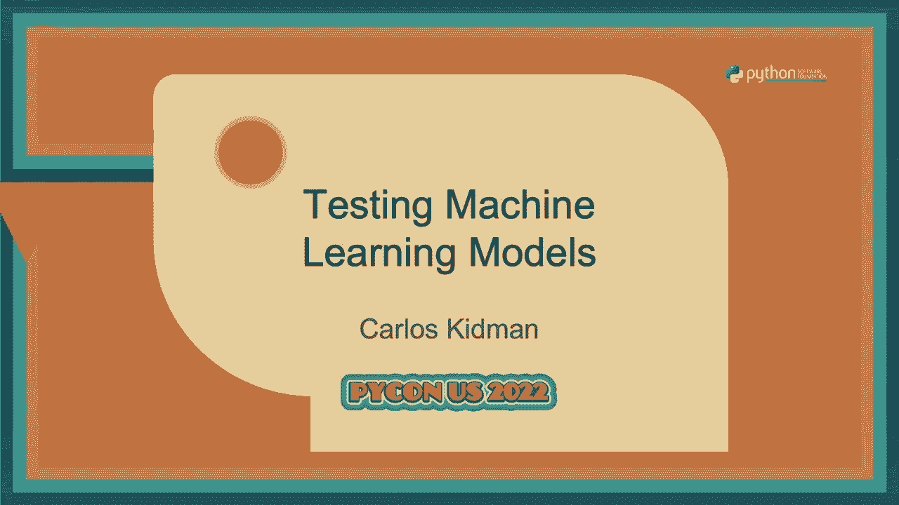
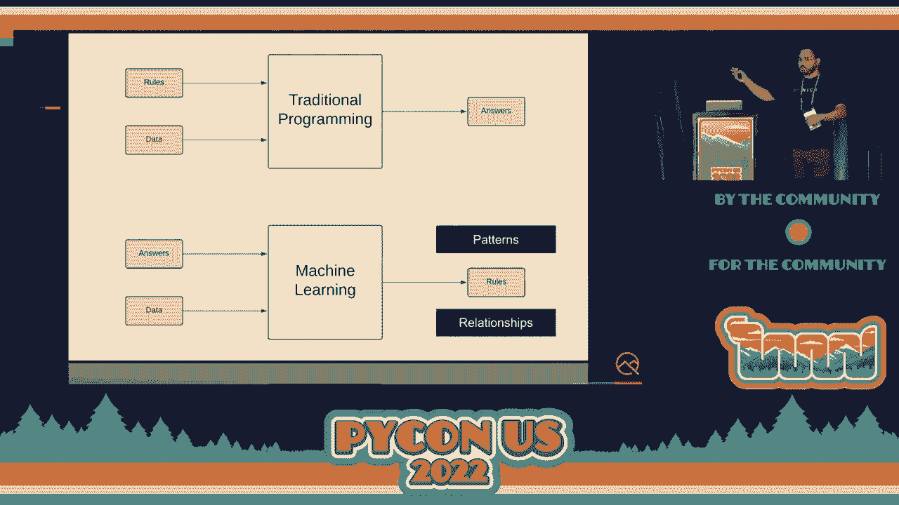
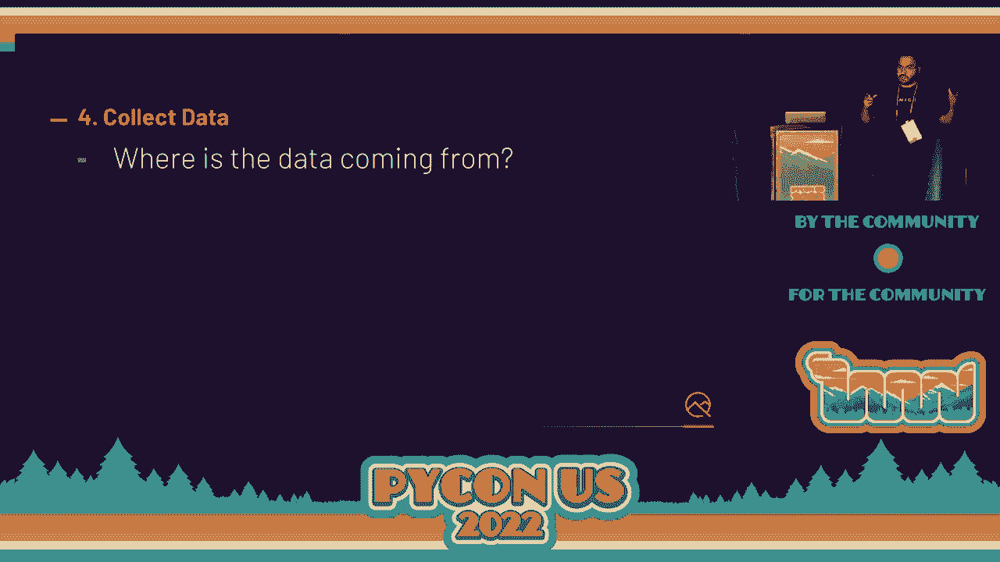
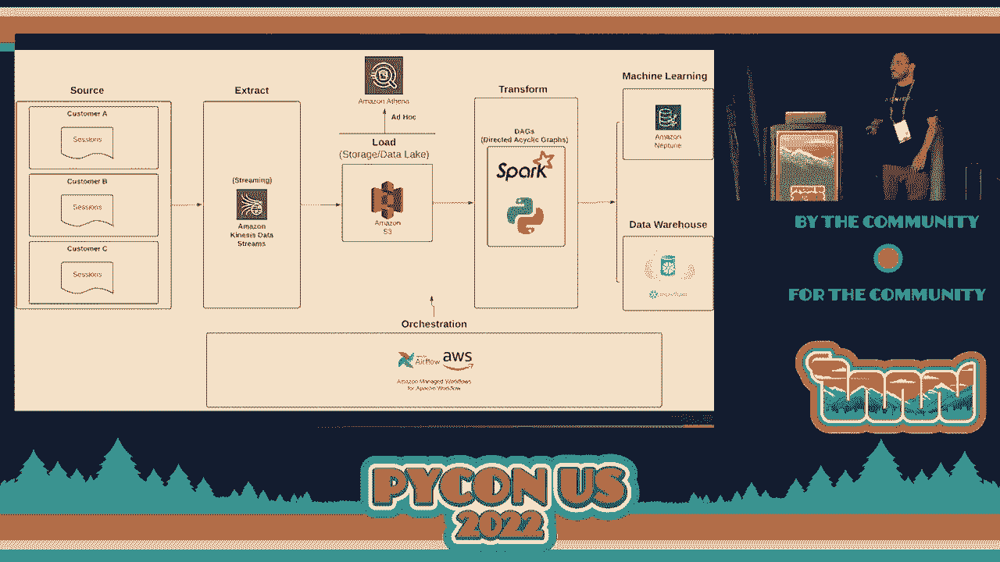
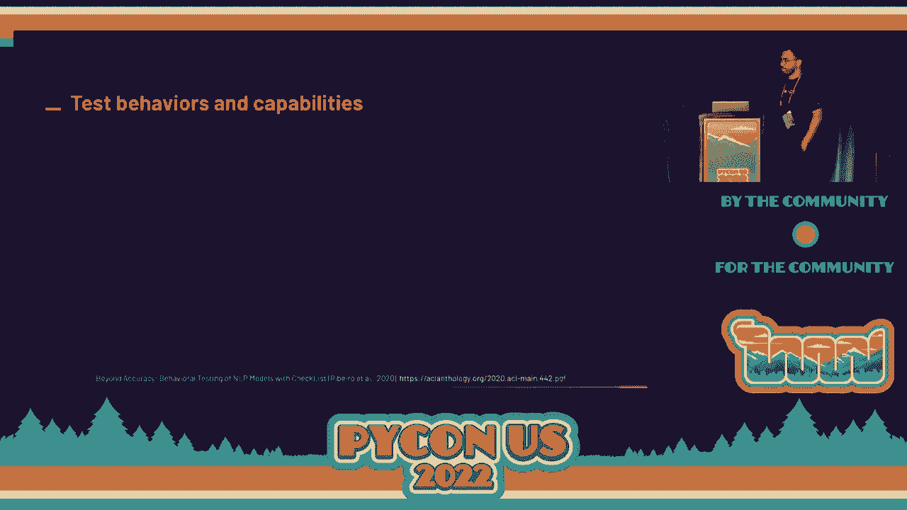
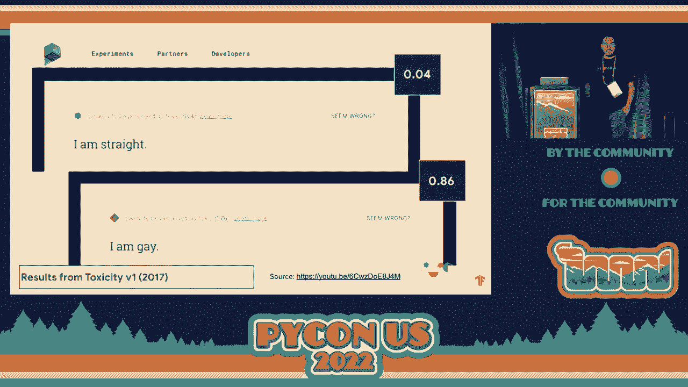

# PyCon US 2022 - P30：Talk - Carlos Kidman_ Testing Machine Learning Models - VikingDen7 - BV1f8411Y7cP

 Hello everyone。 Today we have the pleasure of having Mr。 Kidman present a paper on testing。

 machine learning models。 Echo， echo， echo。 Yes， yes， yes。 Fantastic。 Alright， well。

 thank you everyone for coming。 Testing and quality of ML systems。

 That's what I'm going to be talking about。 Just like， they said， my name is Carlos Kidman。

 A few things about me really fast。 I'm the head， of engineering at an AI company right now。

 Before this， I was an engineering manager， at Adobe around an organization called Automation and Productivity Engineering。

 We use machine， learning there as well。 I do lots of stuff with open source。

 including my own projects。 The one I'm most known for is Pylenium。

 which is just a simple wrap around Selenium and， PyTest。

 I do lots of keynote speaking all over the world。 This is my first PyCon。 Yes。

 I'm so excited to get PyCon。 I also have a stream on Twitch once or twice a week， depending。

 on how I feel， and then I have a YouTube channel。 My most exciting one I feel is that。

 I'm the founder of QAP or QA at the point， which is the software testing and quality。

 community here in Utah。 Yes， Utah based for anyone else。 If you are a tester and you're， in Utah。

 you should be part of this community because it's pretty amazing。 Going right， into it。

 I feel like when it comes to software testing and quality and traditional software， development。

 it's a pretty common topic。 You have software testers， you have people that。

 are in the testing space like SREs， stuff like that。 When it comes to machine learning and， AI。

 it's as if it's a new field。 It feels like there's not a whole lot that happens in， that space。

 This is what got me really interested in。 How do we monitor？ How do we measure？ How。

 do we test and measure the quality of these ML systems that we're building？ Now that I've。

 been in the space for about five years now and I'm building these models， they've definitely。

 gotten better from when we first started， even just five years ago， and some people have。

 been doing it way longer than I have。 Like I said， testing is relatively new to this space。

 Tools in Jacqueline back in 2019， they learned at Google that if they didn't do software。

 testing early and often， they ran into a lot of problems once they deployed their models。

 into production， once they deployed these systems。 In their talk here at Google I/O， they。

 talked about here some of the things that we learned， here are some things that we do。

 now and we try to bring in software testing as early as possible。 To make sure they're。

 all on the same page， because I don't really know where everyone is at。 You may be brand。

 new to Python， you may be a machine learning engineer right now。 I don't know。 We're going。

 to go through a very simple exercise here with a very common machine learning application。

 which is prediction。 Jay Allen-Marz did this really well。 He said prediction is predicting。

 values based on patterns and other existing values。 Once we understand this bit a little， bit。

 it'll be like， "Wow， machine learning。" So let's say that we are the machine learning。

 engineers at this grocery store and our job is to predict how much we think customers will。

 spend when they come in。 Let's say we have this as our data set。 A group of one person， comes in。

 they spend $10。 A group of two， they spend 20， before they spend 40。 So if I were， to ask you。

 how much do you think three people will spend， what would you say？ 30， right？

 How did you come up with the answer of 30？ Because we're smart， yes。 You found this magical。

 number of 10， which happens to be the relationship between the numbers in this table。 So if you。

 were to grab three and then multiply it by 10， well very easily 30。 If I said seven， you。

 would say 70 on and on and we go。 Someone said regression， exactly。 This is essentially。

 how machine learning models work。 In this case， this is a supervised learning thing。 But， yes。

 it finds these relationships between the data and that's what it outputs。 Now， in the， top here。

 this is the paradigm of traditional programming where we define the rules put。

 in the data and then we get answers right back out。 So if we had a， let's say we had。

 a function that was called like is even and you passed in the number three， you'll have。

 some rules in there to determine that is either true， it's even or false， it's odd。 So。

 writing unit test for that should be fairly simple， right， assert that if I pass in three。

 I get false， I put in two， I get true。 Machine learning is a little bit different because。

 here you input the answers and the data and the machine learning algorithm determines。

 what the rules are instead。 So the output is going to be different。 So what makes this。

 difficult when it comes to software testing is the fact that it is not guaranteed that。

 the group of three people are going to spend $30。 They might spend 28， they might spend 50。

 they might walk in and then just go to the bathroom and then leave， right， they might。

 spend anything at all。 So because of that， it's difficult to say， well， let me assert。

 that 30 is the case。 Instead， you have these rules that get out， but did you have these， ranges。

 these boundaries， it's different than traditional programming。 But in this case。

 there's different points of fault inside of machine learning system， right。 One of the。

 big ones is obviously the data set。 The data is what drives the entire machine learning， system。

 And so if there's problems inside the data set， you're already going to have。

 issues with what gets out putted。 So software testing can happen really early and later， as well。

 And that's kind of what we're going to be talking about today is the testing and。

 quality of these things。 So in software testing， we have this concept called shift left。 Does。

 anyone want to take a stab at what shift left means？ Move or hire every data stack。 I like。

 that a lot。 Anyone else？ Do it earlier。 I mean， the white text， they're kind of throws， it off。

 right。 But anyway， if you were to take the software development lifecycle， right。

 which is usually a circle diagram and it's like， step one is planning， step two is designed。

 to be implemented and you deploy and all the good stuff。 If you were to take that circle。

 and flatten it out， step one is on the left。 Step one is on the left。 And step， the last。

 step is on the right。 When we talk about shift left， we're talking about trying to bring。

 a lot of these quality and software testing practices as early in the process as we possibly， can。

 And a lot of companies， they will do all of their development right in the middle。

 And usually you'll get， you get requirements from UX or product or business。 You build。

 a thing and then when you're able to deploy， you give someone else， they deploy it， they。

 observe it， they monitor， they operate it， right。 So shift left is talking about how。

 can we include our software testers， our developers， as much of the team as we possibly can， as。

 early in the process。 Because the more you are there in the design of things， the better。

 things will happen downstream。 So let's say we take an example project that we're building。

 a new ML project， right。 And let's kind of go through the process here so we can see what。

 this will look like。 So step one is we wanted to find the problem。 What are we trying to， solve？

 In the previous example with the grocery store， the problem was we want to predict how。

 much people will spend。 That's not a very good problem statement though， because why are。

 we wanting to do that， right。 It could be that for the grocery store， we care about preventing。

 under stocking or over stocking， right。 Especially with perishable like milk or dairy。 If I buy。

 too little of milk and then people come in expecting milk， well now I'm losing money。

 as a business because I don't have any milk for them。 So we overstock， we buy tons of， milk。

 but then we only sell half of our stock。 So then the rest of my stock goes to waste。

 I lose all that money， it's also a problem。 So it could be that we're using machine learning。

 to help prevent the under stocking and over stocking problem。 A much better problem statement。

 than can we tell how many people or can we predict how much money is going to be spent， by people。

 Moving on。 Who is the ML system for？ Again， back in our example here， is this。

 for the people doing stocking at night？ Is this for the store manager？ Is this for the。

 VP of the region？ Is this for who is going to be using this thing？ It could be that the。

 ML system is to feed another ML system， right。 That could be the case as well。 So who is。

 a system ultimately for？ And then of course， does this even need machine learning？ When。

 I first started， you better believe I was like， wow， I know how to do a few little simple。

 machine learning things。 Can I apply to everything？ And a lot of the time， the answer is yes， but。

 sometimes you don't want to do that， right。 What is even is odd。 Imagine applying machine。

 learning to tell me if three is odd。 Probably not the best example， right。 So moving on。

 Number two is define success and assess risk。 Success， assessment， English is hard。 You。

 want to start by defining initial baselines。 And in doing this， let me go a few more right， here。

 That creative proof of concept is one of the most underrated pieces that teams miss， right now。

 Because it's so easy now to build these machine learning models， right， with。

 things like transformers， for example， you can get to predicting things within a few lines， of code。

 And so you might try those out and say， well， this is good enough to start just， building things。

 When instead， if you build a proof of concept and actually start defining。

 these baselines for what success looks like and what risks you want to avoid or mitigate。

 or prevent， this is going to force you into building something that's a lot more practical。

 rather than the shiny toy that is a transformer， let's say。 We're dealing with a lot of data。

 so of course there's going to be privacy and security risks as well。 Again， another piece。

 that a lot of people don't think about。 And then of course， my favorite， one of my favorite。

 questions here is do we even have the proper resources to do this？ If we were building an。

 ML system that was meant to detect cancer in patients， let's say， me， Carlos Kidman， and。

 the worst possible person to tell you what this thing is working or not。 So even though。

 I may be a software tester by trade， I would suck at testing that system because I myself。

 don't know how to detect cancer even manually， right？ So do we have experts that can help。

 in our team to make sure that we're building the right thing the right way that is actually。

 helping， right？ Another example of the like sentiment analysis， I'd probably want some。

 linguists on my team， for example， so do we have the proper resources？ Number three is。

 design initial architecture， which database or tables are going to pull data from？ What。

 does our ELT process look like？ Is this going to be behind a REST service？ Is it going to。

 be on a mobile device？ It might not have internet if that's the case， right？ How are we going。

 to monitor this， monitor and measure it as we're developing it？ What about when it's inside。

 production？ How are we going to monitor things as well？ Yeah， oh， just keep going because， of time。

 Number four is to collect data。 Where is the data coming from？ This is a little。

 bit different than what I asked before in the database is because this might be our data。

 is coming from recordings at a traffic camera。 This could be we're recording user session。

 data and that's being streamed in。 The different sources you have will also determine how you。

 do a lot of this as well。 Is this different than staging your dev？ Are you just grabbing。

 things from production and cloning it into a staged database？ Or are you doing some different。

 filtering？ How much of it is synthetic versus actual prod data？ Where are we storing the， data？

 Is the data being streamed or batched？ Basically， at the end of the day， what I'm。

 trying to get at is you got to understand the data during that it's going through。 It's。

 not enough to just say， well， as the machine learning engineering team， I just know that。

 Snowflake has all my data in these few tables。 I don't need to know what happens before that。

 All I care about are my tables。 That's enough for me。 Well， it's really hard to do software。

 testing if you're oblivious to what's happening beforehand。 So let's take a simple diagram here。

 This is a very simple ELT process。 On the left， it starts there and then goes to the right。

 We have our sources coming from user sessions。 So customers on a website， they're doing things。

 and kind of like Google Analytics， data is being streamed in。 In this case， we're using。

 Kinesis to stream the data in and loading it into S3。 We're using that as our data lake， let's say。

 From there， we have some DAGs that do transformations and there's different transformations。

 depending on where the data is going to eventually land。 So， for example， we have Neptune and。

 Snowflake and we're putting data in those places。 As software testers， we care about every single。

 one of these steps。 Why？ Because each one of these steps， there's going to be risk in each。

 one of those。 If Kinesis goes down for whatever reason， then everything downstream gets screwed。

 And so we want to make sure that we have not just testing and monitoring place but also。

 fault tolerant practices。 If Kinesis were to hiccup， would we know about that？ Would we。

 be able to automatically get it back up and going again？ That's all part of software quality， right？

 And so we care about these steps to make sure that once everything on the right hand。

 side over here， you can't see it but this is probably where the machine learning stuff， lives。

 right？ That has the best data that possibly can。 But when we say what's good data。

 we have to define those things。 You don't just get good data by writing these theoretical tests。

 that I'm talking about， right？ Number five is then preparing data。 Now we're getting into。

 actual like machine learning stuff， right？ So now you're preparing data。 What shapes is。

 data to be in？ What are the data types？ Are there any missing values or errors？ Basically。

 poop data makes poop models， right？ And this is where a lot of our machine learning engineers。

 the AI， the data scientists， they're doing a lot of testing here already。 So I'm going。

 to go through this really this part pretty quick but already lots of experimentation， lots。

 of testing happens here。 I have data analysts for things like this and data engineers because。

 I am not the best。 But yeah， we have these people because we know that this ML systems。

 the lifeblood is the data。 So we want to have people， you may call them testers but there。

 may be data analysts in your HR tool but they're still testing the data。 Next up we have training。

 validating models。 So we experiment and compare models， capture training validation metrics。

 visualize results， tune weights and parameters and hopefully using tests， exploratory and。

 automated to help you as you're doing this。 One of the， in a previous scene that I had。

 they would do all of their experiments all locally and they would open like a new tab， into VS Code。

 Here's the results and then for the next run they'd open the new tab and， okay。

 here's the new results。 Very manual process and nowadays we have companies and。

 platforms that are building tools specifically to help you kind of track all of your experiments。

 and test results。 So hopefully you can use some automation as well to help out to speed， things up。

 And we'll have some examples here soon。 So I think that here， let me see。 Yep。

 So when I talk about validation， the reason why I call it that is because I want it to。

 be a little bit different than what we refer to as testing。 So validation is how well does。

 the model perform against the data set it's never seen before。 So even though yes this。

 you can call it testing as well because it kind of is， right？ You do like a test training。

 split and whatnot。 I'm calling it validation just so that we don't overload the word test。

 too much because it's pretty overloaded。 So you can think that during training maybe。

 our model has a 95% accuracy。 Wow， so smart， so great。 But then during validation it's 76%。

 accuracy。 So some people would say， well， this looks like a great indication of overfitting。

 because my model knows the training data really， really well。 And yet I'm saying testing is。

 a different thing than this as well。 The only reason I have facial hair is if I can do， this。

 So step number seven is then testing the models。 What behaviors does the model show？

 Does it demonstrate harmful biases？ Does it meet those actual privacy requirements that， we have？

 Is it performance and reliable and performance in this case is， for example， can。

 it have a very large load of users using it at one time？ Can it withstand things like。

 adversarial attacks which is now more about the robustness of the model than anything？

 Does it solve the problems that we set out to solve？ So the understocking， overstocking。

 is it actually solving that problem or not？ Or is it only doing a really good job predicting。

 how much people spend？ And then， of course， do our customers enjoy using our ML system？

 Sometimes they might not even know that they're using it， right？ That might be a good indication。

 about who knows。 But do they enjoy using it？ A lot of people are weary of AI because like。

 a lot of want the machines to do everything and they have， you know， that's some truth， in that。

 So you want to make sure that they can trust your system。 They like using it and。

 they want to keep using it。 Number eight is then deploy the model。 Again， is this going， to be。

 is the model itself going to be behind the rest of GraphQL service？ Is it going to。

 be on a mobile device？ Maybe an airplane， a self-driving car， maybe it's a model to tell。

 you that you need to restock your fridge and buy some more eggs you ran out？ Or maybe。

 it's supposed to give you diagnostic information about a turbine， right？

 Is it a serverless function？ Maybe feeding other things。 For software testers。

 when we talk about like a rest of GraphQL service， well。

 there's lots of API testing techniques we can use， right？ We can use the requests。

 library in Python in order to make these requests and see that the responses we get back are， good。

 We think of performance。 We can use locust。io to do performance testing and see。

 how many requests can my model handle at one time？ Can it handle a million predictions within。

 a second？ Interesting questions that you ask in order to test and， you know， measure the。

 quality of things。 And it's step number nine。 You observe and iterate and this is， you know。

 your monitor， measure alert， insights learned。 This is， you're operating in production now。

 So big terms like observability， operability。 These things come to mind when I think of。

 this step nine。 And if you're not sure what these terms mean， it's a great thing to note， down。

 do some research afterward because they're pretty awesome topics。 All right。 So through。

 all those steps， what we're thinking about is how can we prevent risk？ How can we mitigate， risk？

 How can we detect risk or problems？ Right。 When I think of prevent， that's where the shift。

 left happens。 It's not easy to， and if I don't holistically know what my ecosystem is going。

 to have， if I don't holistically know the problem we're trying to solve， how customers are going。

 to end up actually using this thing， it's difficult to prevent problems。 Right。 And so。

 in software testing， we'll do things like risk storming， example mapping， and different。

 collaborative techniques。 You've probably heard of like behavior driven development in order。

 to get the team on the same page as to what do we care about， what heuristics matter to。

 us when it comes to this ML system or building。 Mitigation is when I think of mitigation， I'm。

 thinking of things like， I'm thinking of things like blue green deployments， feature flags。

 A/B testing， how can we prevent or mitigate as much risk as possible？ For example， going。

 back to the cancer detection， I may want to just release my ML system to one doctor that's。

 working with us closely to say， how is it working for you and get some feedback from， them？

 If things are working well， let me release it to the whole hospital now。 Let me release。

 it to then 5% of my customer base， then 50% and so on and so forth。 Right。 And then detection。

 is where you'll find like test automation because those kind of functional tests can detect。

 problems and that kind of stuff。 So lots of different techniques you can use when you're。

 thinking about software testing and quality。 So Zillow， this is a very common problem。 Hopefully。

 people have seen this before。 Zillow is a real estate company and they wanted to build an。

 ML system back in， I want to say 2019 to 2020， that would allow them to automatically buy。

 properties and then sell them at a higher price later on and make a bunch of money。 Right。

 They would hire hundreds of people in order to do all this analysis themselves and so， they thought。

 well， we don't need hundreds of people if our machine learning system can， do this all on its own。

 Sounds fantastic。 And at the beginning， it worked really， really， well。

 But then eventually it went down very fast。 Right。 They actually had to let go。 I。

 want to say it was like 25 to 50% of their workforce。 They let go。 Because， oh， there， it is。

 Because there's a huge problem and this person tweeted on their hand side saying。

 I sold my house to Zillow last week for 550，000。 They called me to buy it back。 I offered 350。

 and they accepted it on the spot。 So within a week， they made $200，000 just because they。

 took advantage of the ML system that Zillow had。 So what do you think happened？ Like， how。

 could that possibly have more things worked so well and then eventually things went obviously。

 so bad？ Anyone have any ideas？ [inaudible]， There's adversarial attack。 Was that over there？

 [inaudible]， Yes。 Whoa， yes。 Lots of different things， right。 And I would say every single one of。

 you are absolutely right。 There was。 What was that？ Sorry。 Yeah， the feature engineering。

 could have been off as well。 And yes， that was definitely a huge part of it too。 There。

 was a lot of problems。 So we'll go through this part really quick。 But there was poor， data quality。

 There was， it was easy to game the system。 They were entirely dependent on， the ML system。

 So there was very little to know human intervention for this ML system。

 So it could automatically buy properties and sell them however it wanted to。 Now this was。

 done before COVID as well。 Right。 So when I say risk of external factors， once COVID hit。

 and the market went crazy， instead of pausing the system going， well， let's take a second。

 to step back。 They stayed on。 So as the market changed and it was trained on historical data。

 when there was no COVID， all of a sudden there is COVID and they didn't do anything about， it。

 Goodness。 Lots of problems。 So then the one that I took away from this was it was good。

 at first and it got worse over time。 And this is one of the big problems that we have， not。

 just in machine learning but in software development as well。 You have a team of developers， they。

 build something， deploy it and then they immediately move on to the next task because you know that's。

 what they do。 So it may have been great for the first three months。 Oh， Carl， who monitored。

 for three months and everything looked great。 It's time for us to move on to the next thing。

 And yet after three months， COVID happened and then things were what？ So this is where。

 the concept of shift right comes into play。 Who would have thought， right？ Doesn't that， make sense？

 Shift right。 This is what happens post deployment and maybe during deployment。

 to but post deployment。 And so I mentioned SREs or site reliability engineering。 A lot。

 of them live in the right because they care about what happens inside of production and。

 they have probably a team of people observing this and I'm working with it。 So I made this。

 diagram a really simple one just so you can kind of see that instead of it being this。

 linear thing that I talked about， right， it's meant to be this infinity loop。 It's meant。

 to be and this is a diagram of ML ops by the way。 But it's meant to be you continue to observe。

 you continue to iterate and you don't stop， right？ There's going to be things that you're。

 going to optimize in your data collection， optimizing your data preparation， optimizing。

 your training and probably retraining。 If you're not doing these things then you run。

 the risk of things like data drift happening to your application， right？ And then immediate。

 biases like historical bias get introduced。 So of course ML ops requires good processes。

 testing and automation。 This is much easier said than done of course as is with anything。

 that involves humans。 It's pretty difficult to have something that's really robust that。

 everyone feels great， you know。 But alas。 So let's go right into testing techniques now。

 so then we can wrap it up with concrete things that you can take away。 So the first one is。

 adversarial attacks。 This is you trying to exploit the model， trying to find its weaknesses。

 and take advantage of them just like the person did with selling their house and then rebying， it。

 So on the left here you see a turtle and in this case the ML system that's already， been trained。

 trained， deployed to production and everything is identifying this turtle， as a rifle。

 I think this is a rifle Carlos。 Well it's funny and yet at the same time what。

 are the potential implications or risks that happen because it thinks a turtle is a rifle。

 Hopefully no one's walking their turtle and then you know the SWAT team shows up and picks。

 their butt。 On the right hand side here we have a stop sign and in this case the self-driving。

 car saw this as a 45 mile per hour speed limit sign。 Just with a few stickers placed on top， of it。

 Now again this may seem like a really simple example but that's not uncommon in， the real world。

 There might be graffiti on the stop sign。 If there's a graffiti on the。

 stop sign and it doesn't see it as a stop sign anymore you're probably going to kill someone。

 Interesting。 Moving on in this case this is security AI。 On the left hand side it detects。

 a person very nicely。 On the right hand side this person is completely invisible to the， system。

 All because they're wearing a colorful little square。 And I have in my house right。

 now I have a security system like this that detects animals right。 There's a dog walking。

 across your driveway。 It can detect these things。 So if people can be invisible to this。

 ML system security AI that I purchased that I'm spending money for they can just walk。

 right into my house no problem well that's scary for me as a consumer right。 So become。

 the attacker I'm going to go through this really quick。 It's not only for computer vision。

 obviously I'm showing computer vision because it's the one that you can see and look at。

 You don't have to be a data scientist or an analyst to create these attacks。 You don't。

 have to not code either。 If you take my course on test automation university that is called。

 Intro to Testing Machine Learning Models。 I will actually show notebooks and code that。

 you can use in order to do these kinds of attacks。 Be a part of threat modeling。 If you don't。

 know what threat modeling is that's another thing to write down and do some research afterward。

 And then of course be creative and design tests and attacks。 Sometimes you have to be creative。

 to find the solutions like us using the earth as a satellite that was pretty insane right。

 Being creative with these kinds of things。 I'm not for behavioral testing。 This is us when。

 I talked about testing behaviors and what not。 This is what I'm talking about。 Behavioral testing。

 This is beyond accuracy in those lost metrics。 You have to define those desired capabilities。

 during design right。 So that's the shift left aspect of it。 You can't just say well。

 let's make sure that turtles don't look like rifles。 That might not be that fit your context。

 of what you're building right。 So you and your team have to decide what are these capabilities。

 we care about。 What should it be able to do and what shouldn't it be able to do。 If there's。

 a problem with it how are we going to raise that problem in an elegant way to our users。 Right。

 The second part testing behaviors gives a more accurate picture of model performance。

 and this team that actually wrote this white paper。 They said that they created twice as。

 many tests and found almost three times as many bugs because they were doing this collaborative。

 design that shift left approach and then moving into development。 So what does this look like。

 in the real world。 On the left hand side you can see the capabilities that they defined。

 One of them was vocabulary。 If you could only have 5，000 tokens inside your vocabulary， well。

 those 5，000 tokens better be high quality words。 For example the word and probably you don't。

 want that in your vocabulary。 Right。 The next one NER is named entity recognition and then。

 negation as well。 Those are the rows。 The columns they had were different testing types。 You。

 have the minimal functionality tests， invariance and directional。 We'll get into some examples。

 of this。 On the right hand side they have a table of test cases that they're going to。

 be using to test these different capabilities。 So you can see like on the right hand side。

 it says I can't recommend the food。 They expected it to be a negative sentiment and yet the model。

 returned it was a positive sentiment so the test failed。 Enough of these tests they had。

 and after all the tests executed it had a failure rate of 76。4%。 Why does this matter？

 Well it matters because and I'll go through this really quick。 It matters because you're。

 able to test multiple models at once very very quickly。 Now I know this is a little hard， to see。

 All of these rows here these are all the capabilities。 So you see like robustness。

 and temporal these different capabilities here。 But what I care about the most is this section。

 here。 This is the failure rate for all the models they're comparing。 To zoom in on one。

 of them they have the failure rate for there's a model from Microsoft a model from Google。

 a model from Amazon and then Bert and Roberta。 The two tests they have here are the companies。

 Australian that should be neutral sentiment。 This is a private aircraft that should be。

 neutral sentiment as well and yet Bert had a really hard time determining this。 And these。

 were all state of the art models。 So again pass just the training and validation there's。

 more to be tested right these behaviors especially。 Now fair and responsible AI this is testing。

 for harmful biases。 So in this case if you look at like this is in this paper they were。

 trying to show here's data generation and in here all the red bits you see are different。

 types of harmful biases。 Zillow had the historical bias problem where they trained the model on。

 things before COVID and then it sucked during COVID。 Representation bias measurement bias。

 and then as you're modeling and building things even more biases biases everywhere problems。

 all around。 So fairness when we talk about fairness there's a few aspects you can have。

 fairness by data fairness by measurement modeling and fairness by design。 Let's go through some。

 examples。 Back in 2017 Google wanted to create an ML system that could detect toxicity online。

 This would be great for moderators in a chat room maybe a video game or whatnot right。

 So on the top they had if they put in I am straight the model said this is 4% toxic basically。

 not toxic at all but if you put in I am gay the model back this is 86% toxic showing a。

 harmful bias。 So they decided well I wonder what other things it's has harmful bias with。

 our system so they put I am gay queer Muslim Jewish Christian straight and notice the score。

 of how toxic the machine learning system saw this as。 Well us changing just the token that。

 is an example of invariance testing if I only change one word does it change sentiment how。

 positive or negative in this case how toxic does this become you can measure these things。

 and do a lot of software testing against them。 In this case this is Google translate on the。

 left hand side you have Turkish Turkish doesn't have gender for example in Spanish you do right。

 you have la cia and things like that when it translated to English it automatically assumed。

 that a nurse she and doctor is he showing a harmful bias right。 Another example Casey is my friend。

 how do we know if Casey is male how do we know if they're female non-binary we don't we don't。

 have that context so by design what they did instead was how about we show them the different。

 answers and the user can select the option that matches their context so when I want to translate。

 friend into Spanish you get amigo or amigo which one fits what you're trying to do。

 So to recap we have the shift left shift right adversarial attacks testing behaviors and the。

 overall experience test fairness harmful biases and of course hopefully this helps you get some ideas。

 as to what you can search different testing techniques you can use in order to test for these。

 different things and if you need help software testers are here you should leverage them because。

 they can help you out we need better testing all around in a very holistic way so with that said。

 that's it that's all I have for this presentation I do have code examples for anyone that is。

 interested in seeing how these tests can be written in a test automation format but otherwise I'm ready。

 for questions or I think we're actually close to time so thank you。

