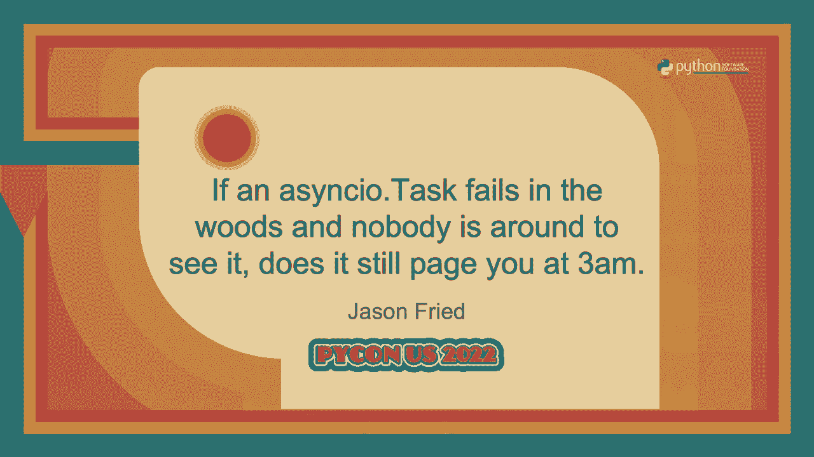

# PyCon US 2022 - P41：Talk - Jason Fried_ If an asyncio Task fails in the woods and nobody is around t - VikingDen7 - BV1f8411Y7cP

 Hello， how's everyone doing today？ Great， awesome。 Okay， so we can start with our next。

 talk。 It's by Jason and oh， I love this talk title。 If an async。io task fails in the words。

 and nobody's around to see it， does it still page you at 3am？ Over to you， Jason。 All right。

 welcome to my talk。 This was the longest title I could think of， but if it helps。

 you can refer to it by a Hany acronym。 I at fit woe@cd。py3， but which， that should be less。

 cumbersome when you want to talk about this talk in conversation later。 I actually wanted。

 to see what that looked like on the， I guess we don't have time for that。 I'm currently。

 a production engineer at Meta。 I've contributed regularly to CPython and various other open。

 source projects。 And I've been writing software for a while。 I spent seven years writing C code。

 and then 10 years writing Pearl and basically I started writing Python when I started Facebook。

 in 2011。 So I've been involved in Python development for 10 years， a little bit more。 At Meta。

 I drove the Python 2 to 3 conversion way back when， just so I could use async。io， in production。

 Though back then it was still called Tulip and we were still on pre， we're， still on before 3。5。

 And when you're a pioneer， you have to forward a lot of rivers。 And you。

 have to make do with whatever you can build yourself。 So we had rivers that had to be。

 crossed before appropriate bridges had been built in the standard liver， PPI。 So I had。

 to build them or to solve problems like async unit tests， async context managers， we needed。

 an exit stack。 But fast forward to today， we have hundreds of backend services written， with async。

io。 There are tens of thousands of people offering Python commits every month， at Meta。

 So I have seen lots of code。 I've seen the good， I've seen the bad， and I've seen， the ugly。

 And in this talk， we're going to cover the ugly。 In very humorous detail， things。

 like nested event loops， bad async。io bootstrapping， anonymous tasks， calling co-routines in the。

 init method， bad signal handling， ignoring cancellation， and not using timeouts。 So on。

 the subject of a bit loops， now this is mostly for library writers， you have existing callers。

 you're not an async def， but you want to call co-routine。 This seems very simple。 I'll just。

 get the default event loop and I'll run it to complete。 Well， the problem comes is that。

 you have some caller way up in a call chain that you're not even aware of that's already。

 running the loop。 And they get an exception about the loop already running。 And because。

 you would have to change a whole bunch of unrelated functions outside of your own project。

 to have async def variants， you figure it's just easier to hack it。 So you decide to pause。

 the existing loop and use your own loop。 So this pattern is called the nested event loop。

 Basically trick async。io into thinking that there are no event loops running so that you。

 can create your own and start it while you block the current one。 The example above is。

 obviously shorted and we have some mini slides to go into detail but it's really a dirty。

 hack and it has some very bad unintended con-insquences。 And we'll probably get you page at 3am。

 because the service owner is seeing timeouts in their event loop once you stop blocking， it。 Look。

 I've seen this kind of logic used at meta。 And people still try to do crazy。

 shit like this because we all know writing quick and brittle， un-maintainable code is。

 better than taking time to do it correctly because it just seems easier。 Well， it's easier。

 now but in the long run it's going to be very difficult。 The first thing is that this。

 is completely unsupported behavior。 It requires you to reach into the guts of async。io to make。

 it work。 And the next thing you will find is that the original loop has things scheduled。

 on it that you are not aware of。 And those things have timeouts。 And those timeouts will， get。

 will be expired because you have blocked its event loop。 The last one is you will end。

 up having tasks on the new event loop that you had created and they will throw some。

 strange stack traces when you'd have to close up your own event loop。 And in the future。

 you might have other work that gets somehow added to this sub-aloop and you might have。

 loops within loops nested very far down and it'll be very hard to reason about what's， going on。

 I've given up trying to help people when I find them doing this and I'd just like。

 point them in the right way。 But the more magical your Python code gets the harder it will be。

 for you to support it。 Understanding what it's doing when something does go wrong is。

 just a wasted effort。 So the solution is just to use async。io。run。 You may say it doesn't， async。io。

run have the same issues as we had before。 Well yes it does but it lets the caller。

 easily put it into a different thread using an executor because it creates a new event。

 loop instead of assuming that there's a default one which is not true on threads other than。

 main and that exception thrown is a good thing。 It lets the caller know that they need to。

 put the function in a thread pull executor or you could do it for them if you happen。

 to live in a giant monorepo shared code base like meta because you need to land your own。

 changes and you don't want to break their tests。 Now the best solution but it's not always。

 practical or possible is to provide an entire async def call chain from their code to your。

 code and maintain a separate blocking call chain that used to exist。 It sounds daunting。

 but that's probably the best solution。 So some tips is you only own the event loops you create。

 Respecting ownership means that if you do not own it you don't mess with it。 Like you。

 don't come to my ranch and mess with my goats and I'll forge you the same courtesy。 A core。

 tentative Python is that we are all consenting adults。 We don't need the language to make。

 us behave or respect each other's privacy。 In the case of event loops don't stop it。 Don't start it。

 Don't block it。 Just leave it alone。 You can do normal stuff but you。

 definitely don't set up a magic sub-nested event。 This violates the number one rule of， async。

io which you're just now going to hear about because I made it up this week。 You are。

 not allowed to block the event loop on purpose。 Sure people block it all the time out of ignorance。

 but when you do it on purpose that's malicious intent。 Right there and it makes you a bad。

 person but maybe not a bad person but you should feel bad。 So you should be using async。io。run。

 and ideally only ever have one event loop。 If that's not possible have one event loop per。

 thread but you should never have more than one loop on the same thread。 It's just madness。

 Also let your college decide what to do。 They have more context than you。 They have about。

 the event loop and maybe what might be scheduled there and they have the ability to put an。

 executor。 You don't have that from a blocking call。 Now let's look at the bootstrapping async。io。

 and why it's important you have clean async bootstrapping。 Bootstrapping is the process。

 of starting up the event loop， scheduling the initial work and also concerned with handling。

 the results and handling cleanup and taking care of signal handling so that your application。

 can terminate safely。 You've probably seen code like this in the past。 I've seen it all。

 over the place。 It's a holdover from a pattern before we had code routines and before we had。

 an async。io run and it was encouraged people use callback style。 This is super old。 It's， terrible。

 You're in and out of the loop。 We start the loop。 We get some value。 Go back， into the loop。

 We create a task and we run forever。 Well we don't ever actually stop。

 the loop unless somebody stops the loop。 If that task died we're still running the loop。

 If we do somehow do stop the loop we have to handle our cleanup so we have to cancel the。

 task and run the loop again and then we're finally closing。 That task while it has a name。

 it might as well be anonymous。 We don't ensure that stays running。 This might get you woken。

 up in the middle of night to find that your running service is actually doing nothing。

 This is a maintenance nightmare。 Even if you do get your task canceled you have no knowledge。

 or basic you can't ensure that the callbacks if there are any callbacks on it actually。

 get run before you complete and run on to complete。 The solutions pattern is easy and， much cleaner。

 Like the last issue the solution is async。io。run。 It handles all the crazy boot。

 strapping cleanup like cancellation of tasks and some basic single handling and it's just。

 less code and easier to read。 Now we're doing pretty much the same work but we basically。

 take a code routine and we do initialization and pass it to async。io。run。 If that very important。

 task some server that we had before if it fails the code just exits like it logically， should。

 And since we're talking about tasks let's look at the problem of anonymous tasks。

 or what I call set it and forget it。 Pattern it also applies to daemon threads。 Unlike。

 infomercial kitchen or tistory tasks should never be created and forgotten about。 This。

 is exactly the kind of thing that gets you page for in the morning。 Turns out that something。

 important happens in the do something code routine and it has been printing exceptions。

 all night but because we didn't do anything with the task nobody noticed they just get。

 printed to the standard out standard error and it did nobody knows till four in the morning。

 until it started breaking other things。 You should have some mechanism to ensure that。

 your tasks when are expected when they have exceptions。 Your unit test shouldn't look。

 for these unhandled tasks。 The solution to this is simple use async。io。run。 Okay that's， a joke。

 Not everything is all base and go to run。 It can't solve all your problems。

 One possible solution is the nursery from trio。 I don't know the origins of the name but we。

 can generally reason about how it should work。 We don't let small children just wander。

 around unattended and we put them in a nursery so that we can watch over them and take care。

 of them in case something bad happens。 Now don't get the idea of killing all the other。

 kids when one kid has an issue that kind of gets dark and it mirrors the disturbing terminology。

 we use and we talk about the POSIX process model about killing children when their parents。

 die and sometimes there's zombies involved。 To get back on track the gist of this idea。

 is you have the failure domain of tasks。 If a task in the nursery dies for whatever reason。

 the other tasks are canceled。 An application wide feature domain is useful for important。

 tasks that for your service that if they failed for whatever reason would be really bad。 You。

 can get this functionality in async。io using the A。O。 nursery or the later package from， PyPI。

 The later calls them watchers they basically have the same goal。 So you might。

 ask well I don't care if the task fails it's best effort。 I'm logging or doing something， like that。

 So sure if it fails every once in a while maybe that's fine but what if it。

 started failing every time you called it。 Is that still best effort？ You should have some。

 mechanism to ensure that not all these best effort activities fail。 Maybe set some kind。

 of SLA like if you start failing a certain percentage per hour maybe you should do something。

 about it or go ahead and set your alarm for 3 a。m。 so I can call you。 You might say that。

 you're just using tasks for this abomination。 So this is something example I've seen in。

 talks and I've seen this online is we have this bound queue and we're putting an item。

 on it and they're like oh I don't want to get blocked so I'm going to put that in a， task。

 So what this pattern I've seen this pattern talked about like what the hell are。

 you actually doing because this is so much more performant just having an unbound queue。

 and using put no wait like think would you rather unbound memory growth potential or unbound。

 memory growth potential and slow hell slow ass event loop cycling through an unbound list。

 of tasks which has an effect become a second queue which if you know anything about queuing。

 theory you don't do secondary queues but one thing that is but this one secondary queue。

 is way more expensive than the original queue because the bigger it gets the slower your。

 event loop gets because your event loop has to cycle through all the tasks to check them。

 if they're ready。 So if you're going to do something this then just use an unbounded。

 queue or use the put no wait but if you're going to use a bounded queue use it for what。

 it's supposed to be for it's supposed to be for flow control so you can get back pressure。

 you can know that the queue that we're working on is filling up maybe I should report to the。

 user that we're overloaded。 Let's move on。 So calling corout coroutines from a knit people。

 always seem to want to get the situation like I got a call this this coroutine for my， net method。

 I see code like this and I personally think do you hate me like are you doing this。

 on purpose like so by doing this in a net you have barred me from using async。io run which。

 according to this talk you'll know is my favorite thing in the world which you should。

 be using by the way since it creates its own event loop that anything you produce or。

 start here is in a different event loop。 Some people use that nasty magic nested event。

 loop that we had we talked about before and it has all the same problems and it's weird。

 or they create anonymous tasks which we just got finished talking about。 The problem with。

 these patterns is you're doing some kind of async activity in a place that was not designed。

 and is ill suited for that task like when what are we really trying to do here like。

 any I/O inside of a knit method is bad design good a knit method should not block or affect。

 any state outside themselves。 So don't do this you don't need it there are better alternatives。

 the solution is the async context manager it to initialize any async state of an object。

 by using an async context manager you have a method that is well suited for initializing。

 async stuff and as a added bonus you have a well suited method for cleaning and cancelling。

 your async stuff because they're coroutines that's what they're made for。 And on the。

 subject of using context managers I've seen code like this to like you get a random package。

 somebody's download and pipe you want you to help them get it running and you have to。

 go read through their docs and you have to find what they decided to name this method。

 that you have to run for it to work。 Well there's no conventions this method can be named。

 anything here it's like oh let me go read your docs again so I can see what this is called。

 but then you sometimes have to worry about cleanup and you have to go find out what that's。

 called though with an async context manager there's a better pattern it's the same amount。

 of work except that the the maintainer of the better async web server can do it for you。

 this pattern is less error prone it uses less of your own headspace to keep track of。

 the API is defined by a PEP which means it's well defined in part of the language you learn。

 it once it never means well hopefully the async context manager and what context managers。

 in general are pretty awesome they they're like the perfect system for writing like a。

 plugin or extensions no matter what my object does everyone already knows how to enter its。

 context they know how to clean it up it's built into Python using the with statement。

 or in this case the async with statement so let's move to signal handling every application。

 needs signal handling especially async code async I'll run which I love to talk about gives。

 us some helpful defaults for control C and which is a case again but you probably will。

 need more this is essentially the signal handling example in the AC go docs I've shortened it。

 not clean it up because it it likes what they were calling functions but basically we have。

 our main method we get the loop the running loop correct way and we set the signal it we。

 set the sick term the first one being control C and we add the signal handlers and we do。

 some partial magic so we can pass it the loop and what the signal was and then in our handler。

 we print that we got the signal that we're exiting and then we do a loop dot stop this。

 is straight from the docs like what to do when you want to handle this is terrible this practice。

 of handling shut down of an application this is this it's like the act adding signal handlers。

 that's a good part that's like actually useful but what we do with the signals of the problem。

 we just called stop and if you do call loop stop your application will raise a runtime。

 error to be raised wherever you happen to run the loop because we all know that your application。

 should explode with unhandled exceptions when you handle a signal and everything goes as。

 expected the the exception lets you know it's working okay nobody thinks like that if you。

 tell me that you're just going to catch that exception I'll be paging you tomorrow at 3。25， a。m。

 if you're not using AC go run then you need to start the loop again to handle cleanup。

 by yourself we saw that in the boots trapping example and if you are using AC go run you。

 better be okay with all the tasks being canceled at pretty much the same time and there's a。

 good chance that you will care like what if you have a async web server will say that。

 runs a status page of your application and when it's shutting down you would like to。

 update the status page you can you can know that the process is still going and shutting。

 down and know what it's doing well it because some of your tasks might take a little while。

 to shut down and maybe they can update on this page well if you use loop dot stop your web。

 server will probably be the first thing to get canceled and you're still going to have。

 to wait for your other tasks to finish one solution is that you could instead cancel。

 a task this task might be what you're primarily concerned with this your shutdown logic could。

 be just handled in cancellation flow you could combine this with maybe a later watcher or a。

 task nursery later watcher has a method you can call on the watcher to cancel all the。

 tasks and fall through the context that's what I use in my method for terminating my applications。

 from signal handlers if you and I do that from the non-signal things if you combine。

 this with an async context manager and exit stack you have this like subscribeable system。

 that you can handle well-ordered startup and well-ordered shutdown it all happens in the。

 order you specify so if you want your web server to be the last thing that gets canceled。

 you enter its context first so all the other things have to be canceled and exit and then。

 your web server shut down shut down logic and signal handling logic should be the same because。

 most of the time how else do shut down your application but sitting in a control C or。

 a SIG term and even if you have some other non-signal you wait shut down your application。

 you probably want to do the same thing anyway so just make them the same or you could use。

 an event that might be a solution your task could wait on it they can use it as a looping。

 flag multiple places in your code could monitor the same event it's not as robust as task。

 cancellation and the watcher solution with the acx stack but it's better than the blast。

 crater that's created with loop stop because that provides zero customization about how。

 things get turned off so we talked about cancellation a few times so we should probably。

 go over it so let's spend the next 40 slides to quickly reduce cancellation okay I'm kidding。

 we're not going to do that but I'm going to go over some of it cancellation is tricky。

 and it's hard but it's not that hard many people screwed up just by ignoring cancellation。

 either on purpose or out of ignorance like this code above or maybe this code where。

 we still do the same thing but we're just catching base exception or maybe this code。

 where we have we're still catching cancellation error but we're just very terrible about it。

 because we're using naked accepts so if we go back to the original the code here so what。

 are we doing here like what were you trying to accomplish like you I see patterns like。

 this and the only time you should ever do something like this is if you have just canceled。

 a task yourself and you're awaiting for it to ensure that it cancels and even then it's。

 not so simple as we'll see we'll see later so people generally expect to be able to cancel。

 a task but task writers never expect their tasks to be canceled cancellation is a contract。

 it's not a clear one but you agree to it the moment you start running async IO code I cobbled。

 together what the contract looks like by just reading through the documentation it's in a。

 couple of different places number one in a wait statement any a wait statement can raise。

 a cancel later it could be somebody canceling you it could be somebody canceling tasher。

 wedding or it could be both you can have me canceled more than once that's a little weird。

 you can catch the exception but you should never ignore it and always re-raise the exception。

 when you get canceled you don't have to exit right now but you should move towards shutdown。

 like async IO run expects that all tasks will eventually cancel because it attempts to do。

 just that before it returns and as for the documentation the canceled error exception。

 can be caught to perform custom operations when async tasks are canceled in almost all。

 situations that exception must be re-raised well but what about the other ones where you。

 don't have to re-raise it well I guess nobody knows I won't figure that out later so it's。

 not hard to comply with the contract when you get the exception start your cleanup and。

 stop accepting new work move towards exiting and then raise when you're done this also。

 means you have to stop catching basic exception or using empty except clauses with your async。

 IO code unless you're being very careful to check that what you did catch was not a。

 cancel error because it is a cancer you have to re-raise it in most cases and the other。

 side of cancellation is easy right you want to cancel a task you just called canceled。

 wrong that task isn't actually canceled yet it's scheduled to be canceled the next time。

 you await something yet I see people canceling things and expecting that this is what this。

 happens for this reason I have long held the opinion that cancel should return on a waitable。

 so canceling things correctly is not too hard you could we you can cancel on a task。

 but it's didn't actually cancel to the next event loop cycle if the task has never been。

 run then it's canceled without ever the coaching coaching ever being started but if the task。

 is already running the next cycle the loop will cause a cancel error to be erased whatever。

 a wait statement it's currently paused at and this affects all the things that are that。

 it's awaiting on as well so it goes all the way down the chain unless it's shielded and。

 starts and throws into cancel error even when task even then a task is not considered canceled。

 until it re-rases the cancel error the doc seemed to say it should be the same cancel。

 error so we do this in the coroutine above we cancel the task and then we wait on it and。

 catching the exception error or the cancel exception because we know it's going to happen。

 but we don't want to raise it because we're purposely canceling something but what if。

 the task takes a long time to cancel and someone has come from above you and attempted to cancel。

 you while you're waiting on the task to finish but you're supposed to re-raise the cancel。

 you've got but we're suppressing it so maybe it's not as easy as I've let on so I've come。

 up with this monstrosity so you can see that what we're doing is we're trying to prevent。

 ourselves from being canceled until the task we were trying to cancel has finished canceling。

 that's a mouthful so we check that the task was canceled every time we catch the cancel。

 error and if we catch one and the task is not done we save that exception to raise later。

 to complete our part of the cancellation contract we also cycle the event loop after the task。

 cancel so we give a chance for the callbacks to get a chance to run you may notice we also。

 use shield so this is where we this is when we are canceled we can prevent that the task。

 that we have already sent a canceled message to from getting a secondary cancel while we。

 are waiting it yeah you could do all this every time you wanted to cancel something or you。

 could do something like later。cancel from the later package and papi and I would push out。

 a new release sometime tonight to update with this new extended behavior but let's move on。

 so you need timeouts you you should use timeouts in your application because in the world world。

 things get stuck now you may tell me that you have never used timeouts and you don't。

 have any issues I call you a liar but no so what are the chances that an async call won't。

 complete the expected time well in your dev environment at zero look we've all heard the。

 lament hey it worked in my dev server everything works on your dev server because that's where。

 you stuff but in production is a little different everybody's experiences things don't always。

 behave expected the first time you run in production but what you you may not know is。

 that running something in production makes your service actively hate you not not people。

 in general just you so during standard business hours it seems to change based on whether。

 or not you were at your desk it fails more more the moment you step away from your desk。

 and because even more unstable the moment you're out eating lunch with your friends and I'm。

 not sure exactly how this one happens but it does things also fail more often during。

 weekends then they do on weekdays things never seem to fail when you're actually working there。

 are some obvious modifiers that have been observed on holidays when you're sleeping when。

 you don't have access to your laptop things fail more often and then later the later the。

 night gets the more things fail so if it's if you're sleeping at 5 a。m。 while having forgot。

 up at work on a holiday that's a hundred and ten percent wait that's over a hundred。

 percent Jason you're not doing probability correctly well at that point your service。

 has broken all the rules of probability and is going after all the other services in。

 your infrastructure for sport if you sleep until ten that's a site wide incident and then。

 you were somehow taking down random pieces of the internet and your CEO is calling you。

 because they have to release a press release okay I've made all that up but the idea is。

 that your service is going to fail at certain times you may think it's directly related。

 to you because it will just fall on its face at random times timeouts are kind of a way。

 to keep things in check when you're not there to manually intervene or to interrupt it when。

 it gets stuck so look things fail prepare for it sometimes things don't raise exceptions。

 when they will never complete they might raise an exception eventually but that could be on。

 geologic timescales not human ones this is why we have timeouts and software you have。

 a few choices there's wait and wait for but neither are as elegant as the async timeout。

 package from pipeline things inside the timeout context get canceled if they run too long and。

 outside the context gets gets raised a timeout error when you are waiting for something that。

 could be delayed consider adding timeouts around the code when you don't want to have。

 to be welcome to build a night figure out why your service is doing nothing at all in our。

 example above we are using nested timeouts because the request timeout we want should we。

 should plan to retry them when they timeout and how long we should attempt to retry them。

 that's a case of a budget we've set like a hundred milliseconds so that we that they。

 should only ever take a hundred milliseconds total if they have to keep retrying so look。

 shit happens try to make the best of it async o can be a powerful tool but used poorly will。

 cause you lots of pain so let's wrap up this talk so inclusion never assume intent or violate。

 ownership expectations never nested event loops is a bad idea if you want logical startup。

 and shut down use async o context managers in async exit stacks tasks fail or sometimes。

 ever complete use timeouts and handle your exceptions and I've had people tell me that。

 cancellation is too hard look it's not that hard and it's not that painful set up it's。

 definitely better than being paged in the middle of a cold night while you're sleeping， uh。

 i suggest asic are run because the best bootstrap we have even though it raises exceptions。

 it's awesome because i'd rather know that you're attempting to run an event loop that。

 i can easily put an excuse without having to worry about threads getting default event。

 loops um that's it thank you for coming to my ten talk any questions will be a questions。

 will be out in the hallway， (applause)。