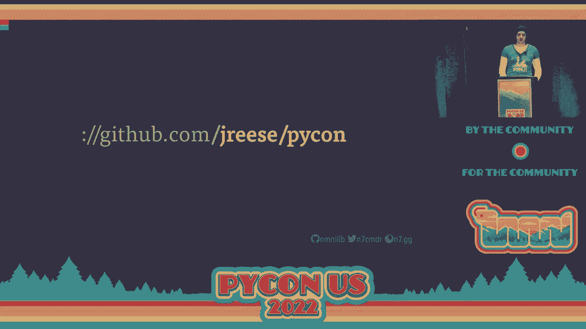
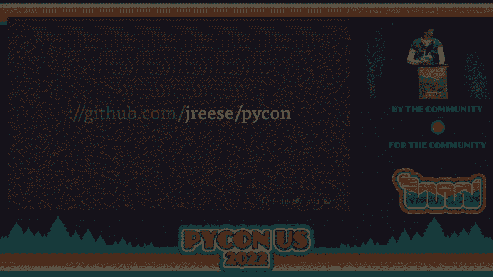

# PyCon US 2022 - P45：Talk - John Reese_ Open Source on Easy Mode - VikingDen7 - BV1f8411Y7cP

 So the way we'll do that today is by looking at a number of different tools and best practices。

 that together build a cohesive end-to-end developer experience where each individual。

 piece provides value by reducing the overall level of effort needed to maintain an open。

 source project。 There's a lot to cover and we're going to go fast， but I'll have a GitHub link with。

 everything that I talk about at the end of the presentation。

 So let's jump right in with foundational pieces that every project needs in order to function。

 within the greater Python ecosystem。 First up is project metadata。

 This is a core requirement to publishing and distributing packages on PIPI and accessible。

 metadata can also enable developer tooling to better understand our project beyond just。

 the files on disk。 The best way to do this is with well-structured and standardized metadata。

 For anyone who's been around the block in the Python world， starting a new project means。

 writing a new setup。py。 You import setup tools， you open the readme file， fetch a long description。

 and maybe we'll， just find another project and copy paste。 We should stop this。

 This is not metadata。 It's arbitrary code that needs to be run every time the package is built from source。

 Nothing there is standardized beyond what whatever setup tools does。

 So what we want is a well-defined format that doesn't involve executing someone else's， code。

 Thankfully， we've approved standards focused on a single file at the root of Python projects。

 called PIProject。toml。 This file acts as a central location for project metadata and configuration for developer tools。

 alike。 The original standards for PIProject。toml were focused around the selection of build back。

 ends， the tools that actually transform your Python sources into installable distributions。

 Together， pet 517 and 518 define the build system table， which any package manager can。

 use to install your preferred build back end and then actually build and install your package。

 I'm a fan of FLIT， so here we have the FLIT core package as the dependency， and the。

 associated build back end。 But these days are PIProject。toml。

 It can also include standardized project metadata thanks to PIP621。

 This new format of metadata is in the top-level project table of our file and includes all。

 of the basic package information that previously lived in setup。py or other back end specific。

 configurations。 This unlocks a great potential for developer tooling to understand and use package metadata。

 without the need to support many different formats。

 At the top here we have the basic metadata about the package， as you might expect， including。

 the minimum Python version requirement。 And here we have our list of package dependencies。

 But just listing them isn't often enough。 It can cause a number of bug reports from users who want to use your project but have。

 different versions or older versions of those dependencies or on platforms where they're not。

 supported。 So let's look at how we can better define those dependencies and how that can help guide。

 users and their package managers towards optimal choices。 So one thing is that things change。

 especially in software。 Packages will get new features， deprecate functionality。

 or just outright make breaking， changes at will。 That's why we can set version limits on our dependencies to make sure package managers。

 install compatible versions。 If we wanted to absolutely guarantee compatibility we could pin our dependencies to exact versions。

 But that's not convenient for users， especially if another package wants to pin to a different。

 version。 So even if we expand our limits to anything without a major version。

 we're still potentially， leaving users on old versions open to bugs and security vulnerabilities。

 Instead， we can compromise and specify future friendly version limits on our dependencies。

 With this method， we provide only a lower bound on those dependencies， ideally chosen。

 based on the features we use from them and what versions support those features。 In our metadata。

 it could look something like this。 By skipping the upper version boundary。

 we're trusting that our dependencies won't suddenly， break compatibility。

 That might be a leap of faith， but this trade-off allows our users to upgrade and never potentially。

 get newer and more secure versions。 It also means we don't need to release a new version of our own project every time one。

 of our dependencies gets a major feature。 We can always come back and add an upper limit later if we really need to。

 We can also add environment markers to our dependencies for packages that only need to。

 be installed on specific platforms or back ports that aren't needed on newer Python versions。

 But once we set them， how do we know our version limits are correct？ Well。

 the honest answer is that we need to validate them。

 We need to test this on every version we're allowing。 But if we're being generous on our limits。

 that's a lot of different versions to test， with。 Well。

 my coworker Tim wrote a tool to help with exactly that problem。

 Because the Python packaging ecosystem makes him so happy， he called the tool pessimist。

 What it does is quite simple。 It looks at your project dependencies and runs whatever tests you prefer on all of the。

 matching versions， then generates a report on whether your limits are valid。

 There's also a fast mode， which limits the testing to both the oldest and newest matching， versions。

 specifically for use in local testing or CI when compute time is otherwise limited。

 Here we're running it on a project's test suite and pessimist validates that it passes。

 with our limits。 Now that we're confident in our metadata and dependencies。

 let's focus on building a， reproducible development workflow。

 Not only can this simplify the process of developing， testing and validating our changes。

 but it'll also make it that much easier to replicate our development environment on new。

 machines and VMs， as well as for new developers to pick up our project and immediately make。

 progress and have confidence that the changes are working。

 But just having a list of commands to run isn't really helpful。

 You need to have a dedicated command runner。 This will combine all of your build and testing steps into a single command。

 including any， preparation or setup necessary to get your project running on a new machine。

 At a bare minimum， this can be satisfied with make files， and I've personally used them with。

 many of my projects for the last decade。 But it knows nothing about how Python projects work and requires you to re-engineer every。

 piece of the puzzle。 Ideally， we want something that can do more of that work for us。

 especially around setting， up virtual environments and installing dependencies。

 And we would like to do that on multiple Python versions with a single command。

 Tox is one of the most widely used projects for testing， while Nox provides an alternative。

 system that lets you define your workflow with actual Python code。 But today。

 I'd like to introduce a new tool I created， a rapid development assistant that， I called Thaxx。

 or THX。 It uses many of the same basic concepts， but focuses on optimizing the development workflow。

 for Python projects。 Thaxx is configured entirely in your PyProject。toml。

 and defining simple jobs is straightforward， with a list of job names and associated commands。

 We can then define a subset of those jobs that should be run by default。 Now when we run Thaxx。

 it executes the default jobs in virtual environments and outputs results， to this terminal。

 If everything is successful， we see a bunch of green OK messages。 But if one of those jobs fails。

 we get clear error output， along with the exact command， that was run。 By default。

 Thaxx will just run jobs using the same Python version that Thaxx is installed， with。

 But if we're trying to support our projects on multiple Python versions， we want our tools。

 to run our development workflow on each of those supportive versions。 Well， Thaxx can do this。

 and it can do it fast。 We can simply give Thaxx a list of the Python versions that we care about。

 and Thaxx will， look for these run times when executing jobs。

 Each of their requested jobs will run on each of the Python versions in parallel with separate。

 virtual environments for each version。 In some cases， though， like formatting。

 we might only need to run a job on a single version。

 There's no need to format our code base four times， so we just mark the job with once equals， true。

 For more complex jobs， we might want to run multiple steps。 Here。

 we define the job as a list of steps each with its own command to run。

 Thaxx will run each of these steps in order， stopping early if a step fails。 But in this case。

 none of these commands depend on the results of the previous one。

 They could all run in parallel just fine。 So we just mark the job with parallel。

 and Thaxx will run all of them at the same time， and it will run all of these in parallel with each and every Python version that we're testing。

 against， taking full advantage of modern multi-core systems and making our iteration that much。

 faster。 But Thaxx has one more trick up its sleeve。 A watch mode。

 where it can wait for modifications to our project， and automatically rerun its。

 jobs every time our files change on disk。 It's perfect for running in an IDE or terminal alongside your code and gives us immediate。

 feedback when something has broken our test suite or failed coverage star-solds。

 And its parallel performance provides tremendous leverage for validating our project throughout。

 development。 If you'd like to know more about Thaxx， please check it out at thx。omnilib。dev。

 There's more documentation and configuration options that you can find there， along with。

 some recipes for common use cases like code coverage and CI， and how Thaxx can help。

 So now that we have the tools to build out our workflow， we can begin looking at how to。

 improve our development experience。 One of the best areas to focus on is code quality。

 where the side effects of better code， are often as important as the code itself。

 Better code doesn't just mean that our project's faster or more reliable， but also that it's。

 easier to read， easier to understand， and easier to debug。 Together。

 this means you'll spend less time maintaining and more time building。 So where do we start？ Well。

 let's pick the lowest hanging fruit first， code style， and let's get the flame， wars out of the way。

 I don't care what your code looks like， as long as it all looks the same。

 Consistency and predictability are the primary factors to making code easy to read， and the。

 easier code is to read， the easier it is to understand what it's actually doing。

 Just don't make it my problem。 Only once to spend an hour fixing a bug。

 only to get nitpicky feedback about code style。 Choose a code formatter that enforces your preferred style。

 and make it an integral part， of the development workflow so that nobody， including you。

 has to ever think about code， style again。 The more automated and extensive， the better。

 We want to dump code from our brain and let the computer worry about making it look right。

 after the fact。 But really， you should just use black。

 It's an excellent tool with strong safety guarantees， so you can run it on your whole code。

 base without worrying about breaking anything。 And for anyone who cares。

 it makes your code look like this。 But more importantly， its configuration looks like this。

 When you decide to use black， all the opinions come baked in。 There's no more debate。

 There's only one color you can paint the bike shed。

 That's the easiest tool you'll ever configure in your life， and everyone will either thank。

 you for it or be really angry that they have nothing to argue about anymore。

 So black will make your code look consistent， but it won't move your imports。

 I know a lot of folks really like their artisanal， handcrafted imports broken down by color。

 and size and favorite musician， but that's a lot of work， and I'm lazy。 So like code style。

 it's an awful lot easier to just let the computer do it for you。

 This is where I get to shamelessly self-promote some more and say we should all be using， U-sort。

 It was built from the ground up by Tim and myself to understand and manipulate the syntax。

 tree directly so that it can recognize and make intelligent choices about when and where。

 it's safe to move imports。 So in the best case， U-sort will follow the most common patterns and sort something that。

 looks like this into this。 Groups for the standard library， third party， and first party imports。

 This is the easy part。 Now suppose we want to import a module and change our runtime configuration before importing。

 something else。 Unlike other import sorters， U-sort focuses on making safe changes。

 and it treats intervening， statements as barriers when sorting blocks of imports。 So the async。

io import would never move above the simple filter call and the warnings import。

 would never move below it。 Maintaining functionality without the need for ugly or error-prone comment directives。

 This level of safety is what allows us to run U-sort as scale inside meta。

 Every Python file covered by our formatter gets sorted by U-sort without exception， and。

 we automatically apply catch-up formatting for all covered files every morning。

 Now it's great to have these tools， but running multiple formatter separately is a recipe。

 for minor conflicts， which can cause annoying failures in CI or pre-commit hooks。

 What you really need is something that can perform both formatting and import sorting。

 in a single atomic step。 And that's where U-format comes in。

 U-format is a combined code formatter and sorter， built on top of black and U-sort。

 Each file is sorted and then formatted in memory as a single atomic step， guaranteeing。

 consistent results in CI and pre-commit hooks。 If any of that sounds interesting。

 please check out the project's documentation for more。

 details on how they work and how you can integrate them in your developer workflow。

 So now that we have formatting taken care of， let's look at how we can apply tooling。

 to actually make the code more reliable by finding and pointing out bad practices， subtle， bugs。

 or edge cases that aren't obvious， no matter how pretty the code looks。

 The easiest place to start is with a linter。 They can help you find potential bugs in your code or even help prevent you from introducing。

 bugs in the future by steering you away from problematic patterns。

 There are a number of good options in the space， including pilot and pifelakes， but my。

 personal favorite and the one we use at meta is flake 8。 Provides a nice wrapper around pifelakes。

 has sensible defaults， easy configuration， and， most importantly has a number of excellent plugins available to increase the scope of。

 problems that flake 8 can help us find。 By default we'll get warnings that range from pointing out bad practices like star imports。

 to bugs waiting to happen like shadowed imports or search with parentheses， or even runtime。

 errors like undefined variables or invalid grammar。

 With some extra plugins we can also get notified when we accidentally leave debugging breakpoints。

 in our code or when we use mutable default values for function parameters or help guide。

 us to better usage of list comprehension or generator expressions in our code。

 Finishing bugs before they happen will save future you an uncountable number of headaches。

 and hours wasted debugging your projects。 But what you don't want your learner fighting with is your formatter。

 We recommend turning off most if not all lint errors related to code style and just let。

 the formatter do their job。 If it's good enough for the formatter it should be good enough for your linter。

 While linters can look for patterns and individual pieces of your code the real meat is in static。

 analysis tools especially type checkers which look at your code base as a whole and make。

 sure everything is correctly passing and using values。

 And it can do this based on what it knows about not just your code but other code as。

 well including the standard library and any other type annotated libraries used by your， project。

 So let's look at an example of how types can help us find real world bugs that a human。

 may never notice。 Let's assume get path is a foreign API we don't really know shouldn't really need to care。

 about how it works。 Do you see the bug？ Do you have an idea of what it could be？

 What if we add some type annotations？ We're adding new information here that previously we might have needed to read a doc string for。

 Well maybe some extra in line annotations help。 What if I told you that open raises an exception when passed none？

 Well， there's some input that can cause get path to return none and then we're just passing。

 that straight to open and you end up with an angry bug report because someone crashed。

 their production service。 But our type checker can find and report that before we ever release the code let alone run。

 it in production。 But beyond finding errors there are benefits just adding type annotations to your own modules。

 Consider it as a form of validated documentation for you and everyone else looking at your code。

 Given these two definitions for the same functions which one do you find more useful？

 Which one could you evaluate faster when looking at a foreign API？

 We don't even need to see a doc string or look at the body of the code in order to have。

 a good idea of the contract being described。 This is valuable documentation for developers and unlike a doc string a good type checker。

 will force you and everyone else to keep this information up to date。

 So again there are multiple good choices here for type checkers but I recommend the use of。

 myPIE for open source projects。 It's by far the most popular type checker available and works really well with minimal。

 setup or configuration needed。 For many projects this is the only option you need just because there are still a large。

 number of libraries out there that don't have type stubs or aren't appropriately marked。

 as annotated and there's not much we can do about that。

 You don't even need all of your code to be typed annotated to start seeing an impact。

 But if you're willing to type annotate everything including your test cases I highly recommend。

 enabling strict mode。 This will let myPIE get more pedantic。

 find more bugs and also point out anytime you fail， to document I mean annotate your code。

 So speaking of documentation while looking at the code directly is important for working。

 on your own project the last thing you want to look at is someone else's code especially。

 when you just need to know what a function is called or what various arguments do。

 Most importantly there will come a day when your own code looks foreign to you and you。

 forgotten what all your own APIs look like。 When that happens you can turn to your own documentation for help。

 But we don't just want to brain dump info in a text file tucked away and forgotten cursed。

 to never be accurate again。 What we need is tooling specifically designed to extract as much information as possible。

 from our code base including docstrings and type information and automatically compile。

 that documentation into useful formats。 Now there are many different tools that can do this but Sphinx is designed specifically。

 for Python and used by hundreds of open source projects。

 Sphinx will compile and transform a set of source documents into a full website including。

 navigation and text search。 You can add arbitrary pages as well allowing you to build a combined project and documentation。

 site all in one with relatively little time effort required to maintain it。

 Sphinx uses restructured text format similar to markdown but focused on technical documentation。

 When compiled Sphinx generates well formatted HTML and we can include code blocks with syntax。

 highlighting links to other sections of the documentation and much more that isn't possible。

 in plain markdown。 And we don't need to sacrifice the ability to read and understand the source text in an。

 editor。 But the real magic of Sphinx comes from the autodock extension。

 This gives Sphinx the power to look at your project's source code and automatically extract， module。

 class and function APIs including type annotations， docstring， contents and more。

 With this in mind we can actually write our docstrings with Sphinx results in mind using。

 inline restructured text。 We can include references to other functions。

 inline code blocks and anything else we could， put in a normal documentation page。

 Then we just add the appropriate autodroc directives to our documentation and regenerator， site。

 And now our compiled documentation includes our function prototype， formatted contents。

 of our docstring as well as type information。 Now you might be asking what can you do with this once you have it？

 Well maybe you've heard of a little site called Read the Docs。

 This is an excellent free service for building and hosting your project documentation sites。

 and it's specifically designed to work with Sphinx。

 It also has excellent integrations with GitHub including the ability to automatically build。

 every time code is pushed as well as building previous sites for each pull request so you。

 can easily evaluate any documentation changes for PRs。

 So now that we have an end developer and documentation workflow let's take a look at how we can。

 streamline the process of community contributions without putting undue burden on your own time。

 One of the most important pieces of having positive community interaction starts with。

 setting clear boundaries on expectations in both directions。

 You really should have a code of conduct if and when your project gains more attention。

 clowns will inevitably show up and the easiest way to deal with them is by having code of。

 conduct with clear set of rules and consequences that you can follow。

 I use the contributor covenant at the Omelema project and recommend it both for the standards。

 it includes as well as their guidance on how to enforce it。

 Beyond that make sure you set clear expectations for what contributions you're willing to accept。

 from the community。 If you only care about bug fixes say that。

 If you're happy to take feature requests say that。

 Let folks know ahead of time if they should open an issue or discuss new features before。

 they take up their own time and yours with pull requests that you would never accept。

 If you can document the level of support you'll give for each project but don't over commit。

 yourself。 Unless there's a paid support contract you do not owe anyone your time you don't owe。

 them your energy and you certainly do not owe them your sanity。

 If someone's being too needy and is taking up your limited time then just dump them。

 If they're being nice apologize and just tell them you can't help them maybe point them。

 to a different project but if they're being less than nice just don't engage and remove。

 them from the community。 Don't waste your time on unproductive community members。

 Unhappy or note let's look at how we can simplify and automate as much of their contributor。

 workflow as possible。 We want to remove barriers between the community members and their ability to ramp up on your。

 project because less friction the more likely you are to receive high quality contributions。

 This starts with you guessed it more documentation。

 A basic contributors guide starts with the steps to set up and build your project from。

 source as well as how to run the project and test suite。

 A better guide also includes extra validation steps needed like linters or form matters as。

 well as general guidance on what to include with changes like documentation test cases or。

 change load entries。 This is where a reproducible workflow from earlier can really help。

 The closer contributors get to the workflow you use the more trust you'll have in their。

 contributions and the more trust they will have in their own changes that they're making。

 during development。 You can further help guide contributors in the right path by adding detailed issue templates。

 and pull request templates to your project that will pre-populate the text boxes with。

 whatever you want。 You can have multiple different templates for specific types of issues or requests but。

 be sure to include any spots for specific information that you want to see like steps。

 to reproduce the user's environment or whatever makes sense for the project。

 Once your community members have submitted a pull request you want to make sure that you。

 automate the testing and validation process in a way that not only reduces the time you。

 spend reviewing their contributions but also gives immediate actual feedback to the contributor。

 themselves。 Continuous integration systems are one of the easiest and most common ways to make this。

 happen。 If your project is on GitHub then GitHub actions is the easy choice and runs for free on public。

 repos。 The biggest benefit here is the ability to configure CI to test your project on a variety。

 of operating systems and Python runtime versions and get direct feedback in a pull request on。

 which of those pass so you can easily see if it's OS or version dependent or if it's。

 a more basic issue。 Again， we'll beat the drum for reproducible workflows。

 Whatever CI platform or system you choose it should be configured to use the same build。

 test and validation workflow that you use locally。

 This will help minimize surprises and make it that much easier for you to review a pull。

 request and understand the results of the CI。 Simply be aware that GitHub actions as well as integrations to other services are available。

 and can also improve the amount of time that it takes you to actually review a pull request。

 The last piece of the puzzle is releasing your project。

 The easier it is to prepare and release a new version the faster we can publish our bug。

 fixes and the more boring each individual releases with targeted fixes or improvements。

 the more reliable and trustworthy your project will be perceived。

 So let's start with the most important part of releasing new versions， picking the right。

 version numbers。 Ultimately， we want version numbers that convey some amount of meaningful information。

 How big or how important or how dangerous your change is。

 One of the most well-known schemes is semver， semantic versioning and I'm here to say semver。

 is impossible。 The major version number is supposed to tell us when breaking changes occur but how do。

 we define breaking changes。 So change to feature breaking as an API change breaking is a bug fix breaking。

 On the other end of the scale we can simply base our versions on the year and date of。

 each release but beware because once you make your major versions based on the calendar year。

 you just burn more versions than chrome。 Yes， technically you can increment a version epic and start over from zero but literally。

 nobody wants that and you'd be surprised how many tools will break。

 So really just pick something be consistent with your versioning and communicate your plan， clearly。

 But picking a version number is only the first step。

 There's a lot more that can go into release than you might expect so we want to automate。

 as much of that process as we can as well。 Like our development processes earlier we want to have reproducible workflows。

 You shouldn't have to figure out and piece this all together every time you get a new。

 laptop at the very least document the necessary tools and steps to publish a release so that。

 future you can just refer to your documentation。 But we can do more。

 The key to reproducible releases is based on the off of published tag revisions in your。

 source control。 Those tags should already include any changes to documentation， version numbers。

 etc。 Now once it gets to getting that tools can help I specifically wrote a tool called attribution。

 which automates the process of generating a change log。

 As for building your actual release you want artifacts but we're running out of time so。

 I'm going to power through this。 Wheels are binary wheels they're only on specific platforms and versions。

 Source distributions are where you can actually rebuild on anything。

 The last key you want your S-DIS because anybody who's on OS or version where you don't have。

 a wheel can actually build your project but you want the combination because it's faster。

 for most users。 If you want help in building all of those the CI build wheel project can help automate。

 a lot of that in your CI steps。 It helps you support that whole matrix of version compatibility。

 So we made it。 We've reproduced our workflows。 We've improved our code quality。

 we've fostered our community， we published our distributions。 Well now we take time for ourselves。

 Don't forget the golden rule。 It's your life， your project and ultimately you're the only one who can choose how to spend。

 your time。 I appreciate you spending this time here with me。

 You can find links to all the projects and resources on my GitHub repo。 Thank you so much。

 Have a good Python。

 Thank you。

