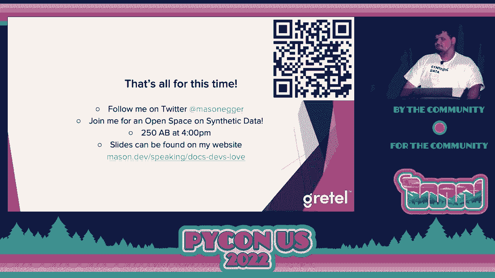

# PyCon US 2022 - P56：Talk - Mason Egger_ Write Docs Devs Love_ Ten Tips To Level Up Your Tech Writing - VikingDen7 - BV1f8411Y7cP

 All right， folks， thank you very much for the last talk of this session。

 If you get a chance， download the QR code。 That's the download。 Photograph it， take a picture of it。

 These slides are amazing。 So you'll want to have an extra copy。

 You can peruse them while you're watching the talk。 Zoom in on them if you'd like to feel like that。

 But I'll give you an extra minute to do that and hopefully you won't overload the Wi-Fi。

 And with that being said， I'm going to do Smase and Edgar and he's going to teach us。

 how to write Doc's Dev's love。 Ten tricks to level up your tech writing。 Take it away。 Awesome。

 Thank you， everyone。 How's everyone going？ This is my first in-person conference talk since 2019。

 It's great to be back。 Yes， these slides are dense。 I have a lot of information on them。

 So if you want to follow along， I know that it's going to be hard to see from the back。

 to be able to follow along from there。 So yeah， first， who am I？ My name is Mason Edgar。

 I am a developer advocate at Gretel， which is a synthetic data company。 Talk about that later。

 Prior to my work at Gretel， I was a developer advocate and community author on a digital， ocean。

 which is where I learned a lot of everything that I'm about to teach you today。

 If you've never seen or used digital ocean tutorials， they're fantastic。

 There was a lot of great people there that taught me a lot about documentation， and。

 I want to share that with you。 So just to kind of set the stage a little bit， start out。

 let's talk about what is tech writing。 So think about that feeling you get when you follow an online tutorial。

 you know， you're， copying and pasting the code blocks， you're executing stuff。

 and it just magically works， on the first run。 You don't have to go hunt anything down。

 It just works。 And you're like， wow， that's amazing。

 And then think about all the time you've wasted hunting down documentation that doesn't， work。

 You know， it forgot a step。 Something's missing。 You just doesn't work at all。

 And now you're frustrated and you don't know what to do and you have to go Google。

 It's not good docs。 So what is the difference between the two of those？ You know。

 what made one successful and what made the other one unsuccessful？

 And we're going to talk about that in this talk today。 And just a quick high level overview。

 I like defining things。 Technical writing is instructional or informative writing that focuses on how to accomplish a。

 task using a specific tool。 So why is technical writing important？ Well。

 technical writing is very important because it's usually the first impression that。

 someone has of your project。 If someone goes to your project， tries to use it。

 can't figure out the docs， usually， within a couple of minutes， they're going to go somewhere else。

 There are very few libraries in the world that are the only library on earth that do， it。

 So your docs are actually one of your first levels of marketing and getting people to。

 use your product， your open source project or anything。

 Your technical docs teach people how to use your project or your code。

 And if you're not teaching people how to use it， what are you doing？ You know。

 you kind of need to have it there。 When was the last time that you found out about a new project just by looking at code。

 by going to GitHub and opening up somebody's app。py， the read me doesn't count， the read。

 me your technical docs。 Very few people will actually find new projects and new code by opening up GitHub and reading。

 source code。 If you do， congrats， I applaud you， but most of the world doesn't do it that way。

 Technical documentation teaches users how to use your project effectively and safely。

 Imagine you were filling up your tire and the documentation said， fill up the tire with。

 air or fill up the tire with air to 35 psi。 If you， that last part， if you don't have that。

 could lead to some disastrous efforts， if you don't include it。

 So having technical writing helps you build community around your project。

 It's actually one of the first steps in building community around any project。

 It allows people to come back。 It's very likely to bring people back。

 People will want to contribute。 You know， people get really excited， but oh。

 those docs are so great。 I want to go contribute to that project and they'll do so。

 And then they'll tell their friends about it， which is how we all know that we're all， at PyCon。

 I know a lot of you have shared that， oh， you should check out this library or you should。

 check out that library。 Word of mouth is a great way of talking about stuff。

 So you need to have your docs kind of work is like helping you build your community。

 So today I'm going to talk about my top 10 tricks and tips to， I put trips on there because。

 I decided to combine them and can't spell。 For improving your technical writing。

 Let's claim or these are mine， these are mine。 As in， this is my opinion， you。

 there may be something on here that I completely have， left out that you think is amazing。

 Doesn't make it any less amazing。 This is just what I've dealt with and what I've learned in my。

 you know， the two and a， half years that I spent working at DigitalOcean working on writing content。

 Just because it's not on here doesn't mean it's not great。 And picking 10 was tough。

 If I was able to give this talk in its entirety， this would be Mason's 374 tips on improving。

 your documentation。 None of you would stay for that talk。 I wouldn't stay for that talk。

 I'd get up and leave。 So we're going to go with 10 today and hopefully they will be able to help you improve your。

 documentation。 So tip number 10， make your end goal clear。 Have a clear。

 concise goal in your documentation in the first paragraph in the very beginning。

 saying this is what I want you to do。 This library will allow you to do X in this tutorial。

 You will do X by using this。 Be very upfront with the end goal as soon as you start writing your documentation。

 If you're writing a tutorial， don't spend a thousand words at the beginning telling the。

 user how great the technology is。 They already know this。 They're there learning about your stuff。

 You don't need to spend the first paragraph， you know， on this network library。

 Well in 1976 or '67 they decided to build DARPA。 And like no， you went too far back。

 That's a waste of time and effort。 Don't spend time grandiosing over your tech。

 If they want to read a novel， they'll go read a novel。

 Developers are here to get things done and they're just going to skip over that anyway。

 Make it blatantly obvious what the reader is going to learn from this。

 Make it like in this tutorial you will set up a Apache web server and you will deploy。

 a static site using Hugo as your static site generator。 Make it this is what you're going to get。

 That way people can know what they're doing and get going with it。 So we're re-effrasing that。

 Tip number nine， don't be overly verbose。 Technical documentation should be concise， not a novel。

 There are plenty of really good software engineering novels。 I recommend you check them out。

 But technical documentation should not be a novel。 SAT words are not necessary here。

 If you're unaware of the SAT it's a collegiate preparatory exam where they ask you if you。

 know of these words that are in English that nobody uses in regular vernacular anymore， at all。

 vernacular。 Great word there。 SAT words here。 Always assume your readers don't speak the same language that you do。

 Always assume that they are maybe English and second speakers and using really big words。

 or using words that are not common in everyday speech is going to slow them down。

 It's not that they won't know them but it's a waste of time。 Aim for a low reading level。

 You can use apps like this。 This is a picture on the side of the Hemingway editor。

 Grammarly does this。 Aim for a very low reading level to just get people to be able to read your docs really。

 quickly and not spend time trying to figure out what the docs say and more how to do what。

 the docs say。 I personally aim for a third grade reading level。

 You should not have to put that much effort into figuring out these docs。

 Sometimes it's difficult so I'll allow myself to go as high as sixth grade reading level。 Again。

 this goes back up to my previous point。 This really helps non-native speakers with your documentation。

 Tip number eight。 Use inclusive language。 Avoid using things like gendered pronouns and go for more gender neutral pronouns。

 Don't be afraid to use the second person。 You will do this。 It's totally acceptable。 Somewhere in。

 at least in my educational experience， we got told don't use second person。 Always use third。 No。

 You can use second person。 Right？ If you're looking for a second person plural。

 I love the word y'all。 I have an entire talk on the word y'all that I can give at a later date if you ask me。

 very nicely or if you buy me enough drinks in a bar。 It's really funny。

 There is a recording of it on the internet。 You have to go find it。

 Avoid using known internet slang that can be viewed as demeaning or derogatory。

 Those like noobs or 10x developers or dummies。 Your docs are there to teach people not to start a fight。

 There's a great series of everything like blank for dummies。 It's a great series。 I love them。

 I think they're great。 I know people who will not buy those books because they're like。

 "I'm not a dummy。 I get it。 Don't do that。 Don't make people not want to use your docs because of non-inclusive language。

 It's only hurting you。 It's not hurting them。 Avoid words that can make someone question or doubt their skill level。

 Using stuff like simple or easy。 You should just simply do this。 It's not great。

 Imagine if you logged onto Python website and the first part of the documentation was simply。

 compile and install Python from source。 There's nothing simple about that。 If I saw that。

 I'd be like， "Nope。 I'm going to another language， something that's easier。"。

 Try to avoid using these words。 You'd be surprised。

 You may think that this bullet point is a little bit weird， but you would be surprised。

 You'd be surprised how many people get turned off by seeing something that other people。

 tell them is simple and then it's not simple to them and it turns them off the entire project。

 Just avoid using that。 Limit technical jargon。 For those of you， jargon itself is jargon。

 which I think is hilarious。 Jargon are special words or expressions that are used by a particular profession or group。

 and are difficult to understand if you're not in that group。

 Every use of jargon can make it difficult for beginners to grok your content。

 Did you see what I did there？ I will admit， I was like eight years into the industry before I finally figured out what。

 that word meant。 I thought people were just making chicken noises。 I was like。

 "This is a weird way to write code， but I mean， bro， yeah， we'll do it。"， It works。

 Knowing your audience will help you decide how much jargon you can use。 I say limit。

 This really does depend on the situation。 Are you writing internal documentation for your team？

 You may be able to get away with it more because the team is expected to know this kind of， stuff。

 If you don't know who your audience is for your documentation， always assume beginners。

 Assume the lowest level and it will， you'll write much better docs。 Again。

 this is going to be a recurring theme。 Think back to the person who does not speak your language natively。

 It's a lot easier not to use it。 Beginners will always appreciate you overly explaining all of you people who are experts。

 many of you in this field who are experts。 You know you don't read documentation word for word。

 You know you skim it and you're not going to notice if there's a word there or not because。

 you skim and you look for what you need。 So tip number six， define all acronyms。

 Tech has way too many acronyms。 It's disheartening and it hurts my soul。

 We have so many acronyms that some have two or three meanings and you have to use context。

 clues around acronyms。 I would love to see the political system use that in their English test。

 Nobody would get it right。 They'd all fail。 Trying to figure out which of these acronyms do you mean？

 Acronyms can easily scare away readers。 New learners are very often intimidated。 And acronyms。

 you know， because you can't context clue your way into acronyms。

 You just kind of have to know acronyms will scare your readers away。 Hands down。

 So write out the full name of the acronym when you first introduce it。

 So if you're going to say something like add a record to DNS。

 So you would say something like add a record to the domain name system， DNS。 And look。

 you've now defined it。 And now the reader can understand it can go forward knowing what it means。

 If you in plan to use the acronym for the rest of the documentation， say so。

 You say you take that example， add a record to the domain name system， DNS。

 We will refer to the domain name system as DNS for the rest of this documentation or， tutorial。

 It works in like longer form content。 If you are planning on like if it's like actual technical documentation。

 there's nothing wrong， with a glossary。 You could just have a glossary and every time you use it。

 you link to it and it could either， be like a highlight bubble that comes up or it can just link to another part of the documentation。

 that is a glossary of all of your terms。 I spent more time being afraid of acronyms and not using tech because of the acronyms and。

 I would like to see them all go away， at least in beginner focused content。 Step number five。

 and this is the hardest one for me because I love memes。

 Like I grew up on memes are the best thing ever。 But avoid memes， idioms and regional language。

 So you need to avoid using them unless you are positive you know who your audience is。

 For those of you that don't know idioms， it's a group of words established by a usage that's。

 not deductible by normal people。 So if you use something that's like that was a piece of cake or pulling out all the stops。

 these things are not comprehendable to people who are not aware of that idiom， especially。

 again if they are not native speakers of your language， they'll be overly confusing， to use these。

 So try to avoid them。 Your six co-workers， if you are writing internal documentation。

 might understand these。 A global audience who may have never seen SpongeBob may not get the upper case。

 lower case meme。 Like it just may not happen。 So， and I love memes， they're a great way of teaching。

 but you should try to avoid them， for inclusive documentation。

 Avoid using regional language that might confuse native and non-native speakers。

 Something like performing this command will totally trash your system or don't use this， library。

 it's dodgy which I had to look up because I don't understand non-American English。

 And we get a lot of regional variants in Texas， or in the United States too， Coke versus Pop。

 versus soda。 Just avoid using these kind of phrases and these kind of things where people that aren't。

 from that region won't understand what it is。 Tip number four。

 use meaningful code samples and variable names。 Use examples of real world problems that your product can solve or your open source library。

 can solve。 Others want to know what problems your code solves， show them。

 Don't tell them what it does， show them。 If you take nothing away from this talk。

 do not tell people what your library does， show， people what your library does。

 They'll get way more out of it than anything else。 Very often readers will just skip to the code。

 How many of you have read the explanation on every stack overflow you've ever Googled？

 How many of you have scrolled mid-page down and only just looked at the answer and didn't。

 even read the text underneath it？ Raise your hand， I've done it too。 People skip the text。

 they go to the code， so make sure that you're using real world， problems for it。

 Use meaningful variable names。 We all say snarky things like code should be self-documenting。

 which is a lie we tell， ourselves。 That's going to be the title of my autobiography。

 code should be self-documenting and other lies， we tell ourselves。

 Documentation should also be self-documenting。 Foo and bar are useless， they need to go。

 Stop using them。 They need nothing， nobody understands them。 Let them go。

 Include everything that is needed to run the code。 This includes things like import statements。

 Sometimes I have read documentation where it's like， "Oh， great， it's this great piece。

 of code block，" and I read through it。 Then I can't get it to work because they didn't tell me how to import their library。

 I'm like， "Oh， no， this is sad，" and then I have to go figure it out。 Include things。

 Include everything that the user needs to do it。 Please have a completed copy of the code for copy and pasting。

 If you are going to build out， say a tutorial， where you're going through and stepping somebody。

 through piece by piece， so these are the imports。 This is how you do part one， part two， part three。

 At the very end， include a code block that contains the entire thing。

 People don't have to copy five different code blocks。

 They can copy one code block and immediately take it over。 People code samples， and again。

 another one， and this is a tweet quote。 If you want， "Foo and bar useless， get rid of them。"。

 That will be my campaign slogan when I run for president。 Tip number three。

 avoid making your readers leave your docs。 This is a big one that a lot of people don't tend to think about。

 Try to avoid sending readers to other sites or to other links。

 The internet has all given us this ability to completely forget about 900 tabs。

 It's a top of our browser window， and as soon as you go on to the next one， it's very likely。

 you'll ever make it back。 Everything necessary to complete your task should be self-contained within the documentation。

 or within the tutorial。 Copying a few steps from another set of documentation is actually better than sending your users。

 to like 15 different sites。 If you are going to do this， please don't plagiarize， maybe rewrite it。

 or you could， like quote it and give credit back to the author， but please don't plagiarize。

 If you are going to make the reader leave your article， which again， I don't recommend。

 have a reason and a way to bring them back。 Do it all at the beginning。

 This was something that DigitalOcean did really well with our tutorials， and it's one。

 of the things I loved。 At the very top， there was a list of prerequisites for those tutorials。

 You needed to have Ubuntu installed， you needed to have Python installed， and maybe you needed。

 Java installed because you're doing a Minecraft server or something。

 These were well-defined at the top， and they were linked to them that would take you out。

 to other places that would do it， and then you'd come back， and as soon as you got into。

 the body of the tutorial， you would never leave the tutorial again。 So link out to them。

 If you have documentation yourself that you've already written that can like link out to。

 link out to your own stuff， of course， but try not to leave people hanging and making。

 them go elsewhere。 Don't just say go install Python。

 Give them a tutorial that sets them up for success that allows them to do this and allows。

 them to come back when they have finished。 But yeah。

 avoid making your reader leave and go to other sites。 You'll never get them back。 You'll be。

 we got another tab in a C of 600 Chrome tabs。 Your computer will overheat because Chrome takes all your RAM。

 and then they reboot， and it's gone。 Is it not my only one that that happens to？ Okay。

 So number two and probably one of the most important tips， make your content scannable。

 Make it again， this goes back to that Stack Overflow thing。 We don't read full documentation。

 We scan for what we're looking for。 This is very prevalent amongst the expert and the advanced users。

 Beginners on the other hand will read all the way through it。

 So make it easy for your reader to find a single piece of information。

 They may not need the full tutorial on how to install Apache and get Hugo running and install。

 a static site。 They may just need that one command to figure out how do I actually run the compilation。

 step to make Hugo work。 They don't need the whole tutorial for that。

 but they're going to go to your tutorial and， they're going to find it。 So like I said。

 beginners tend to read entire posts where experienced users scan for what， they need。

 they get what they need， and they leave。 Use headings and subheadings to break up content。

 Outline big changes， such as a next step or a change of context。

 So if you are in your documentation， you're like， next we're going to do this。

 You finish one section， introduce the next section， continue on。 Use table of contents。

 I love table of contents。 Again， this helps with the people who are scanning because they， again。

 they're not trying， to read everything。 They're trying to solve a very specific problem very quickly。

 And if they've made it to your documentation and they don't get the answer within 30 seconds。

 they're going to go to stack overflow。 I wish I had the actual statistics。

 but I think the average time per site people spend， on websites is like six seconds。

 They click on it， they look for what they need。 If it's not there， they're gone。

 That's why if you ever look at something like Google Analytics， you'll see your bounce rate。

 which is how quickly they left your site。 It's really small because they came to your site。

 they looked for what they needed， they， didn't find it in a blink of an eye， and they left。

 And that happens all the time。 Use consistent styling when writing。 If you are going to write。

 have a large open source project or you're going to start your， own blog， have a consistent style。

 develop a consistent voice。 If you're like， for example， if you're going to write。

 make all of the library names bold， and all of your file paths， italics。 Make sure it's consistent。

 That allows， again， when people are scanning， they become accustomed to your style and they're。

 like， oh， that's bold， that's a file， that's a library name。 I immediately know that。

 If you change it up all throughout， it makes it a lot more difficult to scan and people。

 won't come back to it。 The user quickly picks up on these styles a lot quicker than you would think。

 And again， it makes it more scannable and consistency is key。 You have to be consistent with this。

 Otherwise you're just， people aren't going to be able to use your documentation and they'll。

 go somewhere else。 Tip number one， and this is the most important one。

 please verify your documentation。 Test your documentation。

 Always verify your instructions and test your work。

 The only thing worse than no documentation is incorrect documentation because no documentation。

 means I go somewhere else to look for it。 Incorrect documentation wastes my time。 Time is valuable。

 We all know this。 We've all learned this over the last three years。

 That time is extraordinarily valuable。 Please don't waste it。 If possible。

 let someone else test your work。 You would be surprised。 You'll get a bias。

 You're going to get a bias when you're writing your tutorial or your documentation because。

 you're the subject matter expert on this library。 It's not really helpful for you because you're going to fill in the blanks and not even know。

 you're filling in the blanks。 Get someone else to test your work。

 This is a great way to introduce new open source maintainers to open source projects。

 And I'll talk about this in a later slide with something about Hectoberfest but getting。

 people involved。 It's a great way to make them test your docs。 Use a fresh environment for testing。

 Yes。 You don't have to use a fresh environment for testing。

 There are so many remnant artifacts that you don't know what you've installed。

 Maybe one day you accidentally pip installed something and you weren't in a VN and you never。

 went back and cleaned it up and now there's something lingering in system Python that makes。

 it where only you work。 It works on your machine trademark。 Works on my machine。

 So always have a fresh environment when you're testing。

 It's just going to make it a lot easier and it's going to make it a lot more consistent。

 This tip because I always -- ten was too few I had to add one more。 Practice。

 Like everything in life， the only way to get better at anything is to practice。

 So you have to practice technical writing。 Just like you practice code。

 Just like if you're a musician， you've practiced playing the guitar， you have to practice。

 Try to set aside an amount of time daily or weekly to just write。 You don't have to publish it。

 I don't -- the code that I write just to practice coding， I don't submit a library of Mason doing。

 hacker rank programs。 Like no， you can just keep it for yourself。 It doesn't have to be public。

 No one ever has to see it but you but the practice will still help。 But one thing just don't do。

 don't throw it away。 Save it in a folder。 You'll never know when you'll want to dust it off。

 You'll never know when it might inspire you for something else。

 You never know when you might write about something and then you forget about it six。

 months later and you're like oh yeah I wrote about it and you can dust off your own notes。

 and now you have it。 So how can you get started with technical writing？ Write documentation at work。

 I guarantee you your manager will love you。 Every single promotion I've ever gotten while I was an engineer was because I decided to。

 take on the task of documenting everything I could find in my site。

 There's always something to be documented。 If you work at a place where there's nothing that can be documented。

 never leave。 If you have to like cement yourself to the building because you're working at a unicorn。

 Start a blog。 This is a great way to do it。 The best part about blogs is it can be free。

 Okay it can be free。 I didn't even know my own word there。

 If someone is paying you to write or you're writing at your company you're kind of limited。

 to what you can write about。 When you have your own blog you can write about anything。

 You can write about tech。 You can write about not tech stuff。

 I write about a mixture of both if you ever go check out my blog。 So it's a lot freer。

 Great for practicing。 And then another thing you can do is you can contribute to open source projects。

 Many many many many open source projects always need help with their documentation。

 It's very rarely perfect and it's very rarely ever complete。

 And even still they always need examples。 Examples are a great thing for documentation。

 Hacktoberfest is a great place to start and it's where I started。

 So I worked at DigitalOcean for two and a half years I recently left。

 Hacktoberfest is a great program in the month of October where you just get incentivized。

 to try to commit pull requests and get them accepted by maintainers。

 And I've the last two years I've used my Hacktoberfest contributions to just make some docs better。

 and some projects that I thought could be better。 And I trust you。 Trust me they'll love it。

 And there are a lot of people here who have gotten their start in Hacktoberfest and are。

 now amazing amazing contributors。 And can I can I point you out？ Can I？ Yes。 Marietta。

 the amazing CPython developer， got part of her start in Hacktoberfest。

 She's sitting right here in my talk。 She was the first female CPython contributor。

 Love her to death。 She's now on the Hacktoberfest board。 She got started doing that。

 You can all start in the exact same way。 You have to start somewhere。 It's a great place to start。

 That's all I have for this time。 You can follow me on Twitter if you want to。

 You can tweet at me and I'll answer questions。 I have an open space that's going on right after this in 250 A/B on synthetic data。

 But if you want to come talk to me about documentation， totally fine。

 You can find the slides on the QR code again or they're on my website。 Thank you for your time。

 And I hope that you'll make your docs better。 [APPLAUSE]， (audience clapping)。

