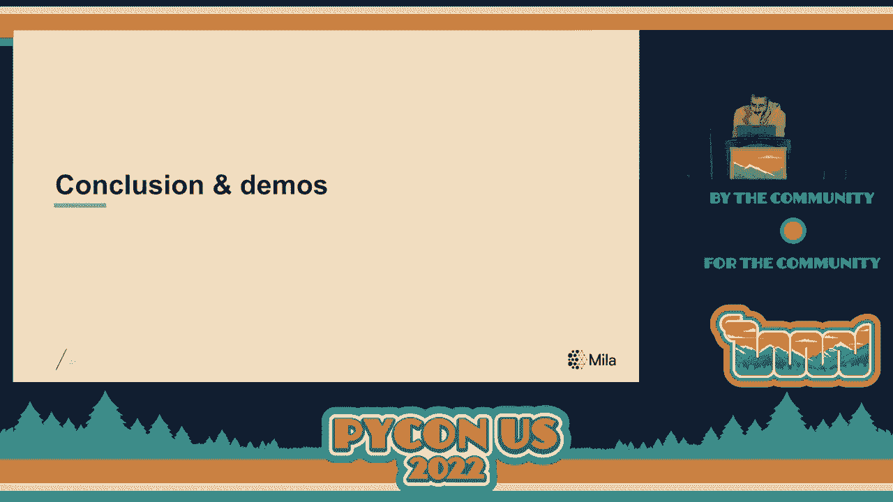
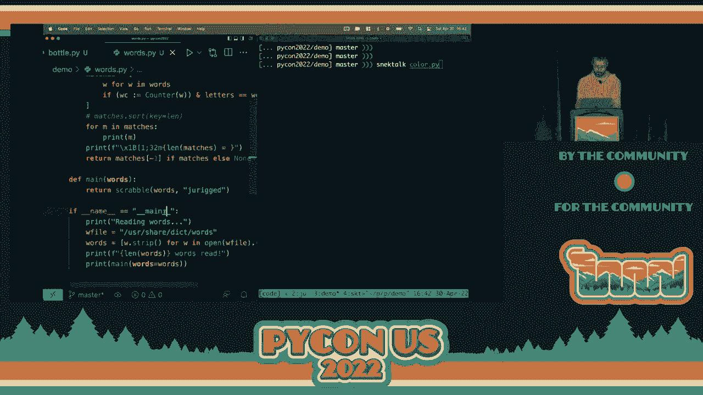

# PyCon US 2022 - P63：Talk - Olivier Breuleux_ How to change Python (while it's running) - VikingDen7 - BV1f8411Y7cP

 Hello everybody。 Let us give a warm welcome to Mr。 Olivier。 He's going to talk about how。

 to change Python while it's running。 [Applause]， >> Probably。 >> Hi everyone。

 Today I am going to show you how to change Python while it is running。 In other words。

 I am going to explain how life coding can be implemented in the Python， programming language。 First。

 what is life coding？ The definition that I'm going to use。

 is this。 Life coding is a development process where a program is edited at the same time。

 as it is run。 So that changes to that program may be observed in real time。 For example， at。

 the bottom here I have some code for a toy video game that I shamelessly pulled from a。

 Pi game tutorial。 While the game is running， we might do something like change the way。

 the acceleration works。 And when we do that， the game immediately responds and uses the， new rules。

 Of course， this is very nice for game development because of all the instant， feedback that you get。

 But you could also use it to update the rest back end without restarting， the server。

 Or you could fix a bug in the long running machine learning program where you。

 don't want to rerun the expensive pre-processing for each change that you make。 So if we look。

 a bit at existing life coding platforms， you will see that a lot of them are in the music。

 creation space。 For example， super collider or sending Pi。 Because they allow you to instantly。

 hear how the changes that you make to the code and to the parameters are reflected in， the output。

 Which is very helpful to get a feel for what is interesting or not to do。

 I must also mention the small type language which has been around since the 70s。 It's most。

 well known implementation， Squeak。 As well as its fork pharaoh。 Are built around the concept。

 of coding in a live environment， making it a pioneer in this field。 Regarding Python specifically。

 I think Jupyter notebooks kind of fit the idea。 Although it is limited to the cells that you。

 write in the notebook。 It does have one nifty feature that you can turn on called person。

 auto reload。 Also available in iPython。 Which is probably the closest thing to what I am。

 about to show you。 Now what I am about to show you is my own live coding library which。

 is called Jurigged。 And maybe if I have time I will also demonstrate a platform that I。

 call Snack Talk which I am building on top of Jurigged。 Before we dive any deeper into。

 the mechanisms and implementations of live coding。 In Python I am going to describe precisely。

 what it is that we aim to do。 Keeping in mind that every decision we make here is going。

 to have some trade-offs。 The most basic thing we want to do here is to be able to update。

 functions in the middle of a program's execution。 And I really mean in the middle of it。 So。

 you start your program。 It is executing as usual one step at a time。 And then at some。

 point you open one of the source files with your favorite text editor。 And you change。

 the code of some function and then you save。 What happens next？ What we want to happen。

 is that as soon as you save we want to patch the running process。 We will keep the execution。

 pointer where it is。 So for example here we were about to execute the Y function。 And。

 we will keep our position in the execution。 And we will also keep the program state。 But。

 we will change the function。 Which means that the next time that we call foo the new code， is run。

 And in the nutshell that is essentially all we aim to do here。 But there are a lot。

 of details to make a bit more precise。 For example， let's say we have this function f。

 which is in a module called mod。py。 And which I am using in this other module， test。py inside。

 this test function。 So I will call f in three different ways。 First I will fetch it from。

 the module mod。fx。 The second way is that I am going to use this reference to f that。

 I have imported directly。 Or I will simply fetch it from a dictionary in which I have。

 tucked the function。 These are all valid ways to call a function that I found in many existing。

 Python programs。 And what I want is that if I change the source code for f in mod。py。

 I want all of these references to be updated。 In this case， they should all return the new。

 result which is 1000。 Now you can see right away that simply we are not rerunning that， module。 Mod。

py is not enough。 Because it will just make a new f。 It will not change the existing。

 value of f in test。py nor the one that is tucked in the dictionary。 So the first call。

 will be adjusted but not the others。 So this is something that we have to watch for。 Next。

 we also want to update methods。 For example， maybe I want to add a talk method to the animal， class。

 Before I add this， if I create some animal， let's name her Bertha。 And that I， ask her to talk。

 I will get an attribute error。 But in that same running program， if I add， this talk method。

 what I want is not only future animals but also all existing animals。

 should suddenly gain the ability to talk。 In which case， even our Bertha will be suddenly。

 gifted with that ability。 And likewise， if I was to change an existing method， I would。

 want existing objects to use the new version。 Of course， there are some intrinsic limitations。

 to what kind of changes are acceptable。 Because while we can update behavior relatively easily。

 the same cannot be said of object state。 So if for example， you change the way objects。

 are initialized or change the internal structure of the data inside， old objects may become。

 inconsistent with the new behavior。 In this case， you might need to simply restart the， function。

 There is nothing that will work in every situation， of course。 Then we also。

 want to update closures。 For those who might not be familiar with the term， a closure is。

 a function that is nested inside another function。 For example， the one that I put in。

 a dashed box is a closure。 And it carries some state from the other function here， the。

 variable x from adder。 This commonly happens in Python。 You've probably done this before。

 For example， if you write a decorator that wraps a function to add some new behavior。

 that proper function that is defined inside the decorator is a closure。 And the example。

 that I'm showing here is merely the simplest closure that you could write。 The add function。

 in the dashed box inside of adder will add x to whatever number is given as an argument。 Why？

 So every time that we call adder， we create a new add function， which is packaged。

 with the value of x for adder。 So add one is the add function package with the value， one for x。

 And in the other file， add two is the add function package with the value two， for x。

 So when we call this test function with giving 10 to add one and add two， we will， get 11 and 12。

 So if we change that add function， ideally what we want to happen is that we want。

 to change these closures。 We want add one to change and we want add two to change。 So。

 I changed the plus for inextpicability for multiplication sign。 So now tests should return。

 10 and 20。 So one thing I will note is that if you use percent of the reload in iPython。

 it will effectively properly change add one because it is rerunning the module。 But it。

 will miss add two。 So in this case， you will get instead of 10/20， you will get 10/12， which。

 is inconsistent。 Again， there are some limitations。 For example， you cannot ask for more variables。

 from the outer scope in the inner function than the ones that the original asked for。

 So if there was another variable z that you wanted to capture from adder， that was not。

 captured previously。 You could not capture it because you cannot do that after the fact。

 It might already be gone and already collected by the garbage collector。 And the last requirement。

 that I am going to mention is precision。 By precision， I mean that we should only update。

 what needs to be。 For example， here I have a little program that simply loops over user。

 input and calls f on every number that the user gives。 If we update f， we would like to。

 keep running that while loop， but the next iteration， we will get， we will call the new。

 version of f on the next input。 The issue， of course， is that f is in the same file as。

 the while loop。 So we want to avoid running it again in the process of updating part of， the code。

 This is something that I haven't really seen in the existing solution doing Python。

 Maybe I missed it， but I feel that it's important。 Because a lot of the functionality that someone。

 might want to change in a program is in the main script file。 So you want to be able to。

 do these updates without rerunning the script from the beginning。 So how are we going to。

 go about this？ Well， the method that we're going to use is hot patching。 So that's basically。

 just patching functions during a live instance of a program。 So。

 to understand how to patch Python code， we first need to understand how the data structures。

 for functions work。 So I've taken the same closure example as before， but with outer and。

 inner as the function names。 And the structure of the function behind that is as follows。

 So the top left box is the function object for outer。 And it contains many fields， but。

 the important one that I want to focus on is dunder code here。 When I say dunder， I mean。

 two underscores before and two underscores after， just so you know。 And that field， dunder， code。

 points to a different object， a code object， which also contains many fields that。

 pertain to the function。 For example， there is a argument code and there's many other， things。

 But there's also this field that points to the bytecode for the function。 So when we。

 call the other function， it will read the dunder code pointer and fetch that code type object。

 And then it will read the bytecode and execute it。 If we have inner functions， then at some。

 point we will need to create a function for the， the function object for the inner function。

 In its dunder closure field， we will put a tuple of cells that contain the variables。

 that we're capturing。 In this case， x。 And the dunder code pointer will point to the code。

 object for the inner function。 And that object is originally contained in the CO_understore。

 core consts field of the outer functions code object。 So that's simply a list of all the。

 constants that are needed for execution， like literals， true， false， and certain code objects。

 So ultimately， as I've explained， we may have multiple function instances that correspond。

 to different captured values， but they all point to the same code object， ultimately。

 Now the interesting thing about Python is that these dunder code pointers can be modified。

 So you can take any existing function object and change that pointer to point to the code。

 of some other function or an object that you've made yourself。 This can be risky if you do。

 the wrong thing。 You can actually cause a segfault。

 but it basically allows you to change the behavior， of a function on the fly。

 So here's what we want to do。 Whenever we have new code， we。

 want to identify all of the functions that point to the old code。 And we want to change。

 all the dunder code pointers from the old code to the new code。 Alright。 With this in， mind。

 here's the plan。 First， we need to detect if a source file has changed。 There are already。

 libraries that do that very well。 For example， watchdog， which is what I have used。 So we。

 can simply watch for changes in the background。 And when there is a change， we can asynchronously。

 make the batch。 Then we need to identify which function or which functions were changed。

 This involves doing a structural diff between the old source code and the new and stripping。

 away the unchanged parts。 So I don't think I really have time to go in deep detail about， that one。

 so I will leave it at that。 There are a few ways you could do this that are better。

 than some others。 Once we have that， we will compile the new code in isolation to get a。

 new code object。 And then we need to find the old code object that corresponds to what was， changed。

 That step requires a bit of thinking。 Naively， you would think that it would be。

 easy to find because if I change the function f in module m， then you know， in module m。

 if I get the attribute f， it should basically be there。 And 99% of the case， that's kind， of true。

 But the truth is that it could be anywhere。 For example， maybe it is a function。

 that has a decorator。 And that decorator stashed it in deep in a dictionary or a different。

 module because maybe it's a handler for root on a web server。 There are legitimate cases。

 where that would happen， of course。 Maybe also the decorator has executed it and threw it， away。

 So it's not even around anymore。 There's nothing to update。 But in order to figure that， out。

 you would basically need to explore the entire heap。 And ultimately， I don't think。

 there is really any other solution to be thorough。 So I've basically done exactly that， but using。

 the garbage collection module。 So using the GC module， you can get all the objects and。

 basically find all the functions， cache their code objects， file and line number。 A priori。

 that's pretty expensive。 But ideally， we would do it once at the beginning if the hot patching。

 module is imported early。 And in that case， that's not too bad。 But of course， it raises。

 the question of what about modules that are loaded afterwards， right？ Thankfully， this。

 is kind of easier because we had the latitude to set things up。 One good way I have found。

 to do this is to use the audit hook feature。 This is a feature that was added in Python， 3。8。

 Essentially， it is a way to listen for events about the Python runtime when we open， the file。

 when we fork a process and so on。 And also， whenever we execute code。 So whenever。

 a new module is imported or whenever we execute user code， there will be the exec audit event。

 that will be triggered that you can watch for。 And it will give you the code objects prior。

 to execution。 So you can harvest the objects from there。 This is basically the simplest。

 and easiest way to have found to do this。 But still， that's not entirely enough because。

 we need to get a handle on every function object that points to that code object。 Now。

 many function objects can have the same code object。 And even though we called get object， earlier。

 they may have been created afterwards。 But in this case， there is still the getrefers。

 function in the GC module that will help us basically find all of them。 Again， this operation。

 is proportional to the number of objects in the heap， as I've found out。 But hot patching。

 doesn't -- is not an operation that happens often。 And frankly， it needs to be really。

 big before it is noticeable。 Now that we have everything， we can finally swap out the pointers。

 and then we profit。 Now， are we done？ Well， there are still a few kinks to iron out， I， would say。

 For example， if you only update code selectively for certain functions and。

 they have a different number of lines than before， then any function that is unchanged。

 but comes afterwards will now have the wrong line numbers in tracebacks。 So if we want to。

 have the good line numbers and we certainly do， then we also need to do some more to update， these。

 Another issue is that complex decorators that rely on code inspection or code signature。

 inspection will fail。 So what I'm thinking of in this case are just in time compilers。 For example。

 jacks。 I'm also thinking about single or multiple dispatch libraries that， use， for example。

 type annotations to do the dispatch。 And let me give you an example of， that。

 So this is code that uses a multiple dispatch library that I've written called， OVLD。

 which you can install with pip and try out if you want。 It's pretty cool。 So， yeah。

 in this simple example， I basically define a function F that has two behaviors。 So if。

 the argument is an int， then it will do this multiplication and then there's a fallback。

 function whenever it doesn't find a match that will just shrug。 So what happens if we。

 change these definitions so that instead of an int， we will have a float here and we will。

 add another dispatch so that we can do something special when the input is a string。 So ideally。

 we want the behavior to be adjusted。 So that before when we called F with an int， we got。

 100 but now there is no function for int。 So now it shrugs after the change and the same。

 for float and for strings it goes from shrugging to being warm and welcoming。

 The problem is that we cannot simply recreate a new OVLD object because other references。

 may exist and they would become out of sync and erroneous。 So we kind of want to update。

 the existing object。 At the same time， if we are going to do that， we need to update。

 the internal state of that object。 So if it has， for example， a cache of the name of a。

 type to a function to call for that type， we need to update that。 And there's really。

 no generic way that it could know how to do that。 It has to be a special code。 But what。

 if we had a protocol that libraries could opt into？ I have made one which may not be。

 perfect and the implementation might still be a bit buggy but here it is。 The idea is， this。

 When we have a code object and we search for the function that point to it， we could。

 also search for a special kind of object。 For example， this kind of conformr object。 So。

 when we do get refers， it will find this link between the function and the code。 And it will。

 also find this link。 And if it sees that， it sees a link with an object that has a donder。

 conform method， it would know that， okay， I have to call this with the new code。 And。

 then that object would know how to update the internal data structures of the other object。

 which is neat。 I think this is a fairly nice way to do it because it avoids having a dependency。

 on the hot patching library or any external library。 You just need to define that object。

 and connect the things properly and make sure that the reference to it is saved somewhere。

 And then if we are doing live coding that will be helpful， otherwise it will just sit there。

 and do nothing。 Right。 Okay。 So we're nearing the end。 So something that I wanted to do。

 is show you a bit how a jerk worked works。 So I'm going to。 Okay。 All right。 I assume。

 that's big enough， I hope。 Okay。 So the way jerk worked is that it works exactly the same。

 You can substitute the Python for it。 So instead of Python bottle。py， you can use jerk bottle。py。

 I'm going to add the V flag so that it's verbose。 And okay。 So here I have just the bottles。

 of beer song that is being printed out。 But I can， if I want， change the code to be a。

 bit more child friendly。 So now I have pints of milk instead of bottles of beer。 I can。

 do silly stuff。 And now it's a snake that's talking。 One thing I will mention is that if。

 you cannot modify functions that are currently running， well， you can。 But the changes would。

 only take effect after the second time you call it。 So for example， I have updated this。

 here in the sing method， but it is still going one at a time because it is in the middle of。

 executing sing。 But the next time I would call sing， it would adjust。 I can change this。

 though to go a bit faster。 So that is one way you can use jerk so on any existing program。

 I also wanted a way to use it in a development setting where you're not necessarily organized， with。

 where you didn't necessarily write your own loop and so on。 So I have this other example， here。

 Okay。 So this is like just a simple example。 So the idea is that when we execute， this。

 we get this little interface where everything that's on standard out is printed out。 And。

 we also get the result here。 So of course I can change this here。 And it re-exacutes。

 from the main function which I have specified on the comment line。 So you can specify any。

 function in the module。 It will basically stop there and let you develop it restarting if， needed。

 I can modify other functions like I can remove the sorting and then it doesn't， sort anymore。

 I can do， if I do something that is an error like this， then it will show， me the error。

 And I can fix it and it will run the thing again。 And then finally I can。

 continue and then it will just continue the normal execution of the program。 Right。 Okay。

 I still have， still have a minute。 So the other thing I'm going to show you is snack， talk。

 So this is something that I've built on top of， of Gureg。 Right。 So this is an interface。

 where you can， well， you can print out arbitrary objects and they have like this graphical representation。

 So that's a random colors function。 I can choose to edit it。 Okay。 That was actually the edit。

 I wanted to make。 But yeah。 So， so yeah， I can basically change it and it will， and it will。

 change the behavior。 But I can also save it。 So， so you can see the coding original source。

 file here。 Once I've changed it here， I can choose to save it and then it saves it back。

 into the original source file。 You can also use it to， I don't know， to edit， you know。

 built-ins and stuff like that。 And you can even save them back。 That's like the worst。

 foot gun I've ever written。 But anyway， that's， that's basically it for that。 Okay。 So， right。

 So in conclusion， it is possible to add patch functions， methods， closures most of the time。

 which is what I have implemented in Gureg。 It is also possible to implement multiple dispatch。

 and code transforms via a protocol。 Here I have called it the Thunder Conform Protocol。

 And I've implemented it in a separate library that I called CodeFind。 If anyone wants to。

 look at it， I would appreciate it。 So yeah， that's it。 Thank you。 If you want to have， the slides。

 you can scan the QR code。 And also if you want to try out Gureg， I have also， a QR code for that。

 So that's it。 Thank you very much。 [Applause]。

