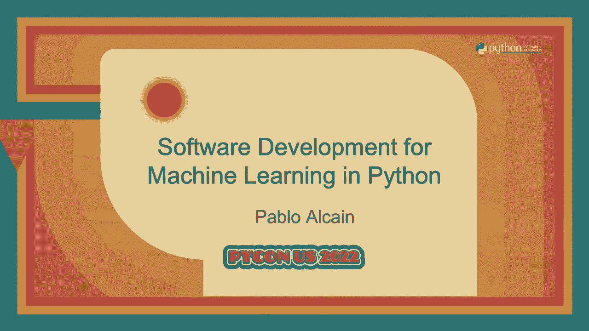
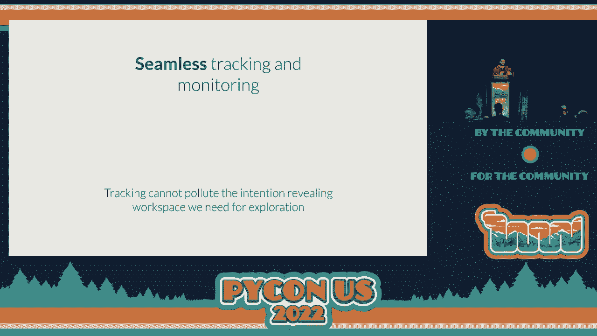
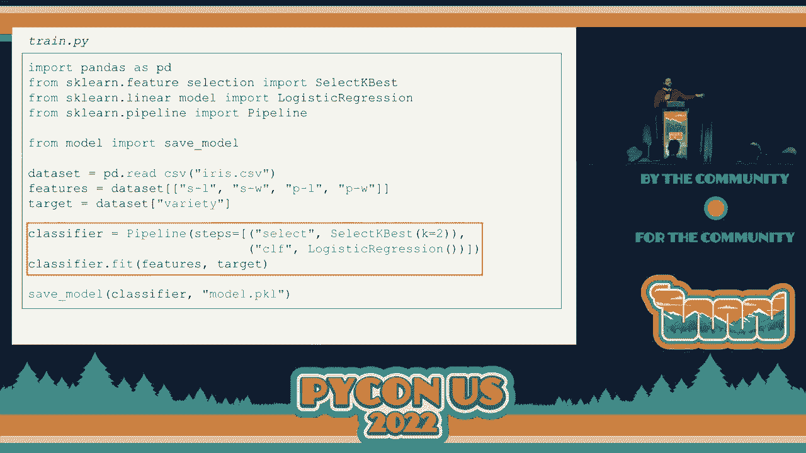
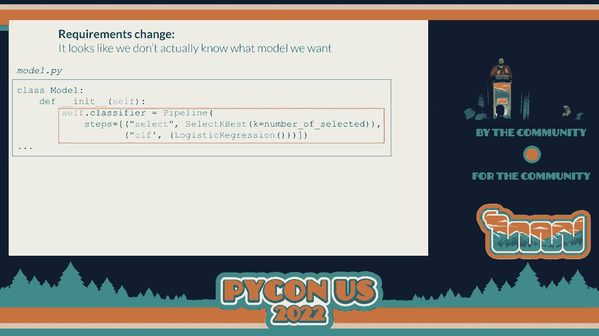
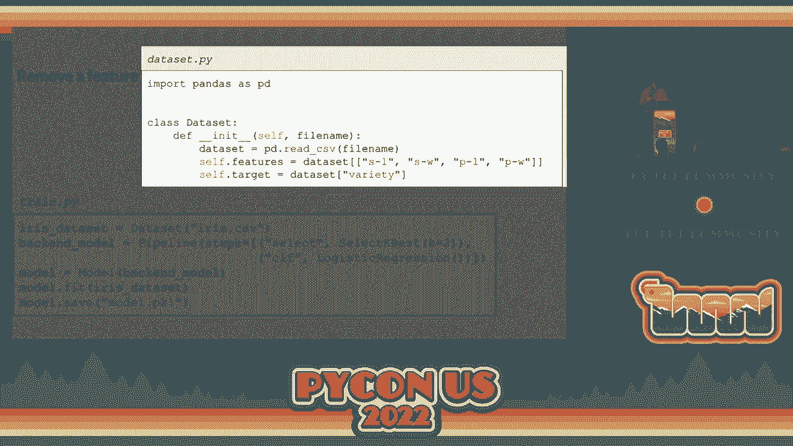
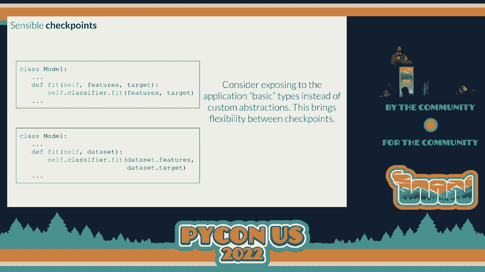
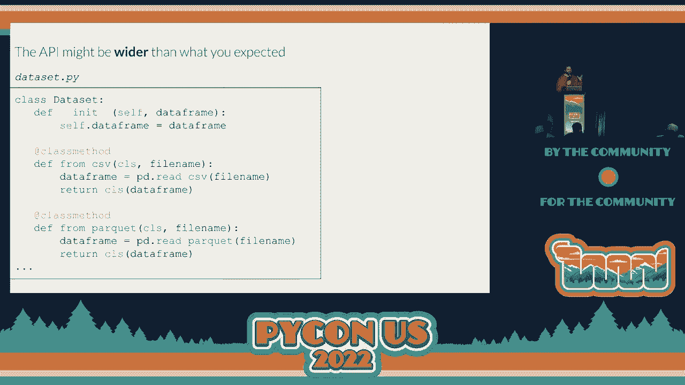
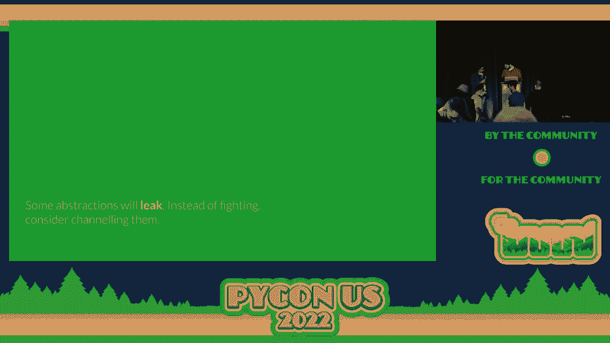

# PyCon US 2022 - P64：Talk - Pablo Alcain_ Software Development for Machine Learning in Python - VikingDen7 - BV1f8411Y7cP

 Hello everyone， welcome back。

 We have an next talk by Paolo Alkain on software development for machine learning in Python。

 Over to you Paolo。 Now it's better right， you will have a constraint to my hands a lot。

 Let's hope that it works。 First of all， welcome everyone。 Thank you very much for attending。

 I'm very happy to be here and thank you also to all the crew that made this possible and。

 make this possible every day for this amazing conference we're having。

 I'd like for us to have the following minutes discussing a little bit about something that。

 is very interesting for not only for me but also in the latest developments that we've。

 been having in the machine learning industry as a whole and it's trying to discuss a little。

 bit what kind of software development we need in machine learning。

 So let's begin by taking a very simple problem。 This is a very well-known problem that happens everywhere if you go to a tutorial of scikit。

 learn or many pages that try to ease you into the classification problem you probably。

 are aware of the ideas classification。 Here we have the ideas flowers in which the idea is for us to be able to classify them。

 all by four of the features。 The petal length， the petal width。

 the sepal length and the sepal width。 And from these four features we have to figure out which of the variety it belongs to。

 If it's a cetosa， what's the color of the vinegar？

 Just like first disclaimer first of all since these are going to be a slice you will see。

 like the strings of the columns being way too shortened。 This is not something that I encourage。

 It's better to have the best column names as possible but we are saving real estate in the。

 slides in this case。 I want to say that's not in favor of naming columns like this in production code。

 Now the first thing that you can do when you take a look at this problem and how to solve。

 it usually you spin up an old book or a Python interpreter or whatever and you start working。

 with it as a playground。 Like trying new ideas and figuring out how to solve this problem。

 So a very simple solution to this problem can be this one here。

 Very simple solution to this problem in which we are using the technical stack that is very。

 usual for machine learning developers or data scientists that is basically using pandas。

 and side idler。 So you can see the bunch of imports in the beginning and then we are basically loading。

 a data set。 From the data set that we've loaded as the CSV we recognize the features and the target。

 And then we will classify it with the pipeline object that we have from scikit learn。

 In this case this pipeline object consists of two steps。

 In the first one we select the two best of the features according to a specific criteria。

 even we can choose it。 We want to。 And from those features we classify them with a elastic regression directly to see to。

 figure out which variety they belong to。 This is like the declaration of the classifier。

 In the next step we actually do the fitting of the model。

 What we normally know as training of the model of machine learning。

 And then we compute the accuracy score that we have over the training set。

 This is only just to show one of the things we can do。

 Again I'm not saying that you should figure out the accuracy of your model on the training， set。

 But after we calculate the accuracy we simply inform and realize what's the accuracy score。

 that we got。 Whoa I didn't expect that。 There's something strange going on with the slides。

 It's like I'm having a subslide under my slide。 This is not being shown here。

 Let me just try to quickly sort this out。 Okay。 So this is like live settings。 Oh my。 Okay。 Wow。

 Okay so yeah it looks like some machine learning model understood what I was trying to。 Okay。

 Let's get it from here now。 Okay。 It might happen again。 I don't know how I solved it。

 So probably I have to troubleshoot it again if it happens。

 Now this is what we have as the play done。 Usually actually this pipeline that we are seeing here is what I took almost verbatim from。

 the tutorial that you have inside it learned when you try to implement the pipeline。

 Now when we have to put this into production there are like several hurdles that appear。

 when we try to put this tiny source of code in production。

 This is a very well known image from a paper known as hidden technical depth in machine。

 learning systems。 I recommend every data scientist machine learning developer or machine learning engineer。

 that hasn't read this yet to take a look at it because it will allow you to see what's。

 on the other side of your scope。 If you're a machine learning engineer you'll realize what are the problems that typically。

 data science have when taking a look at when working with production code and vice versa。

 Taking things into production implies a lot of different challenges。

 I won't name all of them but basically I think that the ones that we usually don't consider。

 when thinking about this are the least we as data scientists。

 Sometimes we don't consider the continuous training in the deployment， the provisioning。

 of infrastructure to actually do the training of the models， the model tracking and then。

 how to serve it。 This is only like a subset of the multitude of problems you can see。

 not problems but challenges， you can see when you have to put this into production。

 One of the key elements of the paper that we're seeing here is that the machine learning。

 code that we've just built is only like a small part of this whole structure。

 I'm going to discuss today how we can make this small but very fundamental part of the， code。

 how we can make it work so it can serve the purpose of going into production and also。

 having an easy exploration for the scientist mission。

 Why do we say that it's important for the data scientist or the machine learning developers。

 to know how the codes are going into production？ What we say is that the developer experience of the data scientist is very tightly coupled。

 to what production looks like。 In the first example。

 let's suppose that we have a scientist that does a couple of changes。

 maybe on this way it's more than we've just seen and deploys it to production directly。

 By saying deploy to production， what we're saying is that he or she is the one in charge。

 of actually writing what we call production code。 What is going to belong to this structure we've seen before。

 In this case it's clear that the data scientist or machine learning developer has a lot of。

 coupling with how production code looks like。 But it's also relevant to notice that if the next data scientist comes and they try to。

 do some changes on top of this， they have to be able to understand what the production， code was。

 The coupling between the experience is both for the first writing of the code but also。

 for understanding the code to actually do changes afterwards。

 Now there's another extreme solution that we can think about it that's put like a barrier， there。

 We put the machine learning engineering team between the data scientist and the production。

 code and we say hey， you're not going to be the one writing the production code。

 Don't worry about it。 You just think about the model， think how it works。

 do it all in your play down and I， will be in charge of writing this into production code。

 And while these looks like can't decouple the data scientist from production code itself。

 the problem remains when the next data scientist comes and try to understand what's happening。

 They have to get the latest code that we have in production and they have to understand。

 what it means and how to work with it。 Now this can be solved in many different ways。

 One possibility is to say that the machine learning engineer is the one that's going to。

 explain the production go to each of the data scientist。

 Another possibility to say that the data scientist has to talk among each other and these are。

 all like very usual solutions that work well in many different aspects。

 But today I want to discuss with you a software design solution for the productionization of。

 machine learning code。 What if we can learn how to write this code so that it works according to the following。

 four pillars？ The first one is that the goal has to have fast and easy exploration。

 We know that the solutions that we have for these problems are very speculative and the。

 models change way too often。 So we have to allow the data scientist to work with new ideas on top of the production。

 code。 But we also wanted to be declarative and intentional revealing。

 Martin Fowler put it much better than I probably can do and one of the things that he said。

 was that the goal is the only artifact that we have that is sufficiently detailed and。

 precise to act as documentation。 This doesn't mean that we don't have to write any documentation apart from the goal。

 Of course that's not what I'm saying。 What I'm saying is that we have to seize the opportunity of this production code here。

 We have to be able to take advantage of the code that we have in production。

 We have to make it as declarative as possible。 Another important thing that we need is to have what we will call sensible checkpoints。

 We will then try to define better what I mean by this。

 But the main goal that we have here is that if we have a pipeline in which we are doing。

 many different stuff in the whole production code， we want to be able to hook into a problem。

 with our own solution that we have before and simply reuse one of the steps。

 We also want to be able to hook out of the problem and use the previous steps as things。

 for our exploration and so on。 The reusing of these steps is very important。

 Keep in mind that sometimes it's even like a necessity because some of these steps can。

 take way too long to run and if you have to wait like four or five hours for a step to， run。

 you won't be able to fasten this exploration。 And another very important thing is that we need to have seamless tracking and monitoring。

 of the code that's working in production。 And by this。

 I mean that we have to track the code but we cannot track it in a way that。

 pollutes the declarative and intention code that we've just described。

 Suppose the case in which we are seeing the same play-run code that we have but we have。

 like 30 or 40 calls to lock this， lock that and so on。

 This is a solution that while it does lock the model， it pollutes a lot the development， space。

 So we want to avoid it。 Now with these four pillars that I've just discussed。

 we're going to do like a caution， detail on the productionizing of the model that we have just seen。

 Now this is the training file that we've just written down。

 The imports are now collapsed and they will probably collapse for some part of the talk。

 Let's just keep in mind what important whatever it takes for it to work。

 So this is the code that we've just had。 And one of the things that we realized from the code we were seeing here is that there's。

 no way that this is going to go into production。 Why？

 Because the model that we've just trained in the classifier。fit line only lives inside。

 the scope of this Python file。 We need to find a way to persist this model somewhere for us to be able to load it later。

 on to do whatever we need to do， for example， I don't know， like an online serving of the。

 model and things like。 So the first thing we realized is that instead of checking the accuracy code。

 what we actually， want to do is to save the model as a pickle file， for example。

 You know that pickle is a library that's very useful for this。

 We can load it directly with this very simple two sentence here， thanks to the with statement。

 Now when we do this， then the prediction part of the file that we have， we'll actually load。

 the model file that we have。 And on an unseen data set， this unseen i is that we're seeing here。

 we will predict and， naturally checking the accuracy score here， right？

 Now keep in mind that this is just one of the possible implementation of the prediction。

 Of course we can do it this way from the moment we decouple the training from the serving， we。

 can actually serve with， I don't know， through a rest endpoint or through fast API or however。

 we want， we are free to do it in any way。 So consider this file as a token for all the possible ways in which we can serve the model。

 once it's persisted。 Now the first thing we realized in the goal that we've just written is that we are exposing。

 implementation details， right？ When we take a look at these two things， we're saying， hey。

 maybe we don't want to tell in， the goal that we are seeing how we are saving the model。

 if we're saving it with people and， however it's something and we want to abstract， right？

 We want to abstract it away。 We know how to do it， right？ We abstract this into functions。

 We create the save model function and the load model function that is in charge of actually。

 doing this under the hood。 The moment I do this， two things。

 two very important things start to happen。 The first one is that you can see in the train。

py file that we've just removed this with statement。

 that was maybe two of our rows and put it in a declarative fashion， right？

 Now we know that we are actually saving the model somewhere。

 But another thing that starts to happen is that we've now split the whole goalbase， well。

 the whole goalbase， just three files， right？ Anyway。

 we split the whole goalbase in two different semantic spaces。

 One is the one that we are seeing on the top。 That's what we're going to call the library space。

 right？ These are the things in which we're going to develop all the tools that are going to。

 be using the application space that are the things in the bottom， right？

 So what we are going to do now is work on the library space to see how we simplify the。

 application code that is what we expect the data scientist or the machine learning developer。

 to iterate on top。 Now after we do this， right after we build the save model function， yeah。

 and the low model， function， this is now what the train。py file looks like。

 See that this is important， that's why I left the imports here， that now we are not。

 importing people directly， we are importing from our own library the save model function。

 And now we take a look at this that we have and we say， hey， there's something similar。

 to what we've just seen going on here， right？ What's going on with this classifier that we have？

 Kind of with something similar to what we've done with the load model and the save model。

 We have this idea， right？ We need to abstract them into functions。 And with this idea。

 I will give you a little spoiler。 This is where like the fall of our approach begins。

 So I want to make it very， very clear。 I didn't know how to make it clear enough that this is how we start to go down a slippery。

 slope that we will see what kind of thing it goes beyond， right？

 So it doesn't matter， right？ We don't know the spoiler yet。

 we're very happy and we're like building this fit model。

 function that what it's doing actually is loading the classifier and doing the fitting， itself。

 right？ So this is the part of the fitting of the model。

 Now one of the things that we know and Sandi Metz put it in an awesome fashion in a talk。

 that is called， I think， all the little things。 If you haven't seen it。

 I recommend you go and see it， that when you're seeing this kind。

 of pattern in which you have like a repeated prefix or a repeated suffix in your code。

 what you're seeing is actually an object in there being tortured， screaming to it out， right？

 There's an object here that we have to find out its name。

 And it's very clear here that the object that we are seeing is the model object， right？

 So we do a small refactor and we change the function that we have into methods of these。

 model objects。 See， now it looks even prettier， right？

 Because the classifier now belongs to the init part and the fit only that's the fitting。

 And the train。py file still looks very declarative， very intentional revealing and now more in。

 this like object-oriented fashion， right？ Now we're not only content with this。

 this path we've gone through。 We also say， hey， there's something similar going on with that asset。

 right？ Kind of I do something with that asset similar to what I've done with the model。 And again。

 I'm not going to start like putting these into functions and so on。

 We already know like the end of this tail， we will build the data set object， right？

 So the next step we do is to say， hey， maybe like the features and the target that we're。

 seeing here are part of an abstraction that is called the data set object。

 And we want to give you the name， right？ We have the data set。

 That is what we're going to do and the features we have written down there inside the constructor。

 what the features and the target mean。 And now we take a look at the train。py file that we've seen。

 And man， doesn't this look like much cleaner than what we have before， right？

 We have a much more concise code and we even got the chance to put our abstractions in here， right？

 So the model。fit doesn't take like the features on the target like it used to before。

 We now take the data set that we just build right now with an abstraction。

 Now we're very happy with this， but as I told you， this is not how the story ends well， right？

 Because now all of a sudden someone tells us， hey， we don't want to pick the， we don't。

 want to pick always the best two of these features。 Sometimes you want to pick three。

 sometimes you want to pick one。 When you work your code。

 someone that is just trying to know how it's just trying to do， an exploration of this data set。

 right？ They just want to see how it would perform if we didn't have to pick the best two features。

 And we say， okay， we know how to do it， right？ Let's keep calm， keep calm。 We know how to do this。

 We， instead of half-golden the two they are， we pass the number of selected features， the。

 parameter， right？ And now we are very happy because we've saved the day， right？

 Now you can pick the number of selected that you want， right？ The， the required。

 the requirement is fulfilled。 And all of a sudden they say， hey， well。

 sometimes we don't actually want to pick， we， want to lose。

 you do the little situation on all of the numbers that we have， on all of， the features。 And we say。

 okay， we can make this work， right？ Because I'm going to put a。

 a contract with you in which if the number of selected that， you're sending is none。

 then I will completely disregard the， the selection step， right？

 And now this is like feeling kind of weird， right？ I mean。

 having this comparison with na and it's not something that we， we enjoy a lot。 But also。

 we are like in， in the drift of， of making all these changes that people ask， for us。

 And all of a sudden someone tells， well， actually we don't always want to do a 60 regression。

 We want to try out like a multi-layer perceptron。 And we are like so deep in this train of thought that we've just shackled us into that the。

 only thing we can think of is just adding another if to this construct， right？

 This is something that happens a lot while you're trying to give to your library the。

 flexibility that it's needed， right？ So now if the， the， the previous part was a bit， uh， uh， uh。

 e-de。 Now this is like completely terrifying， right？ We have the comparison with the string。

 We have， we have to raise a narrower if someone like， even did， I don't know， like a small。

 typo when passing the classifier type， we， this doesn't make any sense at all， right？ I mean。

 we're not going through the， through the right path here。 There has to be a better way to do this。

 And then we realize that the problem is that we don't actually know what， what is the model。

 that we want， right？ All the things that have been changing。

 What I actually explaining is that the model， as we said， is very speculative and we will。

 never know what the model looks like。 So the main problem that we're having from the beginning is to say that the model has。

 to be instantiated in here， right？ That the classifier has to be in here。

 What if instead of instantiating the model here， we simply pass it as a parameter， right？

 In the constructor， instead of doing， of doing like all those weird stuff that we've done。

 with the strings and with the number of selective with none and so on， we simply say that the。

 backend model and I mean backend in terms of the， the one that is actually going to be。

 doing the computing of the fit can be passed as a parameter in the constructor。

 Now this is what the model looks like when we start doing this and what we just figured。

 out here isn't anything new， right？ We haven't like discovered anything。

 It's like a very well-known design pattern of a object oriented design that is called。

 dependence injection， right？ Actually if you're familiar with the solid acronym。

 dependence injection is the D in the， solid acronym， right？ That's how important it is。

 For us in Python， usually dependence injection just means parameterizing something in the。

 constructor， right？ And as typical in this dependence injection and composition mechanisms。

 what we end up， coming is the delegation of the methods， right？

 So the fit that we're calling from our model class actually delegates the call to a fit。

 of the backend classifier， right？ This is a， like a figure that you're going to see happening a lot when you start doing。

 dependence injection and composition。 Now this is what the model looks like and see that what we have done is removing the。

 coupling from the model that we've just built。 We've removed the coupling from it and the actual implementation that we want to do。

 right？ Now the implementation is also back in the surface。

 So now we have this idea of dependence injection as fixing some of the problems we've just like。

 put ourselves into， right？ But then of a sudden someone tells us， I want to remove a feature， right？

 From the other side that we have， I want to simply remove a feature away。

 It's not something that is going to go into production。

 I just want to know how the model will perform if we didn't have one of these features。

 And we take a look at the goal that we have and we say on one hand， well， yes， maybe some。

 dependence injection can help。 I'm not saying that that that it doesn't。 But nonetheless。

 if this is what we want to do， we will have to re-implement the removal。

 of features inside of this code， right？ I mean， we will have to write it。

 we will have to document it， we will have to test it。

 we will have to troubleshoot any problems that the users are going to have。

 So what we're seeing here is that in this data set。py file， there's something different。

 that we have to do。 And what we need to do to answer the question of what's the challenge that is putting down。

 here is to reflect on what we've done， actually， when doing the dependence injection， right？

 I argue here that what we've done isn't only the dependence injection of the cycle-learn。

 model in the model step， but we've also exposed a known liability to data scientists， right？

 By doing the dependence injection， we didn't introduce any dependency。

 The dependency that we are introducing is the psychic-learn library that scientists are。

 very familiar with， right？ They come already with this stack。 If they have any question。

 they know how to rule for it， they know how to stack overflow。

 they know how to communicate with each other about possible solutions。

 So what if we take this lesson from what actually worked from here and we do a similar thing。

 with the data set？ Right now the data set， instead of loading the CSV file and splitting into features and。

 targets， and the targets， sorry。 Now it simply fills the data frame attribute and we leave it exposed for everyone to use。

 it， right？ So the target and the feature selection are done in the application code and then it's。

 changed that we want to make is right away， right？

 It's at the tip of our hands when developing the application。 So what is here that。

 what is it that we have been building here， right？

 And I'd like first to take a moment to reflect on how it is that this works out。

 What we have been building with the data set， with the model and so on are just abstractions， right？

 And there are many ways in which you can define the abstraction in software engineering， but。

 the one that I really like a lot is the one that Shoyl Spolsky wrote that is very simple。

 but also cuts to the core of it， right？ That an abstraction is a simplification of something much more complicated that is going。

 on under the colors。 And why do I like this explanation a lot？ First of all。

 because it's like in a very plain language， but also because it exposes。

 the subjective thing about what's an abstraction， right？ What's an abstraction。

 what's an implementation detail？ All of this is very subjective， right？

 We cannot know beforehand what should belong under the colors。

 We don't know beforehand what is much more complicated， much more complicated for whom， right？

 Probably for the other scientists working with like， you learn it's not much more complicated。

 at all， it's something that they have been doing for a lot of their professional time。

 In this article that is called the Law of Leake abstractions， that is 20 years old。

 this is still amazes me， right？ It's 20 years old and to me it's evergreen。

 Schrodel Spolsky writes the law of leaky abstractions。

 What he says is that all non-trivial abstractions to some degree are leaky。

 What does it mean to have a leaky abstraction？ What it means is that no matter how hard we try to hide the implementation details under。

 the colors， some of the things are going to go back to the surface， right？

 Some of the things are going to appear， they're going to leak into application code， no matter。

 how much effort you put in hiding them in the library code。

 That's this mean that we don't have to be abstractions， absolutely not， right？

 We have to be abstractions， but we have to be wary of this because what we are seeing here。

 is not only like the law of leak abstractions working out in the wild。

 We're also seeing pressure for these abstractions to leak， right？ The data scientists。

 the users of the application code are putting pressure for us to leak this。

 implementation details or what we thought were experimentation details。

 There is pressure for them to go back to the surface， right？

 So we'll have to make this compromise in our own abstractions， right？

 We have to let the abstractions leak because they will eventually do it。

 But from the moment we recognize that this is something that will happen and that simplifies。

 the exploration， we can choose how they leak， right？

 So what we have been building here is not like simply a library。

 We're not trying to recreate pandas， nor recreate scikit-learn。

 What we're trying to do is to provide a framework for the code development and while we're doing。

 this framework， we're leveraging the knowledge of Python， of pandas， of scikit-learn that the。

 application user already has， right？ We are using them in our favor and this would work also in the case of many other different。

 libraries， right？ If the library was a Pyspark， TensorFlow， PyTorch。

 whichever of the libraries that we have in the， stack。

 we can do a similar approach in which we leverage the knowledge that the application。

 user has and use it in our favor。 So let's take a look at how this tries to fulfill the four pillars with the case in the beginning。

 First of all， the fast and easy exploration and I want us to think now that， suppose that。

 one of the things we want to try out is what would happen if， I don't know， if we removed。

 the long seples， right？ What would happen if in our dataset we wanted to remove the seples that are longer than five？

 So the exploration is trivial， right？ That scientists already know how to deal with pandas。

 they already know how to write this， query that is maybe like two or both for us。

 We don't think about putting these like this directly into production， but they can do it。

 if they want， right？ So we are allowing the possibility of this kind of exploration。

 But now how do we make this declarative and intentional revealing？

 And this is where the power of the abstraction works in our favor， right？

 Not only the leakish works in favor of the application called the developer。

 but the abstraction works， in our favor as well。 Because we can remove the long。

 the weird query that we have that can be much， much larger， right？ And much with much more detail。

 we can abstract it and verify it into a method that is declarative。

 and intentional revealing enough。 So now when we take a look at the call in train。py。

 we are very clearly seeing what's， going on in here， right？

 We are not seeing like a query and pandas out in the wild。

 We are seeing that we are removing the long seples from the dataset， right？

 Another important thing here is what we've discussed are sensible checkpoints， right？

 The ability for us to latch on and latch off the production code whenever we want。 And for this。

 I want to say something。

 There's a lot of stuff we can discuss in the checkpoints， right？ From persisting to， I don't know。

 to changing temporal views and so on。

 But I'd like for you to consider the idea of exposing the basic types and by basic types。

 here I also mean data frames， right？ To consider exposing the basic types instead of your custom abstractions。

 This is what is going to be doing flexibility between checkpoints， right？

 Because this is what will allow people to feed the features and data sets， however they。

 built it as pandas data frame， right？ So we will prefer or at least consider the idea of doing the implementation on top that。

 has the feature on the target explicitly written down there instead of the feature instead。

 of the implementation on the bottom part of the screen。 Now I should say something。

 Just be wary when you do this， we don't have to pollute completely the code with basic data， types。

 This is like a very well-known code smell that has to me one of the best names of them all。

 that's called the primitive obsession。 We don't want to be obsessed with using the basic types but we want to know when using。

 them is a good compromise to provide the flexibility。

 How does this help us for seamless tracking and monitoring？ Again。

 now the abstraction is working in our favor。 Now inside the feed model that we were seeing there。

 we can add simply a login line， right？ With the custom lower， however we want to build it。

 there are many tools to do it automatically。 I'm not saying that you have to write a logger by yourself。

 What I'm saying is that however you get to that logger， you can insert it in the app in。

 the library part without touching at all the application， right？

 This is one of the advantages that we have。 Again。

 the abstraction playing in our favor for us to work on it。

 One word of caution when you start to do this kind of stuff that is going to happen。

 the API might be wider than what you expected。 This is like a recurring theme when you're working with library development。

 is that you， want to have your library as a arrow and as deep as possible， right？

 So not to expose a lot but expose things that have a lot of depth， that do a lot of stuff。

 that abstract several things。 Again this is something that we should strive in general when trying to develop the code。

 but keep in mind that for the cause of the abstraction leakage that we're going to have， here。

 we will probably end up with wider APIs than we wanted to。

 This is an example that right here that will probably happen the second you start doing。

 this kind of development in which different people say， "I want to load sometimes from。

 a data frame， sometimes I want to load from a CSV file， sometimes I want to load nothing。"。

 These kind of things are going to happen and we need to make sure that we provide this， flexibility。

 Always， as I said， being very cautious about what you're using for exposing to the application。

 and what you're using for your internal development。

 This is like a distinction that probably you can make in order to handle the complexity。

 that will come eventually with this。 Of course， if the APIs get too wide eventually。

 you might think about doing a little bit of， refactoring and thinking about how this is a composition of different methods。

 But essentially， keep in mind that one of the goals that we cannot forego here is that we。

 have to give sensible checkpoints and fast exploration for the people that are going。

 to be using our library。 Okay， now， as conclusions， first of all。

 one of the things that I've learned while doing， this kind of stuff is that what is an implementation detail lies in the eye of the beholder。

 What for one can be a detail of very complicated things that we actually want to happen under。

 the whole。 For some people， it's the code of what they are developing。

 We need to understand the duality of the implementation and where it's a detail or not as quickly。

 as we can so we can use it in our favor instead of fighting against it。

 Another important thing is we have to allow the flexibility of the application goal by。

 letting it speak the language of the developer。 We have application goal developers that already know a lot about pandas。

 that already know， a lot about PISPARC， a tensorflow。 Don't hide this away from them。

 Allow them to write the goal in the same way that they have been learning for their。

 entire professional lives。 Allow them to write things in a language that is common for these application developers。

 They can travel through questions with each other。

 They can even ask them in a wider forum and leverage help from different sources。 Another thing is。

 as we mentioned， some of the instructions will eventually leak to the， application goal。

 Instead of thinking hard about how we can make these abstractions， how we can prevent。

 them from leaking， we can just be in peace with the fact that they are going to leak eventually。

 and instead of fighting them， channel them to leak in a way that allows us to have the。

 goal with fast exploration that eventually gets to be the clarity that the customer。

 will check points and that allows us to have seamless tracking of the experiments。

 That's it that I have for now。 Thanks。 Thank you， Paula， for the excellent talk。

