# PyCon US 2022 - P85：Tutorial - Ariel Ortiz_ A Pythonista's Introductory Guide to Web Assembly - VikingDen7 - BV1f8411Y7cP

 Good morning， everyone。

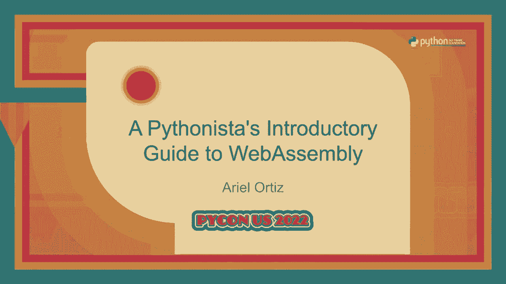

 Do you have a good trip？ Yep。 Awesome。 Okay。 Thank you very much。

 Thank you for enrolling to this tutorial。 Okay。 I just sent a message a moment ago sharing this link as well。

 If you're unable to type this， check out the messages at our website or at the conference， website。

 Okay。 So， I think we're going to start now。 My name is Ariel Ortiz。 You can just call me Ariel。

 I'm a full-time faculty member at Technological Monterey。 This is a university back in Mexico。

 It's the largest private university there。 I've been in the teaching business for several years now。

 I've been actually a full-time faculty member for 28 years。

 And I started coming here to PyCon recently。 Well。

 relatively recently 2017 was the first time I've come to this conference。

 It was really awesome to be here again after two years of not being able to see everyone， in person。

 I've been working with PyCon since， I think it was a year 2001， so I have a little bit。

 more than 20 years using the language。 I really， really like Python。

 It's one of several languages that I use in my courses。 Well。

 this is a Pythonesis introductory guide to WebAssembly。 Once again。

 this is a really interesting topic and it would take us a lot of time to actually see it in much more detail。

 So hopefully after this tutorial you should have a general idea of what it is。

 And if you're interested in going deeper， well， I'll give you some pointers so that you can check more information。

 But once again， just to keep our expectations in place， just have in mind that there's a lot to see。

 And we're just going to cover a little bit of this really awesome technology。

 So these are the tutorial notes。 Hopefully I hope everybody is connected to the internet。

 to the Wi-Fi， because we're going to be working on the cloud for simplicity's sake。

 So what we're going to be looking at today， these are the four main topics。

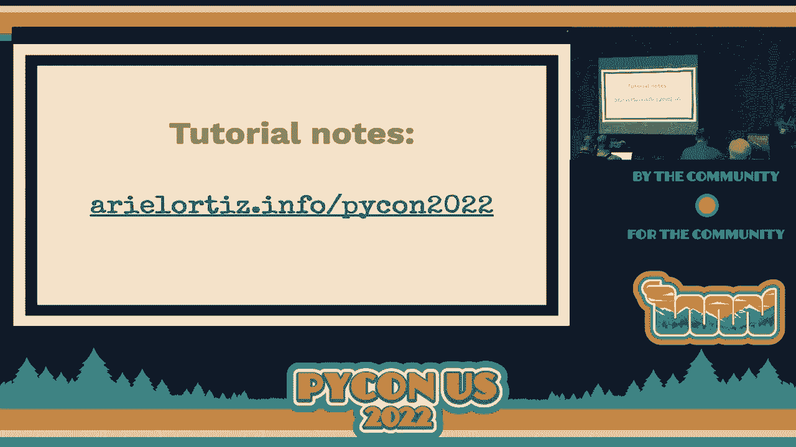

 First of all， we're going to be looking at what is WebAssembly in general overview。

 And then as a second topic here， we're going to look quickly to this technology called Pyodide。

 This will allow us to see how we can use Python on a web browser thanks to this WebAssembly technology。

 Our third topic is hand coding WebAssembly。 We're going to have a hands-on experience on how to write a little bit of WebAssembly by hand。

 And finally， our fourth topic is writing a tiny compiler。 Actually。

 most of the compiler is actually written。 We're just really going to explain how it works and you're going to be having the opportunity to extend it with some additional functionality。

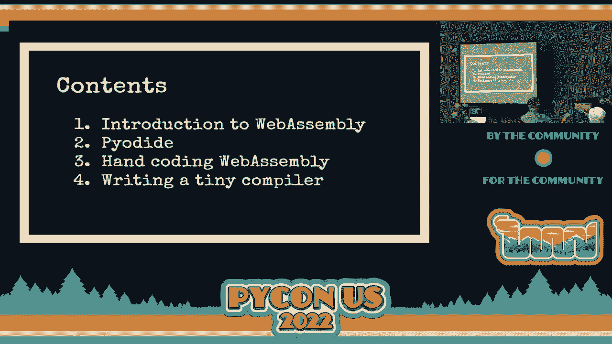

 Okay？ So what is WebAssembly？ Okay， WebAssembly is a binary instruction format for a virtual machine。

 We call it a stack-based virtual machine。 So it is what we call an instruction set。 Just like x86。

 just like ARM， just like the instruction set for the Java virtual machine or the instruction set for the common language infrastructure。

 Which is the 。NET technology。 Basically， it's a series of instructions that are executed。

 In this case， we call a virtual machine because it's not really a CPU which is in hardware。

 It's actually a software machine。 But we can get some really interesting properties when we actually use this。

 So what's special about this？ I mean， because once again。

 this idea of having a virtual machine is really not new。 It's something that we've had since many。

 many decades ago。 Specifically， WebAssembly was designed to be a portable compiler-generated language for implementing client and server-side applications。

 Okay？ It's not meant to be written by hand， although we're going to do that here。

 I think it's really interesting。 It's really educational to do it。 But strictly speaking。

 the most common use case is to actually use a compiler for a higher level language。

 and let that high level language actually produce the WebAssembly code。

 But we're actually going to see both situations when you write it by hand and when you actually use a tool in order to generate our WebAssembly programs。

 Okay？ So， WebAssembly actually is a fairly recent technology。 It was proposed somewhere around 2015。

 They started writing an initial draft which appeared somewhere， I think it was March 2017。

 And around， I think it was October， November 2017。

 the four major browser players actually had an implementation that was actually being able to run programs。

 designed for this minimal， vile product of WebAssembly 1。0。 So， as you can see here。

 there was support at the end of 2017， 2017。 There was support for WebAssembly in Chrome， in Edge。

 in Firefox and in Safari。 What are the main features of this technology？ Well， it's secure。

 WebAssembly implementation that runs on browsers actually uses the same sandbox as JavaScript。 So。

 in general， it has been tested fairly well。 And as usual。

 we always get some security issues at some point。 But most of the security issues have been solved so far。

 So， in general， we do consider this platform fairly secure。 It's portable。

 We can run this in not only Web browsers， but it actually runs on a variety of devices。

 It runs on mobile devices in the same browsers that we mentioned ago。 And actually。

 by the year 2021， last year， actually， it was estimated that 94% of all browsers in the world actually supported WebAssembly。

 So， it's a fairly ubiquitous technology that we can now depend on。 Another feature。

 and this is probably the main motivation that it had。 It is really performant。 It runs very。

 very fast。 This instruction set， which is WebAssembly。

 is really made for a compute intensive processes。 Okay， so typically。

 you will need to understand that when we talk about WebAssembly。

 what we can do is fairly limited in the sense that we can only do computations on numerical values。

 If we need to interface with the rest of the world。

 it is important that we actually call some auxiliary functions written probably in some other language。

 Typically， it could be JavaScript， but we're going to see that it can be Python or some other language as well。

 How performant is it？ Well， the original design of WebAssembly was made to actually try to run as close as possible to native code。

 I did a few months ago a little benchmark of my own。

 which wasn't really scientific or any of that kind of stuff。

 In the sense that it wasn't really formal， I just wrote a program。

 It was a program that actually used numerical integration to compute the value of Pi doing a few。

 I don't remember， it was a few million iterations。

 I benchmarked and saw how that program run if it was running in Python and how fast it was when converting this same code in Python to C and then using a compiler to produce WebAssembly and to produce native code。

 In the case of Python compared to the native code running on an x86 computer。

 the Python code was 80 times slower。 The native code was 80 times faster if you want to see it that way than the corresponding Python code。

 Then， once again， I translated that C code into WebAssembly and ran the same benchmark。

 It was 40 times faster than Python。 We do have that this technology is fast。

 It tries to be as fast as native code， but currently it's not really as fast。 More or less。

 what I was able to see is that it was about twice as fast as native code。

 but very much faster than Python。 I didn't measure this program with other languages like JavaScript。

 but probably wouldn't see， I guess not too much of a difference of what Python actually takes in question of in a matter of time。

 And lastly， and this is also something very important。 It is an open standard。 So here。

 the browser vendors are able to actually implement their own versions and any other people that want to have their own implementation of WebAssembly。

 They can just go and implement the specifications。 They don't need to pay any royalties。

 So it really makes it a very convenient technology because there's no main company who owns this technology。

 Several companies actually are involved in the design of the technology， but in general。

 the standard is open， so this is very good news。 So in 2019， 2019， what happened？ Well。

 the worldwide web consortium， the W3C， it announced that WebAssembly was now the fourth language of the open web。

 and this is together with HTML， CSS and JavaScript。

 One thing worth noting here is that WebAssembly is not a substitute of JavaScript。

 They're actually complementary。 So it means that a lot of the things that are done in the browser typically are going to still be done using JavaScript。

 but now we have another option that will allow us to write parts of our program in some more high performance language like C or like Rust or many other languages。

 And we're going to be able to integrate it with JavaScript or some other language。

 and we should be able to actually get programs that still are able to interact with the user。

 but in certain parts， they can run actually faster than a typical JavaScript code if we're thinking just in terms of the browser。

 But once again， the technology is not limited to the browser。 Currently。

 there are several implementations of the WebAssembly runtime that are able to run embedded devices and your ordinary laptop and desktop computers。

 So we're going to have the chance to actually see these use cases in Python when it runs on the browser and when it runs on our computer。

 more generic computer。 So it's worth noting that there are some few disadvantages at the current technology。

 how it is currently at this moment。 First of all， as I mentioned a moment ago。

 it really only has support for numeric types。 It supports integers。

 it supports floating point numbers， but anything else is a little bit more elaborate。

 You are able to actually simulate and have support for other data types like objects and strings and arrays and so on。

 but it doesn't come directly supported by the technology itself。

 You have to do some additional tweaks to actually get this running。 But once again。

 this is because WebAssembly in this first version is actually designed just to focus on computations。

 on numerical computations。 Another thing that is a limitation is that it does not have garbage collection。

 Most modern languages actually rely on garbage collection to manage their memory。

 That's the case of Python。 But most languages that have appeared in the past few years include languages like Go。

 Traditionally interpreted languages like Ruby and JavaScript all of them depend on garbage collection。

 The few exceptions to this are languages like CC++ and Rust。

 Most languages will find this as a limitation。 The work around currently is to actually add the garbage collection as an additional supported sort of module to your code。

 which of course takes a little bit of time。 Hopefully。

 next version of WebAssembly might actually have garbage collection。

 We will have to see in the next few months if that is actually incorporated。

 This is something they do have planned to do。 At the very moment。

 at least how most browsers implemented， they do not have this support not yet。

 Thinking of this as being a Web2Dology， one of the main limitations also is that there is no direct access to the document object model。

 Remember， the DOM is the data structure and memory that represents the HTML structure of a web page。

 You are not allowed directly， at least， to modify your DOM tree from WebAssembly。

 You need to do it through some other language like JavaScript。 Once again。

 this might actually get changed in the future。 It might actually be different。 At this moment。

 you still need to interact with the hosting platform to actually do that。 Typically。

 that means calling code written in some other language。 What languages。

 what tools are currently available？ These are probably the most popular ones， but there are many。

 many others。 Many others are being designed at this moment。 What are most popular ones？

 This is a compiler called MScripten。 This runs over the LLVM toolset or toolchain。

 This one was designed to work with C and C++， but it does support some other languages that are able to be integrated with LLVM。

 This is a very popular technology and has been used to actually port a lot of already written C code to WebAssembly。

 Actually， we are going to see in a moment this Piodi technology is actually a port of C Python compiled using MScripten。

 so that it can be executed in a web browser。 This is a very central technology for us people that work with Python。

 Rust， this is a relatively new language。 It has a really interesting concept around shared memory。

 It is considered much， much more safer than C and C++ to run really perform in code。

 This is a really interesting technology if you haven't seen it or used it。

 Probably it's worth to check out。 A lot of what is currently in WebAssembly is done through Rust。

 Another technology that I've seen that has been becoming fairly popular is this thing called Blazer from Microsoft。

 This allows you to use C# to actually produce your WebAssembly modules。

 There is this new language called assembly script which is basically a subset of TypeScript。

 which is a variation or extension of JavaScript which is targeted exclusively to run or to produce code for WebAssembly。

 This is an interesting alternative。 If you need to learn a language and you want to use a language that is really designed to produce adequate code for WebAssembly script is the way to go。

 It's worth mentioning there is this other technology。

 We are not going to go too much into discussing it。 I want you to know that it exists。

 It's called Wazzy。 This is probably going to be very relevant in the future。

 Wazzy is a WebAssembly system interface。 This is an independent technology from WebAssembly but it works with WebAssembly。

 It's totally linked or bound to this technology but it is considered a separate project and it's currently being developed。

 Basically what Wazzy is is it allows to run WebAssembly outside the browser。

 That's probably the most interesting thing。 It could happen。

 It's not the current state now but in the future we might actually be producing WebAssembly plus C#。

 We would have a portable executable that could run without any modifications without having to recompile it in other platforms。

 This sounds like a convenient technology and we have to keep an eye on it。

 It's basically a standard API for WebAssembly modules that allows them to access system models。

 It's basically a standardized API for WebAssembly modules that allows them to access system resources。

 Currently you're not allowed to access from WebAssembly directly things like the file system or networking or any kind of the interesting packages that we typically use。

 But hopefully with Wazzy we will be able to do this in a very portable fashion。

 This is something that is worth keeping an eye on。 Let's go to our tutorial notes。

 Just a quick reminder especially for the people who arrived a little bit late。

 This is the URL for our tutorial notes。 Once again this URL I sent it through the message board in the corresponding Python interface in the website that we have available for all of us。

 Let's go and see what we have here。 Excuse me。 Here are the notes。

 The slides you saw are available from this link。 If you want to check them again they are available there。

 This introduction is the same description that you had when you enrolled to this tutorial。

 I'm not going to spend any time with that。 You've already read it。

 What we are going to do here is use this site called Gitpod。

 Once again if you remember I sent you a couple of days ago just a message saying that you needed to make sure you had an account in GitHub。

 In Gitpod and Gitpod are two different services。 If you don't have a GitHub account just make sure to create one before you proceed。

 The only thing you need to do for this tutorial is follow this link here。

 This will open a new window or new tab。 If everything is working fine we should have a clone of my GitHub repository which has all the software that we are going to be using now。

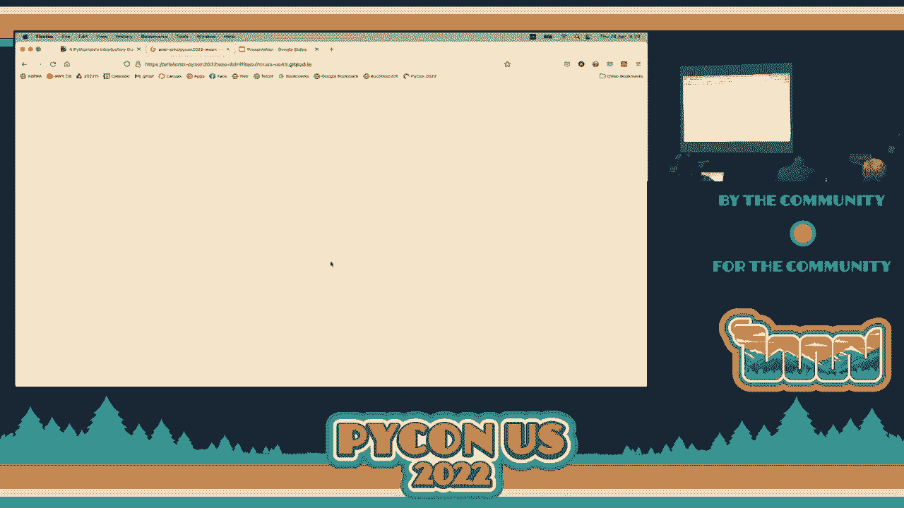

 You are probably going to see this in a light color。

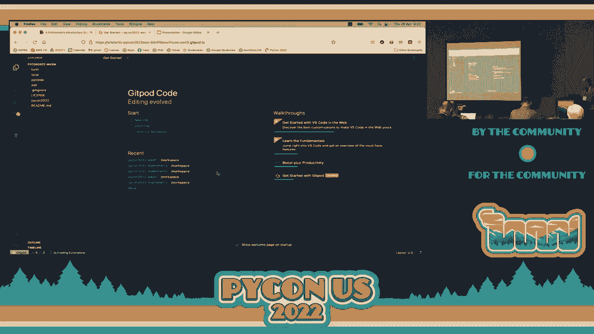

 It probably makes sense to make this larger。 There are some settings you can change here。

 You can change it to a darker color。 Just go here where the cog is at the bottom and there is an option that says here settings。

 For the color of the theme type theme here， and you are looking at this site with something like default is default light。

 If you don't like it change it to whatever it is。 What you see here is actually a web version of Visual Studio code。

 Most of the functionality in Visual Studio code in the desktop is here。

 You probably have a message saying that if you want to run Visual Studio code from the desktop just close that window there。

 We are not going to be using the desktop version。 It makes sense for what we are doing here。

 Let me make this a little bit larger。 Can everybody see here the words that we have over here？

 Is that okay？ I know the default sizes might be very tiny。 If you want to change your font size。

 just type over here in the settings。 Just type font。 Somewhere you should see the size of the font。

 It is a editor font size。 I am currently using 18 but I made it larger so you can see it here。

 I think by default it is 12 but you can change it to something that makes it more sense to you。

 Once again put it according to your personal preferences。 Let me go back to the themes。

 I usually like a theme that is called Dracula。 It seems to be very popular。

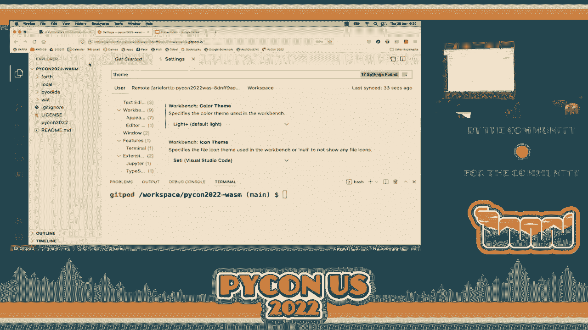

 This is not installed by default so if you want to install it go to this icon here in the left-hand side that says extensions。

 If you know the name of your favorite theme type it there。 I like this one called Sweet Dracula。

 I already have it installed but if you don't have it installed you should have a button like this。

 It says install so just put it there and you should be able to install it and start using it。

 I am going to request it to change it to our Dracula soft。 Sweet Dracula is the one that I like。

 For some reason most developers actually prefer dark themes。

 The problem is if you use a light theme many people say how do people know I am a hacker if I am using a light theme。

 They prefer to use a dark because that is how it appears always in the movies。

 Let's take some space here。 Here is some information if you want to see how to use the Gitpod workspace。

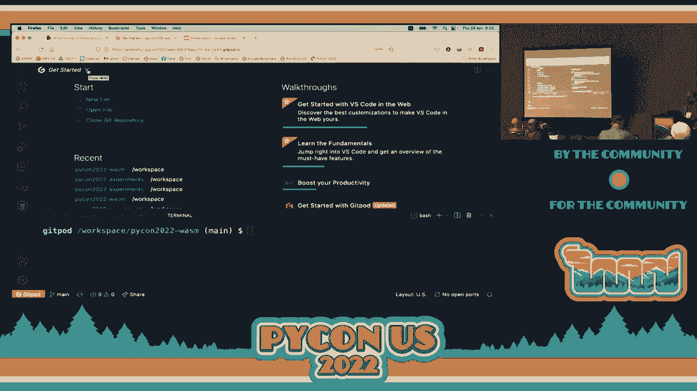

 Just a quick mention here。 Whenever you go back to the Gitpod。

io URL this is the main site for Gitpod。 It will take you to the dashboard。

 If at any moment you need to go to the dashboard probably the easiest thing is just to put in your address bar。

 Gitpod。io and it will take you here to your workspaces。

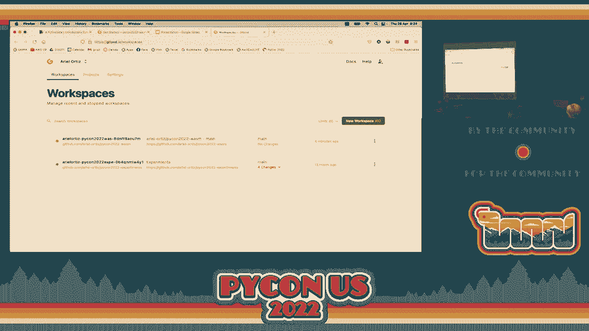

 We will probably go there several times in a moment。 We will be using the terminal a lot。

 I hope you don't get frightened by using the terminal。

 Depending on the kind of system you are using if you are using windows， Linux， Chrome。

 whatever with control J you should be able to open terminal。 If you are using Mac OS。

 command J should open。 I currently have it open here but I think you probably don't。

 If you currently are not looking at the terminal， a window is usually in the bottom part of your browser here。

 Just type control J or command J and it opens the terminal。

 If you are using the little X or you can type control J or command J and it will open and open if it is closed。

 It toggles the terminal very easily。 Something that is very important。

 please make sure that you get this。 We need to set some environment variables。

 For simplicity I put it here in this file called PyCon 2022。

 You need to do this every time you open a new terminal。

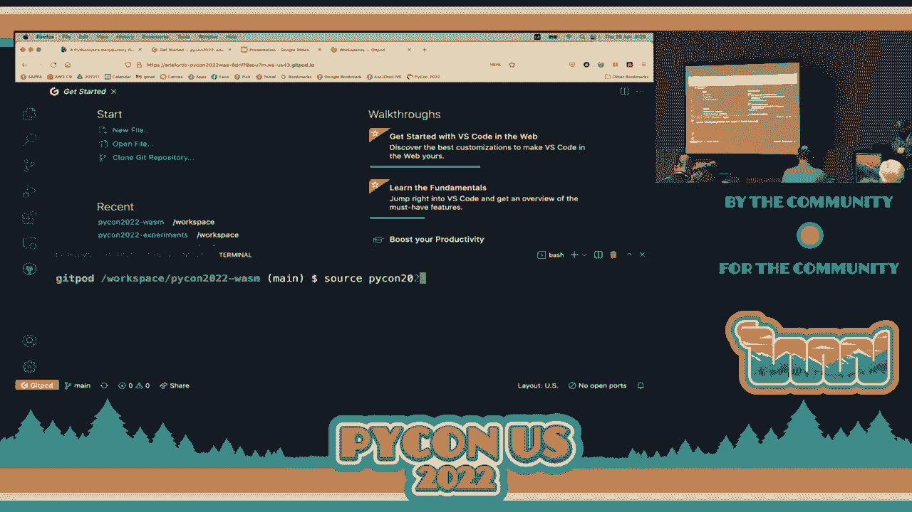

 You will see this little message saying PyCon USA 2022 tutorial and the name of the tutorial。

 The prompt here appears with the name you have in GitHub。

 It tells us the current working directory in our system。 Here is just an ordinary bash terminal。

 This is a virtual machine running in the Git pod servers。 It is really nice。

 I haven't used this tool before。 I have used other integrated development environments in particular。

 Basically you have a full integrated development environment。 It is really nice。 As a teacher。

 as an instructor， I really like this because I get all my students working in the same environment。

 In the past， whenever I taught web design， I had some issues because the people that were。

 using windows didn't work the same as the people using Mac or the people who were using Linux。

 There were sometimes people that were using that system。

 Having anything in the cloud is a convenient way of everybody working the same way。

 That is the same reason why I am requesting you to use it here。

 We have all the software that we need for the tutorial。 We have several important tools here。

 We have Python， the most recent version of Python available。 You can try it out。

 Just type here Python。 Remember， type this after what I explained a moment ago。

 Whenever you open a terminal， make sure you actually execute this command source。

 You should see this。 If you now type Python， you should see that we are using Python 3。10。4。

 I think yesterday this was the most recent version of Python。 Once again。

 this is Python running on the cloud。 A server provided courtesy of this company called GitPah。

 To exit， type control D。 This is control D independent of what platform you are at。

 It is control and D。 Not command if you are using Mac OS。

 Apart from the most recent version of Python， we also have here tools from a suite called， Webit。

 You have a question？ There is a package or suite of applications called Webit。

 We will use one of those tools in a moment。 They allow us to do several interesting things with WebAssembly from the terminal。

 We have Wasm3， which is an interpreter of WebAssembly， which we will use in a moment。

 We also have Wasmr for Python installed。 All these things work。

 It does not matter what system you are using locally。

 Because we are running all this in a virtual machine， this should work without any issues。

 Just a few words about GitPah。 Once you have opened and cloned our repository， GitPah。

 Enrolls you or subscribes you to a free plan called open source。

 You get something called GitPah hours。 By default， you get 50 in this free plan。

 which is called open source plan。 One GitPah hour is basically the opportunity to work in your workspace for one hour。

 If it gives you 50 GitPah hours， you can use it for 50 hours per month。

 That is a fairly decent amount。 You can open simultaneously several work spaces。

 but each work space is consuming independently。 For example。

 if you open two parallel work spaces for one hour， it actually counts you for two hours。

 Just have that in mind。 Whenever you want to finish your workspace， there is an option there。

 Please don't exit at this moment。 I just want to show you where to exit。

 but don't do it at this very moment。 There is a button here that says GitPah in the bottom left corner。

 You get a menu here and there is this option called stop workspace。

 That is a way of stopping it at this very moment。 If you don't stop it， but for example。

 it just closes your laptop and you go somewhere， 30 minutes of inactivity will also stop your workspace。

 If you really want it to stop right now， just select that option。 Otherwise。

 whenever you stop using it 30 minutes afterwards， you actually get disconnected。

 It doesn't matter if you don't necessarily stop it by hand。

 Another thing which is worth mentioning right now。 Once again， go to the dashboard here。 Once again。

 you can go with trypengitpod。io at any new tab or window that you have there open。

 You should see only one of this。 I mean， the workspace that you just created now。

 which is this one that is in green。 You need or it's recommended that you go here where there are three dots。

 Then you select this option called pin。 Pin actually pins the workspace into your dashboard。

 If you do not pin it 14 days after you last use it， it will automatically get deleted。

 If you don't mind it to get deleted， you can leave it without the pin。 If you want to pin it。

 it will still be there in two weeks。 Just have that in mind once again。 Otherwise。

 you might expect things to be there and then come back and see that they are not。

 Any unpinned workspace is deleted after two weeks。 I think that's all you need to know。 Of course。

 another thing that we are over here。 If you go to the settings tab and you go to plans。

 there are several things that you can check here。 First of all， there is the plan。

 If anybody is interested in using this and doesn't mind paying。

 you can see that there are several options here。 You should have been enrolled or subscribed here to the open source one。

 which gives you 50 hours。 In my case， I got the personal because I'm an instructor and have some special benefits from GitHub。

 These are extended to Gitpod as well。 I have 100 hours per month given by the Gitpod company。

 You have other options。 Most important part that I wanted you to see is this one here。

 This tells you how many hours you have remaining in the month。 Once a month has gone。

 it resets to 50 hours again。 If you want to keep on using it， just have that in mind。 Once again。

 if you just wanted to do this during the tutorial， forget about everything。

 Probably the three hours we are going to be here is enough time for you to actually learn what we are going to present here。

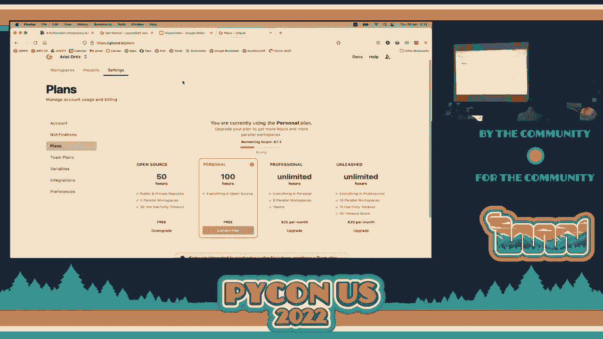

 Let's go to our section number three， which is this technology called Piodi。 As I mentioned before。

 Piodi actually was developed using the MScript and tool chain。 It's support of C Python。

 This is the most common implementation of Python。 MScript and actually received all the source code written in C。

 It produced WebAssembly。 This allows us to run， as we've explained before。

 to run Python on the browser directly。 As a first example here， let's run a REPL。

 Remember the REPL is a read eval print loop。 Just click it here。

 It should open a new tab or a new window。 Let's make this a little bit larger。

 This is a standard terminal for Python。 This is running on the browser。

 The Python that we saw a moment ago was running on the web and some other server。

 We are just using the browser as an interface。 This one is running here locally on our computer now。

 Probably the first time you actually load this， it might take a few seconds。

 I think somewhere the full module that contains all the WebAssembly code for C Python is somewhere around 7 or 8 mega。

 It might actually take a little bit of while a few seconds to actually load。

 I did some tests on the speed of the Wi-Fi connections we have here。 They run pretty fast。

 Hopefully we shouldn't have any issues with the speed of the Wi-Fi connection。

 You can put whatever you like。 For example， let's say that we put here a list comprehension to produce the first 11 powers of two。

 I mean standard code。 An interesting thing here is that they also ported here some of the standard or not necessarily standard but typical libraries used by the people from data science。

 We can import here NumPy。 Once again， the first time you actually bring it might take a little bit of time because sometimes it needs to download and convert this to the internal representation that it requires。

 You can do things as usual here。 Let's say create a vector of zeros。

 You can do whatever operation you want。 This is running locally in your browser。

 This works the same in a tablet or in a cell phone。 It's running locally in your browser。

 This is a really cool demonstration of what WebAssembly can give you。

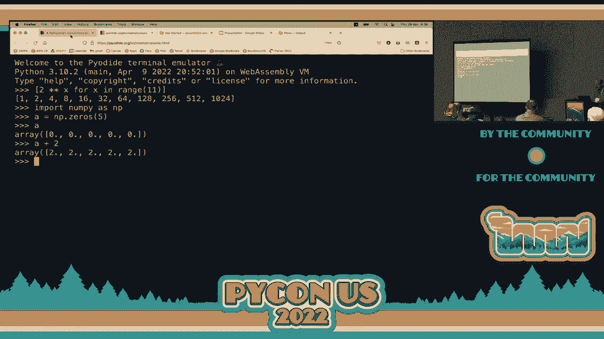

 This is something to have in mind。 How do we really implement this in the context of a client that wants to use some Python code instead of JavaScript？

 Because once again in order to run this we will need to add some JavaScript code。

 This is a Python code。 Here we are in section 3。1。

 These are very simple examples to demonstrate what we could do。

 This is something that has a little bit of Python code。

 It has a list with some quotes and one liners。 We have a function here called getversion which gives us the current version of Python。

 Get date and time gives us the time of this very instant。 It converts it into this ISO 8601 format。

 Get quote chooses a random sentence here from this list of one liners。

 We have some code here just to run it if you want to run it locally。 Let's do that。

 We need to change to the Pyodite directory。 If you are fluent in Linux terminal feel free to do it some other way。

 Let's just look at currently what the terminal looks like。

 If you type ls it will give you a listing of the current directory。

 We want to change here to the directory called Pyodite。

 You can do it with the command that is explained here。

 This is a change directory with a full absolute path。

 You can do it also changing with a local directory with a relative directory。

 We want to change to Pyodite here。 This is a standard bash terminal。

 If you have ever used it remember you can use tab to do quick competitions。

 You can use it up and down hours to go through the history of your command。

 That will allow you to go a little bit faster。 If we list the contents here of our current directory。

 We have here a fav icon。 We have an index HTML。 We have some Python code。py。

 Let's run this some Python code。 The typical way of running this is just putting Python and then the name of your script。

 This runs the three functions we defined a moment ago。

 The first one gives us what version of Python we are using。

 It gives us the current date of your system。 It is using the UTC。 We are running this on the cloud。

 It uses the hour of the time and date of our server。 It is not the local computer that we are using。

 It is the server that we are running this code on。 Remember this is being executed on the cloud。

 The GitHub cloud。 Here we have a random message here。 If we run it again。

 Sometimes you do get some different funny quotes over here。 Once again here the hour。

 the time is specifically here。 The servers typically work with a universal coordinated time。

 We get here a normalized time instead of our local time。

 This is the command to run the code that we just used。

 This is what you probably something similar you get to use。

 How do we integrate this with a web page？ We have here an index file has what we need to do in order to。

 integrate this with PyDide and run a program in the browser。

 Important things you need to do here is to use a script tag over。

 here where you are accessing the PyDide code necessary to run all， the files。

 This is really just an ordinary web page that has a few paragraphs， with some IDs。

 We use the IDs to update the contents of these paragraph tags。 We need to put some JavaScript here。

 This is the only JavaScript we are going to be using during this， tutorial。

 You have here your main function that loads the PyDide module， here。

 We are using some synchronous code here。 This part runs Python code of the code that we saw a moment ago。

 written in ordinary standard Python。 We fetch it。 We get it in our browser available to be run by the web。

 assembly C Python implementation that we actually obtain with。

 this source of the script of our PyDide module。 Here we actually go -- let's make this a little bit smaller。

 This part here is the specific code on JavaScript that is calling， our Python functions。

 Here we call the get version， here we call get date and time， here we call get quote。

 All this actually calls the functions that we were looking at， a moment ago。 Let's open it here。

 You want to see that code open here， this section， that is the， file explorer。

 We are at the PyDide directory now。 If we open some Python code， this file contains here our code。

 that we saw a moment ago in Python。 The functions that are getting called is this one here。

 the get version， the get date and time， and the get quote。

 These are being called by the JavaScript in the index HTML file。

 This is where they actually get called。 Anything in Python can be translated into equivalent。

 JavaScript objects and the other way around。 I'm keeping things a little bit simpler。

 This actually returns get version， get date， get quote， they return strings。

 Strings in Python are converted to strings in JavaScript。 This is a really direct translation。

 No additional things have to be done。 Here we just upload the paragraphs。

 We put their inner HTML with whatever these three Python， functions actually return。

 In order to see this running， you need to type the command that， we have here in a moment。

 which is standard command to run an， HTTP server in Python。 Just type that command。

 You can just copy paste it。 You can see this runs of the module HTTP server。

 You should see in a few moments a little alert message over here。

 and go with the button that says open browser。 Usually the browser is going to stop it because it's sort of like。

 a pop-up window there。 You should see in your browsers a message saying that in this。

 case the browser that I'm using is prevented from opening。 Just give permissions for this to open。

 There's my index web page where what we have here was actually， produced by Python。 We got Python。

 the version that is running here。 Notice it's not the same version that we ran a moment ago。

 because when we run it at the terminal it was running the。

 Python interpreter installed in our environment， our workspace， provided by Gitpod。

 Here we do see the local time， 944 and we also get to see this。 The funny one liner quote。

 If we refresh it， you'll see an updated time over here。

 Once again you might see a different funny quote over here。 Has everybody been able to run this？

 Once again， remember to get the full experience you should， really be doing the exercises。

 Once again anybody can decide if you just want to listen。

 If you really want to have the experience it's really worth， doing these exercises。

 This is one way that this could actually be seen in your， browser。 Just a quick mention here。

 you can use control C at the terminal。 Don't do it。 Don't do it。

 At the terminal where the server is running just type， control C whenever you want to stop it。

 Don't stop it yet because we're still going to use it。

 If you stopped it already just run the command again to make this， request。

 Some typical errors that people do is they open a second。

 terminal and run again the web server and sometimes you get。

 a message saying the port is already in use。 If that's a case you probably need to check out all the。

 terminals you have open and use the little garbage can here to， close all those terminals。

 You can use the， command and run the server。 In the most simple fashion type control C at the terminal and。

 that stops the browser。 It's time for you to do your first exercise。 We're now in section 3。2。

 exercise A。 It says here modify the get date and time function from the， Pyrdide some Python code。

 You need to open this file if you haven't already。 It's the some Python code。py。

 You need to go to this is currently in line 27， get date and， time。

 You're required here according to the instructions to modify this。

 function so that it concatenates to the result。 Notice there is a variable called result。

 Before you return it here you're required to concatenate it with， one of these two strings。

 If today happens to be your birthday it should say happy， birthday to me。

 If it's not your birthday it should have the string concatenated。

 It says a very merry on birthday to me。 You just need to put an if there somewhere。

 I leave that to you to check it out where that would go。

 First test it out and once again here you can open a new， terminal here。 Probably to do the testing。

 Let's open it here。 There's this menu over here where you have the three lines。

 You know how this is called？ What's the hamburger menu？ Yeah。

 that's how most people actually call it。 I think it's called something like the collapse menu or something。

 Here you click it and in the terminal this allows you to create， a new terminal here。

 Let's open a new terminal。 Notice here that I'm currently running two terminals。

 As usual make sure that because we open a new terminal type here， source followed by PyCon 2022。

 Once again remember it's very important that whenever you open。

 a terminal that you type the source space PyCon 22 command。

 Once again you can go from one of the previous terminal where the。

 web server is running to the new terminal by just clicking here。

 the corresponding icon for that terminal。 Once again let's change to the Pyodi directory。

 Once again do whatever change you need to do on this code。 First test it locally here。

 Run Python and some Python code。 We haven't changed anything so far so we're going to get the same。

 output that we did。 You need to change this so make sure that it runs here locally。

 Once you're sure it runs there go to your window or to your tab， where you have this code already。

 Once again if the server is still running you just need to refresh， the browser。

 You should see now the new output。 Something needs to happen inside this function。 I'll give you。

 I think it's easy。 Just a quick tip here so you don't need to check any， documentation。

 The now variable actually has today's date。 This is the now variable。 That one has two attributes。

 One is called day which is a current day and month which is， current month。

 You can use those to hard code compared through the hard。

 coded values of your birthday whatever that happens to be。

 Once you've done that and if you've done it properly you should。

 see the additional string as part of your result。 If it's birthday you should say happy birthday to me and if it's。

 not very happy。 A very merry and birthday to me。 How many minutes do you think you can do this？

 Almost done。 Great。 I'll give you five minutes。 If anybody has any questions you can ask me。

 I could go around answering any questions or solving any， issues that you might have。

 I'll go this other way。 Great。 Thank you。 Can I see the good？ Yes， sure。 Let's go back to --。

 Sometimes you need to do a hard refresh in your browser。

 Typically in many systems you press -- I think it's shift and， press the refresh button。

 You're missing the if to actually ask if it is or not your， birthday。 Typically you would put now。

day and compare to whatever day your， birthday is and so on。

 According to that you place the correct string at the end of， the code。

 I see my code in the browser。 We're talking about security。 That could be an issue。

 You can see yes the code is visible。 You have to be careful with that。

 Use some other mechanism to store any information that might， be sensitive。 Anybody else finished？

 Great。 Let's have a look。 Okay。 Can you see the code？ Okay。 Okay。 Yeah。

 If you have hard coded to today's birthday。 Okay。 Thank you。 Great。

 Anybody else finished or has any questions？ Okay。 Can you see the code？ Okay。 Great。 Awesome。 Okay。

 Yeah。 As long as it works。 Okay。 It is your birthday today or just checking if it does work。

 You put today's date。 Okay。 Awesome。 Great。 Excellent。 Thank you。

 Anybody have any questions or any issues？ No。 It's working。 Okay。 Yeah。 Sure。 Thank you。 Okay。

 Awesome。 Thank you。 Okay。 Great。 Okay。 Okay。 Okay。 Okay。 Okay。 Okay。 Okay。 Okay。 Okay。

 So what I've seen so far， the people who showed them the code， the code is working fine。

 So thank you very much。 Let's go to the next section。

 Because there's still a lot of things to cover。 We're going to leave aside what we did a moment ago。

 which is， programming or using Python to program code that is going to be run by the browser。

 As you can see， we were able to have our code written Python running in an ordinary Python。

 interpreter locally in our cloud in the server provided by Gitpot。

 But also we saw that we were able to use Pi。I to run it in the browser。

 So that gives us some interesting new possibilities。 Okay。

 Let's look at WebAssembly a little bit more in detail。 Okay。 So， I mean。

 so far we've just been using WebAssembly without really looking at how it works and how。

 it actually behaves internally。 Okay。 So we're going to do some exercises here that once again。

 this is not the typical use case， of WebAssembly， but it does give a lot of insight。 Okay。

 It's something that really is educational。 Okay。 Once again， remember。

 WebAssembly is typically produced by some other tool by a compiler。

 But it is possible to write it by hand。 And we're going to use this format called WebAssembly text format。

 Okay。 We're going to distinguish these two formats。 When we talk about Wasm。

 we're talking about the WebAssembly binary format， which is really， what the technology is。 Okay。

 But there is a counterpart that is represented textually， which is called WebAssembly text format。

 Okay。 And we usually just call it wet。 Okay。 So there's Wasm， which is binary。 There's wet。

 which is textual。 Okay。 And when we run， when we actually write it by hand。

 what we're going to be writing is wet。 And we need a tool to translate what， which is textual。

 into Wasm， which is in binary form。 Okay。 So， first out of curiosity。

 has anybody programmed any kind of assembly language before？ Oh， several of you have experience。

 Okay。 I used to teach assembly language about 20 years ago。 X86 assembly language。 Okay。

 So compared to those assembly languages of the past， I mean， even when I was in school actually。

 I think I programmed assembly language for the 6502 processor。

 6502 was the processor that was available for the Apple IIs。

 I don't know if you remember those kinds of computers。 I mean， I'm talking about the mid-1980s。

 Well， WebAssembly in its textual format is similar to that。 It's a really low-level language。

 But we're going to see that it's stack-based。 Okay。 So this requires a little bit of thinking。

 a little bit of different from most traditional， assembly languages that are available for different real hardware CPUs。

 which typically are based on registers。 Here we're going to see whether assembly is a stack-based。

 And we're going to see what that means in a moment。 Okay。 But first of all。

 we need to mention that WebAssembly actually works with， in the textual format。

 works with S expressions。 So this is what an S expression looks like。 Okay。 This is。

 we're in section 4。1。 So， an S expression， something that starts with an opening parentheses。

 then has some symbols or elements there。 Okay。 And then a closing parentheses。

 Those symbols or elements that are nested can be all their S expressions。 Okay。

 So this notation was actually first used in LISP in the late 1950s。

 If anyone has used LISP or any of its variants before， it could be， I don't know， scheme， racket。

 closure or any of these languages。 This is the same notation that is actually used there。 Okay。 Yes。

 they're called S expressions。 Okay。 If you haven't used it before， no， don't worry。 Okay。

 You'll have a chance to look or use this notation just briefly。 Okay。 So， well。

 we're going to be writing our code using S expressions。 A quick reminder here。

 We've mentioned this already。 There are only four data types supported in WebAssembly。 Okay。 So。

 we got an I32， which represents a 32-bit integer。 An I64， which is a 64-bit integer。

 can be positive or negative numbers。 Okay。 And we also have two versions of floating point numbers。

 32-bit float， which is called F32。 And F64， which is a 64-bit floating point number。 Okay。 So。

 these floating point numbers usually are equivalent to floats and doubles in other， languages。 Yes。

 [inaudible]， I think they actually decided to use these because that's typically what is supported in most。

 physical， real hardware CPUs。 Okay。 I mean， x86 actually supports also the extended floating point format。

 which is 80 bits， of the data。 But it's not very common in modern years because。

 as I've seen at least most of the variations， of SIMD instructions and so on are typically used at most 64-bit floats。

 Okay。 So， I think it was more of a decision because of what hardware is currently used and was。

 easier to translate from WebAssembly to a real hardware CPU。 Okay。 And， well。

 it is a coincidence actually here that F64 is the data type supported by JavaScript。 Okay。

 But JavaScript， for example， does not support I64。 Okay。

 There's no way of directly supporting in JavaScript 64-bit integers。 Okay。

 Because in JavaScript everything is actually a float。 Okay。 64-bit float in practice。 Okay。 Okay。

 Let's just mention here on our stack。 What is a stack machine？

 Let's start discussing what a stack is。 Okay。 A stack is a data structure。 Okay。

 If you've taken a data structure course in the past， this should probably be very， very， familiar。

 So a stack is just a collection where all the elements are inserted and removed from the。

 same place。 Okay。 So if we think of it as a stock， for example。

 here in our illustration stack of pancakes， whenever you want to add a pancake。

 you put it on the top。 Okay。 And whenever you want to remove it。

 you remove the one that is most out of the top。 So we say that this data structure works using a LIFO policy or you pronounce it LIFO。

 Not really sure。 Last in， first out， way。 Okay。 Sometimes if I pronounce words a little bit strange。

 just have in mind that my native language， is Spanish。

 So many of these words I only see them reading。 So sometimes I don't necessarily know how they pronounce it。

 I just pronounce them as I imagine。 Okay。 But it's not necessarily the correct way。 Okay。

 So this is how the evaluation of all computations actually take place in WebAssembly。 Okay。

 So for example， if I want to add two numbers， let's say that I want to add a seven and， five。 Okay。

 These are the steps that I need to do。 Okay。 As mentioned over here。

 So I want to add seven plus five。 So what do I do？ I push first the seven and the stack。

 Then I push the five on the stack。 Okay。 So now we have a stack if we want to imagine it going from the bottom growing upwards。

 Okay。 We got a seven and then upwards we got a five。 And then when we do the add。

 the add actually involves popping the two elements on the top， of the stack。 Okay。 We pop them。

 which means we remove them。 We apply the operation， in this case the addition。

 We get the result and we place the result， we push it into the stack again。 Okay。

 So this is described here， but we have a better illustration just down over here。 Okay。

 So this probably is a little bit easier to understand。 So there we go。 And step number one。

 we push the seven。 Okay。 Step number two， we push the five。 So as you can see here。

 we got the five and the seven。 Okay。 The five is the top， the top of the stack。

 The seven is just underneath the top。 And then we do a pop here。 Now the order of the pops。

 I mean you can only do the pop with whatever is there。 Okay。 But we're doing two pops。

 An important thing that you need to understand is that we pop the first element and this。

 is going to be the second operand in the operation。 Okay。

 I mean at this point it really doesn't matter because in the example we're doing addition。

 But when you do operations that are not commutative like subtraction and division， the ordering。

 which things actually are carry out is very， very important。

 Now the easiest thing here to remember is that if I want for example to subtract two， numbers， okay。

 I push the elements in that and the same ordering which I think that's。

 subtraction is going to be taking place。 So for example， if instead of adding seven plus five。

 I want to do seven minus five， I， still push them in the same order。 You push the seven。

 push the five and when it pops， even though the second operand is going， to be popped first， okay。

 it's going to be used in the correct place。 Okay。 So as you can see here in the illustration， okay。

 we pop the first element and this is， going to be the second operand and we pop the one that was in the bottom here and that's。

 going to be the first operand and then we carry out the operation， seven plus five or。

 whatever operation it was and we push the result into the stack。 Okay。

 So we're going to do the same thing here。 So we're going to do the same thing here。

 So we're going to do the same thing here。 So we're going to do the same thing here。

 So we're going to do the same thing here。 So we're going to do the same thing here。

 So we're going to do the same thing here。 So we're going to do the same thing here。

 So we're going to do the same thing here。 So we're going to do the same thing here。

 So we're going to do the same thing here。 So we're going to do the same thing here。

 So we're going to do the same thing here。 So we're going to do the same thing here。

 So we're going to do the same thing here。 So we're going to do the same thing here。

 So we're going to do the same thing here。 So we're going to do the same thing here。

 So we're going to do the same thing here。 So we're going to do the same thing here。

 So we're going to do the same thing here。 So we're going to do the same thing here。

 So we're going to do the same thing here。 So we're going to do the same thing here。

 So we're going to do the same thing here。 So we're going to do the same thing here。

 So we're going to do the same thing here。 So we're going to do the same thing here。

 So we're going to do the same thing here。 So we're going to do the same thing here。

 So we're going to do the same thing here。 So we're going to do the same thing here。

 So we need to prefix the type of data that we're pushing and that we're popping。

 So we always need to provide if this is a 932， a 964， or a 932 or a 564。 Typically。

 most of the examples that we're going to see， we're only using always one single data type。

 But it is possible to do conversions between the data types。 But at this moment。

 we're not going to be doing that。 But it is possible if it's required。

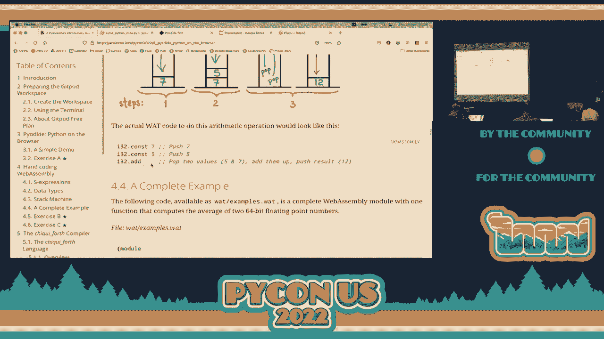

 So let's have a look at a complete example here。 There is in the what directory。

 There is an examples。what file。 So let's open that one。

 We can close this now and we can now shut down our server。

 So open the terminal that currently has your server and just type control C to abort it。

 And I don't think we're going to be using that one again。 So we can send it to the garbage。

 And we currently only have this other terminal currently here。

 So we're going to change our directory in a moment。 But let's open here the wet folder。

 And there's only one file there。 Examples。what。 So this is a complete full example of what。

 of a wet source file。 WebAssembly text formats。 Do you get to see it in colors or is everything in the same color？

 If you want to see it in color， just go to the extensions icon over here。

 And the extensions called WebAssembly。 Okay。 Type WebAssembly there。

 And it's the very first option here。 I currently have it installed and thanks to that we get to see it in color here。

 Okay。 But probably makes sense that you also get the support for syntax highlight。 Okay。

 We live in an area where we do have syntax highlights so we should use it whenever possible。

 I remember when I was studying my undergrad degree。

 In the very first semester I had a classmate that actually， we were programming at that time。

 It was Pascal what we were learning。 And we were using Turbo Pascal at that time and didn't have syntax highlight。

 Once again， remember I'm talking about the mid 1980s。 Okay。

 Syntech highlight was at least available in the boardland products like Turbo C and Turbo Pascal until almost the beginning of the 1990s。

 But before that everything appeared exactly in the editor in one single color。 Okay。

 So I remember that he was working in his final project for CS1 and suddenly everything stopped working。

 He started getting a lot of errors。 And because he actually mistakenly deleted the closing symbols or symbols that were required for a block comment。

 Okay。 And it was very easy to do that。 I mean it's just the line that he accidentally deleted。

 But because you don't see the colors you always see it was actually the same。

 Suddenly things stopped working and it took him about， I don't know， three。

 four hours to actually see the error。 And he was really getting very， very upset。 Okay。

 And until somebody said， oh you forgot to close this comment。

 And once again it wasn't that he hadn't closed it originally。

 It was that he accidentally deleted the symbol that was used to close the block。 Okay。

 So once again this is a situation that could have been avoided if we had syntax highlight。

 So this is a program notice here。 It starts with an opening parentheses and we have here a module。

 Everything in WebAssembly， every program that we write in WebAssembly or that is produced is inside a module。

 Okay。 The module can have several things。 Okay。 I'm really omitting a lot of information but WebAssembly modules inside。

 they can have one big memory object， okay， which can be used for any kind of information that you want to store as a big array of bytes。

 Okay。 You have tables that allow you to have pointers to functions and so on。

 These are used for implementing， for example， pointers to functions in languages like C or virtual functions like are supported in object-oriented languages like C++。

 You don't need to use them and we're not going to use them here。 Okay。

 But they are available to provide that functionality。 You can have functions。

 you can have global variables， you have a question？ [ Inaudible ]， Yes？ [ Inaudible ]， Yeah。

 exactly。 Yes， notice that we're not providing an explicit name of the module。

 not in the declaration line number one。 It is the name of the module is the name of the file with the Wasm extension。

 Remember here it's a WAD extension because we're using the textual format。 Okay。

 So here because this is probably the most interesting part， we're just defining one function。

 Notice here once again it starts with an opening parenthesis here and this one is closing it。

 The closing parenthesis that we have here in line 22 is the one that corresponds to the module。

 Okay。 Remember this is the expression format。 Okay。 So here we have several。

 we can call these directives。 We have an export。 This is the name that is going to be available for external tools。

 Okay。 So any external tool that wants to use this Wasm module once it's converted into Wasm will be able to use the name that we are exporting。

 If we don't export it， it's private to the module。 Okay。 Actually the name of the local。

 locally here in line number 10， I'm using the same name， A-V-G。

 but just notice that these local names that we use inside our WebAssembly Text Format code have to start with a dollar sign。

 Okay。 So you can see it here。 The name of the function， if you wanted to use it locally。

 strictly this part wasn't really required because I never call it from within this code。

 within another function here。 Okay。 So if I needed to call it， I would use this name。

 but it's only available local here。 Okay。 Because I exported here。

 this allows other tools to actually call this code， whatever it's required。

 Here we define the parameters。 Okay。 Notice that I'm using here this is actually Python。

 but using some type annotations。 Okay。 Just to explain what it is。 It's saying here A is a float。

 B is a float， and it returns a float。 Okay。 So I'm putting over here。 So A and B are F64 data types。

 variables of this data type， they're parameters。 Okay。 They're considered inputs。 And the output。

 the output is a， notice here it says result。 We're telling that at the very end of the execution of this function。

 there should be in the top of the stack one only item and that item has to be an F64。 Okay。

 If there are more elements， this actually produces a validation error。 Okay。

 So we have to be very careful that if we push elements into the stack。

 at some point we take them back， and that we only leave if this function is actually returning a result。

 we only leave one result in the top of the stack。 Okay。

 The function does not require to return anything if we want to。 Okay。

 That would be an equivalent to a void function in other languages。 And if that's the case。

 you need to leave the stack empty without any elements in the top of the stack。 Okay。

 And here is the code， what you see here in this sort of pinkish color。 Okay。

 So you do a local get a， so what does this do？ It reads the variable a， the parameter a。

 and pushes it into the top of the stack。 And then we do the same thing with b。

 So currently in the stack we have a and b， we have in the bottom we have b。

 and then we have the value of a in the top of the stack。 We do an F64 add here in line number 17。

 And when we do that， we pop to top elements in the top of the stack。 From the top of the stack。

 we do the operation in this case addition， and we place the result in the stack again。 Okay。

 And upon， so then in a， in a， in a push operation。 Okay。

 And then we push the value to on the top of the stack， and now we do a div。 Okay。

 And as I explained in the order in which the elements were actually pushed。

 this is how the division is going to be carried out。 Okay。

 So the division is going to divide the result of the add by two。

 Because those are the two values in top of the stack。 Those are divided。

 and the result is placed on the top of the stack。 Okay。

 And we leave the top of the stack with that value。 That's what is going to be returned。 Okay。

 There is a return instruction that you could use if you want it。 Okay。

 But it's not really required if it's a very last instruction in your function。 Okay。 Yes。

 It doesn't， it doesn't have any artificial limitation。 Okay。 I mean， everything in life has a limit。

 Okay。 So I can't really say， oh yeah， you can use all your memory in the stack。

 But there's no limitation initially。 Okay。 Now remember that this code here once it gets translated to。

 to Wasm。 The runtime environment is typically going to do a just in time compilation of the web assembly。

 So that it gets translated from this web assembly binary format into， once again， this can be。

 done in several ways。 But the， the JIT or just in time compiler takes the。

 the code and translated into native machine， code in your platform。

 whatever platform is where you're actually running this code。

 So most of our real hardware CPUs that we use are typically register based。 They're not stack based。

 So this means that we'll need to use some registers and some additional memory in case not everything。

 fits。 But in general， all that part is actually sold by the implementer of， of the runtime system。

 Okay。 So we don't really need to， to put any limitations。

 I haven't read anywhere that says that there is a limit to how many elements you can put in。

 the stack。 But in practice， I've seen that you usually don't need more than four or five elements in the。

 stack at the same time。 Yeah。 Exactly。 Yeah。 Just in case you didn't listen。

 the observation that he does is that the specification and。

 the way that the virtual machine works is， as a stack machine。 Okay。

 But once this trippical gets translated using the just in time compiler， once again， this。

 really depends on how it's implemented by the runtime system。

 Typically needs to convert this same code into the instruction set of a register computer。 Okay。

 For example， when you run this in your， most of you probably using an x86 base machine， some。

 of you， if you're using a recent version of Mac OS， probably you're using M1。

 So when we actually loaded Pyodiode， it translated into the corresponding native instruction set。

 And most of the CPUs used in hardware currently are typically register based。 Okay。 But once again。

 that translation happens automatically。 You don't really need to be aware of it。 Yes。 [inaudible]。

 That you could use？ What？ [inaudible]， Oh， yes， of course。 Yeah。 [inaudible]， Yeah。

 You need to just check if there is an implementation of the application。

 So implementation of the WebAssembly runtime system in some fashion。

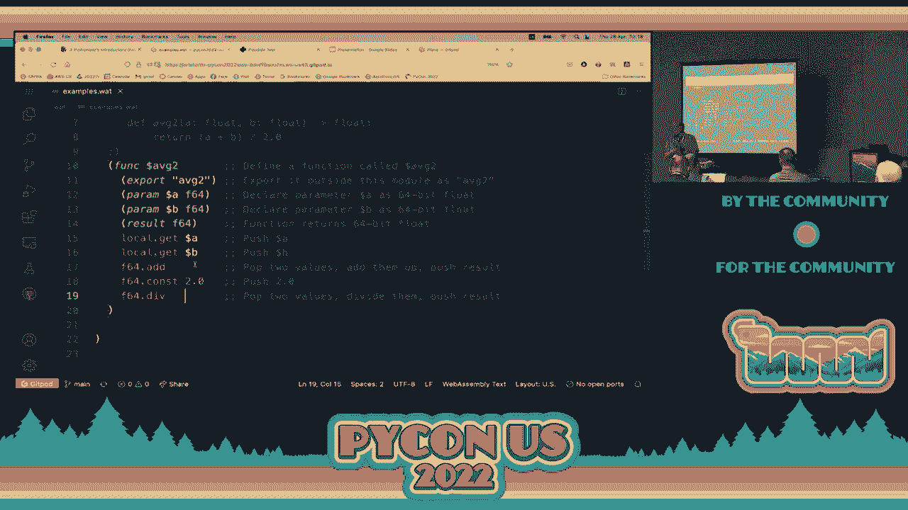

 Okay。 And if that's a case， of course it is able in microcontrollers。 Okay。 Like Raspberry Pi or？

 [inaudible]， Yeah， exactly。 Yes。 WebAssembly， one of the use cases it has is working for devices。

 small devices that you use in typical， Internet of things kind of things。 Kind of stuff。 Okay。 Yeah。

 Okay。 But once again， you need to check and see if there is that support for that particular hardware。

 that you're using。 Okay。 But if there is， of course you can use it。 Yes。

 There was a question over here。 [inaudible]， It actually does。 If you see。

 we actually push these two elements。 Those got popped with the add。 Then we push another element。

 And the diff does two pops and a single push。 So at the end if you look at the stack。

 the stack is going to only have one element。 And it is consistent with this directive that says it should be a 64-bit floating point in。

 the resulting stack。 Okay。 It is required。 If it's not， you actually get a validation error。 Okay。

 There is before your code is actually executed， there is a face called validation。

 We usually don't talk a lot about it， but it's part of the security of the system。

 So one of the things that it does is make sure that the stack is being used in a consistent。

 fashion。 So if you try to do， for example， a pop when there is no elements there， okay。

 or you finish， your function and you said that this is only going to return one result and you have。

 for， example， two values in the stack。 That actually produces a violation in the validation。 Yes。

 [inaudible]， You get， I don't remember if they call it a trap。

 There is some kind of runtime exception being produced。 Okay。 Once again。

 you can always check the documentation to see all those particular issues and I'll。

 show you where it is in a moment。 Okay。 Yes。 [inaudible]， Yeah。 [inaudible]， Yeah。 [inaudible]。

 Yeah。 [inaudible]， Yeah。 [inaudible]， No。 There is a stack per every block。

 A function creates a block but there are other instructions。

 There is one actually called block but also there are loops and there's ifs that create。

 blocks and each of those have their individual stack independent of any other stack that might。

 be there。 Okay。 There is no shared stack among blocks。 Yeah。 That's right。 Okay。

 So just to use this， the way that we're going to be using this is as follows。 Okay。 Let's go here。

 We need to change to the directory for wet。 Okay。 Once again， you can use this instruction。

 We have it here。 We're here in still in section 4。4。 Okay。 So you can just copy paste this one。

 This doesn't really matter what directory you are。 It will take you to wet。

 If you know how to navigate within the terminal， you can just go upwards to this directory and。

 then go down to wet。 Okay。 But whatever way you do it。

 it is important that you are in the wet directory。 Okay。 The wet directory。

 if we check here the contents， sell us。 We only have the example of wet。

 And this is consistent to what we see here with the explorer。 Okay。

 So the first thing that we need to do is convert the wet sort file into binary wasm。 Okay。

 So in order to do that， we have a tool called wet to wasm。 Remember， very important。

 If the system says that it doesn't find this particular command， is that you did not execute。

 the source， PyCon 2022 instruction at the very beginning when you started， when you open。

 your terminal。 Okay。 You can just try it。 Just type wet to wasm。 Okay。 And if you see command。find。

 here it did find it but didn't do anything。 Okay。 But if you get an error。

 remember you need to go back to section 2。2 and remember to execute。

 or open a terminal and execute at wherever the terminal opens。 This command source， PyCon 2022。

 Remember， if you don't do that， you won't have access to any of the commands that we're。

 going to be using at this very moment。 Okay。 So with everything's fine。

 we should be able just to type here wet to wasm。 And we just indicate here that it's the examples。

watt file that we need to translate。 Okay。 You can think of this being sort of like a compiler。

 Technically is what we would call an assembler because it's going to translate assembly code。

 in text format into the corresponding binary code。 Okay。 WebAssembly， the name is a little bit。

 I wouldn't say confusing but it goes a little bit against， what typically assembly is。

 Assembly should always or at least was always considered to be a text format。 Okay。

 So we talk about WebAssembly and when we run WebAssembly， we're usually talking about something。

 that is in a binary form。 Okay。 So this might be a little bit confusing at first but just have in mind what we're discussing。

 at every point and hopefully that shouldn't confuse us too much afterwards。 So wet to wasm。

 Translate a watt file which is what we have into a wasm file。

 So if we list the current directory now， we get that now we have the wasm file。 Okay。

 So if you try to open it here in the editor， we'll tell you this is a binary file。

 It cannot open it。 Okay。 So once you have the wasm， you can do something like this。 You can run it。

 We have a utility called wasm3。 And here this is also explain a little bit downwards over here。

 It's wasm3。 We need to use this option REPL followed by the name of the wasm file。 Okay。

 So REPL opens a read of alprincklup。 So it's an interactive prompt here that we're going to be able to use to test our code。

 So we just put it there。 It's double dash REPL。 And the file is called examples that it's the wasm file that we want to run here。

 Okay。 Just a quick note， wasm3 is an interpreter。 This is not a just-in-time compiler。 Okay。

 But for testing purposes， it works perfectly well for what we need here。 Okay。

 So here we have the prompt。 And now what we need to do is call our function using the exported name。

 Excuse me， it's a VEG2。 Okay。 And you provide just separating these by spaces the arguments that are expected here。

 So this is going to compute the average of two numbers。 So let's say that we give it a 5 and a 10。

 You can include a decimal point and some decimal fractions if you want to。 Okay。

 But you need to provide the two arguments that are required。 Okay。 For a and b。

 The 5 is going to be a and the 10 is going to be b as expected。 And you press enter。 Okay。

 And if everything is fine， you should see something like this。 Okay。 I mean。

 so far we hadn't really modified the code。 So we would expect this to work without any issues。 Okay。

 So this is the average two function working to exit wasm3， to exit this prompt just type。

 control c or control d。 Okay。 So let's have a look at exercise b。 Okay。

 Exercise b says add to the wet example wet file the file the wet file that we were looking， at。

 A new function called avg3。 So we're going to look at the new function。 Okay。

 So we're going to look at the new function。 Example wet file the file that we were looking at a new function called avg3。

 It's going to do the same thing but instead of receiving three instead of receiving two， arguments。

 it's going to receive three arguments。 Okay。 It's going to compute the average of three three integer numbers。

 Okay。 So。 Just in case here's a link to the corresponding operations。 Okay。

 And you can see some individual things or notice individual particularities of these instructions。

 following the corresponding links。 Okay。 So these are instructions that we need to use to solve this one。

 Okay。 So this is probably very simple。

 Okay。 We can use this one here as our model。 Okay。 So we would typically do something like this。

 I'm going to do with you this example。 This is avg3。 Okay。 And we need to use an export。

 Export not export。 Export instruction here with the name that we're going to use which is avg3。

 And we're going to use param。 Okay。 And we need to provide here three parameters。 Okay。

 Let's copy this， paste this to do this quickly。 This is the first one is going to be called A。

 the second one is going to be called B， and， the third one is going to call C。 Remember。

 they need to start these local names and they need to start with a dollar sign。 Okay。

 It's not optional。 It's part of the notation。 Okay。 So。 How do we solve this？

 How do we obtain the average of these three numbers？ What do we need to do？ Yes。 Okay。 Okay。 Yeah。

 Okay。 And then you can see the variable。 Okay。 Okay。 Yeah。 And then you can find。 Okay。 Yes。

 So here we need to push。 Remember we can only add two elements at the time。 Okay。 So we can。

 in this case the addition doesn't really matter the order in which you want， to do it。

 We can push A and B into the stack and then do the addition and that leaves the result。 Okay。

 In the top of the stack， then we can push the C and we call add again and that would add。

 the previous result of the addition plus C。 Okay。 And puts that in the stack。

 And then finally we push a three and do the division。 Okay。 And once again。

 remember because addition is commutative， the order in which we do the。

 additions is really not important to the final result。 Okay。

 So let's start here by adding first A and B。 Look， we'll get here we have these two。 Okay。

 What instruction we use to add？ F64。 F64。 Add， okay。 So that adds the two top elements。

 Pops the two top elements and pushes the result back。 Okay。

 Then let's load or push into the stack C。 Then what do we do？ We add again， yes。 F64 add。 Okay。

 Then we divide by three。 Notice that at this point we have the addition of A plus B plus C。 Okay。

 We got the three numbers added and that's in the top of the stack。 Okay。

 That's currently what we have in the top of the stack。 So to divide by three， what do we do？

 We push using F64 const。 We push a three and we finally call div to do the division。 Okay。

 So just a quick mention here in Git part you don't need to save your files automatically。

 Once you do a modification to a file it actually gets automatically saved。 Okay。

 I usually instinctively always press control C or command C。 Okay。

 But strictly speaking it's not really required。 Okay。 You can check that out。 And okay。

 So here at the terminal what do we need to do？ Wet to Wasm。 Okay。

 This is exactly the same command because we're modifying the same file here。 And oops。 Oh。

 I missed something here。 Anybody notice what I was missing？ The result。

 This is why we're getting a validation error because I did not say that it was going to。

 return something。 So here we need to add F64。 This is the expected result in F64。 Okay。

 The code is correct but I needed to declare that I'm requiring here to leave always an。

 F64 on the top of the stack once we finish here。

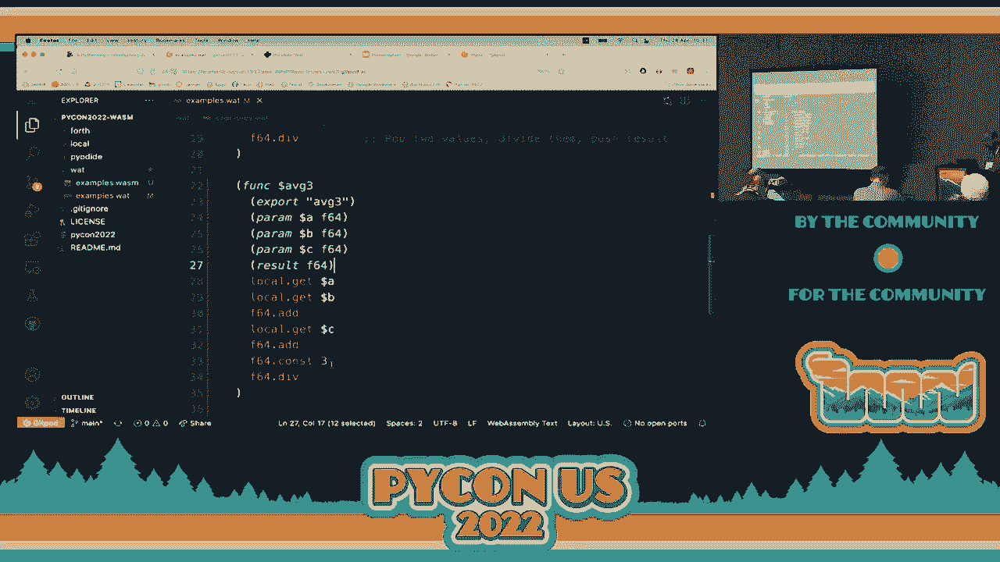

 Okay。 So there we go。 Notice here that we get here a type mismatch。

 This is where the error that we got here。 It was expecting。 This means the square brackets。

 empty square brackets。 I was expecting an empty stack but I got a stack with an F64。 Okay。

 This is a validation error。 Okay。 Done by the translator。 And we call it again。

 And we call Wasm 3 again with the REPL option here。 Okay。 How do I test it？ Well， we call AVG3。

 There are three examples that we can use here with 1， 2 and 3 or with 14。5。 I mean。

 you can use whatever data values you want to check。 Okay。

 But here are three possibilities if you don't want to think on any test cases。 So if we put just 1。

 2， 3， the average of 1， 2， 3 is 2。 Okay。 But you can check it out with the other examples as well。

 Okay。 Any questions？ Once again， remember what we're doing here is hand coding WebAssembly。 Okay。

 This is not the typical way that you use WebAssembly。 Okay。 But once again。

 I consider it very educational to do it。 Okay。 Because if you do it。

 you're more or less understanding how this is supposed to work。

 But then we're going to see higher level tools to actually get this done automatically。 Okay。

 I think it's a good moment to take a break。 Okay。 So let's， what do you think？

 15 minutes is it enough or do you want more？ Yeah。 15 minutes。 Okay。 So if you'd like。

 let's continue here at 10 to 11。 Okay。 Sure。 Thank you very much for being back here。 Okay。

 So let's continue。

 And let's go with exercise C。 I'm going to give you a few minutes to solve this problem， here。

 Just like we did with the previous function， A， V， G， three， here we need to create a new。

 function called file to sell。 Okay。 Here's the name。 This one only takes one parameter。 Okay。

 And you need to implement this formula here。 So hopefully with what we've seen so far。

 you should be able to carry out this， convert， this formula into the corresponding instructions in the WebAssembly text format。

 Okay。 And here we have a few examples that you can use。 Okay。 So once again。

 try to solve this by your own。 Okay。 If you need any help， you can ask me。

 And I'll give you five minutes to see if you can solve it in that time。 Okay。 Okay。 [BLANK_AUDIO]。

 [BLANK_AUDIO]， [BLANK_AUDIO]， [BLANK_AUDIO]， [BLANK_AUDIO]， [BLANK_AUDIO]， [BLANK_AUDIO]。

 [BLANK_AUDIO]， [BLANK_AUDIO]， [BLANK_AUDIO]， [BLANK_AUDIO]， [BLANK_AUDIO]， [BLANK_AUDIO]。

 [BLANK_AUDIO]， [BLANK_AUDIO]， Great， okay。 [BLANK_AUDIO]， [BLANK_AUDIO]， [BLANK_AUDIO]。

 [BLANK_AUDIO]， [BLANK_AUDIO]， [BLANK_AUDIO]， Can I take a picture of you？ >> Yeah。

 >> Everybody okay？ Just wait for the camera， let's do one here and then over here， okay？ So waving。

 yay， thank you。 Over here， okay， wave， yes， thank you。 Excuse me？ >> Don't be so filthy。 >> Yeah。

 sure， it's a good idea。 Let's see how many can fit here。 Okay， just wait for the photo。 Okay。

 thank you。 [BLANK_AUDIO]， Awesome。 Okay， how many finished？ Okay， well， great。

 Any questions with this last exercise？ No？ Yeah。 [BLANK_AUDIO]， Yeah。 [BLANK_AUDIO]。

 There are several instructions that allow you to manipulate the stack。 In those cases。

 you can have local variables。 And that's the easiest thing。 I mean。

 if you need to put something in a place that you'll later put it。

 just put it in a variable like you do in most languages at the end。 But once again。

 it is always much more efficient if you can do all the operations only in the stack。 Okay。

 but if you can， you can always use additional memory to process whatever you need。 Okay？ Okay。

 let's go to， next section， we're now going to select the set of， going to section number five。 Okay？

 This is the， basically， the last half of our presentation here。 Okay， as I explained before。

 what assembly， as the， a couple of last exercises that we did， in which we wrote the WebAssembly。

 text format code， that's typically not the way that you should use WebAssembly。 Okay。

 WebAssembly really isn't， I mean， you can do it， but it's really not designed for coding it by hand。

 Okay？ So what do you do？ Well， you use， you typically use a tool to somehow convert or produce this WebAssembly text code。

 or the binary format or whatever。 Okay？ So in practice。

 typically you would start from a high-level language like C， like C++， like Rust， like Go。

 If you think about it， these are languages that are typically much more performant， okay？

 They're used to write code that typically has to be executed faster than what you typically do in Python or in JavaScript or some other。

 languages are typically interpreted。 So， most of the time， once again。

 if you want to use WebAssembly， even if you， at some point， use Python。

 typically you would use some other language to produce the WebAssembly， okay？

 There is not currently a compiler that translates Python code directly into WebAssembly， okay？

 Typically you use a lower-level language to actually do that， okay？ And once again。

 even if you start with C or Rust， the advantage is that if you're producing WebAssembly。

 your code will be more portable than if you just compile it directly into native code， okay？

 So that's the most common use case。 So in this section here。

 what we're going to do is we're going to see how to write our own compiler， okay？

 So we're going to write that tool that translates some code in some language。

 We're going to see what language it is into WebAssembly， okay？ Now， originally。

 when I was designing this particular tutorial， I thought of implementing an esoteric language that is called。

 "rainfuck"， okay？ That's its name， I'm sorry， I don't really like to use these， these。

 "explicatives"， okay？ And I did during my Easter vacations。

 I actually did a prototype and it did work， but I thought it was more complicated than really was worth。

 So instead of that， I decided to go for a language that is called "forth"。

 I don't know if anybody has used or heard of even about "forth"， okay？

 "forth" appeared somewhere in the 1970s， and the advantage of "forth" is that it's semantic is very similar to WebAssembly。

 It's a stack-based language， okay？ So you push elements in the stack and then you pop them and do operations and push the result back。

 So the translation of the code in "forth" to WebAssembly is very straightforward， okay？

 So the language is going to seem a little bit strange at first。

 if you've ever used a stack-based language， but you have to be aware that they're not that uncommon。

 I mean， WebAssembly is stack-based， but also the virtual machines are stack-based。

 The Java virtual machine is stack-based。 The common language infrastructure， excuse me。

 that is used in the Darnat technology is also stack-based。 A language is like PostScript。

 which you use to， I mean， typically send information to a printer， a laser printer and so on。

 It also works with a language， and that language is also stack-based， okay？

 So this use of stack is really not that uncommon。 Most of the time we don't deal with it directly。

 okay， but it is there。 But this language actually does expose a lot of the semantics of using a stack-based architecture。

 And the language that we're going to implement here is not "forth"。 I mean。

 "forth" is not a big language。 It's fairly small， but we're going to be working with an even smaller language。

 okay， in a call here "chicky-forth"， okay？ Where "chicky" is in Spanish。

 it's sort of an informal word to indicate something that is tiny or that is small， okay？

 "chicky" comes from the word "chikit-ton" or "chikit-ton" or something tiny， something small。

 And I used this name because everything， all other names were already taken。 I mean， I said， "Well。

 is there a tiny "forth" and yes， there was an implementation tiny "forth"。

 Is there a "microforth" and yes， there's a "microforth"。 Is there a "mini-forth"？ Yeah。

 all these things I have to do with "forth" and something small。

 all these names seem to be already used。 Okay， so I said， "Well。

 let's combine something in Spanish and surely the name is not going to be taken。"。

 And that's exactly what happened here。 So this is why it's called "chicky-forth"， okay？

 But it's a very small subset of the "forth"。 And of course。

 I took some additional liberties to make this work in a way that I found interesting， okay？

 So it is a subset of "forth" and many of the things that I'm going to say are true for "forth"。

 but not everything， okay？ So "chicky-forth" works as typically you would expect。

 Let's have a look directly here in this example。 I usually include a lot of explanations here。

 just in case at some point in the future you want to review them。

 You have the full context to understand what's happening， okay？

 But I'm not going to spend a lot of time reading what's there， okay？

 But you can read it on your own if you find it interesting or amusing or relevant。

 So here's an example of a "chicky-forth" program， okay？ So whenever you find a number here。

 for example the one you push it into the stack， okay？ Just see a number， push it into the stack。

 When you see an operation， for example here the plus， well， you do what is expected to do。

 which is do two pop operations， do the plus operation and push the result back into the stack， okay？

 So here， as you can see， we are evaluating one plus two， okay？ And the result， which is three。

 is placed in the top of the stack， okay？ And then we do three plus four， okay？

 And seven is placed in the top of the stack。 And then we do a star， in this case we take the seven。

 we pop the seven， we pop the three， which were currently in the stack。

 the result of the previous two add operations。 And we multiply it so we get a 21。 And the dot。

 the final dot， is that it takes the element in the top of the stack and prints it。 Okay？

 So this is going to print a 21 at the end， okay？ Okay？ So as you might imagine here。

 this is exactly the same thing as in Python， this instruction over here， okay？

 So it adds one plus two， three plus four， multiplies those two values and prints the result。

 which is 21， okay？ So that's a general way in which Chicky fourth and fourth in general works， okay？

 So let's add some additional things that Chicky fourth is going to do。 Well。

 to start off something that is very important。 The input is just going to be a file that contains these stacks。

 We're going to use the split， the Python split operation to separate what fourth calls words， okay？

 Every single element that is delimited by spaces is a word， okay？ A number like one is a word。

 plus is a word， okay？ The dot is a word， okay？ So sometimes we need comments。

 So in order to represent comments， we're going to use parentheses， okay？ So we open a parentheses。

 this means this is a start of a comment until we find the closing parentheses。

 That's where the comment ends， okay？ And these comments are just going to be eliminated， okay？

 It's just for convenience for us to write some meaningful information that might make sense to us later on when we inspect the code again and never remember what we did before。

 And well， the comments hopefully help us to understand what we were thinking， okay？

 Just have in mind， okay？ For this to work， there needs to be spaces before or after the parentheses。

 okay？ Because we're just going to split it here， so we're assuming that there exists spaces between the different elements that we want to exist in the program in general and here in comments。

 Just make sure that the parentheses you do not put it together without any spaces next to any other elements。

 okay？ We're going to be representing variables and in general。

 a variable is any word that starts with a letter and follows is followed by zero or more letters or digits。

 okay？ So like very similar like any other language， this is how we're going to represent variables。

 And if the variable appears by itself， this means that we want to read the value of the variable。

 okay？ So if my program says X， that means that I'm going to read the value of X， okay？

 And what does it mean to read the value of X？ It means that we get the value of that variable and we push it into the stack。

 okay？ When we want to do a write operation， in this case we want to update or set or assign a variable。

 we're just going to use the name of the variable followed immediately and placed together without any spaces with an exclamation mark。

 okay？ So if we have X， we're reading the value of X。

 which means take the value of that variable and place it in the top of the stack。

 do a push operation。 But when you find X followed by an exclamation mark。

 I think you typically call it a bang there， okay？ I don't know if most of you call it that way。

 but I've heard that that's the term that you use here or at least many people in the states use it。

 So if you find X bang or X followed by an exclamation mark。

 it means take the value that is in the top of the stack and copy it or pop it and copy that value to that value。

 okay？ So we have getting and setting of our variables， okay？

 And look at this example that we have here。 So what's happening here in the first line。

 we are pushing a one， a two and then a plus， so we have a three in the top of the stack。

 And then we do X bang， this what it does is that it pops the three in top of the stack and copies it to the variable X。

 okay？ Once again， we do that set operation because we have an exclamation mark。

 What happens in the next line？ In line number two。

 Here we read the value of X the first time and we push into the stack and then we read it again and push into the stack and then we do a plus。

 So at the end we are adding three plus three， that gives us six and with a dot we print it， okay？

 So this little program would print a six， okay， using a variable。 Just a quick mention here。

 it is valid。 I mean， you don't need， as you continue the program。

 you don't need to declare variables here， okay？ And actually any variable that hasn't been set before。

 I mean， if you have a variable that you're reading it but you didn't place any value before that。

 by default it has a zero， okay？ So in any moment you can just introduce a variable and if you read it without setting it before。

 you have a zero there， okay， by default， okay？ So that's the use of variables in Chicky fourth。

 We got these instructions for input and output。 Okay， we already saw the dot by itself。

 this one pops an integer value from the top of the stack and prints it， okay？

 And something that I didn't mention before， it adds a single space afterwards， okay？

 So this allows us to actually have several numbers and print them using just a dot because they're going to be placed together。

 We just add a space so that not everything gets all placed in just one single big string， okay？

 So we add here a space immediately after we do a print here， okay？ Then we have an emit。

 emit actually， what it does is similar to the dot。

 it's going to pop a value from the top of the stack。 But instead of printing that number。

 it's going to consider that number， the character code of whatever value we have。

 And display the corresponding character， okay？ Now， you can think of in terms of ASCII。

 the American standard code for information interchange。

 so let's say that we have a 65 in the top of the stack。

 That 65 is the character code for the capital letter A， okay？ So if I have a 65 and I use emit。

 what I get is an A displayed， okay， the character A。 Technically speaking。

 we can talk about ASCII characters， okay？ But strictly it's a Unicode character。

 so it's a Unicode code point that you're placing there， okay？

 So remember that ASCII is actually a subset of Unicode。

 The first 128 characters of Unicode are the same character codes for ASCII， okay？

 So you can think in terms of ASCII， but it's really much more。

 It's Unicode code points that we really have here， okay？ So it is valid to actually use。

 for example， if I want a Euro sign or want some sort of emoji。

 or if I know the character code of that one， we can place that number and do the emit。

 and it will display that corresponding value， okay？ The corresponding character。

 NL represents a new line， a new line actually prints or advances to the next line， okay？ By default。

 that doesn't happen， so we need to explicitly put it。

 And notice here that the new line is actually equivalent to these two words together， okay？

 So we have a new 10， which is the character code for the new line， okay？

 And emit would actually print it， okay？ So actually new line。

 this is really not a new operation per se， it's just the combination of these two， okay？

 And we also have input， input will read from the standard input and integer。

 And it reads from the keyboard technically， I mean it's a standard input。

 so technically it could be redirected if you want it。 But well。

 it takes that value and whatever is read is placed on top of the stack， okay？

 If you want to later on copy it to a variable， we'll just use the variable bang operation that we saw a moment ago。

 okay？ So that's a general description of our compiler。 Let's see how we write it， okay？

 The current version of the compiler is about 170 lines of code。 I mean it's not huge， okay？

 But it's fairly tiny if you think of it， what all that it actually does， okay？

 So I'm not going to go line by line what it is， let's just look at the parts that are more interesting。

 Okay， so the code is actually available here。 If you go back to your workspace。

 let's close the file that we had here。

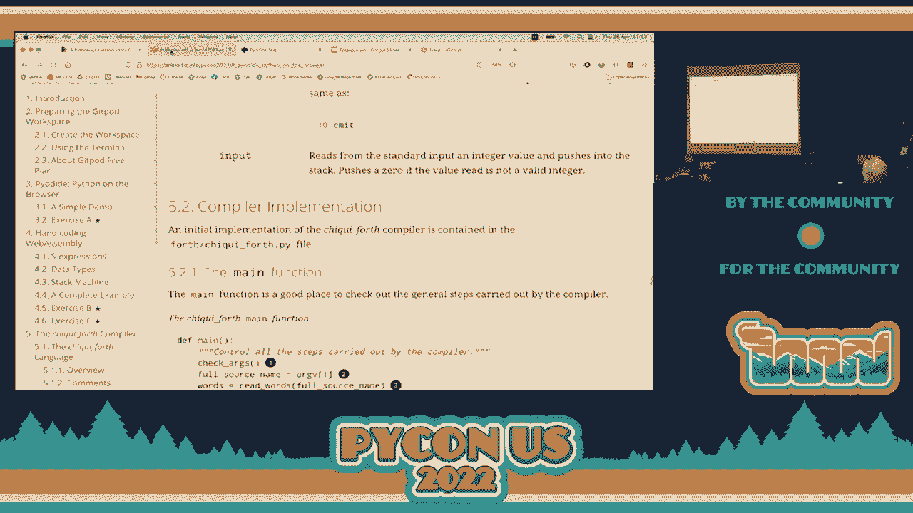

 And let's go to the fourth directory and let's look at the chicky fourth file， chicky fourth dot。

 p-y。 Okay， as you can see actually a lot of what we have here are actually comments or document strings。

 okay？ So the code is really small， okay？ So let me just show you some parts that are relevant for us to understand the compiler。

 I have some strings here as symbolic constants， okay？

 The first one is a multi-line string that has what we need to have at the beginning of every module that I'm going to be producing。

 okay？ My compiler is going to be producing。 As you can see at the very beginning it has a comment saying chicky fourth compiler。

 I think I didn't necessarily mention it， but anything that starts with two columns is a comment。

 in WebAssembly， okay？ WebAssembly text format， okay？ So here's our module， here's where it starts。

 We are going to import three functions， okay？ Import here。

 what it means is that this function is defined somewhere else。

 I'm going to be able to call it from my WebAssembly code here， okay？

 And as you can see these happen to be the input output functions， okay？ We have emit。

 input and print， okay？ These are functions。 You can see this is。

 you can think of it as being the signature of the function。 If it takes parameters。

 it's going to tell me so。 And if it returns something。

 it's going to have a result as expression here， saying that it's going to result in something。 Okay。

 notice that we're just using here i32， so it's going to only work with 32-bit integers， okay？

 And here we start the declaration of our function， okay？

 Notice that I'm only placing here its export directive。

 I'm saying that I'm going to export our function as a dunder， well it's not dunder。

 it's just an underscore， underscore start。 Okay， this is the name of my function and this is where the execution of the function is going to begin。

 okay？ We're going to use that name， the underscore start to indicate in our Python code that we want to execute this。

 all this function。 And in line number 32， notice here that we have here just two closing parentheses。

 This is one and this is the second one。 The first one actually closes the function and the last one closes the module。

 okay？ So every program that I produce here in my compiler has to start with these several lines of instructions。

 and has to end with these two couple of closing parentheses， okay？

 So this is something that has to happen here。 And in line number 35， we have a dictionary here。

 okay？ And this dictionary is the mapping between the words of our cheeky-forth programs。

 and the corresponding instruction or instructions in WebAssembly， okay？

 In WebAssembly it takes form。 So in line 36 you can see that for doing a multiplication， okay？

 We have the key in this dictionary is the star， okay？

 It means that whenever I find a star I need to convert this into the i32。

mool instruction in WebAssembly text form， okay？ It's actually contained within square brackets。

 It's a list， what we have associated to each value， because we can have several instructions。

 As you can see， for example， in line 41 we got the nl word， okay？

 And this one actually gets converted into two WebAssembly instructions。

 The first one is i32 const 10， which pushes a 10 to the top of a stack。 And then a call to emit。

 okay？ Call emit will call the emit function that is defined somewhere else。

 which is available here thanks to the important instructions that we did before， okay？

 So notice here we already have implemented the star， the plus， the dot， the period。

 the emit input and nl instructions here， okay？ So that's what our compiler currently is able to do。

 Plus some additional functionality that is actually provided later on。

 That has to do with things like accessing variables and so on， which is not here。

 But those are special because they work a little bit different。 They're a little bit more elaborate。

 okay？ So let's go to the very end of our code。

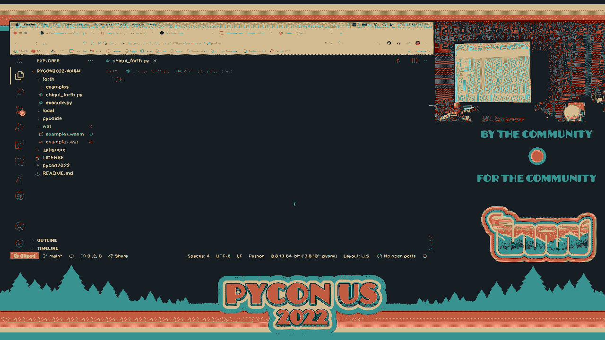

 We have the main， and this is actually designed so that you can just read the main and have a general idea of how this works。

 okay？ So any moment， remember， if you want to see the implementation of any of these functions。

 just， I think， if you tap， if you press control， and then just click with your mouse on the name。

 it will take you to the definition or use command， I think， if you're using a Mac， okay？

 So if you want to see， for example， how checkards works or how it's implemented or remove comments or whatever。

 just press command or control。 And then you hover over of the name and as you can see there's sort of a link there。

 So， for example， here remove comments， if I press command and then click over here。

 it takes me to the definition of the corresponding function， okay？ So， I mean。

 this is a standard visual studio code behavior， okay？

 So this is a fast way that you can see the implementation。

 But the general thing that it's doing is pretty obvious， hopefully， I hope。

 by the names that I'm using here in the different instructions。 So， in line 153。

 we check the arguments。 This program is going to be run as a script in the command line。

 in the terminal。 So checkards is just going to verify that I've sent one command line argument that is the name of the file that I'm。

 the cheeky fourth file that I'm compiling， okay？ If it's not。

 it just produces an error and ends the program。 Line 154 takes from this argument。 Rv， remember。

 is the vector of arguments。 It's just a list that contains the arguments in the command line。 Okay。

 so in index one， this is where the name of the cheeky fourth file should be found。 Okay。

 so I just put it here in this variable called full source name。 This is the name。

 includes any directories if that's part of the path of the file。 All this is included here。

 So full source name is the full name of our cheeky fourth source program， okay？

 Then we do this thing called read words。 Read words。

 actually what it does is that it reads the contents of the corresponding file。

 If the file is actually there and it's found and it can be opened， it gets open。

 And then as I mentioned before， it uses the split operation， the Python split over a string。

 and it returns a list of all the individual words， okay？ Remember。

 these words are just things that are separated by spaces or new lines or whatever， okay？

 So this variable in line 155， called words， contains all the words of our program， okay？

 Separated as individual strings now， okay？ There's a list of strings representing the single words in our program。

 In line 156， remove comments looks for words that actually represent or is an individual word that starts with an opening parentheses。

 So when it finds it， it knows that everything that follows should be ignored until it finds the corresponding closing parentheses。

 Okay， so remove words， remove comments， excuse me， does what you might imagine。

 It actually eliminates the comments from our words， okay？ So at this point。

 we only have the code that we really care about in of our cheeky-forged input。

 Result is a local variable here that starts as an empty list。 Okay。

 this is where I'm going to be putting all the instructions that are going to go as part of my output once we start generating it。

 okay？ So it will include all the instructions。 The part that goes at the beginning at the end of my what source file and then all the individual instructions that we need to place。

 So they get appended using， well， append， okay？ So this is a nor a new list。

 So we start here by appending everything that goes at the beginning。 Okay。

 remember we saw this multi-line string that contained all the initial declarations that have to go in a what source file at the very beginning。

 okay？ Then in line 159， this specific instruction， this function， well。

 if we look at it from the nested part， first this function is called。

 This is going to look for all the variables that are used in the program， okay？

 So it just looks and see which variables are used and they can be used in two ways。

 It can be used just the name of the variable。 If you remember， if the variable appears by itself。

 it means that we should detect or whenever we use it。

 it's just read the value of the variable and push that value into the top of the stack。

 Or we find a variable name followed by a bang symbol， the exclamation mark， okay？ And in that case。

 we know that we need to set that value。 But at the end， it doesn't really matter how we use it。

 As long as we use a variable， we need to find it， so find_vars just returns me。

 I think it's a list of all the variables that are used in the program in any fashion， okay？

 And then once we found them， we declare them， okay？ And the declare_vars， actually。

 if we look at the implementation here of the declare_vars， okay？ It uses this instruction here。

 local， followed by the name of the variable， starting with a $ sign， okay？

 Because all local names in WebAssembly have to start with a $ sign。

 But here we put the name of the variable， okay？ And we declare it as an i32 and place everything within these parentheses。

 okay？ The opening and closing here。 And there's this other variable。

 it's actually named constant indentation。 It's just a string with four spaces， okay？

 This is just for legibility's sake， okay？ Strictly speaking， it's not really required。

 but it makes our code a little bit easier to understand， okay？

 It's just had some nice looking indentation there， okay？

 So this declares all the variables that appear。 Any variable declared here has a default value of zero。

 so we don't need it even to initialize it， okay？ Automatically。

 these local variables all have an initial value of zero， okay？ So as we mentioned before。

 if we happen to use a variable without assigning any previous value to it， by default。

 it's a zero that we get there， okay？ Let's go back here。

 So the clear virus is the one that actually adds any variable declarations that are required here。

 And then this is really the core of our compiler。 It's called code generation。

 This is really where all the code generation actually happens， okay？

 Let's have a look at it because it is interesting and relevant。 Okay？

 So the code generation function takes where the result is going to be placed and all the words of our program that we're going to consider here for translation。

 We just do a four， okay？ We iterate over all the words， each iteration。

 each individual word is called word， okay？ And these are the things that I'm considering here。

 First of all， if the word is a number， okay？ If the。

 here the word that we're currently analyzing happens to be a number。

 we just push it here using this instruction that we use in the past， i32。comst。 And then the。

 whatever the word is， okay？ So if we find a five， if we find a three。

 if we find a forty-two in our input， in our input， a tricky fourth source program。

 we just push it into the stack， okay？ Using the i32 constant instruction。

 If the word that we're currently processing belongs to any of the keys of the operation dictionary。

 remember the operation dictionary is this one here。 So if any of the words is a star， a plus， a dot。

 an emit， an input， an L， any of those， okay？ If it's any of those。

 what we're gonna do is that we're just gonna place the associated statements that we have in the dictionary。

 and we're gonna just put them in the result， okay？

 We use another internal for because it might be several， and this is just done too。

 And practice just to make sure that we add the indentation to each individual statement here， okay？

 If we find a variable， just a variable， plain variable to read， not to set， okay？

 The variable that instruction just gets translated into a local get with the name of the variable and the dollar sign at the beginning。

 And this is the other case when we have variables that end in a bank operation， okay？

 So here's the exclamation mark at the very end of the word。 And if the rest of the word。

 the things that go before the bank are a valid variable name， then we convert that into a set， okay？

 So get and set， this local get and local set are responsible for， in the case of get。

 reading the value of a variable and pushing it into the top of stack， and set does the opposite。

 which is take the top of the value of the stack， set and copies it into the variable， okay？

 So we got the two things that we want to do with variables。

 which is read those values and then update them， okay？ Or assigning them。

 which is what the set operation does in WebAssembly。

 And here remember it corresponds in Chickyforth when you use an exclamation mark， okay？

 If none of these actually went in， it means that we found a word that we don't know what it is。

 and if it's not something that we want， which it isn't， we just throw an exception。

 a raise an exception here， okay？ Once again， this example。

 this compiler is fairly simple to a really full-blown compiler。

 I've been teaching compiler construction for 20 years at my university。

 So typically building a compiler is something that we take a full semester to do， okay？

 And we have to do lexical analysis and syntactic analysis， semantic analysis。

 and then we do code generation and optimizations and stuff。 So all that takes a lot of time， okay？

 But now， well， in just around 150 lines of code， we see a full working compiler。 Because once again。

 the language that we're really compiling is very， very simple， okay？ The essence really。

 if you want to think of what does it do is that it takes the name of a file， it reads a file。

 it uses a split to separate the individual words， and then looks at each word and says， okay。

 what do we need to do with this word， okay？ And most of the words can actually be translated thanks to this dictionary called operation。

 okay？ So that's a general overview of our compiler， okay？ And yes， we need to， in the produce code。

 we need to put something at the beginning and then at the end。

 So at the end we have something that is a complete full-valued WebAssembly text file， okay？

 At the end， if we follow once again， go back to the description here in the main， what's happening。

 okay？ We were looking here at code generation， okay？ Once we've finished code generation。

 we just add what goes at the very end of the two closing parentheses that were in the string。

 We put that in result， okay？ And then we do this magical function called join。 Okay。

 we're joining all the strings together， just separating each string with a new line， okay？

 I don't know if you've used join in other languages。

 but Python actually has the object and the arguments switched in the opposite order in which you typically find the join operation in most other languages。

 okay？ Most languages typically you have an object， which is a list。

 and over the list you do the join and just tell it。

 I use this string to separate these individual lines， but for some reason， the --， >> [INAUDIBLE]。

 >> Yes， but in other object-oriented languages， I don't remember， for example。

 JavaScript has a join， but if it does， typically is the method is associated to the list。

 and the argument is the string that is going to be used to --， >> [INAUDIBLE]。

 >> I think it wasn't really that difficult to do it the other way around。

 but for some reason they decided， I really don't know if it was a widow who decided to do it this way。

 but once again， if you're using Python only， it's not a big issue because you already know this。

 but I find it sometimes confusing because in other languages I'm expecting to use it。

 The arguments in the other way， okay， but it's just a comment there， okay？

 It really doesn't really have to be in a certain way， okay？ Here in line 163， 163。

 we separate -- we extract the extension of the file that was provided in the command line arguments。

 okay？ So if my file was called hellworld。4th， the fourth extension we're going to use is a four followed by TH。

 okay？ That's a fourth extension。 We eliminate the dot and the extension。

 and now we have the full name without extension of our input file。

 and we use that file name for two things。 We're going to create a what file in our file directory as part of our local file system and corresponding WASM。

 And this WASM here， this actually calls， if we look at the implementations right here。

 calls a function called WAT2Wasm， which does exactly the same thing as a WAT2Wasm utility that we use from the command line。

 okay？ These happen to have the same name， but the one that we use in the command line was part of this webit tools that you can use from the command line。

 This WAT2Wasm is part of a package called WASM， okay？ WAT2Wasmr Python， okay。

 which is another runtime system for WebAssembly， and this one particularly well runs with Python。

 okay？ But the general idea is the same。 It converts， in this case， what is contained in a string。

 It's converted into a binary object， okay？ Which we then in line 148， write it into a file， okay？

 So I'm writing these two files， the WAT2Wasm file。 Strictly speaking。

 we could omit the WAT file because this was created just as an intermediate thing。

 but actually we don't really need it once we used it to create the WASM file， okay？

 But because it's useful and educational， we can have the WAT file and we can open an editor and see what it has known。

 Especially when we're doing the development， it's very useful for debugging purposes and see if we did everything correctly。

 okay？ So this is why we're creating these two files， yes？ >> [inaudible]。

 >> You need to use special tools to actually do that， okay？ So just for example。

 I mean if you want to look at it now， I'm currently still here at the WAT directory。

 and I wasn't really prepared for this， but let's see if I remember。

 There is a utility available here that is called WASM， I think it's WASM object。 Object dump。

 it's called， OBG dump。 Where here， you can use for example the option -D。

 this one disassembles and then you specify here your WASM file。

 And this one will generate the disassembled code of whatever you have here， okay？

 This is not in the notes， okay， but just write it down if you find this amusing or interesting。

 Here it actually displays the disassembly。 As you can see， it's basically the same instructions。

 but the rest of it is not using the names of our parameters。

 and even the constants as you can see are actually in Exedesimal。

 so they might be a little bit complicated to understand。 But here。

 these are the Exedesimal equivalent bytecodes you can call them， okay。

 for the program that we have here， okay？ So this is a way of inspecting your binary file if you want to。

 okay？ Once again， you can't， or you shouldn't really open WASM files in an editor。

 but there are tools that allow you to inspect it like this one here。 Okay， the WASM -D。

 this allows you to do a disassembly， so you can see the corresponding code。 As you can see。

 this one here represents the AVG2 function， and this one is the AVG3 one， okay？

 And it has the same instructions that we have here， plus it adds some， for example。

 we didn't put an explicit end， but here it's actually added。 And instead of using the option -D。

 you can use the option -X， and this one gives you the disposition of the different sections that the WASM file has。

 okay？ It has a section for types， a section for functions， a section for exports。

 and then a section for code， okay？ So this one allows us to see more in detail the corresponding sections that are available。

 okay？ So this utility is WASM -OBJ dump， okay？ If you want to look at what's in the WASM file， okay？

 Once again， if you try to open it， I mean you can try it， open the WASM file。

 you get this message saying the file is not displayable in the editor because it's either binary or users and support in text encoding。

 okay？ Do you want to open it anyway？ Well， let's say yes， okay？ Use the text editor， and okay。

 it doesn't really look like anything useful， okay？ As you can see。

 something interesting that is available there is that it contains the name。

 you can see the name of our exported functions， ABG2 and ABG3， here they are。 [ Inaudible ]， Yeah。

 and another interesting thing is it has a magic number at the beginning， okay？ It starts with。

 don't remember what's the very beginning here。 It's probably easier to look here at using an ordinary x dump。

 Let's see if this works。 Okay， this x dump just places all the contents。

 and you can see here the magic number at the beginning of this file is zero。

 which is this representative is stopped。 And here we have 6173 and 6D， these are excitimal numbers。

 They correspond to the letters AS and M。 This is how we can see that this is actually a binary as in WebAssembly text file。

 okay？ So this is using a standard Unix or Linux utility call x dump just to see the content of the files。

 Okay， notice that x dumps allow us to see an excitimal all the corresponding bytes that are in part。

 So this is useful when you have a binary file， okay？

 But it doesn't really give us a lot of information。 It just， well， it's not immediately obvious。

 but it contains all the byte encoding for the instructions， and here's the magic number。

 and as you can see here， this is the magic number。 And as you can see here。

 this is a section of the exports， okay？ That in the previous output that we had here， export to。

 it has a bg2 and 3， which we can see that they're actually here， okay？ And， well。

 the rest is obviously valid information， but an interesting thing here is that the WebAssembly binary files that we can take here are fairly small。

 So I don't know if you've seen， for example， if you use any compiler for C or C++ or Go or Rust。

 in C and C++ typically， an executable binary file is with all the information that it requires。

 So it parses typically a few hundred or maybe tens of thousands of kilobytes， excuse me， big， okay？

 So you might have a hello world in its， I don't know， just to say number， 80，000 bytes wide or big。

 your corresponding file， okay？ WebAssembly is very， very， very small。

 and this is very useful when you're transporting or sending your files between a server and a client。

 So it's really your files to be very small， okay？ Because it's very big， of course。

 it's going to take much more bandwidth to actually get it there where you want to。

 So WebAssembly is really compact and small format and that's very useful as it is， okay？

 So going back， let's see where we're going。 We should be able， at this point。

 here's the description of what we explained a moment ago。

 There's this thing that we need to see in order to run our code， remember。

 WebAssembly needs a hosting environment to run。 The examples that we saw a moment ago using Wasm3。

 that was a runtime environment， that actually is an interpreter。

 that allows us to see our code running。 But we're now going to be integrating it using this Python package called Wasmir。

 okay？ Wasmir has all the functionality to do most of the things that you would expect to process WebAssembly text files and binary files。

 okay？ It allows you to take a WebAssembly， a WAT file， a WebAssembly text format。

 and it converts into Wasm to the binary format。 It can take an already compiled Wasm file in binary form。

 it can actually take it， translate it， convert it。

 get the module converted into an instance that it's called， and execute that， okay？

 Within a Python program， okay？ So this is a really interesting part of how this is integrated。

 And in order to see that there is this program here， I'm not going to look at it in too much detail。

 But this one is in this program called Execute。py。 It has all the functionality。

 Let's open it here quickly。 Where am I？ Oh， here we are。 Let's close this。 And let's open here。

 Execute。py。 So here， if you go to the very end， okay？ This is what the main function does here。

 Just as we did in the previous program， it checks that the number of arguments are correct。

 Here we're expecting to receive a Wasm file， okay？ If it is， we create an instance。

 This create instance just encapsulates all the logic that is required。 Here it is。

 This actually uses extensively a lot of functionality provided by Wasmir。

 So if you really want to go and see how all this works， check the Wasmir documentation。

 It needs to create several objects， a storer object， an instance， a module， and so on。

 So I'm putting everything here just together so that it just works。

 As long as you send a file name there in line number 54。

 a file name that is actually a valid Wasm file， okay？ It will be able to read it， to instantiate it。

 and to do just-in-time compilation and everything that is required。

 Notice here that we're using this operation called engine。get， okay？

 This is the just-in-time compilation， okay？ And at the end we return this instance object that contains all the information。

 Now another thing that is important here is that it calls this make import object。

 which is a function that is just over here。 And the interesting part here is that it contains the code that we imported from our WebAssembly modules。

 okay？ Remember， at the very beginning of what we're going to be producing。

 we had three import instructions。 And these are the functions that are going to be called whenever we do a call to the corresponding function。

 okay？ So here we have the emit， the input and the print instructions。 These are Python instructions。

 As you can see， for example， the print is very simple。 We receive here an integer。

 We use actually annotations here so that the tool knows what we are expecting to send as input and to produce as output。

 But here we receive here an integer and we just use standard print。

 Actually this function is called underscore print because otherwise what I enter into a conflict with a predefined function called print。

 We just print the value of X which is an integer and we put it at the end just instead of a standard new line which is what typically ends our print instruction。

 We're ending with a space here， okay？ For the input we use the input instruction and we call int。

 If this happens to produce an exception， a value error exception， we just return a zero， okay？

 So the input doesn't crash， okay？ If you put anything that is not a valid integer。

 it just returns a zero， okay？ And here we have the emit which is very similar to print。

 We just convert X which is an integer into its corresponding character。

 So we use the CHR which is a standard function in Python that takes an integer value and converts it into a string that contains。

 the corresponding character of that code point， okay？

 And in the case of the end we don't add a space， we just keep the cursor where it is， okay？

 So with all that in mind we should be able to see how this can work。

 So in order to make it work we need to change first to this directory called fourth， okay？

 Once again remember you can change it， here's the command if you want to change it from anywhere in your current system。

 So you can use that one there， it's a CD instruction。 Or you can。

 if you know how to navigate here in Linux you can go to the correct directory。

 You can change the prime directory and then go to the directory you want， okay？

 And here in the fourth， so in order to run the compiler， the compiler is called "chicky fourth"。

 okay？ You just put the name。 Remember here the "chicky fourth" actually has a hash bang at the beginning and it has execution permission so we can just execute it like this。

 okay？ 。slash and then the name， okay？ It knows the operating system。

 knows that we are able to run this program， okay？ And let's try it with first example which is called numbers。

 okay？ This is a fourth program， let's quickly look at it。 Here's examples and here's numbers， okay？

 So we have a quick description of what this does。 As you can see it says "Add and multiply two user provided numbers"。

 So here we start with these two emit instructions。

 This actually just prints a greater than symbol and then a space so it looks like a prompt and then allows us the user to do an input and whatever his input is placed on top of the stack。

 And with this we pop the stack and just copy this into the variable "x" and we do the same thing with "y"。

 And then we have all this which will print actually the value of "x" plus the value of "y" and gives us a corresponding result。

 okay？ So this is our first program。 Remember this is fourth。

 this is our input program that our compiler currently knows how to translate into WebAssembly。 Okay。

 we run it， we shouldn't have any problems。 Notice here that it creates two files。

 a "wasm" and a "what"， okay？ We can inspect with the editor the "what" file， okay？

 So we can open and see what it is， what we have here。

 So now this is the code produced by the compiler。 Okay， as you can see it's quite a lot of code。

 Our program was， original program was much shorter， it was actually just 14 lines of code。 Okay。

 but the corresponding "wat" code requires much more lines， okay？

 But I mean at the end that's a point of actually writing a compiler so that we don't need to write all this by hand。

 okay？ I mean that's why compilers were actually born。

 Remember that when computer as an industry started all programming was done in machine code or in assembly language。

 okay？ But then suddenly some people realized， well what if we had a program that we could write our code in a much longer way？

 And then write our code in a much higher level and then translate it into machine code or assembly。

 okay？ That's exactly what we're doing here， okay？ So very powerful。

 the idea of getting something written in a certain notation。

 translating it into something that the computer can understand more easily， okay？

 So how do we run it？ Once again you can inspect all this with much more detail， okay？

 This is exactly what we had in this program here translated into WebAssembly。

 So just to run it here， once again in the terminal we now run the execute script and we tell it where to find the Wasm file。

 okay？ In this case it's also its place in the same place where the source file was。

 So here we have Wasm and WAT。 We run the Wasm， okay？ The WAT was useful to create the Wasm。

 And it's now running， okay？ So think of it， what's happening here。 We。

 Wasm are this Python package that is the WebAssembly runtime， is able to read this file， okay？

 Which is this binary format。 It does a just in time translation of that file into the native platform。

 whatever is running here in our Git pod workspace， okay？ It gets translated。

 this is actually an x86 computer。 So it gets translated into that native code based on registers and so on。

 And once again， strictly speaking the Wasm code can't really interface with the rest of the world。

 but because we have these imports， we're able to combine them functions that will do that job for us。

 okay？ But notice that even though what we're looking at， what gets printed。

 and in this moment it's actually expecting us to type something。

 all that is being done through Python。 But the order in which the things are done and the arithmetic operations like the addition and multiplication is going to be done。

 all that is done through the native code that was translated from the WebAssembly binary code， okay？

 So， I mean， there's a lot of stuff actually happening here， okay？

 But at the end it gives me just the illusion of everything working nicely together。 So let's put。

 I don't know， a 10 and let's put a minus 5， okay？ And these two lines 11 and 14。

 these are the ones in charge of displaying what we have here， okay？ So as you can see。

 it is working。 And we have a Hello World， okay？ We typically start with Hello World in many languages。

 but here it's not that really interesting。 As you can see here， we start in line number four。

 we start pushing a 72， what's that， 72？ It's the capital letter H， yes， exactly。 And we do an emit。

 so that prints the H， okay？ And then we have 101 emit， that would be the lowercase E， okay？

 And we emit it， okay？ And so on。 As you can see， putting messages here is pretty difficult。

 pretty error prone， okay？ But it works， okay？ And at the end it has a new line。

 So we can now try it out。 Okay， so we first need to compile it， we use a cheeky fourth compiler。

 The file is in the examples directory and it's called Hello World dot fourth， okay？ Once again。

 remember when we use cheeky fourth， this creates two files and here they are。 One has the same。

 they both have the same extension of the program that it compiled。

 The program that we see as input has a dot F4th extension， okay？

 And it produces two files with the same name but different extensions， Wasm and what？ Once again。

 you can open the WAT to see what it has， so this is the Hello World。 As you can see。

 it's pretty long， 37 lines of code。 Okay， and in order to run it， we use execute。

 And we specify the directory from the file with extension， Wasm here in this case。

 And it says Hello World， okay？ So it's working fine。 Okay。

 I don't know if there are any questions so far？ Nope， okay。 Okay， now we're going to give you。

 but basically there's only two exercises left， okay？

 I'm going to give you some time so that you can solve them now。 Okay。

 let's just quickly explain what you're supposed to do in both these exercises。 Okay。

 so exercise D which is section 5。5 of our tutorial notes。 Okay。

 we're going to add a bunch of new operations， okay？ And this is fairly easy， okay？ So， for example。

 if we want to have support for minus， which we currently don't have， okay？ What are we going to do？

 We're going to add this word， the minus， to the dictionary called operation。

 And I'm giving you here so that you don't need to look it up。

 This is the corresponding instruction that needs to be done whenever it finds a minus。 Okay。

 so let me go here quickly。 You would go to the chicken fourth file。 Here it is。

 look for the operations dictionary， the operation dictionary， okay？

 It doesn't really matter where you put it。 I'm going to put it here after the plus。

 but it really doesn't really matter。 You put the name of the word， in this case it's the minus。

 And inside a list you need to put a string with a corresponding WebAssembly instruction。

 What's the corresponding WebAssembly instruction here？ It's i32。sub。 Remember。

 I'm putting you there a link if you wanted to look at the documentation and see。

 exactly how it works and variations of this instruction， okay？ But at this moment。

 if you just use the instruction that I placed over there， that should do all the trick， okay？

 So you can even copy-paste it if you prefer。 i32 sub， okay？

 And you need to do exactly the same thing there for all the instructions here， okay？ Which are。

 we just did the minus， the slash， which does division。 And then we have equal， not equal， less than。

 less or equal， greater than， greater or equal， okay？

 And please check out the corresponding instructions。

 Some of them are not necessarily immediately obvious what they are， okay？ But I placed it here。

 So you need to complete that dictionary so that it has all of them， okay？

 And if everything works correctly， okay， you should be able to test it for this exercise that you can do。

 So this exercise D using this file which is called operators。forth。 Okay？

 So if we go and open that file， here it is， operators。forth。 Okay？ This one tests us everything。

 okay？ The subtraction， the division， the equal operation， the not equal and so on。

 And generate some values there， okay？ All these， these operations that are like equal and different and so on。

 The way that this works is that， for example， here it's asking effects is equal to y。 If they are。

 it pushes a one in the top of the stack， the one indicating true， okay？ And if they're not equal。

 it puts a zero indicating that it's false， meaning that they're not equal， okay？

 So I take the expected values here that are produced。

 add some additional values over here and do some limits。

 So if you run this and everything is working fine， it says here that it prints。

 everything is working fine。 If everything is working fine， okay？

 So if you did all your work correctly， it should print this。

 If some of the characters are not correct， maybe you mistakenly did something else， okay？

 If something is wrong， instead of looking at all these individual characters。

 you might see some characters change， okay？ So if it's not exactly this string。

 you need to check and see if you did something wrong。 Or if you get an error， okay？

 Something was missing there， okay？ So hopefully with that introduction。

 you should be able to solve this one here。 And let's go directly with exercise E as well， okay？

 Exercise E， what we're gonna do is we're gonna add a do loop here， okay？

 Two words that actually correspond to like a while， a while loop in other languages。

 including Python， okay？ It basically works exactly like that， like a while in Python or in C。

 Or in Java or any other language， okay？ So do indicate this word indicates a very start of our loop。

 okay？ Then we expect a condition here。 The condition is just any cheeky fourth code that if the result in the top of the stack once the condition is evaluated is the value of zero。

 okay？ Zero remember represents a false value， okay？ If we have a zero on the top of the stack。

 well we pop it。 If we find a zero， we go to the end of the loop， okay？

 That means go to whatever instruction follows the loop word here， okay？

 So just like a while in other languages， okay？ We evaluate， if this is false， we end the loop。

 Exactly the same thing happens here。 We evaluate the condition。

 If we get a zero on the top of the stack， we pop it。

 And we go to the end of our do loop structure here， okay？ Or construct。 But if it's true。

 and true means anything that is not zero， okay？ We go to whatever is after the question mark。

 and we call it here the body。 We execute the body here as many times as we want， okay？

 So here's an example of how this is supposed to work， okay？ So we start here， x， we initialize it。

 Remember this sets of value of x to whatever we have in the top of the stack。

 which in this case is going to be a one。 We want to print all the numbers from one to ten。

 each number in its own line。 Then here we start our loop， okay？ I'm using indentation。

 not because it's required， just because it makes it simpler to understand。 We have this。

 I'm asking here if x is less or equal to ten。 If it is。

 these words here are going to leave a one in the top of the stack。 So we pop the stack。

 and if it's true， we'll continue with what follows。 But if it's false。

 which means we had a zero here， it goes and executes。

 continues executing whatever follows the loop instruction here。 Or the loop where， okay？

 But if it's true， okay， I mean if it's false， it ends the loop， but if it's true， it does the body。

 In this case， this body is these instructions。 We print the current value of x， okay。

 and we print a new line。 In this last instruction， we add x plus one。

 and then we assign the result to x， okay， using x bang here。

 And we go again to the beginning and ask if our current value of x is still less or equal to ten。

 okay？ So this prints one， two， three， four until the ten， okay？

 So once we add this instruction here， you notice that we're not going to add an if instruction。 If。

 believe it or not， can be simulated using a do with a little bit of imagination。

 Probably not as simple as to use a standard if instruction， but if you think of it， the do loop。

 even though this is similar， even though this is supposed to be repeated through terms。

 you can guarantee that it only does the condition once。

 and then set another variable so it doesn't go in again， okay？ So the do loop。

 even in a primitive way， can actually support some kind of if， uh， construct， okay？

 Once we add the do loop here， just as an interesting fact here。

 the cheeky fourth language is converted into something we compare scientists call Turing complete language。

 okay？ And in general， this is CS jargon to say that our program or language actually is able to do the same thing that a Turing machine can do。

 okay？ So we basically have a full programming language here available that can do some pretty neat stuff。

 okay？ And the good news for us is that the do and the loop and the question mark are really straightforward to implement。

 Not going to explain exactly how they do it， okay？ If you have that kind of curiosity。

 check out here the links of these instructions block loop and branch。

 which are the ones that we need to use。 But notice here。

 you're going to change the operation dictionary just like in the previous exercise。

 and when you find a do， okay， you put a list with these two instructions， okay， as strings。

 When you find a question mark， okay， the associated text or code in this case is these two instructions。

 And finally， the loop， when you find the loop as a word in the cheeky fourth program。

 you convert it into these three instructions in the corresponding -- well， in the list。

 each one in as individual string， okay？ And the rest is actually -- the compiler actually knows how to produce or generate all this code directly。

 as long as it's in the dictionary in the way that I just described， okay？ So once you have that。

 you should be able -- well， just a quick note over here。

 and this is something that was mentioned a moment ago。 The do loop actually introduces a new stack。

 which is independent of the stack that was actually available before the do loop started， okay？

 So you have to understand that you start with a brand -- when you have a do。

 you start with a brand new empty stack， okay？ And you have to make sure that at the end。

 the stack is empty， okay？ When you finish your code， okay， you have a condition， you have a body。

 At the end of the body， you have to make sure， and at the end of the condition as well。

 you have to make sure that the stack has no elements there， okay？

 The example that we just saw a moment ago guarantees that that's how it works， okay？

 So most of the time it should make sense to make it work that way， but if it doesn't。

 you'll get a validation error， okay？ So just mention that。 So， yes？ >> [INAUDIBLE]， >> Yeah。

 in this case， you need to use div_s because for integers， you can have two interpretations。

 They can be signed or unsigned。 In the case of floating point numbers， they are always signed， okay？

 But integer numbers can have or not signed。 So you have two versions there。

 There is a div_s for signed values and a div_u for unsigned， okay？

 And this is one of the reasons that I actually place explicitly the instruction， okay？

 Because these are some of those things that are not necessarily obvious， immediately obvious， okay？

 So yes， use div_s and this actually happens as well when you use less than or lesser equal。

 You need to specify you're using the signed version or the unsigned， okay？

 Because it's a different instruction depending if you want to consider or not your integers with or not a sign。

 okay？ So once again， here you just need to add these， associate these words in the dictionary。

 in the operation dictionary with these instructions， okay？ And if everything is fine。

 you should be able to run these remaining three programs， okay？ One to ten， dot fourth。

 triangle dot fourth and pow two dot fourth， okay？ Just in the case of triangle and pow。

 I actually tested this code with my students a couple of days ago。

 And the media question is what am I supposed to input in these two programs？

 So trying for these last two programs， try any value between five and twenty and see what happens。

 okay？ I'll be with you in just a moment， okay？ So do these two exercises。

 test it finally at the end with these three examples， okay？ And if everything works。

 you're all done， okay？ I'll be here just to answer in general any questions that you might have。

 but just let me tell you what's available here in the next section。

 These are some books I've actually read completely。 This one。

 this is really short book and read a few chapters， not all of it。

 but this is a very nice book if you want to have a really technical in-depth overview of WebAssembly。

 okay？ Both are available through the Aurelius media site， okay？ But they're also available on paper。

 I think。 And some additional resources， okay？ So check them out if you want to。

 to see a little bit more in-depth any of the things that we've described so far。 And remember。

 the notes are full of links to Wasmir and to all the technologies that we mentioned。

 So in any moment， if you want to learn more about that， just follow the link， okay？

 So please work on these and basically that's all the material that I'm going to be presenting。

 So we have here until 12。30， if you have time and want to face these exercises。

 I've seen some people that needed to leave a little bit early。

 But I hope you can try it because it's really interesting to see the final results of the full compiler working。

 okay？ And remember that at the end this is typically the use case that we have most of the time on WebAssembly。

 We got a higher level language， in this case， Chickyforth， producing WebAssembly， that we call from。

 in this case， a runtime system which happens to be Python， okay？ So here we're using Chickyforth。

 but in practice this could be produced， the Wasm file could have been produced by a C compiler。

 a C++ compiler， a Rust， a Go， et cetera。 There are many plenty of languages that you can use。

 but at the end you typically write it in a higher level language and let the compiler do translation。

 okay？ So what we're doing here is writing our own compiler so that we can see how this process is done。

 I hope you find interesting and amusing a little compiler。 I mean it's fairly simple。

 fairly straightforward， but it actually does produce a complete WebAssembly output， okay。

 that we can actually run。 Okay， so please carry on with these exercises if you do have time and I'll be here answering any questions that you might have at this point。

 okay？ So I think for recording purposes that would be， oh， okay， thank you very much。

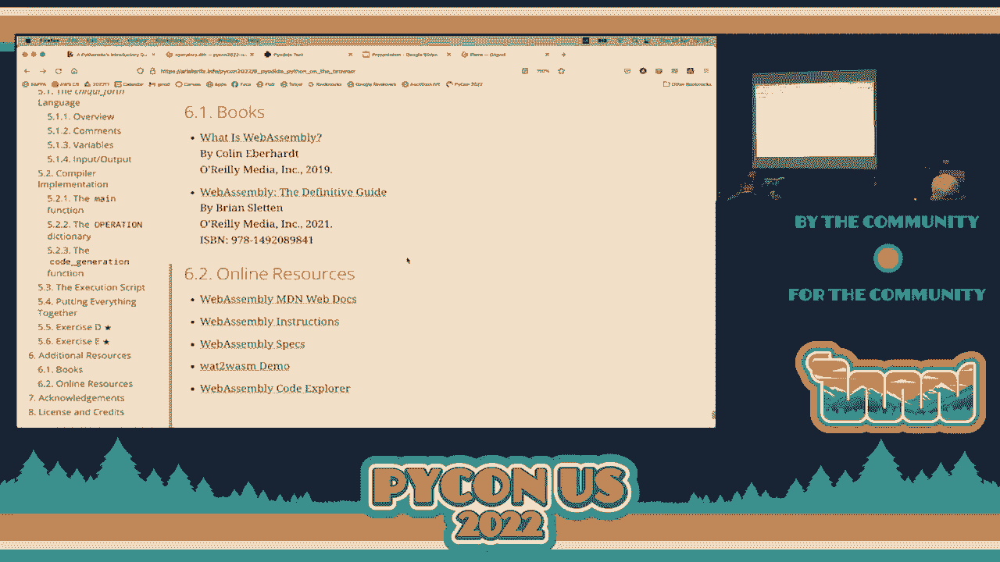

 [APPLAUSE]。