# P23：Talks - C.A.M. Gerlach, Erlend Aasland_ Iteration Toward Transformation of the P - VikingDen7 - BV1114y1o7c5

 All right， welcome everyone。 I'm Jeff Hill， and I'm here with Kim and Girl Out， and Kim's。
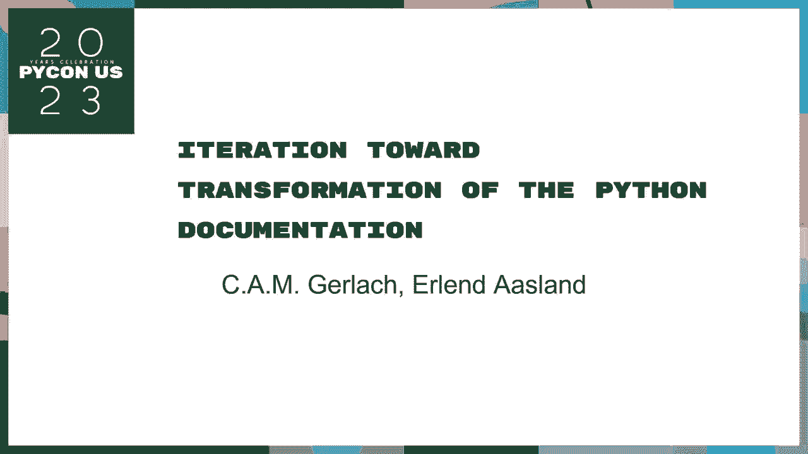

 going to be talking about iterations for a transformation of the Python documentation。 that we can be around with a lot of。 All right， everybody thanks for definitely appreciate and thanks to the Facebook and。 the website。 I've been waiting for you for $1。45， I just can't let you start about that。 I just can't tell you what you're talking about。 So yeah， I'm not even talking about。

 how we're entering into my form with the Python documentation。 It's better for real as me。 so you're talking about the documentation， so I'm not。 so lots of them go out of effort and you're doing it， but there's a lot of things to do and。 how people work。 And you're going to make it， and especially if you're using the， program。

 all of the levels to really use that， and you can also sell for a company。 Let's go。 First of all。 about me， I'm Kim， I just have a depends on the values of the two。 things you loaded to expect on a core death， can believe it。 But yeah， that's better。 the most of the time they're on the docs team， I work in the patching stuff， 10% of my defense team。

 especially the patching， some experience to the enders， and most of the。 four that require which is started with talking about environment， and then seeing them move。 out of a three- or four project， like you can talk about a number of them。 And back in the back。 I was actually a middle programmer， I'm actually a middle programmer， before I went in there。

 And in real life， I might be a rationalist， and I'm a lightning researcher， I'm a real university。 I'm a host， and I'm a real professional， and I'm a bi-， e-mail， and I'm a bi- e-mail。 so once I graduate， I get my， I'm a marathon， so I'm looking at it。 Really， it's a good deal。 good deal， good deal， to a team， so you can see this side of the map， so it's a nice， nice。

 big experience， because I was in the local community， and particularly the， Python community。 all of the best， unfortunately， I'm going to be a full-time， over-world developer。 So hopefully that works out， and that's me with my team catch， and one of my team catch， and I do。 want my team catch， and do it in real life。 So， yeah， I'm going to be out there， also， and also。

 considering the presentation， as I'm in playwright， a lot of the flanks， and just talking to the。 questions you're using， but as people also have Python for developers， who's even where the bot。 team is， is going to do the last as well， and so I'm going to be here with the people that。 three-moderals， which I thought about in a minute， and me and a lot of them have to work。

 together on a whole new place， so in that， I'm going to take a look at the problem。 and follow the dice， and see those in two minutes， and I'll go over a little bit of what。 it's supposed to do that later in the thought。 I think there's a few software developers。 and inventosciating in the old one， so quite a bit of a general experience， this is there。

 But of course， most importantly， this is possible for me， and this is， on behalf of the entire。 Python。com community， and we made all this a possible problem。 And what we've done about it， by you。 is it was done by all the great members of our community， particularly， of course。 the others in the area of it， as well as Peter， SBO， for June， and then， to join today。

 on the page of you， and Ann and Claire， Daniela from the practice， before July， from the book。 on the other one， the second， I think， is the new guy， so I'm going to go ahead and say， "Oh。 you're good。" And， let's say this is what we're going to talk about， but first。 I'll give you a little bit of a quick look inside。

 because that's the only way to solve what to solve， that， and what's what things we do， and then。 to pull it back， it's about the year， so， and， go over some of the things that we've made that are quite conductory facing。 roll credit， and then， then， then we'll do a little bit， because we're supposed to look at。 the particular discussion that， along with the EFII， have done on the EFI。

 the EFI is the only way that we're， thinking of all of it。 All of it， all of the very faculty。 and more importantly， the social media， we want to know that， but， and then。 that was the question of people's day， and the video， 60， that was made of this type of gospel， and。 in any case， it's really， really， really， something like the new one， because。

 I'll see how they're doing that， so， so， first， we'll take a， second side。 one of the full dots will make them， and we， we've got a lot of questions， and， but。 we're just feeling more connected， as in， say， the last part， because we've talked about。 the different distributors， and got them in theory， is this a bit， including the quality of。

 I think， I think， that's a lot of the words， but， in other words， we don't really just think what。 we're going to talk about， which， could include all of you too， if you wanted， I'll continue， so。 we think that's going to be a part of us， and， so， what part is going to be， well， we'd。 provide us together， and， well， that is more， and， that's not just， much more， we still， I think。

 you're actually thinking back， and， you know， I think， I'll be talking about it on。 these other things like that， and， you know， I think， I think， we're， we're always going to be。 focused， and， I think， more， and， we'll be discussing more， a lot of the issues， uh。 concerning a type of doctrine， and， we're both compensating， but， I'm going to be。

 I'm going to talk to you， in the best it can be， but， you know， what's more powerful， so， you know。
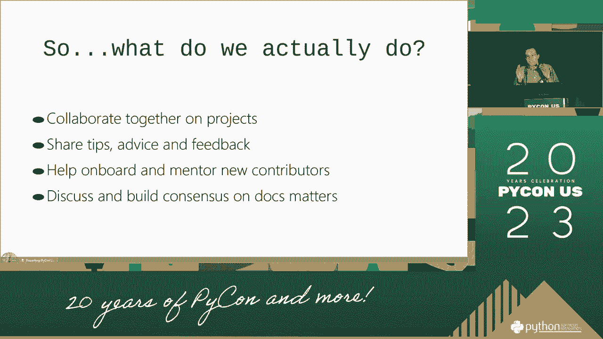

 where you're going to have to run， I mean， the daily， weekly， we'd provide， like。 both of us are working all around the world， that， you know， the world is primary to place， and。 of course， we want to justify talking， because， in other words， we call it， it's very， too， so。 it's important。 You just， like， just in other words， you know， all of our resources are， public。

 and， and， in other words， we're going to， it's always very， very， very。 And you should sign your request for possibly 1。0。 And you could sign the payment more of our bank。 Then you could use an affiliate's doors。 You could use a library or an affiliate's file to collaborate。 Of course， we also have a doc community website， in the U。S。 website。

 which has been submitted by this。 I mean， this site that we're taking， they were "totally" there。 where they had these things that could stay in the access space。 We took the documents off。 so they did not try to detect all of them， because they had a structure to adopt a larger， broad。 or cost-effective purchase。 We also have a doc population category。

 and then the pipeline is a bit more important， for a new vertical space。 And that's what we're going to discuss with the community。 before saying more or before the same thing。 Talk to the channel， and the Facebook document。 which is about the better to do。 And all 15 members of the whole group， and policy。

 which is completely confusing， it can help you feel that。 And we'll walk into a role of how two of us， have addressed those things。 So if you guys have any questions， feedback on the pipeline。 if it's the bar type of content you're going to miss you。
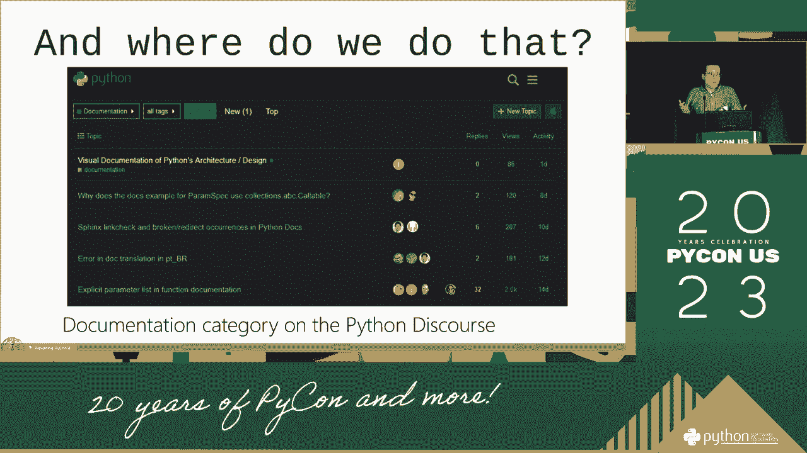

 the doc population category might be the place to go。 So our final policy is the doc teams of discourse， which is called real-time communication。 And our first question is， "Can you back， back， and forth？"， And it's also public。 and we find the link on our doc community on sites。 And everyone is welcome to join that as well。

 So we also need a doc population。
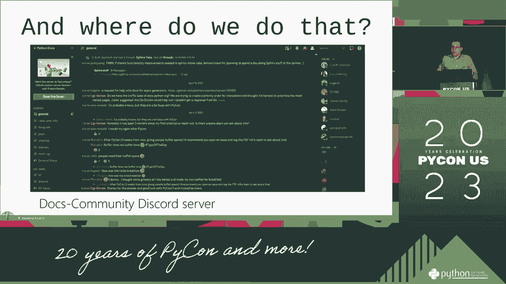

 Well， when I joined， to bring you a little bit of the first thing。

 that I told you about， and over a month， we also got them in。 and we're going to talk about it right before。 We're going to talk about our monthly doc community。 so we'll take the other things。 And it's difficult to get work done， and we ask， you know。 first of all， the great examples of who we call it， or who we're still conducting。

 and we're going to get， and the other person who's going to be there。 because it's not a real time step to the doc， and again， everyone who's welcome to the doc。 and everyone who's the first one is， "Hey， I've been sitting in the community。 and there's a deep fight in my office， and it's a real movie， but I'm very high。

 and I'm sitting here， and we're like， "Oh， you know， we apologize for feedback。 from someone outside of that stuff， and we didn't do well in the majority of life。"。
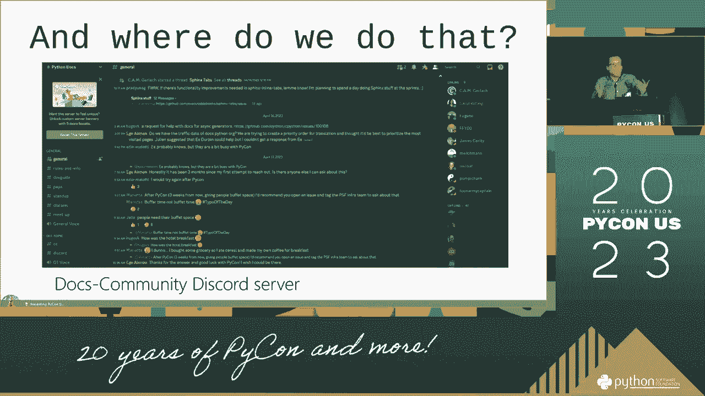

 So， I'm going to take a quick back， on the full of things that this is you've also used。 and this is what the things you've been into， and the other person who's been in the community。 and the other person who's been in the community。
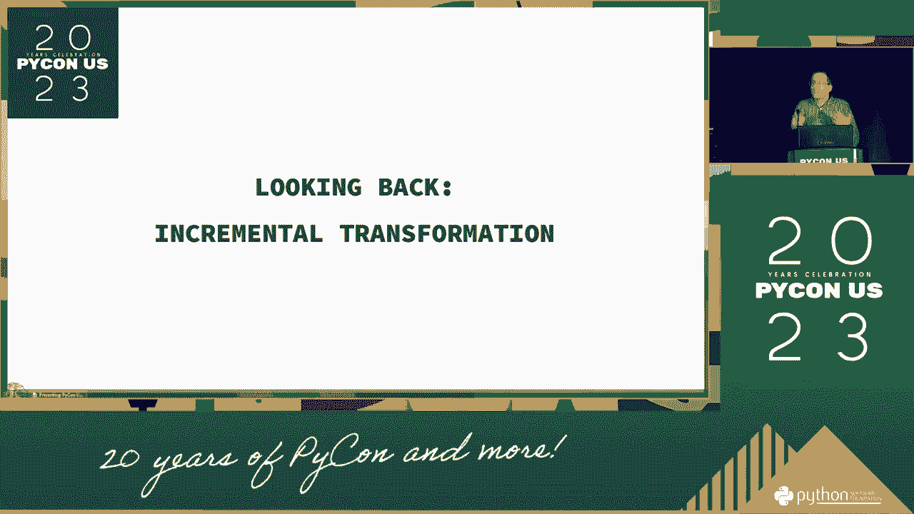

 and the other person who's been in the community， and the big team that I am in。 and I'm going to talk more about a little bit today， is in the diet practice。 I'm calling the diet practice framework， and the diet practice system。 and this is a whole bunch of the things， that I already made， and I'm going to take a little doc。

 but now I'm thinking of a kind of always an organized law， and I'm happy， but also。 the doc can tell best of those leaders， who are interested in， you know。 we hope to give them the information， and we need to navigate the type of。 and give better type of program。 So， you can see， because we're doing a sample of one of those cases。

 with business owners， people like the adoption of the data。 and I'll talk about more detail about this， and a little bit later than the talk。 I think what a lot of tech， and I work on， and I do a quite a long talk。 which I'll give you a little just a little bit。 But you also might want this to。

 a little bit of a difference， where we have a new doc team， saving the SDP button that we've taken。 Now， it's not going to be a nice thing to arrive at， but I'm never telling you to， of course。 that's also based on your system team， so you can， of course， you can， of course。 do all the writing or the doc team， but， and that， of course， basically， thank you to the。

 who put a lot of work into doing this。 And also， I think anything else in the pipeline， doc team。 is teaching as well， so， obviously， that's what we're talking about， too。 Of course， real quick。 a really good scoring for a question， but very， some of the longer functions。 and that is a lot of the parameters， and really hard to navigate。

 Here's some of the other things that we're talking about。 We've actually used the same stuff。 in primary with primary， but it's made a little easier。 And then we're going to use a little bit of both of the final， and then we're going to use the same。 like the data types， the default， and then we're going to use the same。

 and then we're going to use the same， what we're going to use， and then we're going to use the same。 and then we're going to use the same， and then we're going to use the same。 and then we're going to use the same， and then we're going to use the same。 and then we're going to use the same， and then we're going to use the same。

 and then we're going to use the same， and then we're going to use the same。 and then we're going to use the same， and then we're going to use the same。 and then we're going to use the same， and then we're going to use the same。 and then we're going to use the same， and then we're going to use the same。

 and then we're going to use the same， and then we're going to use the same。 and then we're going to use the same， and then we're going to use the same。 and then we're going to use the same， and then we're going to use the same。 and then we're going to use the same， and then we're going to use the same。

 and then we're going to use the same， and then we're going to use the same。 and then we're going to use the same， and then we're going to use the same。 and then we're going to use the same， and then we're going to use the same。 and then we're going to use the same， and then we're going to use the same。

 and then we're going to use the same， and then we're going to use the same。 and then we're going to use the same， and then we're going to use the same。 and then we're going to use the same， and then we're going to use the same。 and then we're going to use the same， and then we're going to use the same。

 and then we're going to use the same， and then we're going to use the same。 and then we're going to use the same， and then we're going to use the same。 and then we're going to use the same， and then we're going to use the same。 and then we're going to use the same， and then we're going to use the same。

 and then we're going to use the same， and then we're going to use the same。 and then we're going to use the same， and then we're going to use the same。 and then we're going to use the same， and then we're going to use the same。 and then we're going to use the same， and then we're going to use the same。

 and then we're going to use the same， and then we're going to use the same。 and then we're going to use the same， and then we're going to use the same。 and then we're going to use the same， and then we're going to use the same。 and then we're going to use the same， and then we're going to use the same。

 and then we're going to use the same， and then we're going to use the same。 and then we're going to use the same， and then we're going to use the same。 and then we're going to use the same， and then we're going to use the same。 and then we're going to use the same， and then we're going to use the same。

 and then we're going to use the same， and then we're going to use the same。 and then we're going to use the same， and then we're going to use the same。 and then we're going to use the same， and then we're going to use the same。 and then we're going to use the same， and then we're going to use the same。

 and then we're going to use the same， and then we're going to use the same。
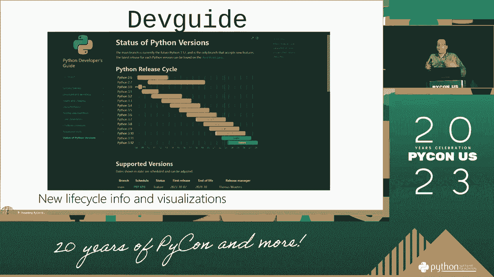

 And then we also expect the expertise to work as well。 We also have a new special theme roll。 And instead of quickly to decide on horse tags， we can easily go directly to a file， that says。 infuse the active force parameter， when we're explaining something in the document。 we're adding a dead guide。 You know， here's how this works。

 Say it's when you can ever go directly to the file。 It's just， the Python would have been a name。 of the file。 We won't take it on your own。 You can basically something changes。 And if you keep from testing all the bad， I'll think of this for a moment。 So that's an improvement。 We also have a quick reference for this。 Now， here's two things that's proposed for working the docs。

 So since we've got some text that we really， thought about being really hard to remember。 where all the syntax is and for that， we'll see all from our whole library。 from the rest of us working on things。 This is so， you know， some of the even。 in the experience that we've got all， that I'm using this is a very valuable theory。

 The quick reference for the code of examples， and the syntax for the piece of the comment。 that's the contrast that we've used。 And it leads to where the docs can get more of an impact。 And I know before I'm thinking that we won the 5。5， of this stuff， it's all right there。
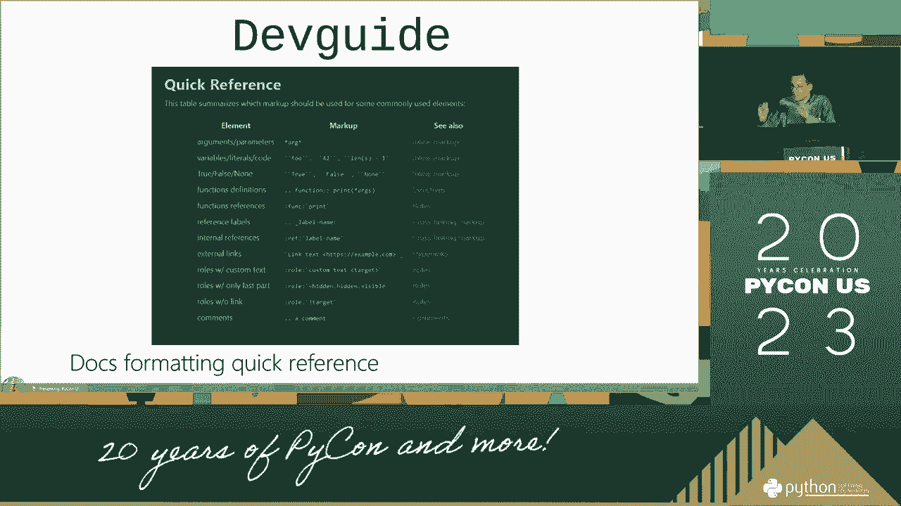

 And it's a little table。 So I worked out as I included the code， that I provided。 The docs I just started with building， the site of the experiment development。 of our own product and docs。 And I overhauled that。 The greatest way was to have a well-tared。 access to the system。 And now for the different steps， to just expand the command of the command。

 And then they also have much further， for what you do on Windows versus what you do on the platforms。 And then you throw it off and you get it。 So we really over-tared。 We really， really， really。 really， kind of worked。 So finally， now that one of the biggest things。 is added added out of the funnel of the cartons， was basically completely overhauling。

 how we're doing the path。 So previously the Python test was a Python test。 And I think it's a kind of type of thing。 So it's a type of thing。 So you can use the tables for the Python language， for the Python language， for the other things。 The user was all out。 It would cost them both a few bullets。

 that they're from the RSP files and to the HTML。 And it was incredibly accurate。 In the field。 we've really， I'm saying， it's a lot of the three， four years ago。 which is another cool kind of thing。 But not so incantable nowadays。 but it also involved parts of manually， complementing Python and the core website。

 And it also then it cost eventually。 It really hard to maintain hard for people。 to build other people to work with。 So the problem of the first all that。 was a custom function question。 That really big， famous thing。 And it's also involved in modern things。 The thing is， in general， we need。

 to base it on this piece。 And I think that it involved a lot of things。 that we've created being based。 So I mean， what it's been， I mean， what it's been， I mean。 what it's been， what it's been， what it's been， what it's been， what it's been， what it's been。 what it's been， what it's been， what it's been， what it's been， what it's been， what it's been。

 what it's been。

 And I mean， what it's been， what it's been。 And also， it's been， what it's been， what it's been。 what it's been。 So long， what it's been， what it's been。 And now。 anything is for each type of community， that we're talking about， what it's been， what it's been。 And the system is known as the right to be provided。

 It'll tell you a date that will tell you the date。 It'll tell you the recognition rate。 it'll tell you the recognition rate， the role， the role， the demand rate， the data。 And I always find it really hard to imagine， it's always related to customer's class。 what it's been， what it's been proved， and what these classes like， what it's always meant。 And now。

 you can cover over that。
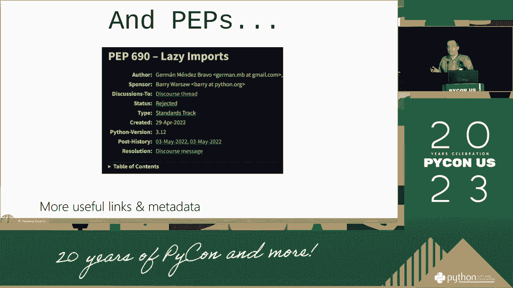

 where you can put the link， and what kind of exactly you want to think you're right。 to that information。 So it's also important in a physical place of work。 So。 and we also have an information， you go over the link， and you go over the link。 and you can get the API， which is based on file， you can read them easily， but then。

 all the basic information。 And it's not quite the same thing， oh， I want just an objective test。 or the essential test， that's quite fine in 3。12， and it'll get you all to a test。 or the packaging test， or， say， by， by， say， getting the same， or whatever you want。 and it'll get you all to a test， or the same certain date。

 and you do all that with a technical test， things will actually use that。 and those things will take you so long， and things will take you so long。 and things will take you so long， and things will take you so long。 and things will take you so long， and things will take you so long。

 and things will take you so long， and things will take you so long。 and things will take you so long， and things will take you so long。 and things will take you so long， and things will take you so long。

 and things will take you so long， and things will take you so long。 and things will take you so long， and things will take you so long。 and things will take you so long， and things will take you so long。 and things will take you so long， and things will take you so long。

 and things will take you so long， and things will take you so long。 and things will take you so long， and things will take you so long。 and things will take you so long， and things will take you so long。 and things will take you so long。
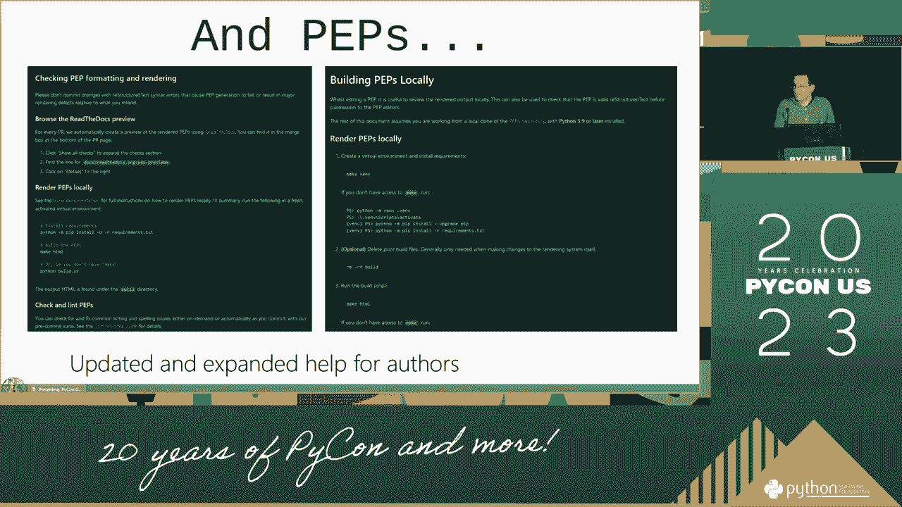

 and things will take you so long， and things will take you so long。 and things will take you so long， and things will take you so long。 and things will take you so long， and things will take you so long。 and things will take you so long， and things will take you so long。

 and things will take you so long， and things will take you so long。 and things will take you so long， and things will take you so long。 and things will take you so long， and things will take you so long。 and things will take you so long， and things will take you so long。

 and things will take you so long， and things will take you so long。 and things will take you so long， and things will take you so long。 and things will take you so long， and things will take you so long。 and things will take you so long， and things will take you so long。

 and things will take you so long， and things will take you so long。 and things will take you so long， and things will take you so long。 and things will take you so long， and things will take you so long。 and things will take you so long， and things will take you so long。

 and things will take you so long， and things will take you so long。 and things will take you so long， and things will take you so long。 and things will take you so long， and things will take you so long。 and things will take you so long， and things will take you so long。

 and things will take you so long， and things will take you so long。 and things will take you so long， and things will take you so long。 and things will take you so long， and things will take you so long。 and things will take you so long， and things will take you so long。

 and things will take you so long， and things will take you so long。 and things will take you so long， and things will take you so long。 and things will take you so long， and things will take you so long。 and things will take you so long， and things will take you so long。

 and things will take you so long， and things will take you so long。 and things will take you so long， and things will take you so long。 and things will take you so long， and things will take you so long。 and things will take you so long， and things will take you so long。

 and things will take you so long， and things will take you so long。 and things will take you so long， and things will take you so long。 and things will take you so long， and things will take you so long。 and things will take you so long， and things will take you so long。

 and things will take you so long， and things will take you so long。 and things will take you so long， and things will take you so long。 and things will take you so long， and things will take you so long。 and things will take you so long， and things will take you so long。

 and things will take you so long， and things will take you so long。 and things will take you so long， and things will take you so long。 and things will take you so long， and things will take you so long。 and things will take you so long， and things will take you so long。

 and things will take you so long， and things will take you so long。 and things will take you so long， and things will take you so long。 and things will take you so long， and things will take you so long。 and things will take you so long， and things will take you so long。

 and things will take you so long， and things will take you so long。 and things will take you so long， and things will take you so long。 and things will take you so long， and things will take you so long。 and things will take you so long， and things will take you so long。

 and things will take you so long， and things will take you so long。 and things will take you so long， and things will take you so long。 and things will take you so long， and things will take you so long。 and things will take you so long， and things will take you so long。

 and things will take you so long， and things will take you so long。 and things will take you so long， and things will take you so long。 and things will take you so long， and things will take you so long。 and things will take you so long， and things will take you so long。

 and things will take you so long， and things will take you so long。 and things will take you so long， and things will take you so long。 and things will take you so long， and things will take you so long。 and things will take you so long， and things will take you so long。

 and things will take you so long， and things will take you so long。 and things will take you so long， and things will take you so long。 and things will take you so long， and things will take you so long。 and things will take you so long， and things will take you so long。

 and things will take you so long， and things will take you so long。 and things will take you so long， and things will take you so long。 and things will take you so long， and things will take you so long。 and things will take you so long， and things will take you so long。

 and things will take you so long， and things will take you so long。 and things will take you so long， and things will take you so long。 and things will take you so long， and things will take you so long。 and things will take you so long， and things will take you so long。

 and things will take you so long， and things will take you so long。 and things will take you so long， and things will take you so long。 and things will take you so long， and things will take you so long。 and things will take you so long， and things will take you so long。

 and things will take you so long， and things will take you so long。 and things will take you so long， and things will take you so long。 and things will take you so long， and things will take you so long。 and things will take you so long， and things will take you so long。

 and things will take you so long， and things will take you so long。 and things will take you so long， and things will take you so long。 and things will take you so long， and things will take you so long。 and things will take you so long， and things will take you so long。

 and things will take you so long， and things will take you so long。 and things will take you so long， and things will take you so long。 and things will take you so long， and things will take you so long。 and things will take you so long， and things will take you so long。

 and things will take you so long， and things will take you so long。 and things will take you so long， and things will take you so long。 and things will take you so long， and things will take you so long。 and things will take you so long， and things will take you so long。

 and things will take you so long， and things will take you so long。 and things will take you so long， and things will take you so long。 and things will take you so long， and things will take you so long。 and things will take you so long， and things will take you so long。

 and things will take you so long， and things will take you so long。 and things will take you so long， and things will take you so long。 and things will take you so long， and things will take you so long。 and things will take you so long， and things will take you so long。

 and things will take you so long， and things will take you so long。 and things will take you so long， and things will take you so long。 and things will take you so long， and things will take you so long。 and things will take you so long， and things will take you so long。

 and things will take you so long， and things will take you so long。 and things will take you so long， and things will take you so long。 and things will take you so long， and things will take you so long。 and things will take you so long， and things will take you so long。

 and things will take you so long， and things will take you so long。 and things will take you so long， and things will take you so long。 and things will take you so long， and things will take you so long。 and things will take you so long， and things will take you so long。

 and things will take you so long， and things will take you so long。 and things will take you so long， and things will take you so long。 and things will take you so long， and things will take you so long。 and things will take you so long， and things will take you so long。

 and things will take you so long， and things will take you so long。 and things will take you so long， and things will take you so long。 and things will take you so long， and things will take you so long。 and things will take you so long， and things will take you so long。

 and things will take you so long， and things will take you so long。 and things will take you so long， and things will take you so long。 and things will take you so long， and things will take you so long。 and things will take you so long， and things will take you so long。

 and things will take you so long， and things will take you so long。 and things will take you so long， and things will take you so long。 and things will take you so long， and things will take you so long。 and things will take you so long， and things will take you so long。

 and things will take you so long， and things will take you so long。 and things will take you so long， and things will take you so long。 and things will take you so long， and things will take you so long。 and things will take you so long， and things will take you so long。

 and things will take you so long， and things will take you so long。 and things will take you so long， and things will take you so long。 and things will take you so long， and things will take you so long。 and things will take you so long， and things will take you so long。

 and things will take you so long， and things will take you so long。 and things will take you so long， and things will take you so long。 and things will take you so long， and things will take you so long。 and things will take you so long， and things will take you so long。

 and things will take you so long， and things will take you so long。 and things will take you so long， and things will take you so long。 and things will take you so long， and things will take you so long。 and things will take you so long， and things will take you so long。

 and things will take you so long， and things will take you so long。 and things will take you so long， and things will take you so long。 and things will take you so long， and things will take you so long。 and things will take you so long， and things will take you so long。

 and things will take you so long， and things will take you so long。 and things will take you so long， and things will really be helpful。 and things will take you so long， and things will take you so long。 and things will take you so long， and things will take you so long。

 and things will take you so long， and things will take you so long。 and things will take you so long， and things will take you so long。 and things will take you so long， and things will take you so long。 and things will take you so long， and things will take you so long。

 and things will take you so long， and things will take you so long。 and things will take you so long， and things will take you so long。 and things will take you so long， and things will take you so long。 and things will take you so long， and things will take you so long。

 and things will take you so long， and things will take you so long。 and things will take you so long， and things will take you so long。 and things will take you so long， and things will take you so long。 and things will take you so long， and things will take you so long。

 and things will take you so long， and things will take you so long。 and things will take you so long， and things will take you so long。 and things will take you so long， and things will take you so long。 and things will take you so long， and things will take you so long。

 and things will take you so long， and things will take you so long。 and things will take you so long， and things will take you so long。 and things will take you so long， and things will take you so long。 and things will take you so long， and things will take you so long。

 and things will take you so long， and things will take you so long。 and things will take you so long， and things will take you so long。 and things will take you so long， and things will take you so long。 and things will take you so long， and things will take you so long。

 and things will take you so long， and things will take you so long。 and things will take you so long， and things will take you so long。 and things will take you so long， and things will take you so long。 and things will take you so long， and things will take you so long。

 and things will take you so long， and things will take you so long。 and things will take you so long， and things will take you so long。 and things will take you so long， and things will take you so long。 and things will take you so long， and things will take you so long。

 and things will take you so long， and things will take you so long。 and things will take you so long， and things will take you so long。 and things will take you so long， and things will take you so long。 and things will take you so long， and things will take you so long。

 and things will take you so long， and things will take you so long。 and things will take you so long， and things will take you so long。 and things will take you so long， and things will take you so long。 and things will take you so long， and things will take you so long。

 and things will take you so long， and things will take you so long。 and things will take you so long， and things will take you so long。 and things will take you so long， and things will take you so long。 and things will take you so long， and things will take you so long。

 and things will take you so long， and things will take you so long。 and things will take you so long， and things will take you so long。 and things will take you so long， and things will take you so long。 and things will take you so long， and things will take you so long。

 and things will take you so long， and things will take you so long。 and things will take you so long， and things will take you so long。 and things will take you so long， and things will take you so long。 and things will take you so long， and things will take you so long。

 and things will take you so long， and things will take you so long。 and things will take you so long， and things will take you so long。 and things will take you so long， and things will take you so long。 and things will take you so long， and things will take you so long。

 and things will take you so long， and things will take you so long。 and things will take you so long， and things will take you so long。 and things will take you so long， and things will take you so long。 and things will take you so long， and things will take you so long。

 and things will take you so long， and things will take you so long。 and things will take you so long， and things will take you so long。 and things will take you so long， and things will take you so long。 and things will take you so long， and things will take you so long。

 and things will take you so long， and things will take you so long。 and things will take you so long， and things will take you so long。 and things will take you so long， and things will take you so long。 and things will take you so long， and things will take you so long。

 and things will take you so long， and things will take you so long。 and things will take you so long， and things will take you so long。 and things will take you so long， and things will take you so long。 and things will take you so long， and things will take you so long。

 and things will take you so long， and things will take you so long。 and things will take you so long， and things will take you so long。 and things will take you so long， and things will take you so long。 and things will take you so long， and things will take you so long。

 and things will take you so long， and things will take you so long。 and things will take you so long， and things will take you so long。 and things will take you so long， and things will take you so long。 and things will take you so long， and things will take you so long。

 and things will take you so long， and things will take you so long。 and things will take you so long， and things will take you so long。 and things will take you so long， and things will take you so long。 and things will take you so long， and things will take you so long。

 and things will take you so long， and things will take you so long。 and things will take you so long， and things will take you so long。 and things will take you so long， and things will take you so long。 and things will take you so long， and things will take you so long。

 and things will take you so long， and things will take you so long。 and things will take you so long， and things will take you so long。 and things will take you so long， and things will take you so long。 and things will take you so long， and things will take you so long。

 and things will take you so long， and things will take you so long。 and things will take you so long， and things will take you so long。 and things will take you so long， and things will take you so long。 and things will take you so long， and things will take you so long。

 and things will take you so long， and things will take you so long。 and things will take you so long， and things will take you so long。 and things will take you so long， and things will take you so long。 and things will take you so long， and things will take you so long。

 and things will take you so long， and things will take you so long。 and things will take you so long， and things will take you so long。 and things will take you so long， and things will take you so long。 and things will take you so long， and things will take you so long。

 and things will take you so long， and things will take you so long。 and things will take you so long， and things will take you so long。 and things will take you so long， and things will take you so long。 and things will take you so long， and things will take you so long。

 and things will take you so long， and things will take you so long。 and things will take you so long， and things will take you so long。 and things will take you so long， and things will take you so long。 and things will take you so long， and things will take you so long。

 and things will take you so long， and things will take you so long。 and things will take you so long， and things will take you so long。 and things will take you so long， and things will take you so long。 and things will take you so long， and things will take you so long。

 and things will take you so long， and things will take you so long。 and things will take you so long， and things will take you so long。 and things will take you so long， and things will take you so long。 and things will take you so long， and things will take you so long。

 and things will take you so long， and things will take you so long。 and things will take you so long， and things will take you so long。 and things will take you so long， and things will take you so long。 and things will take you so long， and things will take you so long。

 and things will take you so long， and things will take you so long。 and things will take you so long， and things will take you so long。 and things will take you so long， and things will take you so long。 and things will take you so long， and things will take you so long。

 and things will take you so long， and things will take you so long。 and things will take you so long， and things will take you so long。 and things will take you so long， and things will take you so long。 and things will take you so long， and things will take you so long。

 and things will take you so long， and things will take you so long。 and things will take you so long， and things will take you so long。 and things will take you so long， and things will take you so long。 and things will take you so long， and things will take you so long。

 and things will take you so long， and things will take you so long。 and things will take you so long， and things will take you so long。 and things will take you so long， and things will take you so long。 and things will take you so long， and things will take you so long。

 and things will take you so long， and things will take you so long。 and things will take you so long， and things will take you so long。 and things will take you so long， and things will take you so long。 and things will take you so long， and things will take you so long。

 and things will take you so long， and things will take you so long。 and things will take you so long， and things will take you so long。 and things will take you so long， and things will take you so long。 and things will take you so long， and things will take you so long。

 and things will take you so long， and things will take you so long。 and things will take you so long， and things will take you so long。 and things will take you so long， and things will take you so long。 and things will take you so long， and things will take you so long。

 and things will take you so long， and things will take you so long。 and things will take you so long， and things will take you so long。 and things will take you so long， and things will take you so long。 and things will take you so long， and things will take you so long。

 and things will take you so long， and things will take you so long。 and things will take you so long， and things will take you so long。 and things will take you so long， and things will take you so long。 and things will take you so long， and things will take you so long。

 and things will take you so long， and things will take you so long。 and things will take you so long， and things will take you so long。 and things will take you so long， and things will take you so long。 and things will take you so long， and things will take you so long。

 and things will take you so long， and things will take you so long。 and things will take you so long， and things will take you so long。 and things will take you so long， and things will take you so long。 and things will take you so long， and things will take you so long。

 and things will take you so long， and things will take you so long。 and things will take you so long， and things will take you so long。 and things will take you so long， and things will take you so long。 and things will take you so long， and things will take you so long。

 and things will take you so long， and things will take you so long。 and things will take you so long， and things will take you so long。 and things will take you so long， and things will take you so long。 and things will take you so long， and things will take you so long。

 and things will take you so long， and things will take you so long。 and things will take you so long， and things will take you so long。 and things will take you so long， and things will take you so long。 and things will take you so long， and things will take you so long。

 and things will take you so long， and things will take you so long。 and things will take you so long， and things will take you so long。 and things will take you so long， and things will take you so long。 and things will take you so long， and things will take you so long。

 and things will take you so long， and things will take you so long。 and things will take you so long， and things will take you so long。 and things will take you so long， and things will take you so long。 and things will take you so long， and things will take you so long。

 and things will take you so long， and things will take you so long。 and things will take you so long， and things will take you so long。 and things will take you so long， and things will take you so long。 and things will take you so long， and things will take you so long。

 and things will take you so long， and things will take you so long。 and things will take you so long， and things will take you so long。 and things will take you so long， and things will take you so long。 and things will take you so long， and things will take you so long。

 and things will take you so long， and things will take you so long。 and things will take you so long， and things will take you so long。 and things will take you so long， and things will take you so long。 and things will take you so long， and things will take you so long。

 and things will take you so long， and things will take you so long。 and things will take you so long， and things will take you so long。 and things will take you so long， and things will take you so long。 and things will take you so long， and things will take you so long。

 and things will take you so long， and things will take you so long。 and things will take you so long， and things will take you so long。 and things will take you so long， and things will take you so long。 and things will take you so long， and things will take you so long。

 and things will take you so long， and things will take you so long。 and things will take you so long， and things will take you so long。 and things will take you so long， and things will take you so long。 and things will take you so long， and things will take you so long。

 and things will take you so long， and things will take you so long。 and things will take you so long， and things will take you so long。 and things will take you so long， and things will take you so long。 and things will take you so long， and things will take you so long。

 and things will take you so long， and things will take you so long。 and things will take you so long， and things will take you so long。 and things will take you so long， and things will take you so long。 and things will take you so long， and things will take you so long。

 and things will take you so long， and things will take you so long。 and things will take you so long， and things will take you so long。 and things will take you so long， and things will take you so long。 and things will take you so long， and things will take you so long。

 and things will take you so long， and things will take you so long。 and things will take you so long， and things will take you so long。 and things will take you so long， and things will take you so long。 and things will take you so long， and things will take you so long。

 and things will take you so long， and things will take you so long。 and things will take you so long， and things will take you so long。 and things will take you so long， and things will take you so long。 and things will take you so long， and things will take you so long。

 and things will take you so long， and things will take you so long。 and things will take you so long， and things will take you so long。 and things will take you so long， and things will take you so long。 and things will take you so long， and things will take you so long。

 and things will take you so long， and things will take you so long。 and things will take you so long， and things will take you so long。 and things will take you so long， and things will take you so long。 and things will take you so long， and things will take you so long。

 and things will take you so long， and things will take you so long。 and things will take you so long， and things will take you so long。 and things will take you so long， and things will take you so long。 and things will take you so long， and things will take you so long。

 and things will take you so long， and things will take you so long。 and things will take you so long， and things will take you so long。 and things will take you so long， and things will take you so long。 and things will take you so long， and things will take you so long。

 and things will take you so long， and things will take you so long。 and things will take you so long， and things will take you so long。 and things will take you so long， and things will take you so long。 and things will take you so long， and things will take you so long。

 and things will take you so long， and things will take you so long。 and things will take you so long， and things will take you so long。 and things will take you so long， and things will take you so long。 and things will take you so long， and things will take you so long。

 and things will take you so long， and things will take you so long。 and things will take you so long， and things will take you so long。 and things will take you so long， and things will take you so long。 and things will take you so long， and things will take you so long。

 and things will take you so long， and things will take you so long。 and things will take you so long， and things will take you so long。 and things will take you so long， and things will take you so long。 and things will take you so long， and things will take you so long。

 and things will take you so long， and things will take you so long。 and things will take you so long， and things will take you so long。 and things will take you so long， and things will take you so long。 and things will take you so long， and things will take you so long。

 and things will take you so long， and things will take you so long。 and things will take you so long， and things will take you so long。 and things will take you so long， and things will take you so long。 and things will take you so long， and things will take you so long。

 and things will take you so long， and things will take you so long。 and things will take you so long， and things will take you so long。 and things will take you so long， and things will take you so long。 and things will take you so long， and things will take you so long。

 and things will take you so long， and things will take you so long。 and things will take you so long， and things will take you so long。 and things will take you so long， and things will take you so long。 and things will take you so long， and things will take you so long。

 and things will take you so long， and things will take you so long。 and things will take you so long， and things will take you so long。 and things will take you so long， and things will take you so long。 and things will take you so long， and things will take you so long。

 and things will take you so long， and things will take you so long。 and things will take you so long， and things will take you so long。 and things will take you so long， and things will take you so long。 and things will take you so long， and things will take you so long。

 and things will take you so long， and things will take you so long。 and things will take you so long， and things will take you so long。 and things will take you so long， and things will take you so long。 and things will take you so long， and things will take you so long。

 and things will take you so long， and things will take you so long。 and things will take you so long， and things will take you so long。 and things will take you so long， and things will take you so long。 and things will take you so long， and things will take you so long。

 and things will take you so long， and things will take you so long。 and things will take you so long， and things will take you so long。 and things will take you so long， and things will take you so long。 and things will take you so long， and things will take you so long。

 and things will take you so long， and things will take you so long。 and things will take you so long， and things will take you so long。 and things will take you so long， and things will take you so long。
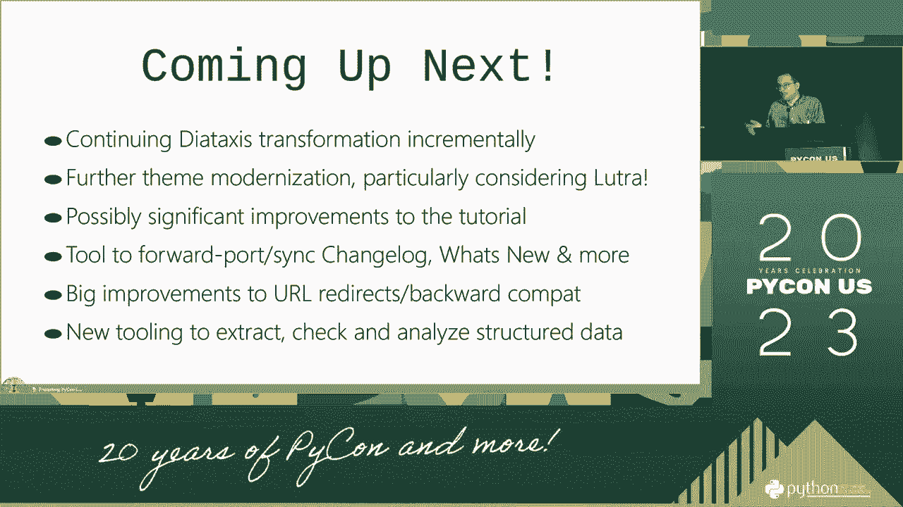

 and things will take you so long， and things will take you so long。 and things will take you so long， and things will take you so long。 and things will take you so long， and things will take you so long。 and things will take you so long， and things will take you so long。

 and things will take you so long， and things will take you so long。 and things will take you so long， and things will take you so long。 and things will take you so long， and things will take you so long。 and things will take you so long， and things will take you so long。

 and things will take you so long， and things will take you so long。 and things will take you so long， and things will take you so long。 and things will take you so long， and things will take you so long。 and things will take you so long， and things will take you so long。

 and things will take you so long。
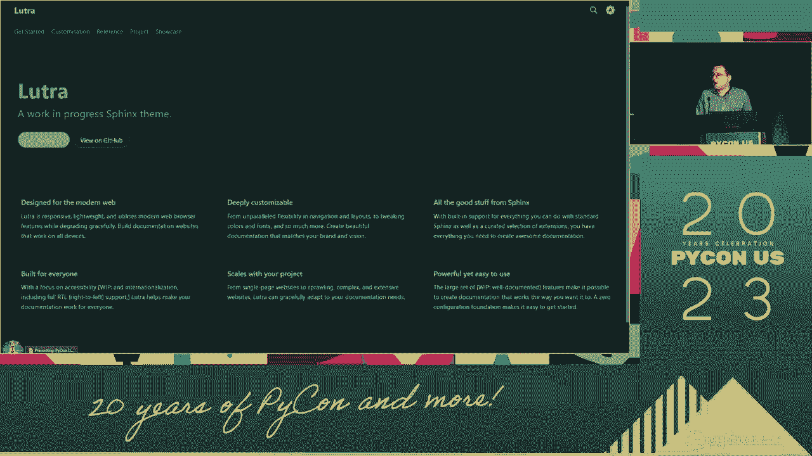

 and things will take you so long， and things will take you so long。 and things will take you so long， and things will take you so long。 and things will take you so long， and things will take you so long。 and things will take you so long， and things will take you so long。

 and things will take you so long， and things will take you so long。 and things will take you so long， and things will take you so long。 and things will take you so long， and things will take you so long。 and things will take you so long， and things will take you so long。

 and things will take you so long， and things will take you so long。 and things will take you so long， and things will take you so long。 and things will take you so long， and things will take you so long。 and things will take you so long， and things will take you so long。

 and things will take you so long， and things will take you so long。 and things will take you so long， and things will take you so long。 and things will take you so long， and things will take you so long。 and things will take you so long， and things will take you so long。

 and things will take you so long， and things will take you so long。 and things will take you so long， and things will take you so long。 and things will take you so long， and things will take you so long。 and things will take you so long， and things will take you so long。

 and things will take you so long， and things will take you so long。 and things will take you so long， and things will take you so long。 and things will take you so long， and things will take you so long。 and things will take you so long， and things will take you so long。

 and things will take you so long， and things will take you so long。 and things will take you so long， and things will take you so long。 and things will take you so long， and things will take you so long。 and things will take you so long， and things will take you so long。

 and things will take you so long， and things will take you so long。 and things will take you so long， and things will take you so long。 and things will take you so long， and things will take you so long。 and things will take you so long， and things will take you so long。

 and things will take you so long， and things will take you so long。 and things will take you so long， and things will take you so long。 and things will take you so long， and things will take you so long。 and things will take you so long， and things will take you so long。

 and things will take you so long， and things will take you so long。 and things will take you so long， and things will take you so long。 and things will take you so long， and things will take you so long。 and things will take you so long， and things will take you so long。

 and things will take you so long， and things will take you so long。 and things will take you so long， and things will take you so long。 and things will take you so long， and things will take you so long。 and things will take you so long， and things will take you so long。

 and things will take you so long， and things will take you so long。 and things will take you so long， and things will take you so long。 and things will take you so long， and things will take you so long。 and things will take you so long， and things will take you so long。

 and things will take you so long， and things will take you so long。 and things will take you so long， and things will take you so long。 and things will take you so long， and things will take you so long。 and things will take you so long， and things will take you so long。

 and things will take you so long， and things will take you so long。 and things will take you so long， and things will take you so long。 and things will take you so long， and things will take you so long。 and things will take you so long， and things will take you so long。

 and things will take you so long， and things will take you so long。 and things will take you so long， and things will take you so long。 and things will take you so long， and things will take you so long。 and things will take you so long， and things will take you so long。

 and things will take you so long， and things will take you so long。 and things will take you so long， and things will take you so long。 and things will take you so long， and things will take you so long。 and things will take you so long， and things will take you so long。

 and things will take you so long， and things will take you so long。 and things will take you so long， and things will take you so long。 and things will take you so long， and things will take you so long。 and things will take you so long， and things will take you so long。

 and things will take you so long， and things will take you so long。 and things will take you so long， and things will take you so long。 and things will take you so long， and things will take you so long。 and things will take you so long， and things will take you so long。

 and things will take you so long， and things will take you so long。 and things will take you so long， and things will take you so long。 and things will take you so long， and things will take you so long。 and things will take you so long， and things will take you so long。

 and things will take you so long， and things will take you so long。 and things will take you so long， and things will take you so long。 and things will take you so long， and things will take you so long。 and things will take you so long， and things will take you so long。

 and things will take you so long， and things will take you so long。 and things will take you so long， and things will take you so long。 and things will take you so long， and things will take you so long。 and things will take you so long， and things will take you so long。

 and things will take you so long， and things will take you so long。 and things will take you so long， and things will take you so long。 and things will take you so long， and things will take you so long。 and things will take you so long， and things will take you so long。

 and things will take you so long， and things will take you so long。 and things will take you so long， and things will take you so long。 and things will take you so long， and things will take you so long。 and things will take you so long， and things will take you so long。

 and things will take you so long， and things will take you so long。 and things will take you so long， and things will take you so long。 and things will take you so long， and things will take you so long。 and things will take you so long， and things will take you so long。

 and things will take you so long， and things will take you so long。 and things will take you so long， and things will take you so long。 and things will take you so long， and things will take you so long。 and things will take you so long， and things will take you so long。

 and things will take you so long， and things will take you so long。 and things will take you so long， and things will take you so long。 and things will take you so long， and things will take you so long。 and things will take you so long， and things will take you so long。

 and things will take you so long， and things will take you so long。 and things will take you so long， and things will take you so long。 and things will take you so long， and things will take you so long。 and things will take you so long， and things will take you so long。

 and things will take you so long， and things will take you so long。 and things will take you so long， and things will take you so long。 and things will take you so long， and things will take you all， for being part of the community。 and for part of our community， and thank you for your time。 Thank you。 [ Pause ]。

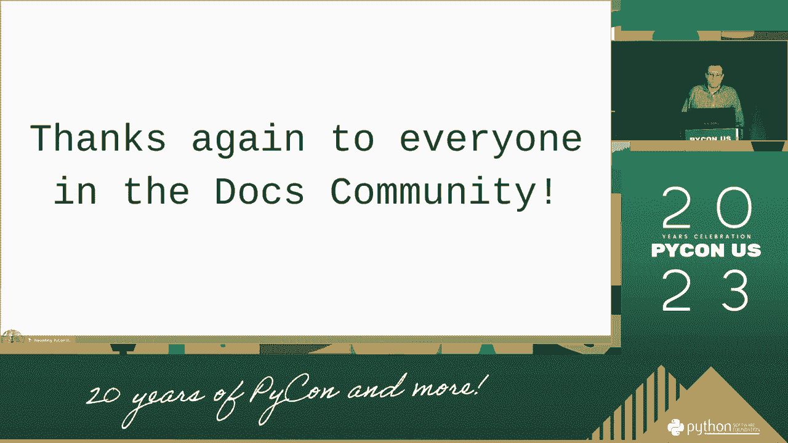

 >> Thank you。 >> Thank you。 >> Thank you。 >> Awesome。 Thank you for your work。 and this is going to help a lot of people， and the people in the future。 You have a couple of minutes， of questions you've had about hands raised。 or any questions you've had， and if I'll just， if I'll， if you want to talk to them。

 you want to talk to them。 >> Thank you。 >> Any other questions for them？ [ Pause ]， >> I， of course。 have a question about comments。 The value of human beings is really， effective in talking to normal。 and human beings， and that is a question that we're， going to be talking about。 Thank you。