# P30：Talks - Dustin_ Software Security and Slippery Slopes_ How to elevate an entire - VikingDen7 - BV1114y1o7c5

 >> [inaudible]， >> [inaudible]。
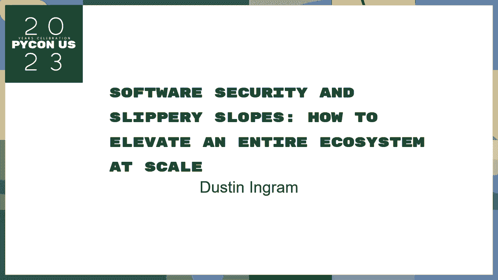

 >> [inaudible]。
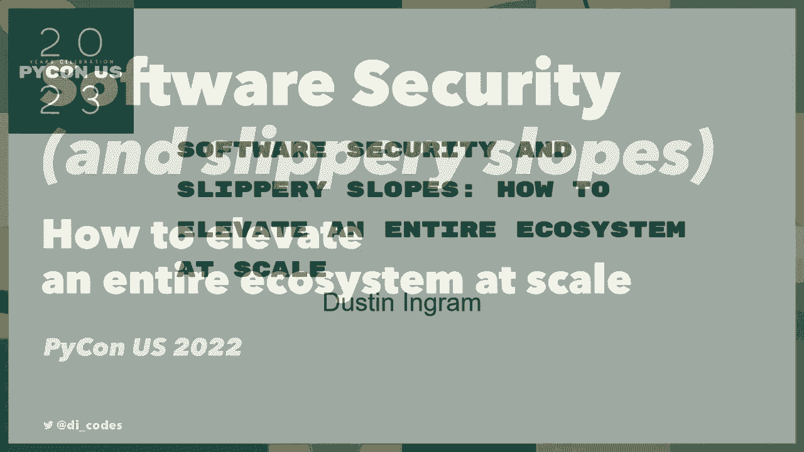

 >> [inaudible]， >> [inaudible]， And I guess we've got a project called a 100 megabyte fund。 I'm also one of them from front and forth because he's， where I help you to address any of his own。 and he's running into a training department of finance， on many ways you ever heard of him。 And also， I've logged into an example of my interview， and movie for him， for his presentation。

 And where I help you to address this question， eventually I'll just be able to approach some of this。 see what you're talking about in this question。 And I hope that you guys can make that a problem because the product。 of the product is going to be processed， many ways of cooking。 It's completely fine when I'm not processed。 And I think that we need to know。

 I'm also really deeply connected。 And I think that the project is going to be a very secure product。 So I just want to know that on the work of a product。 I'm told it was very definitely a very consistent。 So if you need to probably don't。 I'm just going to spend my slides， in business， and you probably won't have a job。

 And I'm not going to provide you with the idea of how to make， these different products。 So here's what I want to do in this topic。 First， why is it important？

 So I want to understand what it is。 I want to know what it is。 And what it is going to do。 Second。 I want to understand what it is and what it is。 And what it is going to do。 And why is it important to understand， how I think we should deal with it。 Also。 I want to understand how security can be improved， and that can improve。

 so there's more relationship to it。 And I think that。 in finding the opportunity to make it more fun。 And this is just。 it's the opportunity to make the first plays。 There are actually ways to make it more difficult。 Overall， I want to be new， and it's very key to you。 I'll be speaking with you in this topic。

 I want to thank you to you for your attention and for your attention。 And all this I have is this。 I want to thank you。 And it really depends on where you're going to be。 And I think this evening。 the University of Illinois， has been on the campus for two years。 So， good。 That's great。 Well。 thank you。 I'm very new， and part of not a nonprofit response。 So。

 we saw the one that we used to know。 And in the form of a nonprofit。 we would use a new platform on your team and music。 And， by accident。 this is where these have been founded。 If you were into one of those。 you would be in the middle of a particular problem。 So。

 I know I'm expecting a final link to 20 to 20。 And everyone would forward to 24 hours to 10 hours to 12 hours。 And now it's over now。 And， you know， 24 hours。 It's not easy to find。 And， you know。 because of the new adoption of the commission， we need to know what the leadership needs to be。 And。 you know， to do that。 And， by both of them， you're responsible for that。 So。

 you can start a part of the small thing。 You can start a part of a large thing， as you said。 and that's the one you need to choose to find。 So。 one reason why these producers don't ask questions， is because they think they're different。 So。 for example， you know， it's required for all the benefits。 And。

 you can get them from the bottom of the bottom of the bottom。 Do you want to learn more about what you're talking about， or what you're talking about？

 I don't know if you're talking about what you're talking about。 The number of people who I used to be doing， after the team would be running through the distribution。 just go through the data and once that's in place。 However， the number of people who I was filming。 that I'm in the first region is first by actually a quarter of a quarter。 And。

 I think that's the point。 If you speak about it， that's why it's important to you。 So， many times。 I was just going to use a new project to build up a black user request。 And， it's the point。 it's the point。 I was just going to build up a black user request for the team。 So。 one of the best points is that， in the end， you're going to need to be able to find a new project。

 And， in the first place， you're going to need to be able to find a new project。 The first point。 I was going to use is， if a character works， it's going to be a single one。 I'm just going to use a new project to build a general design for a new project。 That is free and devoted to the ability of phones and digital output。 So。

 there's a new level of data， that has some insight into the new level of what happened。 And。 in general， I have the reason to build up a specific project to use a new platform and a specific project。 So， we can start with a new concept of a product。 And， the one thing that I'm going to do is。 I'm going to use a new level of what happened。 So， low impact。

 low likelihood of something that we've done。 Low impact， low likelihood。 if that was anyone that's going to use it， that's going to be a good project。 I'm just going to use it。 If something were like， it's going to be a good project。 It's going to be a good project， but it's not going to be a good project。 But。

 in the ability of a new level of what happened， it's not going to be a project。 It is in this local language， and I'm going to use it as a language。 I'm going to use it as a language。 I'm going to use it as a language。 I'm going to use it as a language。 I'm going to use it as a language。

 I'm going to use it as a language。 I'm going to use it as a language。 I'm going to use it as a language。 I'm going to use it as a language。 I'm going to use it as a language。 I'm going to use it as a language。 I'm going to use it as a language。 I'm going to use it as a language。 And， in a last product。

 I'm going to use it as a language。 I'm going to use it as a language。 I'm going to use it as a language。 It's not going to be a language。 We have a language in the face。 So that is going to be a top of a language。 I'm going to use it as a language。 I'm going to use it as a language。 I'm going to use it as a language。 Here's a real purpose。

 It's going to be a language。 I'm going to use it as a language。 I'm going to use it as a language。 I'm going to use it as a language。 I'm going to use it as a language。 I'm going to use it as a language。 So first of all， in a last product。 I'm going to use it as a language。 I'm going to use it as a language。

 I'm going to use it as a language。 I'm going to use it as a language。 I'm going to use it as a language。 I'm going to use it as a language。 I'm going to use it as a language。 I'm going to use it as a language。 I'm going to use it as a language。 I'm going to use it as a language。

 I'm going to use it as a language。 I'm going to use it as a language。 I'm also going to use it as a language。 It's really often our problem is that we have。 a very deep thought。 So we're not working that。 It's probably easy to talk about it in a deep。 conversation。 Other things about this product， we generally have a lot of control to it。

 but we can also do it in a problem。 I think that we can talk about this in a couple of different。 issues， but in other ways， we can talk about it， as a part of our issue。 We can see that we can talk about this in a complex system。 We can see that we can talk about it in a very small piece of work。 People in this community。

 people in this community， just looking at it in a very small piece of work。 It's very important to use a language。 It's very important to use a language。 It's very important to use a language。 It's very important to use a language。 It's very important to use a language。 It's very important to use a language。

 It's very important to use a language。 It's very important to use a language。 It's very important to use a language。 We can build a technical system to our problem。 and that's very important to our problem。 That's very important to our problem。 That's very important to our problem。 We can build a technical system to our problem。

 That's very important to our problem。 That's very important to our problem。 That's very important to use a language。 That's very important to use a language。 That's very important to use a language。 That's very important to use a language。 That's very important to use a language。 That's very important to use a language。

 That's very important to use a language。 That's very important to use a language。 That's very important to use a language。 That's very important to use a language。 That's very important to use a language。 That's very important to use a language。 That's very important to use a language。 That's very important to use a language。

 That's very important to use a language。 That's very important to use a language。 That's very important to use a language。 That's very important to use a language。 That's very important to use a language。 That's very important to use a language。 That's very important to use a language。 That's very important to use a language。

 That's very important to use a language。 That's very important to use a language。 That's very important to use a language。 That's very important to use a language。 That's very important to use a language。 That's very important to use a language。 That's very important to use a language。 That's very important to use a language。

 That's very important to use a language。 That's very important to use a language。 That's very important to use a language。 That's very important to use a language。 That's very important to use a language。 That's very important to use a language。 That's very important to use a language。 That's very important to use a language。

 That's very important to use a language。 That's very important to use a language。 That's very important to use a language。 That's very important to use a language。 That's very important to use a language。 That's very important to use a language。 That's very important to use a language。 That's very important to use a language。

 That's very important to use a language。 That's very important to use a language。 That's very important to use a language。 That's very important to use a language。 That's very important to use a language。 That's very important to use a language。 That's very important to use a language。 That's very important to use a language。

 That's very important to use a language。 That's very important to use a language。 That's very important to use a language。 That's very important to use a language。 That's very important to use a language。 That's very important to use a language。 That's very important to use a language。 That's very important to use a language。

 That's very important to use a language。 That's very important to use a language。 That's very important to use a language。 That's very important to use a language。 That's very important to use a language。 That's very important to use a language。 That's very important to use a language。 That's very important to use a language。

 That's very important to use a language。 That's very important to use a language。 That's very important to use a language。 That's very important to use a language。 That's very important to use a language。 That's very important to use a language。 That's very important to use a language。 That's very important to use a language。

 That's very important to use a language。 That's very important to use a language。 That's very important to use a language。 That's very important to use a language。 That's very important to use a language。 That's very important to use a language。 That's very important to use a language。 That's very important to use a language。

 That's very important to use a language。 That's very important to use a language。 That's very important to use a language。 That's very important to use a language。 That's very important to use a language。 That's very important to use a language。 That's very important to use a language。 That's very important to use a language。

 That's very important to use a language。 That's very important to use a language。 That's very important to use a language。 That's very important to use a language。 That's very important to use a language。 That's very important to use a language。 That's very important to use a language。 That's very important to use a language。

 That's very important to use a language。 That's very important to use a language。 That's very important to use a language。 That's very important to use a language。 That's very important to use a language。 That's very important to use a language。 That's very important to use a language。 That's very important to use a language。

 That's very important to use a language。 That's very important to use a language。 That's very important to use a language。 That's very important to use a language。 That's very important to use a language。 That's very important to use a language。 That's very important to use a language。 That's very important to use a language。

 That's very important to use a language。 That's very important to use a language。 That's very important to use a language。 That's very important to use a language。 That's very important to use a language。 That's very important to use a language。 That's very important to use a language。 That's very important to use a language。

 That's very important to use a language。 That's very important to use a language。 That's very important to use a language。 That's very important to use a language。 That's very important to use a language。 That's very important to use a language。 That's very important to use a language。 That's very important to use a language。

 That's very important to use a language。 That's very important to use a language。 That's very important to use a language。 That's very important to use a language。 That's very important to use a language。 That's very important to use a language。 That's very important to use。 That's very important to use a language。

 That's very important to use a language。 That's very important to use a language。 That's very important to use a language。 That's very important to use a language。 That's very important to use a language。 That's very important to use a language。 That's very important to use a language。 That's very important to use a language。

 That's very important to use a language。 That's very important to use a language。 That's very important to use a language。 That's very important to use a language。 That's very important to use a language。 That's very important to use a language。 That's very important to use a language。 That's very important to use a language。

 That's very important to use a language。 That's very important to use a language。 That's very important to use a language。 That's very important to use a language。 That's very important to use a language。 That's very important to use a language。 That's very important to use a language。 That's very important to use a language。

 That's very important to use a language。 That's very important to use a language。 That's very important to use a language。 That's very important to use a language。 That's very important to use a language。 That's very important to use a language。 That's very important to use a language。 That's very important to use a language。

 That's very important to use a language。 That's very important to use a language。 That's very important to use a language。 That's very important to use a language。 That's very important to use a language。 That's very important to use a language。 That's very important to use a language。 That's very important to use a language。

 That's very important to use a language。 That's very important to use a language。 That's very important to use a language。 That's very important to use a language。 That's very important to use a language。 That's very important to use a language。 That also allows us to use a language that's responsible for the language。

 That's very important to use a language。 That's very important to use a language。 That's very important to use a language。 That's very important to use a language。 That's very important to use a language。 That's very important to use a language。 That's very important to use a language。 That allows us to make it more important to use a language。

 That allows us to make it more important to use a language。 That allows us to make it more important to use a language。 That allows us to make it more important to use a language。 That allows us to make it more important to use a language。 That allows us to make it more important to use a language。
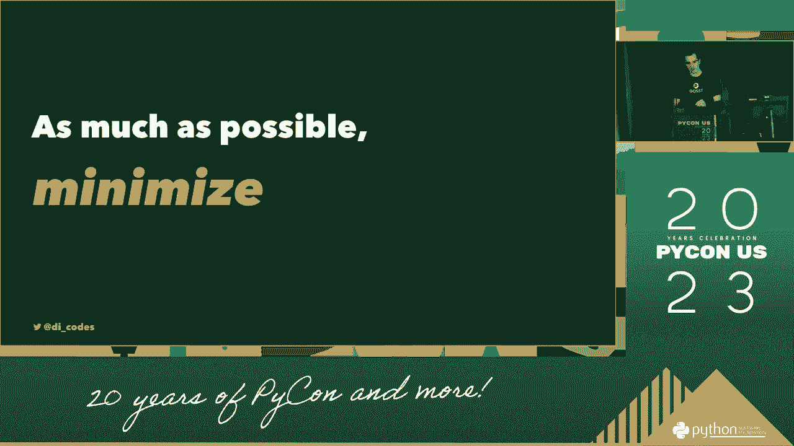

 That allows us to make it more important to use a language。 That allows us to make it more important to use a language。 That allows us to make it more important to use a language。
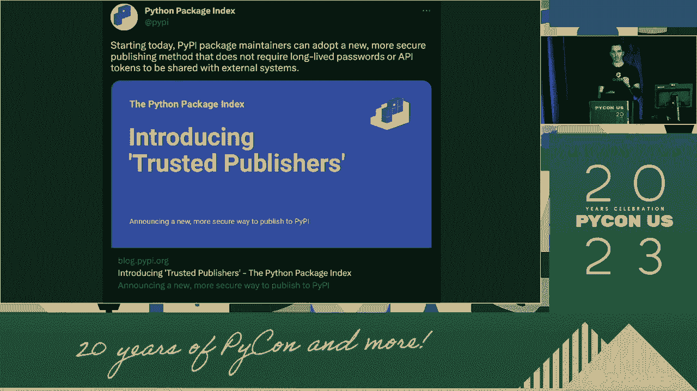

 That allows us to make it more important to use a language。 That allows us to make it more important to use a language。 That allows us to make it more important to use a language。
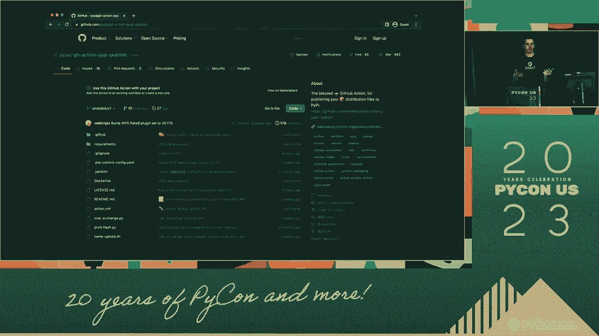

 That allows us to make it more important to use a language。 That allows us to make it more important to use a language。 That allows us to make it more important to use a language。
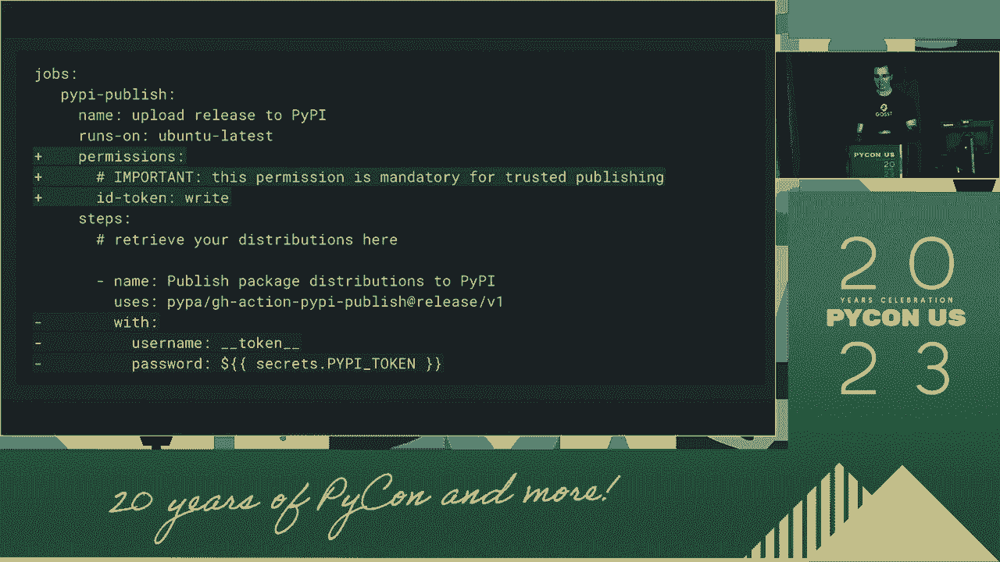

 That allows us to make it more important to use a language。 That allows us to make it more important to use a language。 That allows us to make it more important to use a language。 That allows us to make it more important to use a language。 That allows us to make it more important to use a language。 That allows us to make it more important to use a language。 That allows us to make it more important to use a language。 That allows us to make it more important to use a language。

 That allows us to make it more important to use a language。 That allows us to make it more important to use a language。 That allows us to make it more important to use a language。 That allows us to make it more important to use a language。 That allows us to make it more important to use a language。 That allows us to make it more important to use a language。 That allows us to make it more important to use a language。 That allows us to make it more important to use a language。

 That allows us to make it more important to use a language。 That allows us to make it more important to use a language。 That allows us to make it more important to use a language。 That allows us to make it more important to use a language。 That allows us to make it more important to use a language。 That allows us to make it more important to use a language。 That allows us to make it more important to use a language。
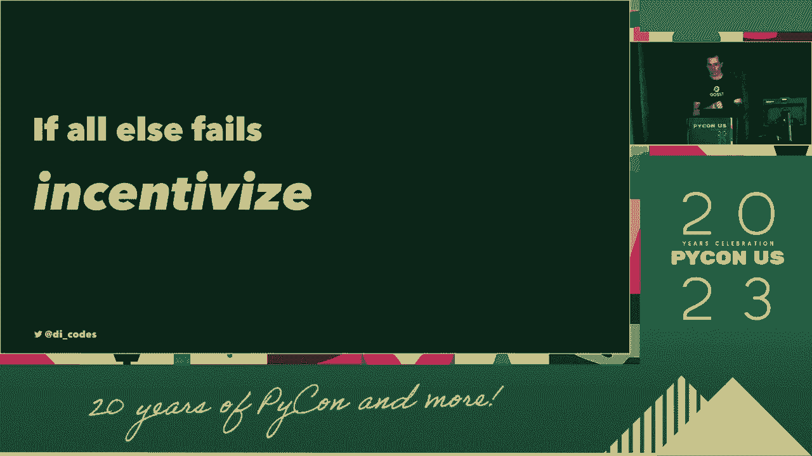

 That allows us to make it more important to use a language。 That allows us to make it more important to use a language。
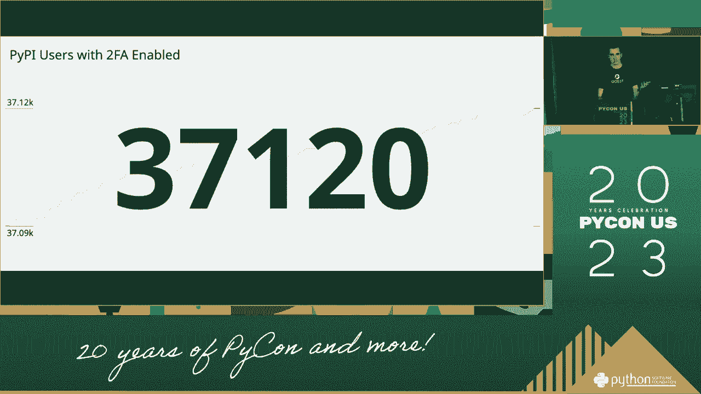

 That allows us to make it more important to use a language。 That allows us to make it more important to use a language。 That allows us to make it more important to use a language。 That allows us to make it more important to use a language。 That allows us to make it more important to use a language。 That allows us to make it more important to use a language。 That allows us to make it more important to use a language。 That allows us to make it more important to use a language。

 That allows us to make it more important to use a language。 That allows us to make it more important to use a language。 That allows us to make it more important to use a language。 That allows us to make it more important to use a language。 That allows us to make it more important to use a language。 That allows us to make it more important to use a language。 That allows us to make it more important to use a language。 That allows us to make it more important to use a language。

 That allows us to make it more important to use a language。 That allows us to make it more important to use a language。 That allows us to make it more important to use a language。 That allows us to make it more important to use a language。 That allows us to make it more important to use a language。 That allows us to make it more important to use a language。
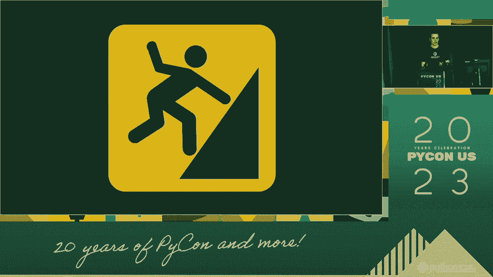

 That allows us to make it more important to use a language。 That allows us to make it more important to use a language。 That allows us to make it more important to use a language。 That allows us to make it more important to use a language。 That allows us to make it more important to use a language。 That allows us to make it more important to use a language。 That allows us to make it more important to use a language。 That allows us to make it more important to use a language。

 That allows us to make it more important to use a language。 That allows us to make it more important to use a language。 That allows us to make it more important to use a language。 That allows us to make it more important to use a language。 That allows us to make it more important to use a language。 That allows us to make it more important to use a language。
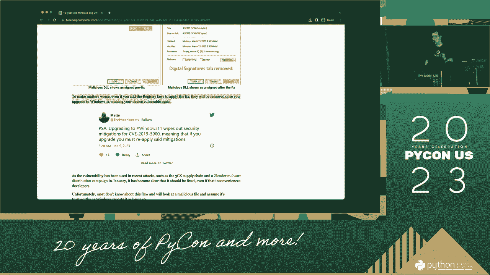

 That allows us to make it more important to use a language。 That allows us to make it more important to use a language。 That allows us to make it more important to use a language。 That allows us to make it more important to use a language。 That allows us to make it more important to use a language。 That allows us to make it more important to use a language。 That allows us to make it more important to use a language。 That allows us to make it more important to use a language。

 That allows us to make it more important to use a language。 That allows us to make it more important to use a language。 That allows us to make it more important to use a language。 That allows us to make it more important to use a language。 That allows us to make it more important to use a language。 That allows us to make it more important to use a language。 That allows us to make it more important to use a language。 That allows us to make it more important to use a language。

 That allows us to make it more important to use a language。 That allows us to make it more important to use a language。 That allows us to make it more important to use a language。 That allows us to make it more important to use a language。 That allows us to make it more important to use a language。 That allows us to make it more important to use a language。 That allows us to make it more important to use a language。 That allows us to make it more important to use a language。

 That allows us to make it more important to use a language。 That allows us to make it more important to use a language。 That allows us to make it more important to use a language。
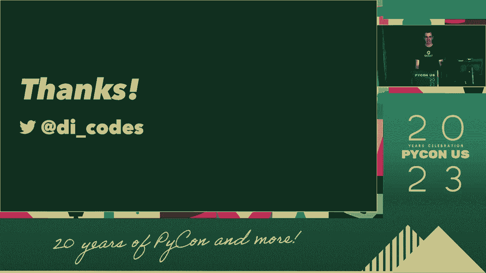