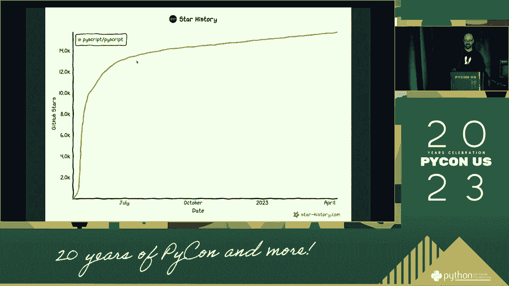
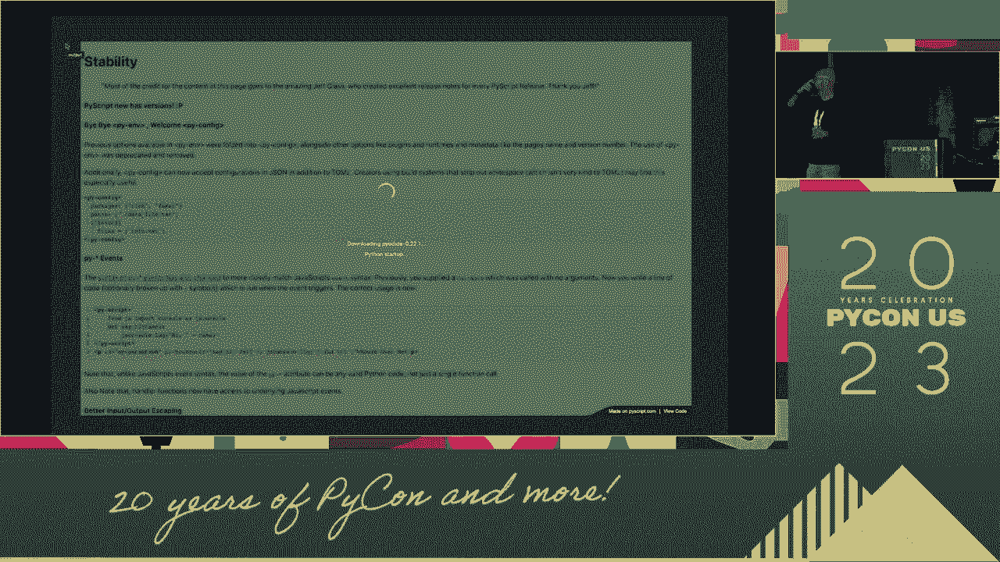
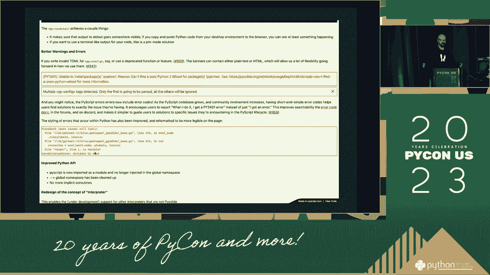
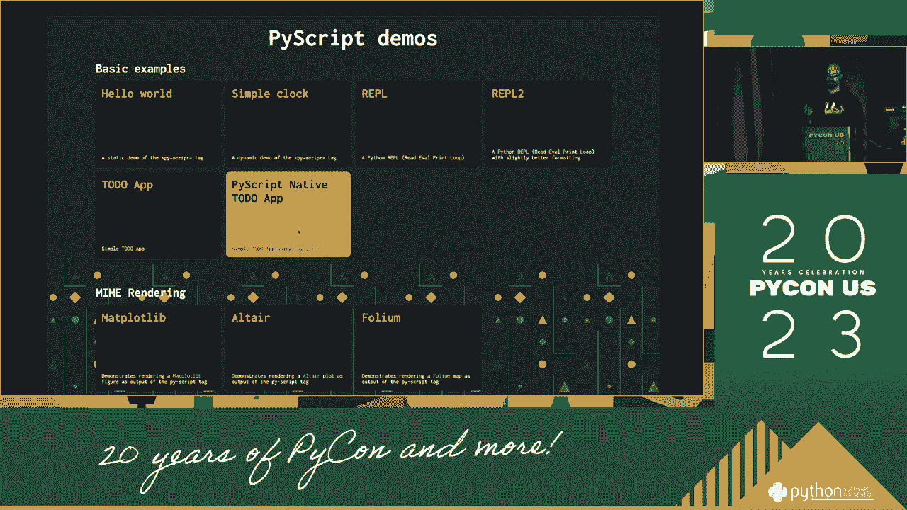
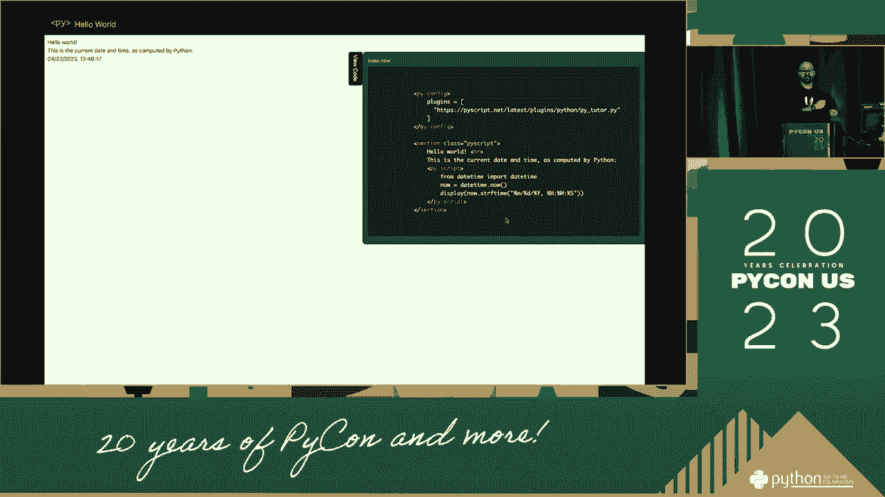
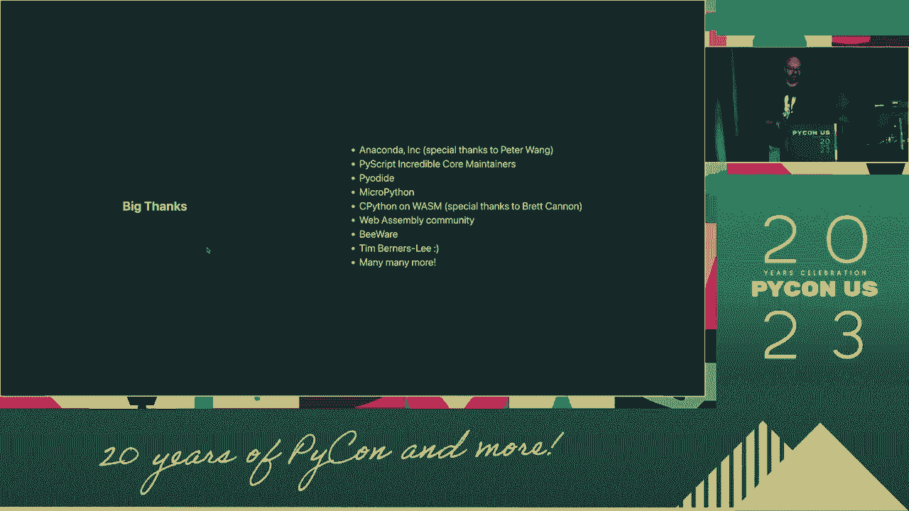

# P34：Talks - Fabio Pliger_ PyScript and the magic of Python in the browser - VikingDen7 - BV1114y1o7c5

 Hi everyone， good afternoon。 I will take a look at my face case and the magic of the temple in the vivisseau。 What is our welcome？ Start your friend。

 Thank you so much。 I hope you have a good night。 I hope you have a good night。 I hope you have a good night。 I hope you have a good night。 I hope you have a good night。 I hope you have a good night。 I hope you have a good night。 I hope you have a good night。 I hope you have a good night。 I hope you have a good night。 I hope you have a good night。

 I hope you have a good night。 I hope you have a good night。 I hope you have a good night。 I hope you have a good night。 I hope you have a good night。 I hope you have a good night。 I hope you have a good night。 I hope you have a good night。 I hope you have a good night。 I hope you have a good night。 I hope you have a good night。 I hope you have a good night。

 I hope you have a good night。 I hope you have a good night。 I hope you have a good night。 I hope you have a good night。 I hope you have a good night。 I hope you have a good night。 I hope you have a good night。 I hope you have a good night。 I hope you have a good night。 I hope you have a good night。 I hope you have a good night。 I hope you have a good night。

 I hope you have a good night。 I hope you have a good night。 I hope you have a good night。 I hope you have a good night。 I hope you have a good night。 I hope you have a good night。 I hope you have a good night。 I hope you have a good night。 I hope you have a good night。 I hope you have a good night。 I hope you have a good night。 I hope you have a good night。

 I hope you have a good night。 I hope you have a good night。 I hope you have a good night。 I hope you have a good night。 I hope you have a good night。 I hope you have a good night。 I hope you have a good night。 I hope you have a good night。 I hope you have a good night。 I hope you have a good night。 I hope you have a good night。 I hope you have a good night。

 I hope you have a good night。 I hope you have a good night。 I hope you have a good night。 I hope you have a good night。 I hope you have a good night。 I hope you have a good night。 I hope you have a good night。 I hope you have a good night。 I hope you have a good night。 I hope you have a good night。 I hope you have a good night。 I hope you have a good night。

 I hope you have a good night。 I hope you have a good night。 I hope you have a good night。 I hope you have a good night。 I hope you have a good night。 I hope you have a good night。 I hope you have a good night。 I hope you have a good night。 I hope you have a good night。 I hope you have a good night。 I hope you have a good night。 I hope you have a good night。

 I hope you have a good night。 I hope you have a good night。 I hope you have a good night。 I hope you have a good night。 I hope you have a good night。 I hope you have a good night。 I hope you have a good night。 I hope you have a good night。 I hope you have a good night。 I hope you have a good night。 I hope you have a good night。 I hope you have a good night。

 I hope you have a good night。 I hope you have a good night。 I hope you have a good night。 I hope you have a good night。 I hope you have a good night。 I hope you have a good night。 I hope you have a good night。 I hope you have a good night。 I hope you have a good night。 I hope you have a good night。 I hope you have a good night。 I hope you have a good night。

 I hope you have a good night。 I hope you have a good night。 I hope you have a good night。 I hope you have a good night。 I hope you have a good night。 I hope you have a good night。 I hope you have a good night。 I hope you have a good night。 I hope you have a good night。 I hope you have a good night。 I hope you have a good night。 I hope you have a good night。

 I hope you have a good night。 I hope you have a good night。 I hope you have a good night。 I hope you have a good night。 I hope you have a good night。 I hope you have a good night。 I hope you have a good night。 I hope you have a good night。 I hope you have a good night。 I hope you have a good night。 I hope you have a good night。 I hope you have a good night。

 I hope you have a good night。 I hope you have a good night。 I hope you have a good night。 I hope you have a good night。 I hope you have a good night。 I hope you have a good night。 I hope you have a good night。 I hope you have a good night。 I hope you have a good night。 I hope you have a good night。 I hope you have a good night。 I hope you have a good night。

 I hope you have a good night。 I hope you have a good night。 I hope you have a good night。 I hope you have a good night。 I hope you have a good night。 I hope you have a good night。 I hope you have a good night。 I hope you have a good night。 I hope you have a good night。 I hope you have a good night。 I hope you have a good night。 I hope you have a good night。

 I hope you have a good night。 I hope you have a good night。 I hope you have a good night。 I hope you have a good night。 I hope you have a good night。 I hope you have a good night。 I hope you have a good night。 I hope you have a good night。 I hope you have a good night。 I hope you have a good night。 I hope you have a good night。 I hope you have a good night。

 I hope you have a good night。 I hope you have a good night。 I hope you have a good night。 I hope you have a good night。 I hope you have a good night。 I hope you have a good night。 I hope you have a good night。 I hope you have a good night。 I hope you have a good night。 I hope you have a good night。 I hope you have a good night。 I hope you have a good night。

 I hope you have a good night。 I hope you have a good night。 I hope you have a good night。 I hope you have a good night。 I hope you have a good night。 I hope you have a good night。 I hope you have a good night。 I hope you have a good night。 I hope you have a good night。 I hope you have a good night。 I hope you have a good night。 I hope you have a good night。

 I hope you have a good night。 I hope you have a good night。 I hope you have a good night。 I hope you have a good night。 I hope you have a good night。 I hope you have a good night。 I hope you have a good night。 I hope you have a good night。 I hope you have a good night。 I hope you have a good night。 I hope you have a good night。 I hope you have a good night。

 I hope you have a good night。 I hope you have a good night。 I hope you have a good night。 I hope you have a good night。 I hope you have a good night。 I hope you have a good night。 I hope you have a good night。 I hope you have a good night。 I hope you have a good night。 I hope you have a good night。 I hope you have a good night。 I hope you have a good night。

 I hope you have a good night。 I hope you have a good night。 I hope you have a good night。 I hope you have a good night。 I hope you have a good night。 I hope you have a good night。 I hope you have a good night。 I hope you have a good night。 I hope you have a good night。 I hope you have a good night。 I hope you have a good night。 I hope you have a good night。

 I hope you have a good night。 I hope you have a good night。 I hope you have a good night。 I hope you have a good night。 I hope you have a good night。 I hope you have a good night。 I hope you have a good night。 I hope you have a good night。 I hope you have a good night。 I hope you have a good night。 I hope you have a good night。 I hope you have a good night。

 I hope you have a good night。 I hope you have a good night。 I hope you have a good night。 I hope you have a good night。 I hope you have a good night。 I hope you have a good night。 I hope you have a good night。 I hope you have a good night。 I hope you have a good night。 I hope you have a good night。 I hope you have a good night。 I hope you have a good night。

 I hope you have a good night。 I hope you have a good night。 I hope you have a good night。 I hope you have a good night。 I hope you have a good night。 I hope you have a good night。 I hope you have a good night。 I hope you have a good night。 I hope you have a good night。 I hope you have a good night。 I hope you have a good night。 I hope you have a good night。

 I hope you have a good night。 I hope you have a good night。 I hope you have a good night。 I hope you have a good night。 I hope you have a good night。 I hope you have a good night。 I hope you have a good night。 I hope you have a good night。 I hope you have a good night。 I hope you have a good night。 I hope you have a good night。 I hope you have a good night。

 I hope you have a good night。 I hope you have a good night。 I hope you have a good night。 I hope you have a good night。 I hope you have a good night。 I hope you have a good night。 I hope you have a good night。 I hope you have a good night。 I hope you have a good night。 I hope you have a good night。 I hope you have a good night。 I hope you have a good night。

 I hope you have a good night。 I hope you have a good night。 I hope you have a good night。 I hope you have a good night。 I hope you have a good night。 I hope you have a good night。 I hope you have a good night。 I hope you have a good night。 I hope you have a good night。 I hope you have a good night。 I hope you have a good night。 I hope you have a good night。

 I hope you have a good night。 I hope you have a good night。 I hope you have a good night。 I hope you have a good night。 I hope you have a good night。 I hope you have a good night。 I hope you have a good night。 I hope you have a good night。 I hope you have a good night。 I hope you have a good night。 I hope you have a good night。 I hope you have a good night。

 I hope you have a good night。 I hope you have a good night。 I hope you have a good night。 I hope you have a good night。 I hope you have a good night。 I hope you have a good night。 I hope you have a good night。 I hope you have a good night。 I hope you have a good night。 I hope you have a good night。 I hope you have a good night。 I hope you have a good night。

 I hope you have a good night。 I hope you have a good night。 I hope you have a good night。 I hope you have a good night。 I hope you have a good night。 I hope you have a good night。 I hope you have a good night。 I hope you have a good night。 I hope you have a good night。 I hope you have a good night。 I hope you have a good night。 I hope you have a good night。

 I hope you have a good night。 I hope you have a good night。 I hope you have a good night。 I hope you have a good night。 I hope you have a good night。 I hope you have a good night。 I hope you have a good night。 I hope you have a good night。 I hope you have a good night。 I hope you have a good night。 I hope you have a good night。 I hope you have a good night。

 I hope you have a good night。 I hope you have a good night。 I hope you have a good night。 I hope you have a good night。 I hope you have a good night。 I hope you have a good night。 I hope you have a good night。 I hope you have a good night。 I hope you have a good night。 I hope you have a good night。 I hope you have a good night。 I hope you have a good night。

 I hope you have a good night。 I hope you have a good night。 I hope you have a good night。 I hope you have a good night。 I hope you have a good night。 I hope you have a good night。 I hope you have a good night。 I hope you have a good night。 I hope you have a good night。 I hope you have a good night。 I hope you have a good night。 I hope you have a good night。

 I hope you have a good night。 I hope you have a good night。 I hope you have a good night。 I hope you have a good night。 I hope you have a good night。 I hope you have a good night。 I hope you have a good night。 I hope you have a good night。 I hope you have a good night。 I hope you have a good night。 I hope you have a good night。 I hope you have a good night。

 I hope you have a good night。 I hope you have a good night。 I hope you have a good night。 I hope you have a good night。 I hope you have a good night。 I hope you have a good night。 I hope you have a good night。 I hope you have a good night。 I hope you have a good night。 I hope you have a good night。 I hope you have a good night。 I hope you have a good night。

 I hope you have a good night。 I hope you have a good night。 I hope you have a good night。 I hope you have a good night。 I hope you have a good night。 I hope you have a good night。 I hope you have a good night。 I hope you have a good night。 I hope you have a good night。 I hope you have a good night。

 I hope you have a good night。 I hope you have a good night。 I hope you have a good night。 I hope you have a good night。 I hope you have a good night。 I hope you have a good night。 I hope you have a good night。 I hope you have a good night。 I hope you have a good night。 I hope you have a good night。 I hope you have a good night。 I hope you have a good night。

 I hope you have a good night。 I hope you have a good night。 I hope you have a good night。 I hope you have a good night。 I hope you have a good night。 I hope you have a good night。 I hope you have a good night。 I hope you have a good night。 I hope you have a good night。 I hope you have a good night。 I hope you have a good night。 I hope you have a good night。

 I hope you have a good night。 I hope you have a good night。 I hope you have a good night。 I hope you have a good night。 I hope you have a good night。 I hope you have a good night。 I hope you have a good night。 I hope you have a good night。 I hope you have a good night。 I hope you have a good night。 I hope you have a good night。 I hope you have a good night。

 I hope you have a good night。 I hope you have a good night。 I hope you have a good night。 I hope you have a good night。 I hope you have a good night。 I hope you have a good night。 I hope you have a good night。 I hope you have a good night。 I hope you have a good night。 I hope you have a good night。 I hope you have a good night。 I hope you have a good night。

 I hope you have a good night。 I hope you have a good night。 I hope you have a good night。 I hope you have a good night。 I hope you have a good night。 I hope you have a good night。 I hope you have a good night。 I hope you have a good night。 I hope you have a good night。 I hope you have a good night。 I hope you have a good night。 I hope you have a good night。

 I hope you have a good night。 I hope you have a good night。 I hope you have a good night。 I hope you have a good night。 I hope you have a good night。 I hope you have a good night。 I hope you have a good night。 I hope you have a good night。 I hope you have a good night。 I hope you have a good night。

 I hope you have a good night。 I hope you have a good night。 I hope you have a good night。 I hope you have a good night。 I hope you have a good night。 I hope you have a good night。 I hope you have a good night。 I hope you have a good night。 I hope you have a good night。 I hope you have a good night。 I hope you have a good night。 I hope you have a good night。

 I hope you have a good night。 I hope you have a good night。 I hope you have a good night。 I hope you have a good night。 I hope you have a good night。 I hope you have a good night。 I hope you have a good night。 I hope you have a good night。 I hope you have a good night。 I hope you have a good night。 I hope you have a good night。 I hope you have a good night。

 I hope you have a good night。 I hope you have a good night。 I hope you have a good night。 I hope you have a good night。 I hope you have a good night。 I hope you have a good night。 I hope you have a good night。 I hope you have a good night。 I hope you have a good night。 I hope you have a good night。 I hope you have a good night。 I hope you have a good night。

 I hope you have a good night。 I hope you have a good night。 I hope you have a good night。 I hope you have a good night。 I hope you have a good night。 I hope you have a good night。 I hope you have a good night。 I hope you have a good night。 I hope you have a good night。 I hope you have a good night。 I hope you have a good night。 I hope you have a good night。

 I hope you have a good night。 I hope you have a good night。 I hope you have a good night。 I hope you have a good night。 I hope you have a good night。 I hope you have a good night。 I hope you have a good night。 I hope you have a good night。 I hope you have a good night。 I hope you have a good night。 I hope you have a good night。 I hope you have a good night。

 I hope you have a good night。 I hope you have a good night。 I hope you have a good night。 I hope you have a good night。 I hope you have a good night。 I hope you have a good night。 I hope you have a good night。 I hope you have a good night。 I hope you have a good night。 I hope you have a good night。 I hope you have a good night。 I hope you have a good night。

 I hope you have a good night。 I hope you have a good night。 I hope you have a good night。 I hope you have a good night。 I hope you have a good night。 I hope you have a good night。 I hope you have a good night。 I hope you have a good night。 I hope you have a good night。 I hope you have a good night。 I hope you have a good night。 I hope you have a good night。

 I hope you have a good night。 I hope you have a good night。 I hope you have a good night。 I hope you have a good night。 I hope you have a good night。 I hope you have a good night。 I hope you have a good night。 I hope you have a good night。 I hope you have a good night。 I hope you have a good night。 I hope you have a good night。 I hope you have a good night。

 I hope you have a good night。 I hope you have a good night。 I hope you have a good night。 I hope you have a good night。 I hope you have a good night。 I hope you have a good night。 I hope you have a good night。 I hope you have a good night。 I hope you have a good night。 I hope you have a good night。 I hope you have a good night。 I hope you have a good night。

 I hope you have a good night。 I hope you have a good night。 I hope you have a good night。 I hope you have a good night。 I hope you have a good night。 I hope you have a good night。 I hope you have a good night。 I hope you have a good night。 I hope you have a good night。 I hope you have a good night。 I hope you have a good night。 I hope you have a good night。

 I hope you have a good night。 I hope you have a good night。 I hope you have a good night。 I hope you have a good night。 I hope you have a good night。 I hope you have a good night。 I hope you have a good night。 I hope you have a good night。 I hope you have a good night。 I hope you have a good night。 I hope you have a good night。 I hope you have a good night。

 I hope you have a good night。 I hope you have a good night。 I hope you have a good night。 I hope you have a good night。 I hope you have a good night。 I hope you have a good night。 I hope you have a good night。 I hope you have a good night。 I hope you have a good night。 I hope you have a good night。 I hope you have a good night。 I hope you have a good night。

 I hope you have a good night。 I hope you have a good night。 I hope you have a good night。 I hope you have a good night。 I hope you have a good night。 I hope you have a good night。 I hope you have a good night。 I hope you have a good night。 I hope you have a good night。 I hope you have a good night。 I hope you have a good night。 I hope you have a good night。

 I hope you have a good night。 I hope you have a good night。 I hope you have a good night。 I hope you have a good night。 I hope you have a good night。 I hope you have a good night。 I hope you have a good night。 I hope you have a good night。 I hope you have a good night。 I hope you have a good night。 I hope you have a good night。 I hope you have a good night。

 I hope you have a good night。 I hope you have a good night。 I hope you have a good night。 I hope you have a good night。 I hope you have a good night。 I hope you have a good night。 I hope you have a good night。 I hope you have a good night。 I hope you have a good night。 I hope you have a good night。 I hope you have a good night。 I hope you have a good night。

 I hope you have a good night。 I hope you have a good night。 I hope you have a good night。 I hope you have a good night。 I hope you have a good night。 I hope you have a good night。 I hope you have a good night。 I hope you have a good night。 I hope you have a good night。 I hope you have a good night。 I hope you have a good night。 I hope you have a good night。

 I hope you have a good night。 I hope you have a good night。 I hope you have a good night。 I hope you have a good night。 I hope you have a good night。 I hope you have a good night。 I hope you have a good night。 I hope you have a good night。 I hope you have a good night。 I hope you have a good night。 I hope you have a good night。 I hope you have a good night。

 I hope you have a good night。 I hope you have a good night。 I hope you have a good night。 I hope you have a good night。 I hope you have a good night。 I hope you have a good night。 I hope you have a good night。 I hope you have a good night。 I hope you have a good night。 I hope you have a good night。 I hope you have a good night。 I hope you have a good night。

 I hope you have a good night。 I hope you have a good night。 I hope you have a good night。 I hope you have a good night。 I hope you have a good night。 I hope you have a good night。 I hope you have a good night。 I hope you have a good night。 I hope you have a good night。 I hope you have a good night。 I hope you have a good night。 I hope you have a good night。

 I hope you have a good night。 I hope you have a good night。

 I hope you have a good night。 I hope you have a good night。 I hope you have a good night。 I hope you have a good night。 I hope you have a good night。

 I hope you have a good night。 I hope you have a good night。 I hope you have a good night。 I hope you have a good night。 I hope you have a good night。 I hope you have a good night。 I hope you have a good night。 I hope you have a good night。 I hope you have a good night。 I hope you have a good night。 I hope you have a good night。 I hope you have a good night。

 I hope you have a good night。 I hope you have a good night。 I hope you have a good night。 I hope you have a good night。 I hope you have a good night。 I hope you have a good night。 I hope you have a good night。 I hope you have a good night。 I hope you have a good night。 I hope you have a good night。 I hope you have a good night。 I hope you have a good night。

 I hope you have a good night。 I hope you have a good night。 I hope you have a good night。 I hope you have a good night。 I hope you have a good night。 I hope you have a good night。 I hope you have a good night。 I hope you have a good night。 I hope you have a good night。 I hope you have a good night。 I hope you have a good night。 I hope you have a good night。

 I hope you have a good night。 I hope you have a good night。 I hope you have a good night。 I hope you have a good night。 I hope you have a good night。 I hope you have a good night。 I hope you have a good night。 I hope you have a good night。 I hope you have a good night。 I hope you have a good night。 I hope you have a good night。 I hope you have a good night。

 I hope you have a good night。 I hope you have a good night。 I hope you have a good night。 I hope you have a good night。 I hope you have a good night。 I hope you have a good night。 I hope you have a good night。 I hope you have a good night。 I hope you have a good night。 I hope you have a good night。 I hope you have a good night。 I hope you have a good night。

 I hope you have a good night。 I hope you have a good night。 I hope you have a good night。 I hope you have a good night。 I hope you have a good night。 I hope you have a good night。 I hope you have a good night。 I hope you have a good night。 I hope you have a good night。 I hope you have a good night。 I hope you have a good night。 I hope you have a good night。

 I hope you have a good night。 I hope you have a good night。 I hope you have a good night。 I hope you have a good night。 I hope you have a good night。 I hope you have a good night。 I hope you have a good night。 I hope you have a good night。 I hope you have a good night。 I hope you have a good night。 I hope you have a good night。 I hope you have a good night。

 I hope you have a good night。 I hope you have a good night。 I hope you have a good night。 I hope you have a good night。 I hope you have a good night。 I hope you have a good night。 I hope you have a good night。 I hope you have a good night。 I hope you have a good night。 I hope you have a good night。 I hope you have a good night。 I hope you have a good night。

 I hope you have a good night。 I hope you have a good night。 I hope you have a good night。 I hope you have a good night。 I hope you have a good night。 I hope you have a good night。 I hope you have a good night。 I hope you have a good night。 I hope you have a good night。 I hope you have a good night。 I hope you have a good night。 I hope you have a good night。

 I hope you have a good night。 I hope you have a good night。 I hope you have a good night。 I hope you have a good night。 I hope you have a good night。 I hope you have a good night。 I hope you have a good night。 I hope you have a good night。 I hope you have a good night。 I hope you have a good night。 I hope you have a good night。 I hope you have a good night。

 I hope you have a good night。 I hope you have a good night。 I hope you have a good night。 I hope you have a good night。 I hope you have a good night。

 I hope you have a good night。 I hope you have a good night。 I hope you have a good night。 I hope you have a good night。 I hope you have a good night。 I hope you have a good night。 I hope you have a good night。 I hope you have a good night。 I hope you have a good night。 I hope you have a good night。 I hope you have a good night。 I hope you have a good night。

 I hope you have a good night。 I hope you have a good night。 I hope you have a good night。 I hope you have a good night。 I hope you have a good night。 I hope you have a good night。 I hope you have a good night。 I hope you have a good night。 I hope you have a good night。 I hope you have a good night。 I hope you have a good night。 I hope you have a good night。

 I hope you have a good night。 I hope you have a good night。 I hope you have a good night。 I hope you have a good night。 I hope you have a good night。 I hope you have a good night。 I hope you have a good night。 I hope you have a good night。 I hope you have a good night。 I hope you have a good night。 I hope you have a good night。 I hope you have a good night。

 I hope you have a good night。 I hope you have a good night。 I hope you have a good night。 I hope you have a good night。 I hope you have a good night。 I hope you have a good night。 I hope you have a good night。 I hope you have a good night。 I hope you have a good night。 I hope you have a good night。 I hope you have a good night。 I hope you have a good night。

 I hope you have a good night。 I hope you have a good night。 I hope you have a good night。 I hope you have a good night。 I hope you have a good night。 I hope you have a good night。 I hope you have a good night。 I hope you have a good night。 I hope you have a good night。 I hope you have a good night。 I hope you have a good night。 I hope you have a good night。

 I hope you have a good night。 I hope you have a good night。 I hope you have a good night。 I hope you have a good night。 I hope you have a good night。

 I hope you have a good night。 I hope you have a good night。 I hope you have a good night。 I hope you have a good night。 I hope you have a good night。 I hope you have a good night。 I hope you have a good night。 I hope you have a good night。 I hope you have a good night。 I hope you have a good night。 I hope you have a good night。 I hope you have a good night。

 I hope you have a good night。 I hope you have a good night。 I hope you have a good night。 I hope you have a good night。 I hope you have a good night。 I hope you have a good night。 I hope you have a good night。 I hope you have a good night。 I hope you have a good night。 I hope you have a good night。 I hope you have a good night。 I hope you have a good night。

 I hope you have a good night。

 I hope you have a good night。 I hope you have a good night。 I hope you have a good night。 I hope you have a good night。 I hope you have a good night。 I hope you have a good night。 I hope you have a good night。 I hope you have a good night。 I hope you have a good night。 I hope you have a good night。 I hope you have a good night。 I hope you have a good night。

 I hope you have a good night。 I hope you have a good night。 I hope you have a good night。 I hope you have a good night。 I hope you have a good night。 I hope you have a good night。 I hope you have a good night。 I hope you have a good night。 I hope you have a good night。 I hope you have a good night。 I hope you have a good night。 I hope you have a good night。

 I hope you have a good night。 I hope you have a good night。 I hope you have a good night。 I hope you have a good night。 I hope you have a good night。 I hope you have a good night。 I hope you have a good night。 I hope you have a good night。 I hope you have a good night。 I hope you have a good night。 I hope you have a good night。 I hope you have a good night。

 I hope you have a good night。 I hope you have a good night。 I hope you have a good night。 I hope you have a good night。 I hope you have a good night。 I hope you have a good night。 I hope you have a good night。 I hope you have a good night。 I hope you have a good night。 I hope you have a good night。 I hope you have a good night。 I hope you have a good night。

 I hope you have a good night。 I hope you have a good night。 I hope you have a good night。 I hope you have a good night。 I hope you have a good night。 I hope you have a good night。 I hope you have a good night。 I hope you have a good night。 I hope you have a good night。 I hope you have a good night。 I hope you have a good night。 I hope you have a good night。

 I hope you have a good night。 I hope you have a good night。 I hope you have a good night。 I hope you have a good night。 I hope you have a good night。 I hope you have a good night。 I hope you have a good night。 I hope you have a good night。 I hope you have a good night。 I hope you have a good night。 I hope you have a good night。 I hope you have a good night。

 I hope you have a good night。 I hope you have a good night。 I hope you have a good night。 I hope you have a good night。 I hope you have a good night。 I hope you have a good night。 I hope you have a good night。 I hope you have a good night。 I hope you have a good night。 I hope you have a good night。 I hope you have a good night。 I hope you have a good night。

 I hope you have a good night。 I hope you have a good night。 I hope you have a good night。 I hope you have a good night。 I hope you have a good night。 I hope you have a good night。 I hope you have a good night。 I hope you have a good night。 I hope you have a good night。 I hope you have a good night。 I hope you have a good night。 I hope you have a good night。

 I hope you have a good night。 I hope you have a good night。 I hope you have a good night。 I hope you have a good night。 I hope you have a good night。 I hope you have a good night。 I hope you have a good night。 I hope you have a good night。 I hope you have a good night。 I hope you have a good night。 I hope you have a good night。 I hope you have a good night。

 I hope you have a good night。 I hope you have a good night。 I hope you have a good night。 I hope you have a good night。 I hope you have a good night。 I hope you have a good night。 I hope you have a good night。 I hope you have a good night。 I hope you have a good night。 I hope you have a good night。 I hope you have a good night。 I hope you have a good night。

 I hope you have a good night。 I hope you have a good night。 I hope you have a good night。 I hope you have a good night。 I hope you have a good night。 I hope you have a good night。 I hope you have a good night。 I hope you have a good night。 I hope you have a good night。 I hope you have a good night。 I hope you have a good night。 I hope you have a good night。

 I hope you have a good night。 I hope you have a good night。 I hope you have a good night。 I hope you have a good night。 I hope you have a good night。 I hope you have a good night。 I hope you have a good night。 I hope you have a good night。 I hope you have a good night。 I hope you have a good night。 I hope you have a good night。 I hope you have a good night。

 I hope you have a good night。 I hope you have a good night。 I hope you have a good night。 I hope you have a good night。 I hope you have a good night。 I hope you have a good night。 I hope you have a good night。 I hope you have a good night。 I hope you have a good night。 I hope you have a good night。 I hope you have a good night。 I hope you have a good night。

 I hope you have a good night。 I hope you have a good night。 I hope you have a good night。 I hope you have a good night。 I hope you have a good night。 I hope you have a good night。 I hope you have a good night。 I hope you have a good night。 I hope you have a good night。 I hope you have a good night。 I hope you have a good night。 I hope you have a good night。

 I hope you have a good night。 I hope you have a good night。 I hope you have a good night。 I hope you have a good night。 I hope you have a good night。 I hope you have a good night。 I hope you have a good night。 I hope you have a good night。 I hope you have a good night。 I hope you have a good night。 I hope you have a good night。 I hope you have a good night。

 I hope you have a good night。 I hope you have a good night。 I hope you have a good night。 I hope you have a good night。 I hope you have a good night。 I hope you have a good night。 I hope you have a good night。 I hope you have a good night。 I hope you have a good night。 I hope you have a good night。 I hope you have a good night。 I hope you have a good night。

 I hope you have a good night。 I hope you have a good night。 I hope you have a good night。 I hope you have a good night。 I hope you have a good night。 I hope you have a good night。 I hope you have a good night。 I hope you have a good night。 I hope you have a good night。 I hope you have a good night。 I hope you have a good night。 I hope you have a good night。

 I hope you have a good night。 I hope you have a good night。 I hope you have a good night。 I hope you have a good night。 I hope you have a good night。 I hope you have a good night。 I hope you have a good night。 I hope you have a good night。 I hope you have a good night。 I hope you have a good night。 I hope you have a good night。 I hope you have a good night。

 I hope you have a good night。 I hope you have a good night。 I hope you have a good night。 I hope you have a good night。 I hope you have a good night。 I hope you have a good night。 I hope you have a good night。 I hope you have a good night。 I hope you have a good night。 I hope you have a good night。 I hope you have a good night。 I hope you have a good night。

 I hope you have a good night。 I hope you have a good night。 I hope you have a good night。 I hope you have a good night。 I hope you have a good night。 I hope you have a good night。 I hope you have a good night。 I hope you have a good night。 I hope you have a good night。 I hope you have a good night。 I hope you have a good night。 I hope you have a good night。

 I hope you have a good night。 I hope you have a good night。 I hope you have a good night。 I hope you have a good night。 I hope you have a good night。 I hope you have a good night。 I hope you have a good night。 I hope you have a good night。 I hope you have a good night。 I hope you have a good night。 I hope you have a good night。 I hope you have a good night。

 I hope you have a good night。 I hope you have a good night。 I hope you have a good night。 I hope you have a good night。 I hope you have a good night。 I hope you have a good night。 I hope you have a good night。 I hope you have a good night。 I hope you have a good night。 I hope you have a good night。 I hope you have a good night。 I hope you have a good night。

 I hope you have a good night。 I hope you have a good night。 I hope you have a good night。 I hope you have a good night。 I hope you have a good night。 I hope you have a good night。 I hope you have a good night。 I hope you have a good night。 I hope you have a good night。 I hope you have a good night。 I hope you have a good night。 I hope you have a good night。

 I hope you have a good night。 I hope you have a good night。 I hope you have a good night。 I hope you have a good night。 I hope you have a good night。 I hope you have a good night。 I hope you have a good night。 I hope you have a good night。 I hope you have a good night。 I hope you have a good night。 I hope you have a good night。 I hope you have a good night。

 I hope you have a good night。 I hope you have a good night。 I hope you have a good night。 I hope you have a good night。 I hope you have a good night。 I hope you have a good night。 I hope you have a good night。 I hope you have a good night。 I hope you have a good night。 I hope you have a good night。 I hope you have a good night。 I hope you have a good night。

 I hope you have a good night。 I hope you have a good night。 I hope you have a good night。 I hope you have a good night。 I hope you have a good night。 I hope you have a good night。 I hope you have a good night。

 I hope you have a good night。 I hope you have a good night。 I hope you have a good night。 I hope you have a good night。 I hope you have a good night。

 I hope you have a good night。 I hope you have a good night。 I hope you have a good night。 I hope you have a good night。 I hope you have a good night。 I hope you have a good night。 I hope you have a good night。 I hope you have a good night。 I hope you have a good night。 I hope you have a good night。

 I hope you have a good night。 I hope you have a good night。 I hope you have a good night。 I hope you have a good night。 I hope you have a good night。 I hope you have a good night。 I hope you have a good night。 I hope you have a good night。 I hope you have a good night。 I hope you have a good night。 I hope you have a good night。 I hope you have a good night。

 I hope you have a good night。 I hope you have a good night。 I hope you have a good night。 I hope you have a good night。 I hope you have a good night。 I hope you have a good night。 I hope you have a good night。 I hope you have a good night。 I hope you have a good night。 I hope you have a good night。 I hope you have a good night。 I hope you have a good night。

 I hope you have a good night。 I hope you have a good night。 I hope you have a good night。 I hope you have a good night。 I hope you have a good night。

 I hope you have a good night。 I hope you have a good night。 I hope you have a good night。 I hope you have a good night。 I hope you have a good night。 I hope you have a good night。 I hope you have a good night。 I hope you have a good night。 I hope you have a good night。

 I hope you have a good night。 I hope you have a good night。 I hope you have a good night。 I hope you have a good night。 I hope you have a good night。

 I hope you have a good night。 I hope you have a good night。 I hope you have a good night。 I hope you have a good night。 I hope you have a good night。

 I hope you have a good night。 I hope you have a good night。 I hope you have a good night。 I hope you have a good night。 I hope you have a good night。

 I hope you have a good night。 I hope you have a good night。 I hope you have a good night。 I hope you have a good night。 I hope you have a good night。 I hope you have a good night。 I hope you have a good night。 I hope you have a good night。 I hope you have a good night。 I hope you have a good night。 I hope you have a good night。 I hope you have a good night。

 I hope you have a good night。 I hope you have a good night。 I hope you have a good night。

 I hope you have a good night。 I hope you have a good night。 I hope you have a good night。 I hope you have a good night。 I hope you have a good night。 I hope you have a good night。 I hope you have a good night。 I hope you have a good night。 I hope you have a good night。 I hope you have a good night。 I hope you have a good night。 I hope you have a good night。

 I hope you have a good night。 I hope you have a good night。 I hope you have a good night。 I hope you have a good night。 I hope you have a good night。 I hope you have a good night。 I hope you have a good night。 I hope you have a good night。 I hope you have a good night。 I hope you have a good night。 I hope you have a good night。 I hope you have a good night。

 I hope you have a good night。 I hope you have a good night。 I hope you have a good night。 I hope you have a good night。 I hope you have a good night。 I hope you have a good night。 I hope you have a good night。 I hope you have a good night。 I hope you have a good night。 I hope you have a good night。 I hope you have a good night。 I hope you have a good night。

 I hope you have a good night。 I hope you have a good night。 I hope you have a good night。 I hope you have a good night。 I hope you have a good night。 I hope you have a good night。 I hope you have a good night。 I hope you have a good night。

 I hope you have a good night。 I hope you have a good night。 I hope you have a good night。 I hope you have a good night。 I hope you have a good night。 I hope you have a good night。 I hope you have a good night。 I hope you have a good night。 I hope you have a good night。 I hope you have a good night。 I hope you have a good night。 I hope you have a good night。

 I hope you have a good night。 I hope you have a good night。 I hope you have a good night。

 I hope you have a good night。 I hope you have a good night。 I hope you have a good night。 I hope you have a good night。 I hope you have a good night。 I hope you have a good night。 I hope you have a good night。 I hope you have a good night。 I hope you have a good night。 I hope you have a good night。 I hope you have a good night。 I hope you have a good night。

 I hope you have a good night。 I hope you have a good night。 I hope you have a good night。 I hope you have a good night。 I hope you have a good night。 I hope you have a good night。 I hope you have a good night。 I hope you have a good night。 I hope you have a good night。 I hope you have a good night。 I hope you have a good night。 I hope you have a good night。

 I hope you have a good night。 I hope you have a good night。 I hope you have a good night。 I hope you have a good night。 I hope you have a good night。 I hope you have a good night。 I hope you have a good night。 I hope you have a good night。 I hope you have a good night。 I hope you have a good night。 I hope you have a good night。 I hope you have a good night。

 I hope you have a good night。 I hope you have a good night。 I hope you have a good night。 I hope you have a good night。 I hope you have a good night。 I hope you have a good night。 I hope you have a good night。 I hope you have a good night。 I hope you have a good night。 I hope you have a good night。 I hope you have a good night。 I hope you have a good night。

 I hope you have a good night。 I hope you have a good night。 I hope you have a good night。 I hope you have a good night。 I hope you have a good night。 I hope you have a good night。 I hope you have a good night。 I hope you have a good night。 I hope you have a good night。 I hope you have a good night。 I hope you have a good night。 I hope you have a good night。

 I hope you have a good night。 I hope you have a good night。 I hope you have a good night。 I hope you have a good night。 I hope you have a good night。 I hope you have a good night。 I hope you have a good night。 I hope you have a good night。 I hope you have a good night。 I hope you have a good night。 I hope you have a good night。 I hope you have a good night。

 I hope you have a good night。 I hope you have a good night。 I hope you have a good night。

 I hope you have a good night。 I hope you have a good night。 I hope you have a good night。 I hope you have a good night。 I hope you have a good night。 I hope you have a good night。 I hope you have a good night。 I hope you have a good night。 I hope you have a good night。 I hope you have a good night。

 I hope you have a good night。 I hope you have a good night。 I hope you have a good night。 I hope you have a good night。 I hope you have a good night。 I hope you have a good night。 I hope you have a good night。 I hope you have a good night。 I hope you have a good night。 I hope you have a good night。 I hope you have a good night。 I hope you have a good night。

 I hope you have a good night。 I hope you have a good night。 I hope you have a good night。 I hope you have a good night。 I hope you have a good night。 I hope you have a good night。 I hope you have a good night。 I hope you have a good night。 I hope you have a good night。 I hope you have a good night。 I hope you have a good night。 I hope you have a good night。

 I hope you have a good night。 I hope you have a good night。 I hope you have a good night。 I hope you have a good night。 I hope you have a good night。 I hope you have a good night。 I hope you have a good night。 I hope you have a good night。 I hope you have a good night。 I hope you have a good night。 I hope you have a good night。 I hope you have a good night。

 I hope you have a good night。 I hope you have a good night。 I hope you have a good night。 I hope you have a good night。 I hope you have a good night。 I hope you have a good night。 I hope you have a good night。 I hope you have a good night。

 I hope you have a good night。 I hope you have a good night。 I hope you have a good night。 I hope you have a good night。 I hope you have a good night。 I hope you have a good night。 I hope you have a good night。 I hope you have a good night。 I hope you have a good night。 I hope you have a good night。 I hope you have a good night。 I hope you have a good night。

 I hope you have a good night。 I hope you have a good night。 I hope you have a good night。 I hope you have a good night。 I hope you have a good night。 I hope you have a good night。 I hope you have a good night。 I hope you have a good night。 I hope you have a good night。 I hope you have a good night。 I hope you have a good night。 I hope you have a good night。

 I hope you have a good night。 I hope you have a good night。 I hope you have a good night。 I hope you have a good night。

 I hope you have a good night。 I hope you have a good night。 I hope you have a good night。 I hope you have a good night。 I hope you have a good night。 I hope you have a good night。 I hope you have a good night。 I hope you have a good night。 I hope you have a good night。 I hope you have a good night。 I hope you have a good night。 I hope you have a good night。

 I hope you have a good night。 I hope you have a good night。 I hope you have a good night。 I hope you have a good night。 I hope you have a good night。 I hope you have a good night。 I hope you have a good night。 I hope you have a good night。 I hope you have a good night。 I hope you have a good night。 I hope you have a good night。 I hope you have a good night。

 I hope you have a good night。 I hope you have a good night。 I hope you have a good night。 I hope you have a good night。 I hope you have a good night。 I hope you have a good night。 I hope you have a good night。 I hope you have a good night。 I hope you have a good night。 I hope you have a good night。 I hope you have a good night。 I hope you have a good night。

 I hope you have a good night。 I hope you have a good night。 I hope you have a good night。 I hope you have a good night。 I hope you have a good night。 I hope you have a good night。 I hope you have a good night。 I hope you have a good night。 I hope you have a good night。 I hope you have a good night。 I hope you have a good night。 I hope you have a good night。

 I hope you have a good night。 I hope you have a good night。 I hope you have a good night。 I hope you have a good night。 I hope you have a good night。 I hope you have a good night。 I hope you have a good night。 I hope you have a good night。 I hope you have a good night。 I hope you have a good night。 I hope you have a good night。 I hope you have a good night。

 I hope you have a good night。 I hope you have a good night。 I hope you have a good night。 I hope you have a good night。 I hope you have a good night。 I hope you have a good night。 I hope you have a good night。 I hope you have a good night。 I hope you have a good night。 I hope you have a good night。 I hope you have a good night。 I hope you have a good night。

 I hope you have a good night。 I hope you have a good night。 I hope you have a good night。

 I hope you have a good night。 I hope you have a good night。 I hope you have a good night。 I hope you have a good night。 I hope you have a good night。

 I hope you have a good night。 I hope you have a good night。 I hope you have a good night。 I hope you have a good night。 I hope you have a good night。 I hope you have a good night。 I hope you have a good night。 I hope you have a good night。 I hope you have a good night。 I hope you have a good night。 I hope you have a good night。 I hope you have a good night。

 I hope you have a good night。 I hope you have a good night。 I hope you have a good night。 I hope you have a good night。 I hope you have a good night。 I hope you have a good night。 I hope you have a good night。 I hope you have a good night。 I hope you have a good night。 I hope you have a good night。 I hope you have a good night。 I hope you have a good night。

 I hope you have a good night。 I hope you have a good night。 I hope you have a good night。 I hope you have a good night。 I hope you have a good night。 I hope you have a good night。 I hope you have a good night。 I hope you have a good night。 I hope you have a good night。 I hope you have a good night。 I hope you have a good night。 I hope you have a good night。

 I hope you have a good night。 I hope you have a good night。 I hope you have a good night。 I hope you have a good night。 I hope you have a good night。 I hope you have a good night。 I hope you have a good night。 I hope you have a good night。 I hope you have a good night。 I hope you have a good night。 I hope you have a good night。 I hope you have a good night。

 I hope you have a good night。 I hope you have a good night。 I hope you have a good night。 I hope you have a good night。 I hope you have a good night。 I hope you have a good night。 I hope you have a good night。 I hope you have a good night。 I hope you have a good night。 I hope you have a good night。 I hope you have a good night。 I hope you have a good night。

 I hope you have a good night。 I hope you have a good night。 I hope you have a good night。 I hope you have a good night。 I hope you have a good night。 I hope you have a good night。 I hope you have a good night。 I hope you have a good night。 I hope you have a good night。 I hope you have a good night。 I hope you have a good night。 I hope you have a good night。

 I hope you have a good night。 I hope you have a good night。 I hope you have a good night。 I hope you have a good night。 I hope you have a good night。 I hope you have a good night。 I hope you have a good night。 I hope you have a good night。 I hope you have a good night。 I hope you have a good night。 I hope you have a good night。 I hope you have a good night。

 I hope you have a good night。 I hope you have a good night。 I hope you have a good night。 I hope you have a good night。 I hope you have a good night。 I hope you have a good night。 I hope you have a good night。 I hope you have a good night。 I hope you have a good night。 I hope you have a good night。 I hope you have a good night。 I hope you have a good night。

 I hope you have a good night。 I hope you have a good night。 I hope you have a good night。 I hope you have a good night。 I hope you have a good night。 I hope you have a good night。 I hope you have a good night。 I hope you have a good night。 I hope you have a good night。 I hope you have a good night。 I hope you have a good night。 I hope you have a good night。

 I hope you have a good night。 I hope you have a good night。 I hope you have a good night。 I hope you have a good night。 I hope you have a good night。 I hope you have a good night。 I hope you have a good night。 I hope you have a good night。 I hope you have a good night。 I hope you have a good night。 I hope you have a good night。 I hope you have a good night。

 I hope you have a good night。 I hope you have a good night。 I hope you have a good night。 I hope you have a good night。 I hope you have a good night。 I hope you have a good night。 I hope you have a good night。 I hope you have a good night。 I hope you have a good night。 I hope you have a good night。 I hope you have a good night。 I hope you have a good night。

 I hope you have a good night。 I hope you have a good night。 I hope you have a good night。 I hope you have a good night。 I hope you have a good night。 I hope you have a good night。 I hope you have a good night。 I hope you have a good night。 I hope you have a good night。 I hope you have a good night。 I hope you have a good night。 I hope you have a good night。

 I hope you have a good night。 I hope you have a good night。 I hope you have a good night。 I hope you have a good night。 I hope you have a good night。 I hope you have a good night。 I hope you have a good night。 I hope you have a good night。 I hope you have a good night。 I hope you have a good night。 I hope you have a good night。 I hope you have a good night。

 I hope you have a good night。 I hope you have a good night。 I hope you have a good night。 I hope you have a good night。 I hope you have a good night。 I hope you have a good night。 I hope you have a good night。 I hope you have a good night。 I hope you have a good night。 I hope you have a good night。 I hope you have a good night。 I hope you have a good night。

 I hope you have a good night。 I hope you have a good night。 I hope you have a good night。 I hope you have a good night。 I hope you have a good night。 I hope you have a good night。 I hope you have a good night。 I hope you have a good night。 I hope you have a good night。 I hope you have a good night。 I hope you have a good night。 I hope you have a good night。

 I hope you have a good night。 I hope you have a good night。 I hope you have a good night。 I hope you have a good night。 I hope you have a good night。 I hope you have a good night。 I hope you have a good night。 I hope you have a good night。 I hope you have a good night。 I hope you have a good night。 I hope you have a good night。 I hope you have a good night。

 I hope you have a good night。 I hope you have a good night。 I hope you have a good night。 I hope you have a good night。 I hope you have a good night。 I hope you have a good night。 I hope you have a good night。 I hope you have a good night。 I hope you have a good night。 I hope you have a good night。 I hope you have a good night。 I hope you have a good night。

 I hope you have a good night。 I hope you have a good night。 I hope you have a good night。 I hope you have a good night。 I hope you have a good night。 I hope you have a good night。 I hope you have a good night。 I hope you have a good night。 I hope you have a good night。 I hope you have a good night。 I hope you have a good night。 I hope you have a good night。

 I hope you have a good night。 I hope you have a good night。 I hope you have a good night。 I hope you have a good night。 I hope you have a good night。 I hope you have a good night。 I hope you have a good night。 I hope you have a good night。 I hope you have a good night。 I hope you have a good night。 I hope you have a good night。 I hope you have a good night。

 I hope you have a good night。 I hope you have a good night。 I hope you have a good night。 I hope you have a good night。 I hope you have a good night。 I hope you have a good night。 I hope you have a good night。 I hope you have a good night。 I hope you have a good night。 I hope you have a good night。 I hope you have a good night。 I hope you have a good night。

 I hope you have a good night。 I hope you have a good night。 I hope you have a good night。 I hope you have a good night。 I hope you have a good night。 I hope you have a good night。 I hope you have a good night。 I hope you have a good night。 I hope you have a good night。 I hope you have a good night。 I hope you have a good night。 I hope you have a good night。

 I hope you have a good night。 I hope you have a good night。 I hope you have a good night。 I hope you have a good night。 I hope you have a good night。 I hope you have a good night。 I hope you have a good night。 I hope you have a good night。 I hope you have a good night。 I hope you have a good night。 I hope you have a good night。 I hope you have a good night。

 I hope you have a good night。 I hope you have a good night。 I hope you have a good night。 I hope you have a good night。 I hope you have a good night。 I hope you have a good night。 I hope you have a good night。 I hope you have a good night。 I hope you have a good night。 I hope you have a good night。 I hope you have a good night。 I hope you have a good night。

 I hope you have a good night。 I hope you have a good night。 I hope you have a good night。 I hope you have a good night。 I hope you have a good night。 I hope you have a good night。 I hope you have a good night。 I hope you have a good night。 I hope you have a good night。 I hope you have a good night。 I hope you have a good night。 I hope you have a good night。

 I hope you have a good night。 I hope you have a good night。 I hope you have a good night。 I hope you have a good night。 I hope you have a good night。 I hope you have a good night。 I hope you have a good night。 I hope you have a good night。 I hope you have a good night。 I hope you have a good night。 I hope you have a good night。 I hope you have a good night。

 I hope you have a good night。 I hope you have a good night。 I hope you have a good night。 I hope you have a good night。 I hope you have a good night。 I hope you have a good night。 I hope you have a good night。 I hope you have a good night。 I hope you have a good night。 I hope you have a good night。 I hope you have a good night。 I hope you have a good night。

 I hope you have a good night。 I hope you have a good night。 I hope you have a good night。 I hope you have a good night。 I hope you have a good night。 I hope you have a good night。 I hope you have a good night。 I hope you have a good night。 I hope you have a good night。 I hope you have a good night。 I hope you have a good night。 I hope you have a good night。

 I hope you have a good night。 I hope you have a good night。 I hope you have a good night。 I hope you have a good night。 I hope you have a good night。 I hope you have a good night。 I hope you have a good night。 I hope you have a good night。 I hope you have a good night。 I hope you have a good night。 I hope you have a good night。 I hope you have a good night。

 I hope you have a good night。 I hope you have a good night。 I hope you have a good night。 I hope you have a good night。 I hope you have a good night。 I hope you have a good night。 I hope you have a good night。 I hope you have a good night。 I hope you have a good night。 I hope you have a good night。 I hope you have a good night。 I hope you have a good night。

 I hope you have a good night。 I hope you have a good night。 I hope you have a good night。 I hope you have a good night。 I hope you have a good night。 I hope you have a good night。 I hope you have a good night。 I hope you have a good night。 I hope you have a good night。 I hope you have a good night。 I hope you have a good night。 I hope you have a good night。

 I hope you have a good night。 I hope you have a good night。 I hope you have a good night。 I hope you have a good night。 I hope you have a good night。 I hope you have a good night。 I hope you have a good night。 I hope you have a good night。 I hope you have a good night。 I hope you have a good night。 I hope you have a good night。 I hope you have a good night。

 I hope you have a good night。 I hope you have a good night。 I hope you have a good night。 I hope you have a good night。 I hope you have a good night。 I hope you have a good night。 I hope you have a good night。 I hope you have a good night。 I hope you have a good night。 I hope you have a good night。 I hope you have a good night。 I hope you have a good night。

 I hope you have a good night。 I hope you have a good night。 I hope you have a good night。 I hope you have a good night。 I hope you have a good night。 I hope you have a good night。 I hope you have a good night。 I hope you have a good night。 I hope you have a good night。 I hope you have a good night。 I hope you have a good night。 I hope you have a good night。

 I hope you have a good night。 I hope you have a good night。 I hope you have a good night。 I hope you have a good night。 I hope you have a good night。 I hope you have a good night。 I hope you have a good night。 I hope you have a good night。 I hope you have a good night。 I hope you have a good night。 I hope you have a good night。 I hope you have a good night。

 I hope you have a good night。 I hope you have a good night。 I hope you have a good night。 I hope you have a good night。 I hope you have a good night。 I hope you have a good night。 I hope you have a good night。 I hope you have a good night。 I hope you have a good night。 I hope you have a good night。 I hope you have a good night。 I hope you have a good night。

 I hope you have a good night。 I hope you have a good night。 I hope you have a good night。 I hope you have a good night。 I hope you have a good night。 I hope you have a good night。 I hope you have a good night。 I hope you have a good night。 I hope you have a good night。 I hope you have a good night。 I hope you have a good night。 I hope you have a good night。

 I hope you have a good night。 I hope you have a good night。 I hope you have a good night。 I hope you have a good night。 I hope you have a good night。 I hope you have a good night。 I hope you have a good night。 I hope you have a good night。 I hope you have a good night。 I hope you have a good night。 I hope you have a good night。 I hope you have a good night。

 I hope you have a good night。 I hope you have a good night。 I hope you have a good night。 I hope you have a good night。 I hope you have a good night。 I hope you have a good night。 I hope you have a good night。 I hope you have a good night。 I hope you have a good night。 I hope you have a good night。 I hope you have a good night。 I hope you have a good night。

 I hope you have a good night。 I hope you have a good night。 I hope you have a good night。 I hope you have a good night。 I hope you have a good night。 I hope you have a good night。 I hope you have a good night。 I hope you have a good night。 I hope you have a good night。 I hope you have a good night。 I hope you have a good night。 I hope you have a good night。

 I hope you have a good night。 I hope you have a good night。 I hope you have a good night。 I hope you have a good night。 I hope you have a good night。 I hope you have a good night。 I hope you have a good night。 I hope you have a good night。 I hope you have a good night。 I hope you have a good night。 I hope you have a good night。 I hope you have a good night。

 I hope you have a good night。 I hope you have a good night。 I hope you have a good night。 I hope you have a good night。 I hope you have a good night。 I hope you have a good night。 I hope you have a good night。 I hope you have a good night。 I hope you have a good night。 I hope you have a good night。 I hope you have a good night。 I hope you have a good night。

 I hope you have a good night。 I hope you have a good night。 I hope you have a good night。 I hope you have a good night。 I hope you have a good night。 I hope you have a good night。 I hope you have a good night。 I hope you have a good night。 I hope you have a good night。 I hope you have a good night。 I hope you have a good night。 I hope you have a good night。

 I hope you have a good night。 I hope you have a good night。 I hope you have a good night。 I hope you have a good night。 I hope you have a good night。 I hope you have a good night。 I hope you have a good night。 I hope you have a good night。 I hope you have a good night。 I hope you have a good night。 I hope you have a good night。 I hope you have a good night。

 I hope you have a good night。 I hope you have a good night。 I hope you have a good night。 I hope you have a good night。 I hope you have a good night。 I hope you have a good night。 I hope you have a good night。 I hope you have a good night。 I hope you have a good night。 I hope you have a good night。 I hope you have a good night。 I hope you have a good night。

 I hope you have a good night。 I hope you have a good night。 I hope you have a good night。 I hope you have a good night。 I hope you have a good night。 I hope you have a good night。 I hope you have a good night。 I hope you have a good night。 I hope you have a good night。 I hope you have a good night。 I hope you have a good night。 I hope you have a good night。

 I hope you have a good night。 I hope you have a good night。 I hope you have a good night。 I hope you have a good night。 I hope you have a good night。 I hope you have a good night。 I hope you have a good night。 I hope you have a good night。 I hope you have a good night。 I hope you have a good night。 I hope you have a good night。 I hope you have a good night。

 I hope you have a good night。 I hope you have a good night。 I hope you have a good night。 I hope you have a good night。 I hope you have a good night。 I hope you have a good night。 I hope you have a good night。 I hope you have a good night。 I hope you have a good night。 I hope you have a good night。 I hope you have a good night。 I hope you have a good night。

 I hope you have a good night。 I hope you have a good night。 I hope you have a good night。 I hope you have a good night。 I hope you have a good night。 I hope you have a good night。 I hope you have a good night。 I hope you have a good night。 I hope you have a good night。 I hope you have a good night。 I hope you have a good night。 I hope you have a good night。

 I hope you have a good night。 I hope you have a good night。 I hope you have a good night。 I hope you have a good night。 I hope you have a good night。 I hope you have a good night。 I hope you have a good night。 I hope you have a good night。 I hope you have a good night。 I hope you have a good night。 I hope you have a good night。 I hope you have a good night。

 I hope you have a good night。 I hope you have a good night。 I hope you have a good night。 I hope you have a good night。 I hope you have a good night。 I hope you have a good night。 I hope you have a good night。 I hope you have a good night。 I hope you have a good night。 I hope you have a good night。 I hope you have a good night。 I hope you have a good night。

 I hope you have a good night。 I hope you have a good night。 I hope you have a good night。 I hope you have a good night。 I hope you have a good night。 I hope you have a good night。 I hope you have a good night。 I hope you have a good night。 I hope you have a good night。 I hope you have a good night。 I hope you have a good night。 I hope you have a good night。

 I hope you have a good night。 I hope you have a good night。 I hope you have a good night。 I hope you have a good night。 I hope you have a good night。 I hope you have a good night。 I hope you have a good night。 I hope you have a good night。 I hope you have a good night。 I hope you have a good night。 I hope you have a good night。 I hope you have a good night。

 I hope you have a good night。 I hope you have a good night。 I hope you have a good night。 I hope you have a good night。 I hope you have a good night。 I hope you have a good night。 I hope you have a good night。 I hope you have a good night。 I hope you have a good night。 I hope you have a good night。 I hope you have a good night。 I hope you have a good night。

 I hope you have a good night。 I hope you have a good night。 I hope you have a good night。 I hope you have a good night。 I hope you have a good night。 I hope you have a good night。 I hope you have a good night。 I hope you have a good night。 I hope you have a good night。 I hope you have a good night。 I hope you have a good night。 I hope you have a good night。

 I hope you have a good night。 I hope you have a good night。 I hope you have a good night。 I hope you have a good night。 I hope you have a good night。

 I hope you have a good night。 I hope you have a good night。 I hope you have a good night。 I hope you have a good night。 I hope you have a good night。

 I hope you have a good night。 I hope you have a good night。 I hope you have a good night。 I hope you have a good night。 I hope you have a good night。 I hope you have a good night。 I hope you have a good night。 I hope you have a good night。 I hope you have a good night。 I hope you have a good night。 I hope you have a good night。 I hope you have a good night。

 I hope you have a good night。 I hope you have a good night。 I hope you have a good night。 I hope you have a good night。 I hope you have a good night。 I hope you have a good night。 I hope you have a good night。

 I hope you have a good night。 I hope you have a good night。 I hope you have a good night。 I hope you have a good night。 I hope you have a good night。 I hope you have a good night。 I hope you have a good night。 I hope you have a good night。 I hope you have a good night。 I hope you have a good night。 I hope you have a good night。 I hope you have a good night。

 I hope you have a good night。 I hope you have a good night。 I hope you have a good night。 I hope you have a good night。 I hope you have a good night。 I hope you have a good night。 I hope you have a good night。 I hope you have a good night。 I hope you have a good night。 I hope you have a good night。 I hope you have a good night。 I hope you have a good night。

 I hope you have a good night。 I hope you have a good night。 I hope you have a good night。 I hope you have a good night。 I hope you have a good night。 I hope you have a good night。 I hope you have a good night。 I hope you have a good night。 I hope you have a good night。 I hope you have a good night。 I hope you have a good night。 I hope you have a good night。

 I hope you have a good night。 I hope you have a good night。 I hope you have a good night。 I hope you have a good night。 I hope you have a good night。 I hope you have a good night。 I hope you have a good night。 I hope you have a good night。

 I hope you have a good night。 I hope you have a good night。 I hope you have a good night。 I hope you have a good night。 I hope you have a good night。

 I hope you have a good night。 I hope you have a good night。 I hope you have a good night。 I hope you have a good night。 I hope you have a good night。 I hope you have a good night。 I hope you have a good night。 I hope you have a good night。 I hope you have a good night。 I hope you have a good night。 I hope you have a good night。 I hope you have a good night。

 I hope you have a good night。 I hope you have a good night。 I hope you have a good night。 I hope you have a good night。 I hope you have a good night。 I hope you have a good night。 I hope you have a good night。 I hope you have a good night。 I hope you have a good night。 I hope you have a good night。 I hope you have a good night。 I hope you have a good night。

 I hope you have a good night。 I hope you have a good night。 I hope you have a good night。 I hope you have a good night。 I hope you have a good night。 I hope you have a good night。 I hope you have a good night。 I hope you have a good night。 I hope you have a good night。 I hope you have a good night。 I hope you have a good night。 I hope you have a good night。

 I hope you have a good night。 I hope you have a good night。 I hope you have a good night。 I hope you have a good night。 I hope you have a good night。 I hope you have a good night。 I hope you have a good night。 I hope you have a good night。 I hope you have a good night。 I hope you have a good night。 I hope you have a good night。 I hope you have a good night。

 I hope you have a good night。 I hope you have a good night。 I hope you have a good night。 I hope you have a good night。 I hope you have a good night。 I hope you have a good night。 I hope you have a good night。 I hope you have a good night。 I hope you have a good night。 I hope you have a good night。 I hope you have a good night。 I hope you have a good night。

 I hope you have a good night。 I hope you have a good night。 I hope you have a good night。 I hope you have a good night。 I hope you have a good night。 I hope you have a good night。 I hope you have a good night。 I hope you have a good night。 I hope you have a good night。 I hope you have a good night。 I hope you have a good night。 I hope you have a good night。

 I hope you have a good night。

 I hope you have a good night。 I hope you have a good night。 I hope you have a good night。 I hope you have a good night。 I hope you have a good night。

 I hope you have a good night。 I hope you have a good night。 I hope you have a good night。 I hope you have a good night。 I hope you have a good night。 I hope you have a good night。 I hope you have a good night。 I hope you have a good night。 I hope you have a good night。 I hope you have a good night。 I hope you have a good night。 I hope you have a good night。

 I hope you have a good night。 I hope you have a good night。 I hope you have a good night。 I hope you have a good night。 I hope you have a good night。 I hope you have a good night。 I hope you have a good night。 I hope you have a good night。 I hope you have a good night。 I hope you have a good night。 I hope you have a good night。 I hope you have a good night。

 I hope you have a good night。 I hope you have a good night。 I hope you have a good night。 I hope you have a good night。 I hope you have a good night。 I hope you have a good night。 I hope you have a good night。 I hope you have a good night。 I hope you have a good night。 I hope you have a good night。 I hope you have a good night。 I hope you have a good night。

 I hope you have a good night。 I hope you have a good night。

 I hope you have a good night。 I hope you have a good night。 I hope you have a good night。 I hope you have a good night。 I hope you have a good night。 I hope you have a good night。 I hope you have a good night。 I hope you have a good night。 I hope you have a good night。 I hope you have a good night。 I hope you have a good night。 I hope you have a good night。

 I hope you have a good night。 I hope you have a good night。 I hope you have a good night。 I hope you have a good night。 I hope you have a good night。 I hope you have a good night。 I hope you have a good night。 I hope you have a good night。 I hope you have a good night。 I hope you have a good night。 I hope you have a good night。 I hope you have a good night。

 I hope you have a good night。 I hope you have a good night。 I hope you have a good night。 I hope you have a good night。 I hope you have a good night。 I hope you have a good night。 I hope you have a good night。 I hope you have a good night。 I hope you have a good night。 I hope you have a good night。 I hope you have a good night。 I hope you have a good night。

 I hope you have a good night。 I hope you have a good night。 I hope you have a good night。 I hope you have a good night。 I hope you have a good night。 I hope you have a good night。 I hope you have a good night。 I hope you have a good night。 I hope you have a good night。 I hope you have a good night。 I hope you have a good night。 I hope you have a good night。

 I hope you have a good night。 I hope you have a good night。 I hope you have a good night。 I hope you have a good night。 I hope you have a good night。 I hope you have a good night。 I hope you have a good night。 I hope you have a good night。 I hope you have a good night。 I hope you have a good night。 I hope you have a good night。 I hope you have a good night。

 I hope you have a good night。 I hope you have a good night。 I hope you have a good night。 I hope you have a good night。 I hope you have a good night。 I hope you have a good night。 I hope you have a good night。 I hope you have a good night。 I hope you have a good night。

 I hope you have a good night。 I hope you have a good night。 I hope you have a good night。 I hope you have a good night。 I hope you have a good night。 I hope you have a good night。 I hope you have a good night。 I hope you have a good night。 I hope you have a good night。 I hope you have a good night。 I hope you have a good night。 I hope you have a good night。

 I hope you have a good night。 I hope you have a good night。 I hope you have a good night。
